# Lec10: Advanced Topics in Semantic Analysis

## 1. Semantic Analysis Beyond the Basics

Semantic analysis is the stage that extracts the program's intended meaning from syntax. In a compiler pipeline, it sits after lexical and syntax analysis but before the main optimization and code-generation phases. In practice it often means translating syntax into an intermediate representation, checking types, and sometimes interpreting or elaborating language constructs.

The lecture makes an important distinction: this is not the same "analysis" as optimizer data-flow analysis. Here the central task is **semantic elaboration**: turning syntax into a more explicit, type-aware, compiler-friendly representation.

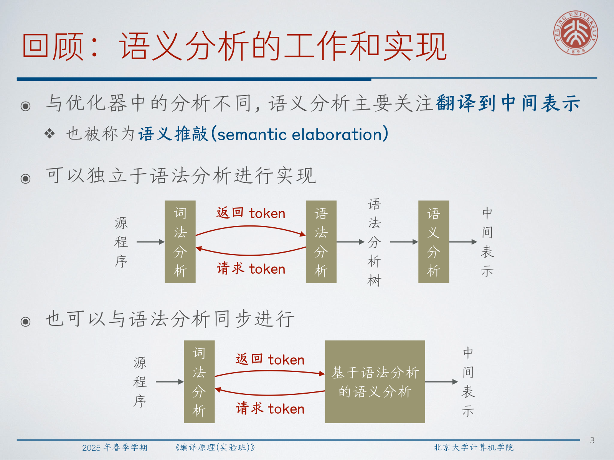

Two implementation styles are worth keeping in mind:

- perform syntax analysis first, build a parse tree or AST, and run semantic analysis as a separate traversal;
- interleave semantic analysis with parsing so that syntax and semantics are processed together.

The rest of the lecture explains how to make the second style systematic, including bottom-up attribute evaluation, translation schemes, and generated table-driven implementations.

## 2. Bottom-Up Semantic Analysis for S-Attributed Grammars

The easiest attribute grammars to combine with bottom-up parsing are S-attributed grammars, because they use only synthesized attributes. Information flows from children to parents, which matches the direction of reduction.

For the bracket grammar:

```text
[0] S' -> S EOF
[1] S  -> epsilon
[2] S  -> [ S1 ] S2
```

we can synthesize the number of matched bracket pairs with:

$$
S'.cnt = S.cnt
$$

$$
S.cnt = 0
$$

$$
S.cnt = 1 + S_1.cnt + S_2.cnt
$$

During shift-reduce parsing, each nonterminal on the analysis stack stores its synthesized attribute. When a reduction `A -> B1 ... Bk` happens, the parser already has the attributes of `B1 ... Bk` on the stack, so it can compute the attribute of `A` immediately and write it back to the reduced stack slot.

That gives the general bottom-up recipe for S-attributed grammars:

1. shift ordinary grammar symbols as usual;
2. attach synthesized attributes to completed nonterminals on the stack;
3. when reducing, compute the left-hand side attribute from the right-hand side attributes;
4. store the result in the new stack entry.

This is the clean case where parsing order and attribute-flow order agree almost perfectly.

## 3. Inherited Attributes in Bottom-Up Parsing

L-attributed grammars are harder because they allow inherited attributes, and inherited information often flows top-down or left-to-right rather than bottom-up. At first glance this looks incompatible with shift-reduce parsing.

The key observation is that if the original grammar is LL, then when a bottom-up parser shifts symbols from left to right, it can still know enough to simulate the expansion decisions that an LL parser would have made. That makes it possible to reserve stack positions where inherited attributes can be stored before the future reduction occurs.

For the same bracket language, we can count nesting depth using inherited and synthesized attributes:

$$
S.i = 0
$$

$$
S.s = S.i
$$

$$
S_1.i = S.i + 1
$$

$$
S_2.i = S_1.s
$$

$$
S.s = S_2.s
$$

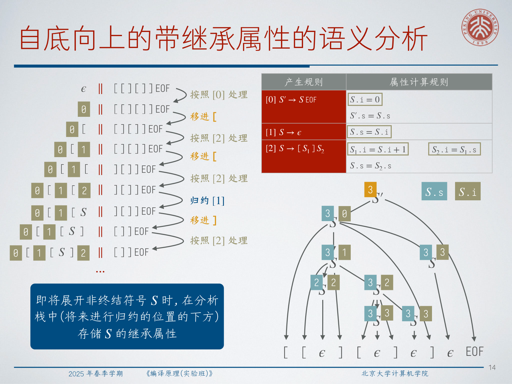

The lecture's trick is to treat the stack as a place where future inherited attributes can be parked. Right before a nonterminal will later be reduced, the parser stores the inherited attribute at a statically known offset below that future reduction point.

:::remark 📝 Question: how can inherited attributes be handled in bottom-up parsing when their information seems to flow top-down?
The question is: **if inherited attributes naturally depend on parent or left-sibling information, how can a shift-reduce parser compute them early enough?** The answer is to use the fact that an LL-like expansion decision is already determined by the left-to-right context. Once the parser knows which nonterminal occurrence will be expanded, it can store the needed inherited attribute in a stack slot that will be reachable when that occurrence is eventually reduced.
:::

To make these stack locations explicit, the lecture introduces marker nonterminals such as `L`, `M`, and `N`. They do not correspond to source syntax. Instead, they mark places where inherited information should be written.

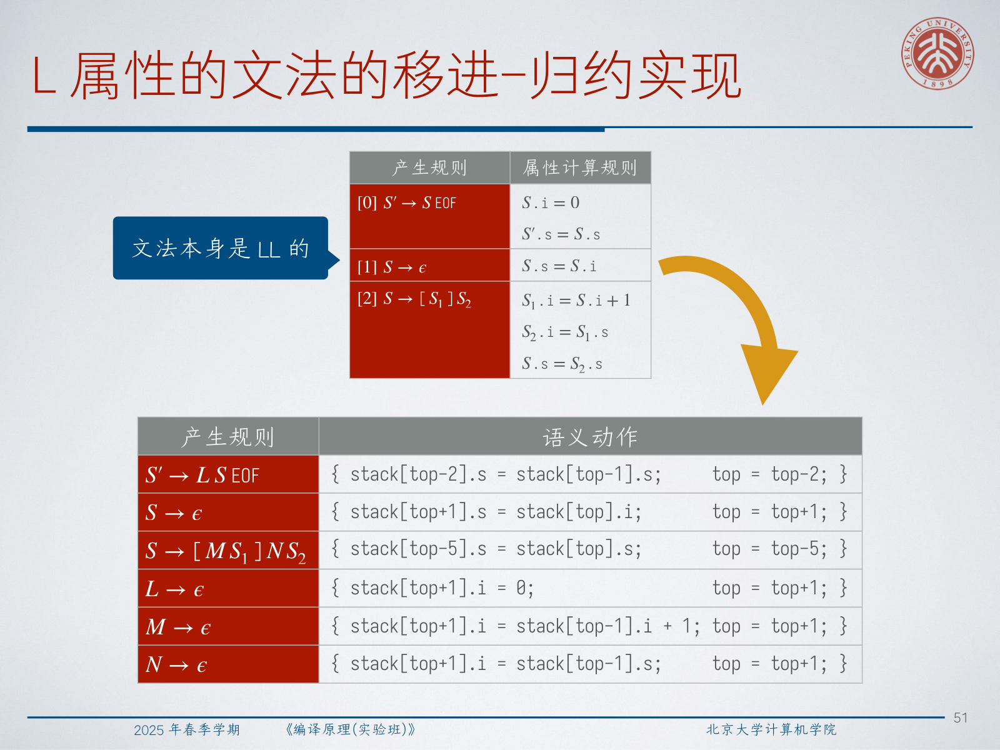

This is slightly unconventional from the viewpoint of pure attribute-grammar notation, but operationally it works well and leads directly to syntax-directed translation schemes.

## 4. From SDD to SDT

An attribute grammar, or **Syntax-Directed Definition (SDD)**, specifies what values must be computed. An **SDT** specifies when to run the corresponding semantic code.

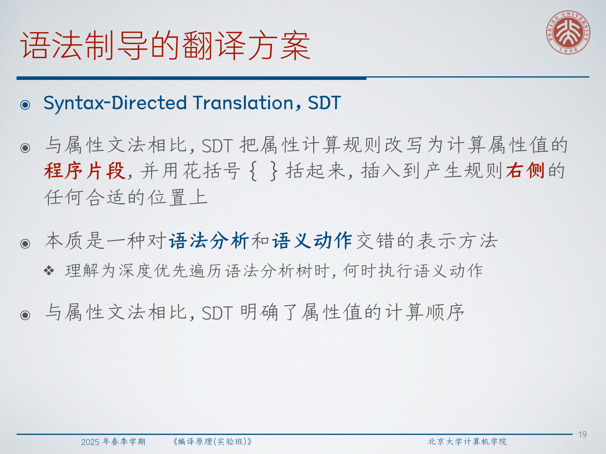

The lecture's definition is precise and worth preserving: **Syntax-Directed Translation, SDT** rewrites attribute computations into program fragments enclosed in braces `{}` and inserts them at appropriate positions on the right-hand side of productions.

Compared with SDD, SDT does two things:

- it turns declarative attribute equations into executable semantic actions;
- it makes the execution order explicit.

An SDT can be understood as a description of where semantic actions should run during a depth-first traversal of the parse tree.

For S-attributed grammars, actions often appear at the far right of productions because all child information is available only after the whole right-hand side has been recognized. For L-attributed grammars, actions may also appear in the middle, right before the symbol whose inherited attribute they prepare.

:::tip 💡 Question: why do we convert SDD into SDT?
The question is: **if attribute equations already tell us what to compute, why introduce semantic actions at all?** Because implementation needs an execution schedule. SDD states dependency constraints, but SDT turns those constraints into concrete action fragments placed at exact execution points during parsing or tree traversal.
:::

The lecture also shows that SDT actions need not only compute attributes. They may produce side effects such as printing translated output.

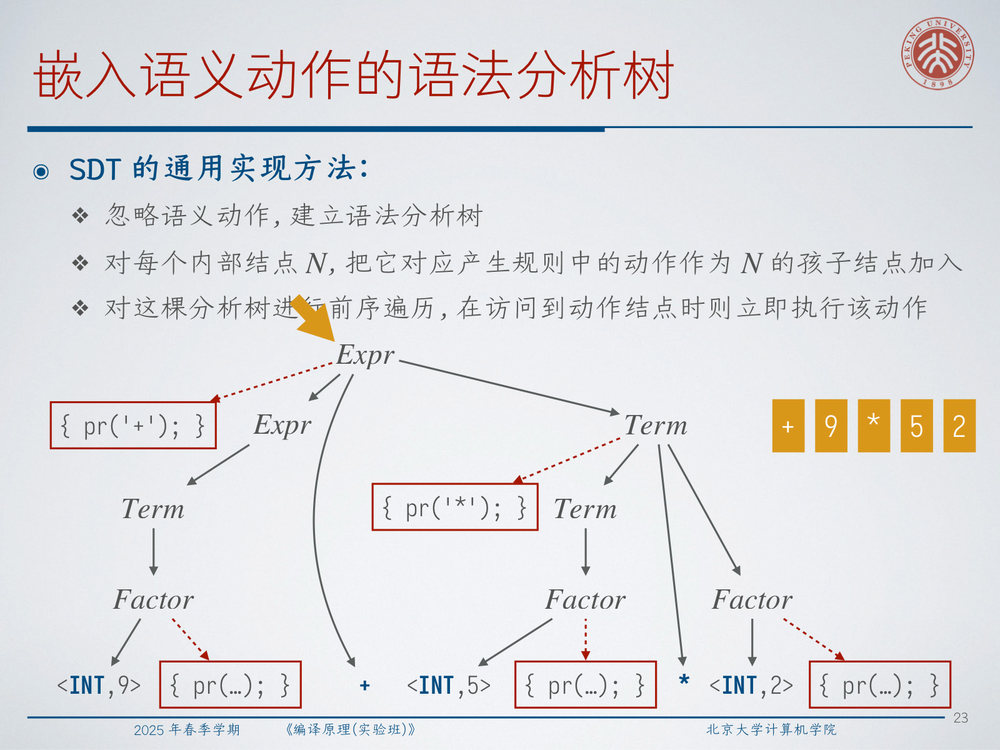

The generic tree-based implementation is:

1. ignore action nodes while building the parse tree;
2. reinsert each action as a child of the corresponding production node;
3. run a preorder traversal;
4. execute a semantic action immediately when its action node is visited.

This picture is useful even when we later move to table-driven parsers, because it explains the intended execution order.

## 5. Table-Driven Semantic Analysis for LL Grammars

A table-driven LL parser normally stores terminals and nonterminals in a stack. To support semantic actions, the stack must hold more than grammar symbols.

The lecture extends the stack with two extra record kinds:

- synthesized records, which store the synthesized attributes of nonterminals;
- action records, which store both the code to run and any attribute values the action will need.

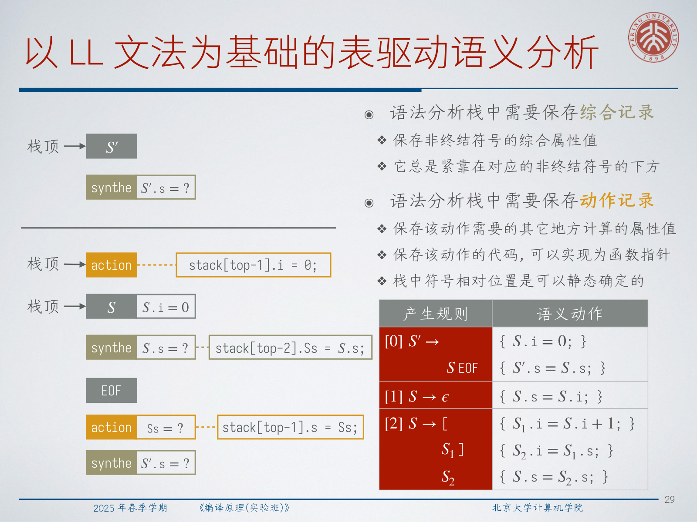

For S- or L-attributed LL grammars, the translation from SDD to SDT follows a simple rule:

- an action that computes the inherited attribute of a nonterminal is inserted immediately before that nonterminal occurrence;
- an action that computes the synthesized attribute of the production's left-hand side is inserted at the far right of the production.

When the parser expands a production `A -> B1 ... Bk`, it pushes the right-hand side in reverse order as usual. The difference is that:

- if `Bi` is a nonterminal, its synthesized record is pushed together with `Bi`;
- if `Bi` is a semantic action `act`, an action record is pushed;
- terminals are pushed normally.

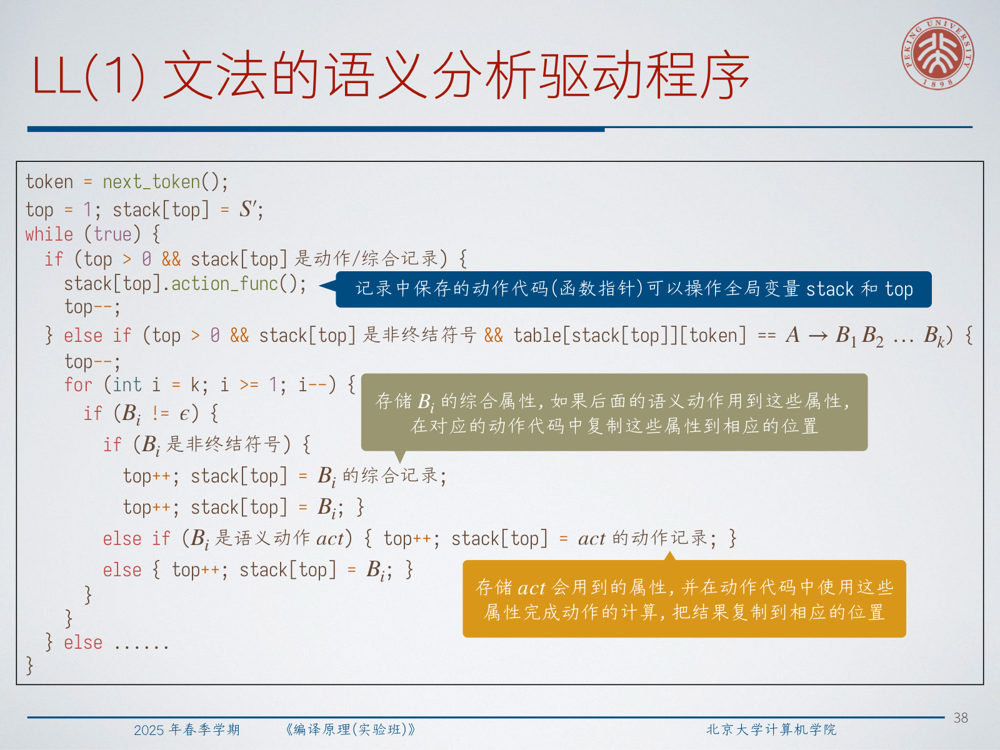

The driver then alternates between grammar processing and semantic processing:

1. if the stack top is an action or synthesized record, execute it and pop it;
2. if the stack top is a nonterminal, consult the LL table and expand it;
3. if the stack top is a terminal matching the current token, consume both;
4. otherwise report an error.

:::tip 💡 Question: how can a table-driven LL parser support semantic actions and inherited attributes?
The question is: **without recursive function calls, where do inherited values live and when are actions executed?** They live in explicit stack records. Action records keep both the code and the copied attribute context they need, while synthesized records keep completed attribute values immediately below their nonterminals.
:::

The beauty of this approach is that the recursive-descent control structure disappears, but the semantic execution order survives in a mechanical form.

## 6. Table-Driven Semantic Analysis for LR Grammars

For LR parsing, the situation is different. A bottom-up parser usually does not know which production it is working on until a reduction happens. That creates an immediate restriction on SDT design.

The lecture's solution is clear: for LR-based table-driven semantic analysis, semantic actions should appear at the far right of productions. Then actions execute exactly at reduction time, when the parser knows which production is being reduced.

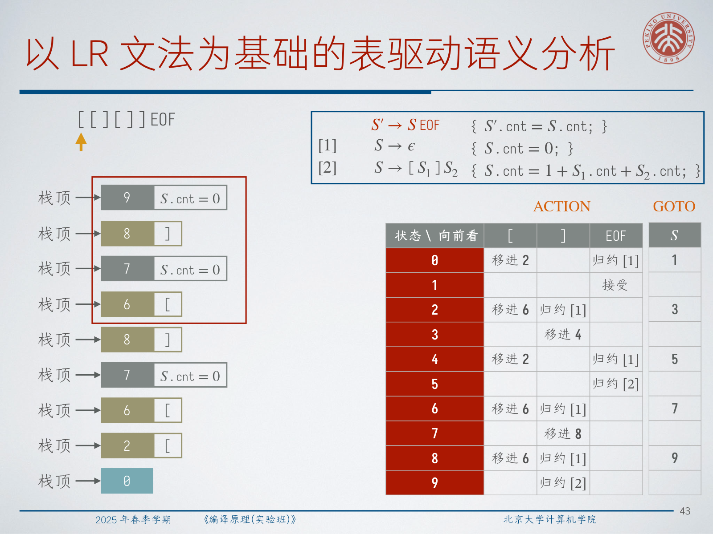

This works naturally for S-attributed grammars:

- shift tokens and states as usual;
- store attributes for completed nonterminals in stack entries;
- when reducing `A -> alpha`, compute the action from the attributes of `alpha`;
- pop the right-hand side, push the `GOTO` state for `A`, and store the synthesized attribute of `A`.

The lecture also shows a more explicit SDT variant where semantic actions directly manipulate `stack` and `top`, making the operational meaning visible.

For L-attributed grammars that start from an LL grammar, the same marker-nonterminal trick from earlier can be compiled into an LR-style SDT with explicit stack operations.

:::warn ⚠️ Question: why must LR-based SDT actions usually be placed at the far right?
The question is: **why can't a bottom-up parser freely execute an action in the middle of a production?** Because before reduction, the parser may not yet know that the current stack fragment belongs to that specific production occurrence. Rightmost actions avoid this uncertainty: by the time a reduction happens, the production is known, all right-hand-side information is present, and the action can run safely.
:::

This is a good example of an engineering constraint shaping the accepted translation style.

## 7. Type Expressions and Type Equivalence

The second half of the lecture shifts from attribute-evaluation mechanics to type systems. A **type expression** is the structured representation of the type of a variable, constant, expression, statement, or other language construct.

The lecture's basic constructors are:

- primitive types such as `bool`, `char`, `int`, `float`, and `void`;
- class names in object-oriented languages;
- array types;
- record types;
- function types;
- Cartesian products, which are useful for tuples and parameter lists;
- variables ranging over type expressions.

Function types and tuple-like products are written as:

$$
s \to t
$$

and:

$$
s \times t
$$

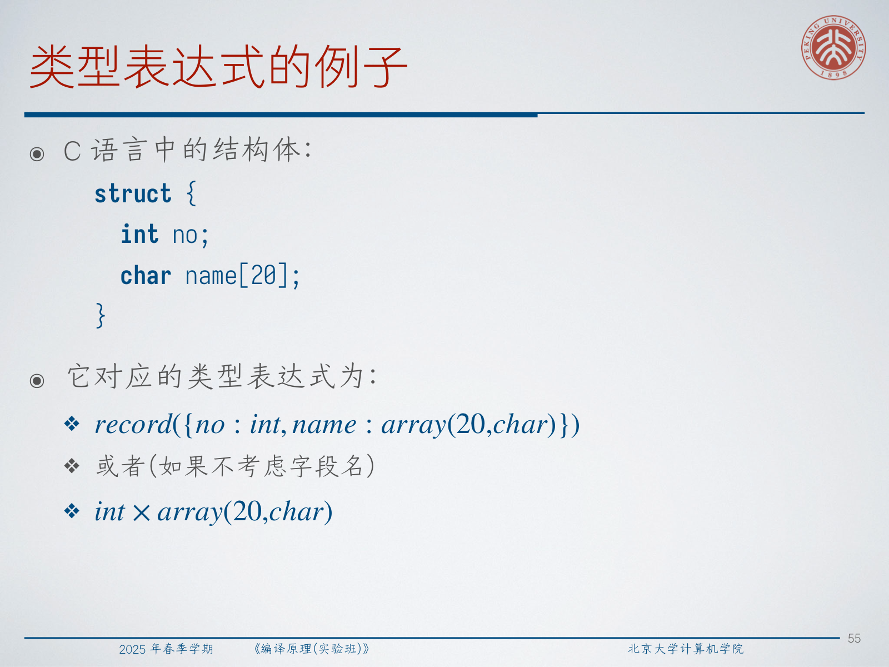

For example, the C fragment:

```c
struct {
  int no;
  char name[20];
}
```

can be represented as:

$$
\operatorname{record}(\{no:int, name:\operatorname{array}(20, char)\})
$$

or, if field names are ignored:

$$
int \times \operatorname{array}(20, char)
$$

Type equivalence asks when two type expressions should count as the same type. The lecture distinguishes two main notions:

- **name equivalence**: types are equal because their names are the same or explicitly declared equivalent;
- **structural equivalence**: types are equal because their internal structure is the same, even if the names differ.

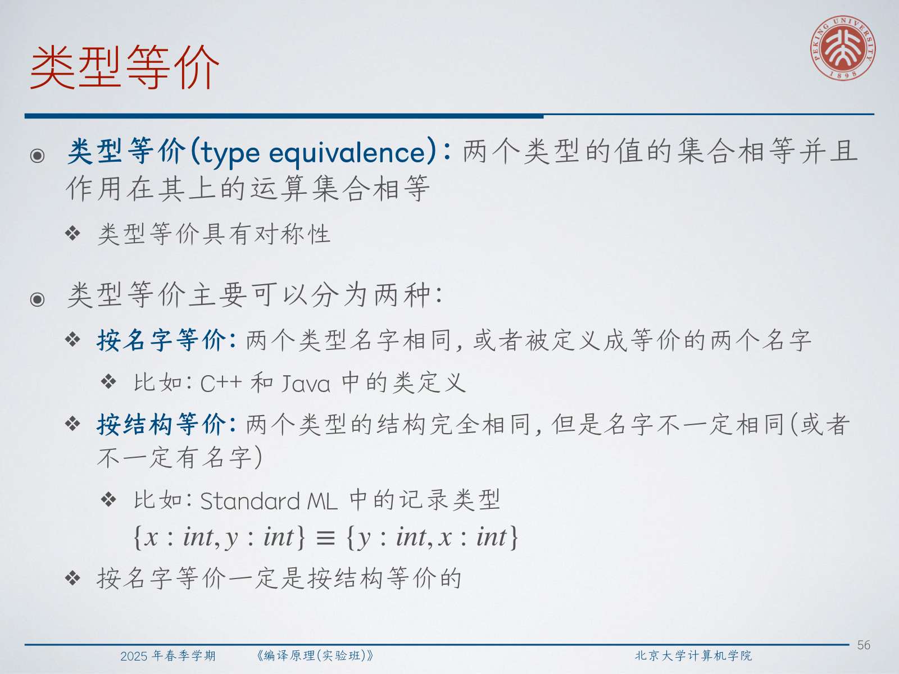

The structural-equivalence example is:

$$
\{x:int, y:int\} \equiv \{y:int, x:int\}
$$

The lecture also emphasizes that name equivalence implies structural equivalence, but not conversely.

## 8. Type Checking, Conversion, Overloading, Inference, and Polymorphism

The lecture defines a **type system** as a collection of type assignments and logical rules that constrain programs. A particularly important word here is **soundness**: the type system rules out some class of runtime type errors.

Type checking rules are divided into two complementary styles:

- **type synthesis**: construct the type of an expression from the types of its parts;
- **type inference**: recover missing types from the way expressions are used.

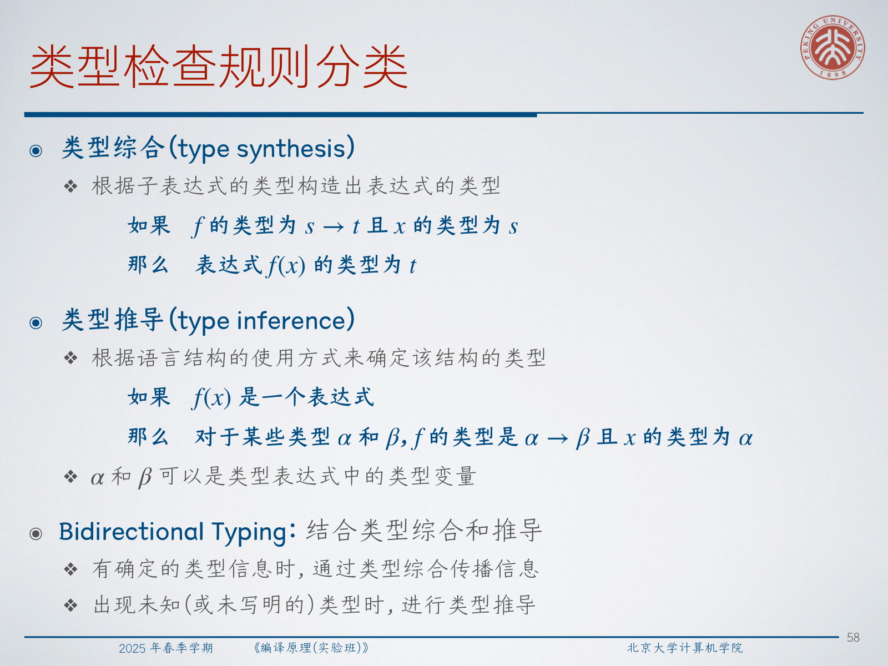

The core synthesis rule is:

If \(f : s \to t\) and \(x : s\), then:

$$
f(x) : t
$$

The corresponding inference view says that if `f(x)` is an expression, then for some types `alpha` and `beta`:

$$
f : \alpha \to \beta,\quad x : \alpha
$$

Bidirectional typing combines the two: synthesize where type information is explicit, and infer where it is missing.

The lecture also reviews implicit and explicit numeric conversions.

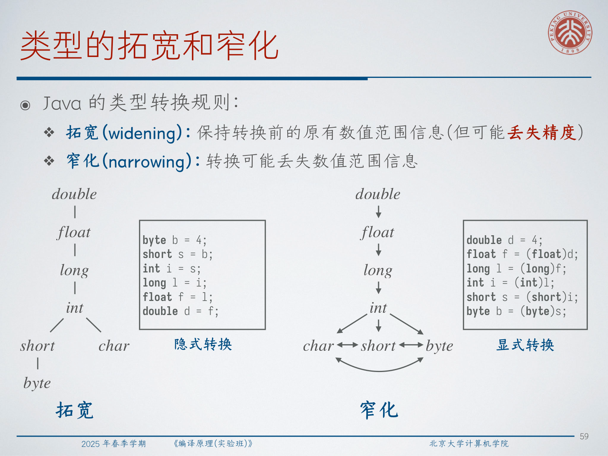

In Java-style terminology:

- **widening** preserves the original numeric range information, though precision may be lost;
- **narrowing** may lose range information and therefore usually requires an explicit cast.

Overloading adds another twist: the meaning of a symbol depends on context.

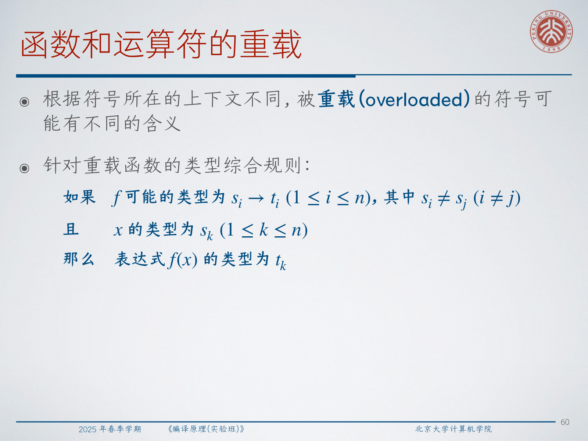

If \(f\) may have types \(s_i \to t_i\) for \(1 \le i \le n\), with \(s_i \ne s_j\) for \(i \ne j\), and \(x : s_k\), then:

$$
f(x) : t_k
$$

Type inference addresses the annotation burden of typed languages.

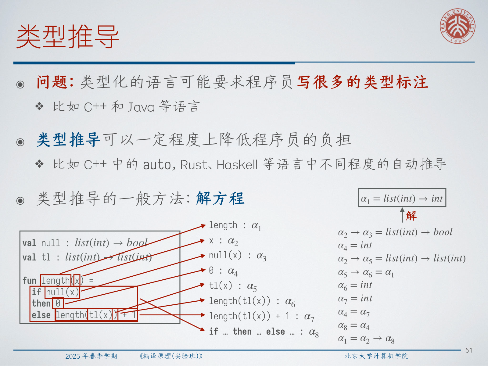

For the example:

```text
val null : list(int) -> bool
val tl   : list(int) -> list(int)
fun length(x) =
  if null(x)
  then 0
  else length(tl(x)) + 1
```

the lecture introduces type variables `alpha_1` through `alpha_8` for subexpressions and derives equations such as:

$$
\alpha_2 \to \alpha_3 = list(int) \to bool
$$

$$
\alpha_2 \to \alpha_5 = list(int) \to list(int)
$$

$$
\alpha_1 = \alpha_2 \to \alpha_8
$$

Solving the full system gives:

$$
\alpha_1 = list(int) \to int
$$

:::remark 📝 Question: typed languages often require many annotations. How does inference reduce that burden?
The question is: **if typed languages are safer, why do programmers still complain about them?** Because explicit annotations can be verbose. Type inference turns missing annotations into unknowns, generates equations from program structure, and solves those equations to recover the most likely types consistent with the program.
:::

The final step is parametric polymorphism.

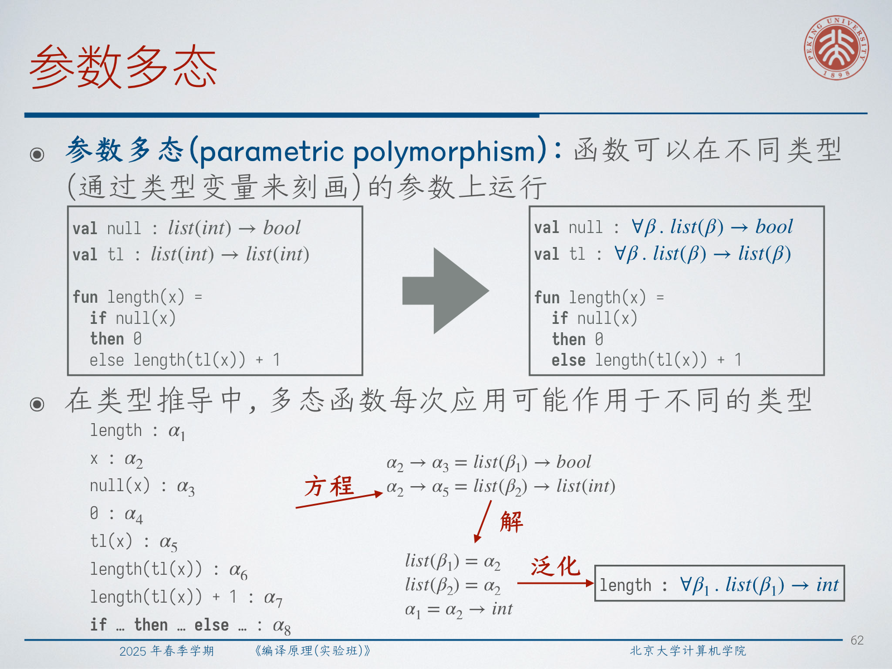

Instead of fixing:

$$
list(int) \to bool
$$

and:

$$
list(int) \to list(int)
$$

we generalize them to:

$$
\forall \beta.\ list(\beta) \to bool
$$

and:

$$
\forall \beta.\ list(\beta) \to list(\beta)
$$

Then the inferred function becomes:

$$
length : \forall \beta_1.\ list(\beta_1) \to int
$$

:::tip 💡 Question: why does polymorphism require generalization after solving equations?
The question is: **once we solved the local constraints, why isn't that enough?** Because a polymorphic function must be reusable at many concrete types. Solving equations inside one occurrence gives a specific instance. Generalization packages the result into a universally quantified schema so later applications can instantiate it differently.
:::

## 9. Why Type Systems Matter

The lecture closes with a compact historical and design argument.

Early B was essentially untyped: parameters were untyped, functions had no return-type declarations, external functions had no signatures, and even `auto` only meant "reserve storage". That made compile-time checking weak and pushed more responsibility to runtime behavior.

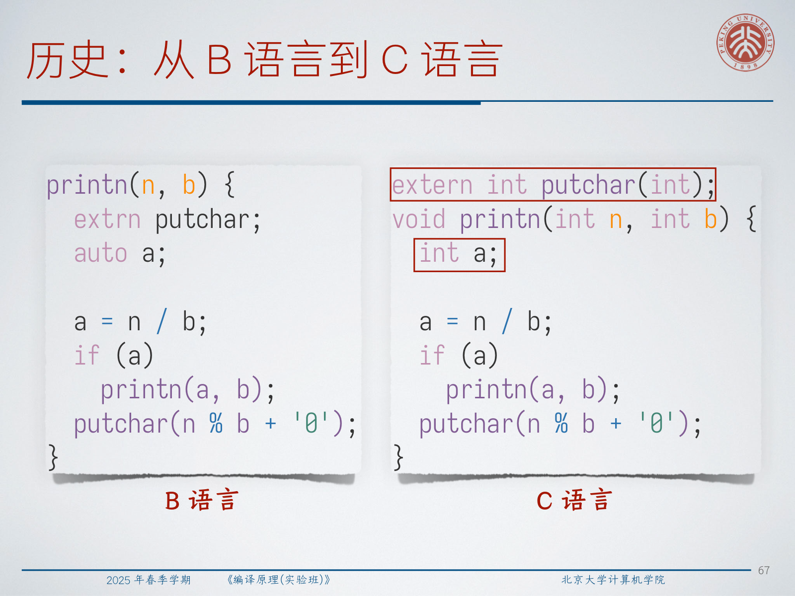

The move to C added explicit parameter types, return types, local variable types, and function signatures such as:

```c
extern int putchar(int);
void printn(int n, int b) { ... }
```

That change improved both safety and performance. The lecture ends by summarizing why type systems are valuable:

- they catch errors, such as signature mismatches and nonsensical operations;
- they serve as documentation;
- they enable optimization by removing unnecessary runtime checks and informing layout decisions;
- they improve language safety;
- they support abstraction mechanisms such as typed generics, object-oriented programming, and functional programming.

The final design lesson is broader than compiler implementation: language design and type-system design should proceed together. An untyped language can easily accumulate features that are difficult to check soundly later, while a typed language needs syntax that makes type annotations and type-directed structure clear.

## 10. Exam Review

### Key definitions

- **semantic elaboration**: translation from parsed syntax to a more explicit semantic or intermediate representation.
- **S-attributed grammar**: an attribute grammar that uses only synthesized attributes.
- **L-attributed grammar**: an attribute grammar where each inherited attribute depends only on the parent and symbols to the left.
- **Syntax-Directed Definition (SDD)**: a declarative attribute-grammar specification.
- **Syntax-Directed Translation (SDT)**: **attribute computations rewritten as executable semantic actions inserted into productions**.
- **type expression**: a structured representation of the type of a program construct.
- **type equivalence**: equality of types either by name or by structure.
- **type synthesis**: **construct the type of an expression from the types of its subexpressions**.
- **type inference**: recover types from usage constraints.
- **soundness**: guarantee that a certain class of runtime type errors does not happen.
- **parametric polymorphism**: the ability of one function to work over many types described by type variables.

### Mechanisms to be able to explain

1. Why synthesized attributes fit bottom-up parsing naturally.
2. How inherited attributes can be stored in future stack positions for bottom-up parsing.
3. How marker nonterminals make an L-attributed LL grammar operationally LR-like.
4. Why SDT is an execution-order refinement of SDD.
5. How LL table-driven parsing stores synthesized records and action records.
6. Why LR table-driven parsing prefers rightmost semantic actions.
7. How type expressions represent arrays, records, function types, and tuples.
8. The difference between name equivalence and structural equivalence.
9. The difference between type synthesis and type inference.
10. How solving type equations yields inferred function types.
11. Why polymorphic inference requires generalization.
12. Why the historical move from B to C supports the case for static types.

### Short-answer templates

- **Inherited attributes in bottom-up parsing**: say that the parser uses known left-to-right context to reserve stack slots for future inherited values, often via marker nonterminals.
- **Why SDT?**: say that SDT makes attribute-evaluation order executable by placing action fragments at specific points in productions.
- **LL semantic driver**: mention synthesized records, action records, and executing them when they reach stack top.
- **LR semantic driver**: mention reduction-time certainty about the production, then explain why rightmost actions are safe.
- **Type synthesis rule**: if `f : s -> t` and `x : s`, then `f(x) : t`.
- **Type inference**: replace missing types with variables, derive equations from structure, solve, then generalize if polymorphism is needed.

### Common mistakes

- Assuming inherited attributes cannot be handled bottom-up at all. They can, but stack layout must be arranged carefully.
- Treating SDT as merely "SDD with code". The essential difference is that SDT also fixes execution order.
- Forgetting that LL table-driven semantic analysis needs explicit action records, not just nonterminal symbols.
- Putting arbitrary middle actions into an LR translation scheme without ensuring the parser knows which production is in progress.
- Confusing structural equivalence with name equivalence.
- Calling every automatic type assignment "type synthesis" when some cases are true inference from unknowns.
- Solving type equations but forgetting to generalize the result for polymorphic reuse.

### Self-check

- Can you explain where an inherited attribute is stored on the stack before the corresponding nonterminal is reduced?
- Can you translate an SDD rule into an SDT action placement?
- Can you explain why `record({no:int,name:array(20,char)})` and `int × array(20,char)` describe the same struct at different abstraction levels?
- Can you state the rule for overloaded function typing?
- Can you explain why `length` becomes `forall beta. list(beta) -> int` rather than only `list(int) -> int`?
