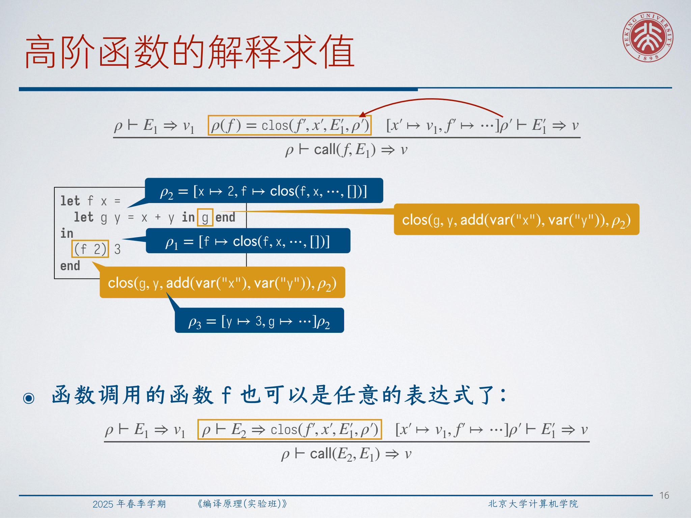
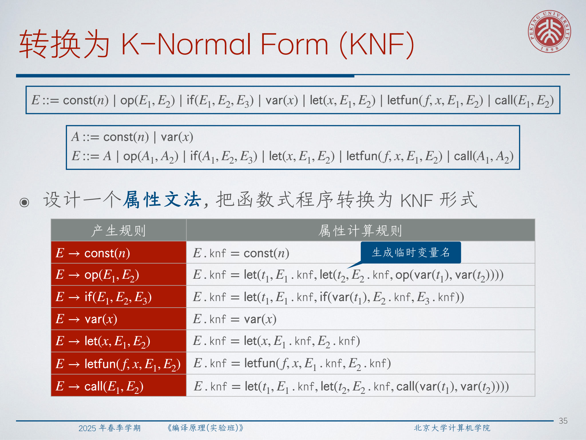
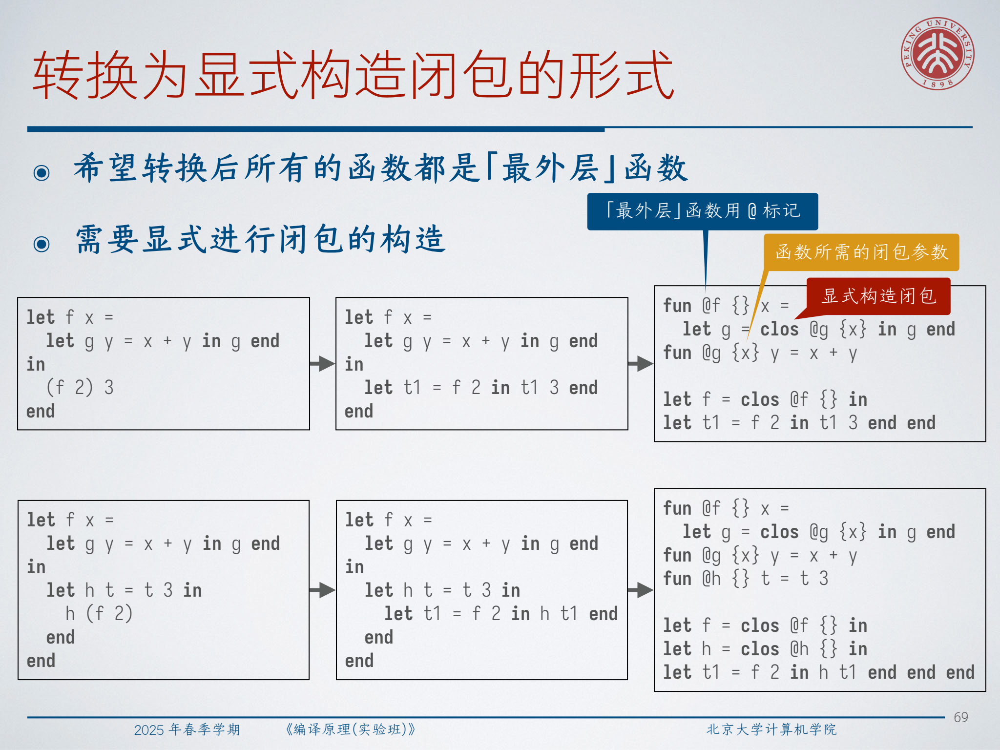
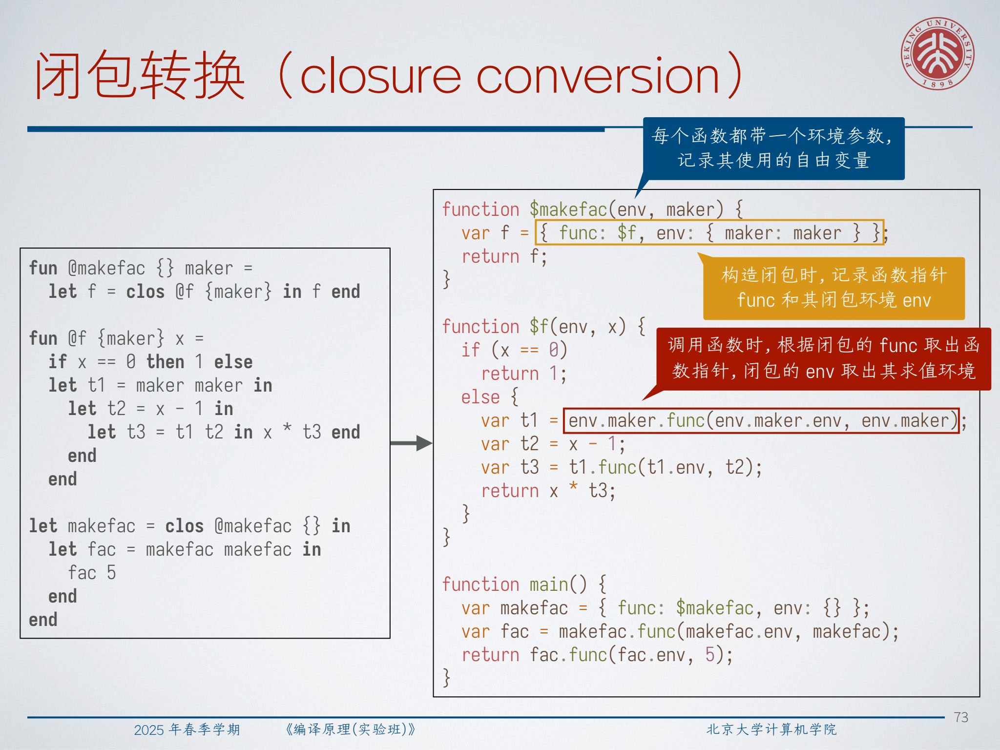

# Lec11: Compilation of Functional Languages

## 1. Why Functional-Language Compilation Needs Extra Machinery

This lecture studies a tiny functional language, `micro-ML`, and uses it to explain what changes when functions are no longer just named top-level procedures. Once a language has nested functions, higher-order values, and lexical scope, the compiler must answer three harder questions:

- where does a function get the values of its free variables;
- how should we represent functions before lowering to ordinary low-level code;
- which optimizations still work once function values start flowing through the program.

The lecture follows a clean path:

1. define the dynamic meaning of `micro-ML`;
2. introduce several normal forms as middle-end IRs;
3. convert source programs into those IRs;
4. make closures explicit;
5. run classic optimizations on the resulting ANF program.

The big picture is that functional compilation is still about exposing control flow and data flow, but it must first make **scope**, **evaluation order**, and **captured environments** explicit.

## 2. The `micro-ML` Core: Expressions, Environments, and Evaluation

The starting point is a pure expression language:

```text
Exp ::= const(n)
      | op(Exp1, Exp2)
      | if(Exp1, Exp2, Exp3)
      | var(x)
      | let(x, Exp1, Exp2)
```

To evaluate an expression with free variables, we need an **environment** `ρ`, a mapping from variables to values. Two conventions matter throughout the lecture:

- `[]` is the empty environment;
- `[x ↦ v]ρ` extends `ρ` with a new binding, and the most recent binding shadows older ones.

That immediately explains why `let` is not mere textual substitution. `let` changes the runtime environment in which the body is evaluated.

The lecture first presents attribute-style evaluation:

$$
E \to const(n):\quad E.val = n
$$

$$
E \to var(x):\quad E.val = E.\rho(x)
$$

$$
E \to op(E_1, E_2):\quad E_1.\rho = E.\rho,\ E_2.\rho = E.\rho,\ E.val = f_{op}(E_1.val, E_2.val)
$$

$$
E \to if(E_1, E_2, E_3):\quad E_1.\rho = E.\rho,\ E_2.\rho = E.\rho,\ E_3.\rho = E.\rho
$$

$$
E.val = E_1.val\ ?\ E_2.val\ :\ E_3.val
$$

$$
E \to let(x, E_1, E_2):\quad E_1.\rho = E.\rho,\ E_2.\rho = [x \mapsto E_1.val]E.\rho,\ E.val = E_2.val
$$

The same semantics is then rewritten as a big-step judgment:

$$
\rho \vdash E \Rightarrow v
$$

This notation is more convenient later because recursion and closures fit naturally into inference rules.

:::remark 📝 Question: why do we need an environment at all instead of just recursively evaluating syntax?
The real question is: **where does the value of a free variable come from at runtime?** A syntax tree alone does not answer that. The environment records the current bindings of free variables, and `let` changes that mapping before evaluating its body. Once nested scopes appear, keeping the environment explicit becomes essential.
:::

## 3. First-Order Functions: Lexical Scope and Recursion

The first extension adds **first-order functions**, where arguments and results are still scalar values:

```text
Exp ::= ... | letfun(f, x, E1, E2) | call(f, E1)
```

At this stage, the called function is still named directly, so the evaluator can keep a mapping from function names to function definitions. Even here, two issues already appear.

First, the language uses **lexical scope**. In a nested definition such as:

```text
let f x =
  let g y = x + y in g(2 * x) end
in
  f 7
end
```

the inner function `g` refers to the surrounding `x`. The meaning of `g` therefore depends on the environment in which it was defined, not only on its own parameter.

Second, recursion needs a self-reference. In the recursive pattern

```text
let f x =
  if x == 0 then 1 else 2 * f(x - 1)
in
  f 2
end
```

the body of `f` must be evaluated in an environment where `f` itself is available. That is why the recursive call rule extends the function environment with a binding for the function being defined.

:::remark 📝 Question: is it enough to record a function only as `fun(f, x, E1)`?
No. That representation loses two things the evaluator needs. **Lexical scope** is lost because free variables in `E1` no longer know where their values came from, and **recursion** is lost unless the function body is evaluated in an environment where `f` is bound to itself. This is the point where plain syntax stops being enough.
:::

## 4. Higher-Order Functions Force Us to Introduce Closures

Once functions become values, parameters and results may themselves be functions:

```text
let f x =
  let g y = x + y in g end
in
  (f 2) 3
end
```

Here `f 2` returns a function, and that returned function still needs access to `x = 2`. This is the moment where the compiler must move from raw function syntax to **closures**.

A closure stores:

- the code pointer of the function;
- its ordinary parameter;
- the function body;
- the environment captured at definition time.

The lecture writes a closure value as:

$$
clos(f, x, E_1, \rho)
$$

Then `letfun` no longer means “store a function declaration”; it means “create a closure now”:

$$
[f \mapsto clos(f, x, E_1, \rho)]\rho \vdash E_2 \Rightarrow v
$$

For function application, the evaluator first gets the argument value, then gets the callee closure, and finally runs the function body in the **captured** environment extended with the actual argument and the function itself:

$$
\rho \vdash E_1 \Rightarrow v_1
$$

$$
\rho \vdash E_2 \Rightarrow clos(f', x', E_1', \rho')
$$

$$
[x' \mapsto v_1,\ f' \mapsto clos(f', x', E_1', \rho')]\rho' \vdash E_1' \Rightarrow v
$$

$$
\rho \vdash call(E_2, E_1) \Rightarrow v
$$



This explains why `(f 2) 3` evaluates correctly: `f 2` returns a closure whose captured environment still remembers `x = 2`, so calling that closure on `3` yields `2 + 3 = 5`.

:::tip 💡 Question: can higher-order functions simulate recursion even if the language does not have a built-in recursive function form?
Yes. The lecture's `makefac maker` example uses **self-application** (`maker maker`) to recover recursive behavior. The key idea is that recursion can be encoded as a higher-order pattern: instead of naming the recursive function directly, pass around a function capable of rebuilding the next recursive call.
:::

## 5. Why Earlier Three-Address IRs Are Not Enough

Earlier low-level IRs such as plain three-address code mainly simplify nested arithmetic structure. That is not enough for functional programs, because functional compilation also has to preserve:

- function values;
- nested scopes;
- higher-order calls;
- explicit evaluation order before closure conversion.

So before lowering to a backend-style IR, the compiler introduces function-aware normal forms. The lecture uses three of them:

- **KNF**: expose all operator operands and branch conditions as atoms;
- **ANF**: additionally expose the middle part of `let ... in`;
- **CPS**: represent “the rest of the computation” explicitly as continuations.

These are not three unrelated notations. They are three ways of making control and data dependencies progressively more explicit.

## 6. K-Normal Form (KNF)

**K-Normal Form** keeps `let` nesting flexible, but requires operation operands, call operands, and branch conditions to be atomic:

```text
A ::= const(n) | var(x)
E ::= A
    | op(A1, A2)
    | if(A1, E2, E3)
    | let(x, E1, E2)
    | letfun(f, x, E1, E2)
    | call(A1, A2)
```

The motivation is simple: any nontrivial computation must first be named by a temporary before it can be used as an operand or condition.

For example:

```text
if (x - 11) == 0 then y + 2 else y / 3
```

becomes:

```text
let t1 = x - 11 in
  let t2 = t1 == 0 in
    if t2 then y + 2 else y / 3
  end
end
```



The lecture gives an attribute-grammar style conversion:

$$
E.knf = const(n),\quad E.knf = var(x)
$$

$$
E.knf = let(x, E_1.knf, E_2.knf)
$$

$$
E.knf = letfun(f, x, E_1.knf, E_2.knf)
$$

$$
E.knf = let(t_1, E_1.knf,\ let(t_2, E_2.knf,\ op(var(t_1), var(t_2))))
$$

$$
E.knf = let(t_1, E_1.knf,\ if(var(t_1), E_2.knf, E_3.knf))
$$

$$
E.knf = let(t_1, E_1.knf,\ let(t_2, E_2.knf,\ call(var(t_1), var(t_2))))
$$

The only extra engineering requirement is fresh temporary generation.

## 7. A-Normal Form (ANF)

**A-Normal Form** goes one step further. Not only must operands be atomic; the expression bound in `let x = ... in` must itself be a simple computation `C`.

The improved ANF used in the lecture is:

```text
A ::= const(n) | var(x)
C ::= A | op(A1, A2) | call(A1, A2) | if(A1, E2, E3)
E ::= C | let(x, C1, E2) | letfun(f, x, E1, E2)
```

This means:

- every complex computation is named exactly once by a `let`;
- operands are atomic;
- branch conditions are atomic;
- `if` itself is treated as a complex expression `C`, so it may appear on the right-hand side of `let`.

That last point is crucial. A more naive ANF grammar keeps `if` outside `C`, but then any continuation after an `if` must be duplicated into both branches. Repeating that pattern recursively can make code size grow exponentially.


:::warn ⚠️ Question: why is the improved ANF grammar willing to treat `if` as a `C` expression?
Because otherwise the computation after the `if` must be copied into both branches. **ANF is supposed to expose evaluation order, not explode program size.** Letting `if(A1, E2, E3)` count as a `C` means the surrounding continuation can stay outside the branches instead of being duplicated.
:::

## 8. CPS as Both Programming Style and IR

The lecture introduces **Continuation-Passing Style (CPS)** with a behavioral slogan:

**a function call never returns to its caller; instead it sends its result to an explicit continuation.**

That changes ordinary code like:

```text
id(x) = x
```

into CPS-style code like:

```text
id(x, ret) = ret(x)
```

In CPS:

- every function gains one or more continuation parameters;
- recursive calls become tail calls;
- the rest of the computation becomes an explicit function value.

As an IR, the lecture uses:

```text
A ::= const(n) | var(x)
C ::= A | op(A1, A2)
E ::= C
    | if(A1, E2, E3)
    | let(x, C1, E2)
    | letfun(f, x1, ..., xn, E1, E2)
    | call(A0, A1, ..., An)
```

The important structural properties are:

- no nested operands;
- only tail-recursive function calls;
- explicit continuation arguments.

That is why CPS connects naturally to SSA-like control flow. For first-order programs, a tail call begins to look like a parameterized `goto`.

:::remark 📝 Question: what is a continuation, operationally?
A continuation is simply **the rest of the computation**. If a function would normally “return and then continue doing something,” CPS packages that “something” as an explicit callback. This is why CPS is also familiar in asynchronous programming and exception handling: success and failure flows are both turned into explicit next steps.
:::

## 9. From Source Programs to KNF and ANF

The KNF transformation is straightforward because it only needs synthesized structure: recursively normalize each subexpression, then insert fresh temporaries whenever an operand must become atomic.

ANF is subtler because it must also control **where the result of the current expression will be used**. The lecture's solution is to use a continuation-like inherited parameter `k` in a normalization function:

```text
normalize(e, k)
```

Here `k` is not a runtime continuation. It is a meta-level function describing the surrounding ANF context waiting for the result of `e`.

The key cases are:

- atoms are passed directly to `k`;
- `op` and `call` normalize their subexpressions, bind temporaries if needed, then pass a simple `C` expression to `k`;
- `let x = e1 in e2` first normalizes `e1`, then builds the ANF `let`, then continues with `e2`;
- `if` normalizes only the condition first, and then passes the whole `if(...)` as a `C` to `k`;
- function bodies are normalized with the identity continuation rather than the outer `k`.

That yields the crucial discipline:

- **do not apply the same outer `k` separately to both branches of an `if`**;
- **do not thread the outer context through a nested function body**.

For the running recursive example:

```text
let f x =
  let y =
    if x == 0 then 1 else x * f (x - 1)
  in
    (y + 2) / 5
  end
in
  f 7
end
```

the final ANF is:

```text
let f x =
  let t1 = x == 0 in
    let y =
      if t1 then 1 else
        let t2 = x - 1 in
          let t3 = f t2 in
            x * t3
          end
        end
    in
      let t4 = y + 2 in
        t4 / 5
      end
    end
in
  f 7
end
```

This example shows what ANF is really buying us: every intermediate result that matters to later evaluation has a name, and every use site now makes evaluation order explicit.

## 10. Closure Conversion: Making Functions Top-Level Again

ANF still allows nested functions and higher-order values. A backend usually prefers a program where functions live at the top level and environment capture is explicit. That is the purpose of **closure conversion**.

The source ANF fragment is:

```text
A ::= const(n) | var(x)
C ::= A | op(A1, A2) | call(A1, A2) | if(A1, E2, E3)
E ::= C | let(x, C1, E2) | letfun(f, x, E1, E2)
```

After closure conversion, the lecture uses:

```text
A ::= const(n) | var(x)
C ::= A | op(A1, A2) | call(A1, A2) | if(A1, E2, E3)
E ::= C | let(x, C1, E2) | letclos(f, @ell, {A1, ..., Am}, E2)
P ::= E | fun(@ell, {y1, ..., ym}, x, E), P
```

For each occurrence of:

```text
letfun(f, x, E1, E2)
```

the compiler:

1. generates a fresh top-level function label `@ell`;
2. computes the free variables `y1, ..., ym` of `E1`;
3. emits a top-level function `fun(@ell, {y1, ..., ym}, x, E1)`;
4. replaces the original binding site with `letclos(f, @ell, {y1, ..., ym}, E2)`.




This makes the hidden structure fully explicit:

- top-level code pointer;
- captured free-variable tuple;
- explicit closure allocation.

At runtime, each closure can then be implemented as a pair like:

```text
{ func: ..., env: ... }
```

and each compiled function receives an extra environment parameter:

```text
function $f(env, x) { ... }
```

Calls become:

```text
t.func(t.env, arg)
```



The lecture also mentions a useful optimization: if the compiler knows the exact callee and the function has no free variables, it may avoid allocating a closure object at all.

:::tip 💡 Question: why does closure conversion insist on turning nested functions into top-level functions?
Because the backend wants code addresses to be ordinary global function labels, while lexical scope wants access to nonlocal variables. Closure conversion separates those concerns: **the code becomes top-level, and the captured environment becomes explicit data**. After that, later compilation stages can treat function code and function data independently.
:::

## 11. Classic Optimizations on ANF

ANF is especially friendly to local equational optimizations because every interesting computation already has a name. The lecture reviews four standard passes.

### 11.1 Copy Propagation

For:

```text
let x = y in exp end
```

replace uses of `x` in `exp` by `y`. A convenient formalization uses an inherited map `σ` from variables to variables.

The core idea is:

$$
A.anf = var(\sigma(x))
$$

and when a binding is a pure copy, extend the map:

$$
E_2.\sigma = [x \mapsto y]E.\sigma
$$

### 11.2 Constant Propagation and Constant Folding

For:

```text
let x = INT in exp end
```

replace uses of `x` by that constant. If both operands of an operation are constants, evaluate it immediately:

$$
const(n_1)\ op\ const(n_2)\ \Rightarrow\ const(f_{op}(n_1, n_2))
$$

This uses a map `σ` from variables to constants and removes bindings once the variable no longer denotes a known constant.

### 11.3 Common Subexpression Elimination

For:

```text
let x = a op b in exp end
```

replace later occurrences of the same expression `a op b` by `x`. The lecture models this with a map from expressions to variables.

This optimization is powerful, but it depends on scope discipline. If `a` or `b` are variables, later shadowing can invalidate the match. That is why the lecture recommends alpha-renaming variables first so that all bound names become distinct.

### 11.4 Dead Code Elimination

For:

```text
let x = ... in exp end
```

if `x` does not occur among the free variables of `exp`, the entire binding can be removed.

The analysis uses a synthesized free-variable set `fv`:

$$
A.fv = \varnothing \text{ for } const(n),\qquad A.fv = \{x\} \text{ for } var(x)
$$

$$
E.anf = x \in E_2.fv\ ?\ let(x, C_1.anf, E_2.anf)\ :\ E_2.anf
$$

The same idea applies to function bindings: if `f` is not used in the remainder of the program, the `letfun` can disappear as well.

The lecture shows how these passes compose on ANF. For example:

```text
let y = 4 in
  let z = y in
    let t1 = x + y in
      let t2 = x + z in
        t1 * t2
      end
    end
  end
end
```

can be simplified step by step into:

```text
let t1 = x + 4 in
  t1 * t1
end
```

That chain mixes copy propagation, constant propagation, common subexpression elimination, and dead code elimination in exactly the order a middle end likes.

:::warn ⚠️ Question: what is the main caveat when applying these ANF optimizations mechanically?
Variable shadowing. A replacement that is valid before a rebinding may become invalid after it. This matters especially for copy propagation and common subexpression elimination. A simple and effective defense is to alpha-rename the program first so that different bindings never reuse the same variable name.
:::

## 12. Exam Review

### Key definitions

- **environment**: a runtime mapping from variables to values.
- **lexical scope**: a variable occurrence refers to the binding from the surrounding program text where the function was defined.
- **closure**: **a function together with the environment needed to evaluate its free variables**.
- **KNF**: a normal form where operands and branch conditions are atomic, while `let` may still nest freely.
- **ANF**: a normal form where every nontrivial computation is named by `let`, and the bound expression is a simple `C`.
- **CPS**: **a style where results are passed to explicit continuations instead of returning normally**.
- **closure conversion**: rewriting nested functions into top-level functions plus explicit closure construction.
- **copy propagation**: replace aliases by their source variables.
- **constant propagation / folding**: push known constants through the program and evaluate constant operations early.
- **common subexpression elimination**: reuse a previously computed equivalent expression.
- **dead code elimination**: remove bindings whose results are never used.

### Short-answer templates

- **Why are closures necessary?**  
  Because a nested or returned function may use free variables from its definition site, so the function value must carry its captured environment.

- **Why do we need KNF or ANF before lower-level IR?**  
  Because they expose evaluation order, make operands simple, and prepare higher-order code for closure conversion and optimization.

- **Why does naive ANF risk exponential code growth?**  
  Because the continuation after an `if` gets duplicated into both branches; nesting repeats that duplication.

- **What does closure conversion do?**  
  It extracts free variables, creates a top-level function label, and replaces nested function bindings with explicit closure construction.

- **Why is ANF good for optimization?**  
  Because every important intermediate result already has a name, so local equalities and unused bindings are easy to detect.

### Common mistakes

- treating a function value as if its code alone determined its meaning;
- forgetting that recursive function bodies need a self-binding;
- duplicating the outer continuation across ANF branches;
- ignoring shadowing when doing substitution-based optimizations;
- assuming higher-order functions can be lowered directly to plain three-address code without an intermediate closure-aware stage.

### Self-check list

- Can you explain the difference between a function definition and a closure value?
- Can you convert a nested expression into KNF by introducing temporaries?
- Can you explain why improved ANF allows `if` inside the right-hand side of `let`?
- Can you describe closure conversion for `letfun(f, x, E1, E2)` step by step?
- Can you tell which of copy propagation, constant propagation, CSE, and DCE applies to a given ANF fragment?
