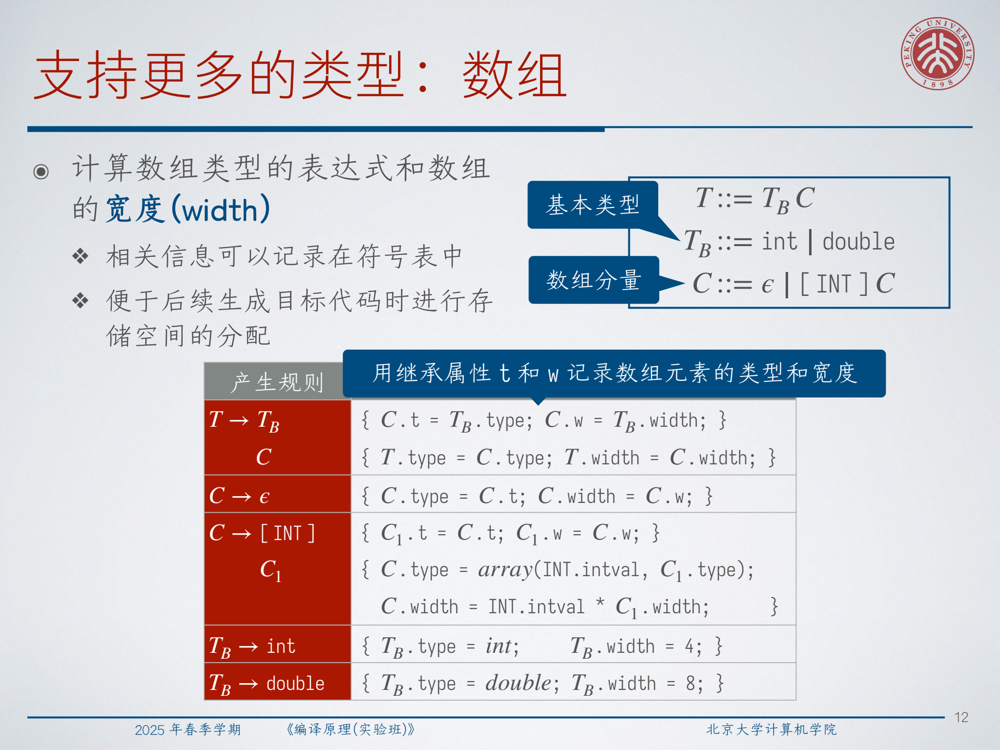
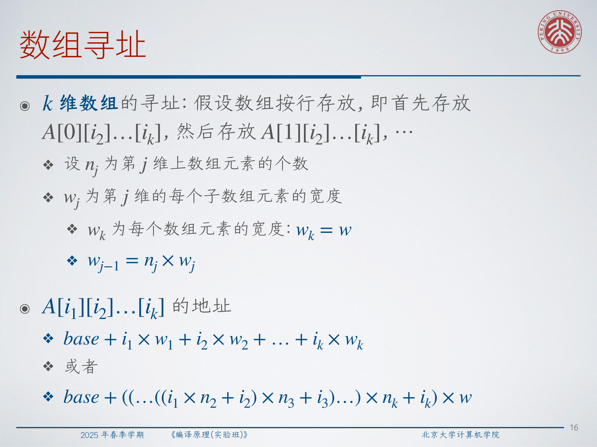
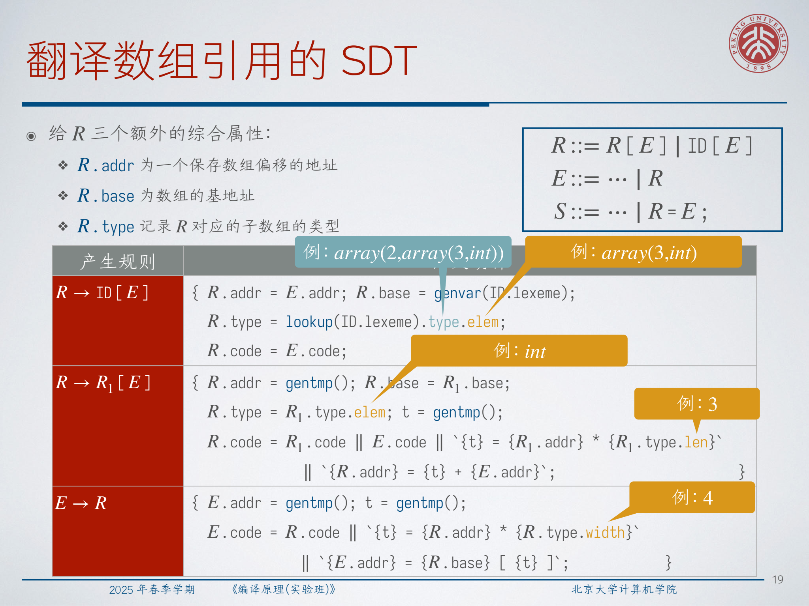
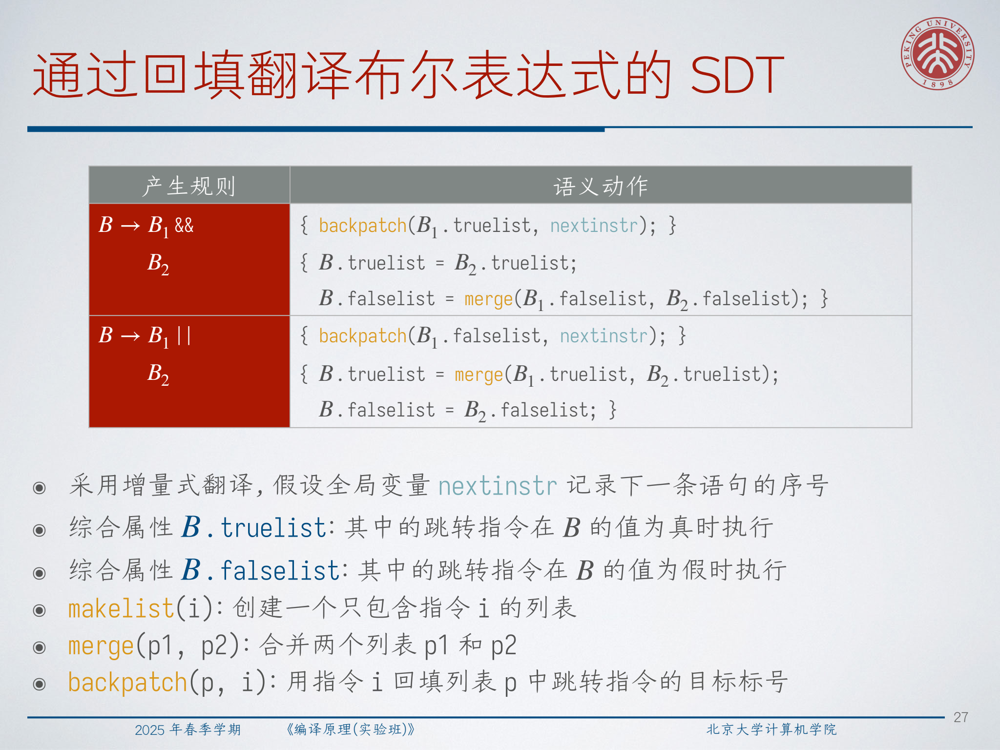
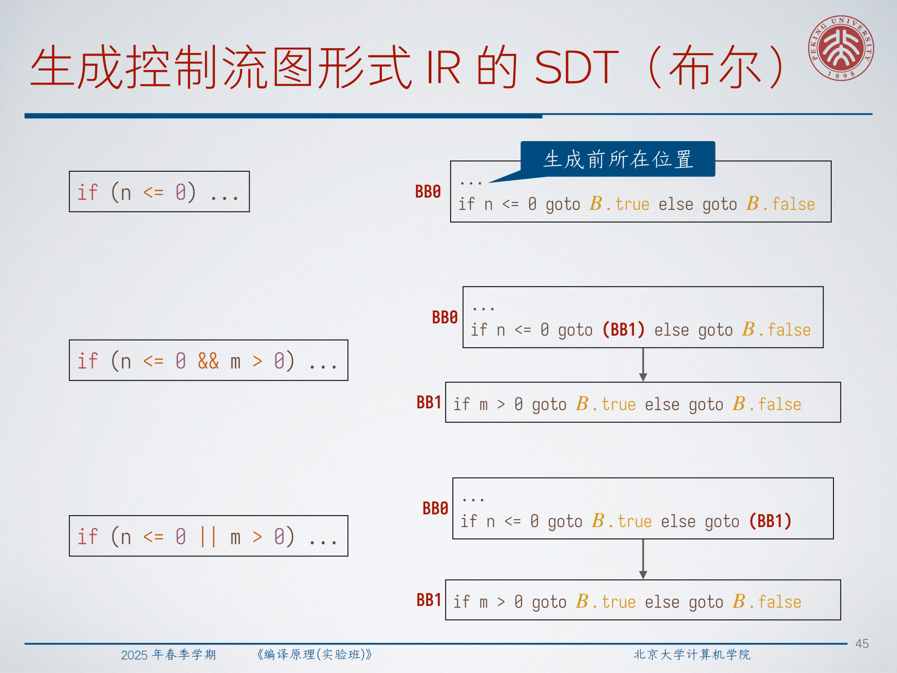
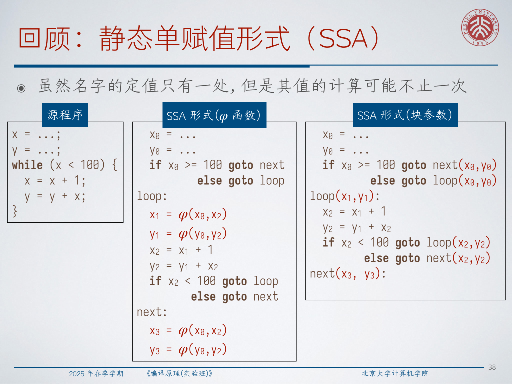
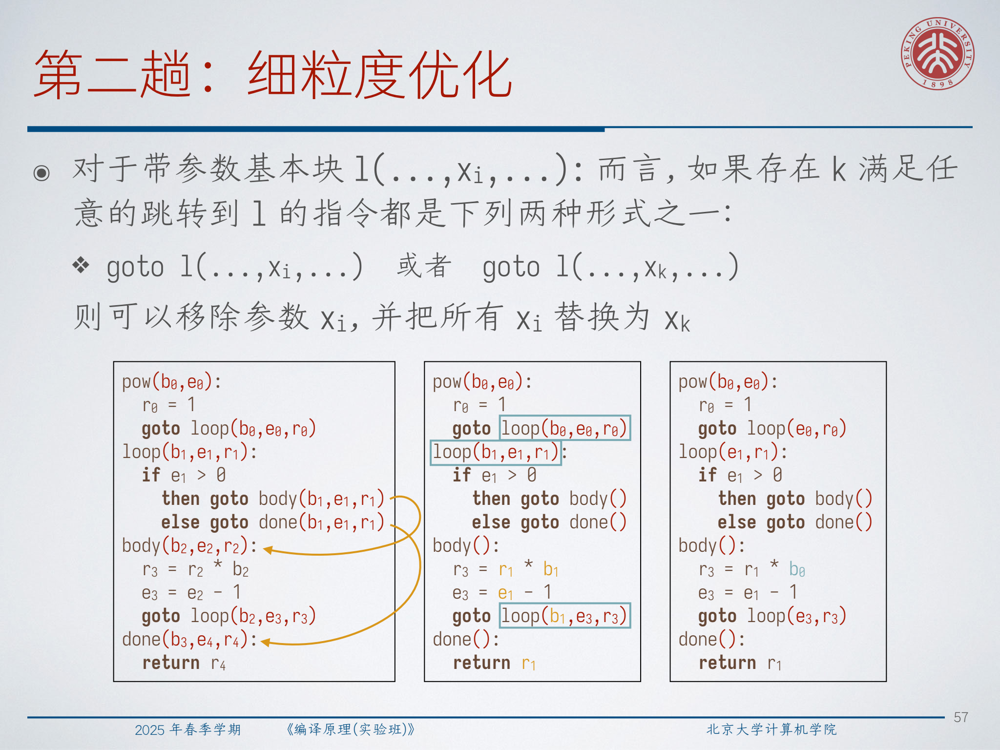
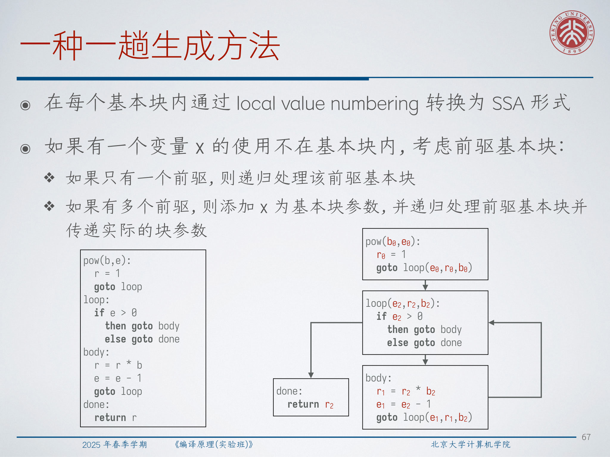

# Lec12：中间表示进阶

## 1. 这一讲比基础 IR 多讲了什么

Lec5 已经介绍过 AST、DAG、CFG、三地址代码和 SSA 等主要 IR 形式。这一讲继续往前走，不再只回答“IR 是什么”，而是重点回答“如何在语义分析与语法分析过程中系统地把它们生成出来”。整讲主要有三条主线：

- 把语法制导翻译真正落成可执行的 IR 生成规则；
- 正确处理数组、控制流和短路布尔表达式的翻译；
- 构造 SSA 形式的 IR，而且从简单做法一路推进到更成熟的做法。

核心视角是：IR 生成并不是一个独立的“事后步骤”。一旦我们搞清楚每个语法构造要贡献什么信息，就可以把相应的动作直接挂到产生式上。

## 2. 重新看 SDT：批量构造与边走边发射

**语法制导翻译方案（SDT）** 的做法，是把属性计算改写成代码片段 `{ ... }`，插入到产生式中的合适位置。从执行角度看，这些代码片段会在深度优先遍历语法分析树的特定时刻被触发。

对表达式和赋值语句，最经典的批量做法会保留两个综合属性：

- `E.addr`：保存表达式 `E` 的值所在的地址；
- `E.code`：为 `E` 生成的三地址代码。

常见辅助函数有：

- `genvar(x)`：为程序变量生成地址；
- `gencst(c)`：为常量生成地址；
- `gentmp()`：为新临时变量生成地址。

例如 `E1 + E2` 的翻译，概念上一定会做三件事：

1. 先生成 `E1` 的代码；
2. 再生成 `E2` 的代码；
3. 最后补上一条把和存入新临时变量的指令。

这也就是讲义中用 `||` 来连接代码块的原因。不过，把代码表示成字符串再一层层拼接，工程上有明显冗余，所以讲义立刻过渡到了更自然的做法：边翻译边发射指令。

在增量式版本里，我们仍然计算 `E.addr`，但不再显式构造 `E.code` 字符串，而是直接调用：

```text
emit("{t} = {a1} + {a2}")
```

语法树仍然决定指令顺序，但 IR 的生成方式已经从“先拼起来”变成了“直接输出”。

:::remark 📝 问题：为什么增量式翻译比先构造 `E.code` 字符串更好？
问题不在表达能力，而在冗余。反复做 `E1.code || E2.code || ...` 会不断重建中间字符串，而这些字符串最后还是要被摊平成一条条指令。用 `emit(...)` 后，SDT 仍然遵循语法树上的执行顺序，但指令生成变得更直接、更省事，也更接近真实编译器里 IR builder 的工作方式。
:::

## 3. 翻译声明、语句块和复杂类型

一旦翻译对象不再只是算术表达式，前端就必须像跟踪临时变量一样认真地跟踪作用域和类型信息。

对声明语句：

```text
S -> T ID ;
```

最关键的语义动作是：

```text
insert(ID.lexeme, T.type)
```

也就是把声明出的名字及其类型插入当前符号表作用域。

语句块则要求显式地管理作用域：

```text
S -> { L }
```

对应的动作可以理解为：

```text
push_scope()
...
pop_scope()
```

语句序列则把各部分生成的代码依次连接起来。结构体的处理也沿用同样的思想：先在一个新作用域里处理字段声明，再把弹出的那层作用域整体打包成结构体类型。

数组更有意思，因为前端不仅要算出类型表达式，还要算出总宽度。讲义通过继承属性 `C.t` 和 `C.w`，把“当前元素类型”和“当前元素宽度”沿着数组后缀一层层传下去。



核心规则是：

$$
TB \to int:\quad TB.type = int,\quad TB.width = 4
$$

$$
TB \to double:\quad TB.type = double,\quad TB.width = 8
$$

$$
C \to \epsilon:\quad C.type = C.t,\quad C.width = C.w
$$

$$
C \to [INT]\ C_1:\quad C.type = array(INT.intval,\ C_1.type),\quad C.width = INT.intval \times C_1.width
$$

因此 `int[2][3]` 会从里向外得到：

- 基本类型 `int`，宽度 `4`；
- 经过 `[3]` 变成 `array(3, int)`，宽度 `12`；
- 再经过 `[2]` 变成 `array(2, array(3, int))`，宽度 `24`。

这个宽度信息绝不是可有可无的注释。后续生成目标代码时，分配空间和计算数组偏移都离不开它。

## 4. 正确计算数组地址

数组引用的文法是：

```text
R ::= R[E] | ID[E]
E ::= ... | R
S ::= ... | R = E ;
```

最核心的问题是：怎样把层层嵌套的数组引用变成“相对于数组基址的偏移”？

对连续存放的一维数组：

$$
\mathrm{addr}(A[i]) = base + i \times w
$$

其中 `w` 是单个元素的宽度。

对二维按行存放数组：

$$
\mathrm{addr}(A[i_1][i_2]) = base + i_1 \times w_1 + i_2 \times w_2
$$

对 `k` 维按行存放数组，设 `n_j` 是第 `j` 维上的元素个数，`w_j` 是第 `j` 层子数组元素的宽度，则：

$$
w_k = w
$$

$$
w_{j-1} = n_j \times w_j
$$

$$
\mathrm{addr}(A[i_1][i_2]\cdots[i_k]) = base + i_1 w_1 + i_2 w_2 + \cdots + i_k w_k
$$

也可以写成等价的嵌套形式：

$$
\mathrm{addr}(A[i_1][i_2]\cdots[i_k]) = base + ((\cdots((i_1 \times n_2 + i_2)\times n_3 + i_3)\cdots)\times n_k + i_k)\times w
$$



讲义还提醒我们：下标不一定总从 `0` 开始。若采用 Pascal 风格的区间下标 `[low..high]`，那么地址公式会变成：

$$
\mathrm{addr}(a[i]) = base + (i - low)\times w
$$

由于 `low` 来自类型声明，所以 `base - low \times w` 往往可以在编译期预先算好。

:::tip 💡 问题：为什么编译器会这么在意数组宽度和存放顺序？
因为机器层面并不存在“多维数组访问”这种原语，后端真正认识的只有地址和偏移。宽度告诉我们一个元素或一个子数组占多少字节，存放顺序决定了哪个维度贡献更大的步长。缺了这两件事，`a[i][j]` 根本没法翻译成可执行的访存。
:::

## 5. 翻译数组读取与写入

为了把数组引用一步步翻译下去，讲义给数组引用结点 `R` 增加了三个综合属性：

- `R.addr`：保存当前偏移下标的地址；
- `R.base`：整个数组的基地址；
- `R.type`：当前对应的子数组或元素类型。



在基本情形：

```text
R -> ID[E]
```

里：

- 第一个下标表达式先给出初始偏移；
- `R.base` 是数组变量自身的地址；
- `R.type` 变成该数组声明类型的元素类型。

递归情形：

```text
R -> R1[E]
```

则是在已有偏移的基础上，先乘上下一个维度的长度，再把新的下标加上去。

当数组引用作为表达式出现时：

```text
E -> R
```

还要再做最后一步：把逻辑偏移乘上最终元素类型的宽度，然后从 `R.base[...]` 里取值。

因此，对 `a : int[2][3]`，读取 `a[i][j]` 会生成：

```text
t0 = i * 3
t1 = t0 + j
t2 = t1 * 4
t3 = a[t2]
```

写入则完全类比。对：

```text
a[i * j + k][l] = b[m - n];
```

生成的三地址代码是：

```text
t0 = i * j
t1 = t0 + k
t2 = t1 * 3
t3 = t2 + l
t4 = t3 * 4
t5 = m - n
t6 = t5 * 4
t7 = b[t6]
a[t4] = t7
```

更深一层看，嵌套数组语法最终都被消解成了“一个线性偏移 + 一次最终访存”。

## 6. 回填布尔表达式

短路布尔表达式的翻译，会在目标尚未确定时先生成跳转，这正是 **回填（backpatching）** 存在的原因。

讲义不再用继承属性 `B.true` 和 `B.false` 去直接传目标，而是给每个布尔表达式维护两个综合列表：

- `B.truelist`：当 `B` 为真时应该跳过去的那些跳转指令；
- `B.falselist`：当 `B` 为假时应该跳过去的那些跳转指令。

辅助操作有：

- `makelist(i)`：建立只含指令 `i` 的列表；
- `merge(p1, p2)`：把两个待回填列表并起来；
- `backpatch(p, i)`：把列表 `p` 中所有尚未确定的目标都填成 `i`。

整个翻译过程由增量式代码生成器中的全局 `nextinstr` 驱动。



关键情形包括：

- `true`：发出 `goto _`，并把该指令放进 `truelist`；
- `false`：发出 `goto _`，并把该指令放进 `falselist`；
- 比较表达式如 `E1 == E2`：为真分支发一条条件跳转，再为假分支发一条无条件跳转；
- `B1 && B2`：把 `B1.truelist` 回填到 `B2` 的起始位置；
- `B1 || B2`：把 `B1.falselist` 回填到 `B2` 的起始位置；
- `!B1`：直接交换 `truelist` 和 `falselist`。

例如：

```text
x < 100 || (x > 200 && x != y)
```

讲义生成的骨架是：

```text
100: if x < 100 goto _
101: goto _
102: if x > 200 goto _
103: goto _
104: if x != y goto _
105: goto _
```

最后得到的待回填列表为：

- 总体 `truelist = {100, 104}`；
- 总体 `falselist = {103, 105}`。

而这些列表，正是后续语句翻译需要接手解决的出口。

:::remark 📝 问题：为什么不能在翻译布尔表达式时立刻决定每个跳转的目标？
因为短路翻译先暴露出了控制流结构，但那时“假分支接下来要去哪”的代码往往还没有生成出来。也就是说，发出跳转的时刻比目标代码成形的时刻更早。回填的作用，就是允许我们先把跳转发出去，把目的地暂时留空，等目标真正出现后再一次性补上。
:::

## 7. 回填控制流语句

当布尔表达式已经用 `truelist` / `falselist` 描述出口后，语句层面还需要再补一个综合属性：

- `S.nextlist`：语句 `S` 结束后应该跳到“后继位置”的那些跳转指令。

语句列表则使用 `L.nextlist`。

这就得到了一套很干净的一趟翻译逻辑：

- 简单赋值和声明不会留下待处理出口；
- 语句块把内部语句列表的 `nextlist` 向外继承；
- 对语句序列，要把前一条语句的 `nextlist` 回填到后一条语句的起始位置；
- `if(B) S1`：把 `B.truelist` 回填到 `S1`，再把 `B.falselist` 与 `S1.nextlist` 合并；
- `if(B) S1 else S2`：还要额外补一条从 `then` 分支末尾跳过 `else` 的 `goto`；
- `while(B) S1`：把 `B.truelist` 回填到循环体，把循环体的 `nextlist` 回填回循环测试处，再发一条跳回循环头的指令，并用 `B.falselist` 作为循环退出。

对：

```text
if (x < 100 || (x > 200 && x != y))
  x = 0;
```

条件的 `truelist` 会被回填到赋值语句，而剩余的假出口则成为整个语句的 `nextlist`。

讲义后面那个更大的嵌套例子还说明了一个非常实际的点：一趟翻译经常会生成一些冗余 `goto`。这完全没问题。第一目标是保证控制流正确，后续优化阶段再来清理这些赘余跳转。

:::tip 💡 问题：这里说的“一趟处理完毕”到底是什么意思？
它并不是说我们事先就知道了所有目标，而是说我们可以沿着程序前向扫描一遍，把所有指令都生成出来，同时把未知目标记成待回填列表。回填本质上就是让“一趟生成控制流”这件事真正可行的记账技巧。
:::

## 8. 直接生成 CFG 形式的 IR

除了先生成平铺的指令序列、再恢复基本块之外，我们也可以从一开始就直接构造控制流图。

**基本块（basic block）是一个线性的指令序列，以跳转或返回结束，并且控制流只能从第一条指令进入。**

讲义假设有这样一组 CFG 构造接口：

- `emit(instr)`：向当前基本块末尾追加一条指令；
- `new_bb()`：创建一个新的基本块；
- `set_bb(bb)`：把当前插入点切换到基本块 `bb`。

这里有两个结构约束非常重要：

- 跳转和返回只能出现在基本块末尾；
- 每个函数都应该有唯一入口块。



在这种表示下，布尔翻译改用继承块目标：

- `B.true`：条件成立时进入的块；
- `B.false`：条件失败时进入的块。

于是：

- `true` 直接发出 `goto B.true`；
- `false` 直接发出 `goto B.false`；
- 比较表达式发出完整条件分支；
- `B1 && B2` 会新建一个“只有当 `B1` 成立时才继续计算 `B2`”的块；
- `B1 || B2` 会新建一个“只有当 `B1` 失败时才继续计算 `B2`”的块。

同样地，`if` 和 `while` 也会显式分配出：

- 真分支块；
- 假分支块；
- 语句结束后的汇合块；
- 循环体块与循环退出块。

这种形式往往更适合后续的 SSA 构造，因为分支结构一开始就是显式的，不需要后处理再去恢复。

:::warn ⚠️ 问题：如果直接生成 CFG，`break` 和 `continue` 该怎么支持？
把它们看成依赖循环上下文的特殊语句即可。每一层循环都向内部传两个继承目标：循环退出块，以及 `continue` 应跳转到的目标块（通常是条件块或循环头）。这样 `break` 只需发出 `goto exit`，`continue` 只需发出 `goto continue_target`。本质上它们并不是特殊表达式，而是带上下文的跳转。
:::

## 9. SSA 回顾：phi 函数与块参数

**静态单赋值（SSA）形式** 的定义是：每次赋值都使用一个全新的变量名，而且每次使用都能追溯到唯一的定义点。

在直线代码里，SSA 只是系统化重命名。比如：

```text
p = a + b
q = p - c
p = q * d
p = e - p
q = p + q
```

改写后就是：

```text
p1 = a + b
q1 = p1 - c
p2 = q1 * d
p3 = e - p2
q2 = p3 + q1
```

真正有意思的地方出现在控制流汇合点。传统 SSA 用 phi 函数表示汇合：

$$
x_3 = \phi(x_1,\ x_2)
$$

讲义同时给出了等价的块参数写法：让汇合块显式接收来自前驱边的实参。



同样的思想也适用于循环。循环头会同时接收“第一次进入循环时的值”和“回边带回来的更新值”。在 phi 形式里，这是循环头的 phi 节点；在块参数形式里，这是循环头的参数列表。

:::remark 📝 问题：为什么块参数可以替代 phi 函数？
因为两者表达的是同一件事：控制流汇合点上的变量值，取决于究竟是哪条前驱边把控制转移到了这里。phi 把这个信息写在块内部，块参数把这个信息写在控制流边界上。语义没有变，只是记号换了个位置。
:::

## 10. 先用内存单元得到一个朴素版 SSA

直接生成 SSA 时，一个现实障碍是：源语言变量通常会被反复赋值。一个非常简单的过渡做法，是先不把这些源级变量当成 SSA 值，而是先为每个程序变量分配一个内存单元。

这样一来，变量更新变成显式 `store`，变量使用变成显式 `load`。讲义里用到的操作包括：

- `alloc`
- `load`
- `store`

例如：

```text
a = alloc
store 1, a
b = alloc
store 1, b
c = alloc
t0 = load a
t1 = load b
t2 = t0 + t1
store t2, c
t3 = load b
store t3, a
t4 = load c
store t4, b
```

这种表示已经很接近 SSA，因为 `t0`、`t1`、`t2` 这些临时量本身都只赋值一次。剩下的可变状态，被集中到了显式内存操作里。

缺点也非常明显：许多 `load`/`store` 都只是翻译产物，而不是真实不可避免的数据依赖。更聪明的编译器会在符号表里跟踪某个源变量当前对应的地址或当前值，尽量把不必要的 `store` 推迟掉，甚至直接避免发出。

:::remark 📝 问题：既然这种方法是正确的，为什么还说它“朴素”？
因为它是用精度换简单。每次源变量更新都先被降成内存读写，于是 IR 提前丢掉了很多原本还很清楚的值流信息。后续优化又得通过 mem2reg 一类提升把这些值重新提回来。它能用，但起点明显比必要的更嘈杂。
:::

## 11. 用块参数做两趟 SSA 构造

讲义随后给出了一个更干净的 SSA 生成办法，仍然采用块参数风格。

基本思路是：

1. 先做一趟粗粒度处理，把每个基本块入口可能需要的变量都先列成块参数；
2. 在块内使用局部值编号，把计算改成 SSA 风格；
3. 再做第二趟细粒度优化，把冗余的块参数删掉。

示例程序是 `pow(b, e)` 循环：

```text
pow(b, e):
  r = 1
  goto loop
loop:
  if e > 0 then goto body else goto done
body:
  r = r * b
  e = e - 1
  goto loop
done:
  return r
```

经过粗粒度构造和局部重命名之后，可能先得到：

```text
pow(b0, e0):
  r0 = 1
  goto loop(b0, e0, r0)
loop(b1, e1, r1):
  if e1 > 0
    then goto body(b1, e1, r1)
    else goto done(b1, e1, r1)
body(b2, e2, r2):
  r3 = r2 * b2
  e3 = e2 - 1
  goto loop(b2, e3, r3)
done(b3, e4, r4):
  return r4
```

接下来就是细粒度优化。若某个块参数在所有入边上传来的值都可以证明与另一个保留下来的参数等价，或者始终就是同一个值，那么这个参数就是冗余的，可以删掉。



在这个例子里，`b` 在循环中始终不变，因此不必永远保留成循环参数。优化后可化简为：

```text
pow(b0, e0):
  r0 = 1
  goto loop(e0, r0)
loop(e1, r1):
  if e1 > 0
    then goto body()
    else goto done()
body():
  r3 = r1 * b0
  e3 = e1 - 1
  goto loop(e3, r3)
done():
  return r1
```

这种方法的优点很明显：先大胆过近似，再做删减，逻辑清晰，也比较容易验证正确性。

:::tip 💡 问题：为什么第二趟可以安全删除块参数？
因为它不是拍脑袋删，而是在检查过所有入边之后才删。只要每一条跳到块 `l` 的边，传入该参数的位置要么总是同一个值，要么总是与另一个保留参数等价，那么这个被删掉的参数就没有独立信息量。删掉它并做替换，是语义保持的简化，不是冒险优化。
:::

## 12. 一趟 SSA 构造

最后，讲义给出了一个更直接的一趟算法，不再先“加很多参数再删”。

规则是：

- 在每个基本块内部，先用局部值编号生成 SSA 名；
- 当某个变量 `x` 的使用在当前块内没有定义时：
  - 如果当前块只有一个前驱，就递归去那个前驱块里解析 `x`；
  - 如果当前块有多个前驱，就把 `x` 加成当前块参数，并递归地在各条入边上传递实际参数。



把它应用到 `pow`，最终会得到：

```text
pow(b0, e0):
  r0 = 1
  goto loop(e0, r0, b0)
loop(e2, r2, b2):
  if e2 > 0
    then goto body
    else goto done
body:
  r1 = r2 * b2
  e1 = e2 - 1
  goto loop(e1, r1, b2)
done:
  return r2
```

和两趟方法相比：

- 一趟方法只会在未解析使用真正需要时才引入参数；
- 它常常能直接得到更紧凑的结果；
- 但算法上更难处理，因为要非常小心地维护前驱递归和互相依赖的基本块关系。

所以这里体现的是一个很典型的编译器工程权衡：

- 两趟 SSA 更朴素，构造过程也更容易理解和验证；
- 一趟 SSA 更直接、更优雅，但对实现细节的要求更高。

:::remark 📝 问题：什么情况下更适合选一趟方法，而不是两趟方法？
如果你的 IR builder 和 CFG 基础设施已经能很自然地支持“递归查前驱”和“回填边参数”，那么一趟法会更漂亮，也更少生成明显冗余的参数。若你更看重实现稳定性、调试成本和正确性证明的直观程度，两趟法通常是更稳妥的选择。
:::

## 13. Exam Review

### Key definitions

- **语法制导翻译方案（SDT）**：把可执行语义动作挂到文法产生式上，并在语法树遍历的特定时刻执行。
- **回填（Backpatching）**：先发出目标未知的跳转，等后继位置明确后再统一补上跳转目标。
- **基本块（Basic block）**：单入口、线性、并以跳转或返回结束的指令序列。
- **SSA 形式**：每次赋值产生一个新名字，每次使用都对应唯一到达定义。
- **phi 函数 / 块参数**：两种等价的值汇合表示方式，用来描述 CFG 汇合点上的值选择。

### Core mechanisms

- 表达式 SDT 至少需要维护结果地址，以及一套生成指令的策略。
- 数组翻译必须依赖类型宽度、各维长度和存放顺序，才能把多维下标压平成线性偏移。
- 布尔短路求值最自然的实现方式，是维护 `truelist`、`falselist`、`makelist`、`merge` 和 `backpatch`。
- 语句翻译在此基础上继续引入 `nextlist`。
- 直接生成 CFG 形式 IR，本质上是把“待回填的指令号”替换成“显式基本块”。
- SSA 生成可以从内存单元方案起步，也可以采用两趟块参数法，或更直接的一趟前驱递归法。

### Short-answer templates

- 为什么需要回填？
  因为短路控制流会先发出跳转，而那时后继代码未必已经生成，所以必须先记录未决出口，再在目标出现时统一补齐。

- 多维数组访问怎么翻译？
  先依据按行或按列存放规则，把多维下标计算成线性逻辑偏移；必要时再乘元素宽度；最后与基址结合，生成 load/store。

- phi 函数和块参数是什么关系？
  它们表达的是同一套汇合语义：汇合点上看到哪个值，取决于控制究竟来自哪个前驱。

- 为什么 alloc/load/store 方案只能算基线方案？
  因为它虽然正确，但会引入大量不必要的内存流量，迫使后续优化再把本来可以直接保留成 SSA 值的信息重新恢复出来。

- 两趟 SSA 和一趟 SSA 的核心区别是什么？
  两趟法先过近似地加入块参数，再删掉冗余参数；一趟法只在未解析使用真正需要时才引入块参数。

### Common mistakes

- 把数组的逻辑下标和字节偏移混为一谈。
- 忘记 `R.type` 会随着数组引用一层层深入而逐步剥掉一维。
- 把 `&&` 和 `||` 当成总会把两边都算完的普通二元运算。
- 以为回填只服务于 `if`；实际上循环和语句序列同样高度依赖它。
- 以为 SSA 只是重命名；真正的难点在汇合点和循环回边。

### Self-check list

- 我能否推导出 `int[2][3]` 的总宽度为什么是 `24` 字节？
- 我能否写出按行存放时 `a[i][j]` 的偏移计算？
- 我能否说清 `truelist`、`falselist` 和 `nextlist` 分别装的是什么？
- 我能否解释为什么直接生成 CFG 往往更方便后续做 SSA？
- 我能否把一个带分支的小程序翻译成 phi 形式或块参数形式的 SSA？
- 我能否说明两趟 SSA 与一趟 SSA 在工程实现上的取舍？
