# Lec13：拾遗

## 1. 为什么这一讲并不只是“杂项拼盘”

这一讲表面上像是把几个彼此分散的话题放在一起，但它们其实都在回答同一个问题：程序一旦不再只是“语法结构”，运行时和后端到底该怎样把这些结构落地。我们需要一种办法处理嵌套作用域和闭包，需要一种办法回收堆对象，需要一种办法把 SSA 形式的 IR 分配到寄存器上，还需要一种办法用有限表示去概括带循环 CFG 的无限路径集合。

因此，这一讲最好理解成四条互相接上的主线：

- 嵌套过程怎样访问非局部变量；
- 堆上的数据怎样被自动回收；
- SSA IR 怎样被映射成高效的寄存器使用；
- 带循环的控制流路径怎样被有限地表示和分析。

## 2. 静态作用域下的非局部访问

**静态作用域** 的意思是：名字绑定由程序的词法嵌套结构决定，而不是由运行时的调用链决定。

一旦语言允许过程嵌套，问题立刻就来了：如果函数 `F` 被定义在若干层外层过程之内，那么 `F` 运行时怎样找到那些定义在自己外面的变量？


关键点在于，可见性取决于“在哪里定义”，而不是“是谁调用了它”。所以：

- 一个嵌套过程可以访问其词法祖先中的局部变量；
- 它不能访问兄弟过程中的局部变量；
- 它能访问哪些非局部变量，在编译时就是确定的。

正因为这件事是静态可知的，运行时表示才能被做成规则化的机制，而不是到处特判。

## 3. 访问链与显示表

讲义首先用 **访问链（access link）** 来实现静态作用域。

先定义过程的 **嵌套深度**：如果过程 `p` 定义在深度为 `i` 的过程内部，那么 `p` 的深度就是 `i + 1`。如果过程 `q` 直接嵌套在 `p` 里，那么 `q` 的每个活动记录都会带一条访问链，指向最近的那个 `p` 的活动记录。

顺着一条访问链走一次，嵌套深度就会恰好减少 `1`。因此，如果深度 `m` 的代码想访问声明在深度 `n` 的变量，只需要顺着访问链走 `m - n` 次。这个数字在编译时就已经知道。

当深度为 `m` 的过程调用深度为 `n` 的过程时，如何建立被调过程的访问链，要看它们的词法关系：

- 如果 `n = m + 1`，说明被调过程正好直接定义在调用者内部，那么它的访问链就直接指向调用者；
- 如果 `m >= n`，调用者需要沿着自己的访问链再走 `m - n + 1` 次，找到词法上直接包住被调过程的那层活动记录。

这套办法是正确的，但它有一个代价：一次非局部访问的开销，取决于使用点和声明点之间隔了多少层嵌套。

:::remark 📝 **问题：为什么访问链能正确实现静态作用域？**
因为访问链跟随的不是任意运行时调用关系，而是词法父过程关系。运行时当然可能有很多活动调用，但访问链总是在词法嵌套树上往上爬一层。某个使用点和其声明点之间隔了多少层，完全由源程序决定，所以编译器事先就知道要跟几次链。
:::

为了把非局部访问降成常数时间，讲义又引入了 **显示表（display）**。

**显示表** 是一个运行时数组 `d`，其中 `d[i]` 指向当前最近的、嵌套深度为 `i` 的活动记录。这样，只要变量所在深度 `i` 是静态已知的，就可以直接通过 `d[i]` 找到对应的记录。

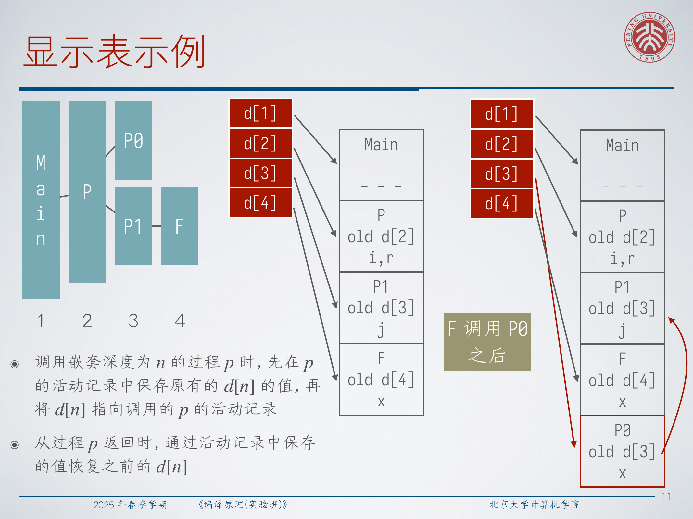

它的维护规则很直接：

- 进入深度为 `n` 的过程时，先把原来的 `d[n]` 存到新活动记录里；
- 再把 `d[n]` 改成指向这个新活动记录；
- 返回时，把旧值恢复回来。

所以，访问链的好处是概念简单；显示表的好处是把反复的非局部访问优化成了直接索引。

## 4. 动态作用域、过程值与闭包

讲义随后把静态作用域和 **动态作用域** 做了对比。

在动态作用域下，一个非局部名字例如 `a`，会绑定到调用链上最近一次出现的同名活动绑定。也就是说，绑定关系在运行时才由调用历史决定，而不是由词法程序文本决定。

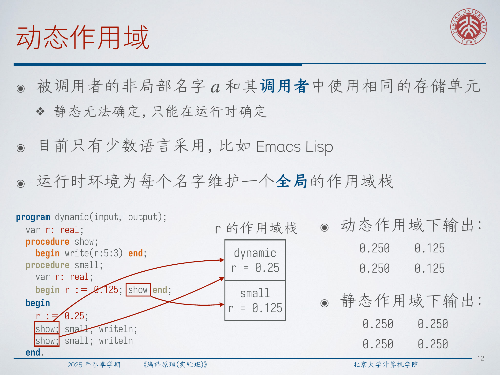

这也正是为什么，同一段代码在静态作用域和动态作用域下可能打印出不同的结果。现代主流语言几乎都选择静态作用域，原因包括：

- 名字解析更可预测；
- 编译器能静态推断绑定关系；
- 优化和模块化推理都会容易得多。

接下来讲义又追问：如果“过程本身”变成一个值，会发生什么？

如果过程 `p` 被作为参数传给过程 `q`，而 `q` 之后再去调用 `p`，那么 `q` 可能并不知道 `p` 所需要的词法环境。这说明，只传一个代码地址是不够的，调用者还必须把 `p` 解析自由变量所需的环境一并传过去。

而当过程被当作返回值时，这个问题会更严重。单纯的栈式管理可能直接失效：等到这个返回出去的嵌套过程将来再次被调用时，原来保存它所捕获变量的活动记录，可能早就已经退栈了。

:::warn ⚠️ **问题：为什么“返回一个嵌套过程”会破坏纯栈分配？**
因为这个返回出去的过程，可能活得比创建它的那次调用还久。如果那些被它引用的外层变量只存放在栈帧里，那么创建者一返回，栈帧就会消失；以后再调用这个过程时，环境指针就会悬空。实现上必须把相关环境放到堆上，或者把被捕获的变量迁移到堆支持的存储里。
:::

这正是为什么一等函数必须配套 **闭包（closure）**。

**闭包** 就是“代码 + 它的自由变量所需环境”的组合。运行时需要为那些可能逃逸的外层变量分配堆空间。

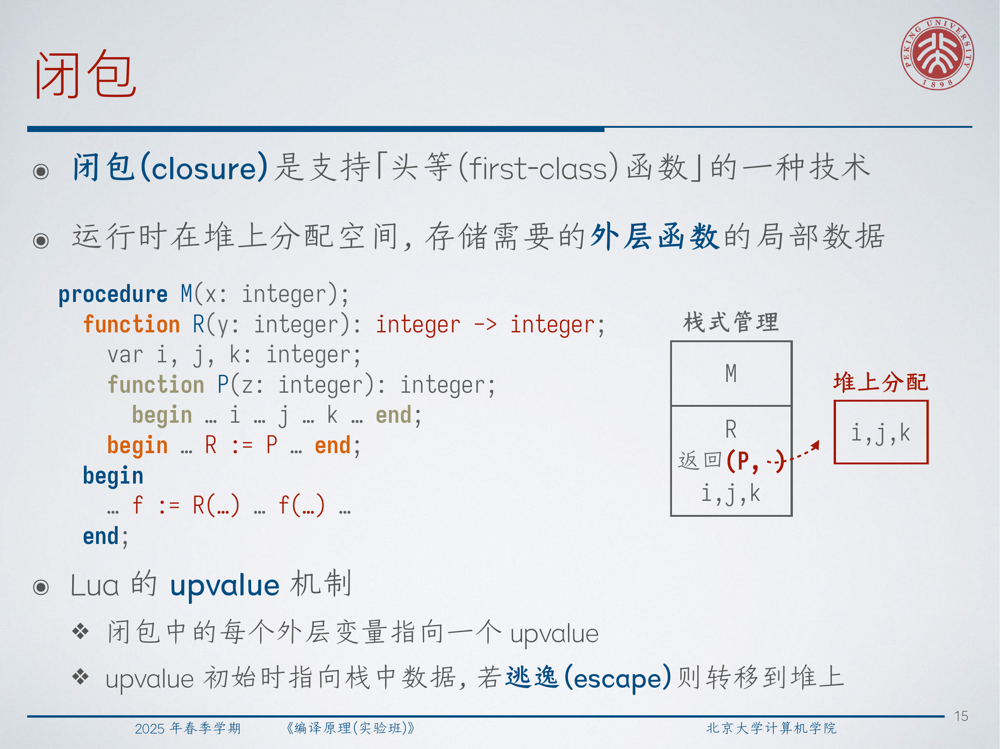

讲义用 Lua 的 `upvalue` 设计来说明这一点：

- 刚开始，upvalue 可以先指向栈上的变量；
- 一旦变量逃逸，运行时就把它迁移到堆上；
- 闭包随后稳定地引用这个堆上的单元。

所以这里真正发生的变化，不是“返回一个函数指针”，而是“返回代码以及它所依赖的环境”。

## 5. 垃圾回收：可达性与设计目标

一旦数据开始长期驻留在堆上，我们就必须有一种自动回收策略。

讲义把 **垃圾** 在狭义上定义为“不可达数据”，把 **垃圾回收（garbage collection）** 定义为“自动回收不可达堆对象”的机制。

其中最核心的概念是 **可达性（reachability）**：

- **根集合（root set）** 是那些无需再经由堆指针解引用就能直接访问到的数据，比如全局变量和栈上的局部变量；
- 被根集合直接指到的对象是可达的；
- 被可达对象中的字段再指到的对象也同样可达。

由此可以推出一个非常关键的性质：

**一个对象一旦变成不可达，就再也不会重新变成可达。**

正是这个单调性，让 tracing 型垃圾回收成为可能。

讲义还特别强调了三个设计关注点：

- 类型安全：回收器最好知道哪些字段是真正的指针；
- 运行时开销：总运行时间不能忽略；
- 停顿时间与局部性：内存管理会直接影响响应性和缓存行为。

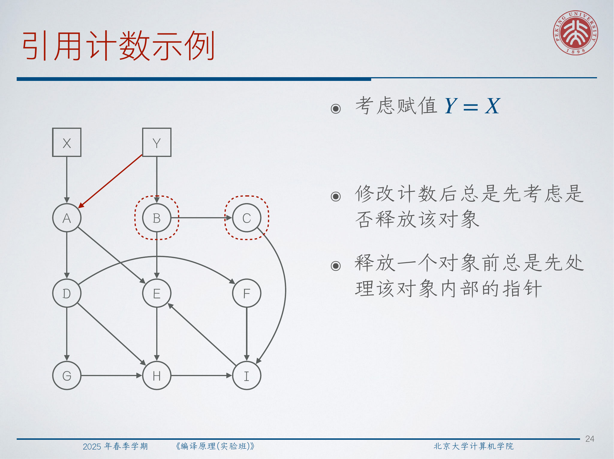

在最简单的 `p` / `q` 例子里，执行 `q = p` 后，原先由 `q` 指向的堆结点变成不可达，因此就成为可回收垃圾。

:::remark 📝 **问题：哪些操作会改变可达集合？**
分配新对象可能让可达集合变大，因为新对象会立即通过某个根或可达对象连进图里。赋值、参数传递、返回值传递、过程返回等操作，则可能把指针加入根集合，也可能把最后一条路径删掉。最重要的不变量是：这些操作可以让对象失去最后一条可达路径，但不会让一个“已经不可达的旧对象”重新变回可达。
:::

在此基础上，讲义把垃圾回收方法分成两大类：

1. 持续跟踪引用变化，并在对象刚刚失去所有外部引用时回收；
2. 周期性地从根出发追踪全部可达对象，再统一回收剩下的对象。

## 6. 引用计数与弱引用

**引用计数（reference counting）** 的做法，是给每个对象附带一个计数字段。

最核心的规则是：

- 分配对象时初始化计数；
- 新增一个指向该对象的指针时，计数加一；
- 某个指针被覆盖或消失时，计数减一；
- 如果计数降到 `0`，就回收该对象，但在回收前必须先把它指向的对象的计数相应减掉。

这最后一步很重要，因为一个对象被释放之后，可能会级联地让更多对象失去最后一个外部引用。


引用计数的优点很明显：

- 它是增量式的，不必总是整堆停顿；
- 垃圾常常能被及时回收；
- 实现简单，也容易和智能指针系统集成。

但它也有三类经典缺点：

- 每个对象都要额外存一个计数；
- 每次指针更新都有时间开销；
- 无法处理环状垃圾。

环的问题是本质性的：

- 三个对象可以互相引用；
- 每个对象的计数都仍然是 `1`；
- 但从程序根集合已经完全无法到达它们。

为了解一些特定的环，讲义又引入了 **弱引用（weak reference）**。弱引用不会增加引用计数，典型例子是树结构中的父指针。

弱引用可以帮助打破所有权环，但在使用弱引用之前，仍然需要先检查它当前是否还有效。

## 7. Tracing 型回收：标记-清扫、压缩、复制与分代

Tracing 型回收器不去维护引用计数，而是换一个角度来问：从根集合出发，现在到底哪些对象仍然可达？

最基础的 **标记-清扫（mark-and-sweep）** 有两个阶段：

1. 从根集合出发遍历，把所有可达对象都标记出来；
2. 扫描堆，把所有未标记对象释放掉。

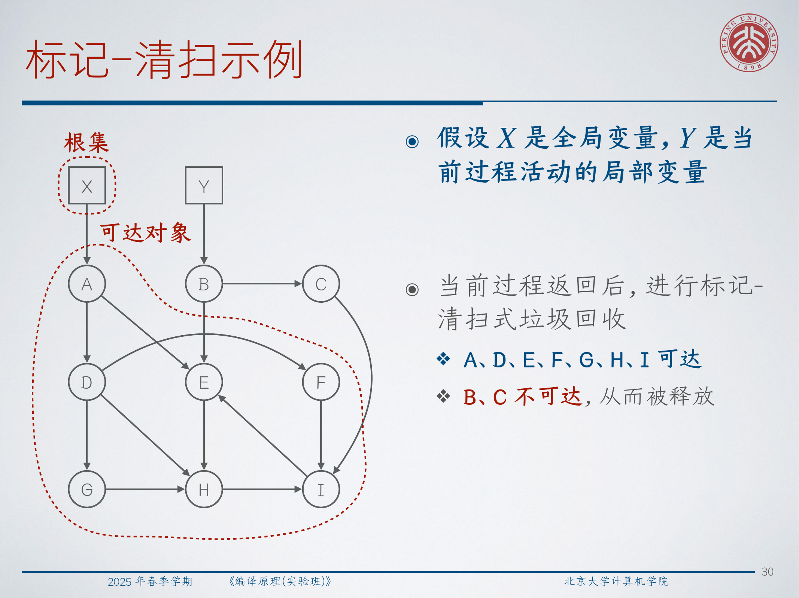

在讲义那个例子里，`A、D、E、F、G、H、I` 都仍然可达，而 `B、C` 会在当前过程返回之后被回收。

标记-清扫天然能处理环，但纯清扫会留下碎片，这就引出了 **标记-压缩（mark-and-compact）**：

- 先标记所有可达对象；
- 再计算它们的新地址；
- 然后把它们搬到堆的一端；
- 最后更新所有指针。

压缩能改善局部性，并把零散的小空洞整理成一大块连续空闲空间。

讲义接着介绍 **复制回收（copying collector）**：

- 把堆分成 `From` 和 `To` 两个半区；
- 平时只在 `From` 中分配；
- 当 `From` 用满时，把全部可达对象复制到 `To`；
- 之后交换两块空间的角色。

这种方法的好处是，压缩在复制过程中天然就完成了；代价是，任一时刻只有一半堆可作为有效分配区。

最后，讲义介绍 **分代回收（generational GC）**。它依赖一个非常重要的经验事实：大多数对象都死得很早。因此，堆会按年龄分层，年轻代被更频繁地回收，而老年代则更少扫描。

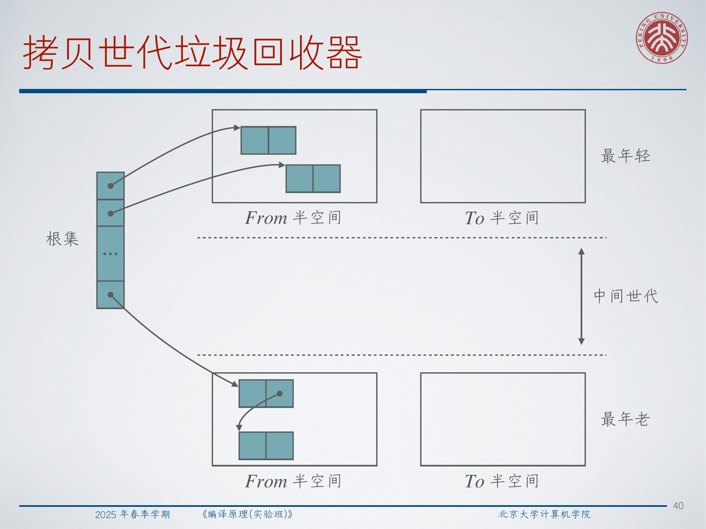

这样做就不必每次都追踪整个堆，因此是实践中非常重要的 GC 设计思想。

:::tip 💡 **问题：为什么分代 GC 在实践里通常特别有效？**
因为真实程序会创建大量短命临时对象，例如语法树结点、迭代器结果、小作用域闭包、中间字符串等。如果大多数对象都很快死亡，那么只频繁扫描年轻代、很少碰老年代，就能以很小的代价回收掉绝大多数垃圾。
:::

## 8. 把 SSA IR 降到目标代码

讲义接着从内存管理跳到后端代码生成。

当我们把带块参数或 phi 函数的 SSA IR 降成目标代码时，编译器通常需要在控制流边上插入寄存器到寄存器的移动指令，让每个块在入口处都拿到它的 SSA 参数所期待的值。

`pow` 这个例子展示了完整的链路：

- 块参数形式 IR；
- 等价的 phi 形式 IR；
- 最后带显式加载、算术、分支和复制的目标代码。

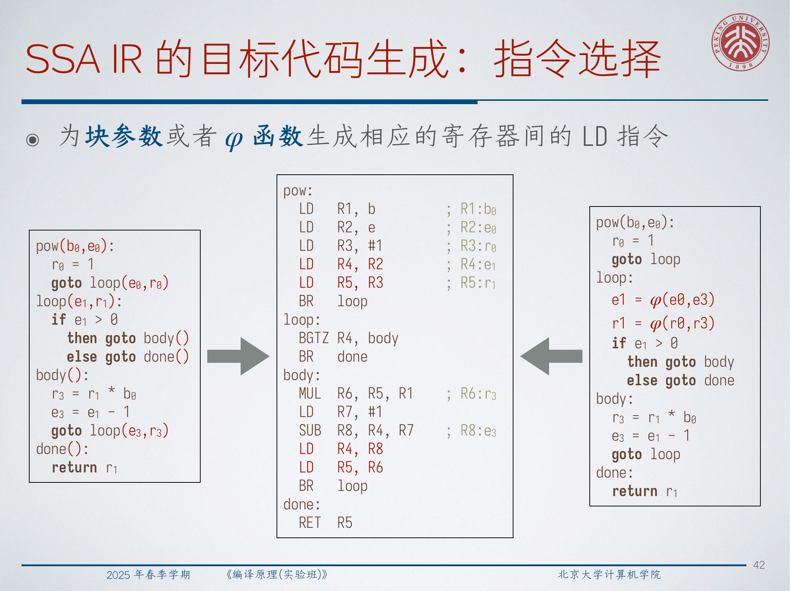

其中一种生成出来的目标代码是：

```text
pow:
  LD R1, b
  LD R2, e
  LD R3, #1
  LD R4, R2
  LD R5, R3
  BR loop
loop:
  BGTZ R4, body
  BR done
body:
  MUL R6, R5, R1
  LD R7, #1
  SUB R8, R4, R7
  LD R4, R8
  LD R5, R6
  BR loop
done:
  RET R5
```

接下来，自然就会进入活跃性分析，并构造寄存器冲突图。

## 9. 为什么 SSA 上的冲突图是弦图

冲突图中的一条边表示：两个符号寄存器的活跃范围发生重叠，因此它们不能共用同一个物理寄存器。

讲义给出的关键图论定义是：

**弦图（chordal graph）** 是指：任意长度至少为 `4` 的环，都带有一条弦。

所谓 **弦（chord）**，就是这个环上两个不相邻顶点之间的一条边。

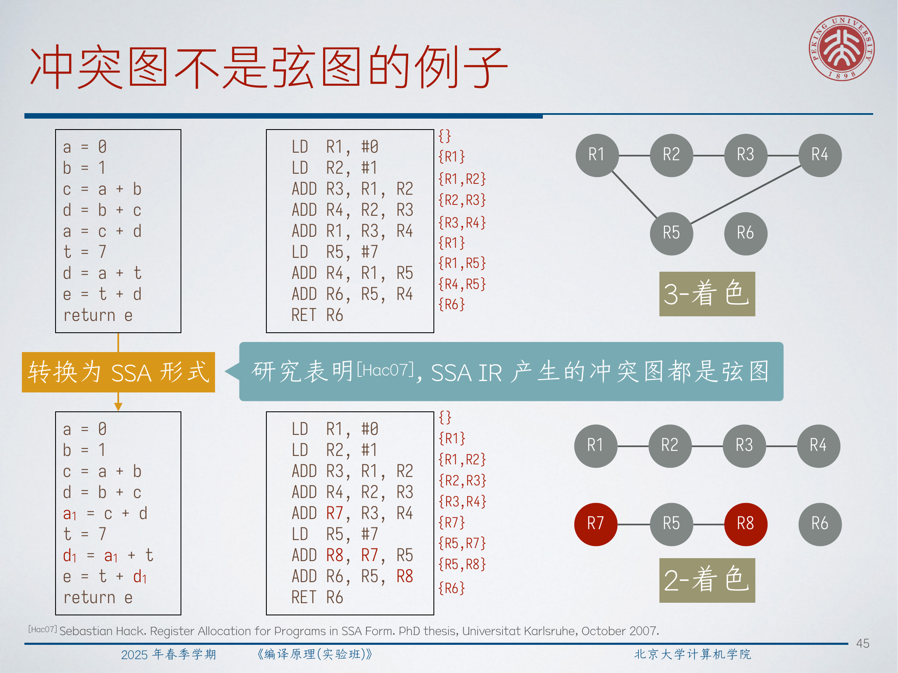

讲义引用了一个非常重要的结论：

**SSA 形式 IR 的冲突图是弦图。**

这件事之所以重要，是因为弦图拥有非常友好的着色性质。

还需要两个定义来配合理解：

- **单纯顶点（simplicial vertex）**：它的所有邻居本身构成一个团；
- **单纯消除序列（simplicial elimination sequence）**：一个顶点序列，使得序列中的每个顶点，在它与之前顶点构成的诱导子图中都是单纯顶点。

对弦图来说：

- 单纯消除序列一定存在；
- 这个序列可以在线性级别时间里求出，复杂度是 `O(|V| + |E|)`；
- 按这个顺序做贪心着色就是最优的。

这是一件很漂亮的事：IR 层面的选择，也就是采用 SSA，不只是让中端分析更方便，还直接把后端寄存器分配问题变成了一个结构上更好处理的图类。

:::remark 📝 **问题：SSA 带来的好处，难道只是变量名更整齐吗？**
远不止如此。SSA 不只是把赋值重命名了一遍，它还改变了活跃性结构，使得冲突图变成弦图，从而可以高效地做最优着色。也就是说，SSA 不只是中端分析格式，它还给后端寄存器分配创造了非常友好的结构条件。
:::

## 10. 合并复制与线性扫描寄存器分配

构图之后，我们当然希望把多余的寄存器复制消掉，这就是 **合并（coalescing）** 的目标：把两个不冲突的结点合成一个，让它们共享同一个物理寄存器。

问题在于，合并得太随意，可能会破坏弦图结构。因此讲义讨论了一种更稳妥的策略：先利用弦图结构求出候选颜色，再只在“合并后仍能分配到一个邻居都没占用的颜色”时进行合并。

在 `pow` 的例子里，经过连续的安全合并，原本为块参数或 phi 降低而引入的 `LD Rs, Rt` 会逐步消失，最终代码化简为：

```text
pow:
  LD R1, b
  LD R2, e
  LD R3, #1
  BR loop
loop:
  BGTZ R2, body
  BR done
body:
  MUL R3, R3, R1
  LD R4, #1
  SUB R2, R2, R4
  BR loop
done:
  RET R3
```

所以，SSA 上的合并，本质上是在把“为了表达 phi / 块参数而临时引入的复制痕迹”重新擦掉，让代码回到更干净的形状。

接着，讲义把重点转向 **线性扫描寄存器分配（Linear Scan Register Allocation, LSRA）**。它不先构造完整冲突图，而是先为每个符号寄存器计算一个活跃区间，再沿着代码顺序线性扫描。

它之所以受欢迎，原因很务实：

- 编译时间几乎跟代码长度线性相关；
- 生成质量通常和图着色很接近；
- JIT 编译器尤其看重编译速度。

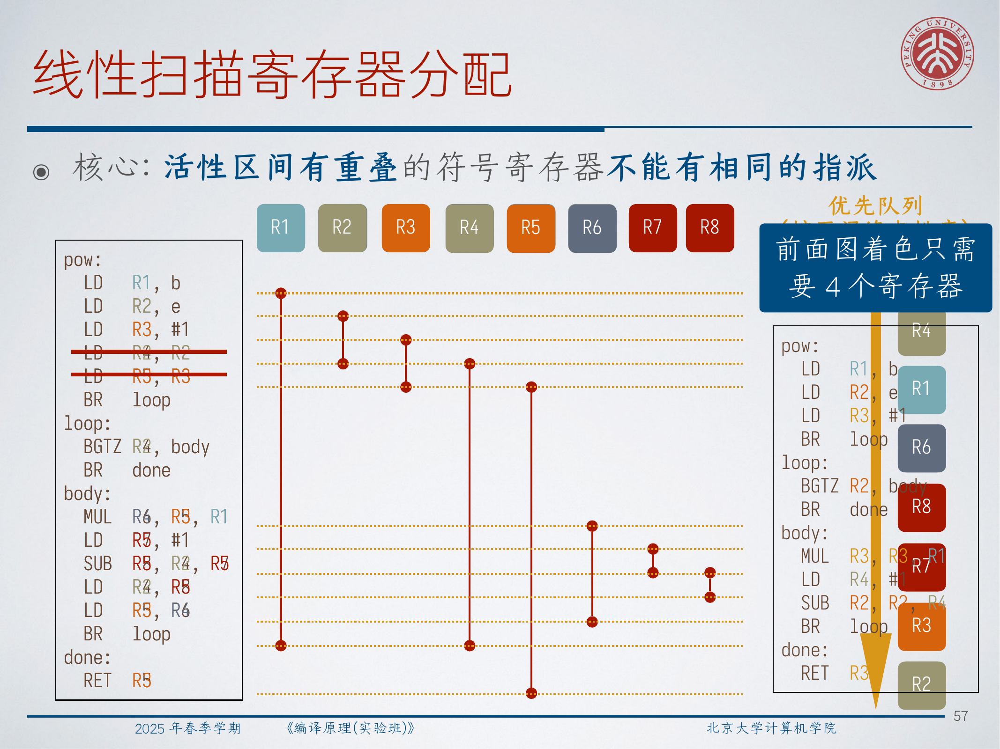

LSRA 的核心流程是：

1. 先算出所有 live interval；
2. 按区间起点顺序扫描；
3. 维护一个按区间终点排序的 active 集合；
4. 把已经结束的区间从 active 集合里移除；
5. 若有空闲寄存器就直接分配，否则选择某个区间 spill。

一个常见启发式是：把结束位置最晚的那个 active 区间拿去 spill。

讲义给出的复杂度是：

$$
O(|V| \log |R|)
$$

其中 `|V|` 是符号寄存器数量，`|R|` 是物理寄存器数量。

:::tip 💡 **问题：为什么 JIT 编译器这么偏爱线性扫描？**
因为 JIT 的编译开销会直接变成用户能感受到的等待时间。相比一个全局上可能更优、但编译更慢的算法，线性扫描往往能以更低的延迟给出已经相当不错的分配结果。很多时候，这就是更好的工程选择。
:::

## 11. 活跃区间切分

寄存器分配这部分的最后一个主题，是 **活跃区间切分（live-interval splitting）**。

直觉很简单：一个很长的活跃区间，可能会和许多短区间重叠，从而制造出不必要的寄存器压力。如果我们愿意在中间某个位置先把值存起来、以后再重新读回来，就能把一个长区间切成几个更短、重叠更少的区间。

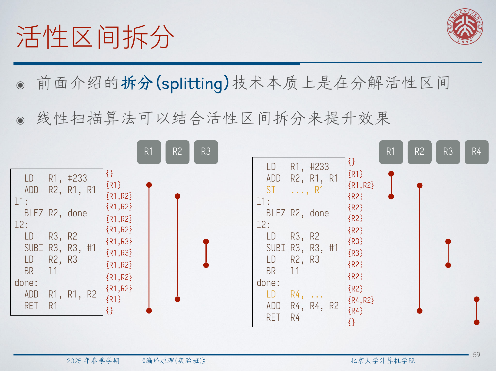

讲义的例子里，原本保存在 `R1` 中的值，会在进入循环前先存到内存，循环后再重新读回到 `R4`。这样就把一条跨越大段代码的长 live interval，拆成了两段更短的区间。

所以，区间切分本质上是在做一个受控交换：

- 少量增加一些访存；
- 换来更低的同时寄存器需求。

这在循环附近、或者某些“中间长期不用、但很久之后还要再用”的值上，尤其值得。

## 12. 用路径表达式表示无限 CFG 路径集合

这一讲最后一部分先抛出一个很根本的问题：

**数据流分析本质上到底在分析什么？**

从根子上讲，它分析的是 CFG 上的一组路径。但只要 CFG 里有循环，路径数就是无限的，因此我们需要一种有限记号去描述一个无限路径集合。

这个记号就是 **路径表达式（path expression）**。

**路径表达式** 是定义在有向图 `G = (V, E)` 上、以边集 `E` 为字母表的正则表达式，并额外要求：它识别出的每个串都必须真的是图 `G` 中的一条合法路径。

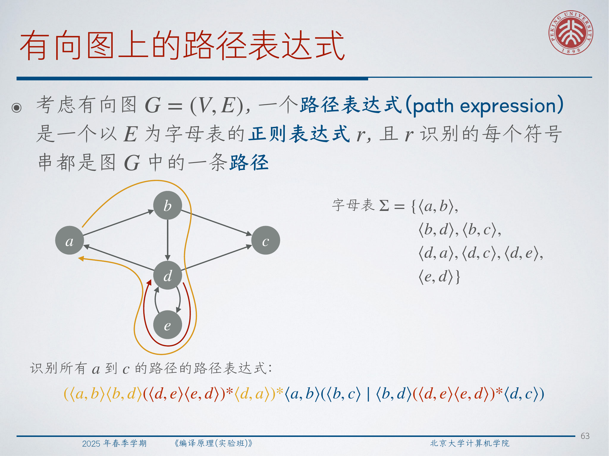

对讲义中的那个有向图，字母表是：

$$
\Sigma = \{\langle a,b \rangle,\ \langle b,d \rangle,\ \langle b,c \rangle,\ \langle d,a \rangle,\ \langle d,c \rangle,\ \langle d,e \rangle,\ \langle e,d \rangle\}
$$

所有从 `a` 到 `c` 的路径可以写成：

$$
\big(\langle a,b\rangle \langle b,d\rangle (\langle d,e\rangle \langle e,d\rangle)^* \langle d,a\rangle\big)^*
\langle a,b\rangle
\big(\langle b,c\rangle \mid \langle b,d\rangle (\langle d,e\rangle \langle e,d\rangle)^* \langle d,c\rangle\big)
$$

这一个有限表达式之所以能表示无限多条具体路径，正是因为 `*` 允许那一段回路被重复任意多次。

## 13. 用路径表达式做数据流分析

讲义先把路径表达式用在最短路上。

设 `F(r)` 表示路径表达式 `r` 所识别的所有路径中，长度最短的那一条，则：

$$
F(\varepsilon) = 0
$$

$$
F(\langle u_1, u_2 \rangle) = \mathrm{length}(\langle u_1, u_2 \rangle)
$$

$$
F(r_1 \mid r_2) = \min(F(r_1), F(r_2))
$$

$$
F(r_1 r_2) = F(r_1) + F(r_2)
$$

$$
F(r_1^*) =
\begin{cases}
-\infty, & F(r_1) < 0 \\
0, & \text{otherwise}
\end{cases}
$$

因为边 `\langle d,e \rangle` 的权重是 `-1`，边 `\langle e,d \rangle` 的权重是 `2`，所以回路 `d \to e \to d` 一圈的总权重是 `1`，其星闭包贡献的是 `0` 而不是 `-\infty`。因此讲义中那个完整表达式最后算出来的最短路值是 `1`。

同样一套形式系统，也可以用来描述 CFG 上前向与后向数据流分析的路径族。

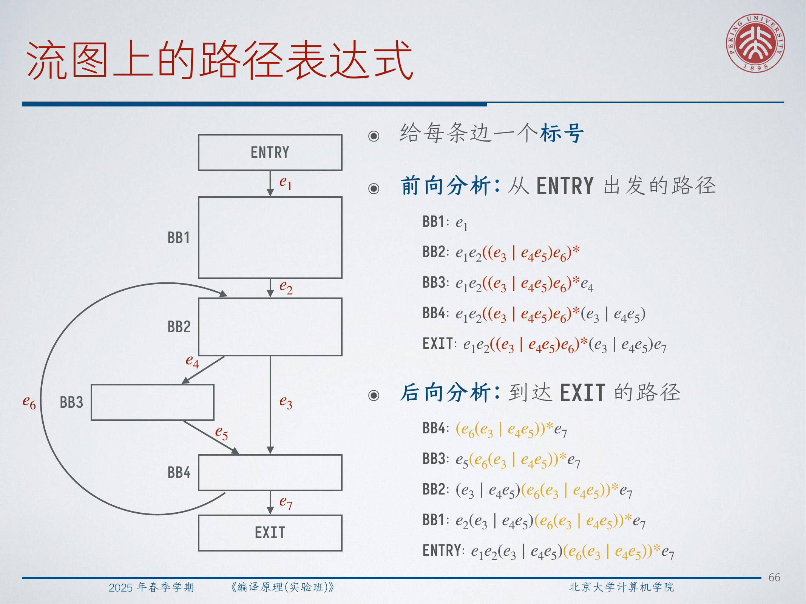

对图中的 CFG，有：

$$
BB2_{\mathrm{forward}} = e_1 e_2 \big((e_3 \mid e_4 e_5)e_6\big)^*
$$

$$
EXIT_{\mathrm{forward}} = e_1 e_2 \big((e_3 \mid e_4 e_5)e_6\big)^* (e_3 \mid e_4 e_5)e_7
$$

$$
ENTRY_{\mathrm{backward}} = e_1 e_2 (e_3 \mid e_4 e_5)\big(e_6 (e_3 \mid e_4 e_5)\big)^* e_7
$$

接着，把路径表达式从“路径集合”提升到“数据流变换”上。设数据流域为 `V`，meet 运算为 `\wedge`，每个基本块 `B` 有传递函数 `f_B : V \to V`，则讲义定义：

$$
F(\varepsilon) = \mathrm{id}
$$

$$
F(e) = f_{h(e)}
$$

$$
F(r_1 \mid r_2) = F(r_1) \wedge F(r_2)
$$

$$
F(r_1 r_2) = F(r_2) \circ F(r_1)
$$

$$
F(r_1^*) = \bigwedge_{i \ge 0} F(r_1)^i
$$

因此，正则表达式中的“选择、连接、重复”，在数据流世界里就分别对应于 meet、函数复合和闭包迭代。

:::remark 📝 **问题：为什么一个有限表达式真的可以代表无限多条 CFG 路径？**
因为无限性的来源，本质上就是“重复”，而重复正是 Kleene 星号要表达的东西。我们不需要把每个循环执行次数都单独列出来；路径表达式把整族路径压缩成了“连接 + 选择 + 重复”的代数组合。这跟正则表达式用有限写法描述无限语言，是同一类压缩思想。
:::

## 14. 不用迭代也能表达可达定值

讲义最后用一个可达定值例子，把路径表达式框架完整落了一遍。

该 CFG 中的定义点有：

- `d1: i = m - 1`
- `d2: j = n`
- `d3: a = u1`
- `d4: i = i + 1`
- `d5: j = j - 1`
- `d6: a = u2`
- `d7: i = u3`

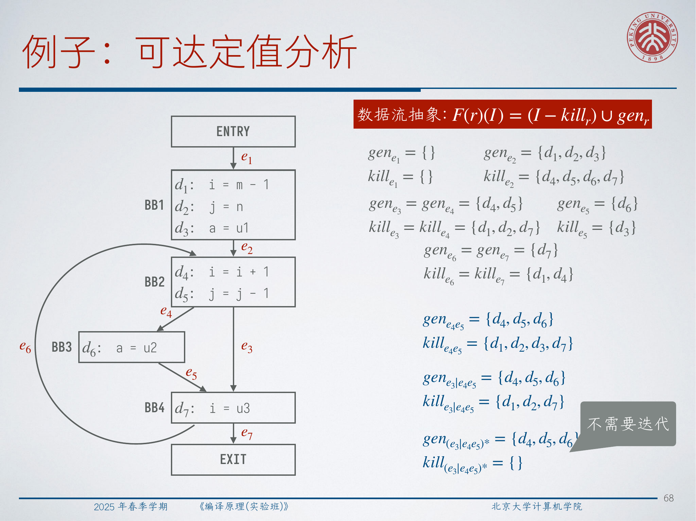

对应的数据流抽象是：

$$
F(r)(I) = (I - kill_r) \cup gen_r
$$

讲义随后自底向上算出了一系列 `gen` / `kill` 集合：

$$
gen_{e_4 e_5} = \{d_4, d_5, d_6\}, \qquad
kill_{e_4 e_5} = \{d_1, d_2, d_3, d_7\}
$$

$$
gen_{e_3 \mid e_4 e_5} = \{d_4, d_5, d_6\}, \qquad
kill_{e_3 \mid e_4 e_5} = \{d_1, d_2, d_7\}
$$

$$
gen_{(e_3 \mid e_4 e_5)^*} = \{d_4, d_5, d_6\}, \qquad
kill_{(e_3 \mid e_4 e_5)^*} = \{\}
$$

这里的重点不是说“传统迭代数据流分析不对”，而是说：路径表达式提供了另一种同样精确的表达方式。在像这个例子这样的场景里，结果可以通过代数式组合直接得到，而不必先走一轮标准工作表迭代。

## 15. Exam Review

### 15.1 必须会说清楚的核心定义

- **静态作用域**：名字绑定由词法嵌套结构决定。
- **动态作用域**：名字绑定由运行时调用链决定。
- **访问链**：活动记录指向其最近词法父过程活动记录的指针。
- **显示表**：按嵌套深度索引、每项指向该深度最近活动记录的数组。
- **闭包**：代码与其自由变量环境的组合。
- **垃圾**：不可达的堆数据。
- **根集合**：可达性分析的直接起点集合。
- **弦图**：任意长度至少为 `4` 的环都带弦的图。
- **单纯顶点**：其邻居集合构成团的顶点。
- **路径表达式**：以 CFG 或一般有向图边为字母表、且每个串都必须对应合法路径的正则表达式。

### 15.2 必须会解释的机制

- 访问链怎样定位声明在若干层外的非局部变量；
- 显示表为什么能把非局部访问降成常数时间索引；
- 为什么一等函数需要闭包，而不是单独一个代码指针；
- 为什么引用计数回收及时，但处理不了环；
- 标记-清扫、标记-压缩、复制回收之间的差别；
- 为什么分代 GC 依赖“大多数对象很快死亡”这一经验事实；
- 为什么 SSA 上的冲突图更容易着色；
- LSRA 怎样通过 live interval 而不是完整冲突图工作；
- 路径表达式怎样有限地表示无限路径族。

### 15.3 简答题模板

- **为什么闭包是必须的？**  
  因为嵌套函数可能活得比创建它的那次调用更久。闭包把代码和一个持久化环境绑在一起，通常由堆支持，这样以后再调用时仍然能看到正确绑定。

- **为什么单纯引用计数不能回收所有垃圾？**  
  因为环状结构可以彼此把计数维持在正数，即使根集合已经完全无法到达它们。

- **为什么 SSA 有利于寄存器分配？**  
  因为 SSA 改变了活跃性结构，使冲突图成为弦图，从而可以高效地求最优着色。

- **为什么路径表达式适合做数据流分析？**  
  因为它能用有限代数式表示无限 CFG 路径集合，再把这种结构提升成传递函数的组合、meet 和闭包。

### 15.4 常见混淆点

- 访问链跟随的是词法父关系，不是一般意义上的调用者链。
- 显示表只是优化查找成本，并没有改变静态作用域本身。
- 返回一个嵌套函数时，单纯栈环境并不安全。
- 弱引用能帮助打破所有权环，但它不是普通强引用。
- 复制回收会改善局部性，但它要付出半空间开销。
- 线性扫描很快，但并不总是全局最优。
- 路径表达式描述的是一族路径，而不是某一次具体执行。

### 15.5 自检清单

- 你能算出访问某个非局部变量需要沿访问链走几次吗？
- 你能用同一段代码解释静态作用域和动态作用域在运行结果上的差异吗？
- 你能比较引用计数、标记-清扫、标记-压缩、复制回收和分代回收吗？
- 你能解释为什么 SSA 会让冲突图变成弦图吗？
- 你能说明线性扫描里 active 集合维护的关键不变量吗？
- 你能给一个带循环的 CFG 写出路径表达式，并说明它怎样映射成数据流变换吗？
