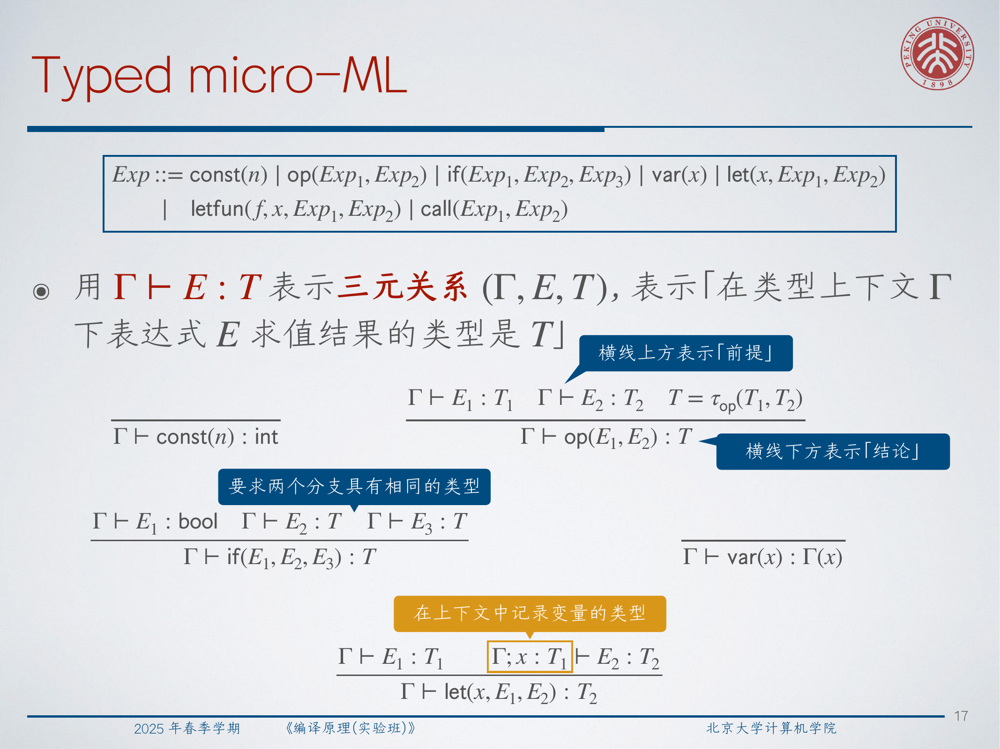
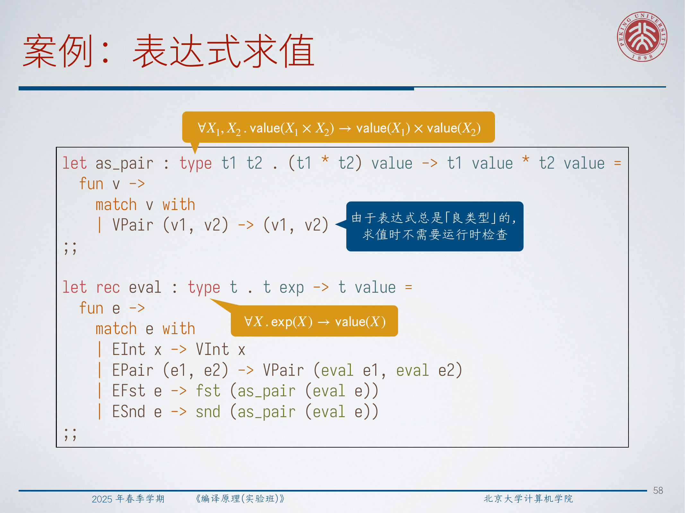
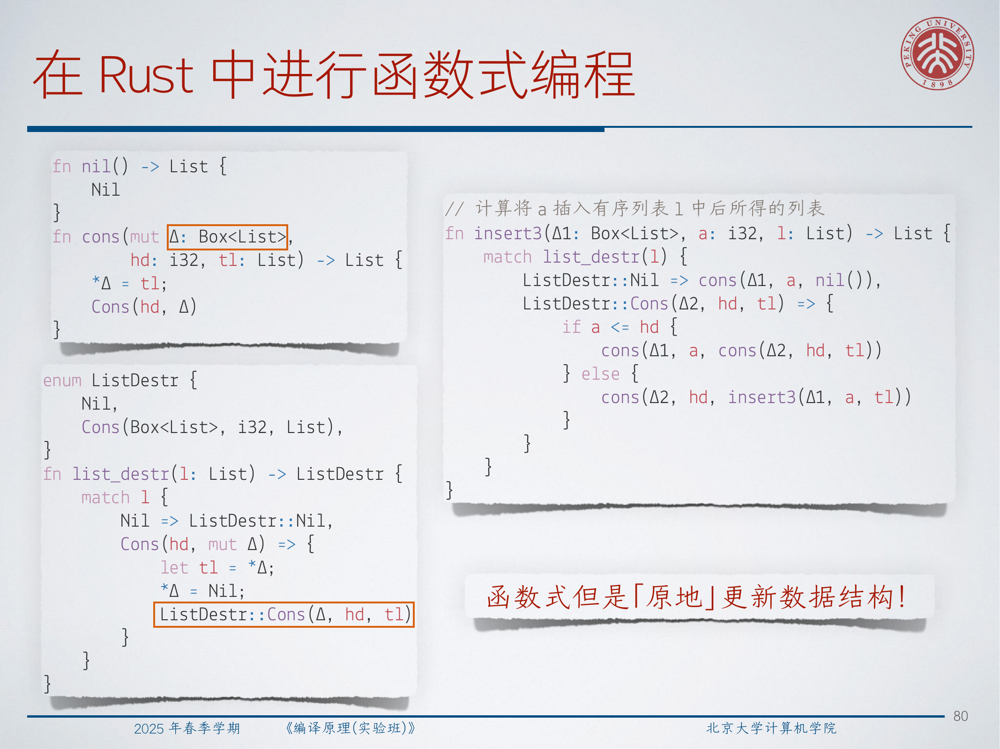
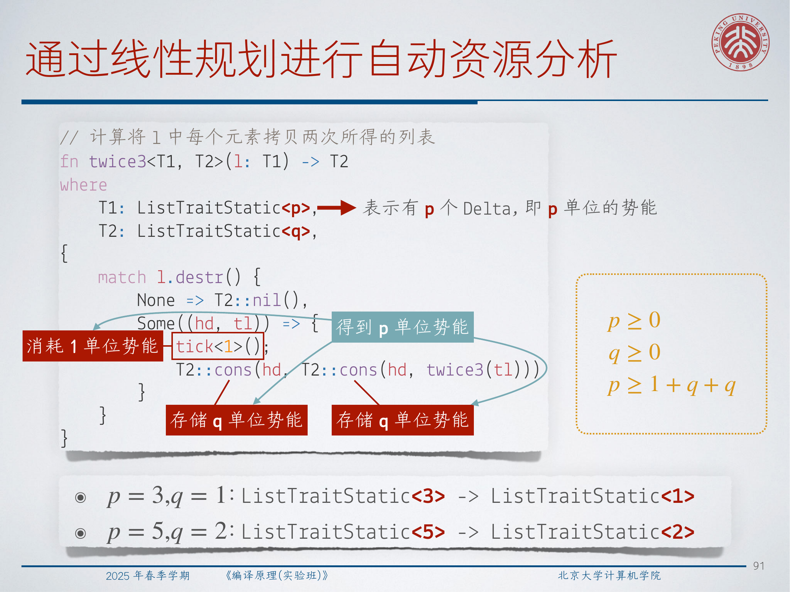

# Lec14: Type Systems

## 1. What a Type Describes

A type is not just a label attached to a variable. In this lecture, a type is best understood as **a concise, accurate, and formal description of program behavior**.

Typical examples already show different levels of meaning:

- `int` describes integer values;
- `int -> bool` describes functions from integers to booleans;
- `(int -> bool) -> (int list -> int list)` describes higher-order functions whose inputs and outputs are themselves structured behaviors.

So a type tells us what kind of result a program fragment can produce, what kind of input it expects, and what kinds of interactions are allowed.

## 2. Why Static Types Help, and What They Cost

The motivating promise of a sound static type system is the slogan:

**Well-typed expressions do not go wrong.**

That slogan matters because it turns type checking into a compile-time filter against whole classes of runtime failures.

Static types are useful for several reasons:

- they catch mistakes before execution;
- they serve as compact documentation;
- they enforce abstraction boundaries;
- they help compilers generate better code and justify optimizations;
- they can be preserved across intermediate representations, as in typed assembly and type-preserving compilation.

The lecture also stresses the tradeoff side:

- explicit annotations can be verbose;
- richer inference reduces but does not remove annotation burden;
- decidable sound systems are conservative, so they reject some programs that would happen to run safely;
- more expressive type systems are often harder to understand and implement.

**Type structure is a syntactic discipline for enforcing levels of abstraction.** That is why types are not only about safety; they are also about controlling what a program is allowed to observe.

:::remark 📝 **Question: what exactly does “do not go wrong” mean?**
It does not mean every well-typed program terminates or produces a useful answer. It means the program will not get stuck because an operation is applied to a value of the wrong shape. Divergence is still possible; type errors at runtime are the thing ruled out.
:::

## 3. Typed micro-ML: Types, Contexts, and Judgments

The lecture introduces a typed version of micro-ML as a minimal setting where we can state and prove type soundness clearly.

Its type language begins with function types over booleans and integers:

$$
\text{Type} ::= \text{int} \mid \text{bool} \mid T_1 \to T_2
$$

Typing assumptions are collected in a context:

$$
\Gamma ::= \varnothing \mid \Gamma, x : T
$$

There are then two central judgments:

$$
\Gamma \vdash E : T
\qquad
\rho \vdash E \Rightarrow v
$$

Read them as:

- under typing context `\Gamma`, expression `E` has type `T`;
- under runtime environment `\rho`, expression `E` evaluates to value `v`.

The whole lecture keeps moving between these two worlds: a static world of proofs and a dynamic world of evaluation.

## 4. The Core Typing Rules

The basic rules follow the structure of the language:

- constants have fixed primitive types;
- primitive operators accept only specific input types;
- `if` requires a boolean condition and branch types that agree;
- a variable gets the type assigned to it in `\Gamma`;
- `let` type-checks the bound expression, then checks the body under an extended context;
- `letfun` checks a recursive function body against an assumed function type;
- `call` checks that the callee has function type and the argument matches its domain.

Two rules are especially central:

$$
\frac{\Gamma, f : T_1 \to T_2, x : T_1 \vdash E_1 : T_2 \qquad \Gamma, f : T_1 \to T_2 \vdash E_2 : T}
{\Gamma \vdash \mathrm{letfun}(f, x, E_1, E_2) : T}
$$

$$
\frac{\Gamma \vdash E_1 : T_1 \to T_2 \qquad \Gamma \vdash E_2 : T_1}
{\Gamma \vdash \mathrm{call}(E_1, E_2) : T_2}
$$

One subtle point is that typing a function does not eliminate the need for closures at runtime. A function body may still mention variables from the surrounding environment, so evaluation must preserve those bindings even though typing talks only about shapes.

:::tip 💡 **Question: if a function is well typed, why do we still need closures?**
Because typing only tells us that the free variables have appropriate types; it does not provide their runtime values. When a function escapes its definition site, the evaluator still needs a closure that packages code together with the environment supplying those values.
:::

## 5. What Type Soundness Actually Says

The lecture first presents a weakened but intuitive statement:

$$
\text{If } \varnothing \vdash E : T \text{ and } [] \vdash E \Rightarrow v,
\text{ then } v : T.
$$

This says: if a closed expression type-checks and it does finish evaluating, the resulting value has the promised type.

To prove it cleanly, we need to type values and environments as well. Values include integers, booleans, and closures. A closure is typed by checking that its saved environment matches the context expected by the function body:

$$
\frac{\rho : \Gamma \qquad \Gamma, f : T_1 \to T_2, x : T_1 \vdash E : T_2}
{\mathrm{clos}(f, x, E, \rho) : T_1 \to T_2}
$$

Environment consistency is defined inductively:

$$
[] : \varnothing
\qquad
\frac{\rho : \Gamma \qquad v : T}
{[x \mapsto v]\rho : \Gamma, x : T}
$$

With those definitions, the strengthened theorem becomes:

$$
\text{If } \Gamma \vdash E : T,\ \rho \vdash E \Rightarrow v,\ \rho : \Gamma,
\text{ then } v : T.
$$

This stronger statement is exactly what the induction needs, because evaluation of subexpressions happens under nonempty environments.

:::remark 📝 **Question: why is the weakened theorem not enough for induction?**
A direct induction quickly gets stuck on rules like `let` and `call`. Their subderivations evaluate expressions in extended environments, not in the empty environment. The strengthened theorem generalizes the claim so the induction hypothesis applies to those subcomputations too.
:::

## 6. Divergence Is Not the Same as Going Wrong

A sound type system does not guarantee termination. Recursive programs may diverge forever even when every intermediate state is well typed.

So the full statement separates two outcomes:

$$
\text{If } \varnothing \vdash E : T,
\text{ then either } [] \vdash E \Rightarrow v \text{ for some } v : T,
\text{ or } [] \vdash E \Rightarrow \omega.
$$

The symbol `\omega` stands for nontermination. This is the right final formulation:

- a well-typed program may return a value of the claimed type;
- or it may diverge;
- but it does not reach a “nonsense” state where the semantics gets stuck for type reasons.

That is the precise content behind the slogan from the beginning.

## 7. Parametric Polymorphism

The lecture distinguishes three common notions of polymorphism:

1. subtyping polymorphism, common in object-oriented languages;
2. ad-hoc polymorphism, where behavior depends on the type, as with overloading, traits, or typeclasses;
3. parametric polymorphism, where the same code works uniformly for many types.

Parametric polymorphism is the main focus here. The canonical example is sorting:

$$
\forall X.\ (X \to X \to \text{bool}) \to (\mathrm{list}(X) \to \mathrm{list}(X))
$$

This type says something deep about behavior. Since `sort` must work for every `X`, it cannot inspect the internal representation of `X`; it can only move elements around and compare them through the comparator that was passed in.

This is why parametric types often imply “free theorems.” Two famous examples from the lecture are:

$$
\forall X.\ X \to X
\qquad
\forall X.\ X \to X \to X
$$

Ignoring divergence and effects:

- a term of type `\forall X. X \to X` can only behave like the identity;
- a term of type `\forall X. X \to X \to X` can only return either its first or second argument.

:::tip 💡 **Question: why does `\forall X. X \to X` force identity-like behavior?**
Because the function must work for every possible type `X` without knowing anything about `X`. It cannot manufacture a fresh `X`, inspect an `X`, or convert `X` to something else. The only available value of type `X` is the argument it was given.
:::

## 8. Polymorphic micro-ML and Type Erasure

The typed micro-ML language is then extended with type abstraction and type application.

The type grammar becomes:

$$
\text{Type} ::= \text{int} \mid \text{bool} \mid T_1 \to T_2 \mid X \mid \forall X.\ T
$$

Functions can quantify over type variables, and calls can instantiate them with concrete types. The key typing rule is:

$$
\frac{
\Gamma \vdash E_1 : \forall \vec X.\ T_1 \to T_2
\qquad
\Gamma \vdash E_2 : T_1[\vec T / \vec X]
}{
\Gamma \vdash \mathrm{call}(E_1, \langle \vec T \rangle, E_2) : T_2[\vec T / \vec X]
}
$$

The lecture illustrates this with substitutions such as:

$$
(X \to X)[\text{bool}/X] = \text{bool} \to \text{bool}
$$

$$
(X \to X)[(\forall Y.\ Y \to Y)/X] = (\forall Y.\ Y \to Y) \to (\forall Y.\ Y \to Y)
$$

Once types are purely static, the runtime can often erase them completely. In this polymorphic micro-ML, removing type parameters and type arguments does not change execution behavior, so **type erasure** is valid and avoids runtime overhead.

:::warn ⚠️ **Question: when does type erasure stop being valid?**
It stops being valid as soon as runtime behavior depends on types themselves. Reflection, typecase, reified generic metadata, or any operation that branches on a type requires keeping some form of type information at runtime.
:::

## 9. Product Types, Sum Types, Unit, and Empty Type

The lecture next enriches the language with standard data constructors.

For **product types**, we add pairs and projections:

- `pair(E_1, E_2)` builds a value of type `T_1 \times T_2`;
- `fst(E)` extracts the first component;
- `snd(E)` extracts the second.

For **sum types**, we add tagged injections and case analysis:

- `inl(E)` builds the left branch of `T_1 + T_2`;
- `inr(E)` builds the right branch;
- `case(E, E_l, E_r)` analyzes which branch was chosen.

The typing principles are:

$$
\frac{\Gamma \vdash E_1 : T_1 \qquad \Gamma \vdash E_2 : T_2}
{\Gamma \vdash \mathrm{pair}(E_1, E_2) : T_1 \times T_2}
$$

$$
\frac{\Gamma \vdash E_1 : T_1}
{\Gamma \vdash \mathrm{inl}(E_1) : T_1 + T_2}
\qquad
\frac{\Gamma \vdash E_1 : T_2}
{\Gamma \vdash \mathrm{inr}(E_1) : T_1 + T_2}
$$

Two degenerate cases are especially useful:

- `1`, the nullary product, whose unique inhabitant is `unit`;
- `0`, the nullary sum, which has no inhabitants at all.

They support useful identities:

$$
1 \times T \cong T
\qquad
0 + T \cong T
$$

The eliminator for `0` is often written as `absurd(E)`: if a value of type `0` existed, we could derive anything from it. The point is precisely that no such value can arise in a well-typed execution.

## 10. Recursive Types: Three Interpretations

Recursive data types are introduced through equations like:

$$
\mathrm{nat} \cong 1 + \mathrm{nat}
\qquad
\mathrm{list}(X) \cong 1 + X \times \mathrm{list}(X)
$$

The lecture presents three ways to understand these equations.

### 10.1 Equi-recursive types

The first view treats the equation as literal type equality. Then `nat` and `1 + nat` are interchangeable during type checking.

This is mathematically elegant but makes type checking more subtle, because the implementation must reason about recursive unfolding during type equivalence.

### 10.2 Structural iso-recursive types

The second view keeps the recursive type distinct and introduces explicit witnesses:

$$
\frac{\Gamma \vdash E : T[(\mu X.\ T)/X]}
{\Gamma \vdash \mathrm{fold}_{\mu X.\ T}(E) : \mu X.\ T}
\qquad
\frac{\Gamma \vdash E : \mu X.\ T}
{\Gamma \vdash \mathrm{unfold}_{\mu X.\ T}(E) : T[(\mu X.\ T)/X]}
$$

Now recursion is controlled: folded and unfolded forms are isomorphic, but not syntactically identical.

### 10.3 Nominal iso-recursive types

The third view hides the fold/unfold steps behind named constructors and eliminators. This is the style most programmers meet through algebraic data types.

Recursive types also explain how to type self-application patterns that were impossible before. The lecture uses the equation

$$
O \cong O \to (\text{int} \to \text{int})
$$

to give a type to the self-application trick behind a factorial-like encoding.

:::remark 📝 **Question: why does a recursive type make self-application typable?**
Ordinary simple types fail because they would force an impossible equation like `T = T -> U`. A recursive type solves this by making that self-reference explicit and legal: the function domain is no longer an ordinary finite type expression, but a recursively defined one.
:::

## 11. ADTs and Pattern Matching

Once we combine products, sums, and recursion, we get **algebraic data types (ADTs)**.

Examples from the lecture include natural numbers and lists:

- `Nat = Zero | Succ(Nat)`
- `List<X> = Nil | Cons(X, List<X>)`

ADTs add several practical conveniences at once:

- a named type constructor;
- named data constructors;
- pattern matching as the standard eliminator.

That combination matters. Raw sums and products already have the expressive power, but ADTs package the intent so programs become clearer and less error-prone.

Pattern matching then lets us define functions such as predecessor, append, or singleton in a direct structural style.

:::tip 💡 **Question: what do ADTs add beyond plain products and sums?**
They add naming and structure management. Instead of programming directly with anonymous injections and projections, we work with constructors that document intent and with pattern matches that expose exactly the cases allowed by the data definition.
:::

## 12. GADTs Rule Out Ill-Typed States

The lecture then moves from ADTs to **generalized algebraic data types (GADTs)**.

The motivating example is an expression language. In an ordinary ADT encoding, the evaluator may need runtime checks such as “is this value really a pair?” because the syntax tree itself does not guarantee that projections are only applied to pair-producing expressions.

A GADT fixes that by indexing syntax with result types. Conceptually, we get signatures like:

$$
\mathrm{as\_pair} : \forall X_1, X_2.\ \mathrm{value}(X_1 \times X_2) \to \mathrm{value}(X_1) \times \mathrm{value}(X_2)
$$

$$
\mathrm{eval} : \forall X.\ \mathrm{exp}(X) \to \mathrm{value}(X)
$$

Now constructors enforce the typing discipline when the syntax tree is built:

- an integer literal produces `int exp`;
- pairing produces `(t_1 * t_2) exp`;
- first projection requires an expression of pair type and returns the first component type.

The evaluator no longer needs defensive runtime checks for impossible cases, because those cases are unrepresentable.

The lecture even points out a stronger version:

$$
\mathrm{eval} : \forall X.\ \mathrm{exp}(X) \to X
$$

If the host language is expressive enough, the interpreter can evaluate straight to the semantic value rather than to a separately tagged value type.

:::remark 📝 **Question: why do the runtime checks disappear in the GADT version?**
Because the datatype constructors themselves carry the typing proof. If you only have a constructor `EFst : (t_1 * t_2) exp -> t_1 exp`, then there is simply no way to build an “`fst` of an integer expression” term. The impossible case has been removed from the input language.
:::

## 13. A Well-Typed `printf`

The `printf` example is a beautiful application of GADTs. The central problem is that the number and types of arguments depend on the format description itself.

So instead of giving `printf` one fixed first-order function type, we define a descriptor GADT and let the descriptor determine the result type:

$$
\mathrm{printf} : 'a\ \mathrm{desc} \to 'a
$$

The key constructors are:

$$
\mathrm{Nil} : \mathrm{unit}\ \mathrm{desc}
$$

$$
\mathrm{Lit} : \mathrm{string} \times 'a\ \mathrm{desc} \to 'a\ \mathrm{desc}
$$

$$
\mathrm{Int} : 'a\ \mathrm{desc} \to (\mathrm{int} \to 'a)\ \mathrm{desc}
\qquad
\mathrm{Str} : 'a\ \mathrm{desc} \to (\mathrm{string} \to 'a)\ \mathrm{desc}
$$

For example, a descriptor for `"%d * %s = %d"` has type

$$
(\mathrm{int} \to \mathrm{string} \to \mathrm{int} \to \mathrm{unit})\ \mathrm{desc}
$$

because printing that format requires exactly three extra arguments of those types, then returns `unit`.

The implementation follows the descriptor:

- `Nil` prints nothing further and returns `()`;
- `Lit(s, d)` prints the literal string `s`, then continues with `d`;
- `Int d` returns a function that expects an integer, prints it, then continues;
- `Str d` does the same for strings.

This is a perfect example of using types to describe a protocol whose shape depends on earlier data.

:::tip 💡 **Question: how does the format description determine the function type of `printf`?**
Each constructor transforms the remaining type. `Nil` ends the chain with `unit`. `Lit` leaves the remaining type unchanged because it consumes no argument. `Int` and `Str` prepend one required argument type to the front of the function type described by the rest of the format.
:::

## 14. Ownership, Linearity, and Functional Updates in Rust

The last part of the lecture connects type systems with resource management through Rust-style ownership.

The important operational facts are:

- a `Box<T>` owns one heap allocation;
- ownership is moved rather than copied by default;
- using a moved value is a static error;
- recursive heap data such as linked lists need indirection like `Box<List>` so the outer type has known size.

This leads to an interesting question: can we still program in a functional style while reusing memory in place?

The lecture explores several list-processing variants:

- a simple `append` that allocates as needed;
- `append2`, which reuses existing boxes by unpacking, recursing, and writing back into the same owned cell;
- `insert2`, which receives an extra free box as an argument so the computation avoids internal allocation;
- `insert3`, which factors allocation and destruction through abstract constructors and destructors.

The conceptual point is that ownership types let the language express not only “who may access this data,” but also “which heap resource is being consumed or returned.”

:::warn ⚠️ **Question: why must ordinary sorted-list insertion allocate one new box?**
Because the output list is one element longer than the input list. Reusing existing cells is not enough: somewhere, one additional list node has to come from an extra memory resource.
:::

## 15. Non-Size-Increasing Computation

This resource view is then pushed much further.

If a computation is not allowed to increase total memory usage internally, every extra heap cell it needs must be supplied from outside as an explicit parameter. That is the idea behind **non-size-increasing computation**.

Under this discipline:

- destructing a list node releases one unit of resource;
- constructing a list node consumes one unit of resource;
- a function that needs additional output space must receive matching resource from its input or from extra parameters.

This also explains why a naive duplication routine cannot type-check with only one extra cell. If one `\Delta` resource must be used exactly once, it cannot pay for two newly built list cells.

The lecture notes a striking complexity result: the expressive power of this style of programming coincides with `EXPTIME`.

:::error ⛔ **Question: why can one extra box `\Delta` not be used twice?**
Because the resource is linear. A linear value represents ownership of one specific reusable heap cell, not an unlimited permission token. After it has been consumed to build one node, it is no longer available for a second construction.
:::

## 16. Potential-Annotated Types and Automatic Resource Analysis

The final step is to make resources visible in types themselves.

From the abstract viewpoint, a list interface can expose an associated resource type:

- `cons` consumes one resource unit;
- `destr` returns one resource unit when a node is opened.

If we choose the resource to be static type information, we get a type-based resource analysis method. For instance, the lecture writes judgments like:

$$
T_1 : \mathrm{ListTraitStatic}\langle 2 \rangle
\qquad
T_2 : \mathrm{ListTraitStatic}\langle 1 \rangle
$$

meaning:

- each input list element carries two units of potential;
- each output list element carries one unit.

The amortized-analysis view is expressed through a potential function:

$$
\Phi(D_i) \ge \mathrm{Cost}(D_i, D_{i+1}) + \Phi(D_{i+1})
$$

This scales from memory to time as well. If duplicating each element spends one extra time unit, we may require:

$$
T_1 : \mathrm{ListTraitStatic}\langle 3 \rangle
\qquad
T_2 : \mathrm{ListTraitStatic}\langle 1 \rangle
$$

Finally, the resource variables can be left symbolic and solved by linear programming. The lecture's example leads to constraints such as:

$$
p \ge 0
\qquad
q \ge 0
\qquad
p \ge 1 + q + q
$$

From one solution we get a bound like `3 -> 1`; from another we may get `5 -> 2`. The important point is not the specific numbers, but that the compiler can infer safe resource relationships automatically.

:::remark 📝 **Question: how are the parameters `p` and `q` obtained automatically?**
We assign symbolic potential annotations to the input and output types, generate inequalities from every constructor, destructor, recursive call, and explicit cost tick, and then solve the resulting linear constraints. Any solution gives a sound resource bound.
:::

## 17. Exam Review

### 17.1 Key Definitions

- **Type**: a formal description of admissible program behavior.
- **Soundness**: well-typed programs evaluate to values of the promised type or diverge, but do not get stuck for type reasons.
- **Parametric polymorphism**: uniform behavior across all instantiations of a type variable.
- **Product / sum type**: data formed by pairing components or choosing tagged alternatives.
- **Recursive type**: a type defined in terms of itself, often through `\mu X. T`.
- **ADT**: a named combination of sums, products, and recursion with constructors and pattern matching.
- **GADT**: an ADT whose constructors can refine the result type.
- **Potential**: statically assigned abstract resource stored in data, used to pay for future cost.

### 17.2 Short-Answer Templates

- Why do we strengthen the soundness theorem?  
  Because evaluation of subexpressions happens in nonempty environments, so the induction hypothesis must talk about arbitrary `\Gamma` and `\rho`.

- Why does parametric polymorphism imply behavioral restrictions?  
  Because code that must work for every `X` cannot rely on representation-specific operations on `X`.

- Why introduce `fold` and `unfold`?  
  To make recursive-type conversion explicit and controllable in iso-recursive systems.

- Why do GADTs remove some runtime checks?  
  Because impossible cases are excluded by the indexed constructors used to build the syntax.

- Why can resource analysis be encoded in types?  
  Because construction and destruction of data correspond to resource consumption and release, and those effects can be tracked compositionally.

### 17.3 Common Pitfalls

- Confusing divergence with unsoundness.
- Thinking polymorphism means “one implementation per type” rather than “one uniform implementation for all types.”
- Treating recursive types as ordinary aliases without asking whether the system is equi-recursive or iso-recursive.
- Forgetting that ADTs add names and elimination structure, not only raw expressive power.
- Assuming ownership only controls aliasing, while missing its role in tracking reusable resources.

### 17.4 Self-Check

- Can you state both the weakened and strengthened soundness theorems?
- Can you explain why `\forall X. X \to X` has only identity-like behavior?
- Can you distinguish products, sums, unit, and empty type with examples?
- Can you explain the difference among equi-recursive, structural iso-recursive, and nominal recursive types?
- Can you describe how GADTs make ill-typed syntax trees unrepresentable?
- Can you explain why typed `printf` is really a typed heterogeneous protocol?
- Can you derive the intuition behind inequalities such as `p \ge 1 + q + q`?
