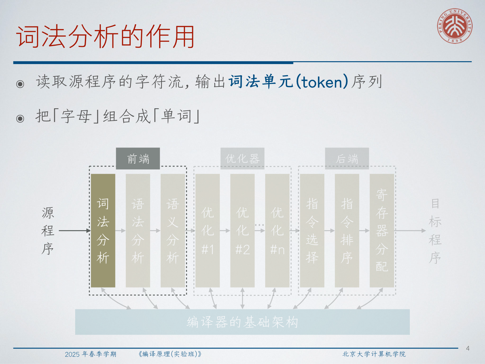
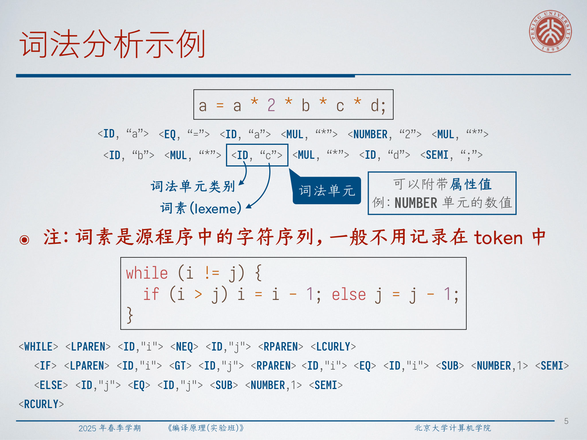
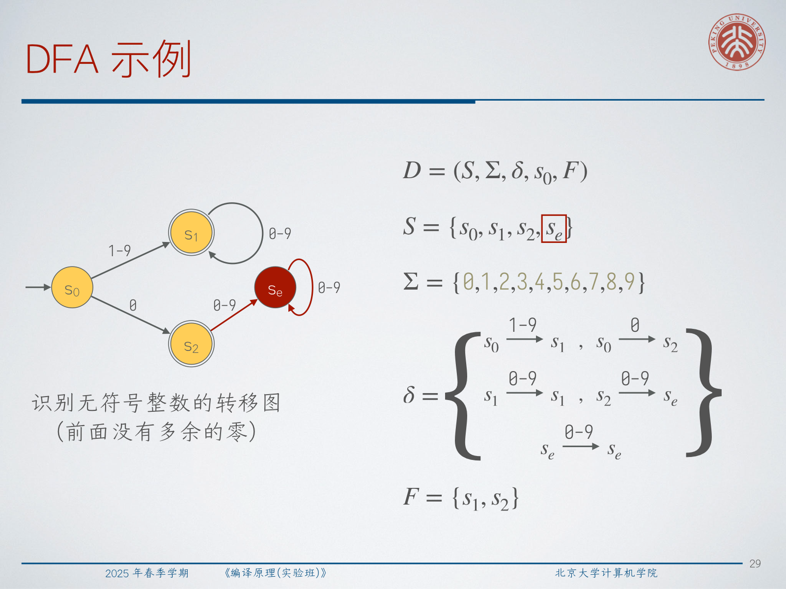
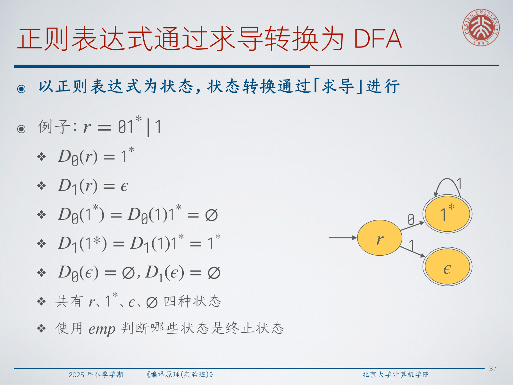
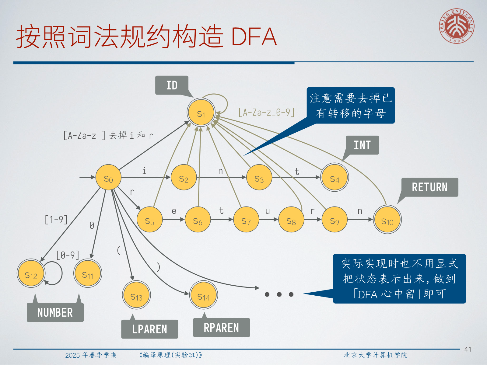

# Lec2: Lexical Analysis

Lexical analysis is the first stage that gives source text a compiler-friendly shape. It reads raw characters, groups them into meaningful units, discards text that later phases usually do not need, and attaches source locations so that errors can point back to the original program.



## 1. What Lexical Analysis Does

**A lexical analyzer reads the character stream of the source program and outputs a sequence of lexical units, or tokens.** Informally, it turns "letters" into "words" before parsing starts.

For the statement:

```c
a = a * 2 * b * c * d;
```

a possible token sequence is:

```text
<ID,"a"> <EQ,"="> <ID,"a"> <MUL,"*"> <NUMBER,"2"> <MUL,"*">
<ID,"b"> <MUL,"*"> <ID,"c"> <MUL,"*"> <ID,"d"> <SEMI,";">
```

The source substring that matches a token is its lexeme. A token normally records the token class and optional attributes; for example, a `NUMBER` token may store the machine integer value, while an `ID` token may store the identifier name or a symbol-table reference.



Common token classes include keywords or reserved words, identifiers, literals, operators, and delimiters. A lexer may also remove whitespace and comments, perform limited preprocessing such as macro expansion, convert numeric literals to machine representations, and maintain line-column information for later diagnostics.

:::remark 📝 Question: Why do we need lexical analysis?
Question: **Why not parse directly from the source character stream? What are the benefits of representing the program as a token sequence?**

Answer: tokenization separates low-level character grouping from grammar-level structure. The parser can reason about `ID`, `NUMBER`, `WHILE`, and `LPAREN` instead of many individual characters. This simplifies the grammar, makes error reporting cleaner, centralizes keyword/operator rules, and lets the compiler ignore comments and most whitespace before parsing.
:::

:::tip 💡 Tokens in language models and compilers
In both compilers and natural-language models, a token is a small unit used by the next stage. The difference is the design goal. Compiler tokens are defined by language specifications and must preserve exact program meaning; language-model tokens are chosen for statistical efficiency and may be smaller or larger than natural-language words.
:::

## 2. Specifications and Regular Expressions

**A specification is a formal notation for describing problems, definitions, algorithms, and so on.** The lexical specification of a programming language defines every token class. In most programming languages, these definitions are written using regular expressions.

### Alphabets, Strings, and Languages

**An alphabet is a nonempty finite set of symbols**, usually written as $\Sigma$. Examples include $\Sigma=\{0,1\}$ for binary machine language, the ASCII character set, or a programming language's character set.

**Given an alphabet, a string is a finite sequence of symbols drawn from that alphabet.** Single symbols are often written as $a,b,c,\ldots$; strings are often written as $\alpha,\beta,\gamma,\ldots$ or $x,y,z$. The special symbol $\epsilon$ denotes the empty string.

Two basic string operations are concatenation and exponentiation. If $x$ and $y$ are strings, then $xy$ is the string formed by writing $y$ after $x$. If $n$ is a natural number, then $x^n$ concatenates $n$ copies of $x$, and $x^0=\epsilon$.

**A language is a set of strings over some alphabet.** The set may be finite or countably infinite. Examples include $\varnothing$, $\{\epsilon\}$, all valid C identifiers, all syntactically valid C programs, or all syntactically valid English sentences.

### Regular Expressions

Given an alphabet $\Sigma$, regular expressions are defined inductively.

- $\epsilon$ is a regular expression and matches the empty string.
- If $a \in \Sigma$, then $a$ is a regular expression and matches the one-symbol string $a$.
- If $r$ and $s$ are regular expressions, then $r \mid s$, $rs$, and $r^*$ are regular expressions.
- The expression $r \mid s$ matches strings matched by either $r$ or $s$.
- The expression $rs$ matches strings that can be split into a prefix matched by $r$ and a suffix matched by $s$.
- The expression $r^*$ matches a concatenation of $n$ strings matched by $r$, where $n \ge 0$.

For $\Sigma=\{a,b\}$:

$$
a \mid b
$$

matches `a` or `b`;

$$
(a \mid b)(a \mid b)
$$

matches all length-2 strings over the alphabet;

$$
(a \mid b)^*
$$

matches all finite strings over the alphabet, including $\epsilon$.

A typical C-style identifier can be described as:

$$
(A \mid B \mid \cdots \mid Z \mid a \mid b \mid \cdots \mid z \mid \_)(A \mid B \mid \cdots \mid Z \mid a \mid b \mid \cdots \mid z \mid \_ \mid 0 \mid 1 \mid \cdots \mid 9)^*
$$

A signed integer can be described as:

$$
(+ \mid - \mid \epsilon)(0 \mid 1 \mid \cdots \mid 9)(0 \mid 1 \mid \cdots \mid 9)^*
$$

### Regular Languages and Useful Laws

The strings matched by a regular expression $r$ form its language $L(r)$:

$$
L(\epsilon)=\{\epsilon\}
$$

$$
L(a)=\{a\}
$$

$$
L(r \mid s)=L(r)\cup L(s)
$$

$$
L(rs)=\{xy \mid x\in L(r), y\in L(s)\}
$$

$$
L(r^*)=\{x_1x_2\cdots x_n \mid n\ge 0,\ x_1,x_2,\ldots,x_n\in L(r)\}
$$

**A language that can be described by a regular expression is called a regular language.** If $L(r)=L(s)$, then $r$ and $s$ are considered equivalent.

Useful equivalences include:

$$
\epsilon r_1 = r_1\epsilon = r_1
$$

$$
r_1 \mid r_2 = r_2 \mid r_1
$$

$$
r_1 \mid (r_2 \mid r_3) = (r_1 \mid r_2) \mid r_3
$$

$$
r_1(r_2r_3) = (r_1r_2)r_3
$$

$$
r_1(r_2 \mid r_3)=r_1r_2 \mid r_1r_3
$$

$$
(r_1 \mid r_2)r_3=r_1r_3 \mid r_2r_3
$$

$$
r_1^*=(r_1 \mid \epsilon)^*,\qquad (r_1^*)^*=r_1^*,\qquad (r_1 \mid r_2)^*=(r_1^*r_2^*)^*
$$

Practical regular-expression syntax often adds abbreviations:

$$
r^*=r^+ \mid \epsilon,\qquad r^+=rr^*=r^*r,\qquad r?=r \mid \epsilon
$$

$$
[abc]=a \mid b \mid c,\qquad [a-z]=a \mid b \mid c \mid \cdots \mid z
$$

Thus the identifier pattern can be written compactly as:

$$
[A-Za-z\_]([A-Za-z\_0-9])^*
$$

### Regular Expressions as Lexical Specifications

A lexer specification lists token classes together with their regular expressions. During scanning, two conventions are essential.

- Longest match: choose the rule that matches the longest prefix of the remaining input.
- Rule priority: if several rules match the same longest prefix, choose the earlier rule.

For example, `while` can match both `WHILE` and `ID`. If the `WHILE` rule is listed before `ID`, the lexer emits `<WHILE>`. The input `!=` can match `!` as `NOT` and `!=` as `NEQ`; longest match chooses `<NEQ>`.

:::warn ⚠️ Question: Should every keyword be a separate token class?
Question: **Each keyword or reserved word can correspond to its own token class. What are the advantages and disadvantages?**

Answer: separate keyword tokens make parsing simpler because grammar rules can directly mention `IF`, `WHILE`, or `RETURN`. The cost is a larger token set and more lexer rules. A common implementation still recognizes the identifier pattern first, then checks whether the lexeme appears in a keyword table.
:::

:::remark 📝 Question: Why introduce token classes instead of recording only lexemes?
Question: **Why does lexical analysis introduce token classes rather than just keeping the original lexeme text?**

Answer: token classes preserve the syntactic role while hiding irrelevant spelling details. The parser needs to know that `x` and `count` are both identifiers; it does not need a separate grammar rule for every possible variable name. The lexeme or attribute remains available when later phases need exact names or literal values.
:::

## 3. From Transition Diagrams to DFA

A direct hand-written recognizer can read characters one by one. For the token `IF` with pattern `if`, the program checks whether the first character is `i` and the second is `f`. This idea is clearer when drawn as a transition diagram.

A transition diagram contains states, edges, an initial state, accepting states, and implicit error transitions. A state summarizes what has already been recognized; an accepting state means the current input prefix forms a valid token.

The unsigned-integer recognizer without leading zeros has three meaningful states and an error state. It accepts `0` or a nonzero digit followed by any number of digits, but rejects strings such as `00`.



**A deterministic finite automaton (DFA) is a five-tuple $D=(S,\Sigma,\delta,s_0,F)$.** Here $S$ is a finite set of states, $\Sigma$ is the alphabet, $\delta:S\times\Sigma\to S$ is the transition function, $s_0\in S$ is the initial state, and $F\subseteq S$ is the set of accepting states.

For the unsigned-integer DFA:

$$
S=\{s_0,s_1,s_2,s_e\},\qquad \Sigma=\{0,1,2,3,4,5,6,7,8,9\}
$$

$$
\delta=\{s_0\xrightarrow{1-9}s_1,\ s_0\xrightarrow{0}s_2,\ s_1\xrightarrow{0-9}s_1,\ s_2\xrightarrow{0-9}s_e,\ s_e\xrightarrow{0-9}s_e\}
$$

$$
F=\{s_1,s_2\}
$$

A generic DFA recognizer initializes $s=s_0$, repeatedly updates $s=\delta(s,c)$ while reading characters, and succeeds exactly when the final state belongs to $F$.

:::tip 💡 Implementation view
You do not have to build an explicit graph object. In a small lexer, the "DFA" may live inside a `switch` statement, a transition table, or a set of carefully ordered conditionals.
:::

## 4. Building Lexers from Regular Expressions

Regular expressions and DFA describe the same class of languages. Simple examples show the correspondence: $a\mid b$ branches on one character; $(a\mid b)(a\mid b)$ remembers that one character has been read; $a^*$ uses a loop; $a^*b$ loops on `a` and accepts after a final `b`.

Sometimes building the DFA directly is easier than writing the regular expression. To recognize binary numbers divisible by $5$, use states $s_i$ for the current value modulo $5$. Reading a new bit $b$ updates the remainder:

$$
i'=(2i+b)\bmod 5
$$

State $s_0$ is accepting.

:::remark 📝 Question: How do we build a DFA for binary numbers whose value is 1 modulo 32?
Question: **How can we construct a DFA that recognizes all binary numbers whose remainder modulo 32 is 1?**

Answer: use 32 states $s_0,\ldots,s_{31}$, where $s_i$ means the prefix read so far has value $i$ modulo $32$. On input bit $b\in\{0,1\}$, transition to $s_{(2i+b)\bmod 32}$. The initial state is $s_0$, and the only accepting state is $s_1$.
:::

:::warn ⚠️ Question: How do we write regexes for the modulo languages?
Question: **How can we construct regular expressions for the languages recognized by these modulo DFA?**

Answer: first construct the finite automaton, then eliminate states or solve the system of regular equations induced by the DFA. The resulting expression is usually much less readable than the automaton, which is why automata are often the better specification for arithmetic remainder patterns.
:::

For a real lexer, combine all token rules into one large regular expression using choice, construct one DFA, and label each accepting state with the token class it represents. While scanning, keep reading until the next character would go to an error state, remember the most recent accepting state, emit the corresponding token, reset to $s_0$, and continue.

This is where longest match and rule priority meet the DFA implementation: the scanner remembers the farthest accepting point, and if that point can represent several rules, it uses the earliest rule.

## 5. Derivatives of Regular Expressions

The derivative of a language with respect to a symbol is another language:

$$
D_a(L)=\{w\mid aw\in L\}
$$

For example:

$$
D_b\{foo,bar,baz\}=\{ar,az\},\qquad D_f\{foo,bar,baz\}=\{oo\},\qquad D_a\{foo,bar,baz\}=\varnothing
$$

The key theorem is: **the derivative of a regular language is still regular.** For regular expressions:

$$
D_a(\epsilon)=\varnothing,\qquad D_a(a)=\epsilon,\qquad D_a(b)=\varnothing\ (a\ne b)
$$

$$
D_a(r\mid s)=D_a(r)\mid D_a(s)
$$

$$
D_a(rs)=D_a(r)s\mid emp(r)D_a(s)
$$

$$
D_a(r^*)=D_a(r)r^*
$$

The function $emp(r)$ checks whether $r$ matches the empty string. It returns $\epsilon$ if $\epsilon\in L(r)$ and $\varnothing$ otherwise:

$$
emp(\epsilon)=\epsilon,\qquad emp(a)=\varnothing
$$

$$
emp(r\mid s)=emp(r)\mid emp(s),\qquad emp(rs)=emp(r)emp(s),\qquad emp(r^*)=\epsilon
$$

To test whether a regular expression $r$ matches a string $w$, take derivatives of $r$ by the symbols of $w$ in order, then check whether the final expression matches the empty string.

For $r=01^*\mid 1$:

$$
D_0(r)=D_0(01^*\mid 1)=D_0(01^*)\mid D_0(1)=D_0(0)1^*\mid emp(0)D_0(1^*)\mid\varnothing=1^*
$$

$$
D_1(r)=D_1(01^*\mid 1)=D_1(01^*)\mid D_1(1)=D_1(0)1^*\mid emp(0)D_1(1^*)\mid\epsilon=\epsilon
$$

Using regular expressions as states and derivatives as transitions gives a DFA. For $r=01^*\mid 1$, the distinct states are:

$$
\{r,\ 1^*,\ \epsilon,\ \varnothing\}
$$

The accepting states are the expressions whose $emp$ result is not $\varnothing$.



:::tip 💡 Why derivatives are useful
Derivatives give a direct conceptual bridge from "a regex describes the remaining language" to "a state summarizes the remaining work." This is a clean way to understand why regex-based lexers can be compiled into DFA.
:::

## 6. A Toy Language Lexer

The toy language is a small C-like language with only `main`, only `int`, and straight-line code. Its token rules include:

- `INT`: `int`
- `RETURN`: `return`
- `ID`: `[A-Za-z_]([A-Za-z_0-9])*`
- `NUMBER`: `0|[1-9]([0-9])*`
- `LPAREN` and `RPAREN`: `(` and `)`
- `LCURLY` and `RCURLY`: `{` and `}`
- `EQ`, `SEMI`, `PLUS`, `MINUS`, `STAR`, `SLASH`, `PERCENT`: `=`, `;`, `+`, `-`, `*`, `/`, `%`



The combined DFA branches from the start state into keyword prefixes, identifiers, numbers, and single-character tokens. To make `int` and `return` keywords while still accepting longer identifiers such as `integer` or `returnValue`, the transitions from keyword-prefix states must fall back to the `ID` accepting state when the next character is a valid identifier character but no longer follows the keyword spelling.

:::warn ⚠️ Pitfall: keyword prefixes are not enough
If `int` reaches an accepting `INT` state, the lexer must still continue reading when the next character is a letter, digit, or underscore. Otherwise `integer` could be incorrectly split as `INT` followed by `ID`. Longest match prevents this.
:::

## 7. Summary

Lexical analysis gives each token class a specification, usually a regular expression. Regular expressions define regular languages; DFA recognize exactly these languages and provide an implementation model. A production lexer combines all token rules into one recognition process, uses longest match, resolves ties by rule priority, records token attributes, and resets after emitting each token.

## Exam Review

Core definitions:

- Token: a lexical unit emitted by the lexer, consisting of a class and optional attributes.
- Lexeme: the source substring matched by a token.
- Lexical specification: the formal definition of each token class.
- Regular language: a language expressible by a regular expression.
- DFA: $D=(S,\Sigma,\delta,s_0,F)$ with deterministic transitions and accepting states.
- Longest match: choose the rule that consumes the longest input prefix.
- Rule priority: if several rules tie in length, choose the one listed earlier.

Mechanisms to be able to explain:

- Character stream to token sequence.
- Regular expression semantics through $L(r)$.
- DFA recognition by repeatedly applying $\delta$.
- Combined lexer DFA with one accepting token class per accepting state.
- Regular-expression derivatives as states of a DFA.
- `emp(r)` as the empty-string test for accepting states.

Short-answer templates:

- Why lexical analysis? It separates character-level recognition from syntax, simplifies grammar rules, removes whitespace/comments, attaches source locations, and stores attributes such as identifier names or numeric values.
- Why longest match? Operators and identifiers often share prefixes; longest match ensures `!=` becomes `NEQ` rather than `NOT` plus `EQ`, and `integer` is not split after `int`.
- Why priority? Keywords and identifiers may match the same lexeme. Putting keyword rules earlier lets `while` become `WHILE` rather than `ID`.
- Can whitespace or comments be kept? Yes, but then later phases must handle them. Most compilers drop them or keep only location-sensitive information.
- Are all lexical specifications regular? Many practical token classes are regular, but features such as nested comments or indentation-sensitive layout need extra state, counters, stacks, or parser-level handling.

Common mistakes:

- Confusing a token class with a lexeme.
- Forgetting attributes for identifiers and numeric literals.
- Treating keyword recognition as complete before checking the next identifier character.
- Stopping at the first accepting state instead of the longest accepting prefix.
- Omitting the implicit error state in DFA reasoning.
- Treating $\epsilon$ and $\varnothing$ as the same object.

Self-check:

- Can you write a regex for identifiers and unsigned integers without leading zeros?
- Can you convert a small transition diagram into $D=(S,\Sigma,\delta,s_0,F)$?
- Can you explain why `while` becomes `WHILE` but `while2` becomes `ID`?
- Can you compute $D_0(01^*\mid 1)$ and $D_1(01^*\mid 1)$?
- Can you say which derivative states are accepting by applying $emp$?
