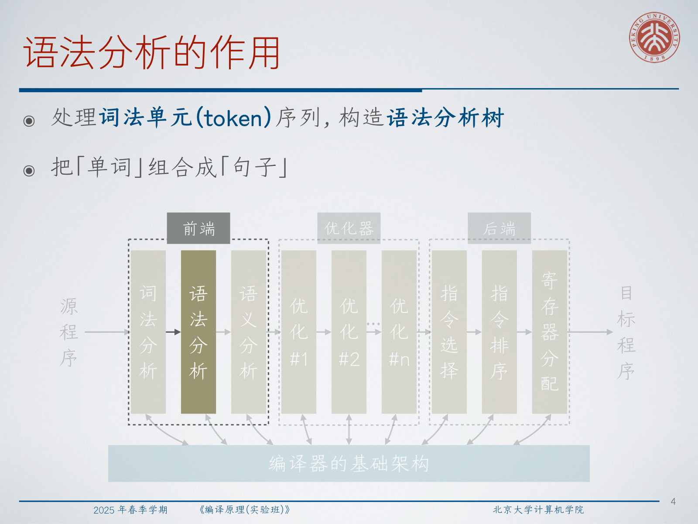
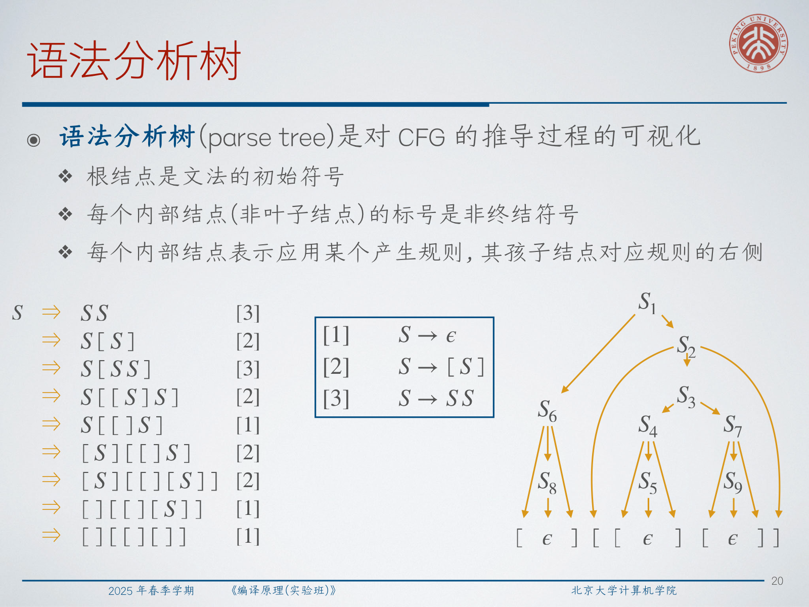
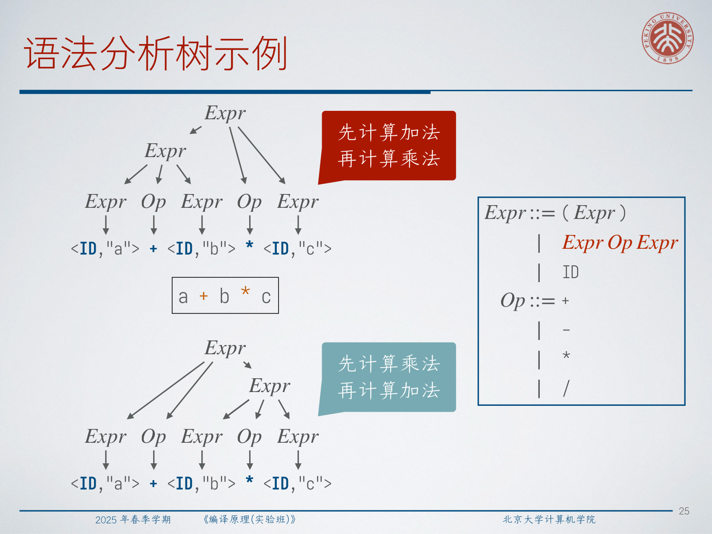
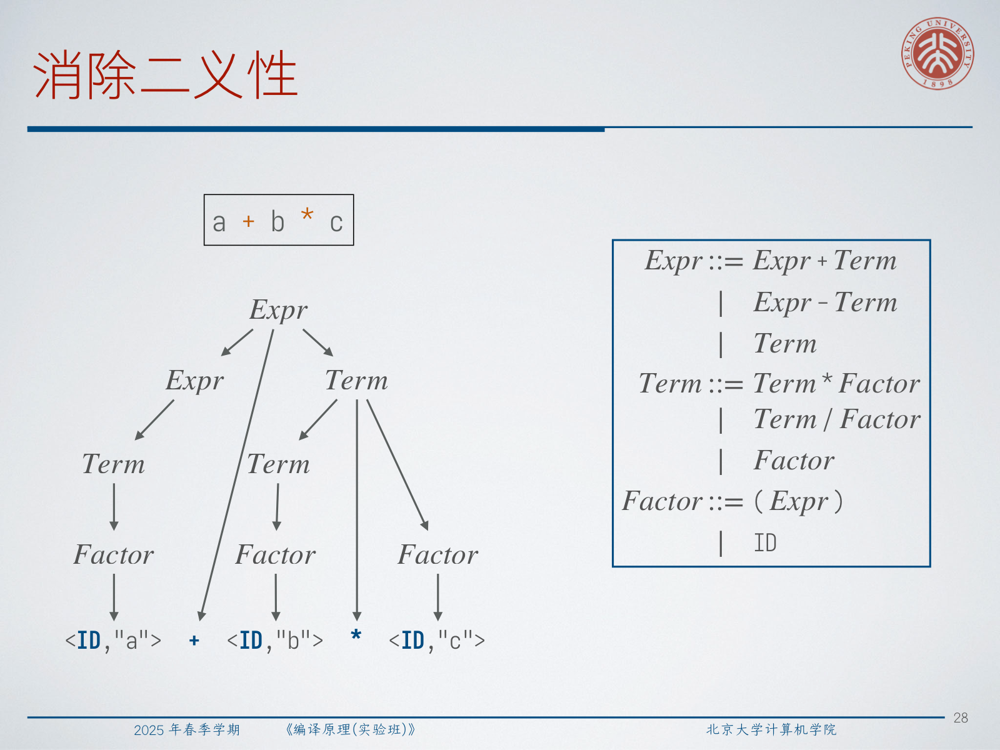
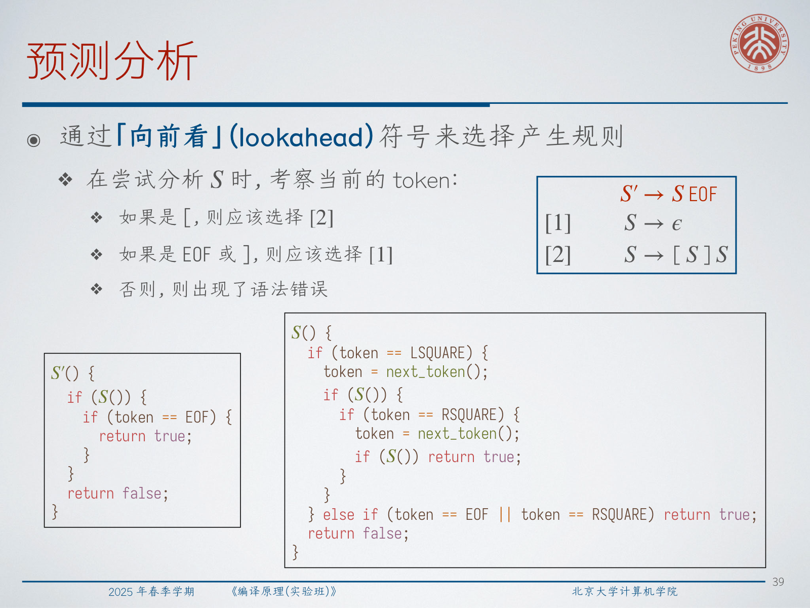
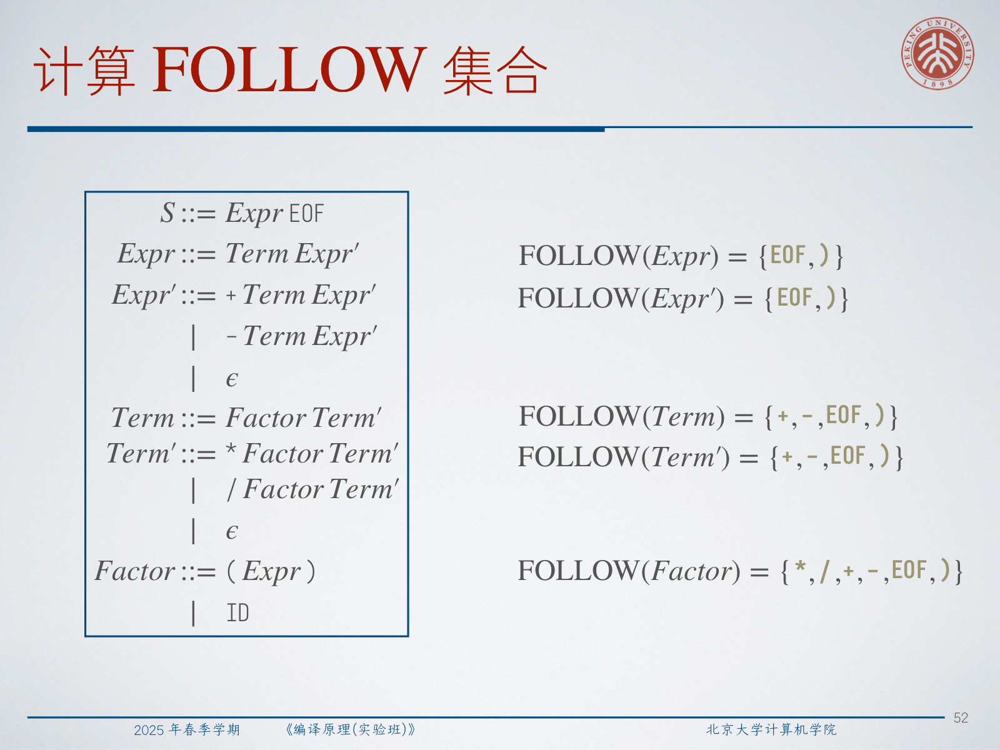
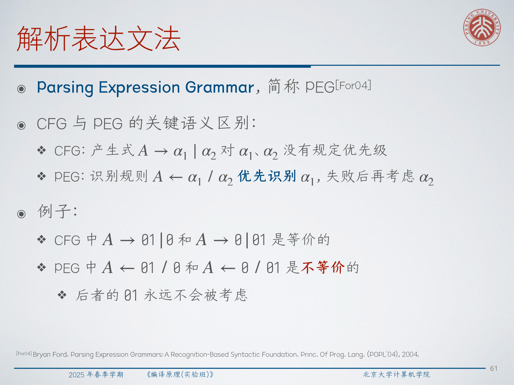
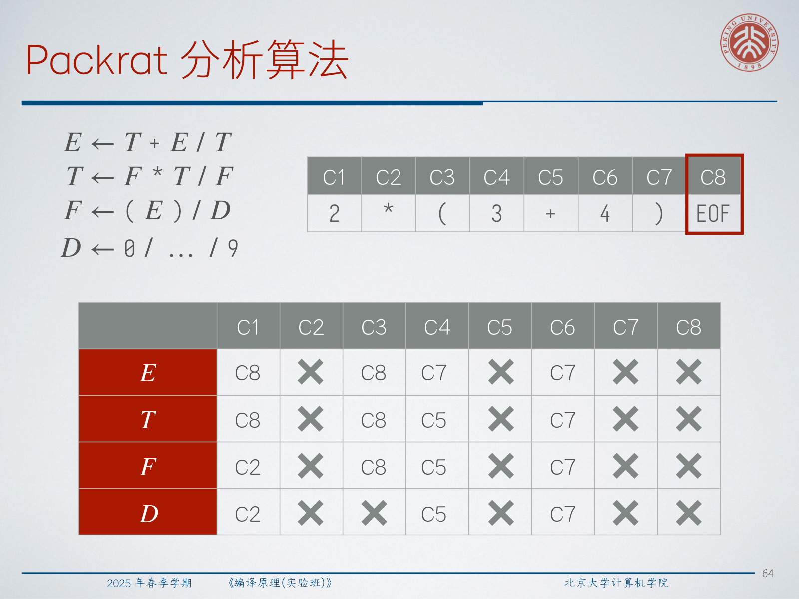
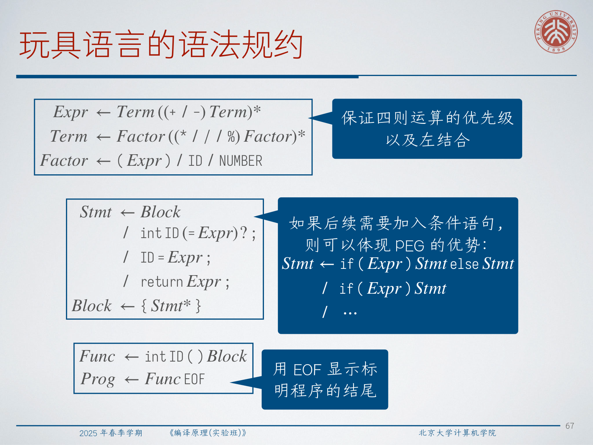

# Lec3：语法分析

语法分析把扁平的 token 序列转换成有结构的语法分析树。词法分析把字符组合成“单词”；语法分析把这些“单词”组合成编程语言中的“句子”。



## 1. 语法分析做什么

**语法分析处理 token 序列并构造语法分析树。** 它的输入是词法分析器产生的 token 流。主要工作是识别语法变量，检查 token 序列是否符合语言文法，构造树状表示，并在程序语法错误时尽可能给出有用的错误信息。

对于赋值语句：

```c
a = a * 2 * b * c * d;
```

词法分析器会给出 `ID`、`EQ`、`MUL`、`NUMBER`、`SEMI` 等 token。语法分析器进一步把它们组合成赋值语句、表达式等更高层的语法类别。

:::remark 📝 问题：为什么编译过程需要语法分析？
问题：**为什么需要语法分析？什么样的语言不需要语法分析？**

解答：当程序含义依赖嵌套或层次结构时，就需要语法分析，例如括号、运算符优先级、语句块、匹配的 `if`/`else` 等。如果一门语言的语义只是“从左到右执行字符”，就可能几乎不需要语法分析。BF 是典型例子：除了匹配 `[` 和 `]`，每个字符几乎直接表示一个操作。
:::

:::tip 💡 为什么先词法分析再语法分析？
问题：**语法分析前先进行词法分析有什么好处？**

解答：语法分析器可以处理 token 类别，而不是原始字符。这样文法更小，空白和注释可以被词法分析器隐藏，标识符和数字规则可以集中处理，语法分析器直接看到 `ID`、`INT`、`LPAREN`、`RETURN` 等有意义的单元。
:::

语法分析本质上是从线性结构走向非线性结构。`a * 2 * b` 和 `a + 2 * b` 的 token 序列都是线性的，但语法分析树记录了哪些运算先结合。这个结构已经包含语义信息，尤其体现在表达式求值上。

## 2. 文法作为语法规约

词法规约用正则表达式描述字符上的语言。语法规约需要描述 token 上的语言，因此编译器通常使用文法。

### 文法

**文法 $G=(V_T,V_N,S,P)$ 是一个四元组。** $V_T$ 是非空有限终结符号集合，$V_N$ 是非空有限非终结符号集合，$V_T\cap V_N=\varnothing$，$S\in V_N$ 是初始符号，$P$ 是产生规则集合。

更形式化地说：

$$
P=\{\alpha \to \beta \mid \alpha,\beta \in (V_T \cup V_N)^*,\ \alpha \text{ contains at least one nonterminal}\}
$$

**推导从初始符号 $S$ 出发，反复应用产生规则，直到符号串中只剩终结符号。** 文法表示的语言是：

$$
L(G)=\{w \mid S \Rightarrow^* w,\ w \in V_T^*\}
$$

终结符号是语法分析器的“字母表”，通常就是 token 类别。非终结符号也叫语法变量，表示表达式、语句、块、函数等短语结构。

### 上下文无关文法

一般文法的表达能力非常强：判断一个串是否属于任意文法表示的语言是不可判定问题。因此编译器前端通常使用上下文无关文法。

**上下文无关文法中，每条产生规则的左边有且仅有一个非终结符号。** 每条规则形如：

$$
A \to \beta
$$

其中 $A$ 是非终结符号。“上下文无关”的意思是展开 $A$ 时不需要检查它前后的符号。

配平括号串可以由下面的文法描述：

```text
S -> ε
S -> [S]
S -> SS
```

正则表达式不能表达一般的配平括号语言，但 CFG 可以。这就是语法分析不能只依赖正则表达式的核心原因：编程语言中到处都有嵌套结构。

:::remark 📝 问题：为什么语法分析不用正则表达式作为规约？
问题：**能用正则表达式表示配平括号串吗？为什么不使用正则表达式作为语法规约？**

解答：正则表达式无法计数任意深度的匹配括号。语法经常需要这种无界嵌套：括号、语句块、函数调用、数组下标、嵌套语句等。CFG 可以自然表达这些递归结构。
:::

### BNF

Backus-Naur Form，简称 BNF，是常用的文法记号：

$$
A ::= \beta
$$

如果一个非终结符号有多个备选右部，可以合并写成：

$$
A ::= \beta_1 \mid \beta_2
$$

例如：

```text
Expr ::= (Expr)
       | Expr Op ID
       | ID

Op   ::= +
       | -
       | *
       | /
```

这种写法很紧凑，但文法设计者仍然要保证它表达的是预期含义，并且适合分析。

## 3. 推导与语法分析树

若 $\alpha\to\beta$ 是产生规则，$\gamma,\delta$ 是文法符号串，则：

$$
\gamma\alpha\delta \Rightarrow \gamma\beta\delta
$$

称为一次直接推导。多个直接推导组成推导序列：

$$
\alpha_0 \Rightarrow \alpha_1 \Rightarrow \cdots \Rightarrow \alpha_n
$$

可简写为 $\alpha_0\Rightarrow^*\alpha_n$。如果至少要求一步推导，写作 $\alpha_0\Rightarrow^+\alpha_n$。归约是推导的逆过程：

$$
\gamma\alpha\delta \Leftarrow \gamma\beta\delta
$$

**语法分析树是 CFG 推导过程的可视化。** 根结点是初始符号，每个内部结点是非终结符号，内部结点的孩子对应某条产生规则的右部。



最左推导每一步展开最左边的非终结符号；最右推导每一步展开最右边的非终结符号。即使对应同一棵语法分析树，这两个推导序列也可能不同。

:::tip 💡 分析树与推导顺序
语法分析树记录的是哪条产生规则展开了哪个非终结符号。独立非终结符号之间的展开先后顺序没有树形结构本身重要。因此同一棵树可以对应不同的最左和最右推导。
:::

## 4. 二义性与消除二义性

**如果一个串有两棵不同的分析树，那么该串是二义性的。如果一个文法能产生二义性的串，那么该文法是二义性的。** 实际语法分析通常需要无二义性文法。

下面的文法：

```text
Expr ::= (Expr)
       | Expr Op Expr
       | ID

Op   ::= + | - | * | /
```

对 `a + b * c` 是二义性的：一棵树表示先算加法再算乘法，另一棵树表示先算乘法再算加法。



解决方法是把优先级写进文法。每一层优先级引入一个非终结符号：

```text
Expr   ::= Expr + Term
         | Expr - Term
         | Term

Term   ::= Term * Factor
         | Term / Factor
         | Factor

Factor ::= (Expr)
         | ID
```

`Factor` 处理最高优先级，`Term` 处理乘除，`Expr` 处理加减。



另一个经典二义性是悬空 `else`。二义性文法是：

```text
Statement ::= if Expr then Statement else Statement
            | if Expr then Statement
            | ...
```

通常规则是：每个 `else` 与离它最近且尚未匹配的 `if` 对应。一种文法层面的解决方法是区分已经配好 `else` 的语句：

```text
Statement ::= if Expr then Statement
            | if Expr then WithElse else Statement
            | ...

WithElse  ::= if Expr then WithElse else WithElse
            | ...
```

:::warn ⚠️ 问题：递归下降法能分析二义性文法吗？
问题：**可以用递归下降法分析二义性文法吗？有什么问题？**

解答：某些二义性文法也能写出递归下降程序，只要实现中固定规则优先级或回溯策略。问题在于分析树不再由文法本身唯一决定，而由实现细节决定含义。对编译器而言，除非这种优先级是语言设计的一部分，否则很危险。
:::

## 5. 自顶向下分析与递归下降

自顶向下分析从文法初始符号出发，展开产生规则，直到生成的符号能匹配输入 token。记号：

$$
w:\beta
$$

表示正在尝试证明 $\beta\Rightarrow^*w$，其中 $w$ 是剩余 token 流，$\beta$ 是当前分析目标。

当 $\beta$ 最左边是非终结符号时，自顶向下分析展开它；当最左边是终结符号时，把它与当前输入 token 匹配。

自顶向下分析构造的是最左推导。

### 递归下降

递归下降用“每个非终结符号一个函数”的方式实现自顶向下分析。解析器用全局字段或解析器状态保存当前 token，在匹配终结符号时向词法分析器请求下一个 token。

对于配平括号，二义性文法：

```text
S -> ε
S -> [S]
S -> SS
```

不适合直接递归下降，因为解析器可能不知道该尝试哪条规则，而且文法本身有二义性。更好的形式是：

```text
S' -> S EOF
S  -> ε
S  -> [S]S
```

现在解析器可以用一个向前看的 token 做判断：

- 如果当前 token 是 `[`，选择 `S -> [S]S`；
- 如果当前 token 是 `]` 或 `EOF`，选择 `S -> ε`；
- 否则报告语法错误。



这就是预测分析：用向前看的符号选择产生规则。

## 6. 让预测分析确定化

带回溯的递归下降会尝试多条规则，直到某条成功。预测递归下降不回溯，但前提是文法形状能让当前向前看 token 唯一决定规则。

### 左递归

直接左递归有形如：

$$
A ::= A\alpha
$$

的产生规则。间接左递归则是：

$$
A \Rightarrow^+ A\alpha
$$

左递归会让朴素自顶向下分析出问题，因为分析 `A` 的函数可能在没有消耗任何 token 前再次调用自己。

直接左递归可以用以下方式消除。把：

$$
A ::= A\alpha \mid \beta
$$

转换为：

$$
A ::= \beta A'
$$

$$
A' ::= \alpha A' \mid \epsilon
$$

表达式文法可以改写为右递归或循环形式：

```text
Expr   ::= Term Expr'
Expr'  ::= + Term Expr'
         | - Term Expr'
         | ε

Term   ::= Factor Term'
Term'  ::= * Factor Term'
         | / Factor Term'
         | ε

Factor ::= (Expr)
         | ID
```

间接左递归可以通过给非终结符号排序 $A_1,A_2,\ldots,A_n$，把较早非终结符号的规则代入较晚非终结符号，再逐步消除直接左递归。最终文法可能依赖处理顺序，但识别的语言等价。

### FIRST 集合

**$FIRST(\beta)$ 是 $\beta$ 能推导出的符号串中，可能出现在最前面的终结符号集合。** 如果 $\beta\Rightarrow^*\epsilon$，则 $\epsilon\in FIRST(\beta)$。

固定点计算规则如下：

$$
FIRST(a)=\{a\}\quad (a\text{ is terminal})
$$

若 $A\to\epsilon$，则 $\epsilon\in FIRST(A)$。若 $A\to X_1X_2\cdots X_k$，则：

$$
a \in FIRST(X_i)\ \wedge\ \forall j<i,\ \epsilon \in FIRST(X_j) \Rightarrow a \in FIRST(A)
$$

如果所有 $X_j$ 都能推导出 $\epsilon$，则 $\epsilon\in FIRST(A)$。

对于上面的表达式文法：

$$
FIRST(Factor)=\{(,ID\}
$$

$$
FIRST(Term')=\{*,/,\epsilon\},\qquad FIRST(Expr')=\{+,-,\epsilon\}
$$

$$
FIRST(Term)=FIRST(Expr)=FIRST(S)=\{(,ID\}
$$

### FOLLOW 集合

当某个产生式右部可以推导出 $\epsilon$ 时，仅靠 FIRST 不够。例如在 `Expr'` 中，解析器应该在当前 token 可以合法跟在表达式后缀之后时，选择 `Expr' -> ε`。

**$FOLLOW(X)$ 是在某个句型中可以紧跟在非终结符号 $X$ 后面的终结符号集合。**

对每条产生规则 $A\to\alpha X\beta$：

$$
FIRST(\beta)-\{\epsilon\}\subseteq FOLLOW(X)
$$

如果 $\epsilon\in FIRST(\beta)$，则：

$$
FOLLOW(A)\subseteq FOLLOW(X)
$$

对于表达式文法：

$$
FOLLOW(Expr)=FOLLOW(Expr')=\{EOF,)\}
$$

$$
FOLLOW(Term)=FOLLOW(Term')=\{+,-,EOF,)\}
$$

$$
FOLLOW(Factor)=\{*,/,+,-,EOF,)\}
$$



### 无回溯的预测分析

对于：

$$
A ::= \beta_1 \mid \beta_2 \mid \cdots \mid \beta_n
$$

确定性的预测分析要求：

$$
\forall i\ne j,\ FIRST(\beta_i)\cap FIRST(\beta_j)=\varnothing
$$

并且如果 $\epsilon\in FIRST(\beta_i)$，则：

$$
FOLLOW(A)\cap FIRST(\beta_j)=\varnothing \quad (i\ne j)
$$

当当前 token 属于 $FIRST(\beta_i)$ 时，解析器选择规则 $A\to\beta_i$。如果 $\beta_i$ 能推导出 $\epsilon$，当前 token 属于 $FOLLOW(A)$ 时也可以选择这条规则。

### 左公因子

如果两个备选项有相同前缀，一个 token 的预测无法区分它们。把：

$$
A ::= \alpha\beta_1 \mid \alpha\beta_2
$$

转换为：

$$
A ::= \alpha A'
$$

$$
A' ::= \beta_1 \mid \beta_2
$$

例如：

```text
Factor ::= (Expr)
         | ID
         | ID[Expr]
         | ID(Expr)
```

可以改写为：

```text
Factor   ::= (Expr)
           | ID Argument

Argument ::= [Expr]
           | (Expr)
           | ε
```

## 7. LL 文法

**LL 文法是能够通过无回溯递归下降预测分析识别的 CFG 文法。** 第一个 `L` 表示从左到右扫描输入 token；第二个 `L` 表示构造最左推导。

LL($k$) 文法允许解析器向前看 $k$ 个 token。最常见的是 LL(1)。

对 LL(1) 而言，判定条件就是上面的 FIRST/FOLLOW 不相交条件。重要性质包括：

- LL(1) 文法无二义性。
- LL(1) 文法无左递归。
- LL(1) 文法无左公因子。

:::warn ⚠️ 一个技术性小例外
形式化 LL(1) 判定可能会把 `S ::= S a` 判断为 LL(1)，因为 `S` 对应的语言是空集。这个边界情况通常不影响编译器实践，因为实际文法应当能生成真实程序。
:::

并不是每个上下文无关语言都有 LL 文法。语言：

$$
\{a^ib^j \mid i\ge j\}
$$

可由下面的文法表示：

```text
S -> aS | P
P -> aPb | ε
```

但不存在 LL 文法能表示它。对于任意固定向前看长度 $k$，串 $a^kb^k$ 和 $a^{k+1}b^k$ 的前 $k$ 个符号完全相同，却需要在看到决定性的 `b` 之前做出不同选择。

:::remark 📝 问题：LL(0) 文法有意义吗？
问题：**尝试构造一个 LL(0) 文法。这种文法有意义吗？**

解答：LL(0) 表示解析器不看任何输入 token 就要选择产生规则。这类文法极其受限：每个非终结符号基本只能有一条可行产生式，除非某些备选不可达或只生成空语言。它对实际编程语言没有太大用途，但能说明为什么预测分析需要向前看。
:::

## 8. PEG 与 Packrat 分析

产生式文法通过推导定义语言。正则表达式和 CFG 都是产生式的。基于识别的文法通过识别规则定义语言，这更接近解析器实现本身。

Parsing Expression Grammar，简称 PEG，是基于识别的文法。关键语义差异在于选择：

$$
A \to \alpha_1 \mid \alpha_2
$$

在 CFG 中不规定 $\alpha_1$ 和 $\alpha_2$ 的优先级；而：

$$
A \leftarrow \alpha_1/\alpha_2
$$

在 PEG 中会先尝试 $\alpha_1$，只有 $\alpha_1$ 失败时才尝试 $\alpha_2$。



因此在 CFG 中：

$$
A\to 01\mid 0
$$

和：

$$
A\to 0\mid 01
$$

等价。但在 PEG 中：

$$
A\leftarrow 01/0
$$

和：

$$
A\leftarrow 0/01
$$

不等价，因为后者一旦 `0` 成功，就永远不会再考虑 `01`。

PEG 常用操作包括：

- 终结符号 `a`：识别符号 `a`；
- 序列 $e_1e_2$：先识别 $e_1$，再识别 $e_2$；
- 有序选择 $e_1/e_2$：先尝试 $e_1$，失败后从同一位置尝试 $e_2$；
- $e?$, $e^*$, $e^+$：贪心的可选和重复；
- `&e`：正向语法谓词，若向前看能识别 `e`，则成功且不消耗输入；
- `!e`：负向语法谓词，若向前看不能识别 `e`，则成功且不消耗输入。

例如：

$$
S \leftarrow iSeS/iS/a
$$

可以通过有序选择处理悬空 `else`，而：

$$
C \leftarrow o(C/(!c\ a))^*c
$$

可以借助向前看识别嵌套注释。

PEG 分析本质上是在做带回溯的递归下降。两个问题需要处理：左递归和效率。左递归可以通过改写文法消除；效率问题可以用 Packrat 分析解决。

**Packrat 分析会记忆化递归下降的结果。** 分析某个非终结符号的结果只依赖该非终结符号和当前输入位置。把结果存下来，就能把重复回溯工作变成查表，用空间换取线性时间。



## 9. 玩具语言语法

玩具语言是一个很小的类 C 语言：只有 `main`，只有 `int` 类型，并且只有直线代码。它的语法可以用 PEG 风格书写：

```text
Expr   <- Term ((+ / -) Term)*
Term   <- Factor ((* / / / %) Factor)*
Factor <- (Expr) / ID / NUMBER

Stmt   <- Block
        / int ID (= Expr)? ;
        / ID = Expr ;
        / return Expr ;

Block  <- { Stmt* }
Func   <- int ID () Block
Prog   <- Func EOF
```



表达式规则通过结构保证优先级和左结合。`EOF` 明确标明程序结尾。如果后续加入条件语句，PEG 的有序选择可以直接表达最近 `else` 规则：

```text
Stmt <- if (Expr) Stmt else Stmt
      / if (Expr) Stmt
      / ...
```

记忆化解析器可以为每个非终结符号和起始位置保存：分析是否成功、生成的分析树，以及分析结束后的下一个输入位置。像 `((+ / -) Term)*` 这样的重复结构可以用贪心循环尽可能多地消费重复项。

## 10. 小结

语法分析为编程语言给出文法。CFG 是标准的产生式规约，尤其适合描述 LL 文法和递归下降分析。预测递归下降构造最左推导，需要消除左递归、提取左公因子，并用 FIRST/FOLLOW 集合无回溯地选择产生规则。PEG 提供了基于识别的替代方案，包含有序选择、贪心重复、向前看谓词，以及用于高效记忆化识别的 Packrat 分析。

## Exam Review

核心定义：

- 文法：$G=(V_T,V_N,S,P)$，由终结符号集、非终结符号集、初始符号和产生规则集组成。
- CFG：产生规则左部恰好是一个非终结符号的文法。
- 推导：从初始符号出发反复应用产生规则。
- 归约：推导的逆过程。
- 语法分析树：CFG 推导过程的树状可视化。
- 二义性：一个串有多棵分析树，或某文法能生成这样的串。
- FIRST：某个文法符号串可推导出的串中，可能位于开头的终结符号集合。
- FOLLOW：某个非终结符号后面可能紧跟的终结符号集合。
- LL(1)：从左到右扫描输入，构造最左推导，向前看一个 token。
- PEG：有序的、基于识别的文法。
- Packrat：带记忆化的递归下降分析。

需要会解释的机制：

- 为什么语法分析要把 token 序列变成树。
- 为什么 CFG 能表达正则表达式不能表达的嵌套结构。
- 如何用 `Expr`、`Term`、`Factor` 编码优先级。
- 如何用文法或 PEG 优先级处理最近 `else`。
- 递归下降如何把非终结符号映射为函数。
- FIRST/FOLLOW 如何决定预测分析中的产生规则。
- 如何消除左递归和提取左公因子。
- PEG 的有序选择与 CFG 的备选项有什么不同。

简答模板：

- 为什么需要语法分析？它检查 token 顺序是否符合语言文法，并构造记录嵌套、优先级和语句结构的树。
- 为什么不能只用正则表达式？正则表达式不能表示任意深度嵌套的配平括号；CFG 可以。
- 二义性有什么问题？同一个 token 序列可能得到不同分析树，从而具有不同含义。
- 为什么要消除左递归？朴素递归下降可能在不消耗输入的情况下调用同一个非终结符号，导致不终止。
- 为什么需要 FOLLOW？当某个备选项能推导出 $\epsilon$ 时，解析器必须知道哪些 token 可以合法出现在该非终结符号之后。
- 语法分析可以和词法分析合二为一吗？原则上可以，PEG 风格的识别器也能合并一些层次；但分离二者可以让 token 规则、空白、注释和源码位置管理更清晰。
- 是否所有语法规约都能用 CFG 表达？许多编程语言核心结构接近 CFG，但缩进敏感布局、上下文相关的名字/类型限制、某些宏系统等需要额外语义检查、词法模式、解析动作或基于识别的分析。

常见误区：

- 混淆 token 类别和文法终结符号。
- 把优先级错误的文法当成单纯实现问题。
- 以为每个 CFG 都适合递归下降。
- 计算 FIRST/FOLLOW 时忘记 $\epsilon$ 情况。
- 只用 FIRST 集合选择 $\epsilon$ 产生式。
- 以为 PEG 的 `/` 和 CFG 的 `|` 语义相同。
- 忽略 EOF，导致解析器只接受输入前缀。

自检清单：

- 你能为一个小文法写出 $G=(V_T,V_N,S,P)$ 的四个组成部分吗？
- 你能为二义性文法中的 `a+b*c` 画出两棵分析树吗？
- 你能改写表达式文法以体现优先级吗？
- 你能消除 $A ::= A\alpha \mid \beta$ 的直接左递归吗？
- 你能计算表达式文法的 FIRST 和 FOLLOW 集合吗？
- 你能解释 FIRST 集合相交时为什么文法不是 LL(1) 吗？
- 你能解释为什么 PEG 中 `A <- 0 / 01` 不会把 `01` 当作双字符备选项匹配吗？
