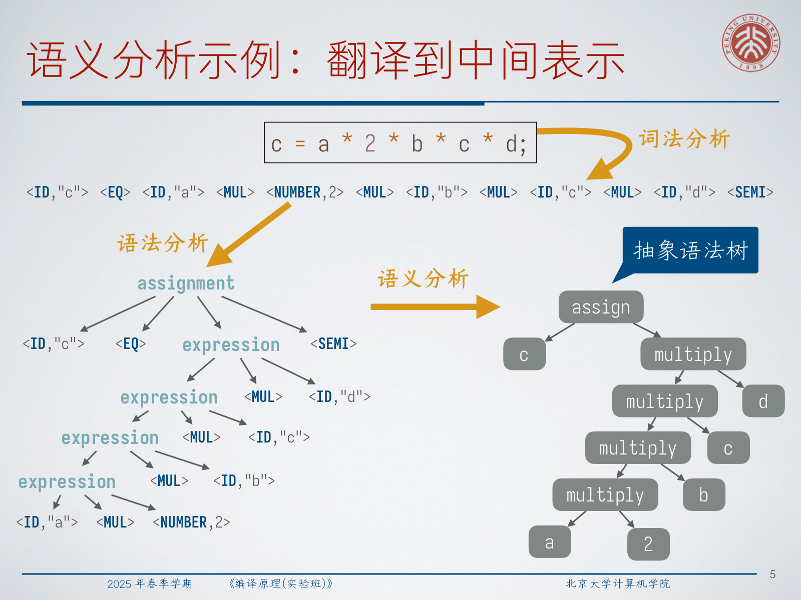
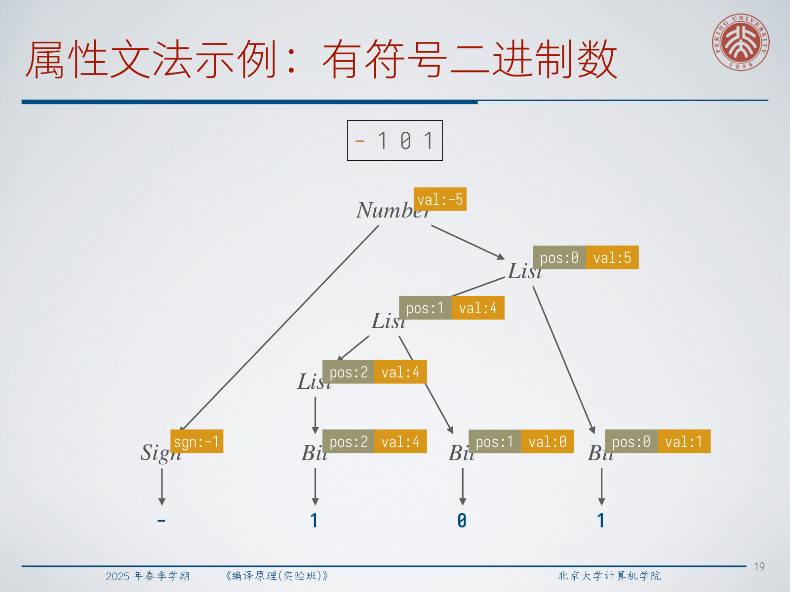
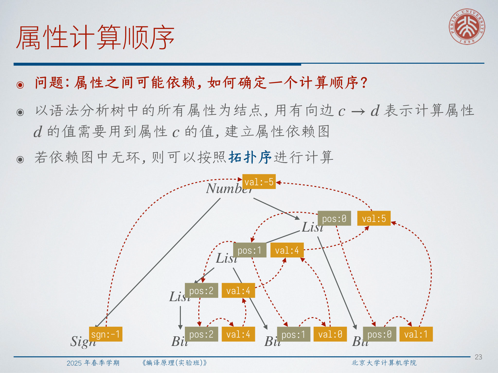
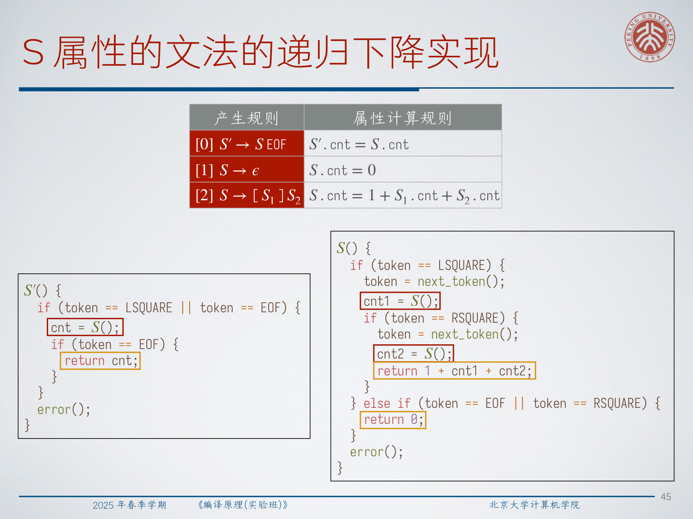
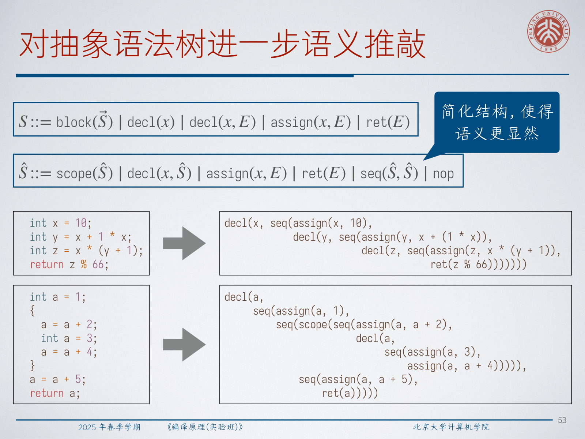
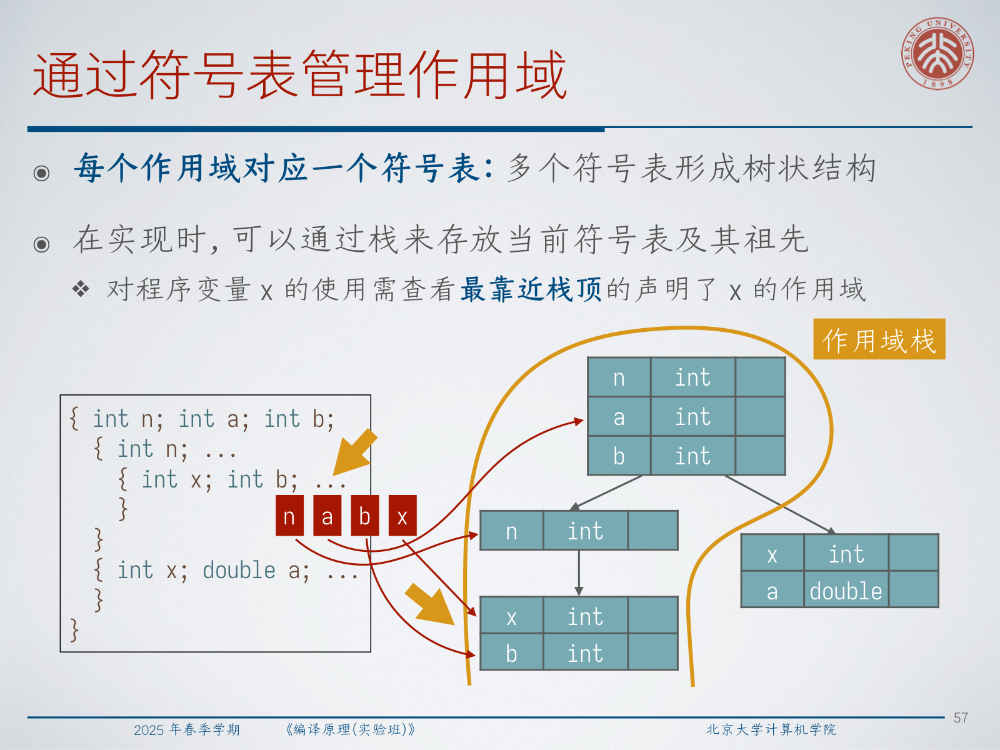
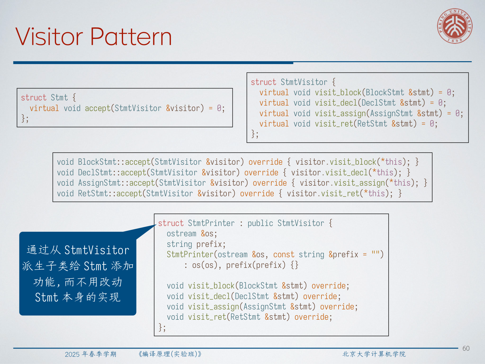

# Lec4: Semantic Analysis

Semantic analysis is the point where the compiler stops asking "is this token sequence well formed?" and starts asking "what does this structure mean?" It extracts context-sensitive information, builds a more useful internal form, checks semantic constraints, and prepares later stages such as IR generation, optimization, and code generation.

## 1. What Semantic Analysis Does

**Semantic analysis extracts the core meaning of a program from its parse tree or AST.** Depending on the setting, that work may mean translating syntax into an intermediate representation, checking types, or directly interpreting the program.

Three representative tasks appear immediately:

- translate a syntax tree into an AST or other IR;
- compute and check type information;
- evaluate or interpret expressions and statements.

The key difference from syntax analysis is that semantic analysis is context-sensitive. It must answer questions such as:

- what kind of value is stored in `x`;
- how much storage is needed;
- if `x` is a function, what are its parameters and return type;
- how long a value lives;
- when and where storage should be allocated and initialized.

Semantic analysis may be implemented as:

- a separate pass over a complete parse tree; or
- a pass synchronized with parsing, so semantic information is computed on the fly.

## 2. Attribute Grammars as the Main Specification Tool

Using a context-sensitive grammar directly as the specification for semantic analysis is possible in theory, but it is awkward in practice. A language like $a^n b^n c^n$ can be characterized with context-sensitive productions, yet a compiler usually does not need such a grammar. It only needs to parse the program and then check the relevant semantic conditions on the resulting tree.

**Attribute Grammar = CFG + attribute computation rules.** This is also called a **Syntax-Directed Definition (SDD)**.

If a parse-tree node is labeled by grammar symbol $X$, then `X.a` denotes attribute `a` of that node. Each production may carry several semantic rules, and each rule relates attributes of the parent and children created by that production.

For arithmetic expressions, one natural attribute is the value:

$$
\begin{aligned}
\text{Expr} &::= \text{Expr} + \text{Term} \mid \text{Expr} - \text{Term} \mid \text{Term} \\
\text{Term} &::= \text{Term} * \text{Factor} \mid \text{Term} / \text{Factor} \mid \text{Factor} \\
\text{Factor} &::= (\text{Expr}) \mid \text{INT}
\end{aligned}
$$

and the semantic rules compute values such as:

$$
\text{Expr.val} = \text{Expr}_1.\text{val} + \text{Term.val}, \qquad
\text{Factor.val} = \text{INT.intval}
$$

At this point the compiler is still attached to grammar structure, but the attribute rules let us write down the meaning of each production locally.

:::remark 📝 Question: Why not use context-sensitive grammars as the main semantic specification?
Question: **If semantics is context-sensitive, why not specify semantic analysis directly with a context-sensitive grammar?**

Answer: because the compiler's real job is usually "parse first, then check and compute on the tree." Context-sensitive grammars are much less convenient for practical compiler construction. Attribute grammars keep the syntax CFG simple and attach meaning where the syntax structure already exists.
:::

## 3. Synthesized and Inherited Attributes

**A synthesized attribute flows bottom-up.** The attribute of a node is computed from attributes of its children.

**An inherited attribute flows top-down.** The attribute of a node is computed from its parent and, in controlled cases, its siblings.

Arithmetic expression evaluation is the standard synthesized example: `Expr.val`, `Term.val`, and `Factor.val` are all computed from lower nodes.

Signed binary numbers need both directions. Consider:

$$
\begin{aligned}
\text{Number} &::= \text{Sign}\ \text{List} \\
\text{Sign} &::= + \mid - \\
\text{List} &::= \text{Bit} \mid \text{List}\ \text{Bit} \\
\text{Bit} &::= 0 \mid 1
\end{aligned}
$$

Here:

- `val` records the integer value;
- `sgn` records the sign;
- `pos` records the bit position, where the least significant bit has position `0`.

The core rules are:

$$
\begin{aligned}
\text{Number.val} &= \text{Sign.sgn} \times \text{List.val} \\
\text{List.pos} &= 0 \\
\text{List.val} &= \text{List}_1.\text{val} + \text{Bit.val} \\
\text{List}_1.\text{pos} &= \text{List.pos} + 1 \\
\text{Bit.val} &= 2^{\text{Bit.pos}}
\end{aligned}
$$

So the value travels upward, but the bit position travels downward.

:::tip 💡 Question: Why is `pos` inherited instead of synthesized?
Question: **Why is the bit-position attribute `pos` inherited?**

Answer: because a bit does not know its own position from its subtree alone. Its position depends on where it sits inside the whole number. That information must come from the outside, so it is naturally passed downward as an inherited attribute.
:::

## 4. Dependency Order and Cyclic Cases

Once attributes depend on one another, we must ask how to schedule their computation.

Build an **attribute dependency graph**:

$$
c \to d
$$

means that attribute `d` depends on attribute `c`. If the graph is acyclic, we can evaluate attributes in a topological order.

This is the clean case. But semantic computation is not always acyclic.

Consider the tiny loop language:

$$
\begin{aligned}
\text{Loop} &::= \text{repeat INT do Stmt} \\
\text{Stmt} &::= \epsilon \mid \text{cnt += INT ; Stmt}
\end{aligned}
$$

To interpret it, the lecture uses:

- `cnt_init`: the value of `cnt` before executing a statement;
- `cnt_final`: the value of `cnt` after executing a statement.

For `repeat 10 do cnt += 50;`, the final answer should be `500`. That requires repeated updates, so some dependencies are cyclic in the sense that later values feed the next round of computation.

The important lesson is not "cycles are always bad." The real lesson is:

- acyclic dependencies can be evaluated once in a fixed order;
- cyclic dependencies may still be meaningful when the semantics itself is iterative.

:::remark 📝 Question: How can a cyclic dependency still make sense?
Question: **If the dependency graph has a cycle, why is the semantic definition not immediately invalid?**

Answer: because some semantic processes are inherently iterative. A loop state after round $k+1$ depends on the state after round $k$. The cycle reflects repeated execution, not a contradiction. In such cases, evaluation behaves like iteration to a new state rather than one-shot tree reduction.
:::

## 5. S-Attributed and L-Attributed Grammars

General attribute grammars are powerful, but hard to analyze mechanically. Two restricted classes are especially important because they guarantee a usable evaluation discipline.

**S-attributed grammars have only synthesized attributes.** Information always flows bottom-up.

**L-attributed grammars allow inherited attributes that depend only on the parent and left siblings.** For a production

$$
A \to X_1 X_2 \cdots X_k
$$

an inherited attribute of $X_i$ may depend only on:

- inherited attributes of `A`;
- attributes of `X_1, \dots, X_{i-1}`.

That means information flows top-down and left-to-right, which is exactly the order that top-down parsing naturally sees.

The lecture rewrites expression evaluation into an L-attributed form:

$$
\begin{aligned}
\text{Expr} &::= \text{Term}\ \text{Expr}' \\
\text{Expr}' &::= +\ \text{Term}\ \text{Expr}' \mid -\ \text{Term}\ \text{Expr}' \mid \epsilon \\
\text{Term} &::= \text{Factor}\ \text{Term}' \\
\text{Term}' &::= *\ \text{Factor}\ \text{Term}' \mid /\ \text{Factor}\ \text{Term}' \mid \epsilon
\end{aligned}
$$

with attributes such as:

$$
\text{Expr}'.\text{inh} = \text{Term.val}, \qquad
\text{Expr.val} = \text{Expr}'.\text{syn}
$$

and:

$$
\text{Expr}'_1.\text{inh} = \text{Expr}'.\text{inh} + \text{Term.val}, \qquad
\text{Expr}'.\text{syn} = \text{Expr}'_1.\text{syn}
$$

For `31 + 8 * 50`, the inherited accumulator carries partial results forward, and the final synthesized result is `431`.

:::tip 💡 Why is L-attributed form useful?
Question: **Why do compiler courses care so much about S-attributed and L-attributed grammars?**

Answer: because these classes have a predictable evaluation order. They often let us compute semantic information during parsing, without first building a complete parse tree and then running a separate general-purpose evaluator over it.
:::

## 6. What Attributes Can Compute

Attributes are not limited to arithmetic values. They can describe many semantic tasks.

### 6.1 Build ASTs or Other IR

Instead of computing a number, semantic rules can construct a tree-shaped IR:

$$
E ::= \operatorname{add}(E,E) \mid \operatorname{sub}(E,E) \mid \operatorname{mul}(E,E) \mid \operatorname{div}(E,E) \mid \operatorname{intv}(i)
$$

Then `31 + 8 * 50` becomes:

$$
\operatorname{add}(\operatorname{intv}(31), \operatorname{mul}(\operatorname{intv}(8), \operatorname{intv}(50)))
$$

This is often the first major output of semantic analysis: replace concrete syntax with a representation that keeps only the structure needed later.

### 6.2 Type Check Expressions

Type information can also be attached as attributes. If we extend factors to include floating-point literals,

$$
\text{Factor} ::= (\text{Expr}) \mid \text{INT} \mid \text{FLOAT}
$$

then operators compute result types with language-specific functions such as:

$$
\text{Expr.type} = \mathcal{F}_{+}(\text{Expr}_1.\text{type}, \text{Term.type})
$$

and similarly for subtraction, multiplication, and division.

The point is not that the grammar itself knows arithmetic promotion rules. Rather, the grammar structure identifies where operations happen, and the semantic rules encode the language's typing policy there.

### 6.3 Define Small-Step Interpretation

Semantic rules may also describe one execution step at a time. For expression ASTs:

$$
E.\text{next} = \mathcal{C}_{+}(E_1,E_2)
$$

means that the `next` attribute stores the result of one small-step reduction. The idea is:

- if the left operand is not a value, reduce it first;
- otherwise reduce the right operand;
- when both operands are values, perform the actual arithmetic.

This is a neat reminder that attribute grammars are not only for static checking. They can encode dynamic behavior as well.

## 7. Manual Implementation During Recursive Descent

Semantic analysis does not have to wait for a complete tree. If the grammar belongs to a well-behaved class, a recursive-descent parser can perform semantic computation directly.

For the bracket grammar:

$$
\begin{aligned}
S' &\to S\ \text{EOF} \\
S &\to \epsilon \\
S &\to [S_1]S_2
\end{aligned}
$$

the synthesized attribute:

$$
S.\text{cnt} = 1 + S_1.\text{cnt} + S_2.\text{cnt}
$$

counts matched bracket pairs. In an S-attributed recursive-descent implementation, each nonterminal procedure simply returns its synthesized attributes.

For L-attributed grammars, each nonterminal procedure:

- takes inherited attributes as parameters;
- returns synthesized attributes as results.

This is exactly why the `inh` / `syn` split is so practical: it maps cleanly to function arguments and return values.

One subtle point matters a lot in practice: removing left recursion often introduces inherited attributes. A grammar that once looked purely bottom-up may need an accumulator-like parameter after transformation.

:::warn ⚠️ Question: Why does eliminating left recursion change the semantic implementation?
Question: **Why can left-recursion elimination force us to introduce inherited attributes?**

Answer: because the original left-recursive grammar naturally accumulates information on the left. After rewriting it into a right-recursive or tail form for recursive descent, that already-computed left context must be carried forward explicitly. The inherited attribute becomes the storage for that partial result.
:::

## 8. Semantic Elaboration on ASTs

The lecture then moves from expression-level examples to a tiny statement language. Its AST includes forms such as:

$$
\begin{aligned}
E &::= \operatorname{binop}(op,E,E) \mid \operatorname{id}(x) \mid \operatorname{number}(i) \\
S &::= \operatorname{block}(\vec S) \mid \operatorname{decl}(x) \mid \operatorname{decl}(x,E) \mid \operatorname{assign}(x,E) \mid \operatorname{ret}(E)
\end{aligned}
$$

Before later analyses, the tree is elaborated into a simpler statement form:

$$
\hat S ::= \operatorname{scope}(\hat S) \mid \operatorname{decl}(x,\hat S) \mid \operatorname{assign}(x,E) \mid \operatorname{ret}(E) \mid \operatorname{seq}(\hat S,\hat S) \mid \operatorname{nop}
$$

This normalized AST makes scope and statement sequencing explicit.

The lecture presents an **R-attributed** style for elaboration. A continuation-like inherited attribute `cont` stores the already elaborated suffix, while synthesized attribute `elab` builds the current result. Representative rules are:

$$
\begin{aligned}
SS.\text{cont} &= \operatorname{nop} \\
S.\text{elab} &= \operatorname{seq}(\operatorname{scope}(SS.\text{elab}), S.\text{cont}) \\
SS.\text{elab} &= SS.\text{cont} \\
S.\text{elab} &= \operatorname{decl}(x, S.\text{cont}) \\
S.\text{elab} &= \operatorname{seq}(\operatorname{assign}(x,E), S.\text{cont})
\end{aligned}
$$

The central idea is simple: statement lists become explicit sequencing, declarations become scope-aware structure, and the later passes now receive a cleaner tree.

:::remark 📝 Question: Why elaborate the AST before type checking?
Question: **Why introduce `scope`, `seq`, and `nop` instead of type checking the original statement tree directly?**

Answer: because the elaborated tree makes semantic structure explicit. A later pass no longer has to recover sequencing or scope from many surface syntax cases. It can reason over one normalized representation, which makes symbol-table updates and control of scope boundaries much cleaner.
:::

## 9. Type Checking with Symbol Tables and Scopes

Type checking over statements is not just about operator result types. We must also enforce scope and initialization rules.

The lecture highlights at least these properties:

- no variable is used before it is declared or assigned;
- no variable is declared twice in the same scope.

A compiler records name information in a **symbol table**. Semantically, each scope owns a symbol table, and all tables form a tree. Operationally, a stack is often enough: the current scope is on top, and lookup searches from the top downward until it finds the nearest matching declaration.

The core API is:

- `push_scope()`
- `pop_scope()`
- `insert(name, info)`
- `lookup(name)`

The type-checking attribute grammar over elaborated statements uses inherited `table_in` and synthesized `table_out`. Intuitively:

- `table_in` is the symbol-table state before processing the current node;
- `table_out` is the state after processing it.

Typical rules are:

$$
\hat S_1.\text{table\_in} = \hat S.\text{table\_in}.\operatorname{push\_scope}()
$$

$$
\hat S_1.\text{table\_in} = \hat S.\text{table\_in}.\operatorname{insert}(x,\operatorname{UNASSIGNED})
$$

$$
\hat S.\text{table\_out} = \hat S.\text{table\_in}.\operatorname{update}(x,\operatorname{ASSIGNED})
$$

and on identifier use:

$$
\text{error if } E.\text{table.lookup}(x) == \operatorname{UNASSIGNED}
$$

This is a very practical semantic-analysis pattern: represent semantic state explicitly, pass it through the tree in a disciplined order, and signal errors at the first invalid use.

## 10. Visitor Pattern

Once the AST exists, many later tasks need tree traversal: pretty-printing, type checking, optimization, code generation, or interpretation. The visitor pattern separates those operations from the AST node definitions.

The lecture's C++ sketch has:

- an abstract `Stmt` with `accept(StmtVisitor&)`;
- an abstract `StmtVisitor` with `visit_block`, `visit_decl`, `visit_assign`, and `visit_ret`;
- concrete statement classes whose `accept` methods dispatch to the right visitor method;
- a derived visitor such as `StmtPrinter`.

The gain is conceptual and engineering-oriented: we can add a new operation by writing a new visitor subclass, without rewriting the statement class hierarchy itself.

## 11. Exam Review

### 11.1 Must-Know Definitions

- **Semantic analysis**: compute context-sensitive meaning from syntax structure.
- **Attribute grammar / SDD**: CFG plus semantic rules attached to productions.
- **Synthesized attribute**: flows bottom-up from children to parent.
- **Inherited attribute**: flows top-down or left-to-right from context into a node.
- **S-attributed grammar**: all attributes are synthesized.
- **L-attributed grammar**: inherited attributes depend only on the parent and left context.
- **Semantic elaboration**: transform surface syntax into a cleaner internal representation.
- **Symbol table**: data structure that records information about names in scope.

### 11.2 Mechanisms You Should Be Able to Explain

- How to compute attribute values on a parse tree.
- Why a dependency graph gives the evaluation order.
- Why some cyclic dependencies still make sense for iterative semantics.
- Why recursive descent naturally supports S-attributed and L-attributed cases.
- Why elaborated ASTs help later passes.
- How scope is implemented with symbol-table stacks.

### 11.3 Short-Answer Templates

- Why semantic analysis is needed:
  it adds context-sensitive meaning that CFG parsing alone cannot provide.
- Why attribute grammars are useful:
  they localize semantic rules on grammar productions.
- Why inherited attributes are needed:
  some information comes from context, not from the subtree itself.
- Why symbol tables matter:
  they connect names to declarations, types, scope, and initialization state.

### 11.4 Common Mistakes

- confusing parse trees with ASTs;
- treating type checking as only expression typing while ignoring scope and initialization;
- assuming every dependency cycle is illegal;
- forgetting that left-recursion elimination can change semantic data flow;
- ignoring shadowing and same-scope duplicate declarations.

### 11.5 Self-Check

- Can you explain the difference between synthesized and inherited attributes without using memorized slogans?
- Can you compute the value of a signed binary number using `sgn`, `val`, and `pos`?
- Can you explain why `31 + 8 * 50` becomes `431` in the L-attributed version?
- Can you describe how `table_in` and `table_out` move through `scope`, `decl`, `assign`, and `seq`?
- Can you explain why a visitor adds behavior without changing AST node definitions?
