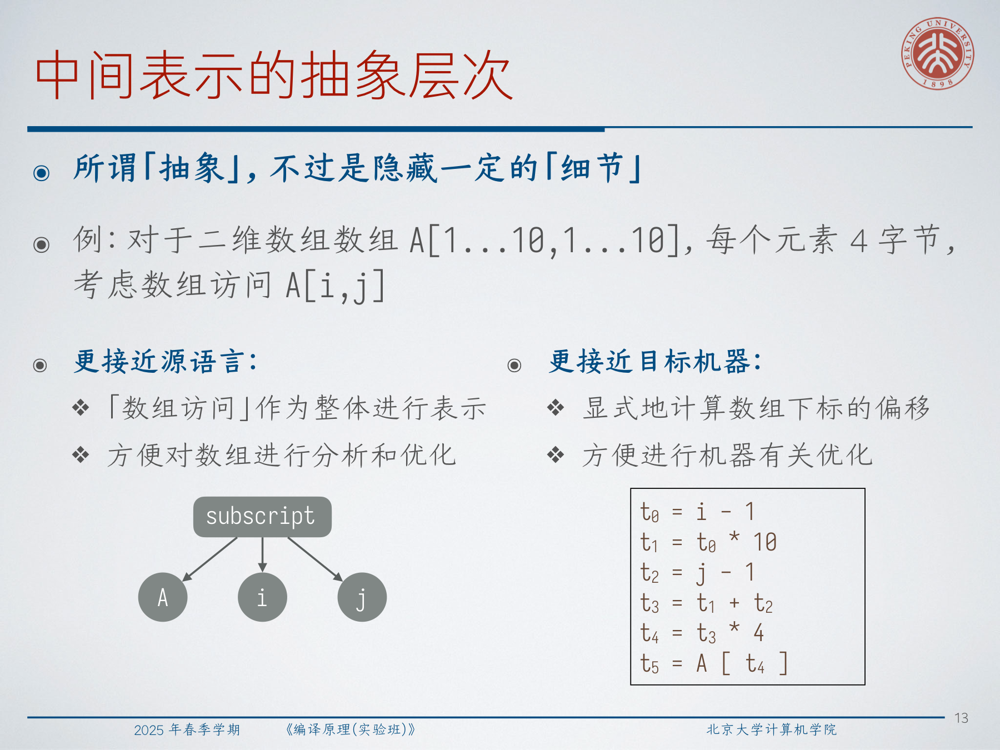
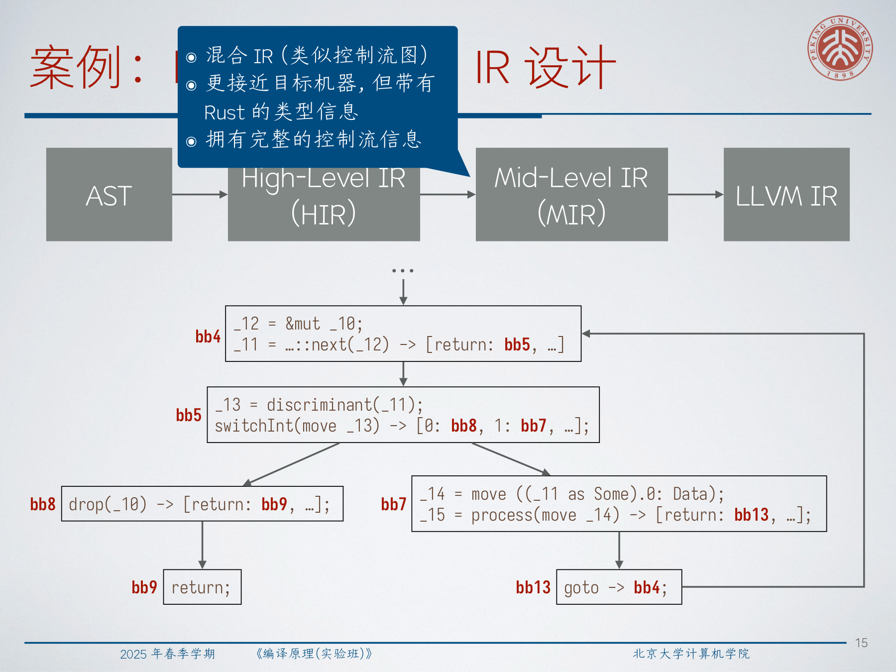
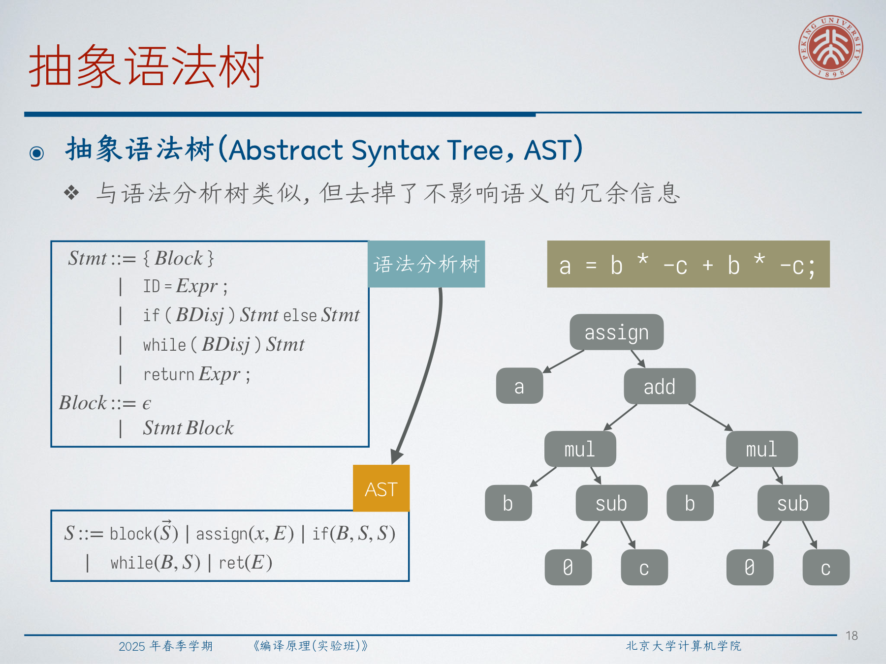
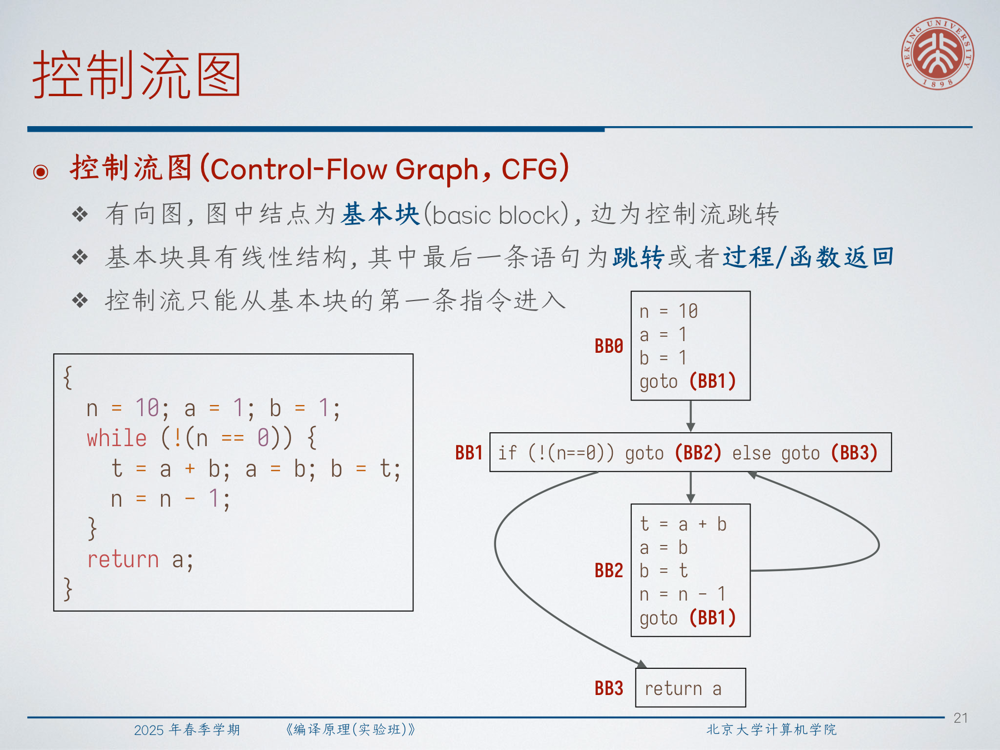
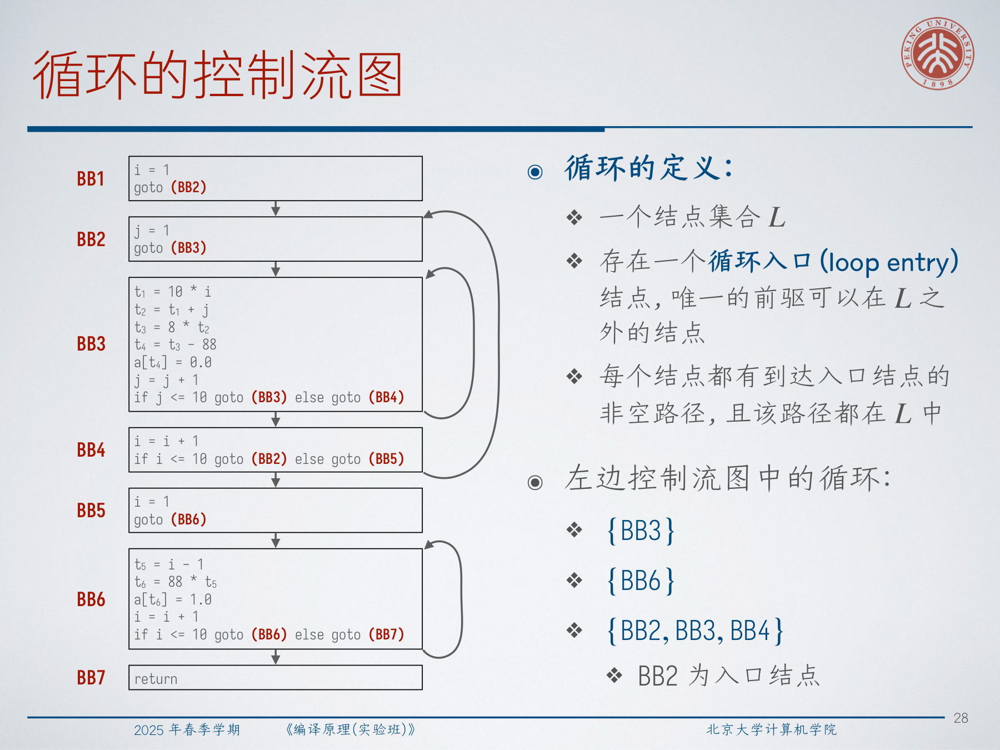
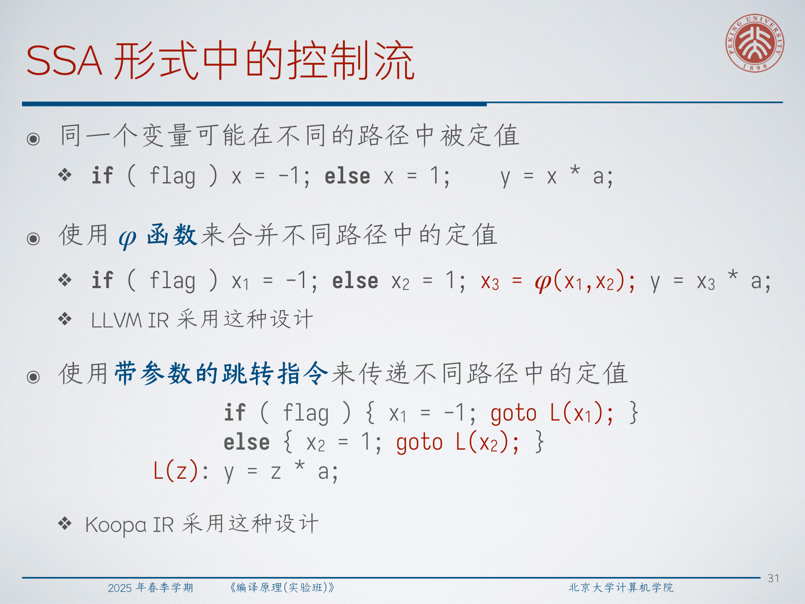
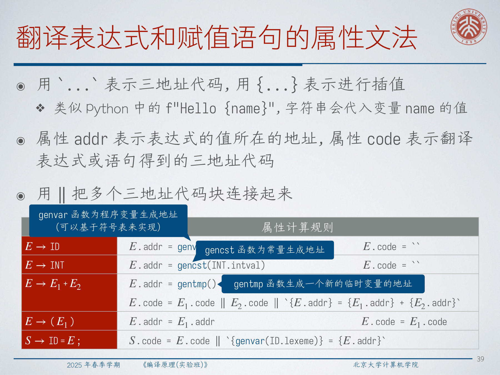
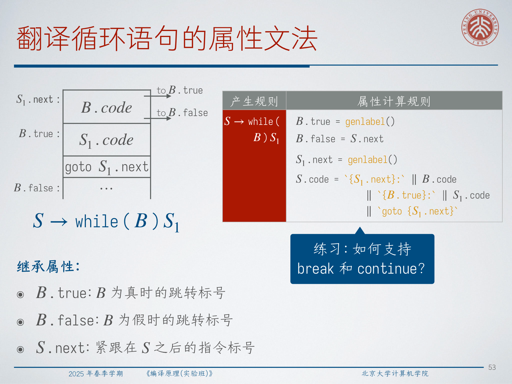
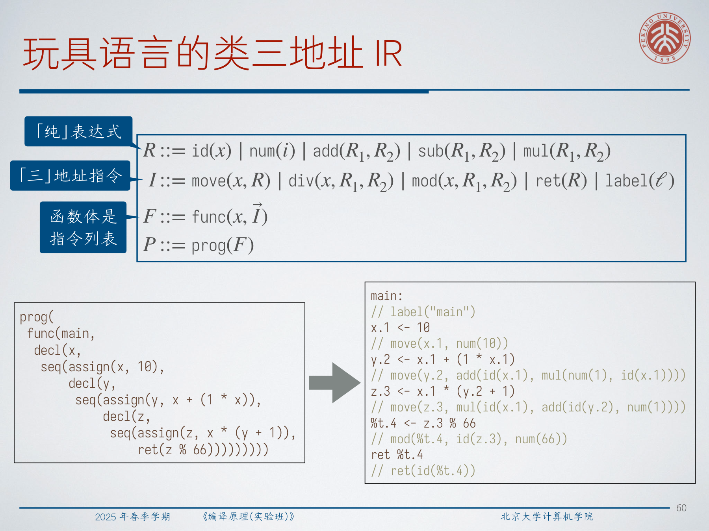
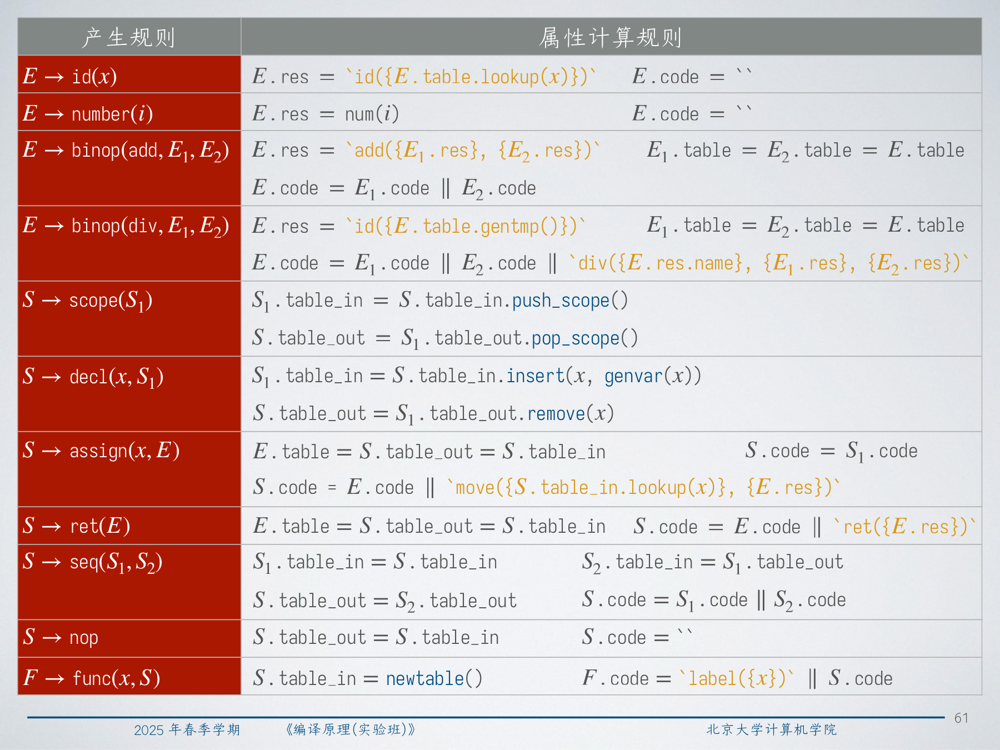

# Lec5：中间表示

中间表示，简称 IR，是编译器在“已经理解源程序”但“尚未承诺具体机器代码”之间使用的内部语言。这一讲真正回答的是两个问题：这种内部语言应该长什么样，以及我们怎样系统地把程序翻译成它。

## 1. 为什么需要 IR

**IR 是编译器对程序语义的内部表示。** 前端负责理解源语言，后端负责理解目标机器，而 IR 正是两者之间的桥梁。

这座桥至少有三个关键作用：

- 把前端和后端解耦；
- 给优化器提供统一的分析与变换对象；
- 让编译器可以分阶段地从“源语言结构”过渡到“机器相关结构”。

重定目标是最直接的动机。现代编译器往往同时支持多种源语言和多种目标架构。如果没有 IR，每个前端都要直接理解每个目标，每个后端也要直接面对每种源语言。

当优化器被插入到前端和后端之间以后，IR 就更居于中心位置了。优化通常由许多简单 pass 组成，而这些 pass 需要一个稳定的内部程序表示。

:::remark 📝 问题：为什么编译过程需要中间表示？
问题：**为什么编译器不直接把源代码一步翻译成目标代码，而要引入 IR？**

解答：因为编译器同时面对两个不同问题。前端要从源语言中提取语义，后端要把这些语义表达成某台机器上的执行形式。IR 把这两个任务隔开，使分析、优化和重定目标不必缠绕在同一个庞杂的翻译步骤里。
:::

## 2. IR 的设计维度

讲义强调，IR 设计不是一个“选哪一种就结束”的单点决策，而是几个基本独立的维度共同决定的。

- 组织结构：
  图状 IR、线性 IR，或者混合 IR；
- 抽象层次：
  更接近源语言，还是更接近目标机器；
- 命名策略：
  如何为中间值命名。

在抽象层次上，讲义用二维数组访问做例子。如果源程序里有 `A[i,j]`，高层 IR 可以把“数组下标访问”保留成一个整体语义对象；低层 IR 则可能把它展开成显式偏移计算：

$$
\begin{aligned}
t_0 &= i - 1 \\
t_1 &= t_0 * 10 \\
t_2 &= j - 1 \\
t_3 &= t_1 + t_2 \\
t_4 &= t_3 * 4 \\
t_5 &= A[t_4]
\end{aligned}
$$

高层形式更适合做源语言层面的数组分析；低层形式更适合做机器相关优化。



现实编译器通常不只用一种 IR。讲义给出的 Rust 例子很典型：

- AST 和 HIR 更接近源程序结构；
- MIR 是带有显式控制流和 Rust 类型信息的混合 IR；
- LLVM IR 更接近目标机器，也更通用。



:::tip 💡 问题：既然 IR 很重要，为什么真实编译器常常要设计好几种 IR？
问题：**如果 IR 这么重要，为什么不设计一个“完美 IR”从头用到尾？**

解答：因为不同阶段需要暴露的信息并不一样。源语言层面的分析更依赖高层结构，而低层优化和代码生成更偏好显式控制流、显式存储效果和机器友好的操作。一个表示形式通常不可能同时对所有阶段都最合适。
:::

## 3. 图状 IR

### 3.1 抽象语法树

**AST 和语法分析树类似，但去掉了不影响语义的冗余信息。** 括号、很多只为文法服务的辅助结点，以及其他语法脚手架都会被消除。

对表达式、布尔表达式和语句，讲义使用了如下 AST 语法：

$$
\begin{aligned}
E &::= \operatorname{add}(E,E)\mid \operatorname{sub}(E,E)\mid \operatorname{mul}(E,E)\mid \operatorname{div}(E,E)\mid x\mid i \\
B &::= \operatorname{or}(B,B)\mid \operatorname{and}(B,B)\mid \operatorname{eq}(E,E)\mid \operatorname{le}(E,E)\mid \operatorname{not}(B)\mid \operatorname{true}\mid \operatorname{false} \\
S &::= \operatorname{block}(\vec S)\mid \operatorname{assign}(x,E)\mid \operatorname{if}(B,S,S)\mid \operatorname{while}(B,S)\mid \operatorname{ret}(E)
\end{aligned}
$$

重点不在这些构造子名字本身，而在于：AST 保留语义结构，同时去掉纯粹为了语法分析服务的噪声。



### 3.2 有向无环图

**DAG 可以看作“带共享子树的 AST”。** 相同子表达式会被合并，因此公共子表达式显式可见。

例如：

```c
a = b * -c + b * -c;
```

AST 会保留两份独立的 `b * -c`，而 DAG 可以把它们合并成一个共享子图，直接表达“两次使用依赖同一个计算结果”。

这让 DAG 在局部公共子表达式优化里很有吸引力。

### 3.3 控制流图

AST 和 DAG 主要保留表达式或语句结构，但它们并不显式表达控制流。因此编译器需要 **控制流图（CFG）**。

**CFG 是一个有向图，结点是基本块，边是控制流跳转。** 基本块内部是线性的，最后一条语句是跳转或返回，而且控制流只能从基本块第一条指令进入。



讲义还给出了 CFG 上“循环”的定义。一个循环是一个结点集合，它有一个入口结点，并满足：

- 从循环外进入时只能通过该入口；
- 循环中的每个结点都存在一条留在循环内部、最终回到入口的非空路径。

这个定义很重要，因为后续循环优化通常是基于 CFG 结构，而不是基于源程序里的 `while` 或 `for` 语法来描述的。



## 4. 线性 IR

### 4.1 三地址代码

**三地址代码是一种线性 IR，其中每条指令最多涉及三个地址**，地址可以是程序变量、临时变量或者常量。

它的核心形式包括：

$$
\begin{aligned}
I ::= {} & ID = ID\ bop\ ID \mid ID = uop\ ID \mid ID = ID \mid goto\ LABEL \\
& \mid if\ ID\ goto\ LABEL \mid ifFalse\ ID\ goto\ LABEL \mid if\ ID\ rop\ ID\ goto\ LABEL
\end{aligned}
$$

扩展形式还包括过程调用、数组和指针：

$$
I ::= \cdots \mid param\ ID,INT \mid call\ ID,INT \mid ID = call\ ID,INT \mid return\ ID
$$

$$
I ::= \cdots \mid ID = ID[ID] \mid ID[ID] = ID \mid ID = \&ID \mid ID = *ID \mid *ID = ID
$$

它最关键的效果是：把源程序里的嵌套表达式打平为显式求值步骤。例如：

```c
a = b * -c + b * -c;
```

会被翻译成：

```text
t0 = 0 - c
t1 = b * t0
t2 = 0 - c
t3 = b * t2
t4 = t1 + t3
a  = t4
```

讲义还展示了为什么先使用符号标号更方便，以及为什么后续一趟处理可以再把符号标号解析成实际指令位置。

### 4.2 静态单赋值形式

**SSA 的核心约束是：每次赋值都定义一个新名字，因此每次使用都能找到唯一的定值。**

这正是它的基本性质：

$$
\begin{aligned}
p &= a + b \\
q &= p - c \\
p &= q * d \\
p &= e - p \\
q &= p + q
\end{aligned}
\qquad \Longrightarrow \qquad
\begin{aligned}
p_1 &= a + b \\
q_1 &= p_1 - c \\
p_2 &= q_1 * d \\
p_3 &= e - p_2 \\
q_2 &= p_3 + q_1
\end{aligned}
$$

当控制流汇合时，SSA 需要显式合并来自不同路径的值。一种做法是使用 $\phi$ 函数：

$$
x_3=\phi(x_1,x_2)
$$

另一种做法是像 Koopa IR 那样，用带参数的跳转把值作为基本块参数传过去：

```text
if (flag) { x1 = -1; goto L(x1); }
else      { x2 =  1; goto L(x2); }
L(z): y = z * a;
```

循环里也需要 $\phi$ 风格的合并，因为“名字只有一个定义点”并不意味着“这个值只被计算一次”。



:::remark 📝 问题：既然现代编译器喜欢 SSA，三地址代码思想是不是已经过时了？
问题：**如果 LLVM 这类现代 IR 采用 SSA，三地址代码是不是已经被淘汰了？**

解答：并没有。SSA 更像是在三地址代码思想上的加强，而不是替代。操作仍然被拆成显式步骤，控制流仍然是显式的，值仍然需要命名。SSA 主要是把命名 discipline 做得更严格，从而让数据流分析更容易。
:::

## 5. 生成 IR 的两种策略

讲义对比了两种实现路线。

1. 在语法制导的语义分析过程中同步生成 IR。
2. 先构造 AST，再遍历 AST 生成 IR。

同步生成的优点是效率高，因为语法分析和翻译同时完成，不需要显式构造整棵语法分析树。缺点是 SDD 设计要非常精巧。

先建 AST 再翻译的优点是耦合低：语法分析先产出稳定的语义树，后续 pass 可以独立遍历和转换。缺点是需要显式构造并遍历 AST，成本更高。

现实里两种方式都常见。课程里先讲语法制导翻译，是因为它能最直接地暴露 IR 生成的机制。

## 6. 翻译表达式与赋值语句

为了把翻译思路讲清楚，讲义暂时使用了一个等价但有二义性的文法：

$$
\begin{aligned}
E &::= E + E \mid E - E \mid E * E \mid E / E \mid (E) \mid ID \mid INT \\
S &::= ID = E;
\end{aligned}
$$

翻译中最关键的两个属性是：

- `addr`：表达式值所在的地址；
- `code`：生成出的三地址代码。

核心规则是：

$$
\begin{aligned}
E \to ID &: \quad E.addr = genvar(ID.lexeme),\quad E.code = `` \\
E \to INT &: \quad E.addr = gencst(INT.intval),\quad E.code = `` \\
E \to E_1 + E_2 &: \quad E.addr = gentmp() \\
& \quad E.code = E_1.code \parallel E_2.code \parallel `{E.addr} = {E_1.addr} + {E_2.addr}` \\
E \to (E_1) &: \quad E.addr = E_1.addr,\quad E.code = E_1.code \\
S \to ID = E; &: \quad S.code = E.code \parallel `{genvar(ID.lexeme)} = {E.addr}`
\end{aligned}
$$

其中 `genvar` 用于把源程序变量映射为 IR 地址，`gencst` 为常量生成地址，`gentmp` 负责生成新临时变量。



这里最值得掌握的是这种纪律：每个子表达式不仅要返回“值存在哪里”，还要返回“为了把值算出来已经生成了哪些代码”。

## 7. 翻译声明语句和语句块

声明翻译不只是发出代码，它还必须维护符号表。

对应文法是：

$$
\begin{aligned}
S &::= \cdots \mid TID; \mid \{L\} \\
T &::= int \mid double \\
L &::= \epsilon \mid LS
\end{aligned}
$$

讲义引入了表流动属性：

- `table_in`：进入当前结构前的符号表；
- `table_out`：处理当前结构后的符号表；
- `code`：生成的 IR。

代表性规则包括：

$$
\begin{aligned}
S \to TID; &: \quad S.table\_out = S.table\_in.insert(ID.lexeme, T.type),\quad S.code = `` \\
S \to \{L\} &: \quad L.table\_in = S.table\_in.push\_scope() \\
& \quad S.table\_out = L.table\_out.pop\_scope(),\quad S.code = L.code \\
L \to L_1S &: \quad L_1.table\_in = L.table\_in,\quad S.table\_in = L_1.table\_out \\
& \quad L.table\_out = S.table\_out,\quad L.code = L_1.code \parallel S.code
\end{aligned}
$$

这一步体现了语义分析和代码生成的连接点：即便声明本身不一定产生机器式指令，它仍然会影响后续标识符解析与代码生成。

## 8. 翻译布尔表达式与控制流

### 8.1 短路求值

如果把布尔运算完全当成算术表达式那样翻译，就会丢失短路语义。

对

```c
if (x < 100 || (x > 200 && x != y)) x = 0;
```

正确的三地址代码应该跳过不必要的计算：

```text
if      x < 100  goto L1
ifFalse x > 200  goto L0
ifFalse x != y   goto L0
L1: x = 0
L0: ...
```

因此讲义给布尔表达式引入了两个继承属性：

- `B.true`：当布尔值为真时跳转到哪里；
- `B.false`：当布尔值为假时跳转到哪里。

核心规则包括：

$$
\begin{aligned}
B \to true &: \quad B.code = `goto {B.true}` \\
B \to false &: \quad B.code = `goto {B.false}` \\
B \to !B_1 &: \quad B_1.true = B.false,\quad B_1.false = B.true,\quad B.code = B_1.code \\
B \to E_1 == E_2 &: \quad B.code = E_1.code \parallel E_2.code \parallel `if {E_1.addr} == {E_2.addr} goto {B.true}` \parallel `goto {B.false}`
\end{aligned}
$$

短路运算则通过精心布线这些标号来实现：

$$
\begin{aligned}
B \to B_1 \&\& B_2 &: \quad B_1.true = genlabel(),\quad B_1.false = B.false \\
& \quad B_2.true = B.true,\quad B_2.false = B.false \\
& \quad B.code = B_1.code \parallel `{B_1.true}:` \parallel B_2.code \\
B \to B_1 \parallel\!\parallel B_2 &: \quad B_1.true = B.true,\quad B_1.false = genlabel() \\
& \quad B_2.true = B.true,\quad B_2.false = B.false \\
& \quad B.code = B_1.code \parallel `{B_1.false}:` \parallel B_2.code
\end{aligned}
$$

:::warn ⚠️ 问题：为什么布尔表达式不能像普通算术表达式那样翻译？
问题：**为什么不能把 `B1 || B2` 先分别算成两个临时值，再做一次 `or` 运算？**

解答：因为源语言通常要求短路语义。如果 `B1` 已经决定了最终真假，`B2` 就不应该继续求值。这不仅关系效率，也关系正确性，因为在更丰富的语言里，`B2` 可能代价很高，甚至可能带有副作用。
:::

### 8.2 if 与 while 语句

条件语句和循环语句还需要第三个继承属性：

- `S.next`：当前语句之后第一条指令的标号。

对条件语句，核心规则是：

$$
\begin{aligned}
S \to if(B)S_1 &: \quad B.true = genlabel(),\quad B.false = S.next,\quad S_1.next = S.next \\
& \quad S.code = B.code \parallel `{B.true}:` \parallel S_1.code \\
S \to if(B)S_1 else S_2 &: \quad B.true = genlabel(),\quad B.false = genlabel() \\
& \quad S_1.next = S.next,\quad S_2.next = S.next \\
& \quad S.code = B.code \parallel `{B.true}:` \parallel S_1.code \parallel `goto {S.next}` \parallel `{B.false}:` \parallel S_2.code
\end{aligned}
$$

对循环语句：

$$
\begin{aligned}
S \to while(B)S_1 &: \quad B.true = genlabel(),\quad B.false = S.next,\quad S_1.next = genlabel() \\
& \quad S.code = `{S_1.next}:` \parallel B.code \parallel `{B.true}:` \parallel S_1.code \parallel `goto {S_1.next}`
\end{aligned}
$$



:::tip 💡 问题：如何支持 `break` 和 `continue`？
问题：**讲义留了一个练习：在这个翻译框架里该如何支持 `break` 和 `continue`？**

解答：最自然的方法是再增加当前循环的“退出标号”和“继续标号”两个继承属性。`break` 直接跳到循环出口，`continue` 跳回循环头部或更新点。这和 `B.true`、`B.false`、`S.next` 的设计模式完全一致：把控制流意图作为继承上下文向下传递。
:::

## 9. 翻译调用、多分支选择和多函数程序

讲义还给出了三类常见扩展。

第一，函数调用：

$$
\begin{aligned}
x = f(E_1,E_2,\dots,E_n) \Longrightarrow {} & \text{compute } E_1 \to t_1;\ param\ t_1,1 \\
& \cdots \\
& \text{compute } E_n \to t_n;\ param\ t_n,n \\
& t = call\ f,n \\
& x = t
\end{aligned}
$$

第二，`switch` 可以这样翻译：

1. 先计算控制表达式到临时变量；
2. 为每个分支体准备独立标号；
3. 构造测试链，把控制流分派到正确分支；
4. 所有分支最后汇合到统一的 `next` 标号。

第三，多函数程序按“每个函数各自生成一段 IR”的方式处理。调用方使用 `param` 和 `call`，而被调用方自己拥有独立 IR 函数体。

:::remark 📝 问题：一个编译器大概应该设计多少种 IR？
问题：**编译器里到底保留几种中间形式比较合适？**

解答：没有统一答案。原则是：要有足够多的形式，让每个重要阶段都能看到它真正需要的信息；但也不能多到每个阶段都在为“与前一个形式几乎一样”的表示做机械转换。通常，一小串彼此分工明确的 IR，要比“一种被迫做所有事的 IR”或者“很长一串差异很小的 IR”更合理。
:::

## 10. 玩具语言示例

### 10.1 玩具语言的 AST

讲义最后用一个玩具语言把整套思路串起来。这个语言只有 `int`、只有 `main`，核心程序基本是直线代码，但仍然包含作用域和嵌套声明。

它的 AST 文法为：

$$
\begin{aligned}
E &::= binop(op,E,E)\mid id(x)\mid number(i) \\
op &::= add \mid sub \mid mul \mid div \mid mod \\
S &::= scope(S)\mid decl(x,S)\mid assign(x,E)\mid ret(E)\mid seq(S,S)\mid nop \\
F &::= func(x,S) \\
P &::= prog(F)
\end{aligned}
$$

这个表示已经把作用域和语句顺序显式写出来，所以后续翻译不再依赖表面语法。

### 10.2 类三地址 IR

玩具语言的目标 IR 介于纯表达式树和严格三地址代码之间：

$$
\begin{aligned}
R &::= id(x)\mid num(i)\mid add(R_1,R_2)\mid sub(R_1,R_2)\mid mul(R_1,R_2) \\
I &::= move(x,R)\mid div(x,R_1,R_2)\mid mod(x,R_1,R_2)\mid ret(R)\mid label(\ell) \\
F &::= func(x,\vec I) \\
P &::= prog(F)
\end{aligned}
$$

也就是说：

- `R` 是纯表达式语言；
- `I` 是指令语言；
- 每个函数体由一串指令组成。



翻译规则再次把符号表流动和代码综合结合起来。代表性规则包括：

$$
\begin{aligned}
E \to id(x) &: \quad E.res = `id({E.table.lookup(x)})`,\quad E.code = `` \\
E \to number(i) &: \quad E.res = num(i),\quad E.code = `` \\
E \to binop(add,E_1,E_2) &: \quad E.res = `add({E_1.res}, {E_2.res})`,\quad E.code = E_1.code \parallel E_2.code \\
E \to binop(div,E_1,E_2) &: \quad E.res = `id({E.table.gentmp()})` \\
& \quad E.code = E_1.code \parallel E_2.code \parallel `div({E.res.name}, {E_1.res}, {E_2.res})`
\end{aligned}
$$

以及：

$$
\begin{aligned}
S \to decl(x,S_1) &: \quad S_1.table\_in = S.table\_in.insert(x, genvar(x)),\quad S.table\_out = S_1.table\_out.remove(x) \\
S \to assign(x,E) &: \quad E.table = S.table = S.table\_in,\quad S.code = E.code \parallel `move({S.table\_in.lookup(x)}, {E.res})` \\
S \to ret(E) &: \quad E.table = S.table = S.table\_in,\quad S.code = E.code \parallel `ret({E.res})` \\
F \to func(x,S) &: \quad S.table\_in = newtable(),\quad F.code = `label({x})` \parallel S.code
\end{aligned}
$$

这一整段最值得记住的结论是：IR 生成从来不只是“把表达式换个写法”，而是要把命名、作用域、控制流和最终发出的代码统一放进一个语义框架里。

如果把玩具语言的完整翻译规则表放在一起看，这种“统一贯穿”的感觉会更直观：



## 11. Exam Review

### 11.1 必记定义

- **IR**：编译器对程序语义的内部表示。
- **AST**：去掉冗余语法后的源语言风格树表示。
- **DAG**：把相同子表达式合并后的 AST 风格图。
- **CFG**：由基本块和控制流边组成的有向图。
- **三地址代码**：每条指令最多涉及三个地址的线性 IR。
- **SSA**：每次赋值都定义一个新名字的 IR discipline。
- **基本块**：单入口、末尾跳转或返回的线性指令序列。

### 11.2 需要会讲清楚的机制

- 为什么 IR 能把前端、优化器和后端解耦。
- 图状 IR 和线性 IR 各自暴露了什么信息。
- 为什么 SSA 需要 $\phi$ 或基本块参数式合并。
- `addr` 和 `code` 如何支撑语法制导翻译。
- 为什么布尔表达式翻译要依赖标号而不是只依赖临时变量。
- 为什么块翻译必须显式维护符号表。
- 为什么一个编译器常常要使用多个不同抽象层次的 IR。

### 11.3 简答题模板

- 为什么需要 IR：
  因为源语言语义和目标机器执行形式是两类不同问题，而 IR 正好把它们隔开。
- 为什么 SSA 有帮助：
  因为每次使用都能追溯到唯一的定义，数据流分析会更简单。
- 为什么需要 CFG：
  因为 AST 不能显式表达跳转、汇合和循环结构。
- 为什么短路求值翻译特殊：
  因为正确行为取决于控制流，而不只是最终真假值。

### 11.4 常见误区

- 看到“图状 IR”就简单地等同于“高层 IR”；
- 误以为 AST 已经足够支撑所有优化；
- 忘记三地址代码显式固定了子表达式求值顺序；
- 以为用了 SSA 就不再需要控制流结构；
- 把布尔表达式当成普通算术值翻译，从而破坏短路语义；
- 忽略声明和作用域翻译中的符号表变化。

### 11.5 自检清单

- 你能讲清楚这一讲的三个 IR 设计维度吗？
- 你能把 AST、DAG、CFG、三地址代码和 SSA 串成一个连贯的故事吗？
- 你能用 `addr` 和 `code` 自己推出表达式翻译规则吗？
- 你能解释 `B.true`、`B.false`、`S.next` 如何驱动布尔、`if` 和 `while` 的翻译吗？
- 你能说明为什么编译器会在代码生成前先后经过多种 IR 吗？
