# Lec6：运行时环境

编译器把指令生出来，并不代表工作已经结束。指令还需要一个真正能“活起来”的世界：内存要怎么组织，数据要放在哪里，过程该如何调用和返回，动态对象如何分配和回收。这一讲研究的正是这个世界，也就是运行时环境。

## 1. 为什么运行时环境很重要

**运行时环境的核心作用，是实现存储组织和过程抽象。** 它决定了编译结果如何真正执行起来。

讲义把这个想法浓缩成了一个公式：

$$
\text{Executable File} = \text{computation represented by the source program} + \text{runtime environment realized through architecture / OS interfaces}
$$

所以编译器从来不只是生成“程序逻辑本身”。它还必须同时确定存储模型、调用模型，以及程序如何通过体系结构或虚拟机提供的低层接口运行。

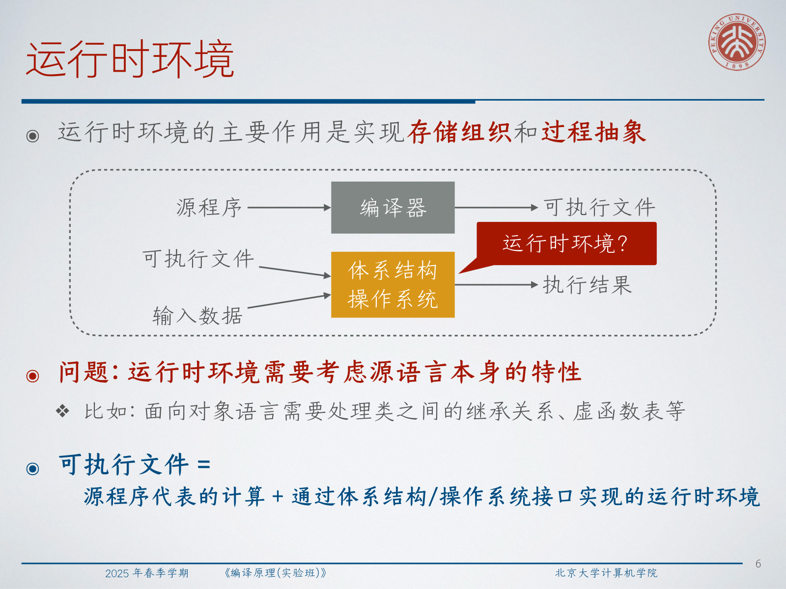

而且这个运行时层必须尊重源语言本身的特性。面向对象语言可能需要继承元数据和虚函数表；函数式语言可能需要闭包和垃圾回收；系统语言可能暴露栈上分配、手工内存管理或严格的所有权规则。

:::remark 📝 问题：为什么运行时环境必须依赖源语言本身的特性？
问题：**为什么运行时设计不只是一个“机器层面”的问题？**

解答：因为运行时必须把那些在语法和语义分析之后仍然成立的语言承诺真正执行出来。过程调用、作用域规则、对象布局、动态分派、闭包、异常、对象生命周期等，本来就是语言层面的语义，而运行时正是这些语义落地为可执行行为的地方。
:::

## 2. 从三地址代码到真实执行

讲义首先问了一个非常具体的问题：`fib` 的三地址代码到底怎样运行起来？

一种很直观的思路，是设计一个极简虚拟机，提供如下接口：

- `vm_get(name)` 和 `vm_set(name, value)`：访问变量；
- `vm_param(value, idx)`：传递参数；
- `vm_call(name, nargs)`：调用过程；
- `vm_ret(value)`：返回结果。

这样一台机器至少需要维护这些状态：

- 正在执行的代码；
- 变量表；
- 记录函数入口位置和形参信息的函数表；
- 程序计数器 `pc`；
- 返回地址栈 `ra`；
- 返回值寄存器，例如 `a0`；
- 参数栈。

这个模型很好地说明了线性 IR 怎样一步步被执行，但它也暴露了一个关键缺陷：如果所有变量都放在同一张全局变量表里，那么词法作用域就会被抹掉，递归调用也无法为同一个过程建立彼此独立的局部状态。

也正是在这里，运行时环境不再只是“解释器内部的小技巧”，而变成了真正的编译器设计问题。

同样的想法也会出现在“三地址代码如何下沉到目标代码”这件事上。可执行文件不仅要表达计算本身，还要安排数据布局，并遵守目标机器的调用约定。

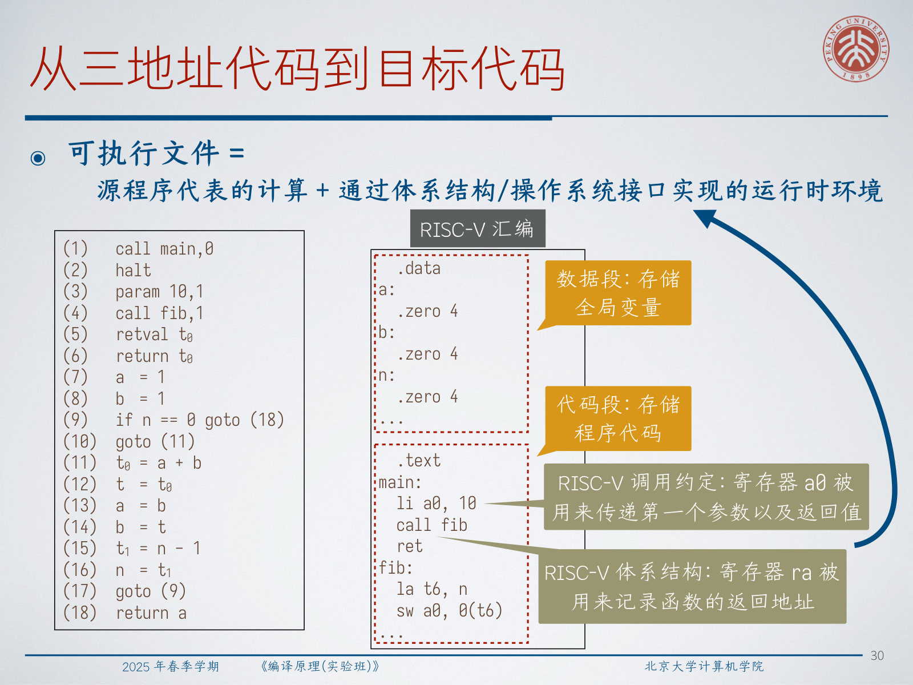

例如在 RISC-V 这样的本地目标上：

- 全局数据可以放在 `.data` 段；
- 程序代码可以放在 `.text` 段；
- `a0` 可以用来传递第一个参数以及返回值；
- `ra` 可以用来保存返回地址。

:::warn ⚠️ 问题：为什么“所有变量共享一张全局变量表”的虚拟机设计不够用？
问题：**这个简单 VM 为什么不足以支撑真实语言实现？**

解答：因为它无法区分“同一个过程的不同活动”，也无法区分“不同作用域里重名的标识符”。没有按活动分开的存储，递归就会出错；没有按作用域组织的存储，名字绑定也会出错。
:::

## 3. 存储组织

### 3.1 静态分配与动态分配

在代码生成完成之前，编译器必须决定目标运行环境如何为各种程序对象分配空间。

需要存储的对象通常包括：

- 源语言中的数据对象；
- 作为中间结果或参数传递载体的临时对象；
- 过程调用时要保存的上下文信息。

最基本的区分，是“分配决定发生在编译时”还是“发生在运行时”：

- 静态分配：
  编译器只凭程序文本就能决定放置位置；
- 动态分配：
  必须在程序运行过程中才能决定。

典型例子：

- 静态：
  常量、全局变量、静态变量；
- 动态：
  活动过程中的局部变量，以及通过 `malloc` 一类操作创建的堆对象。

这里有一个很容易混淆但很关键的点：一个对象的大小可以静态确定，并不意味着它一定应该静态分配。真正决定策略的，首先还是生命周期。

### 3.2 纯静态存储分配

**纯静态存储分配，就是所有分配决定都在编译时完成。**

它的优点很直接：

- 几乎不需要运行时支持；
- 访问路径可以提早固定下来。

它的缺点也很致命：

- 不支持递归过程；
- 不适合动态建立数据结构。

讲义用经典 Fortran 作为代表例子。因为过程活动之间不会递归重叠，所以不同过程可以在不同时间复用同一块存储空间。

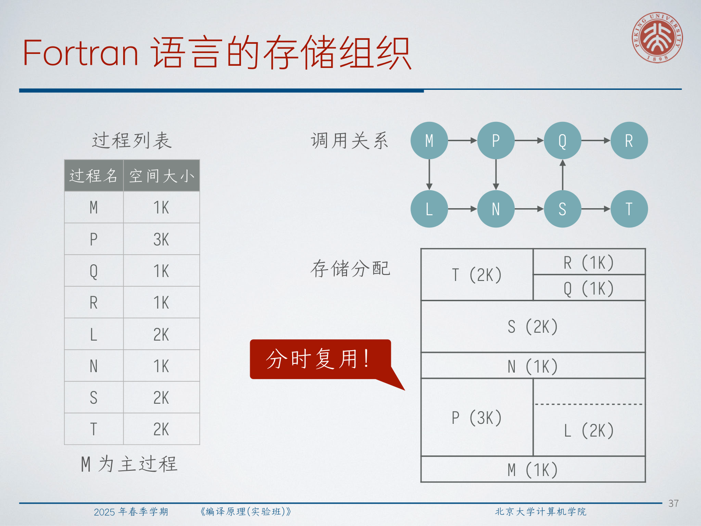

这是一种“按时间复用”的内存安排，而不是栈式管理。它之所以成立，只是因为语言语义足够受限。

### 3.3 栈分配与堆分配

为了支持递归过程，必须引入动态分配。关键观察是：过程活动在时间上是嵌套的，后调用的先返回，所以它们的生命周期满足后进先出。

因此，**栈** 很自然地适合管理：

- 形参；
- 生命周期与单次过程活动一致的局部变量；
- 过程调用时保存的上下文。

堆分配解决的是另一类问题。它面向那些：

- 大小在执行前无法固定；
- 生命周期不服从单次过程活动；
- 在创建它的过程返回后仍可能继续存活

的数据。

所以，栈处理的是“结构化、嵌套式”的生命周期；堆处理的是“更自由、非 LIFO”的生命周期。

## 4. 过程抽象

### 4.1 活动树

**活动树用一棵树来表示程序执行过程中发生的过程活动。**

每个结点对应某个过程的一次活动。根结点是入口过程的活动；某个结点的孩子，则表示这次活动内部所调用出的各个过程活动，并按调用先后从左到右排列。

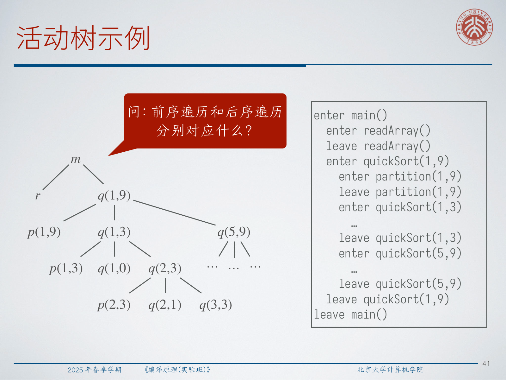

这棵树给出了一个非常清晰的执行图景：

- 进入某个过程，对应先访问该结点、再进入其子结点；
- 离开某个过程，对应先完成所有子结点，再回到该结点。

:::tip 💡 问题：这里的前序遍历和后序遍历分别对应什么？
问题：**在活动树例子里，前序和后序分别对应哪些执行事件？**

解答：前序遍历对应 `enter` 事件，因为过程一开始执行就“访问到”这个结点；后序遍历对应 `leave` 事件，因为必须先完成所有子活动，当前活动才能返回。
:::

### 4.2 活动记录

一次过程运行称为一次**活动**。为这次活动保存局部信息的那块连续存储区域，称为**活动记录**，也叫**帧**。

典型字段包括：

- 实际参数；
- 返回值槽位；
- 指向调用者活动记录的控制链；
- 用于访问非局部数据的访问链；
- 保存的机器状态，包括返回地址；
- 局部数据；
- 临时变量。

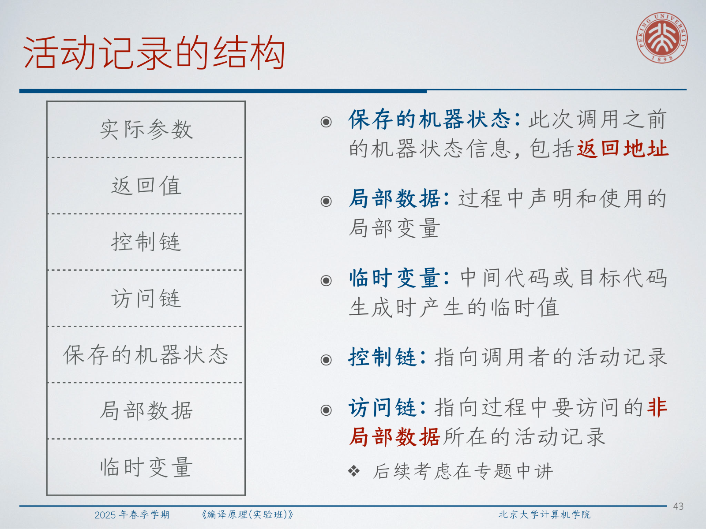

其中访问链在支持嵌套过程或其它非局部变量访问时尤其重要，因为那类访问遵循的是词法作用域，而不只是动态调用者关系。

不同执行平台会用不同方式实现这些思想。本地 ABI 和虚拟机都需要“每次活动各有一块存储”，但在“值放哪儿”“控制状态如何表示”这两件事上会不同。

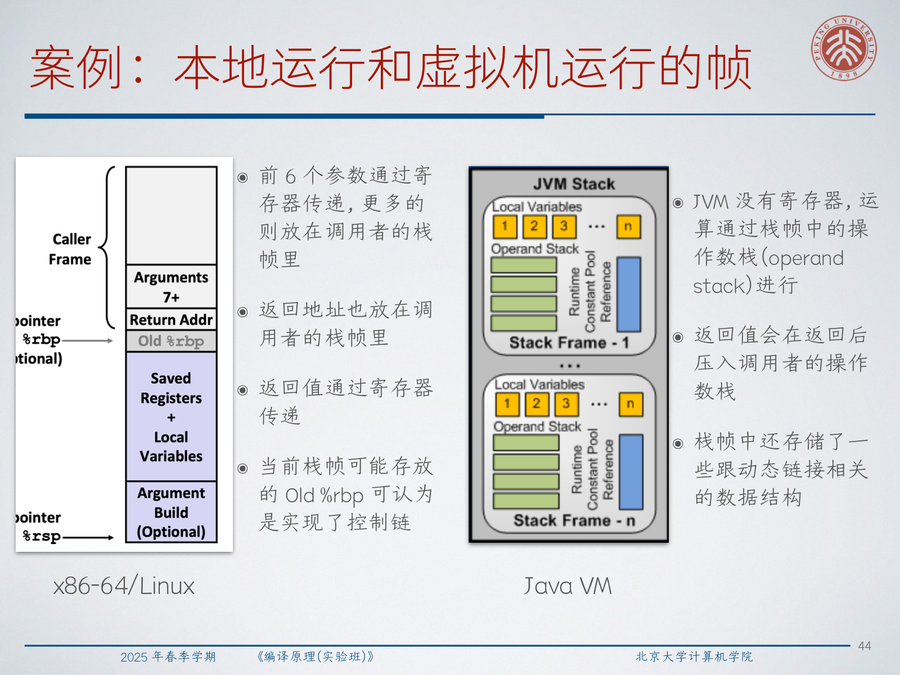

例如：

- x86-64/Linux 会大量使用寄存器，很多参数和返回值直接走寄存器；
- JVM 没有这里意义上的通用寄存器，求值主要依赖每个栈帧内部的操作数栈。

### 4.3 ARP 与变长局部数据

**活动记录指针（ARP）指向当前正在运行过程的活动记录。**

一种很清爽的设计，是让 `ARP` 指向活动记录中“固定长度区域的末端”。这样一来：

- 参数、控制链、保存状态等固定字段的偏移可以由编译器静态计算；
- 生成的代码可以通过相对 `ARP` 的固定偏移访问这些字段；
- 变长局部数据则可以继续生长在固定区域之外。

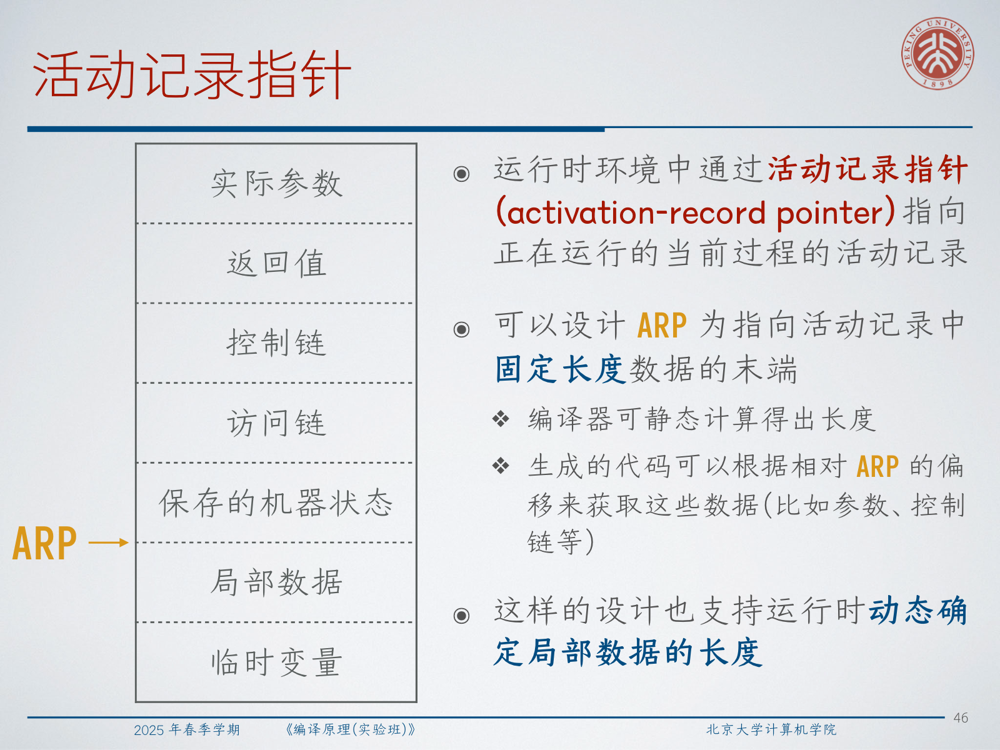

当栈帧里允许出现变长数组时，运行时通常还会维护一个栈顶指针 `TOP`。

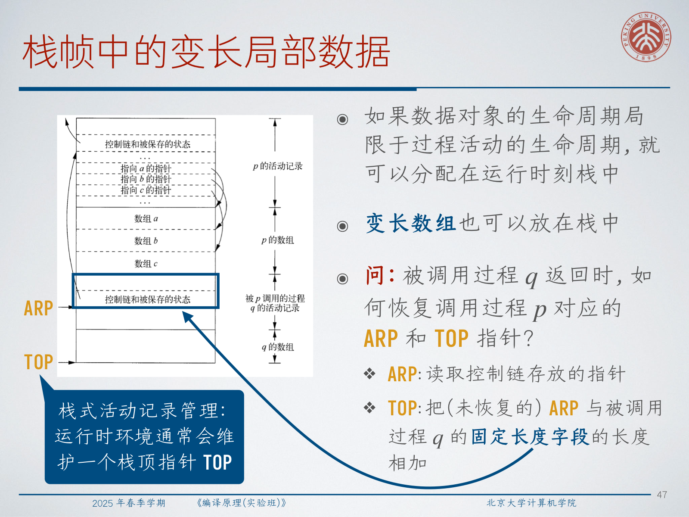

于是，被调用过程返回之后，恢复规则就变成了：

- 从保存的控制信息中恢复 `ARP`；
- 再根据尚未恢复的 `ARP` 和被调用者固定长度区域的大小，重新计算 `TOP`。

:::remark 📝 问题：当被调用过程在栈上分配了变长局部数据时，返回后如何恢复 `ARP` 和 `TOP`？
问题：**如果栈帧大小不是单一常数，调用者怎样正确恢复自己的帧指针和栈顶指针？**

解答：活动记录里保存的控制信息会告诉我们调用者原先的活动记录在哪里，这样就能恢复 `ARP`。然后 `TOP` 不是靠“固定帧大小常数”恢复，而是根据帧边界和被调用者固定长度部分的大小重新计算出来。
:::

## 5. 实现调用与返回

### 5.1 调用代码序列

讲义把一次调用拆成两个部分：

- 调用者里的 `precall`；
- 被调用者里的 `prologue`。

调用者侧的 `precall` 一般负责：

- 计算实参的值；
- 把它们写到被调用者活动记录或调用约定规定的位置；
- 保存 caller-saved 机器状态；
- 记录返回地址和旧 `ARP`；
- 更新 `ARP`，让它指向被调用者的帧。

被调用者侧的 `prologue` 一般负责：

- 保存 callee-saved 机器状态；
- 初始化局部数据；
- 正式开始执行函数体。

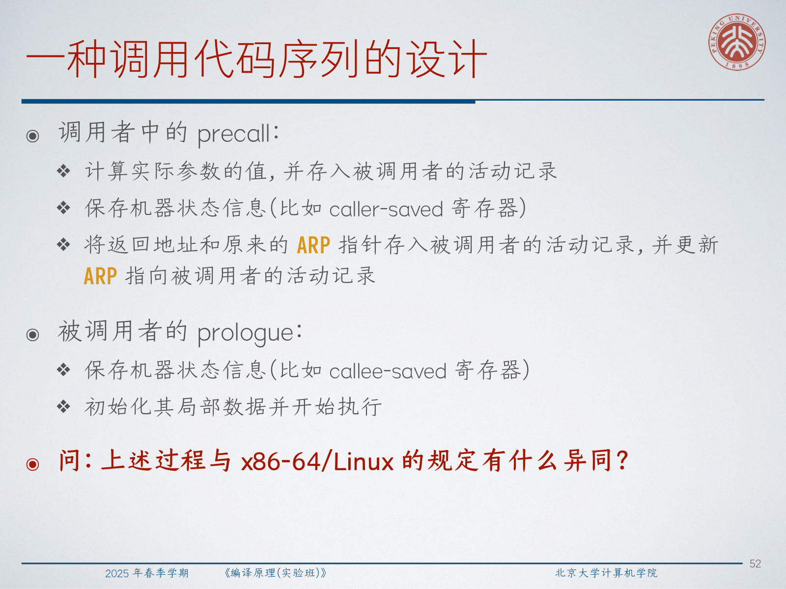

### 5.2 返回代码序列

讲义把返回过程也对称地拆成两部分：

- 被调用者里的 `epilogue`；
- 调用者里的 `postreturn`。

被调用者侧的 `epilogue` 一般负责：

- 把返回值放到约定好的位置；
- 利用保存的信息恢复 `ARP` 和 callee-saved 状态；
- 跳转到保存的返回地址。

调用者侧的 `postreturn` 接着负责：

- 取回返回值；
- 恢复 caller-saved 状态；
- 从调用点之后继续执行。

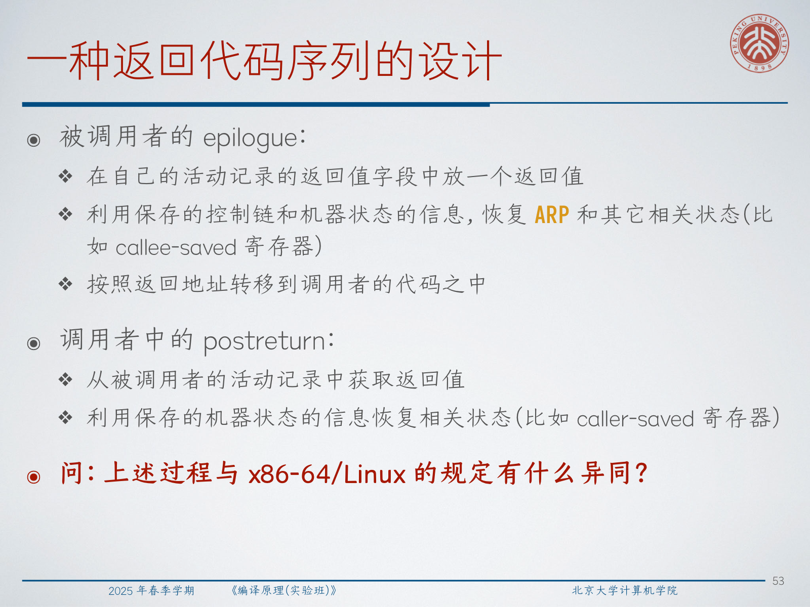

:::tip 💡 问题：这和 x86-64/Linux 的实际做法相比有什么异同？
问题：**讲义里的抽象调用/返回设计，与真实 ABI（例如 x86-64/Linux）相比，有哪些相同和不同？**

解答：高层职责是一致的，但真实 ABI 会把分工固定得更具体。比如 x86-64/Linux 会规定前若干参数和返回值走寄存器，`call`/`ret` 借助硬件支持处理返回地址，caller-saved 与 callee-saved 的划分是 ABI 预先约定好的，帧指针在某些优化场景下甚至可以被省略。
:::

## 6. 堆存储管理

### 6.1 目标与碎片

一个堆管理器至少要支持“分配”和“回收”变长内存块。常见评价目标包括：

- 空间效率：
  让程序需要的堆空间尽量小，减少碎片；
- 程序效率：
  让程序本身运行得更快，尤其是内存层次结构上的表现更好；
- 额外开销：
  让分配与回收操作本身尽可能便宜。

:::warn ⚠️ 问题：程序效率和额外开销有什么区别？
问题：**为什么讲义把 program efficiency 和 overhead 分开写？**

解答：程序效率说的是“用户程序拿到这些内存之后跑得快不快”，例如是否具有良好的局部性；额外开销说的是“内存管理器自己为了完成 `alloc/free` 花了多少时间和工作量”。一个设计可能改善前者，却牺牲后者。
:::

随着反复分配和回收，堆会逐渐变成“已用块”和“空闲窗口”交错的形态，这就是碎片问题。

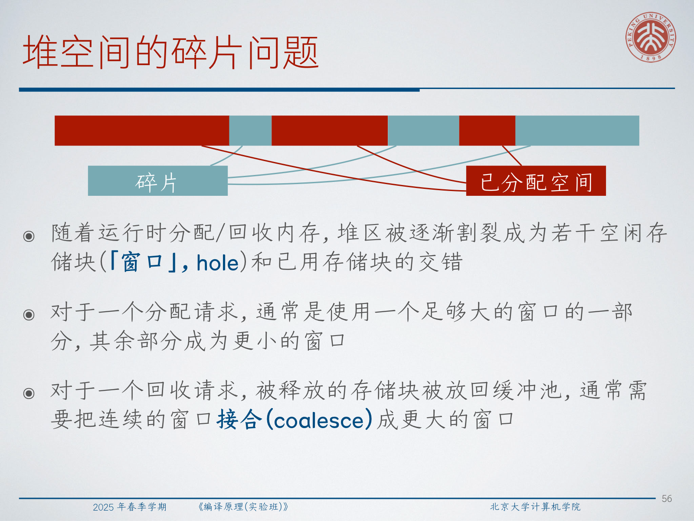

它通常带来两个直接后果：

- 一次分配往往只会用掉一个窗口的一部分，余下部分形成更小的窗口；
- 一次回收之后，通常要把相邻窗口接合成更大的空闲块。

### 6.2 分配策略与典型风险

讲义回顾了几种经典策略：

- best-fit：
  选择长度至少为 `N` 的空闲块中最小的那个；
- first-fit：
  选择第一个长度至少为 `N` 的空闲块；
- next-fit：
  从上一次找到的位置继续做 first-fit 搜索；
- largest-fit：
  选择长度至少为 `N` 的空闲块中最大的那个。

:::remark 📝 问题：什么场景下 `largest-fit` 才算合理？
问题：**最大适配在什么负载下可能还有意义？**

解答：它更像一种比较小众的策略。若请求通常都比较小，而你又希望把中等大小的空闲块尽量保留下来，那么不断从最大的空闲块里切一部分出来，有时是说得通的。但在通用分配器里，它通常不会是默认选择，因为它也可能过快破坏掉最大的连续空闲空间。
:::

手工堆管理还会带来两类经典正确性风险：

- 内存泄漏：
  不可达对象始终没有被回收；
- 悬空指针解引用：
  对已经释放的内存继续解引用。

因此，现代语言或运行时常常会引入：

- 基于生命周期和所有权的静态机制；
- 智能指针；
- 垃圾回收。

## 7. 玩具语言示例

### 7.1 这个玩具语言在测试什么

讲义最后用一个很小的 C 风格语言收尾。它只有：

- 一个 `main` 函数；
- `int` 类型；
- 以直线代码和嵌套语句块为主的程序。

即便这么小，它仍然已经在测试若干关键问题：

- 临时值如何表示；
- 标识符重名与遮蔽；
- 嵌套词法作用域；
- 同一个源语言名字在不同绑定位置上必须被区分开。

### 7.2 类三地址 IR

目标 IR 把纯表达式和带效果的指令分开表示：

$$
\begin{aligned}
R &::= id(x)\mid num(i)\mid add(R_1,R_2)\mid sub(R_1,R_2)\mid mul(R_1,R_2) \\
I &::= move(x,R)\mid div(x,R_1,R_2)\mid mod(x,R_1,R_2)\mid ret(R)\mid label(\ell) \\
F &::= func(x,\vec I) \\
P &::= prog(F)
\end{aligned}
$$

也就是说：

- `R` 是纯表达式语言；
- `I` 是指令语言；
- 每个函数体是一串指令。

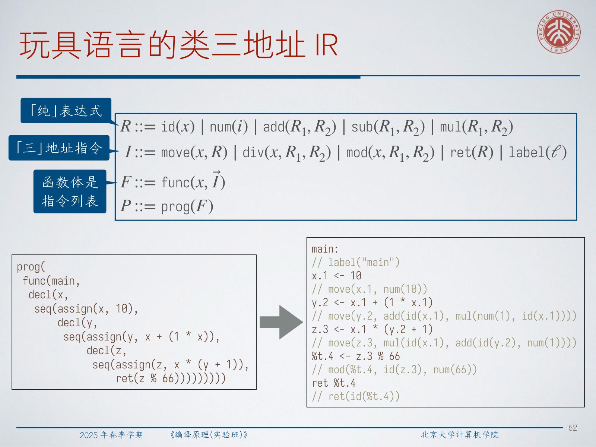

这里那些重命名后的标识符，例如 `x.1`、`y.2`、`%t.4`，尤其值得注意。它们说明作用域和绑定关系在执行前就已经被编译器消解掉了。运行时不再需要猜“这个 `x` 到底是哪一个 `x`”，因为编译器已经把它翻译成了彼此不同的存储名字。

## 8. Exam Review

### 8.1 必记定义

- **运行时环境**：使编译结果真正可执行的存储与调用机制。
- **静态分配**：所有分配决定都在编译时完成。
- **动态分配**：分配决定在程序运行时完成。
- **活动树**：表示动态过程活动关系的树。
- **活动记录 / 帧**：单次活动所使用的连续存储块。
- **控制链**：指向调用者活动记录的指针。
- **访问链**：按照词法作用域访问非局部数据时使用的指针。
- **ARP**：指向当前活动记录的指针。
- **堆碎片**：空闲内存被打散为多个分散窗口的现象。

### 8.2 需要会讲清楚的机制

- 为什么运行时环境本身就是可执行文件的一部分。
- 为什么纯静态分配不能支持递归过程。
- 为什么过程活动天然适合栈式管理。
- 为什么堆对象需要和栈上局部变量不同的管理方式。
- 活动树上的前序和后序为什么分别对应进入与离开。
- 活动记录里应该保存哪些信息。
- `precall/prologue` 与 `epilogue/postreturn` 怎样分担职责。
- 为什么 `ARP + 固定偏移` 是一种很有用的帧访问设计。
- 为什么会出现堆碎片，以及为什么需要接合。

### 8.3 简答题模板

- 为什么需要运行时环境：
  因为代码要想正确运行，仍然需要存储组织和过程抽象这套执行支撑。
- 为什么纯静态分配不能支持递归：
  因为同一个过程可能有多个在时间上重叠的活动，它们需要彼此独立的局部存储。
- 为什么过程调用适合用栈：
  因为过程生命周期是嵌套的，满足后进先出。
- 为什么还需要堆：
  因为有些数据的生命周期超出创建它的过程，或者其大小只能在运行时确定。
- 为什么活动记录很重要：
  因为每次调用都需要自己独立的参数、局部变量、保存状态和上下文链接。

### 8.4 常见误区

- 把“大小能静态确定”等同于“必须静态分配”；
- 忘记递归要求同一过程的多个局部状态同时存在；
- 混淆控制链和访问链；
- 以为一张全局变量表就足够实现有作用域的语言；
- 把堆分配问题只当作性能问题，而忽略其正确性风险；
- 混淆程序效率和分配器自身的额外开销。

### 8.5 自检清单

- 你能解释为什么运行时设计必须考虑作用域和对象模型等语言特性吗？
- 你能按生命周期比较静态分配、栈分配和堆分配吗？
- 你能画出一个活动记录并标清每个字段吗？
- 你能说明 `precall`、`prologue`、`epilogue`、`postreturn` 各自做什么吗？
- 你能解释堆碎片是怎样产生的，以及接合为什么有帮助吗？
- 你能解释为什么 IR 中重命名后的变量名会让运行时存储更容易处理吗？
