# Lec7: Target Code Generation

Target code generation is where the compiler stops describing computation abstractly and starts committing to a real machine model. At this point we must choose instructions, respect addressing modes and calling conventions, reuse registers aggressively, and still produce code that is both correct and reasonably efficient.

## 1. What Code Generation Must Do

The backend takes IR and lowers it into a form that can actually run: machine code, relocatable object code, bytecode, or assembly. The lecture emphasizes that code generation is not only about correctness. It is also about code quality.

**The basic tasks of target code generation are instruction selection, instruction scheduling, and register allocation.**

That gives us two parallel goals:

- generate a complete target program whose symbolic addresses have been resolved at the right stage;
- generate high-quality code with small size, fast execution, and good use of the target machine, especially its registers.

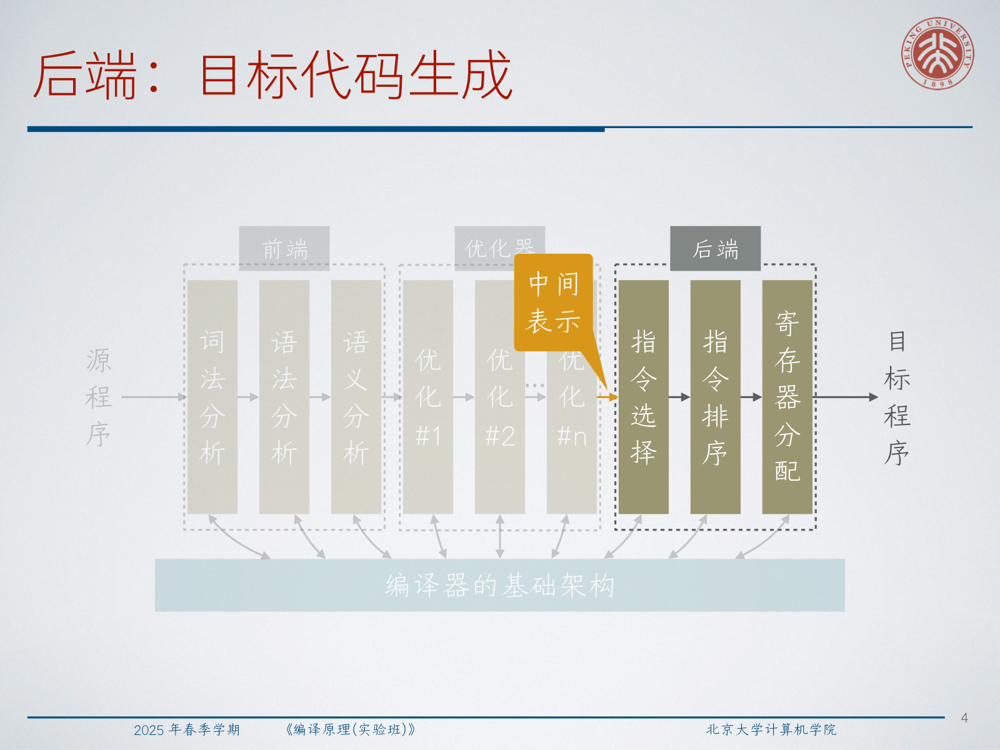

:::remark 📝 Question: How is target code generation different from IR generation?
Question: **Both stages translate one language into another. What is fundamentally different here?**

Answer: IR generation mainly preserves source-program meaning in a machine-independent form. Target code generation must additionally commit to concrete storage locations, instruction shapes, calling conventions, branch forms, and register pressure. In other words, IR generation organizes meaning, while target code generation pays the hardware bill.
:::

## 2. A Minimal Target-Machine Model

To explain the algorithms cleanly, the lecture uses a simple RISC-like machine:

- byte-addressed memory;
- one word is 4 bytes;
- general-purpose registers `R1, R2, ..., Rn`;
- instructions such as `LD`, `ST`, arithmetic `OP`, unconditional branch `BR`, and conditional branch `Bcond`.

This model is intentionally small, but it already exposes the real design questions. Once we target a machine, expressions are no longer "just values"; they become values living in registers, stack slots, constants, or computed addresses.

The lecture defines two core notations:

$$
contents(addr)
$$

$$
lvalue(x)
$$

Here `contents(addr)` means the value stored at location `addr`, while `lvalue(x)` means the memory location assigned to variable `x`.

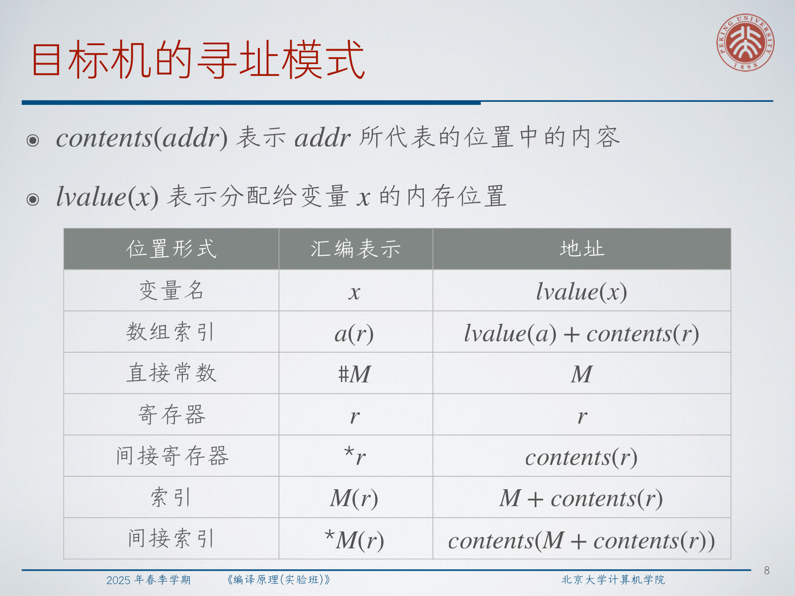

The essential addressing forms are:

- variable name `x` means address `lvalue(x)`;
- indexed address `a(r)` means `lvalue(a) + contents(r)`;
- direct constant `#M` means constant `M`;
- indirect register `*r` means `contents(r)`;
- indexed mode `M(r)` means `M + contents(r)`;
- indirect indexed mode `*M(r)` means `contents(M + contents(r))`.

These forms explain why even a simple IR statement may expand into several machine instructions. For example:

- `x = y - z` needs two loads, one subtraction, and one store if no useful registers already hold `y` or `z`;
- `b = a[i]` must compute the index address before loading the array element;
- `if x < y goto L` can become a subtraction plus a branch-on-sign test.

## 3. Stack-Managed Code Generation

When procedures appear, code generation must also respect runtime storage discipline. In the simplified stack-managed setting from the lecture:

- `SP` points to the stack top;
- the activation record stores at least the return address;
- names in IR can be lowered to offsets relative to `SP`.

The simplified call and return sequence is:

```text
caller:     ST -4(SP), #here+16
            BR callee.codeArea

callee:     SUB SP, SP, #callee.recordSize
...
callee:     ADD SP, SP, #callee.recordSize
            BR *-4(SP)
```

This is enough to show the shape of the problem:

- entering a callee allocates its activation record;
- local names become stack-relative addresses;
- returning deallocates the frame and jumps through the saved return address.

The lecture's recursive `fact` example is useful because it shows both control transfer and frame layout at once.

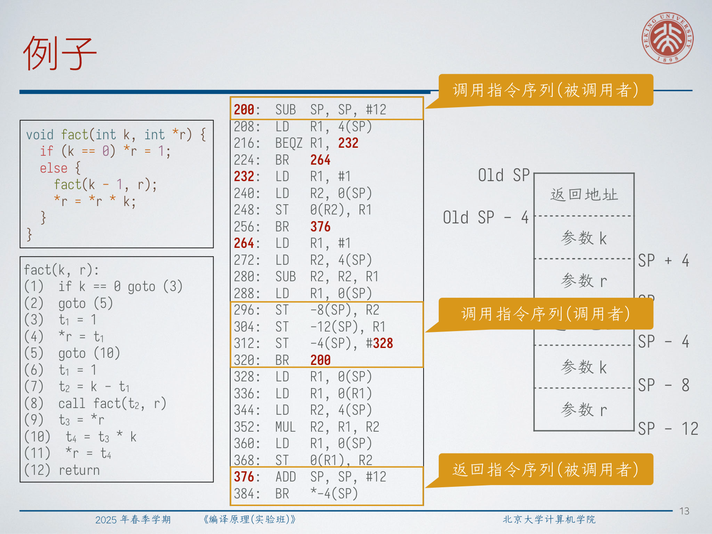

Once names already carry compile-time offsets, a source statement like `a = b + 1` can be lowered directly into stack-relative instructions such as `LD R1, 4(SP)`, `ADD R1, R1, #1`, and `ST 0(SP), R1`.

## 4. Local Code Generation Inside One Basic Block

For a single basic block, we process three-address statements in order and try to keep useful values in registers as long as possible.

The lecture uses two descriptor structures:

- **register descriptor**:
  for each register, record which variables currently have their values there;
- **address descriptor**:
  for each variable, record all locations where its current value can be found, including registers and memory.

This leads to a clean local strategy:

1. for `x = y op z`, choose registers for `x`, `y`, and `z`;
2. load `y` or `z` only if they are not already in chosen registers;
3. emit `OP Rx, Ry, Rz`;
4. update the descriptors to reflect that `Rx` now contains the current value of `x`;
5. at the end of the block, store live variables whose current values are not yet in their home memory locations.

For copy statements `x = y`, the best case is even simpler: choose the same register for both sides and just update the descriptors. If `y` is not yet in a register, load it first.

The lecture also gives a deliberately simpler fallback: if you do not want to maintain descriptors, then store the result back to memory immediately after each statement. That version is easier to implement, but it loses many reuse opportunities and increases `LD`/`ST` traffic.

:::remark 📝 Question: What exactly does the first-pass local algorithm assume?
Question: **Why does the lecture first present an algorithm as if registers were abundant?**

Answer: because the conceptual core is reuse, not scarcity. The first explanation isolates the logic "load only when needed, overwrite only when safe, store only when necessary." Real scarcity is then handled by `getReg`, liveness information, and eventually spilling.
:::

## 5. Liveness Analysis Drives Register Reuse

Safe register reuse depends on knowing whether a value will still be needed later. The lecture formalizes that idea through liveness analysis.

The three key predicates are:

- **`def(i, x)`**: statement `i` assigns to `x`;
- **`use(i, x)`**: statement `i` uses the current value of `x`;
- **`live_out(i, x)`**: `x` is live at the program point immediately after statement `i`.

For sequential statements, the recurrence is:

$$
use(j, x) \Rightarrow live\_out(i, x)
$$

$$
live\_out(j, x) \land \neg def(j, x) \Rightarrow live\_out(i, x)
$$

where `j` is the next statement after `i`.

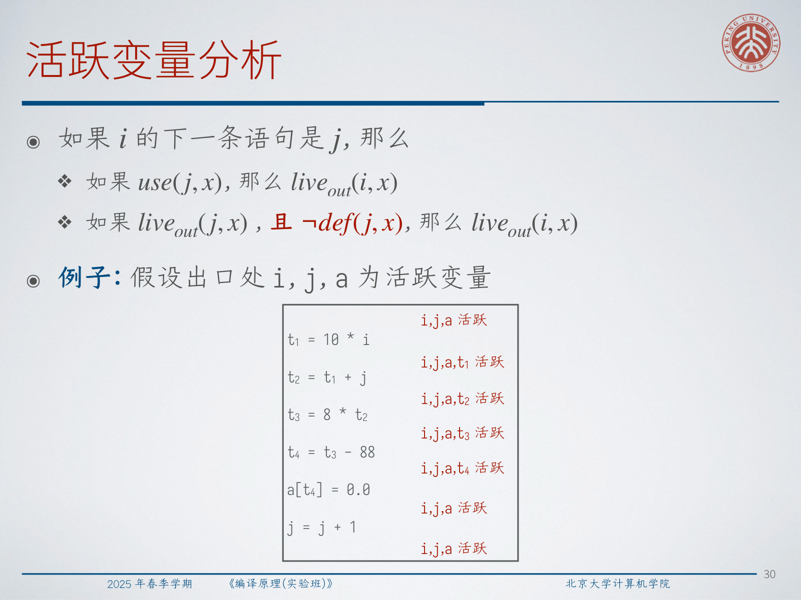

Inside one basic block, we scan backward. For each statement `x = y op z`:

1. attach the current liveness information to that statement;
2. mark `x` as not live;
3. mark `y` and `z` as live.

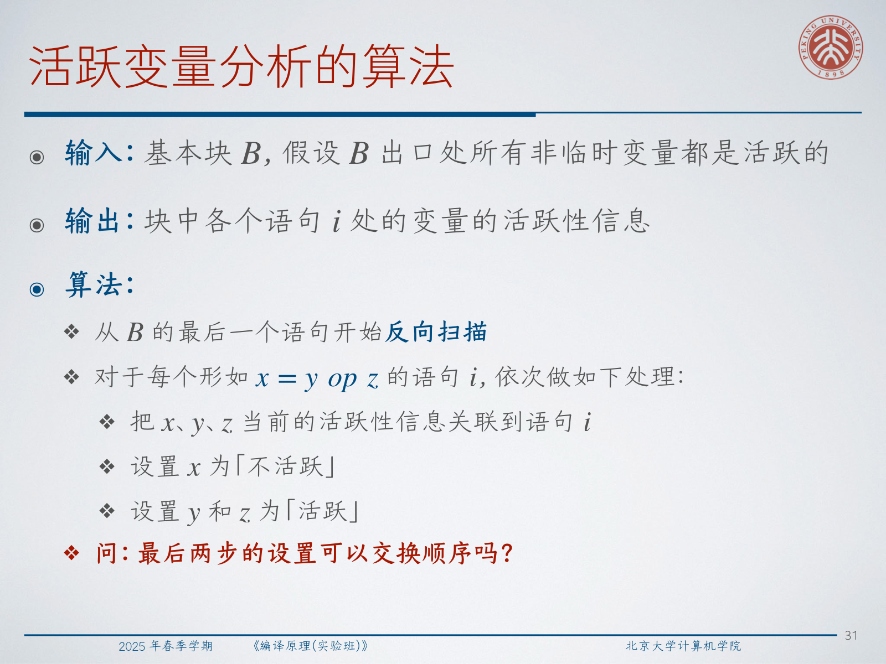

Across basic blocks, liveness becomes a control-flow problem:

- the live variables at one block's exit depend on the live variables at its successors' entries;
- if one block's exit information changes, recompute affected predecessors;
- iterate until the information stabilizes.

:::tip 💡 Question: Can the last two liveness updates be swapped?
Question: **When scanning backward for `x = y op z`, can we mark `y` and `z` live before killing `x`?**

Answer: not in general. If `x` is also one of the operands, swapping the order can incorrectly resurrect a value that should be considered killed by the current definition. The safe mental model is: record current liveness, kill the defined value, then add the used values.
:::

### 5.1 The `getReg` heuristic

Now liveness becomes operational. **The goal of `getReg` is to reduce the number of `LD` and `ST` instructions.**

For operands `y` and `z`, the heuristic is:

- if the operand is already in a register, reuse that register;
- otherwise, if a free register exists, use it;
- otherwise, consider reusing a candidate register `R` holding value `v`.

That candidate is safe if at least one of the following holds:

- the address descriptor of `v` already includes some other location;
- `v` is exactly `x`, and `x` is not an operand of the current statement;
- `v` is not live after the current statement.


If none of those conditions holds, we must spill.

For the result register:

- a register containing only `x` is always acceptable;
- a register containing only `y` is acceptable if `y` is not live afterward;
- similarly for a register containing only `z`;
- for `x = y`, first choose `Ry`, then set `Rx = Ry`.


:::warn ⚠️ Question: Can two registers avoid spilling in the lecture's second local example?
Question: **For the block `t=a-b; u=a-c; v=t+u; a=d; d=v+u`, is two-register code without spill possible?**

Answer: no for that example. At the critical points, the block simultaneously needs values that have overlapping future uses, so two physical registers are not enough to preserve all needed live values without storing something away.
:::

## 6. Global Register Allocation by Graph Coloring

Local code generation alone is not enough. If we store every live value back to memory at every block exit, we miss reuse opportunities across blocks, especially around loops and branch joins.

The lecture therefore separates two ideas:

- **allocation**: which values should live in registers;
- **assignment**: which physical registers should hold them.

The proposed global strategy is a two-pass method:

1. first pass:
   assume infinitely many symbolic registers, generate code, and optionally skip block-end stores;
2. second pass:
   compute liveness of symbolic registers, build a register-interference graph, and color that graph with the available physical registers.

**A register-interference graph has one node per symbolic register, and an edge means the two symbolic registers cannot share one physical register.**

More precisely, `R1` interferes with `R2` if there exists some instruction `i` such that:

- `def(i, R2)` holds, and
- `live_out(i, R1)` holds.

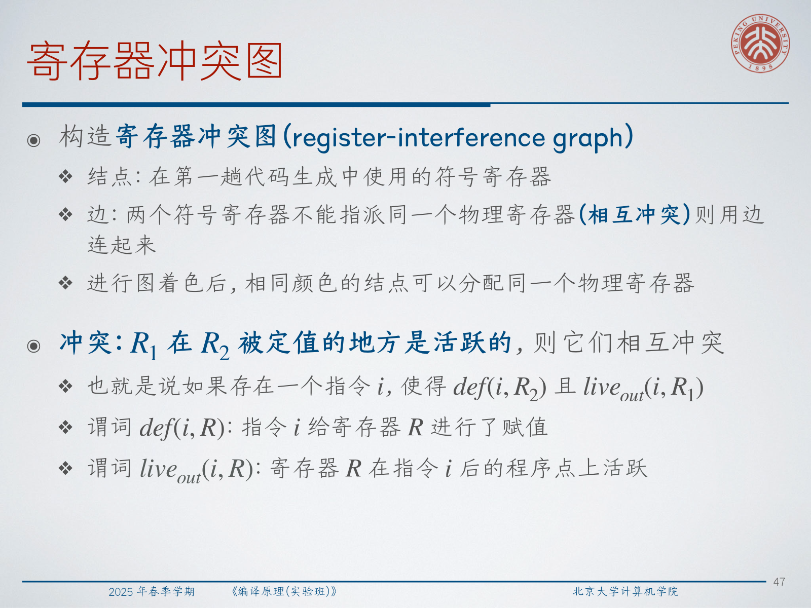

This turns register assignment into graph coloring:

- one color corresponds to one physical register;
- adjacent nodes must receive different colors;
- nodes with the same color can share one physical register.

The lecture also reminds us that general `m`-coloring is hard: the decision problem is NP-complete for `m > 2`. So compilers use heuristics rather than exact optimal coloring.

One classic heuristic is:

- repeatedly remove nodes whose degree is less than `m` and push them onto a stack;
- if all remaining nodes have degree at least `m`, pick a spill candidate and remove it without coloring;
- once the graph is empty, pop nodes and assign any color not used by their already colored neighbors.

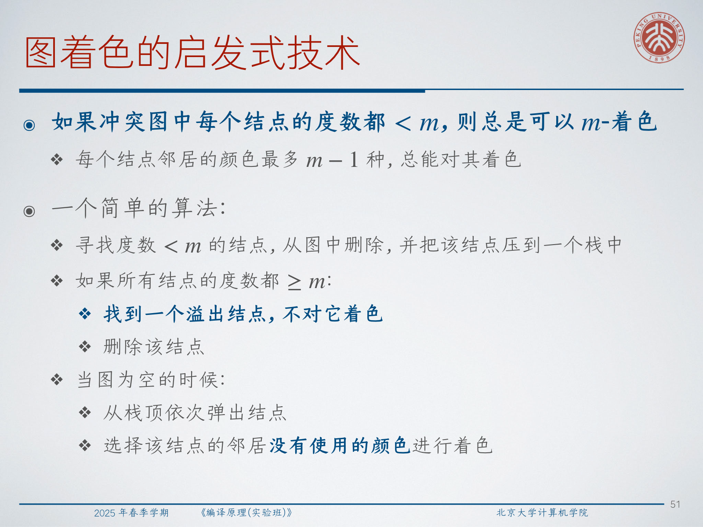

The lecture's CFG example shows the payoff: the first interference graph is 4-colorable but not 3-colorable, so one symbolic register must be spilled or rewritten before a 3-register allocation becomes possible.

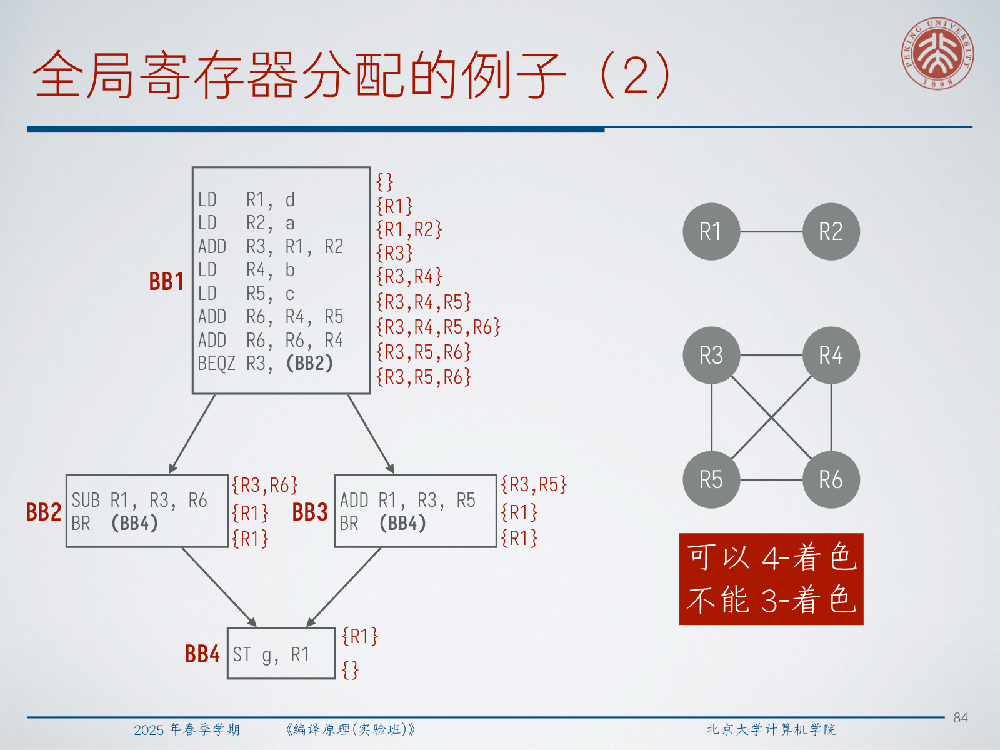

## 7. Spill, Split, and Coalesce

When coloring fails, we do not give up. We transform the program and try again.

### 7.1 Spilling

Spilling means moving a symbolic register's value to memory so that a physical register can be reused. But spilling is not free:

- stores are needed when the value leaves a register;
- loads are needed before later uses;
- spills inside loops are especially expensive.

The lecture therefore introduces **spill cost**, an estimate of the extra runtime cost introduced by those loads and stores.

$$
spillCost(R_1) = storeCost + loadCost
$$

$$
spillCost(R_2) = 11 \cdot storeCost + 11 \cdot loadCost
$$

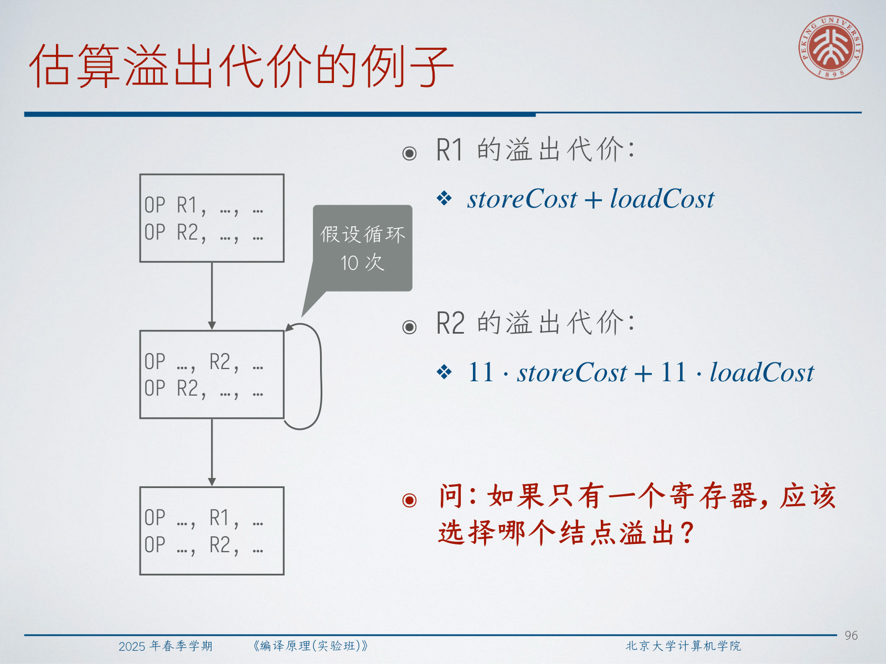

The point is not that the estimate is exact. It cannot be exact, because branch behavior, loop trip counts, caching, and branch prediction are not fully known at compile time. The point is to choose a spill candidate whose estimated damage is smallest.

:::warn ⚠️ Question: What should we do after coloring fails and a spill is chosen?
Question: **Is it enough to mark one node as spilled and continue coloring the old code?**

Answer: no. After selecting a spill, we must rewrite the code so uses and definitions of that value go through memory and any newly introduced temporary registers. Then we rerun liveness analysis and rebuild the interference graph, because the program's live ranges have changed.
:::

### 7.2 Splitting

Sometimes a whole live range is too expensive to spill, but one continuous range is what creates the conflict. Then we can split the live range:

- save the value at one split point;
- reload it later;
- turn one high-degree node into smaller ranges with fewer interferences.

This may reduce graph degree enough to make coloring possible with the existing number of registers.

### 7.3 Coalescing

Code generation often creates many register-to-register copies such as `LD R1, R2`. If the source and destination do not interfere, we would like them to share one physical register and eliminate the copy.

That is the idea of **coalescing**: merge two nonadjacent symbolic-register nodes into one.

But coalescing is not always beneficial. Merging nodes can increase degree and destroy a previously colorable graph.

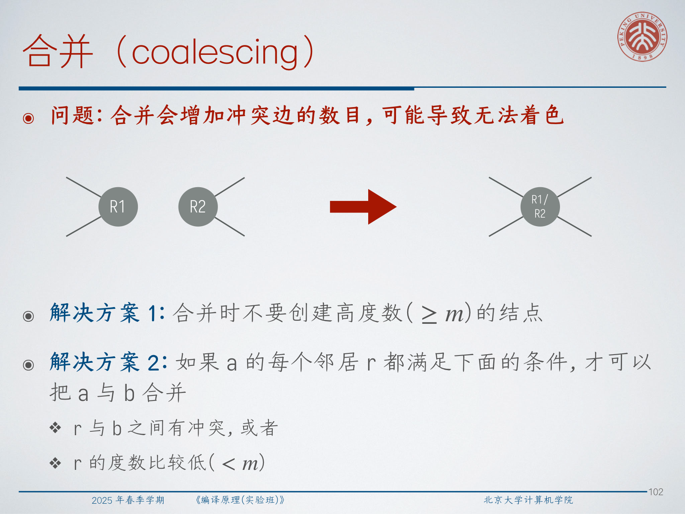

Two common safety heuristics from the lecture are:

- do not create a high-degree node with degree `>= m`;
- merge `a` with `b` only if every neighbor `r` of `a` either already interferes with `b` or has degree `< m`.

:::tip 💡 Question: Why can coalescing make allocation harder even though it removes copies?
Question: **Why isn't "merge whenever possible" always a win?**

Answer: because removing one copy can also merge two neighborhoods in the interference graph. That may create a node with too many conflicts to color under the available register budget. So coalescing trades fewer moves against potentially higher coloring difficulty.
:::

## 8. Precolored Nodes and Calling Conventions

Real machines are not neutral about registers. Some instructions implicitly read or define specific physical registers.

The lecture calls these **precolored nodes**:

- on x86, `mul` implicitly uses fixed registers such as `eax` and `edx`;
- on RISC-V, `call` uses argument registers like `a0`, `a1`, `a2`, ... and effectively defines caller-saved registers;
- on RISC-V, `ret` reads `a0` as the return-value register.

Those physical registers must be inserted into the interference graph in advance, already colored, and never spilled like ordinary symbolic registers.

The recursive `fact` example shows what this means in practice. A first pass may use symbolic registers `R1`, `R2`, ... for values such as `k`, `r`, and intermediate results, while still moving arguments through `a0` and `a1` and returning through `a0`. After allocation, some long-lived values are assigned to callee-saved registers `s1` and `s2`, which forces a final patch to the prologue and epilogue.

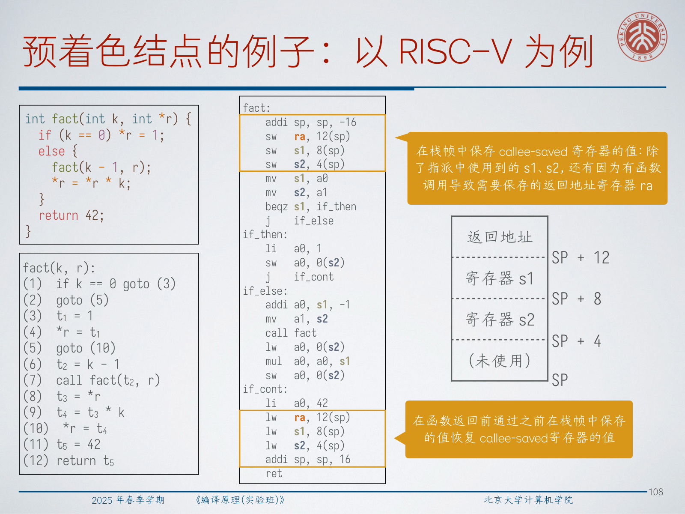

That final patch saves and restores `ra`, `s1`, and `s2`, and it enlarges the stack frame accordingly. So register allocation is not isolated from calling convention details; it actively reshapes the final procedure entry and exit code.

:::remark 📝 Question: Why do many modern compilers sometimes prefer linear scan over graph coloring?
Question: **If graph coloring is powerful, why do production compilers often use simpler allocation strategies in some pipelines?**

Answer: because simpler algorithms can be much easier to implement, faster to run, and good enough in JITs or latency-sensitive compilation pipelines. Graph coloring usually gives stronger global reasoning, but its engineering cost and compile-time overhead are higher.
:::

## 9. Exam Review

### 9.1 Must-know definitions

- **instruction selection**: choose concrete target instructions for IR operations;
- **instruction scheduling**: reorder instructions to improve performance while preserving dependencies;
- **register allocation**: decide which values stay in registers and which physical registers they use;
- **register descriptor**: from register to current resident values;
- **address descriptor**: from variable to all locations holding its current value;
- **liveness**: whether a value will be used in the future before being redefined;
- **interference graph**: graph whose edges mean two symbolic registers cannot share one physical register;
- **precolored node**: a fixed physical register already constrained by the instruction set or ABI.

### 9.2 Mechanisms you should be able to explain

1. Why local code generation wants to avoid unnecessary `LD` and `ST`.
2. How backward liveness analysis supports safe register reuse.
3. How `getReg` decides between reuse, free-register choice, and spill.
4. Why global allocation uses symbolic registers first and physical registers second.
5. How graph coloring models "cannot share one physical register".
6. Why spilling, splitting, and coalescing are program transformations, not just bookkeeping tricks.
7. Why calling conventions introduce precolored nodes and frame patches.

### 9.3 Short-answer templates

- "Why are registers valuable?"
  Registers reduce memory traffic and usually shorten the critical execution path, so good code generation tries to keep live values in registers whenever safe.
- "Why is liveness needed?"
  Because overwriting a register is safe only when the old value will not be used later, or when it already exists elsewhere.
- "Why can two symbolic registers share one physical register?"
  Because if they are not simultaneously live, their live ranges do not interfere.
- "Why does spilling depend on loop structure?"
  A load/store inserted inside a hot loop may execute many times, so its real cost is much larger than the same instruction on a cold path.

### 9.4 Common mistakes

- treating register allocation as purely local when cross-block reuse matters;
- forgetting that `x = y op z` both kills `x` and uses `y`, `z`;
- assuming spill choice is purely syntactic rather than runtime-cost sensitive;
- merging nodes aggressively during coalescing without checking colorability;
- ignoring calling conventions when assigning registers globally.

### 9.5 Self-check list

- Can I explain the difference between code generation and IR generation?
- Can I derive machine code for a simple assignment and a simple branch on the toy target?
- Can I compute liveness backward on a short basic block?
- Can I say when a register may be safely reused?
- Can I define interference from `def` and `live_out`?
- Can I explain why a graph can fail to be `m`-colorable?
- Can I describe what changes after introducing a spill?
- Can I explain why `call` and `ret` force special register constraints?
