# Lec8: Code Optimization

Optimization is the part of compilation where we stop asking only "is the code correct?" and start asking "is the code unnecessarily expensive?" This lecture introduces the basic optimization toolbox, then builds the global analysis framework that lets a compiler justify those optimizations across control flow.

## 1. Why We Optimize and What Counts as Good Optimization

**Optimization must be safe.** Any optimization performed by a compiler must preserve the source program's semantics, usually understood as its observable behavior.

**Optimization should also be profitable.** The target may be lower running time, smaller code size, lower energy consumption, or some combination of them. The lecture highlights the usual engineering intuition: most of the gain often comes from a relatively small fraction of the code, so a good optimizer spends its effort where it matters most.

Optimization can happen at different stages:

- algorithm-design time, usually by the programmer;
- semantic-analysis time, when source-level facts already allow simplification;
- machine-independent optimization on IR;
- machine-dependent optimization during target-code generation;
- sometimes link-time optimization as well.

The scope also varies:

- **local optimization**: inside one basic block;
- **regional optimization**: over a region such as a loop;
- **global optimization**: across all basic blocks of one procedure;
- **interprocedural optimization**: across procedure boundaries.

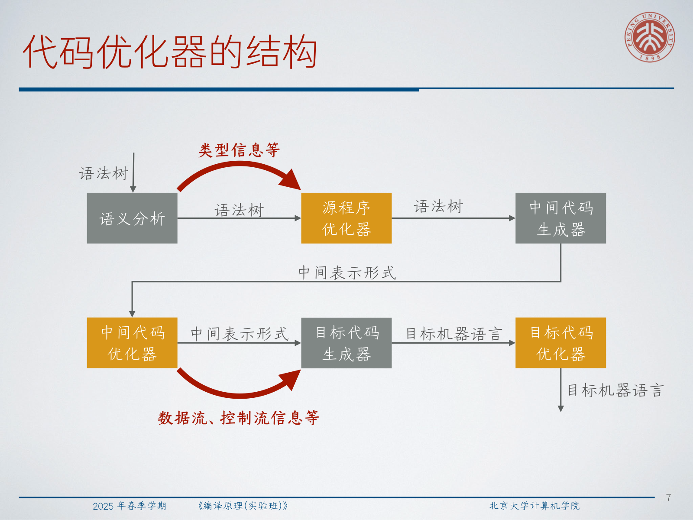

The lecture also reminds us that modern optimizers are typically multi-pass systems. Real systems such as LLVM expose a long list of small analysis and transformation passes instead of one giant monolithic optimizer.

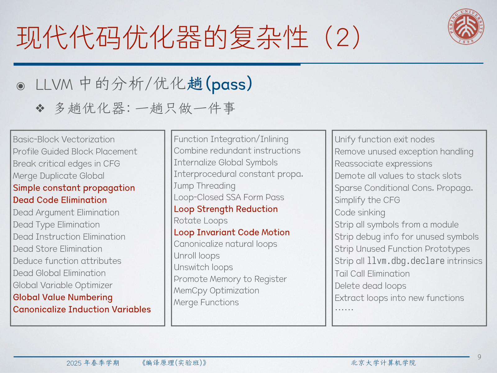

:::remark 📝 Question: Why does the lecture stress safety before cleverness?
Question: **Why can't an optimizer simply replace code with something that is "usually faster"?**

Answer: because an optimization is only valid if it preserves program meaning for all executions allowed by the language semantics. "Usually faster" is not enough when it changes observable behavior, breaks aliasing cases, or relies on assumptions the source language never promised.
:::

## 2. The Core Optimization Toolbox

The lecture first surveys the common transformations that reappear throughout compiler design.

### 2.1 Expression and value simplifications

The basic local transformations are:

- **common subexpression elimination**:
  reuse a previously computed value instead of recomputing the same expression;
- **copy propagation**:
  if `x = y`, replace later uses of `x` with `y` when safe;
- **dead code elimination**:
  remove statements whose results are never used;
- **constant propagation**:
  if a variable is known to hold a constant, replace its uses with that constant;
- **constant folding**:
  if an expression is compile-time constant, evaluate it during compilation.

These often chain together naturally. A common subexpression may create a copy, copy propagation may expose dead code, and constant propagation may create opportunities for constant folding.

### 2.2 Loop-oriented optimizations

Loops matter disproportionately because hot code tends to live there. The lecture therefore emphasizes three classic loop optimizations:

- **loop-invariant code motion (LICM)**:
  move computations out of the loop if they produce the same result on every iteration;
- **strength reduction**:
  replace expensive repeated operations with cheaper incremental updates;
- **induction-variable elimination**:
  remove redundant loop variables that evolve in lockstep with others.

For example, if `R = L + 2` is invariant across loop iterations, it can be hoisted out of the loop.

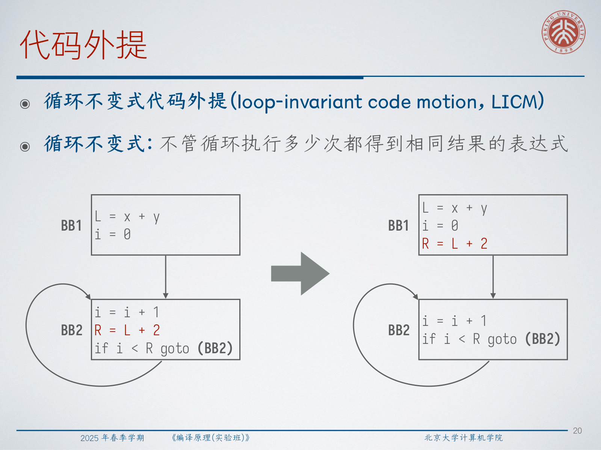

In the quicksort-style example, repeated address calculations such as `t4 = 4 * j` can be rewritten using the recurrence already implied by the loop:

- if `j = j - 1`, then the corresponding address variable can evolve as `t4 = t4 - 4`;
- that removes repeated multiplication and replaces it with a cheaper update.

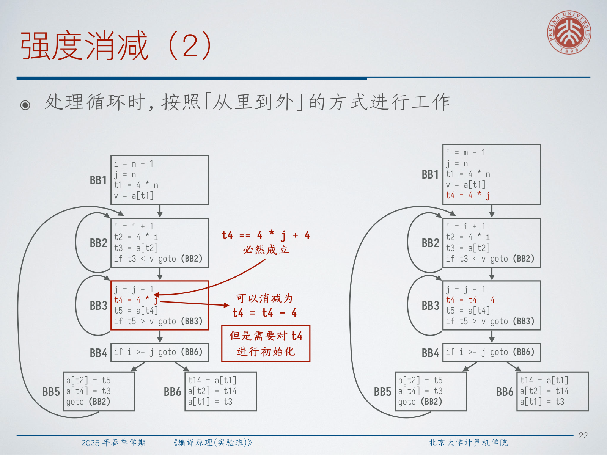

When two induction variables evolve with the same pace, one of them may become redundant. Then the original variable can disappear and its companion can be used directly in the loop test or address computation.

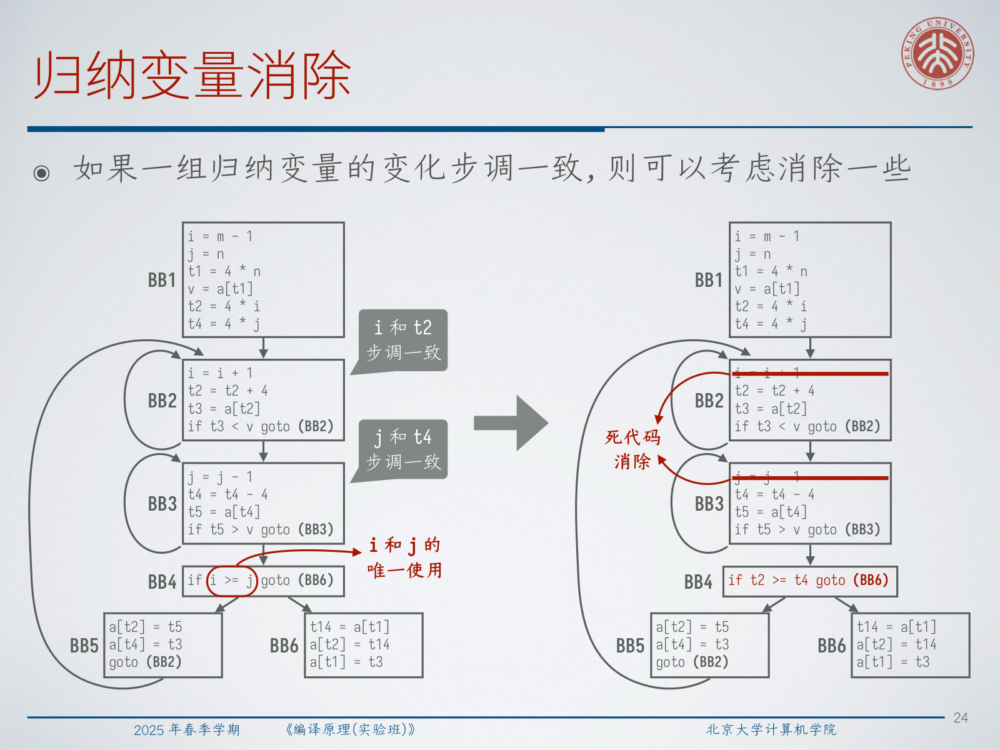

:::tip 💡 Question: Why are loop optimizations so important?
Question: **Why does the optimizer care especially about loops instead of spreading effort uniformly?**

Answer: because loop bodies may execute many times, so even a tiny local improvement there is multiplied by the trip count. The same transformation outside a hot loop may matter much less in total runtime.
:::

## 3. Basic-Block Optimization with DAGs

Inside one basic block, the lecture uses a DAG to summarize value relationships.

### 3.1 What a basic-block DAG represents

The construction idea is:

- each variable initially corresponds to a node representing its incoming value;
- each computation becomes a node whose children are the current value-nodes of its operands;
- labels on nodes record operators;
- variables associated with a node are those for which that node is the latest definition inside the block;
- output nodes are those whose associated variables are live at block exit.

So the DAG captures the relation between initial values and the final values that leave the block.

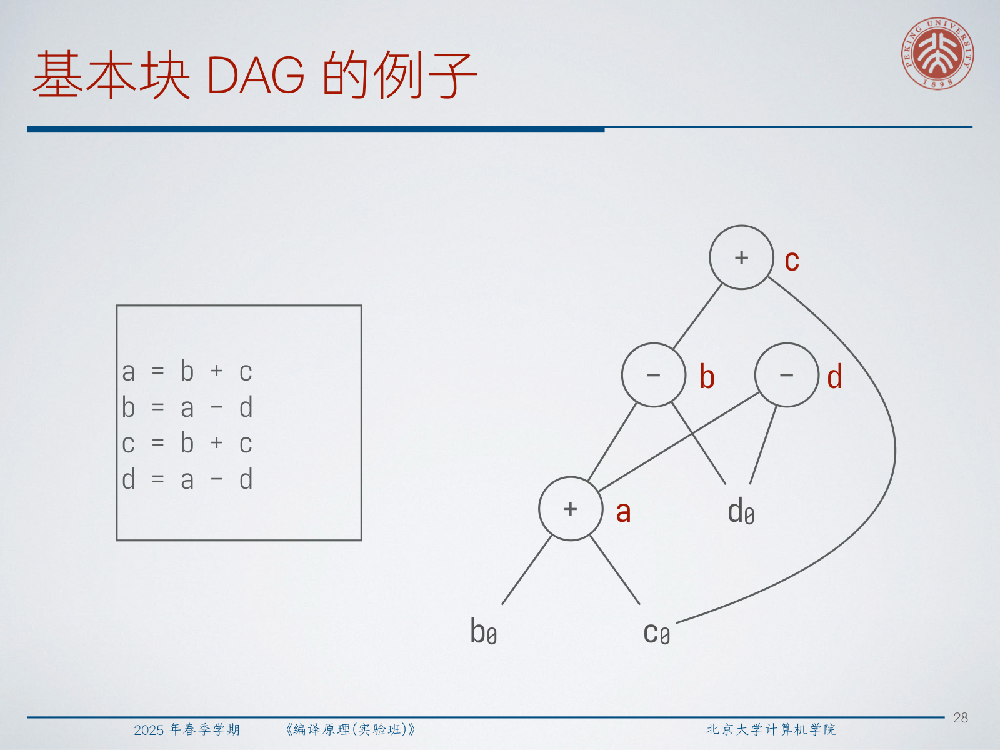

### 3.2 Building the DAG and using it

While scanning the block:

- for `x = y op z`, create a node labeled `op` with children equal to the current nodes of `y` and `z`, then associate `x` with that node;
- for `x = y`, create no new computation node; simply associate `x` with the current node of `y`.

This immediately exposes two important facts:

- repeated computations may map to the same value structure;
- some computations may never contribute to any live output.

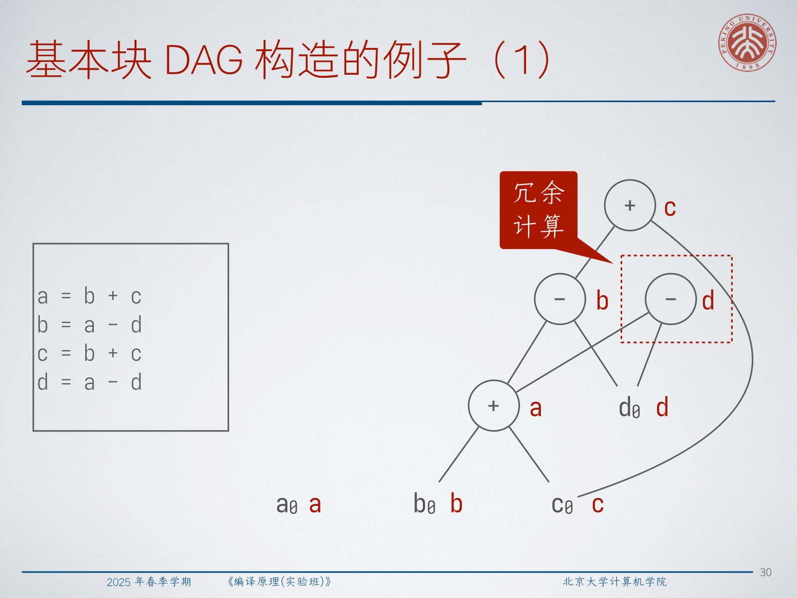

From the DAG we can perform:

- local common subexpression elimination;
- dead code elimination;
- algebraic simplification using identities like `x + 0 = x`, `x * 1 = x`, `x / 1 = x`;
- strength-reduction style rewrites when the pattern is purely local.

### 3.3 Arrays, pointers, calls, and code reconstruction

DAG optimization becomes trickier once memory effects appear.

For arrays, the lecture asks whether `a[i]` remains a common subexpression across:

```text
x = a[i]
a[j] = y
z = a[i]
```

The safe answer is no in general, because `a[i]` and `a[j]` may alias.

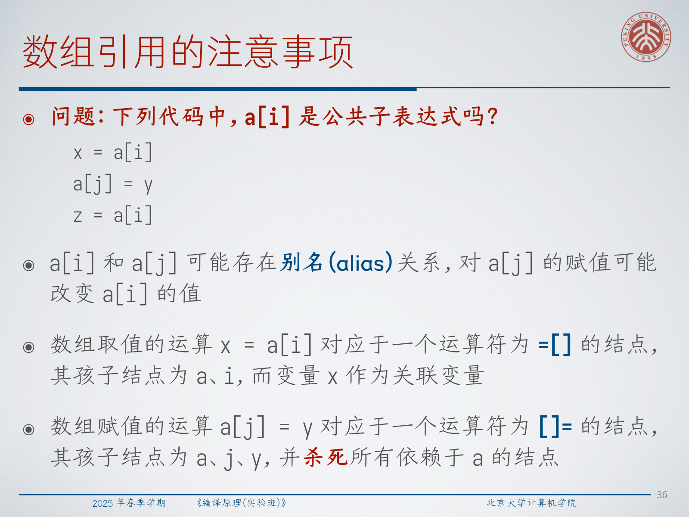

The same conservative principle applies to pointers and calls:

- `*q = y` may kill many memory-dependent nodes because the compiler may not know what `q` points to;
- a procedure call is conservatively assumed to use and modify all data it can access, unless stronger analysis proves otherwise.

After optimization, we still need to regenerate code from the DAG:

- emit one statement per needed node;
- prefer assigning results to live variables;
- if one node corresponds to several live variables, use copy statements as needed;
- preserve a safe order when arrays, pointers, or calls are involved.

:::warn ⚠️ Question: Why can we not reuse `a[n]` as aggressively as a scalar temporary?
Question: **In the quicksort fragment, why is a later `a[t1]` load not treated like a trivial common subexpression of the earlier `v = a[t1]`?**

Answer: because intermediate stores to the same array may change that location, directly or through possible aliasing of indices. Scalars are easier because their definitions are explicit; memory references require conservative reasoning about whether intervening writes may have invalidated the old value.
:::

## 4. Peephole Optimization

**Peephole optimization** uses a small sliding window over target instructions and replaces the current instruction sequence with a shorter or faster equivalent one.

It can also be applied to IR, but its classic setting is target code.

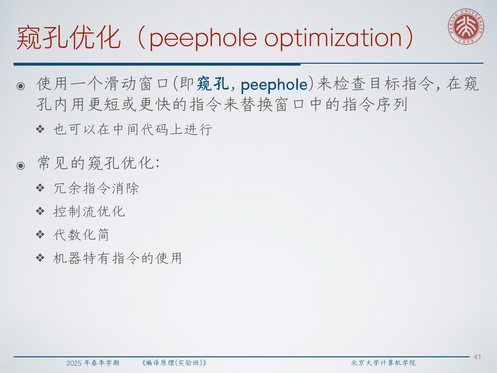

The lecture lists four common peephole categories:

- redundant-instruction elimination;
- control-flow simplification;
- algebraic simplification;
- replacement with machine-specific instructions.

Typical examples include:

- removing useless `LD`/`ST` pairs;
- deleting unreachable instructions;
- collapsing `goto L1; ...; L1: goto L2` into a direct jump;
- replacing multiplication by `2` with an addition;
- replacing `ADD R1, R1, #1` with a target-specific instruction such as `INC R1` when the machine supports it.

Peephole optimization is deliberately local, but it is still valuable because many code-generation artifacts are tiny instruction patterns rather than large control-flow phenomena.

## 5. The Data-Flow Analysis Framework

Local optimization alone is not enough for cross-block reasoning. For global optimization, the lecture introduces data-flow analysis as a general framework.

At a high level, we associate a **data-flow value** with each program point or block boundary, then infer how those values propagate through the CFG.

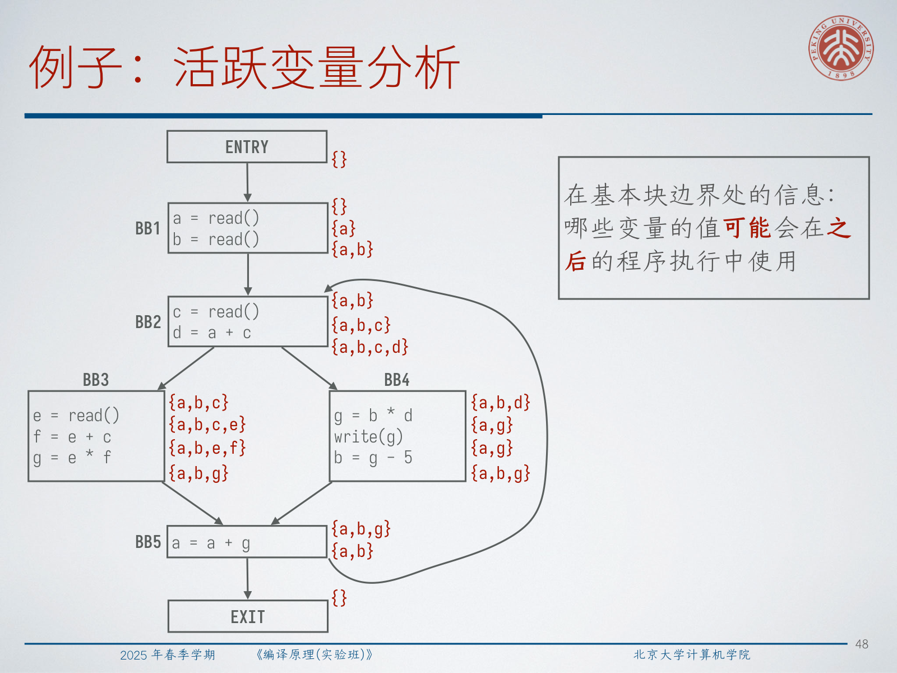

### 5.1 Program points, directions, and transfer functions

The lecture distinguishes:

- **forward analysis**:
  information depends on all paths ending at a program point;
- **backward analysis**:
  information depends on all paths starting at a program point.

Each basic block has a transfer function `f_B` that summarizes the effect of the whole block.

For forward analyses:

$$
OUT[B] = f_B(IN[B])
$$

For backward analyses:

$$
IN[B] = f_B(OUT[B])
$$

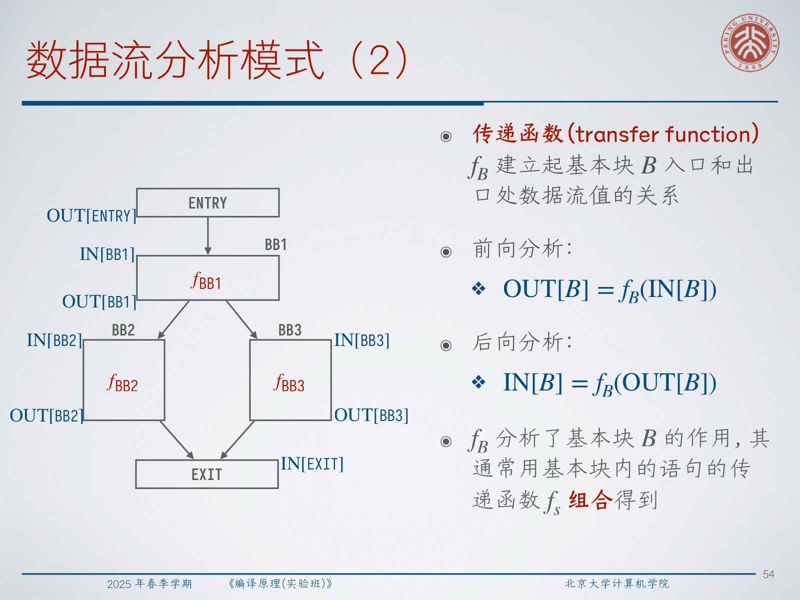

To combine information from multiple predecessors or successors, we use a **meet operator**. The exact operator depends on the meaning of the analysis:

- union when "possible on some path" is what matters;
- intersection when "true on every path" is required;
- a domain-specific operator for richer abstract values such as sign information.

The sign-analysis example makes this concrete: if two incoming facts agree, keep that fact; otherwise degrade to an "unknown" value.

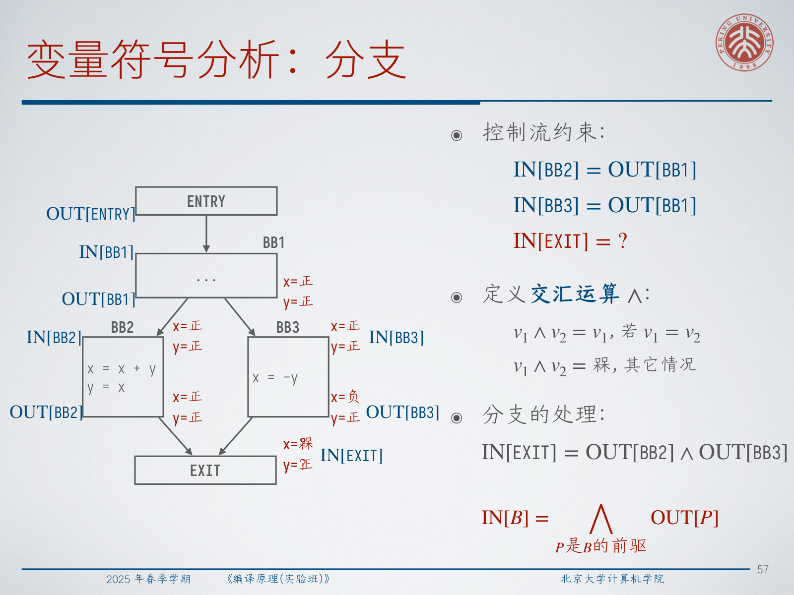

### 5.2 Conservative reasoning and iterative solving

When loops exist, equations become mutually recursive. The lecture therefore treats data-flow analysis as a system of equations and solves it iteratively:

1. initialize each block with a conservative top value;
2. repeatedly choose a block and recompute its `IN` and `OUT`;
3. stop when no block changes.

The key principle is **conservativeness**:

- when information is incomplete, do not guess a stronger fact than you can justify;
- instead, move to a safe over-approximation or under-approximation, depending on the analysis.

The lecture summarizes the general schemas as follows.

For forward analysis:

$$
IN[B] = \bigwedge_{P \in pred(B)} OUT[P]
$$

$$
OUT[B] = f_B(IN[B])
$$

For backward analysis:

$$
OUT[B] = \bigwedge_{S \in succ(B)} IN[S]
$$

$$
IN[B] = f_B(OUT[B])
$$

:::remark 📝 Question: Why do different analyses use different top values?
Question: **Why is the top value empty for some analyses but the universe for others?**

Answer: because the initialization must represent "no useful information yet" in a way that is safe for that analysis's meet operator and interpretation. If the analysis asks what is possible on some path, empty often means "nothing known reachable yet." If it asks what is guaranteed on every path, the safest unknown starting point may be the universal set, which is then refined downward by intersection.
:::

## 6. Live Variable Analysis

**Live variable analysis** is a backward analysis whose domain is the set of variables that may be used later.

For each statement `s`, define:

- `def_s`: the variable(s) assigned by `s`;
- `use_s`: the variable(s) whose current values are read by `s`.

Its statement transfer function is:

$$
f_s(O) = (O - def_s) \cup use_s
$$

At block level, the composition yields:

$$
f_B(O) = (O - def_B) \cup use_B
$$

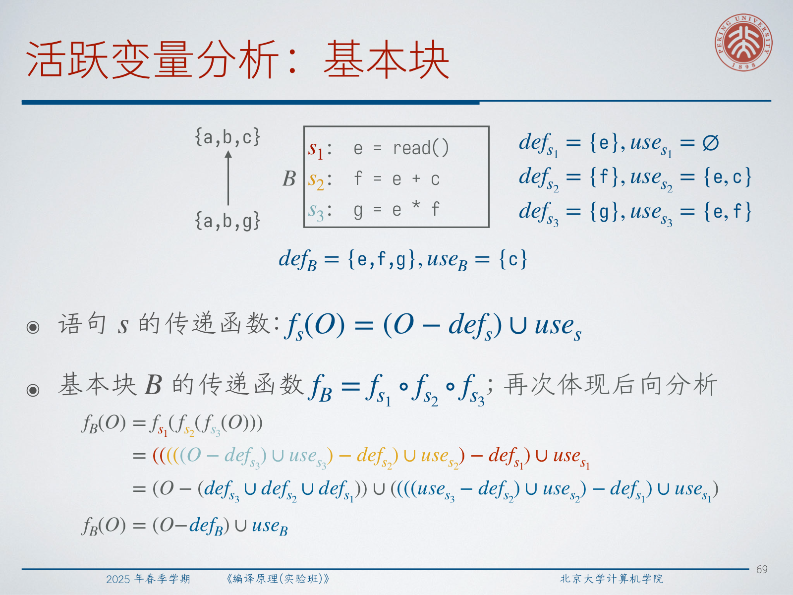

Because liveness is a backward "may" analysis:

- meet is union;
- boundary condition is `IN[EXIT] = \varnothing`;
- initialization for non-exit blocks is also the empty set.

At branches, a variable is live if it is live in **any** successor:

$$
OUT[B] = \bigcup_{S \in succ(B)} IN[S]
$$


This information supports optimizations such as:

- dead code elimination;
- register allocation and spill decisions;
- pruning unnecessary temporaries after other rewrites.

## 7. Reaching Definitions

**Reaching definitions** is a forward analysis whose domain is the set of assignments that may reach a program point along some path.

Its purpose is to answer questions like:

- which assignment to `x` may have produced the value seen here?
- is a use fed by one known definition or many?
- can a use be replaced by a constant or propagated value?

For each statement `s`:

- `gen_s` is the set of definitions generated by `s`;
- `kill_s` is the set of other definitions to the same variable killed by `s`.

The statement transfer function is:

$$
f_s(I) = (I - kill_s) \cup gen_s
$$

The block form is:

$$
f_B(I) = (I - kill_B) \cup gen_B
$$

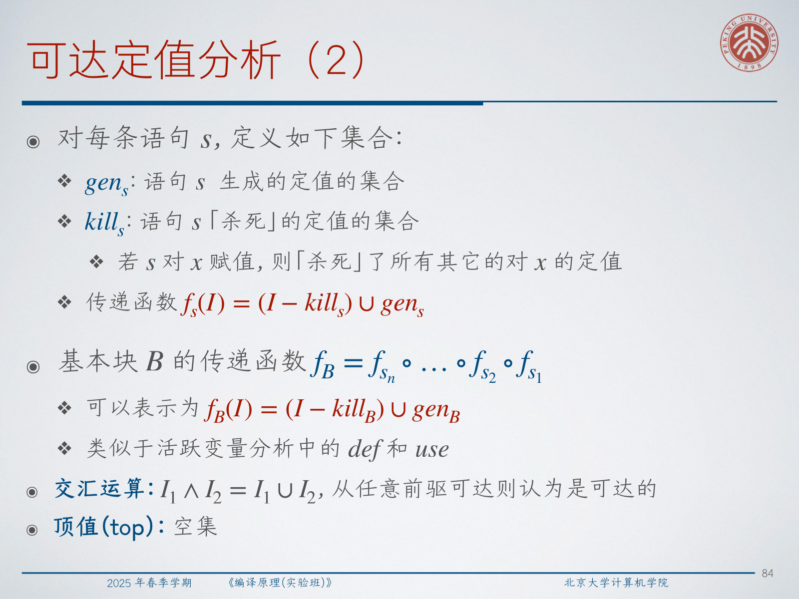

Because this is a forward "may" analysis:

- meet is union;
- boundary condition is `OUT[ENTRY] = \varnothing`;
- top is the empty set.

Its practical use in this lecture is mainly as a stepping stone toward optimizations such as constant propagation and other value-flow reasoning.

## 8. Available Expressions

**Available expressions** is a forward analysis whose domain is the set of expressions that have already been computed on every path to a point, with none of their operands modified since the latest computation.

This is the global form of the intuition behind common subexpression elimination.

For each statement `s`:

- `e_gen_s` is the set of expressions generated by `s`;
- `e_kill_s` is the set of expressions invalidated by `s`.

The transfer functions are:

$$
f_s(I) = (I - e\_kill_s) \cup e\_gen_s
$$

$$
f_B(I) = (I - e\_kill_B) \cup e\_gen_B
$$

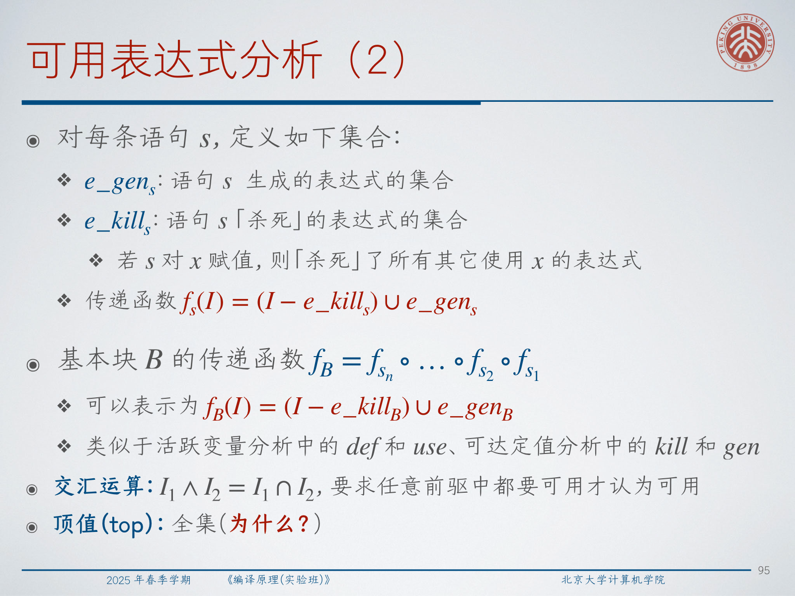

Unlike reaching definitions, this is a forward **must** analysis:

- meet is intersection, because an expression is available only if it is available on **every** incoming path;
- boundary condition is `OUT[ENTRY] = \varnothing`;
- top is the universe of candidate expressions.

This analysis feeds global common subexpression elimination by answering whether a recomputation is redundant at a merge point, not just inside one block.

:::tip 💡 Question: Why does available-expression analysis use intersection instead of union?
Question: **Why is an expression unavailable as soon as one predecessor cannot guarantee it?**

Answer: because "available" is a must-property, not a may-property. To reuse a previous value safely without recomputation, the compiler must know that every path to the current point has already computed that expression and has not invalidated it afterward.
:::

## 9. Exam Review

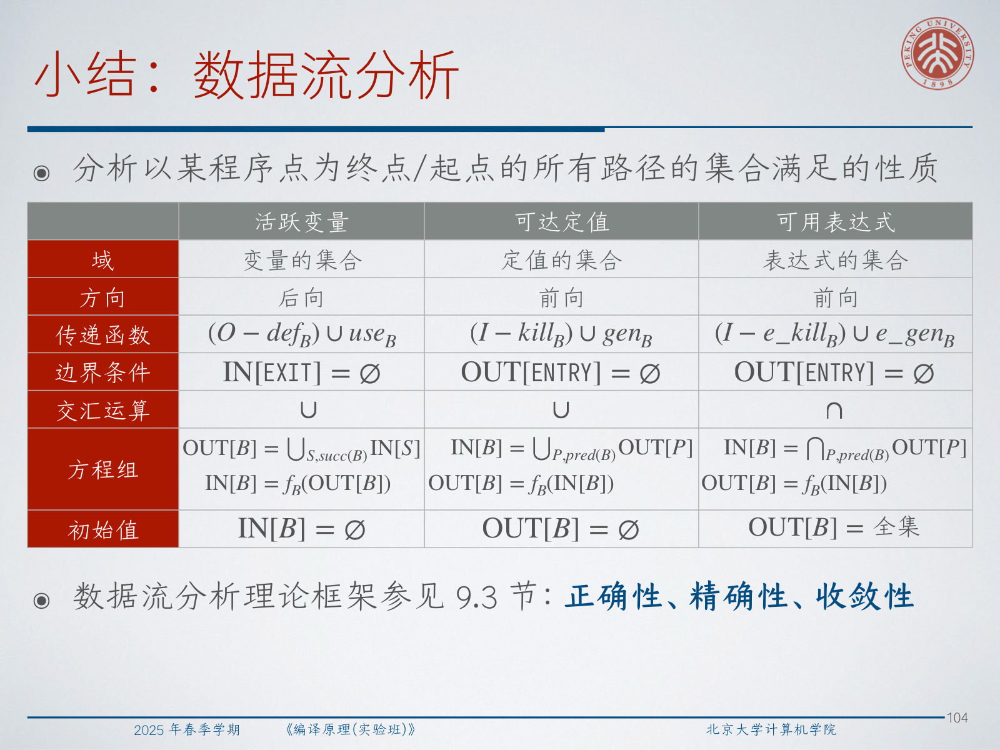

### 9.1 Must-know definitions

- **common subexpression elimination**: reuse an existing computed value instead of recomputing the same expression;
- **copy propagation**: replace uses of a copied variable by the original value when safe;
- **dead code**: code whose computed result is never used;
- **constant propagation**: replace a variable by a compile-time constant when its value is known;
- **constant folding**: evaluate compile-time constant expressions during compilation;
- **loop-invariant code motion**: hoist expressions whose values do not change across loop iterations;
- **strength reduction**: replace expensive repeated operations with cheaper ones;
- **induction variable**: a loop variable that changes by a constant step each iteration;
- **peephole optimization**: rewrite a small local instruction window into a shorter or faster equivalent form;
- **transfer function**: the effect of one statement or block on a data-flow value;
- **meet operator**: the rule used to merge information from different control-flow paths.

### 9.2 Mechanisms you should be able to explain

1. Why optimization must preserve observable behavior.
2. Why loop optimizations often produce the largest runtime wins.
3. How a basic-block DAG captures value relationships.
4. Why arrays, pointers, and calls force conservative invalidation.
5. How peephole optimization differs from CFG-wide optimization.
6. How forward and backward data-flow analyses differ.
7. Why liveness uses union while available expressions use intersection.
8. Why iterative solving is needed once loops create cyclic constraints.

### 9.3 Short-answer templates

- "Why is dead code removable?"
  Because if a statement's result is never used on any later execution path, removing the statement does not change observable program behavior.
- "Why does strength reduction help?"
  Because it replaces expensive repeated work, such as multiplication inside a loop, with cheaper incremental updates that preserve the same value evolution.
- "Why are aliasing cases hard?"
  Because one memory write may invalidate many apparently unrelated reads unless the compiler can prove they refer to different locations.
- "Why is available-expression analysis stricter than reaching definitions?"
  Because reaching definitions asks what may arrive on some path, while availability asks what is guaranteed on every path.

### 9.4 Common mistakes

- treating an optimization as valid just because it works on the common case;
- forgetting that memory writes can kill more than one apparent expression;
- mixing up may-analyses and must-analyses;
- using the wrong meet operator for a problem;
- assuming loop optimizations can be applied independently of dependence or alias information.

### 9.5 Self-check list

- Can I distinguish local, regional, global, and interprocedural optimization?
- Can I explain how common subexpression elimination, copy propagation, and dead code elimination reinforce each other?
- Can I show why a loop-invariant expression may be hoisted safely?
- Can I explain how a basic-block DAG is built and what it buys us?
- Can I derive the block-level form of liveness from statement-level transfer functions?
- Can I write down the transfer functions for reaching definitions and available expressions?
- Can I explain why top is different across liveness, reaching definitions, and available expressions?
- Can I say when intersection is required instead of union?
