# Lec9：语法分析进阶

## 1. 为什么需要进阶语法分析

语法分析器读取 token 序列，并构造语法分析树或对应的语法结构。输入不合法时，语法错误应该尽量提供足够细节，让程序员知道分析停在何处、原本期望什么 token 或语法短语。

上一讲重点讨论预测式自顶向下分析。它的核心限制也正是本讲的出发点：LL 分析必须在真正分析产生式体之前，就决定使用哪条产生式。**LL(k) uses the next k tokens to predict a production**，也就是说，LL(k) 只能根据接下来固定 `k` 个 token 做预测；一旦某个语言的判断需要任意远的未来信息，固定向前看的 LL 分析就无能为力。

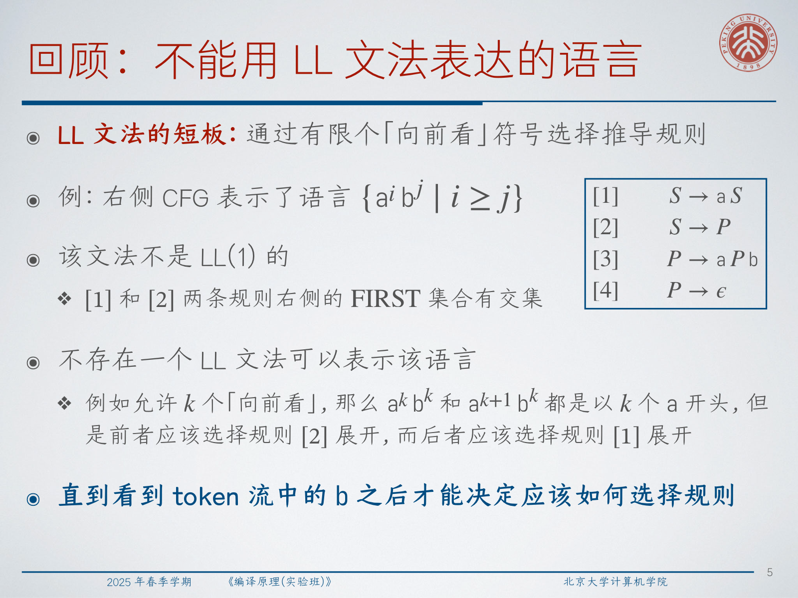

考虑语言：

$$
\{a^i b^j \mid i \ge j\}
$$

一个自然的文法是：

```text
[1] S -> aS
[2] S -> P
[3] P -> aPb
[4] P -> epsilon
```

困难在于：开头的某个 `a` 到底属于 `S -> aS` 生成的额外前缀，还是属于 `P -> aPb` 生成的配对部分？对于任意固定的向前看长度 `k`，`a^k b^k` 和 `a^{k+1} b^k` 的前缀都会在很长一段内看起来一样，但正确的推导选择不同。这不是构造表时的小失误，而是结构性限制。

:::remark 📝 问题：为什么固定 LL(k) 向前看无法处理这个例子？
问题是：**为什么这个文法会要求分析器在信息足够之前就做选择？** 分析器必须决定继续生成额外的前导 `a`，还是切换到配对的 `P` 部分。区分这两种情况的证据要到 `b` 区域才出现，而这个距离可以任意长。固定的 `k` 不可能覆盖所有输入。
:::

自底向上分析换了一个视角。它不在看到产生式体之前预测产生式，而是等右部已经出现在分析栈上之后，再把它归约回左部。因此，自底向上分析能够处理许多 LL 分析很难甚至无法处理的文法。

## 2. 自底向上分析与移进-归约预测

自底向上分析从左到右读取 token，并通过归约已经识别出的子串来构造语法结构。实现上，它维护一个分析栈，并反复执行两类动作：

- **移进**：把下一个输入 token 压入分析栈。
- **归约**：如果栈顶匹配某条产生式 `A -> alpha` 的右部 `alpha`，就弹出 `alpha`，再压入 `A`。

因为归约是在反向撤销推导步骤，所以自底向上分析构造的是最右推导的逆过程。已经可以被归约的子串称为句柄；在 LR 风格的分析中，句柄被归约时总是在栈顶。

对于括号文法：

```text
S' -> S EOF
[1] S -> epsilon
[2] S -> [ S ] S
```

分析器可以移进 `[`，在合适位置把空串归约为 `S`，再移进 `]`，最终把 `[ S ] S` 归约回 `S`。真正困难的不是移进或归约本身，而是在某个具体栈上下文中判断哪个动作合法。

:::tip 💡 问题：如何判断应该移进还是归约？
问题是：**How to determine shift or reduce?** 朴素策略是：只要栈顶匹配某个右部就归约，否则移进。这个策略会在 epsilon 产生式以及局部上同时看似可以移进和归约的状态中失败。实际可用的分析器需要一张预测表，用当前栈状态和向前看 token 共同索引动作。
:::

FOLLOW 集可以提供帮助，但单靠 FOLLOW 还不够精细。如果栈顶匹配 `A -> alpha`，一个简单的 SLR 式想法是：只有当下一个 token 属于 `FOLLOW(A)` 时才归约。这能排除很多错误归约，但它仍然丢失了太多栈上下文。

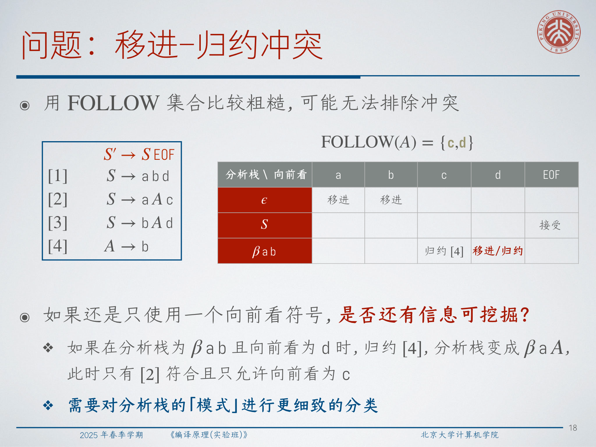

对于文法：

```text
S' -> S EOF
[1] S -> a b d
[2] S -> a A c
[3] S -> b A d
[4] A -> b
```

有：

$$
FOLLOW(A) = \{c,d\}
$$

当栈中已有 `a b` 且向前看 token 是 `d` 时，`FOLLOW(A)` 允许把 `b` 归约为 `A`；但对于产生式 `[1]`，此时移进 `d` 也是正确路径。这就是由上下文过粗导致的移进-归约冲突。

:::warn ⚠️ 问题：为什么这里 FOLLOW 过于粗糙？
问题是：**如果向前看 token 属于 FOLLOW(A)，为什么归约 A -> b 仍然不安全？** FOLLOW 只说明在某些位置，某个完整的 `A` 后面可以出现 `d`。它并没有说明当前栈前缀就是那些位置之一。栈前缀 `a b` 可能正在走向 `S -> a b d`，这时 `b` 不应该被归约为 `A`。
:::

## 3. 从栈模式到 LR 项自动机

解决办法是更精细地刻画栈模式。LR 分析用“项”表示对产生式的局部分析进度。点号表示右部已经识别了多少：

```text
S' -> . S EOF
S  -> [ . S ] S
S  -> [ S . ] S
S  -> [ S ] . S
S  -> [ S ] S .
```

一个项可以理解成一个小的分析状态。点号左侧的内容已经在栈上匹配完成；点号右侧的内容仍然期待被看到。如果点号后面是终结符，那么读取该终结符就是移进转移。如果点号后面是非终结符 `X`，分析器可以通过 epsilon 转移进入 `X` 的各条产生式，因为 `X` 可以从这里开始而不消耗输入。

这就得到一个由 LR 项组成的 NFA。非确定有限自动机可写作：

$$
N = (S, \Sigma, \delta, s_0, F)
$$

其中：

$$
\delta : S \times (\Sigma \cup \{\epsilon\}) \to 2^S
$$

只要存在一条路径能到达接受状态，NFA 就接受输入。任意 NFA 都可以转换为识别同一语言的 DFA：

$$
L(N) = L(D)
$$

转换方法是子集构造。DFA 的一个状态是 NFA 可能状态的集合。关键操作是 epsilon 闭包，它反复加入所有可以通过 epsilon 转移到达的状态，直到达到不动点：

$$
T = T' \cup \bigcup_{s \in T'} \delta_N(s, \epsilon)
$$

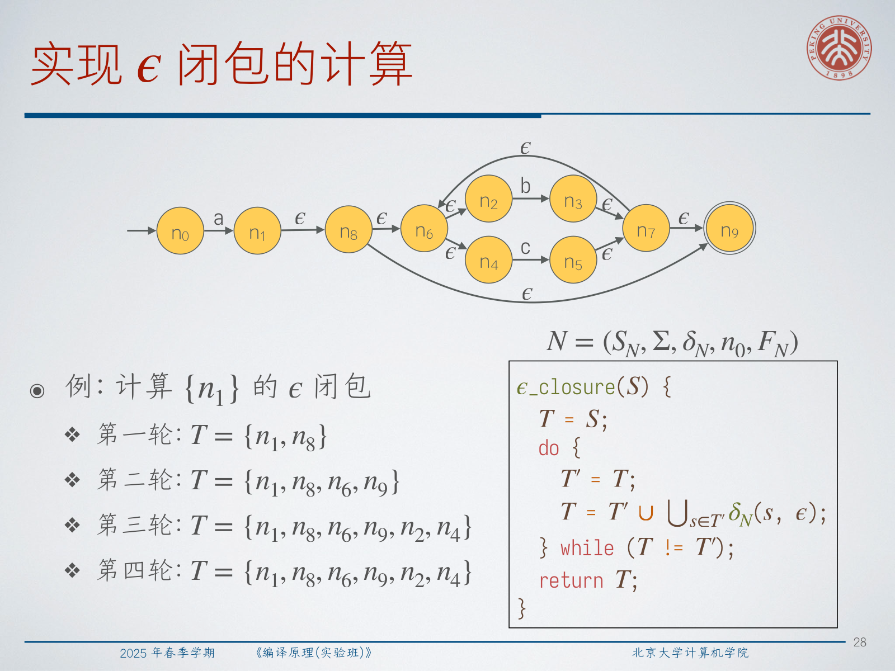

对于 LR 分析，子集构造会把项 NFA 转成项集 DFA。之后就可以从这个 DFA 得到分析表：

- 终结符 `c` 上的转移表示在 token `c` 上移进；
- 非终结符 `A` 上的转移成为 `GOTO` 项；
- 完成项 `A -> alpha .` 可能产生归约；
- 完成的开始项 `S' -> S . ; EOF` 产生接受动作。

项自动机是把文法理论连接到可执行移进-归约分析器的核心桥梁。

## 4. LR(1)、SLR 与 LALR

SLR 使用 LR(0) 项状态，再用 FOLLOW 集限制归约。LR(1) 则把一个 token 的“再向前看”信息直接存在项中：

$$
\langle A \to \alpha \cdot \gamma ; c \rangle
$$

这里一个很有用的表述是：LR(1) 项是 **partial analysis state + "re-lookahead"**。这个向前看不只是移进时用的下一个 token；它记录的是当该项对应的非终结符完成并被归约之后，什么 token 可以跟在后面。

当一个 LR(1) 项期待非终结符 `X` 时，需要把向前看信息穿过 `X` 后面的后缀传播过去。对于状态：

$$
\langle A \to \alpha \cdot X\gamma' ; c \rangle
$$

以及产生式 `X -> delta`，epsilon 转移会加入：

$$
\langle X \to \cdot \delta ; d \rangle,
\quad d \in FIRST(\gamma' c)
$$

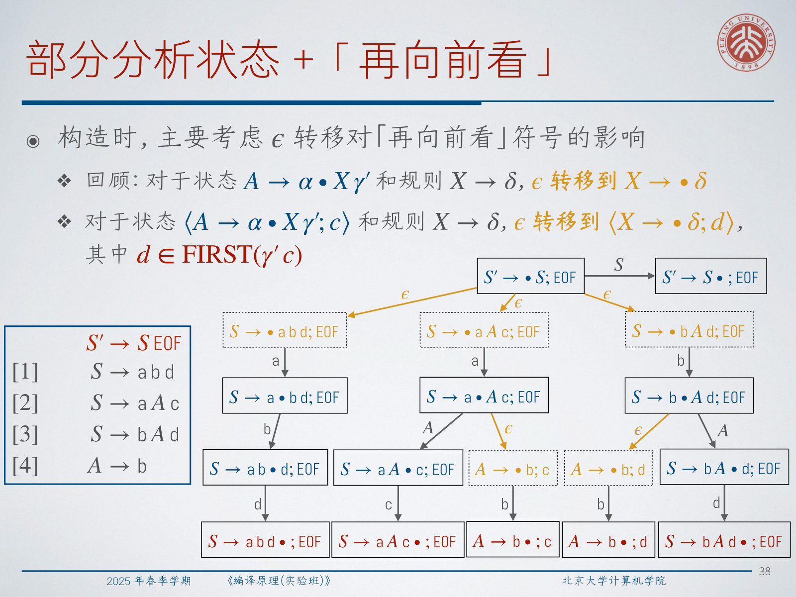

这正是 FOLLOW 缺少的额外信息。在前面的冲突中，`A -> b . ; c` 和 `A -> b . ; d` 是不同的项。到达 `a b` 且向前看为 `d` 的那个栈上下文，应该为 `S -> a b d` 移进，而不应该归约 `A -> b`。

**LR grammar** 指的是能被无冲突移进-归约预测分析识别的上下文无关文法。名字中的两部分含义是：

- `L`：从左到右扫描输入。
- `R`：构造最右推导，不过是逆向构造。

LR(k) 表示部分分析状态可以记录 `k` 个再向前看 token。对于同样的 `k`，LR(k) 通常比 LL(k) 在文法识别上更强，因为 LR 可以先看到一个完整的候选句柄，再决定如何归约；而 LL 必须在分析产生式体之前就选择产生式。

常见 LR 家族变体包括：

- LR(0)：项中没有再向前看，写作 `A -> alpha . gamma`。
- SLR(1)：使用 LR(0) 自动机，但只在 `FOLLOW(A)` 中的 token 上归约。
- LR(1)：每个项携带一个再向前看 token。
- LALR(1)：使用 LR(1) 风格的向前看，但合并 LR(0) 核相同的状态，使自动机大小接近 LR(0)。

LALR 常用是因为它比规范 LR(1) 小很多；但合并状态也可能丢失区分，甚至引入原本分开的归约-归约冲突。

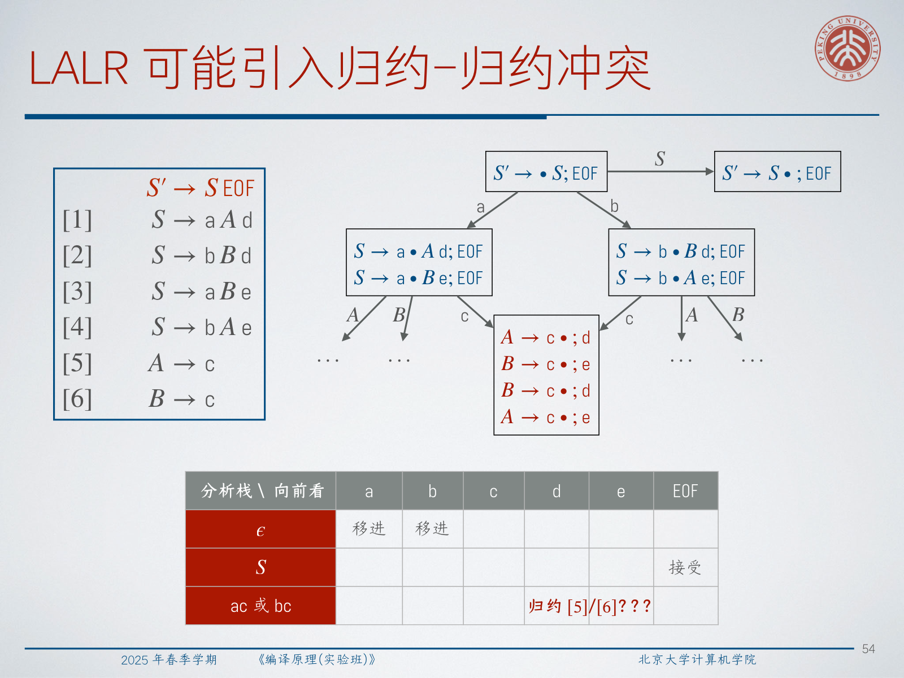

:::warn ⚠️ 问题：为什么 LALR 可能引入归约-归约冲突？
问题是：**为什么合并 LR(1) 状态有时会制造原本不存在的冲突？** 两个状态可能有相同的 LR(0) 核，但向前看集合不同。合并之后，归约项共享这些向前看集合的并集。如果两个完成项现在都要在同一个 token 上归约，分析器就无法唯一选择规则。
:::

还有一个容易混淆的点：普通向前看和再向前看不同。移进时，LR 分析器仍然用当前下一个 token 索引动作表；归约时，LR(k) 才把接下来的 `k` 个 token 与项中记录的再向前看比较。某个文法可能不是 LR(1)，但它描述的语言可以改写出另一个 LR(1) 文法。事实上，LR(k) 的语言识别能力不超过 LR(1)：如果某个语言有 LR(k) 文法，那么它也存在 LR(1) 文法。

## 5. Parser Generation 与表驱动分析器

Parser generation 把从文法描述到分析器实现的过程自动化。文法一侧可以是 LL 或 LR；实现一侧可以是递归下降、移进-归约代码，也可以是表驱动的通用驱动程序。

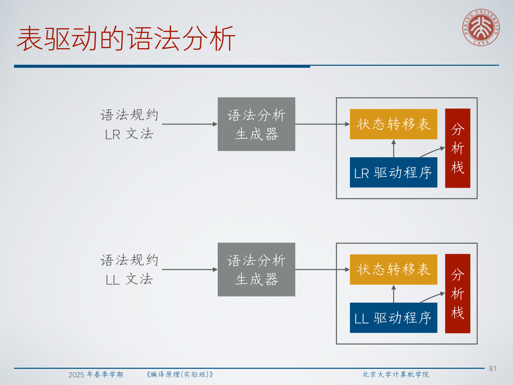

对于 LR 分析，生成器会构造项自动机，并输出两类表：

- `ACTION[state][token]`：移进、归约、接受或错误。
- `GOTO[state][nonterminal]`：归约后压入非终结符时进入的下一状态。

LR 驱动程序维护一个状态栈，初始时只包含 `I0`。

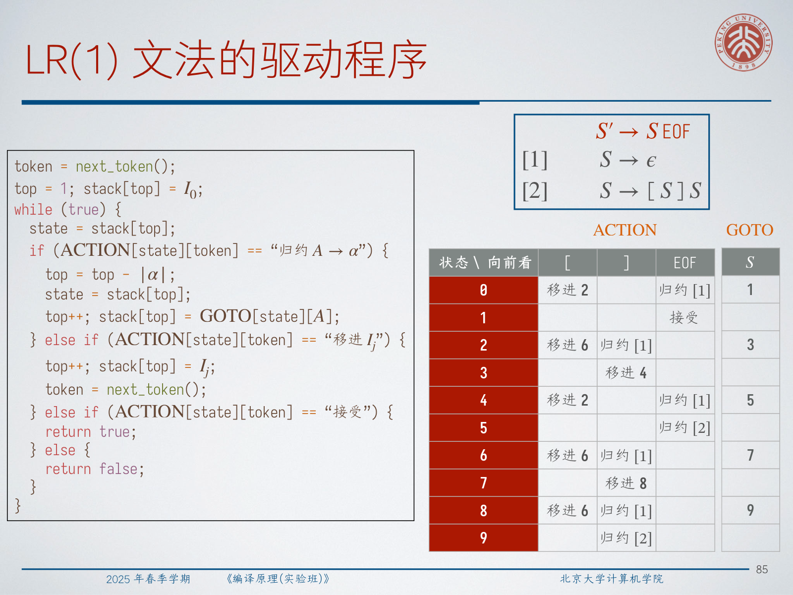

驱动循环如下：

1. 令 `state` 为栈顶状态，`token` 为当前输入 token。
2. 如果 `ACTION[state][token]` 是 `shift Ij`，压入 `Ij` 并读取下一个 token。
3. 如果它是 `reduce A -> alpha`，弹出 `|alpha|` 个状态，查看新的栈顶状态，再压入 `GOTO[top][A]`。
4. 如果它是接受，分析成功。
5. 否则报告语法错误。

LR 表构造直接来自 DFA：

- 终结符转移给出移进动作；
- 完成项 `⟨A -> alpha . ; c⟩` 给出在 `c` 上归约 `A -> alpha`；
- `⟨S' -> S . ; EOF⟩` 给出接受动作；
- 非终结符转移给出 GOTO 项。

对于 LL(1)，分析表由栈顶符号和向前看 token 共同索引。如果栈顶是终结符，唯一成功动作就是匹配相同 token。如果栈顶是非终结符 `A`，则对产生式 `A -> alpha`，在 `FIRST(alpha)` 中的 token 下填写展开动作；如果 `epsilon` 属于 `FIRST(alpha)`，还要在 `FOLLOW(A)` 中的 token 下填写同一展开动作。

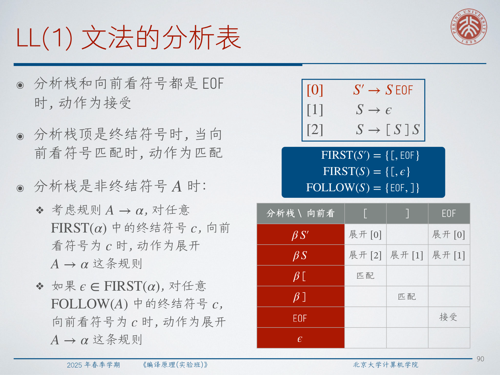

LL 驱动程序也维护栈，但栈里保存的是文法符号。当栈顶和输入 token 都是 EOF 时接受；终结符直接匹配；非终结符则按照表中选择的产生式展开，并把右部逆序压栈。

## 6. GLR 与增量式语法分析

Generalized LR 是 LR 分析的广义版本。当出现移进-归约或归约-归约冲突时，GLR 不立即强行选择某一支，而是并行探索所有可能动作，并在后续发现某条路径不可行时丢弃它。

对于二义文法：

```text
S' -> E EOF
[1] E -> E + E
[2] E -> a
```

字符串 `a + a + a` 有多棵语法树。GLR 会保留多条分析路径。为了避免复制大量栈，它用图结构栈，也就是分析栈 DAG，共享相同的栈后缀。

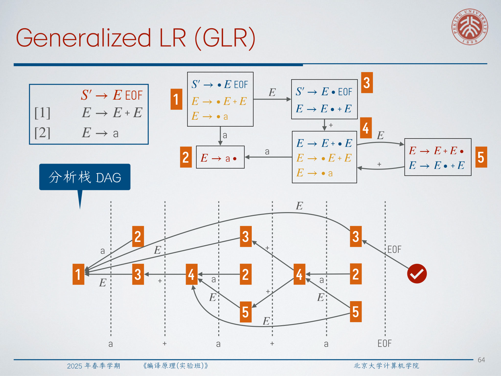

:::tip 💡 问题：GLR 中哪些状态可以认为等价？
问题是：**Which states are equivalent?** 在一次 GLR 分析中，不同分支经常共享相同的栈后缀和当前自动机状态。这些共享后缀可以在 DAG 中只表示一次。正是这种共享，避免了广度优先探索变成简单的整栈复制爆炸。
:::

增量式语法分析解决的是另一个问题：交互式编辑。在 IDE 中，即使完整语法分析是线性的，每输入一个字符就重新分析整个文件或项目也很浪费。增量分析器会保存语法树，并尝试复用未改变的子树。

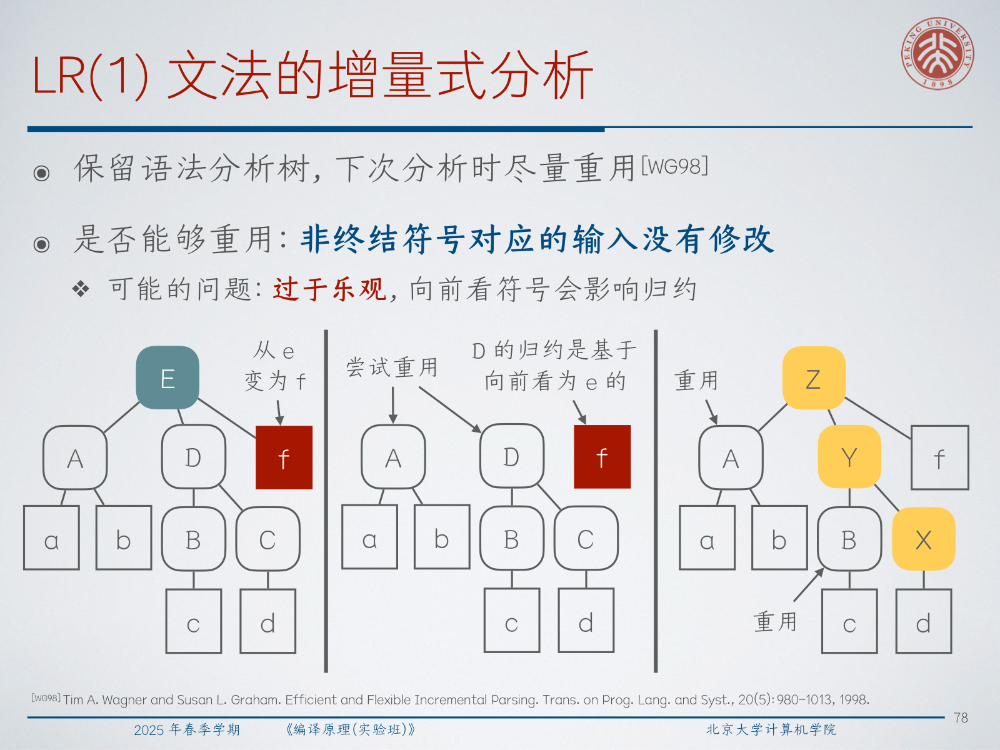

一个诱人的规则是：如果某个非终结符覆盖的源码区间没有变化，就复用那棵子树。但 LR 分析使这个规则变得微妙，因为一次归约是否有效可能依赖子树之后的向前看 token。如果复用子树后面的文本从某个向前看 token 变成了另一个，旧归约可能就不再合法。

:::remark 📝 问题：IDE 是否应该每输入一个字符都重新分析？
问题是：**should an IDE re-parse after every character?** IDE 应该在编辑后更新语法结构，但不应该丢弃所有已有工作。增量式语法分析只重新分析被编辑区域，以及那些决策可能受编辑影响的上下文。tree-sitter 这类工具正是围绕生成增量式分析器来设计的。
:::

## 7. 为什么自顶向下分析仍然重要，以及 LL(*)

既然 LR 家族这么强，为什么不总是用它？这里有几个实际工程原因。

第一，GLR 可以通过保留多个选择来接受二义文法，但接受二义性并不等于诊断二义性。第二，PEG 使用有序选择绕过二义性，但有序选择可能违背直觉。例如：

```text
A <- a / ab
```

对于以 `a` 开头的输入，第二个候选永远不会被选择，尽管 `ab` 看起来像更具体的情况。第三，自底向上分析器很难手写和调试。它的内部过程围绕栈模式和自动机状态，而不是程序员在文法中自然看到的递归结构。自动生成的分析器如果不仔细定制，也常常给出较差的错误信息。

:::tip 💡 问题：为什么仍然使用自顶向下分析？
问题是：**Why top-down?** 自顶向下分析贴合文法的递归结构，适合手写递归下降，也让程序员能直接控制错误诊断。只要文法设计得足够友好，它经常是最好的工程选择。
:::

LL(*) 把预测式思想扩展到固定 `k` 之外。问题例子是：分析器必须扫描一个无界模式后，才能在候选产生式之间做选择：

```text
S' -> S EOF
[1] S -> A
[2] S -> B
[3] A -> c A a
[4] A -> c a
[5] B -> c B b
[6] B -> c b
```

任意固定向前看长度都无法判断最后的符号会属于全 `a` 风格还是全 `b` 风格。LL(*) 尝试构造一个 DFA 来识别预测所需的向前看语言。一般情况下，判断这样的正则向前看描述是否存在是不可判定的，所以工具会采用近似。

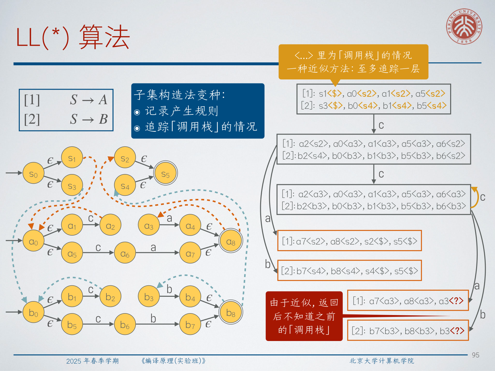

ANTLR 风格的 LL(*) 构造会记录 NFA 路径属于哪条产生式，并近似追踪调用栈上下文。这个近似可能只追踪有限层调用；返回之后可能丢失更早的调用栈信息。如果构造失败，生成器可以退回到 LL(k) 或受控回溯。

## 8. Parser Combinators 与 Pratt Parsing

Parser combinators 位于完全手写分析器和完全自动生成之间。核心思想是写小的 parser，再用高阶构造把它们组合起来。

函数式地看，一个 parser 读取输入字符串，返回一个分析结果和剩余输入，或者报告失败。用面向对象形式可以写成：

```cpp
template <typename A>
struct Parser {
  virtual pair<A, string_view> parse(string_view input) = 0;
};
```

基本组合子包括：

- `parser and_then parser ==> parser`：先运行第一个 parser，再在剩余输入上运行第二个 parser，返回两个结果的组合。
- `parser or_else parser ==> parser`：先尝试第一个 parser；如果失败，就在原输入上尝试第二个 parser。
- `parser map(transformer) ==> parser`：运行 parser，并把成功结果经过转换函数处理。

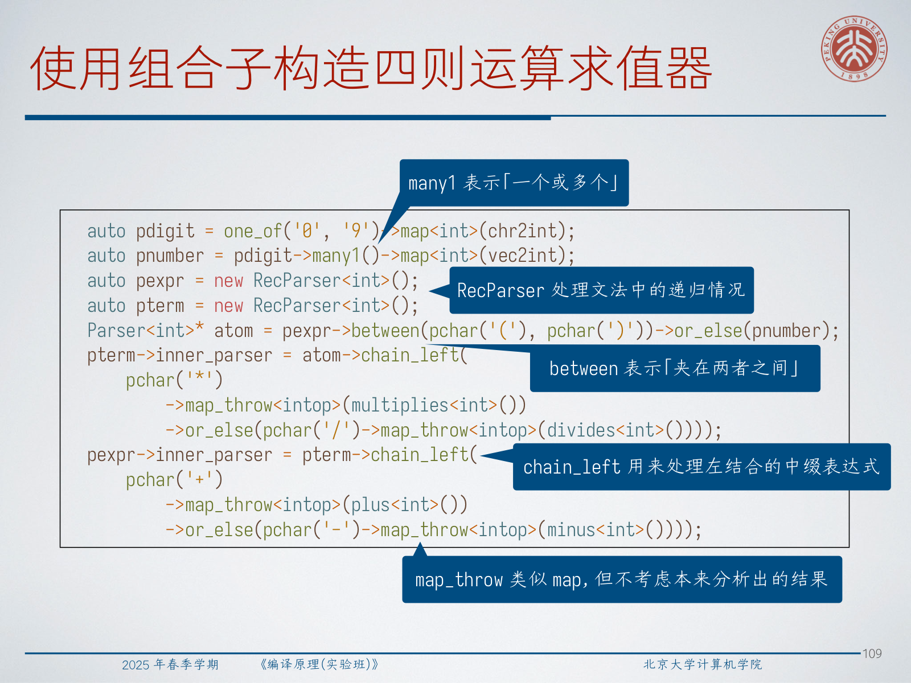

在这些基础上，可以构造常见语法模式：`one_of`、`many`、`many1`、`between`、`throw_left`、`throw_right`、递归 parser，以及左结合链。算术表达式分析器可以用 `chain_left` 在 term 层处理 `*` 和 `/`，再在 expr 层处理 `+` 和 `-`。

Pratt Parsing 消除了大量围绕运算符优先级和结合性的样板代码。它的核心思想是 **Binding Power**：给每个运算符一对数值 `(lp, rp)`。对于夹在两个相邻运算符之间的操作数，如果左侧运算符的 `rp` 大于右侧运算符的 `lp`，该操作数向左结合；否则向右结合。

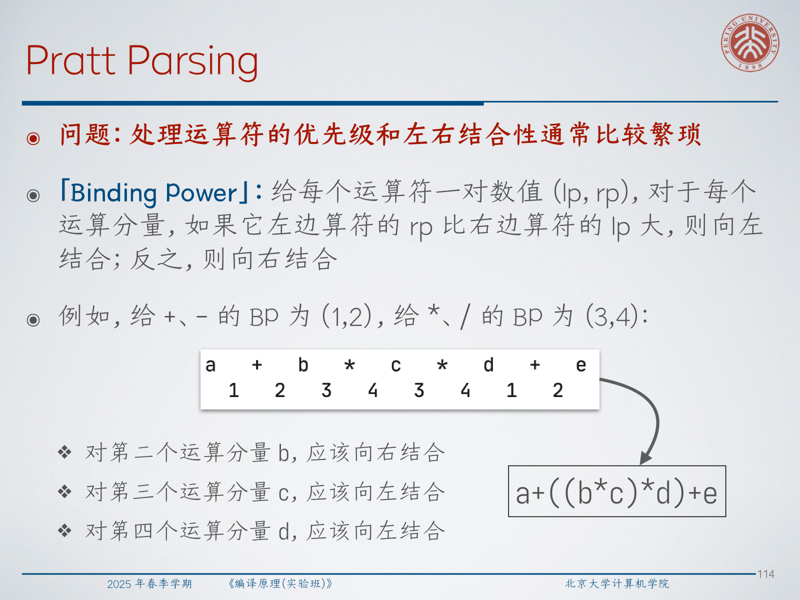

对于本讲例子：

$$
\text{operators } +,- \text{ have } (lp,rp)=(1,2)
$$

$$
\text{operators } *,/ \text{ have } (lp,rp)=(3,4)
$$

表达式：

$$
a + b * c * d + e
$$

会分组为：

$$
a + ((b*c)*d) + e
$$

Pratt 风格的 `chain` 组合子会先分析一个操作数，然后不断尝试分析运算符。如果运算符的左 binding power 小于当前最小值，当前分析停止；否则用该运算符的右 binding power 作为新的最小值，递归分析右操作数。

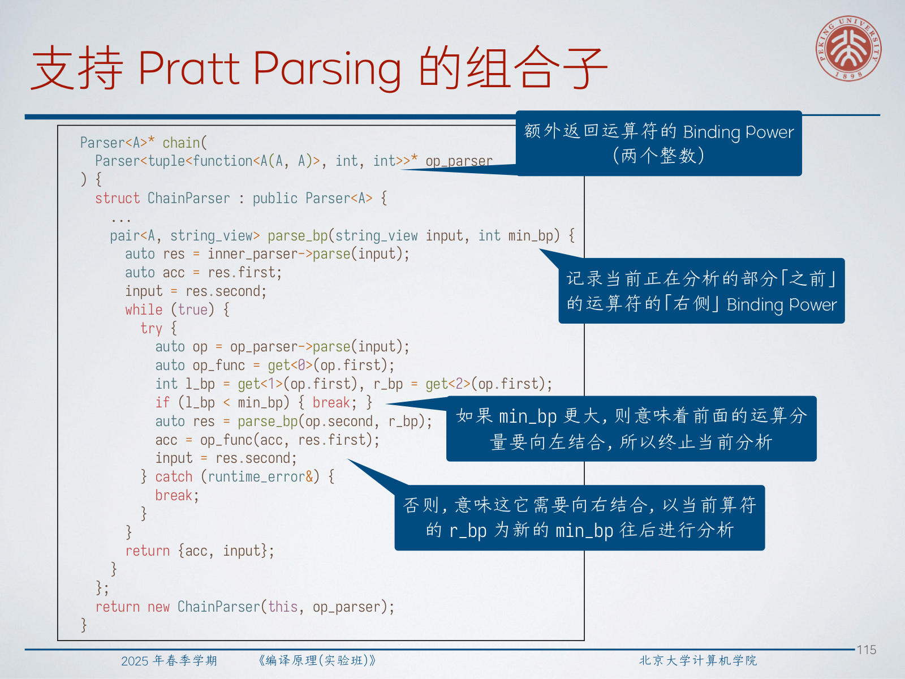

:::tip 💡 问题：Pratt Parsing 如何处理优先级和结合性？
问题是：**处理运算符优先级和左右结合性通常比较繁琐；Pratt Parsing 改变了什么？** 它不再为每个优先级层级硬编码一层文法，而是把优先级和结合性信息放进运算符携带的 binding-power 数值中。新增运算符通常只需要新增一个带 `(lp, rp)` 的 parser 项。
:::

## 9. Exam Review

### 关键定义

- **自底向上分析**：通过移进输入 token，并把栈顶句柄归约回非终结符来完成语法分析。
- **移进-归约分析**：一种自底向上方法，核心动作是移进和归约。
- **LR grammar**：**a context-free grammar recognized by conflict-free shift-reduce predictive parsing**。
- **LR 项**：带点号的产生式，点号标记右部已经识别到哪里。
- **LR(1) 项**：LR 项加一个再向前看 token，写作 `⟨A -> alpha . gamma ; c⟩`。
- **SLR(1)**：LR(0) 自动机加 FOLLOW 过滤的归约。
- **LALR(1)**：在相同 LR(0) 核上合并 LR(1) 风格的向前看。
- **GLR**：广义 LR，在多个移进/归约选择之间并行探索。
- **LL(*)**：不使用固定 `k`，而用 DFA 式向前看识别进行预测的自顶向下分析。
- **Parser combinator**：用于构造 parser 的高阶函数，如顺序、选择、重复和映射。
- **Pratt Parsing**：由运算符 binding-power 数值对驱动的表达式分析方法。

### 必须会解释的机制

1. 移进和归约如何逆向重构最右推导。
2. 为什么基于 FOLLOW 的归约有时过于粗糙。
3. LR 项如何形成 NFA，以及子集构造如何得到项集 DFA。
4. LR(1) 如何用 `FIRST(gamma' c)` 传播向前看。
5. 为什么在文法识别上 LR(1) 强于 LL(1)。
6. LR 驱动程序如何使用 `ACTION` 和 `GOTO`。
7. 为什么 LALR 比 LR(1) 小，但可能引入归约-归约冲突。
8. GLR 如何用图结构栈共享分支。
9. 为什么增量式分析必须考虑未改变子树之后的上下文。
10. Parser combinators 与 Pratt Parsing 如何支持手写分析器。

### 简答模板

- **解释移进-归约冲突**：指出栈模式、向前看 token、移进路径和归约路径，再说明缺失了什么上下文。
- **解释 LR(1) 向前看传播**：从 `⟨A -> alpha . X gamma' ; c⟩` 出发，为 `X -> delta` 加项，并用 `FIRST(gamma' c)` 计算新的向前看。
- **比较 LR 与 LL**：LL 在分析产生式体之前预测；LR 先看到完整句柄再归约，因此拥有更多上下文。
- **解释 LALR 风险**：合并相同 LR(0) 核会把向前看集合取并集，并集可能产生新的归约-归约冲突。
- **解释 Pratt Parsing**：每个运算符提供 `(lp, rp)`；分析器根据下一个运算符能否比当前最小 binding power 结合得更紧来决定停止或递归。

### 常见误区

- 把 FOLLOW 当成它知道当前栈前缀。FOLLOW 只描述全局上可能跟随的 token。
- 混淆移进时看的 token 和 LR 项中存储的再向前看。
- 认为 LALR 只是无损的 LR(1)。它更小是因为合并状态，而合并可能丢失区分。
- 认为 GLR 消除了二义性。GLR 保留候选，二义性仍需要语义规则或文法设计来处理。
- 在增量式分析中，只因为某棵子树覆盖的文本没变就无条件复用，而不检查后续上下文是否变化。
- 对每个优先级层级都手工编码一层文法，而忽略 Pratt parser 可能更简单也更容易扩展。

### 自检问题

- 你能从 `⟨A -> alpha . X gamma' ; c⟩` 构造 LR(1) epsilon 转移吗？
- 你能指出 `FOLLOW(A) = {c,d}` 例子中冲突的精确原因吗？
- 你能解释为什么在给定 binding power 下，`a + b * c * d + e` 会分组为 `a + ((b*c)*d) + e` 吗？
- 你能不看表格说清 `ACTION` 和 `GOTO` 分别保存什么吗？
- 你能给出一个真实编译器仍然重视自顶向下递归下降的原因吗？
