# Lecture 1: Introduction to Computer Vision (Overview)

## 1. Learning Goals and Course Logistics

This opening lecture sets the global map of the course: what vision is, what computer vision covers, and how the field connects perception, intelligence, and action.

By the end of this lecture, you should be able to:

- Explain the difference between sensation, perception, cognition, and visuomotor control.
- Describe low-level, mid-level, and high-level vision tasks with concrete examples.
- Explain why computer vision includes not only understanding, but also generation and embodied decision support.
- Place computer vision in a broader interdisciplinary context.

The practical course logistics are:

- 4 assignments (40% total), 1 midterm (30%), 1 final (30%), plus participation bonus.
- Core prerequisites: calculus, linear algebra, probability/statistics, and Python.
- Recommended references include both classic CV and deep learning resources.

## 2. What Is Vision in Humans?

Human vision is a complete perception-action system, not just image capture.

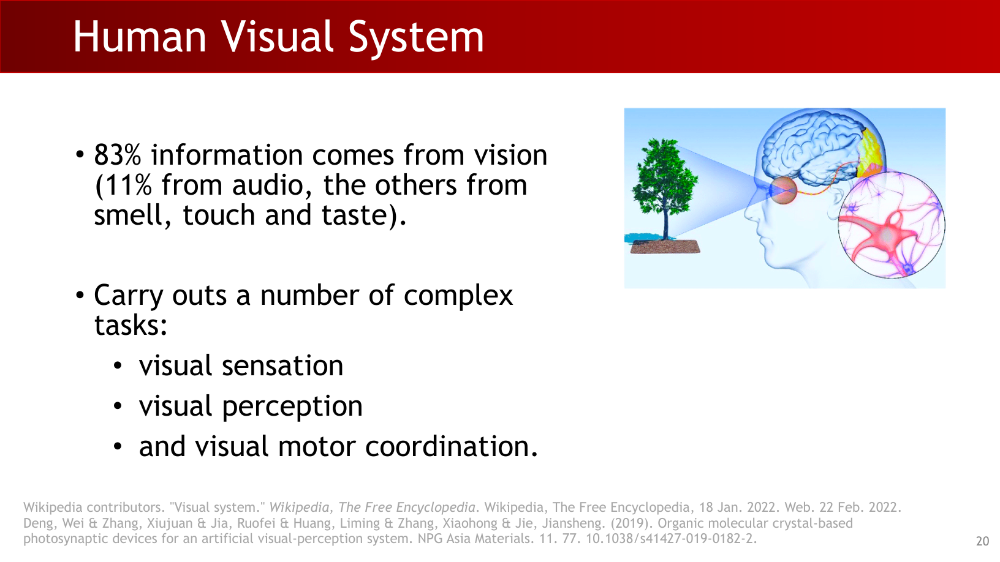

### 2.1 Visual Sensation: Turning Light into Signals

Visual sensation starts from sensing light and forming neural signals. Binocular eyes also enable stereopsis (depth from disparity).

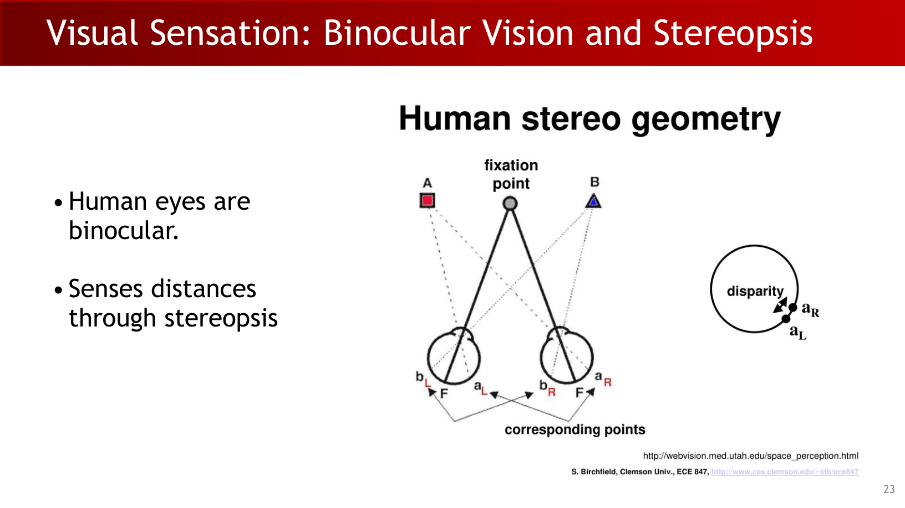

:::remark 📝 Question and answer: "Vision = eyes = camera?"
**Question:** **"Vision = eyes = camera?"**

**Answer:** No. A camera captures images, but biological vision further infers objects, events, intentions, and supports action. Sensors are only the entry point.
:::

### 2.2 Visual Perception and Cognition

A key definition from the lecture is:

**"the process of acquiring knowledge about environmental objects and events by extracting information from the light they emit or reflect."**

So perception is knowledge acquisition, not passive recording.

The lecture also uses visual cognition examples (e.g., false-belief reasoning in the Sally-Anne task) to show that vision interacts with theory-of-mind and reasoning.

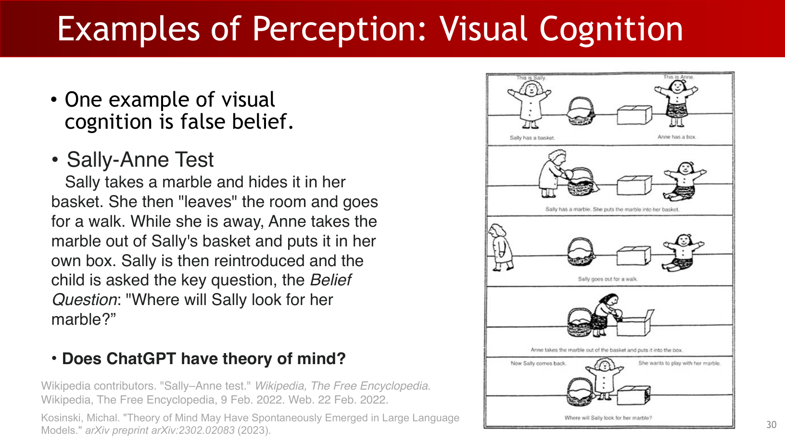

### 2.3 Vision, Language, and Action

Human intelligence links vision with:

- Language grounding (talking about what we see).
- Eye-hand coordination and closed-loop control.
- Continuous hypothesis-test cycles in a perception-action loop.

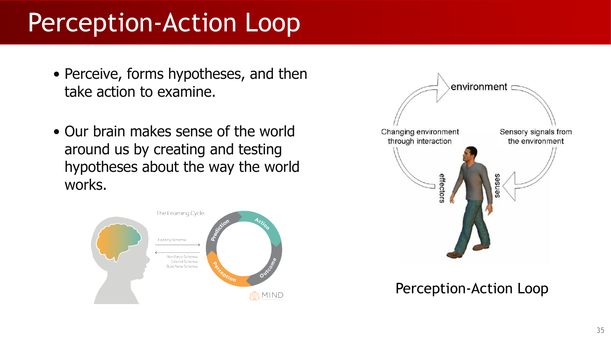

:::tip 💡 Question and answer: is vision only perception?
**Question:** Is vision only for recognizing scenes?

**Answer:** No. Vision also provides feedback for motion control and decision-making. In intelligent agents, perception and action are tightly coupled.
:::

## 3. What Is Computer Vision?

A core slide statement is:

**"Computer vision deals with acquiring, processing and analyzing, understanding, generating or imagining visual data."**

This is the backbone of the course: from sensing to understanding, and from understanding to creation.

## 4. Visual Data and Sensor Modalities

Computer vision is not limited to a single RGB image.

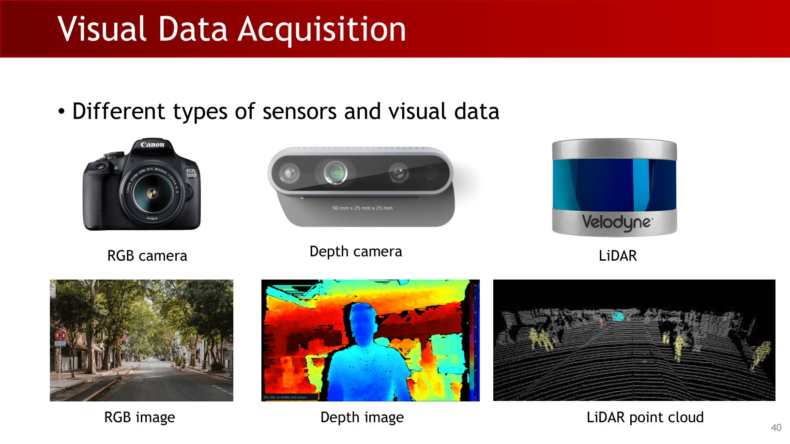

The lecture organizes data sources into:

- RGB images and RGB videos.
- Depth images and RGB-D streams.
- LiDAR point clouds.
- Beyond single-view: panoramic, stereo, and multiview data.
- True 3D visual representations.

## 5. Low-Level Vision: Processing and Feature Extraction

Low-level vision focuses on measurable local signals:

- Image processing: denoising, deblurring, enhancement.
- Feature extraction: edges, corners, optical flow/correspondence.

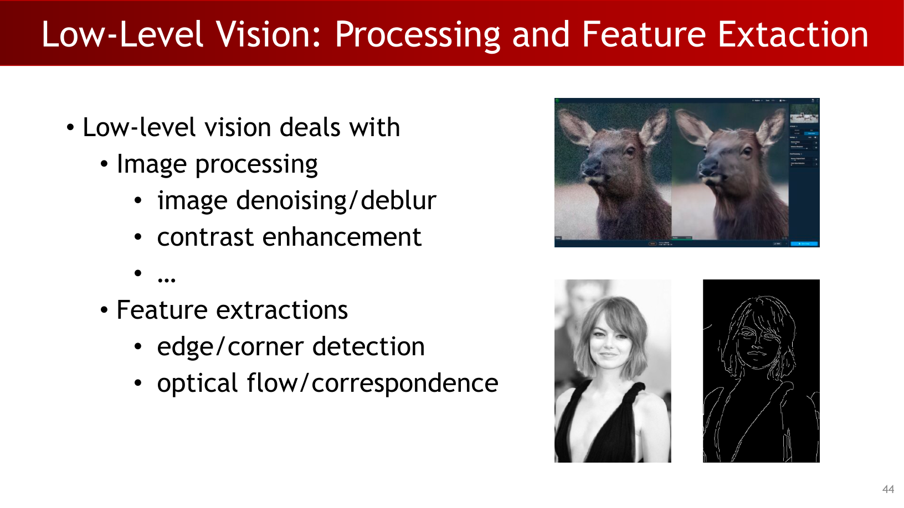

Typical applications shown in class include motion deblurring and de-raining.

## 6. Mid-Level Vision: Structure and 3D Reasoning

Mid-level vision starts making structural inferences from low-level evidence.

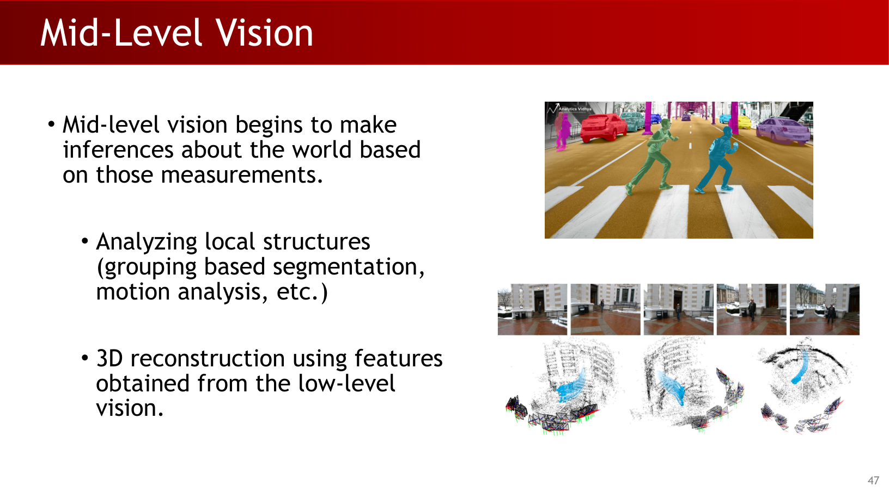

Representative tasks and applications:

- Grouping/segmentation and motion analysis.
- Panoramic stitching.
- 3D object scanning and landmark reconstruction.
- SLAM for mapping and localization.
- Neural 3D/4D reconstruction (NeRF, 4DGS).

A formula-like definition explicitly given in the lecture:

$$
\text{SLAM} = \text{Simultaneous Localization And Mapping}
$$

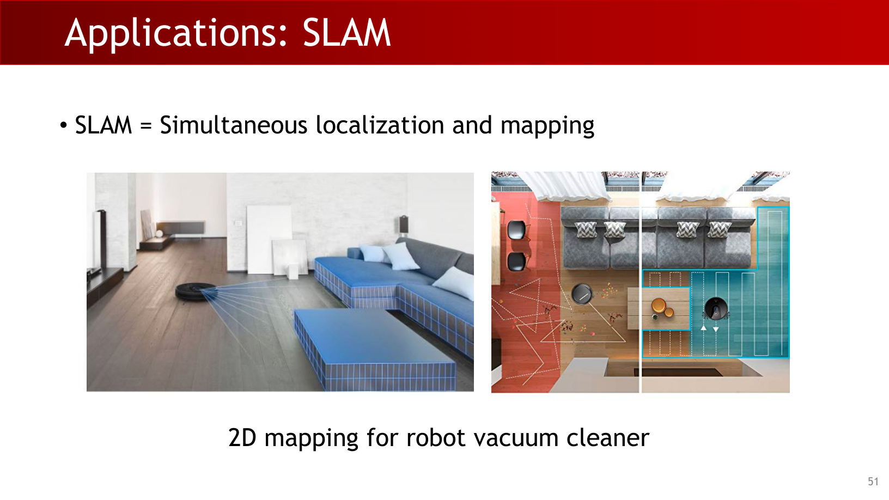

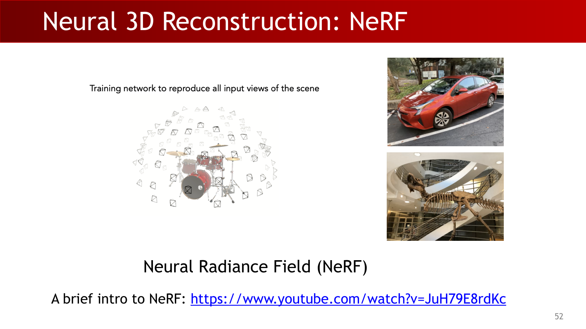

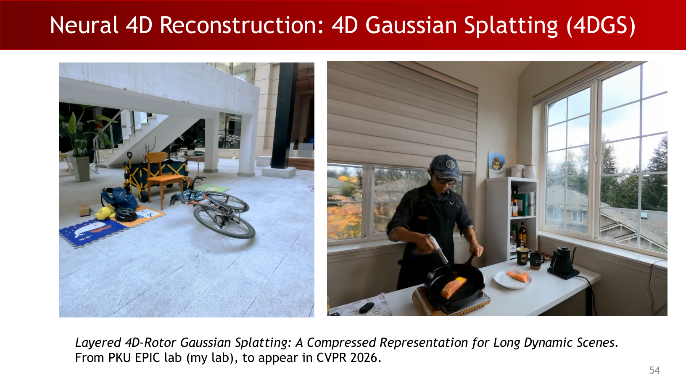

## 7. High-Level Vision: Semantic Understanding

A key statement is:

**"High-level vision analyzes the structure of the external world that produced those images and generates semantic representation/interpretations."**

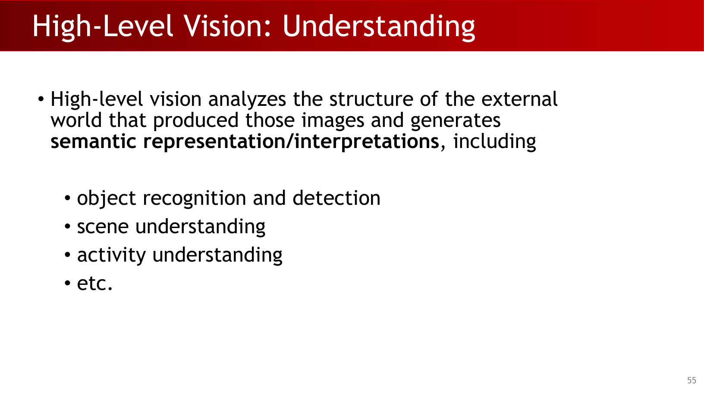

This includes:

- Object recognition and detection.
- Scene understanding.
- Activity understanding.

Applications shown: facial recognition, scene understanding, AR, and cashier-free stores.

## 8. Vision, Graphics, and Generation

The lecture emphasizes the relation between graphics and vision:

$$
\text{Graphics: } \mathcal{P} \rightarrow \mathcal{I}
$$

$$
\text{Vision: } \mathcal{I} \rightarrow \mathcal{P}
$$

where $\mathcal{P}$ is parameter/world space and $\mathcal{I}$ is image space.

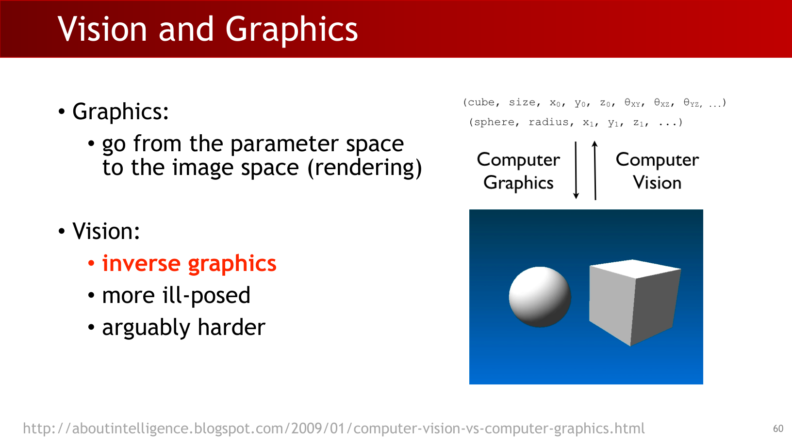

The object parameterization examples in slide notation are:

$$
\text{cube}(\text{size}, x_0, y_0, z_0, \theta_{xy}, \theta_{xz}, \theta_{yz}, \ldots)
$$

$$
\text{sphere}(\text{radius}, x_1, y_1, z_1, \ldots)
$$

:::remark 📝 Question and answer: why is vision often harder than graphics?
**Question:** Why is computer vision often described as "inverse graphics" and more ill-posed?

**Answer:** Rendering maps known scene parameters to an image. Vision tries to infer hidden scene parameters from incomplete/noisy images, where multiple world explanations can match the same observation.
:::

The lecture further stresses that graphics helps vision: synthetic data can provide rich labels at scale.

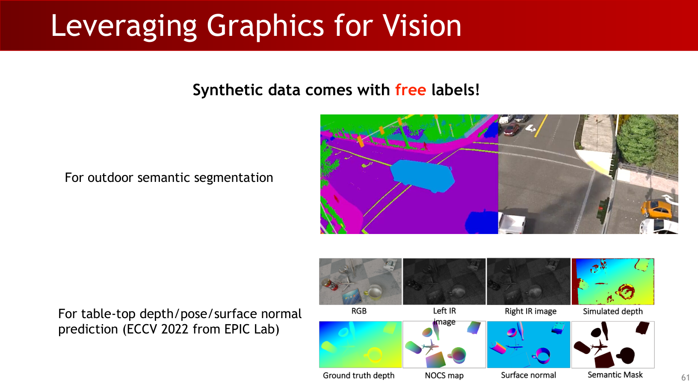

It also extends CV to generation tasks:

- Face generation and reenactment.
- Style transfer.
- Text-to-image diffusion.
- Video generation.
- Vision-language modeling.

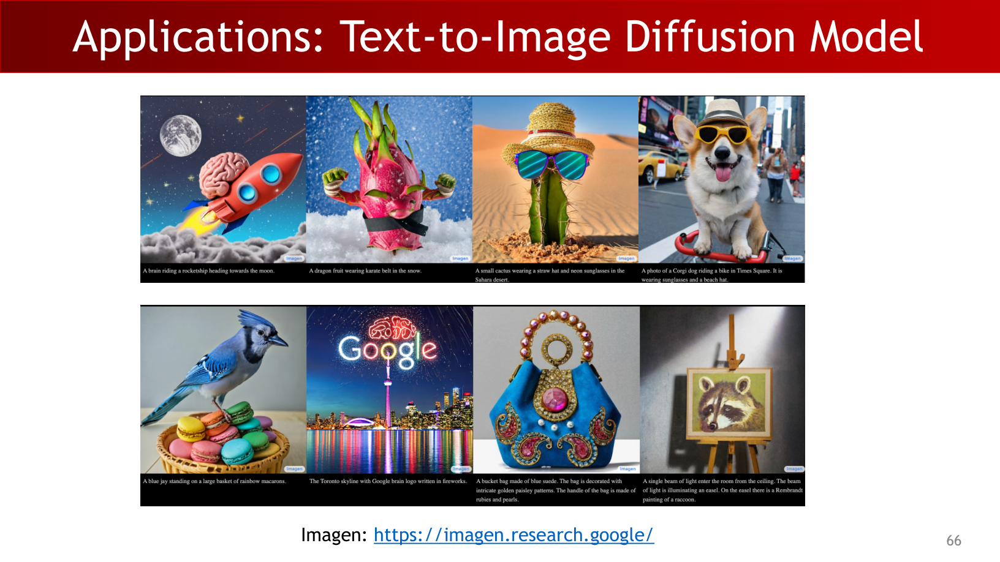

## 9. Embodied Vision and Interdisciplinary Scope

A late-lecture summary broadens the definition:

- CV handles acquiring, analyzing, understanding, and generating visual data.
- It also provides visual feedback for body motion and helps decision-making for embodied agents.

The Galbot case is shown as an embodied-vision example.

Finally, computer vision is presented as deeply interdisciplinary.

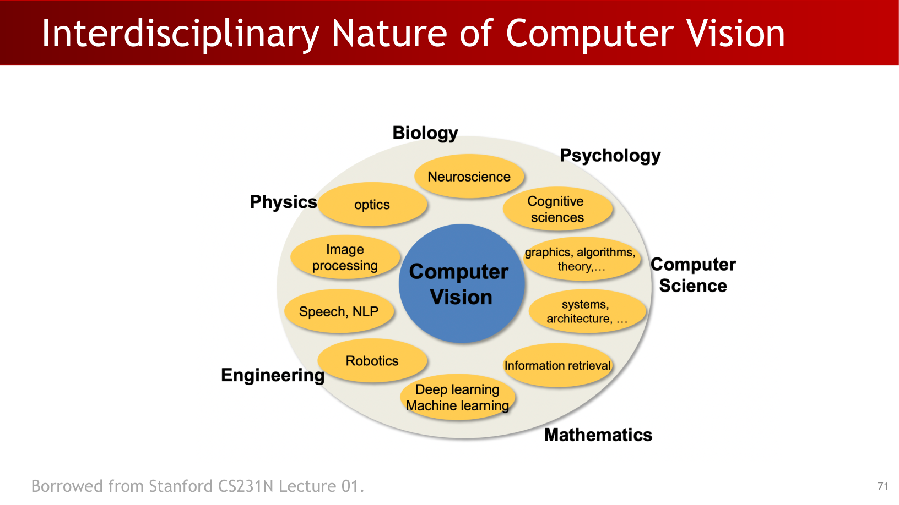

## Exam Review

### A. Must-know Definitions

- **Visual sensation:** transducing light into neural signals.
- **Visual perception:** **knowledge acquisition from light-derived information**.
- **Computer vision:** **acquiring -> processing/analyzing -> understanding -> generating visual data**.
- **SLAM:** simultaneous localization and mapping.
- **Inverse graphics:** inferring scene parameters from images.

### B. Mechanism Chain You Should Be Able to Explain

Light input -> sensation -> perception/cognition -> action feedback -> perception-action loop.

In machine vision:

Sensor data -> low-level processing/features -> mid-level structure/3D -> high-level semantics -> decision/action or generation.

### C. Short-Answer Templates

- **Q: Why is CV not just image classification?**
  A: Because it also includes geometric inference, temporal reasoning, generation, and embodied control feedback.
- **Q: Why is CV harder than graphics?**
  A: Graphics is forward mapping; CV is inverse mapping with ambiguity and noise.
- **Q: Why do we need multiple sensors/modalities?**
  A: Different modalities resolve different ambiguities (appearance, depth, geometry, motion).

### D. Common Misconceptions

- Treating vision as camera-only signal capture.
- Ignoring the perception-cognition-action loop.
- Thinking generation is outside CV.
- Ignoring embodiment and decision support.

### E. Self-Check List

- Can you explain sensation vs perception vs cognition in one minute?
- Can you map at least 3 tasks each for low/mid/high-level vision?
- Can you explain inverse graphics with one concrete example?
- Can you justify why multimodal data matters in real systems?
