# 第十讲：三维视觉 II - 三维表示、神经渲染与点网络

## 1. 多种三维表示

三维数据有很多表示方式。表示方式不是中性的选择：它会决定内存开销、渲染方式、可编辑性、学习架构，以及哪些几何操作容易或困难。

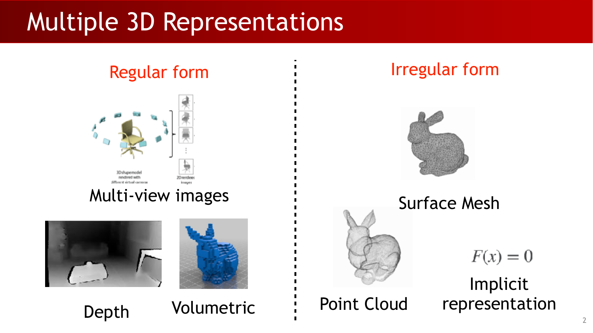

一个有用的划分是：

- 规则表示：多视角图像、深度图和体素网格。
- 非规则表示：网格、点云和隐式场。

三维表示也依赖来源和应用。形状可能来自真实世界采集、手工建模、程序化生成或学习；它可能用于渲染、编辑、简化、平滑、滤波、修复、动画或机器学习。

:::remark 关键问题与解答：为什么需要多种表示
**问题（原意复述）：** 为什么需要多种 3D representation，而不是一个通用格式？

**解答：** 不同任务重视不同操作。体素容易索引但开销大；网格编码表面和拓扑；点云轻量但缺少连接关系；隐式场提供连续表面；radiance field 和 Gaussian 更适合新视角合成。
:::

## 2. 深度、体素与双目深度传感

深度图是由深度值填充的单通道图像。它是 2.5D 表示，因为它只从一个视角为每个像素记录一个可见深度，而不是完整物体几何。

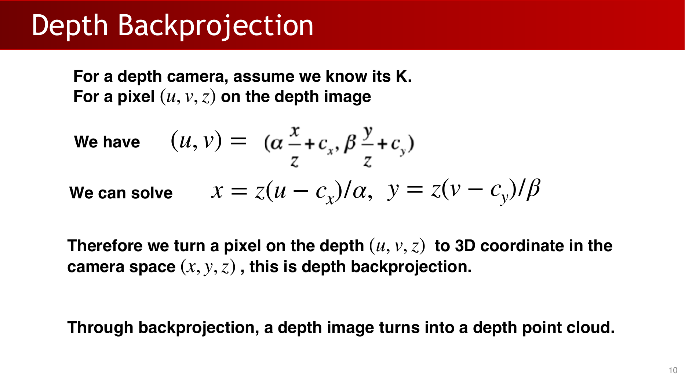

如果相机内参已知，深度像素 $(u,v,z)$ 可以反投影为相机坐标：

$$
x=\frac{z(u-c_x)}{\alpha},\qquad y=\frac{z(v-c_y)}{\beta}
$$

反投影会把深度图转换成深度点云。

体素用规则的 $H\times W\times D$ 网格存储：

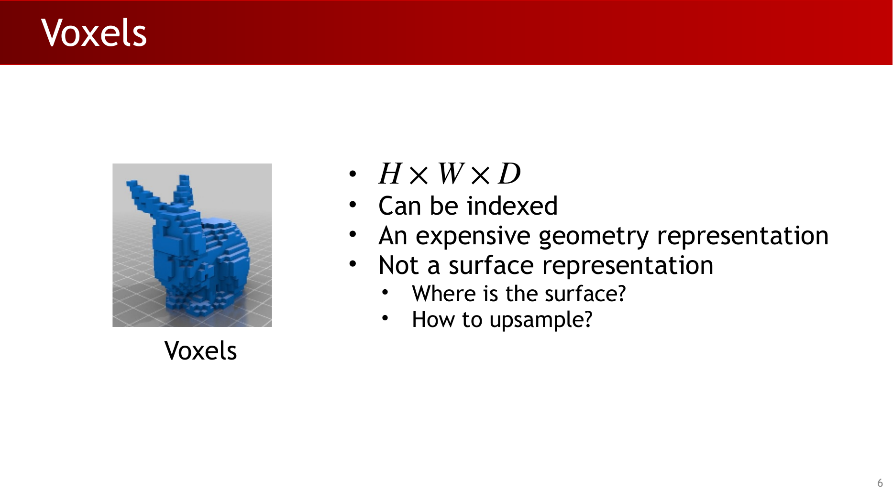

体素容易索引，也适合 3D convolution，但内存开销很大，并且天然不是表面表示。

:::remark 关键问题与解答：体素中的表面在哪里
**问题（原文）：** **"Where is the surface?"** 以及 **"How to upsample?"**

**解答：** 体素网格在格子中存储 occupancy 或数值，真实表面需要额外推断，例如提取 iso-surface。上采样也很困难，因为分辨率提高会导致内存和计算量按三次方增长。
:::

双目传感器先估计 correspondence，再计算 disparity，并把 disparity 转成深度：

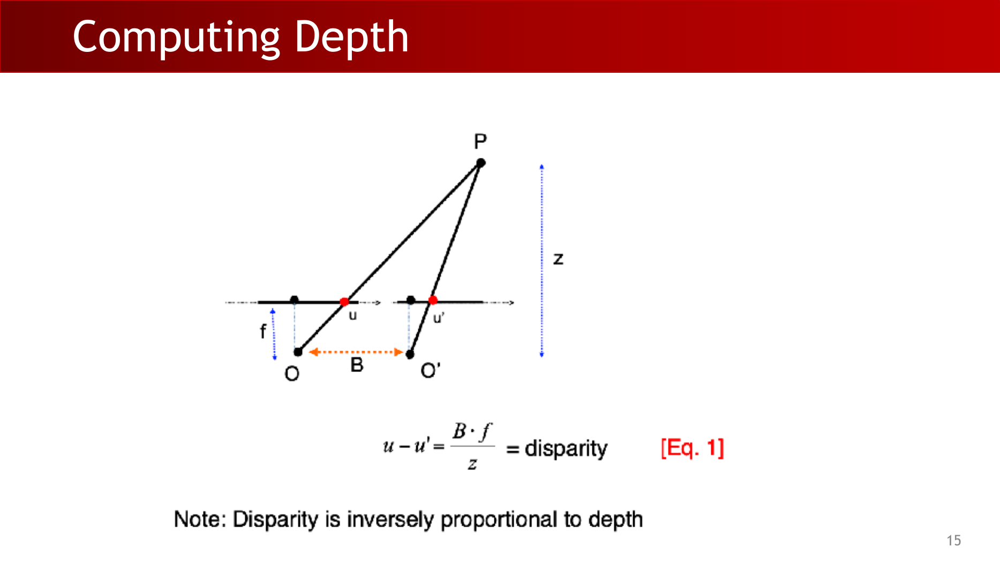

$$
u-u'=\frac{Bf}{z}=\mathrm{disparity}
$$

视差与深度成反比。视差大表示点更近；视差小表示点更远。

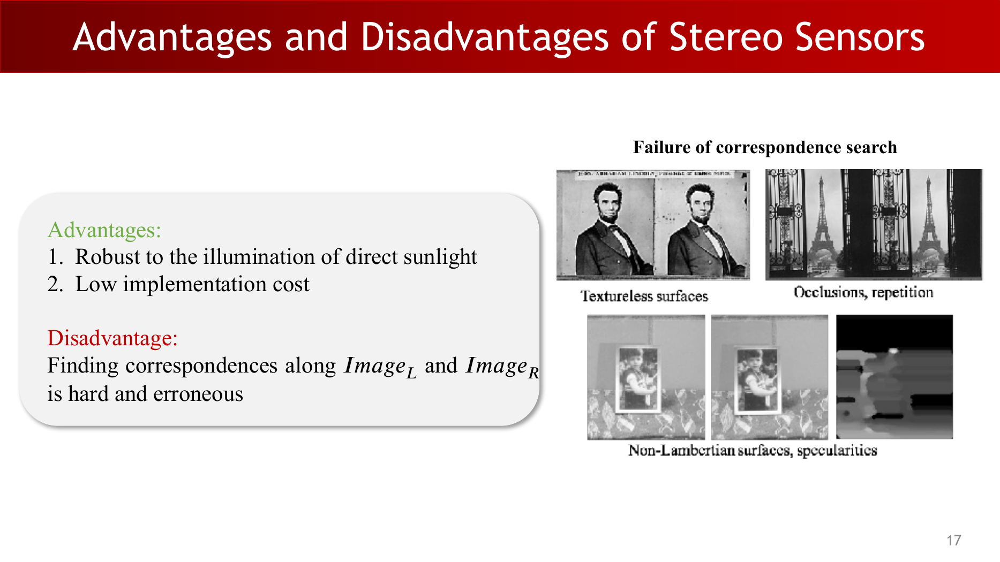

双目对直射阳光较鲁棒，成本也低；但在无纹理或重复纹理区域，沿 epipolar line 搜索匹配很困难。主动双目和结构光会投射图案，让匹配更容易：

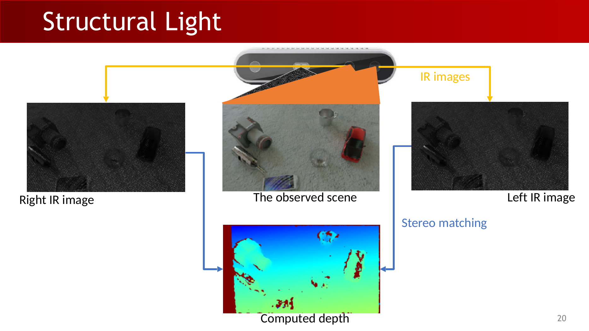

:::warn 常见误区：disparity 与 depth
视差和深度方向相反。若遮挡边界处视差有噪声或缺失，恢复出来的深度图也会不可靠。
:::

## 3. 网格：显式表面几何

**关键定义（讲义原话）：** **"A piece-wise Linear Surface Representation"** 以及 **"Both a geometry and surface representation."**

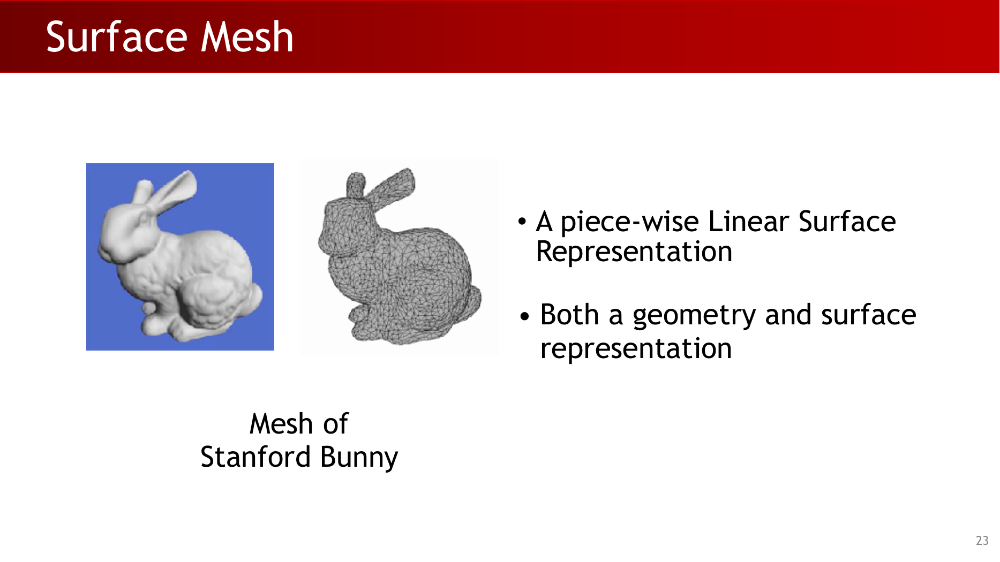

三角网格本质上是带有顶点和边的图，再加上三角面。它还可以存储法向、颜色、纹理坐标等属性，这些属性可以属于顶点、面或边。

常见存储方式有两种：

- 三角形列表：每个面直接存三个位置。简单，但没有连接信息。
- 索引面集：顶点只存一次，每个面存顶点索引。

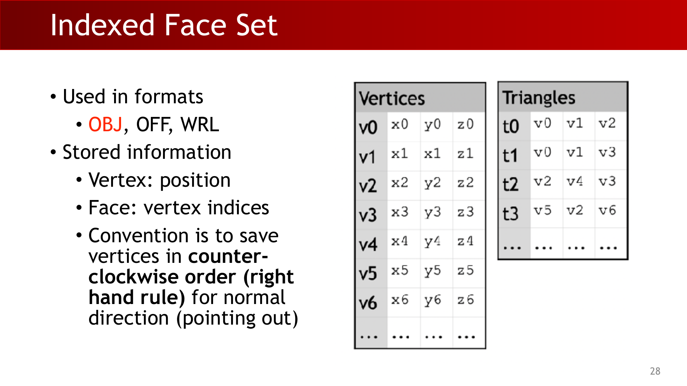

在索引面集中，顶点通常按逆时针顺序保存，从而用右手定则确定朝外法向。

:::remark 关键问题与解答：网格数据结构
**问题（原文）：** **"What information should be stored?"**

**解答：** 至少要存几何和拓扑：顶点坐标，以及哪些顶点组成每个面。实际网格还会存法向、颜色、纹理坐标等属性。
:::

网格用分片线性面近似光滑表面。即使真实传感数据通常是点云，网格仍常用于三维可视化和为机器学习生成 ground truth。

## 4. 点云：轻量但不自带表面

点云存储 $N\times 3$ 的坐标。它是非规则、无序的，但紧凑且容易采集。

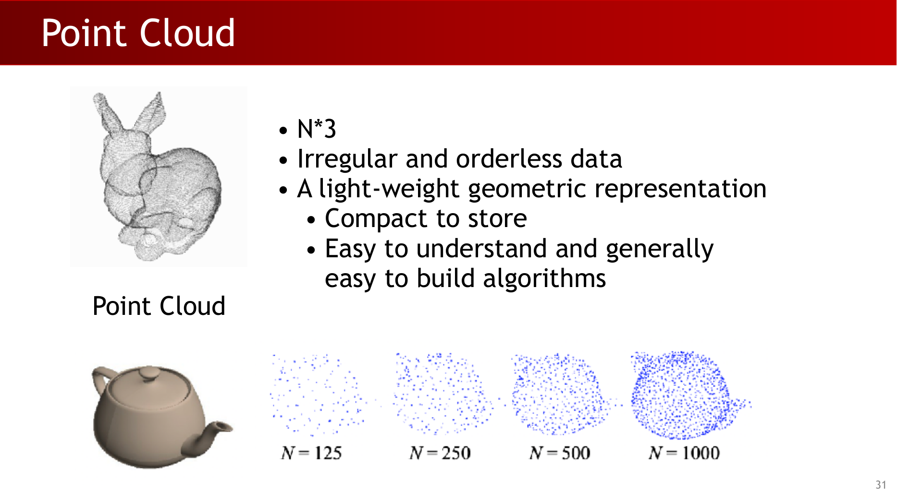

关键限制是：点云本身不是表面。更准确地说：

$$
\text{point cloud} = \text{surface} + \text{sampling}
$$

因此我们经常需要从网格采样点云，或从点云重建表面。

网格均匀采样流程：

1. 计算每个面的面积。
2. 把面积转换为采样概率。
3. 根据概率独立同分布地采样面。
4. 在每个被选中的三角形面内均匀采样点。

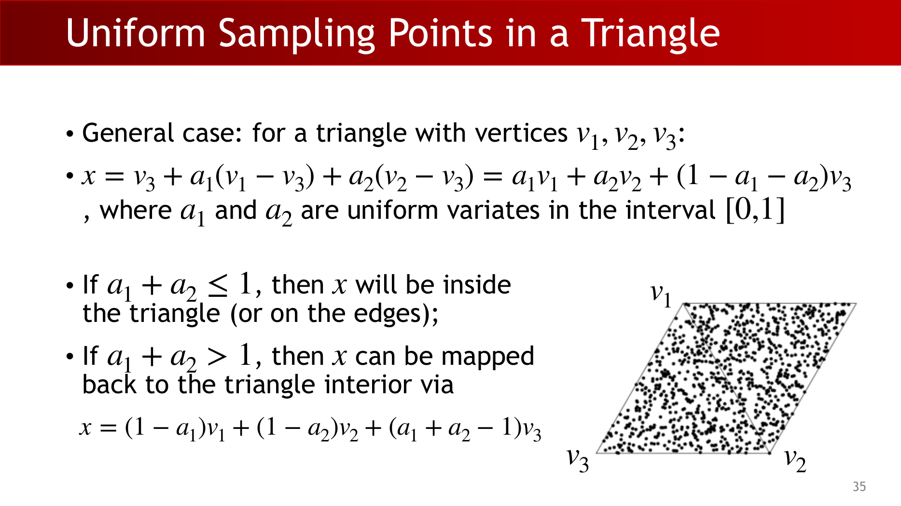

对顶点为 $v_1,v_2,v_3$ 的三角形：

$$
x=v_3+a_1(v_1-v_3)+a_2(v_2-v_3)=a_1v_1+a_2v_2+(1-a_1-a_2)v_3
$$

若 $a_1+a_2\le 1$，点在三角形内。若 $a_1+a_2>1$，用下面公式折回：

$$
x=(1-a_1)v_1+(1-a_2)v_2+(a_1+a_2-1)v_3
$$

均匀采样容易实现，但点间距可能不均匀。Farthest Point Sampling（FPS）迭代选择距离已有样本最远的点，使采样覆盖更均匀。

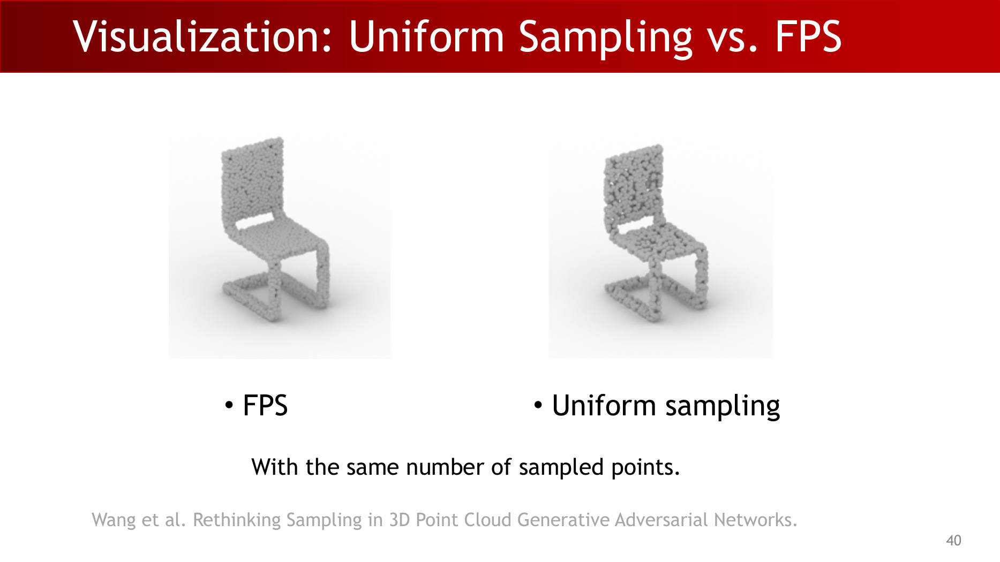

:::tip 关键问题与解答：均匀采样与 FPS
**问题（原意复述）：** 如果 uniform sampling 更简单，为什么还要用 FPS？

**解答：** 均匀采样相对于表面积是无偏的，但样本可能局部聚集。FPS 更贵，但空间覆盖更好，通常更适合下游点云学习。
:::

## 5. 点云距离度量

:::remark 关键问题与解答：点云距离
**问题（原文）：** **"How to measure the distance between two point clouds?"**

**解答：** 常见选择是 Chamfer Distance 和 Earth Mover's Distance。Chamfer 使用最近邻距离求和；EMD 求解一一匹配的最小代价。
:::

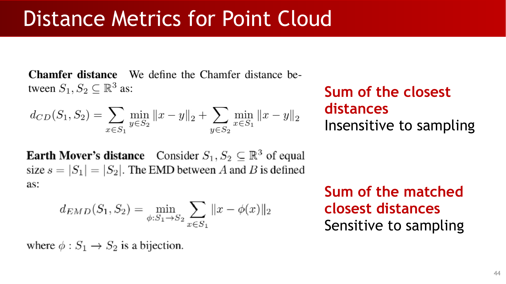

Chamfer Distance：

$$
d_{CD}(S_1,S_2)=
\sum_{x\in S_1}\min_{y\in S_2}\lVert x-y\rVert_2+
\sum_{y\in S_2}\min_{x\in S_1}\lVert x-y\rVert_2
$$

Chamfer Distance 对采样密度相对不敏感，因为它不要求全局一一对应。

Earth Mover's Distance：

$$
d_{EMD}(S_1,S_2)=
\min_{\phi:S_1\rightarrow S_2}
\sum_{x\in S_1}\lVert x-\phi(x)\rVert_2,
\qquad \phi:S_1\rightarrow S_2\ \text{is a bijection}
$$

EMD 对采样更敏感，因为它要求匹配点对。它通常语义上更严格，但计算代价更高。

:::warn 常见误区：Chamfer 可能掩盖缺失结构
Chamfer Distance 可能在点云密度不均或缺少细结构时仍然较小，因为很多点可以映射到同一个最近邻。若等大小匹配成立，EMD 会更直接地惩罚这种不匹配。
:::

## 6. 隐式场、SDF 与等值面提取

隐式表示不是显式列出面或点，而是用空间上的函数编码形状。

**关键定义（讲义原话）：** **"Both an implicit geometry and surface representation."**

典型例子包括 signed distance function、unsigned distance function 和 occupancy network。

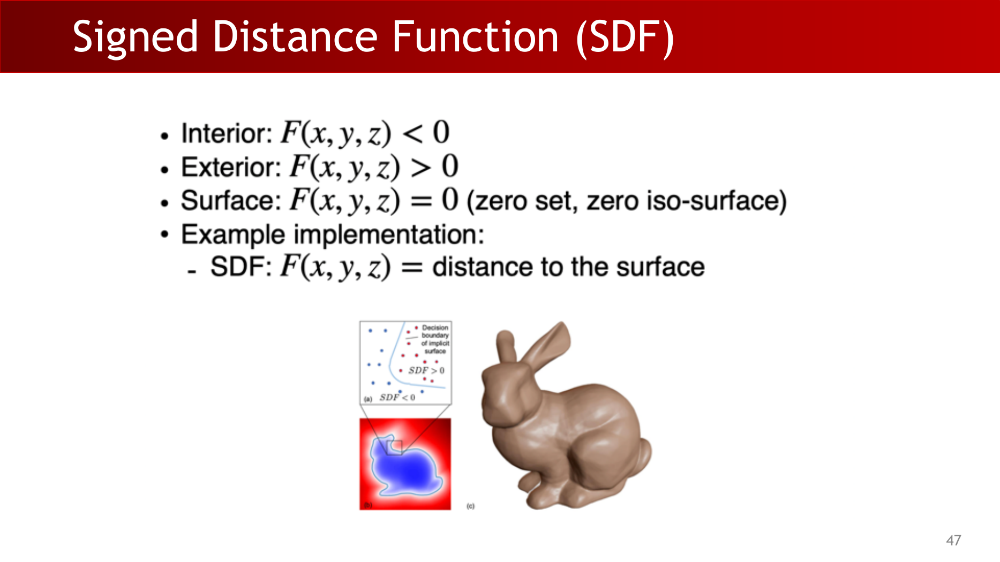

对 SDF：

$$
F(x,y,z)<0\ \text{inside},\qquad
F(x,y,z)>0\ \text{outside},\qquad
F(x,y,z)=0\ \text{on the surface}
$$

表面就是零集合，也叫 zero iso-surface。

要从隐式场提取网格，经典方法会离散空间，并找到数值跨越 iso-value 的位置：

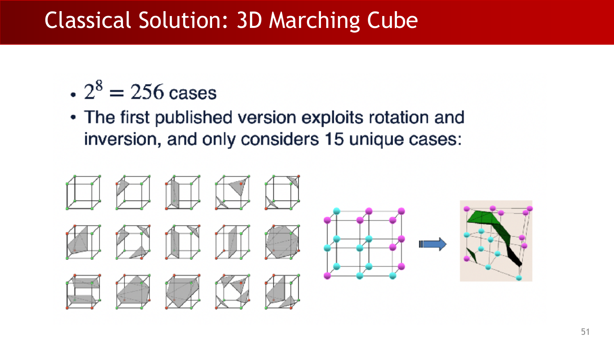

在 3D marching cubes 中，每个 cube 有 8 个顶点，因此可能的内外符号配置为：

$$
2^8=256
$$

通过旋转和取反对称性，最早版本只考虑 15 种唯一情况，但歧义情况可能导致孔洞。更鲁棒的查表方法会考虑更大的局部上下文。

:::remark 关键问题与解答：零等值面
**问题（原意复述）：** 怎样从 implicit field 中提取可见表面？

**解答：** 在网格上评估隐式函数，找到顶点值跨越目标等值的 cell，再根据 marching squares 或 marching cubes 的查表规则连接边上的插值交点。
:::

DeepSDF 则用神经网络学习连续 signed distance function。

## 7. Neural Radiance Fields 与体渲染

新视角合成要求从图像和相机位姿推断三维场景，再渲染未见过的视角。渲染是从已知三维场景和相机参数生成图像；inverse graphics 则从图像反推场景结构和相机位姿。

NeRF 把场景表示为连续 5D 函数：

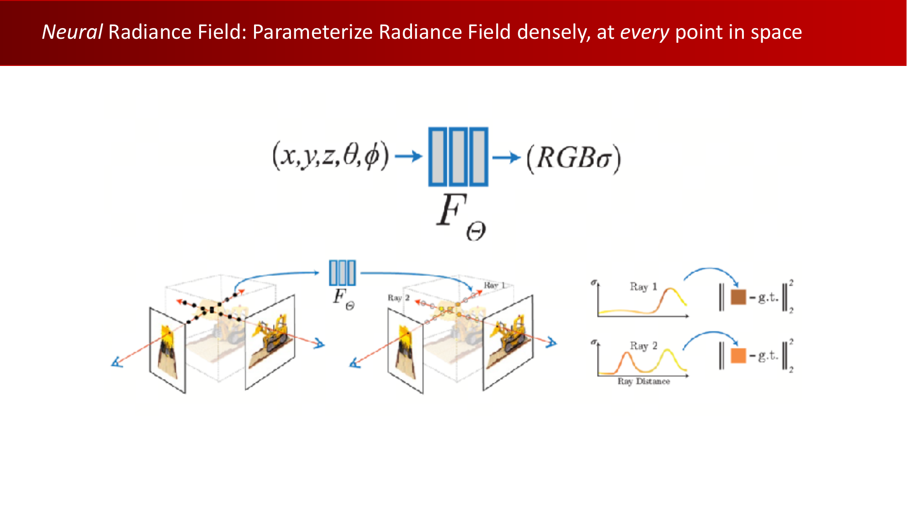

$$
(x,y,z,\theta,\phi)\xrightarrow{F_\Theta}(RGB,\sigma)
$$

网络在每个查询位置和视角方向预测颜色与密度。图像通过沿相机光线做体渲染得到。

连续体渲染方程为：

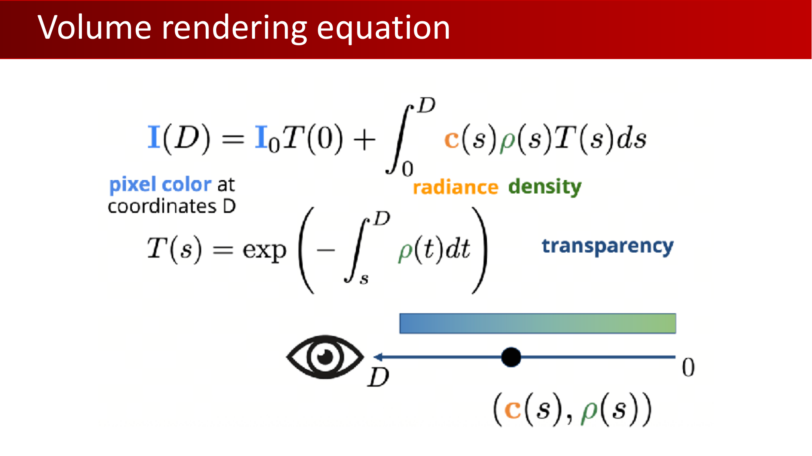

$$
I(D)=I_0T(0)+\int_0^D c(s)\rho(s)T(s)\,ds,
\qquad
T(s)=\exp\left(-\int_s^D \rho(t)\,dt\right)
$$

对衰减系数为 $\sigma$ 的光线段：

$$
\alpha(t)=1-\exp(-\sigma t)
$$

离散 ray marching 中：

$$
T_i=\prod_{j=i+1}^{n}(1-\alpha_j)=
\exp\left(-\sum_{j=i+1}^{n}\sigma_j\delta_j\right)
$$

$$
I=\sum_i T_i\alpha_i\left(\frac{c_i}{\sigma_i}\right)
$$

:::tip 关键问题与解答：可微渲染
**问题（原意复述）：** differentiable rendering 为什么对 NeRF 有用？

**解答：** 它允许把渲染图像与真实观测图像比较，计算 rendering loss，并通过梯度下降更新 radiance-field 网络。
:::

## 8. 3D Gaussian Splatting

NeRF 密集参数化 radiance field，并沿光线采样大量点，包括空区域。3D Gaussian Splatting 使用稀疏场景表示：只在密度非零的位置放置各向异性体 Gaussian。

3DGS 不再反复 ray marching 空间，而是通过 rasterization/splatting 渲染：

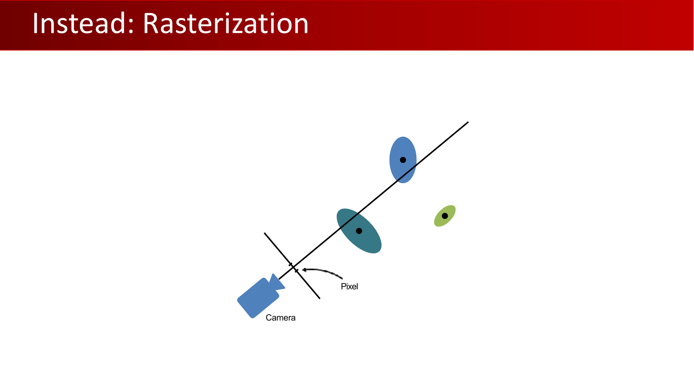

Gaussian 在仿射变换和积分下封闭，因此三维 Gaussian 投影到图像平面后仍是二维 Gaussian：

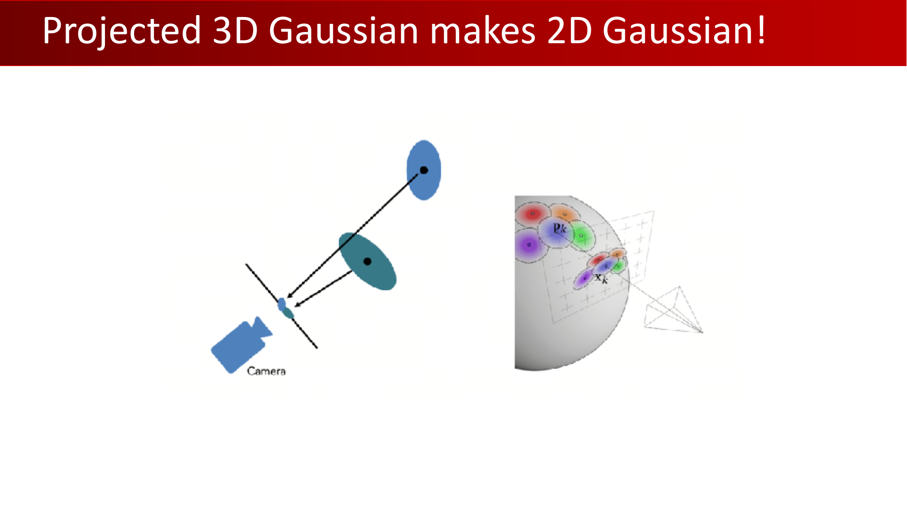

实际渲染流程是：

- 剔除对 pixel frustum 贡献很小的 Gaussian；
- 把 3D Gaussian 投影成屏幕空间 2D Gaussian；
- 按可见顺序进行 alpha compositing；
- 优化位置、协方差、不透明度和外观，使渲染图像匹配观测图像。

:::remark 关键问题与解答：inverse graphics 的问题
**问题（原文）：** **"Any problems for inverse graphics, though?"**

**解答：** 有。优化可能陷入局部最小值。实用的 3DGS 系统通常从 SfM point cloud 初始化，并用启发式 pruning/spawning 操作稳定学习。
:::

## 9. PointNet：在无序点集上学习

点云不是规则网格。点云包含 $N$ 个无序点，每个点由 $D$ 维坐标或特征表示。

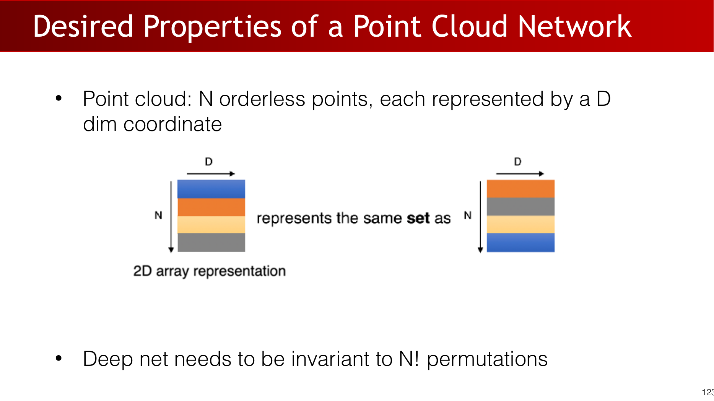

**关键定义（讲义原话）：** **"Deep net needs to be invariant to N! permutations."**

数学上：

$$
f(x_1,x_2,\ldots,x_n)=f(x_{\pi_1},x_{\pi_2},\ldots,x_{\pi_n}),
\qquad x_i\in\mathbb{R}^D
$$

排序不是好方法，因为新增一个点可能让整体顺序剧烈改变。PointNet 改用 symmetric function：

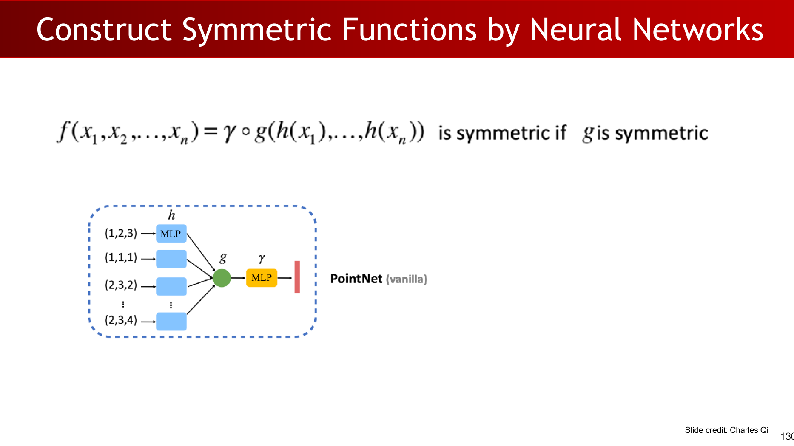

$$
f(x_1,x_2,\ldots,x_n)=\gamma\circ g(h(x_1),\ldots,h(x_n))
$$

其中 $h$ 是共享的逐点 MLP，$g$ 是 max pooling 这类对称聚合函数，$\gamma$ 是作用在全局特征上的另一个 MLP。

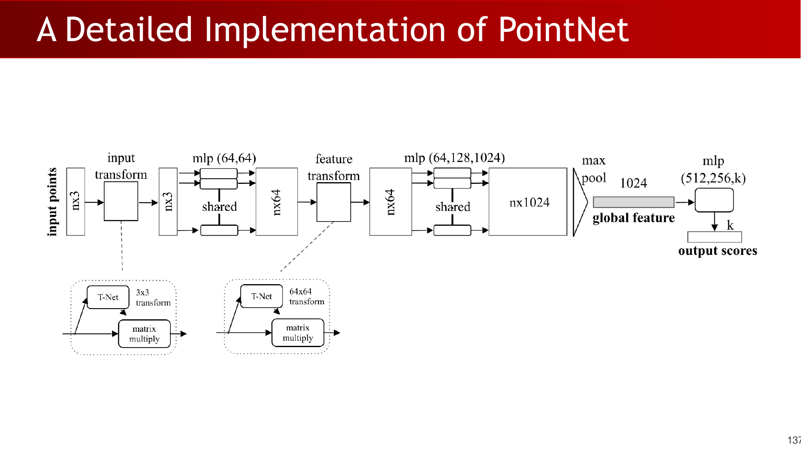

PointNet 分类网络使用共享 MLP、可选的 input/feature transform、max pooling 得到全局特征，再用最终 MLP 输出类别分数。

做分割时，把 local point embedding 与 global feature 拼接，让每个点同时拥有局部身份信息和全局形状上下文：

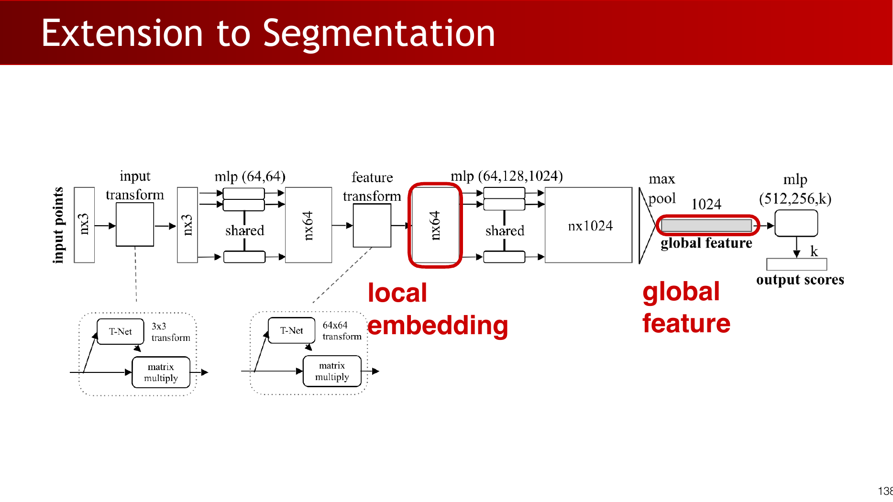

:::remark 关键问题与解答：PointNet 的鲁棒性
**问题（原文）：** **"Why is PointNet so robust to point missing or inserting new points?"**

**解答：** 使用 max pooling 时，全局特征由各通道达到最大值的 critical points 决定。丢失或加入非 critical points 往往不会明显改变 max-pooled feature。
:::

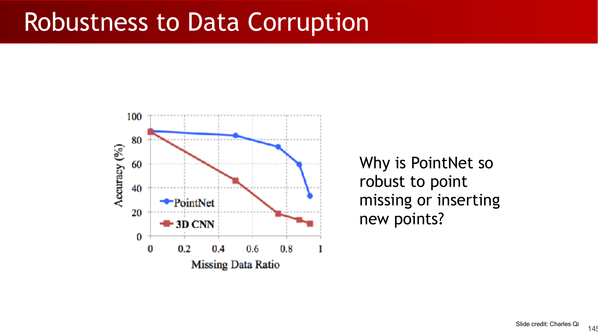

PointNet 轻量且快速，但 vanilla PointNet 有重要限制：

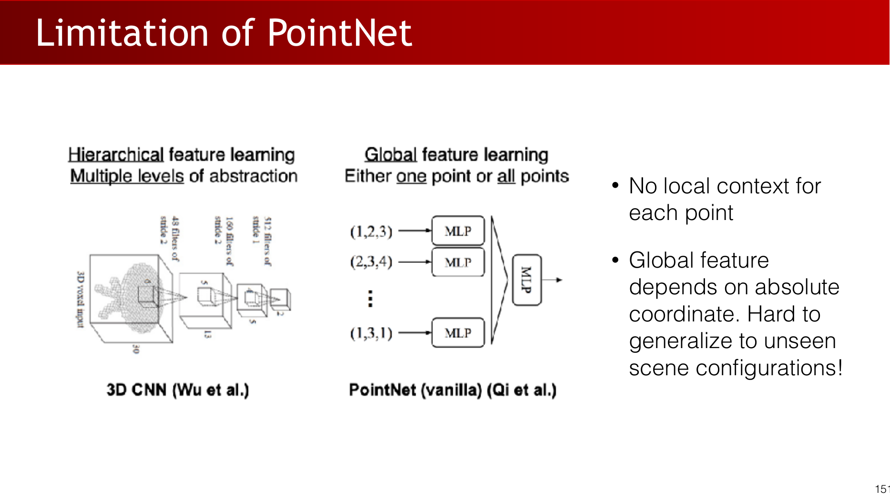

- 每个点没有显式局部邻域上下文。
- 全局特征依赖绝对坐标，较难泛化到未见过的场景配置。

这些限制引出了 PointNet++ 等分层点网络。

## 10. Exam Review

### Core definitions

- Voxel grid：规则三维网格，容易索引但内存开销大。
- Mesh：由顶点、边、面组成的显式分片线性表面。
- Point cloud：无序三维采样点集合，紧凑但不是表面。
- SDF：零集合为表面的隐式函数。
- Chamfer Distance：点集之间的双向最近邻距离。
- EMD：等大小点集之间的最小代价双射匹配距离。
- NeRF：把三维位置和观察方向映射到颜色与密度的连续 radiance field。
- 3DGS：用稀疏各向异性 Gaussian 表示场景，并通过 splatting 渲染。
- PointNet：使用共享 MLP 和对称池化的点集网络。

### Short-answer templates

- 比较三维表示：讨论规则性、内存、表面信息、拓扑、可微性和下游模型兼容性。
- 解释双目深度：匹配得到 disparity；$u-u'=Bf/z$；disparity 与 depth 成反比。
- 解释 mesh vs. point cloud：mesh 存连接关系和表面；point cloud 存采样点，需要额外重建表面。
- 解释隐式表面：定义 $F(x,y,z)$，指出零集合，再说明 marching cubes 或 neural SDF。
- 解释 NeRF：输入位置和视角方向，输出颜色和密度，通过可微体积分渲染。
- 解释 3DGS：从稀疏 Gaussian 开始，投影成 2D Gaussian，rasterize/splat，再用图像损失优化。
- 解释 PointNet：逐点共享 MLP，对称 max pooling 保证 permutation invariance，最终 MLP 预测。

### Common mistakes

- 把深度图当作完整三维几何。
- 忘记点云是无序集合。
- 以为 uniform sampling 一定产生均匀间距的点。
- 混淆 Chamfer Distance 和一一匹配。
- 把 SDF 值只当作 occupancy label；符号和距离大小都重要。
- 说 NeRF 存的是 mesh；它存的是连续 radiance field。
- 忽略 PointNet 缺少局部上下文。

### Self-check

1. 你能解释为什么体素适合 CNN 但内存开销大吗？
2. 你能推导为什么双目视差与深度成反比吗？
3. 你能描述如何在三角形中均匀采样，以及为什么需要折回步骤吗？
4. 你能比较 Chamfer Distance 和 EMD 吗？
5. 你能解释 marching cubes 如何从 SDF 提取网格吗？
6. 你能写出体渲染方程，并指出颜色、密度和透射率分别是什么吗？
7. 你能解释 max pooling 为什么让 PointNet 具有 permutation invariance 吗？
