# 第十一讲：序列模型 - PointNet++、稀疏卷积、RNN 与 LSTM

## 1. 三维深度学习路线图

这一讲连接两条主线。第一条主线补完整三维深度学习：层次化点网络、体素网络与稀疏卷积。第二条主线进入序列模型：RNN、语言模型解码、通过时间反向传播、梯度消失，以及带门控的循环模型。

三维部分关注如何处理不规则或稀疏几何，同时保留数据本身的结构。序列部分关注如何在时间上复用同一个模型，同时保留足够的记忆来学习长距离依赖。

:::remark 关键问题与解答：为什么把三维网络和序列模型放在一起？
**问题（原意复述）：** 为什么同一讲里既讨论 3D networks，又讨论 recurrent networks？

**解答：** 两者本质上都在讨论如何尊重数据结构。点云和稀疏体素需要尊重几何与稀疏性的结构化网络；序列数据需要尊重时间顺序和共享动态规律的结构化网络。
:::

## 2. PointNet++：层次化点特征学习

PointNet 把点云看作无序集合，并用对称操作聚合逐点特征。这带来了 permutation invariance，但单个全局 PointNet 不容易自然构建从局部到全局的空间层次。

**关键思想（讲义原文）：** **"Recursively apply pointnet at local regions."**

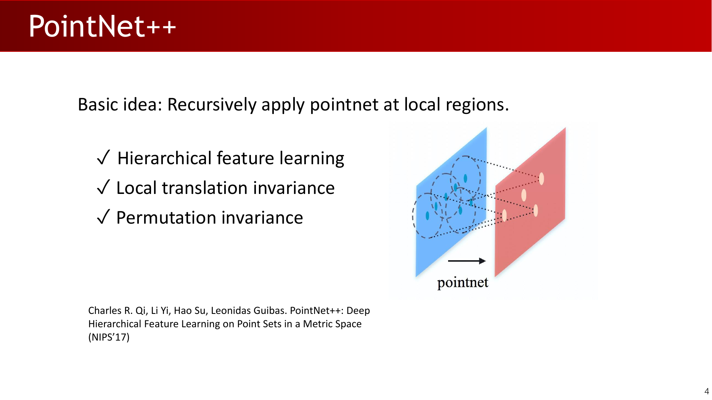

PointNet++ 通过反复对邻近点分组、在每个局部区域内应用小型 PointNet、再把局部集合抽象成更粗的点级特征，弥补了层次结构的缺失。这相当于为点云建立类似 CNN feature pyramid 的结构：

- Sampling 选择代表性中心点。
- Grouping 围绕中心点形成局部邻域。
- 局部 PointNet 把每个邻域映射成一个特征向量。
- 重复这一过程可以扩大 receptive field，并提升语义抽象层级。

重要性质包括：

- **Hierarchical feature learning：** 先总结局部几何，再组合成更大的结构。
- **Local translation invariance：** 使用局部坐标后，小范围平移对局部区域的影响更小。
- **Permutation invariance：** 每个局部集合仍然按无序集合处理。

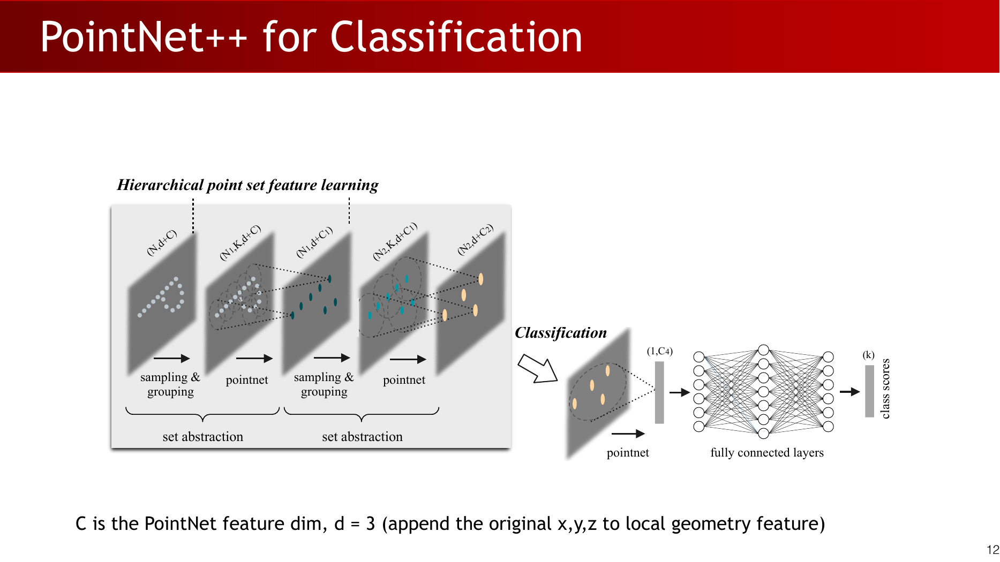

用于分类时，层次结构不断收缩点集，直到形成一个全局 descriptor，再预测类别分数。如果局部 PointNet 输出 $C$ 个特征通道，向上传递的特征可以把局部几何特征与原始坐标拼接；讲义中特别标注 $d=3$，因为原始 $x,y,z$ 坐标会附加到局部几何特征上。

用于分割时，网络必须输出每个点的标签，因此不能只停在全局 descriptor。它需要通过 feature propagation 和 skip-link concatenation 恢复稠密点特征。

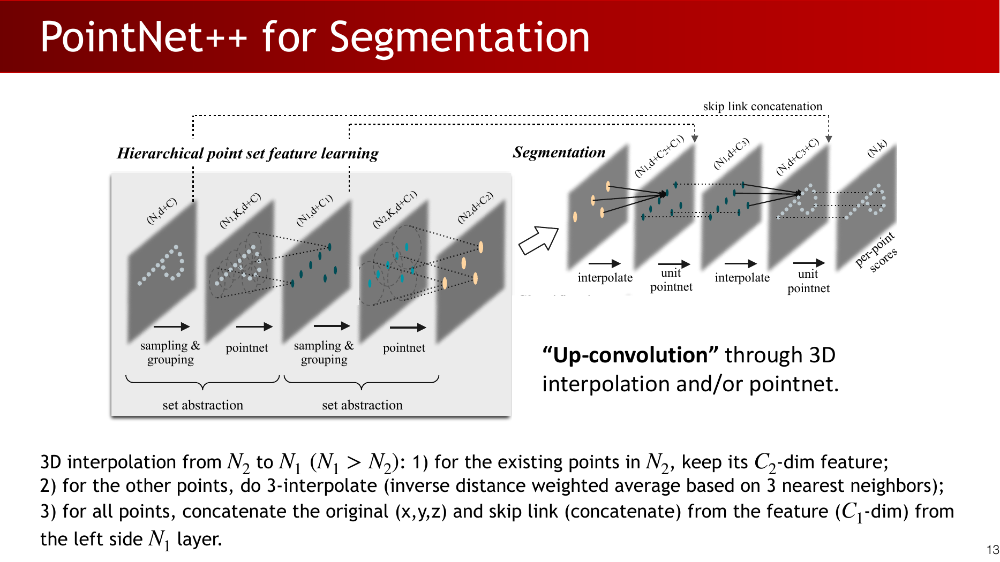

上采样步骤把特征从较粗的 $N_2$ 个点插值到较细的 $N_1$ 个点，其中 $N_1>N_2$。已有的粗层点保留其学习到的特征。其他点使用 3 个最近邻的 inverse-distance interpolation 获得特征，然后再拼接原始坐标和 encoder 对应层的 skip-link 特征。

:::tip 关键问题与解答：为什么分割需要 skip links？
**问题（原意复述）：** 为什么 classification 可以压缩成一个全局特征，而 segmentation 需要 skip-link concatenation？

**解答：** 分类只预测整个形状的一个标签，因此全局抽象足够。分割要预测每个点的标签，因此 decoder 必须恢复细粒度空间细节；skip links 提供了下采样过程中丢失的高分辨率局部信息。
:::

## 3. 体素网络与稀疏卷积

体素表示把三维空间转换成规则网格。最简单的形式是记录每个 cell 是否被占据。

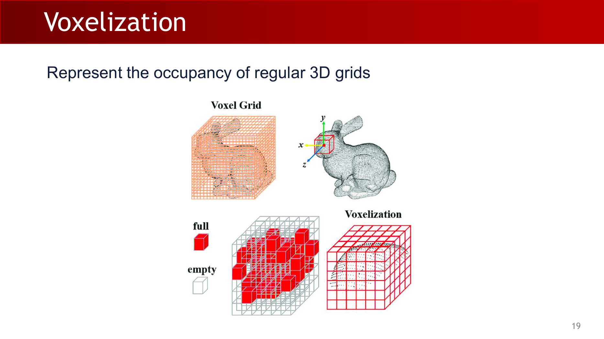

Dense 3D CNN 可以直接处理这种 volumetric data，但计算量会随分辨率立方增长。一个 $30\times 30\times 30$ 网格已经有 $27000$ 个 cell，更高分辨率会迅速变得昂贵。Voxelization 还会引入 discretization error：点或表面必须被吸附到网格 cell 中，几何细节会损失。

关键观察是，真实三维形状和场景通常非常 sparse。高分辨率网格中的大多数 cell 都是空的，尤其当几何主要集中在表面附近时。

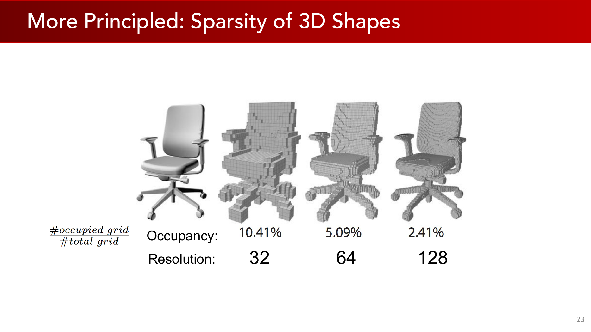

因此，与其存储并卷积所有 voxel，不如只存储 occupied grid cells，并把计算限制在表面附近。

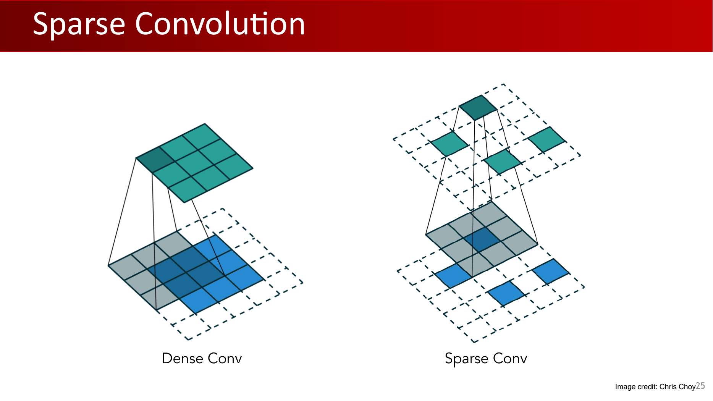

**Sparse convolution** 在避免空空间计算的同时保留规则网格的索引结构。常见实现包括 SparseConvNet、torchsparse、Minkowski Engine 和 spconv。

相比 dense convolution，sparse convolution 的优势很明确：

- 效率远高于 dense 3D convolution。
- 规则网格结构便于 indexing。
- 因为空间 kernel 有结构，表达能力接近 2D convolution。
- 具有类似 2D convolution 的 translation equivariance。

主要代价是 discretization error：连续几何仍然要通过网格表示。

Sparse convolution 和 point cloud networks 的取舍不同。

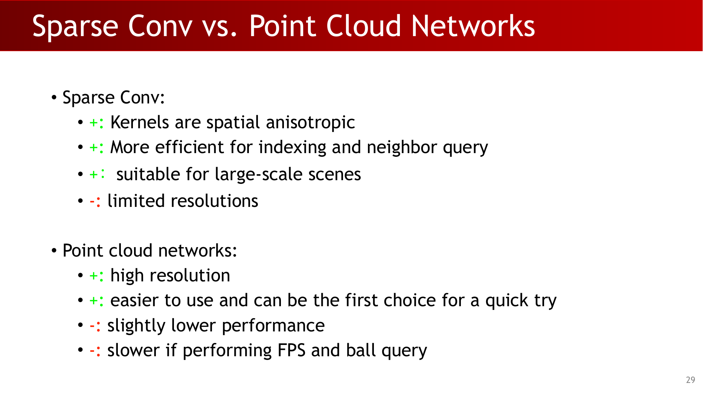

Sparse convolution 适合大场景和需要高效索引的任务。它的 kernel 具有 spatial anisotropy，邻域查询也更快。但实际网格分辨率通常有限，性能依赖 resolution，而且离散化几何对 geometric transformations 更敏感。

Point cloud networks 更轻量，并且可以内置一些几何不变性，但 farthest point sampling 和 ball query 可能较慢，尤其在大规模场景中更明显。

:::warn 常见误区：sparse 不等于 continuous
Sparse convolution 去掉的是空网格上的浪费，但它仍然是 voxel 方法。它提升效率，并不会消除 discretization error。
:::

## 4. 序列数据与基本 RNN

Feed-forward network 独立处理单个输入。Recurrent neural network 通过在时间上携带 hidden state 来处理序列。

**关键定义（讲义原文）：** **"Recurrent Neural Network: Process Sequential Data."**

在时间步 $t$，RNN 接收输入 $x_t$，把它与上一个 hidden state $h_{t-1}$ 结合，产生新的 hidden state $h_t$：

$$
h_t = f_W(h_{t-1}, x_t)
$$

Vanilla RNN 使用一个 hidden vector 作为全部状态：

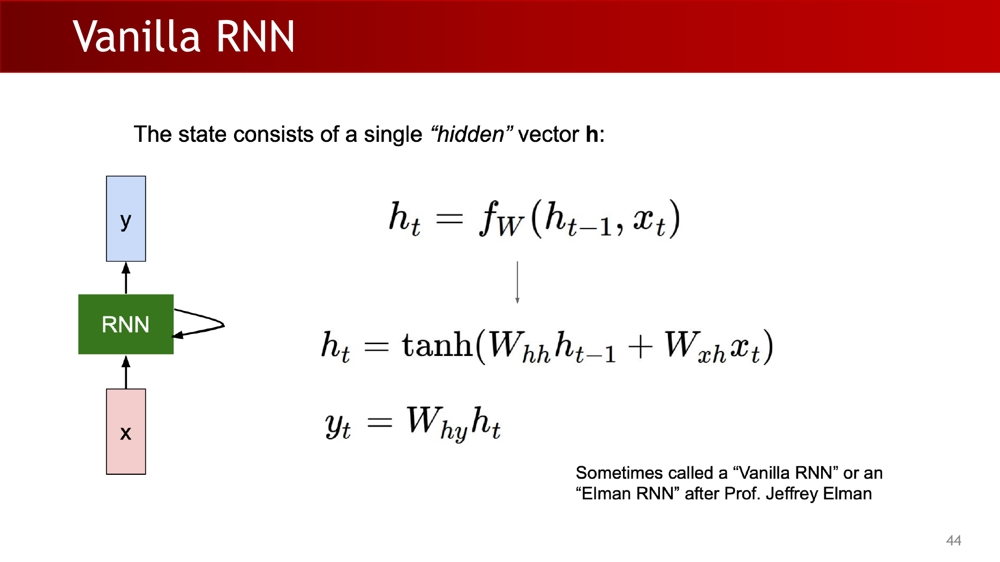

$$
h_t = \tanh(W_{hh}h_{t-1}+W_{xh}x_t)
$$

输出通常由 hidden state 计算得到：

$$
y_t = W_{hy}h_t
$$

同一个权重矩阵会在每个 timestep 重复使用。正是这种 weight sharing 让 RNN 可以处理变长序列，同时只学习一个转移规则。

:::remark 关键问题与解答：hidden state 是什么？
**问题（原意复述）：** RNN 的 hidden state 表示什么？

**解答：** Hidden state 是对过去输入的学习型摘要。理想情况下，$h_t$ 包含 $x_1,\ldots,x_t$ 中对未来输出有用的全部信息。实际中，vanilla RNN 往往会因为梯度流问题遗忘较远的信息。
:::

## 5. 计算图、BPTT 与 Truncated BPTT

把 RNN 展开后，recurrence 会变成沿时间方向的深层计算图。同一个函数 $f_W$ 反复出现，并且同一组参数 $W$ 在每一步共享。

训练使用 **Backpropagation through Time (BPTT)**：先对整个序列前向计算 loss，再沿完整展开序列反向传播梯度。

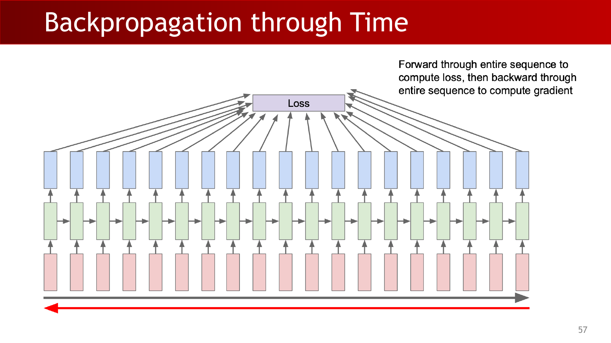

如果序列很长，完整 BPTT 的显存和计算成本都很高。**Truncated Backpropagation through Time** 不再通过完整序列反传，而是按较短的 chunks 前向和反向。

这是一个实用折中：

- 让长序列训练变得可行。
- 限制梯度能够直接传播的距离。
- 比起超长跨度关系，更强地训练窗口内部的时间关系。

:::tip 关键问题与解答：为什么要截断 BPTT？
**问题（原意复述）：** 为什么不总是对完整序列做 backpropagation？

**解答：** 完整 BPTT 需要保存每个 timestep 的 activation，并跨完整长度传播梯度；长序列下成本高且不稳定。Truncated BPTT 通过只优化 chunks 降低成本，但会削弱对超过 chunk length 的依赖关系的直接监督。
:::

## 6. 字符级语言模型与解码

字符级语言模型根据已经看到的序列预测下一个字符或 token。采样时，模型会把自己预测的 token 再作为下一步输入，并不断重复。

理想解码目标是找到概率最大的长度为 $T$ 的输出序列：

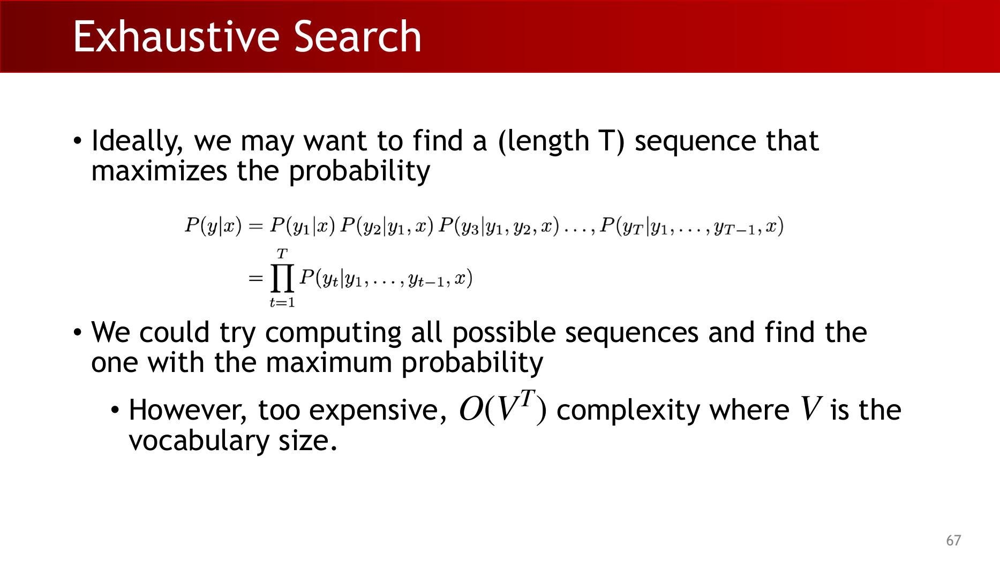

$$
P(y|x)=P(y_1|x)P(y_2|y_1,x)P(y_3|y_1,y_2,x)\cdots P(y_T|y_1,\ldots,y_{T-1},x)
$$

等价地：

$$
P(y|x)=\prod_{t=1}^{T}P(y_t|y_1,\ldots,y_{t-1},x)
$$

尝试所有可能序列就是 exhaustive search。如果词表大小为 $V$、输出长度为 $T$，复杂度是：

$$
O(V^T)
$$

这通常不可行，因此实际解码会使用近似方法。

Greedy sampling 每一步都选择概率最高的 token。它是 deterministic 的，在固定初始 token 和 hidden state 时只能生成一个序列。

Weighted sampling 按预测概率分布采样下一个 token。它可以生成更多样的序列，但也可能误采样到低质量 token，从而破坏后续生成。

Beam search 在每个 timestep 保留概率最高的 $k$ 个 partially generated sequences。这里 $k$ 是 beam size。Beam search 比 exhaustive search 高效，但不能保证找到全局最优序列。

:::remark 关键问题与解答：greedy、sampling 与 beam search 的区别是什么？
**问题（原意复述）：** 语言模型生成时应该如何选择下一个 token？

**解答：** Greedy decoding 稳定但缺少多样性。Weighted sampling 有多样性但有风险。Beam search 同时跟踪多个高概率候选，在质量和效率之间折中，但仍然是近似搜索。
:::

## 7. 梯度消失与长距离依赖

对展开后的 vanilla RNN 做反向传播时，梯度会反复穿过许多 timestep。这会导致 gradients vanish 或 explode。

**关键问题（讲义原文）：** **"Why is Vanishing Gradient a Problem?"**

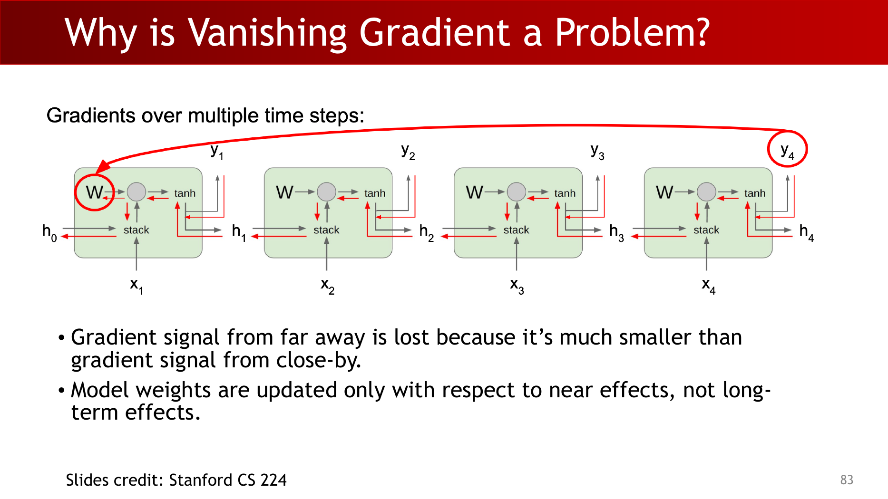

问题在于，来自远处 timestep 的 gradient signal 会比来自近处 timestep 的 gradient signal 小很多。因此模型权重主要根据短期影响更新，而不是长期影响。

语言模型例子能直观说明这个问题。要预测句子 "she finally printed her ____" 的最后一个词，模型可能需要记住许多 timestep 之前出现过的 "tickets"。如果最终 loss 的梯度无法有效到达早期上下文，模型就学不到这个依赖。

Vanilla RNN 难以处理这一点，因为 hidden state 会不断被改写：

$$
h_t=\tanh(W_{hh}h_{t-1}+W_{xh}x_t)
$$

解决思路不只是把 RNN 做大。架构需要更直接的信息和梯度保留路径，让它们能跨越许多 timestep。

:::warn 常见误区：梯度消失不只是模型太小的问题
更大的 hidden state 会增加 capacity，但它本身不会产生稳定的长期记忆路径。核心问题是时间方向上的 multiplicative gradient chain。
:::

## 8. LSTM：独立记忆与动态门控

**关键问题（讲义原文）：** **"How to Fix the Vanishing Gradient Problem?"**

这一讲把核心问题概括为：**"it's too difficult for the RNN to learn to preserve information over many timesteps."** 在 vanilla RNN 中，hidden state 会不断被重写。LSTM 引入单独的 cell state，使信息可以被加到记忆里，而不是每一步都完全覆盖。

**关键定义（讲义原文）：** **"On step $t$, there is a hidden state $h_t$ and a cell state $c_t$."** Cell state 存储长期信息，hidden state 是对外暴露的输出状态。

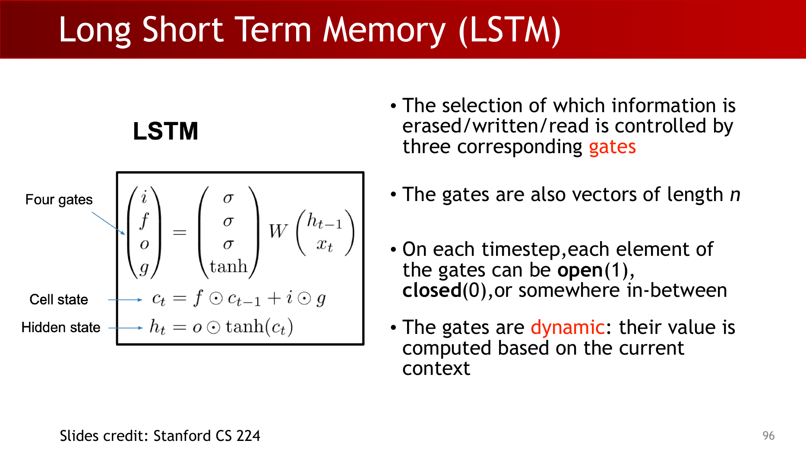

LSTM 根据当前输入和上一个 hidden state 计算 gates 与候选内容：

$$
\begin{pmatrix} i \\ f \\ o \\ g \end{pmatrix}
=
\begin{pmatrix} \sigma \\ \sigma \\ \sigma \\ \tanh \end{pmatrix}
W
\begin{pmatrix} h_{t-1} \\ x_t \end{pmatrix}
$$

Cell state 的更新是 additive 的：

$$
c_t=f\odot c_{t-1}+i\odot g
$$

Hidden state 从 cell 中读取信息：

$$
h_t=o\odot\tanh(c_t)
$$

逐元素理解这些 gates：

- $f$ 是 forget gate：决定保留多少旧 cell 内容。
- $i$ 是 input/write gate：决定写入多少新的候选内容。
- $o$ 是 output/read gate：决定通过 $h_t$ 暴露多少 cell 内容。
- $g$ 是 candidate content，由 $\tanh$ 限幅。

讲义强调 gates 是 dynamic 的：它们的值由当前 context 计算得到。每个 gate 元素都可以打开、关闭，或者处在二者之间。

:::remark 关键问题与解答：LSTM 是否解决梯度消失？
**问题（讲义原文）：** **"Do LSTMs Solve the Vanishing Gradient Problem?"**

**解答：** LSTM 让模型更容易在多个 timestep 上保留信息，但它不能保证完全没有 vanishing 或 exploding gradient。如果 $f=1$ 且 $i=0$，某个 cell 的信息可以无限期保留。这条 additive memory path 比 vanilla RNN 的重复矩阵乘法更容易传递梯度。
:::

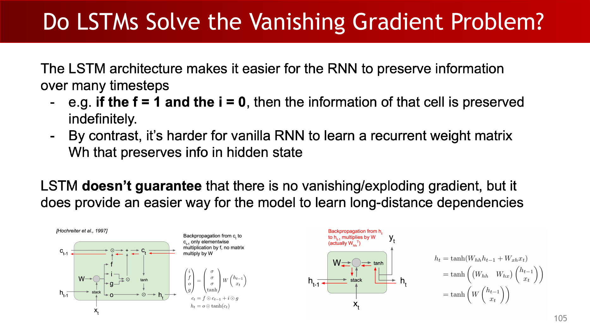

LSTM 的梯度流更容易，是因为从 $c_t$ 反传到 $c_{t-1}$ 时只涉及由 $f$ 控制的 elementwise multiplication，而不是反复乘 recurrent matrix $W$。这在概念上类似 residual connections：加法路径有助于梯度传播。

## 9. GRU 与其他 RNN 变体

GRU 是另一种 gated recurrent architecture。它通常比 LSTM 更简单，因为它没有单独暴露的 cell state。讲义给出了 GRU 公式：

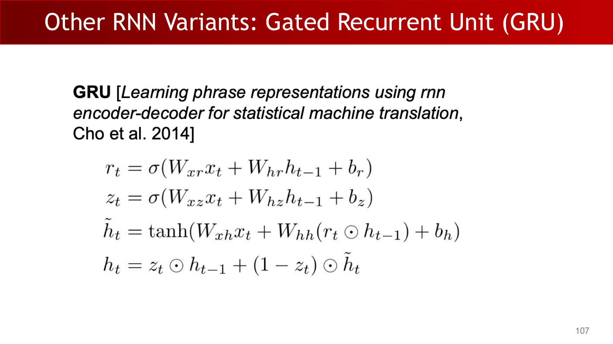

$$
r_t=\sigma(W_{xr}x_t+W_{hr}h_{t-1}+b_r)
$$

$$
z_t=\sigma(W_{xz}x_t+W_{hz}h_{t-1}+b_z)
$$

$$
\tilde{h}_t=\tanh(W_{xh}x_t+W_{hh}(r_t\odot h_{t-1})+b_h)
$$

$$
h_t=z_t\odot h_{t-1}+(1-z_t)\odot\tilde{h}_t
$$

其中，$r_t$ 是 reset gate，控制过去状态有多少参与 candidate state 的计算。$z_t$ 是 update gate，控制旧状态保留多少，以及有多少被 candidate 替换。

各种 RNN 变体都体现同一个核心取舍：更多 gating 与 memory path 能改善长距离学习，但也会增加参数量和复杂度。

:::tip 关键问题与解答：LSTM 与 GRU 如何取舍？
**问题（原意复述）：** 什么时候更适合使用 GRU 而不是 LSTM？

**解答：** GRU 通常更简单，gate 更少且没有独立 cell state，因此可能训练更快。LSTM 有更显式的记忆路径，在长距离依赖上可能更有表达力。实际选择通常需要实验验证，但二者都旨在改善 vanilla RNN 的梯度流。
:::

## 10. Exam Review

### 10.1 必须掌握的定义

- PointNet++：在局部区域递归应用 PointNet 的层次化点网络。
- Voxelization：把三维空间转换为规则 occupancy/value 网格。
- Sparse convolution：只在 occupied 或 active grid cells 上做卷积，而不是在完整 dense volume 上计算。
- RNN：在 timesteps 上复用同一个 transition function 的序列模型。
- BPTT：把 RNN 展开后沿时间方向反向传播训练。
- Truncated BPTT：只在 chunks 内做 BPTT，而不是跨完整序列。
- Beam search：保留 top $k$ partial hypotheses 的近似序列解码方法。
- Vanishing gradient：loss gradient 跨越多个 timestep 传播后变得过小。
- LSTM：带 cell state 和动态 read/write/erase gates 的 RNN 变体。
- GRU：带 reset gate 和 update gate 的门控 RNN 变体。

### 10.2 简答题模板

如果被问到 PointNet++ 为什么优于 PointNet，可以回答：

PointNet++ 保留了 PointNet 的 permutation invariance，但加入了局部邻域和层次结构。它可以先学习 local geometry，再聚合成更大的结构，这更接近 CNN 从局部 receptive field 到全局特征的构建方式。

如果被问到 sparse convolution 为什么有用，可以回答：

Dense 3D convolution 会在大量空空间上浪费计算。Sparse convolution 只存储 active cells，并在 occupied geometry 附近计算，因此对稀疏三维形状和大场景更高效，同时仍然保留网格索引能力。

如果被问到 vanilla RNN 为什么难以学习长距离依赖，可以回答：

Hidden state 会被反复改写，梯度必须穿过许多 recurrent transitions。重复乘法可能让 gradient signal 变小，因此远处原因得到的学习信号很弱。

如果被问到 LSTM 如何缓解这一问题，可以回答：

LSTM 增加了通过加法更新的 cell state，$c_t=f\odot c_{t-1}+i\odot g$。当 forget gate 保留信息时，梯度可以沿 cell path 更直接地传播，使长距离依赖更容易学习。

### 10.3 公式清单

Vanilla RNN：

$$
h_t=\tanh(W_{hh}h_{t-1}+W_{xh}x_t),\qquad y_t=W_{hy}h_t
$$

序列概率：

$$
P(y|x)=\prod_{t=1}^{T}P(y_t|y_1,\ldots,y_{t-1},x),\qquad \text{exhaustive search cost }O(V^T)
$$

LSTM：

$$
\begin{pmatrix} i \\ f \\ o \\ g \end{pmatrix}
=
\begin{pmatrix} \sigma \\ \sigma \\ \sigma \\ \tanh \end{pmatrix}
W
\begin{pmatrix} h_{t-1} \\ x_t \end{pmatrix},
\quad
c_t=f\odot c_{t-1}+i\odot g,
\quad
h_t=o\odot\tanh(c_t)
$$

GRU：

$$
r_t=\sigma(W_{xr}x_t+W_{hr}h_{t-1}+b_r),\quad
z_t=\sigma(W_{xz}x_t+W_{hz}h_{t-1}+b_z)
$$

$$
\tilde{h}_t=\tanh(W_{xh}x_t+W_{hh}(r_t\odot h_{t-1})+b_h),\quad
h_t=z_t\odot h_{t-1}+(1-z_t)\odot\tilde{h}_t
$$

### 10.4 常见错误

- 把 PointNet++ 只理解为更深的 PointNet。关键在于 local grouping 和 hierarchical abstraction。
- 认为 sparse convolution 消除了 voxelization error。它提升的是效率，不是连续几何保真度。
- 混淆 greedy sampling 和 beam search。Greedy 只保留一条路径；beam search 保留 $k$ 条路径。
- 说 LSTM 完全解决梯度消失。它能缓解，但不能保证没有 vanishing 或 exploding gradients。
- 忘记 RNN 权重在各个 timestep 之间共享。

### 10.5 自检问题

1. PointNet++ 为什么同时需要 sampling 和 grouping？
2. Dense 3D convolution 的主要计算瓶颈是什么？
3. 为什么 sparse convolution 适合大规模三维场景？
4. BPTT 相比普通 feed-forward backpropagation 多做了什么？
5. 为什么 exhaustive sequence decoding 是 $O(V^T)$？
6. LSTM cell state 如何比 vanilla RNN hidden state 提供更好的梯度路径？
7. LSTM 中 $f$、$i$、$o$、$g$ 分别负责什么？
8. GRU 中 reset gate 和 update gate 分别控制什么？
