# Lecture 12: Large Models I - Attention, Transformers, and ViT

## 1. From RNN Applications to Attention

This lecture starts from multimodal sequence tasks and uses them to motivate attention and transformers. Image captioning, VQA, and visual dialogue all require a model to combine visual content with language generation or language understanding.

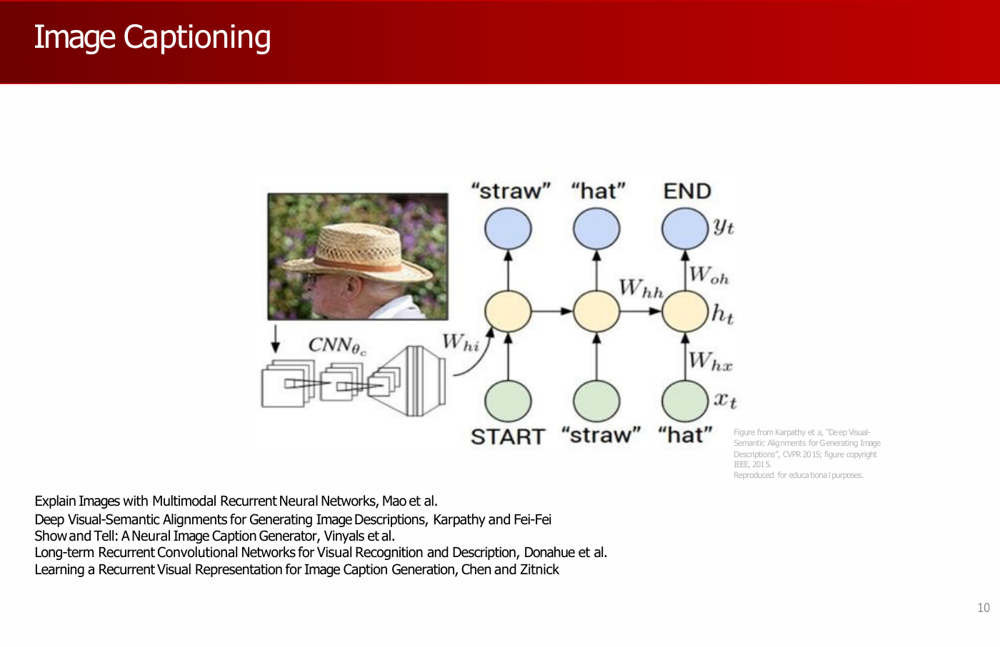

In image captioning, a CNN first converts an image into a feature representation, and an RNN then generates a sequence of words token by token. This makes the earlier RNN lecture immediately relevant: sequence modeling is already enough to describe images in simple settings.

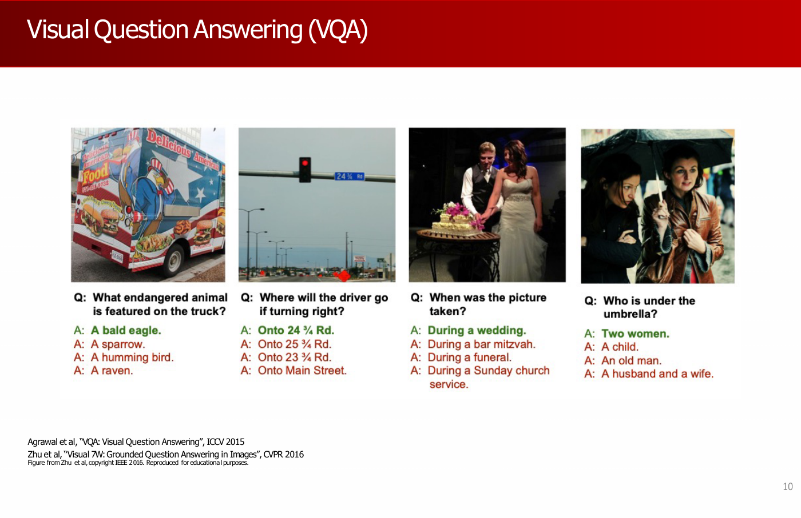

VQA makes the problem harder. The model must read an image, parse a question, align visual evidence with linguistic intent, and output an answer. This pressure for selective information access is the bridge to attention.

:::remark Key question and answer: why is attention introduced after RNN applications?
**Question (original intent):** Why do image captioning and VQA naturally lead to attention?

**Answer:** Both tasks require the model to focus on different pieces of information at different times. A single fixed summary vector is often too restrictive. Attention lets the model retrieve the relevant part of the input dynamically.
:::

## 2. Sequence-to-Sequence and the Bottleneck Problem

The lecture uses machine translation as the motivating sequence-to-sequence example. The encoder reads an input sequence and updates a hidden state:

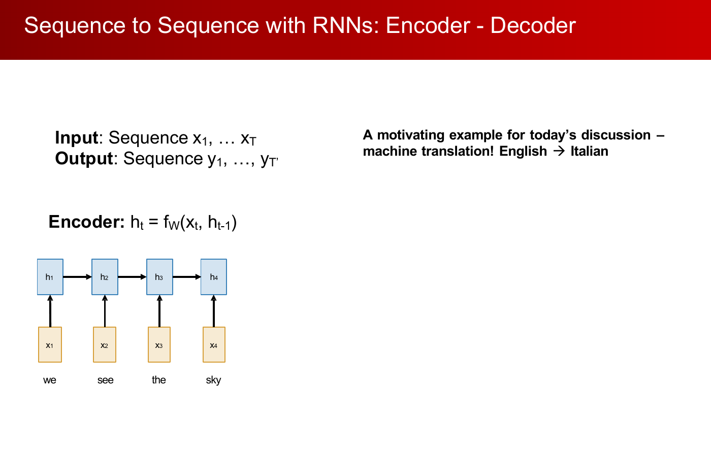

$$
h_t = f_W(x_t, h_{t-1})
$$

The vanilla encoder-decoder then initializes the decoder from the final encoder state and predicts output tokens autoregressively:

$$
s_t = g_U(y_{t-1}, s_{t-1}, c)
$$

Here, $c$ is the context vector, often taken from the final encoder state. This creates a bottleneck: the entire input sequence must be compressed into one vector before decoding starts.

Attention removes that bottleneck by allowing the decoder to build a different context vector at each timestep.

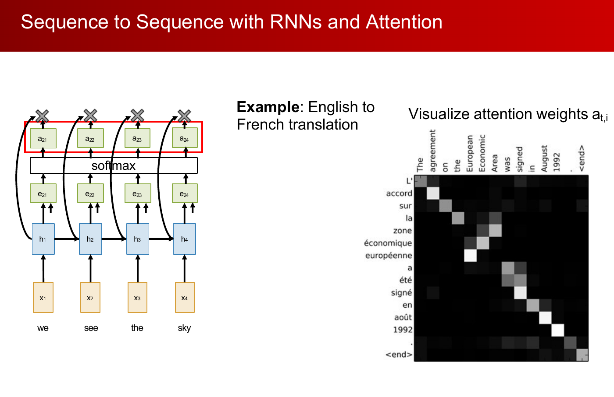

The decoder first computes alignment scores:

$$
e_{t,i} = f_{\mathrm{att}}(s_{t-1}, h_i)
$$

These are normalized into attention weights:

$$
0 < a_{t,i} < 1,\qquad \sum_i a_{t,i} = 1
$$

Then the context vector is a weighted sum of encoder hidden states:

$$
c_t = \sum_i a_{t,i} h_i
$$

The important change is conceptual: the decoder no longer consumes one static summary of the whole input. It asks for what it needs at each output step.

:::remark Key question and answer: what problem does seq2seq attention solve?
**Question (original intent):** Why is a single final encoder state not enough?

**Answer:** A single vector must store all input information, which becomes a severe information bottleneck for long or complex sequences. Attention lets the decoder access all encoder states and assemble a task-specific context vector at each timestep.
:::

## 3. Attention as a General Primitive

**Key definition (lecture wording):** **"Attention: A new primitive that operates on sets of vectors."**

The generalized attention layer abstracts away from RNN encoder-decoder structure and keeps only the core operation: compare a query against a set of data vectors, normalize the scores, then take a weighted sum.

The softmax normalization is:

$$
a_i = \frac{\exp(e_i)}{\sum_j \exp(e_j)}
$$

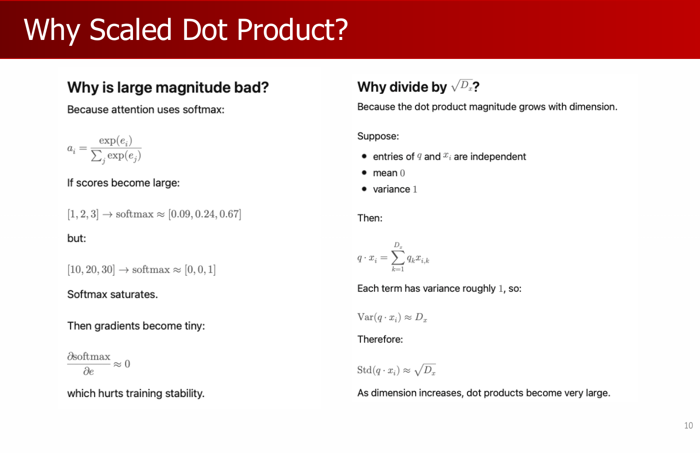

The lecture then asks why scaled dot product is used. If scores become too large, softmax saturates and gradients become tiny. The dot-product magnitude also grows with dimension:

$$
q \cdot x_i = \sum_{k=1}^{D_x} q_k x_{i,k}
$$

Under the slide's simplifying assumptions, the variance grows approximately with dimensionality:

$$
\mathrm{Var}(q \cdot x_i) \approx D_x,\qquad
\mathrm{Std}(q \cdot x_i) \approx \sqrt{D_x}
$$

So dividing by $\sqrt{D}$ keeps score magnitudes in a more stable range.

:::tip Key question and answer: why scale the dot product?
**Question (lecture wording):** **"Why Scaled Dot Product?"**

**Answer:** Without scaling, dot products grow with feature dimension, softmax saturates, and gradients shrink. Dividing by $\sqrt{D}$ stabilizes the score distribution and improves training.
:::

## 4. From Attention to Cross-Attention and Self-Attention

The simplest attention layer uses a matrix of queries $Q$ and a set of data vectors $X$:

$$
E = \frac{QX^T}{\sqrt{D_x}},\qquad
E_{ij} = \frac{Q_i \cdot X_j}{\sqrt{D_x}}
$$

$$
A = \mathrm{softmax}(E, \mathrm{dim}=1),\qquad
Y = AX,\qquad
Y_i = \sum_j A_{ij} X_j
$$

The more general version introduces separate key and value projections:

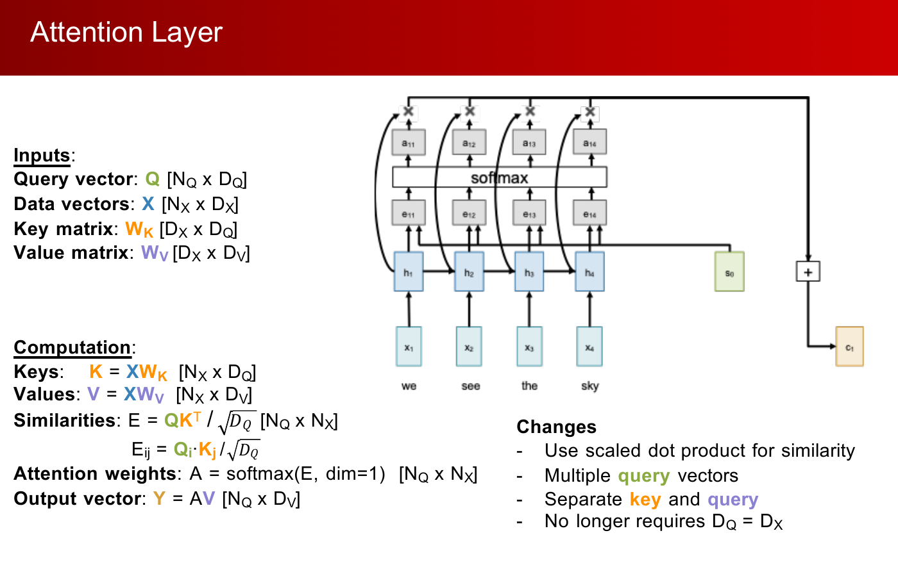

$$
K = XW_K,\qquad V = XW_V
$$

$$
E = \frac{QK^T}{\sqrt{D_Q}},\qquad
E_{ij} = \frac{Q_i \cdot K_j}{\sqrt{D_Q}}
$$

$$
Y = AV,\qquad
Y_i = \sum_j A_{ij} V_j
$$

When the queries come from one source and the keys/values come from another, this is **cross-attention**.

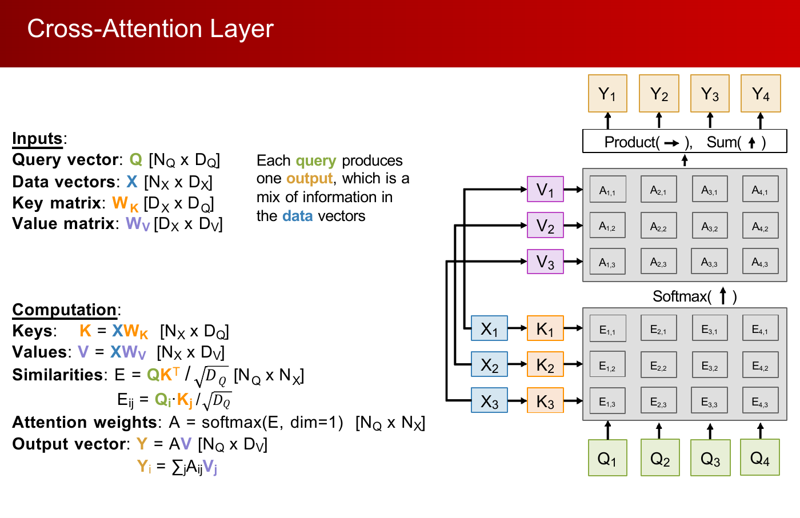

When all three are produced from the same input set, this becomes **self-attention**:

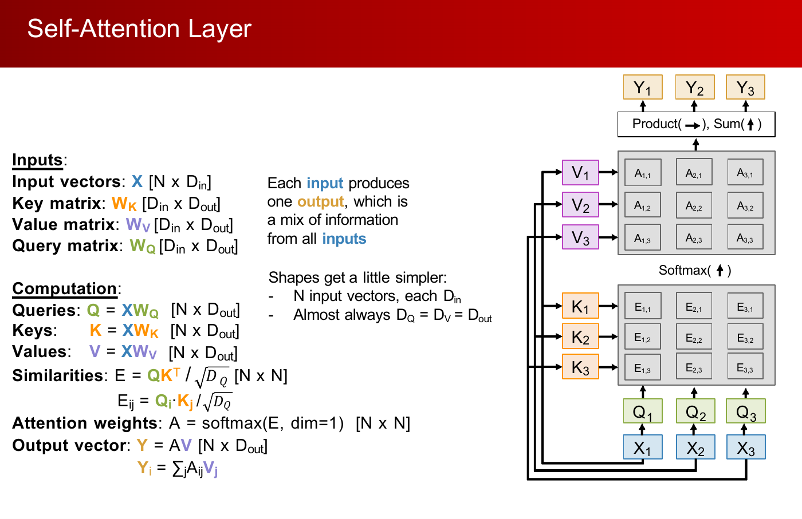

$$
Q = XW_Q,\qquad K = XW_K,\qquad V = XW_V
$$

$$
E = \frac{QK^T}{\sqrt{D_Q}},\qquad
A = \mathrm{softmax}(E, \mathrm{dim}=1),\qquad
Y = AV
$$

The effect is powerful: every input token can directly gather information from every other input token.

:::remark Key question and answer: cross-attention vs self-attention
**Question (original intent):** What is the practical difference between cross-attention and self-attention?

**Answer:** Cross-attention mixes information from one set into another set, such as decoder queries attending to encoder outputs. Self-attention lets one set of vectors interact internally, so every token can read from the whole input sequence.
:::

## 5. Masking, Multi-Head Attention, and the Cost of Global Interaction

Language modeling cannot let a token look into the future. The lecture's masked self-attention layer enforces causality by overriding forbidden similarities with $-\infty$ before the softmax.

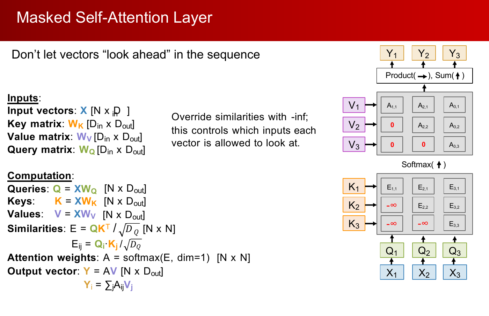

This preserves the same attention equations, but forces the attention matrix to be lower triangular in autoregressive decoding.

Multi-head attention runs several self-attention computations in parallel:

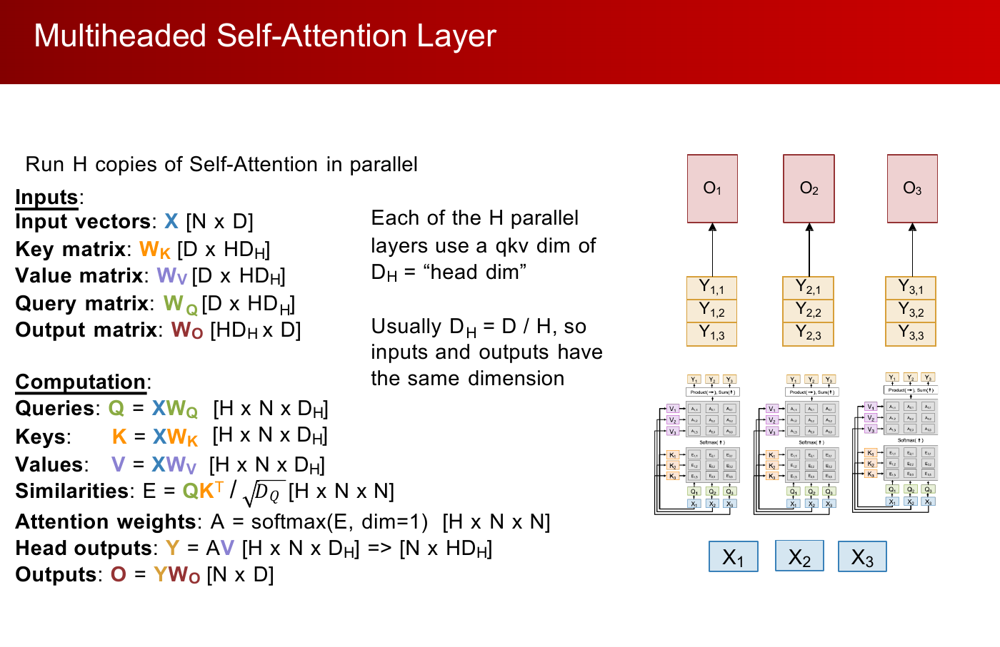

Each head gets its own projected queries, keys, and values. With head dimension $D_H$ and $H$ heads, the final output projection is:

$$
O = YW_O
$$

The lecture also emphasizes that self-attention is just a sequence of matrix multiplies.

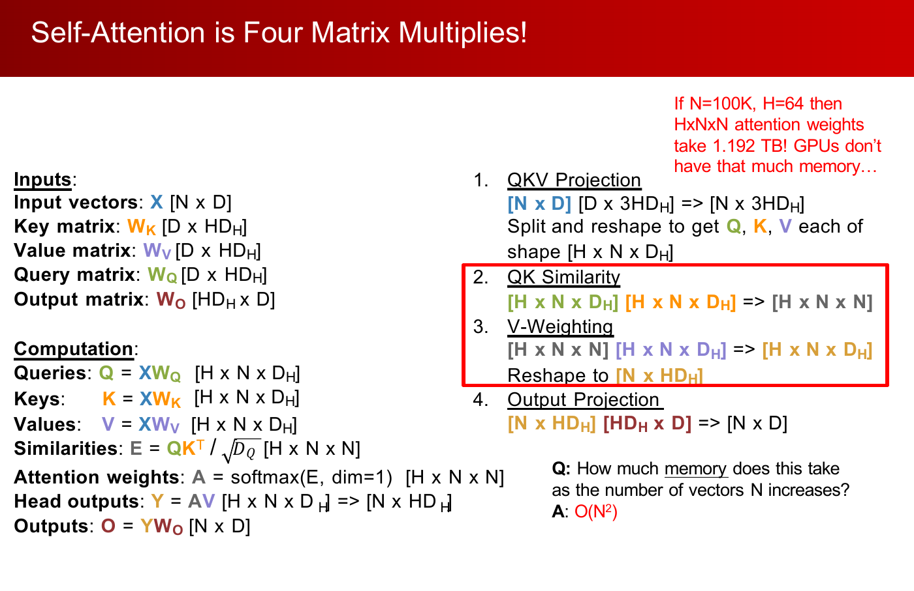

This is highly parallel, but the attention matrix has shape $N \times N$ per head, so memory and compute scale quadratically with sequence length.

:::warn Key issue: why self-attention becomes expensive
**Question (original wording / intent):** How much memory does this take as the number of vectors $N$ increases?

**Answer:** The attention weights are quadratic in sequence length. For each head, the similarity matrix is $N \times N$, so the dominant memory term grows as $O(N^2)$.
:::

## 6. Three Ways of Processing Sequences

The lecture explicitly compares recurrent networks, convolution, and self-attention.

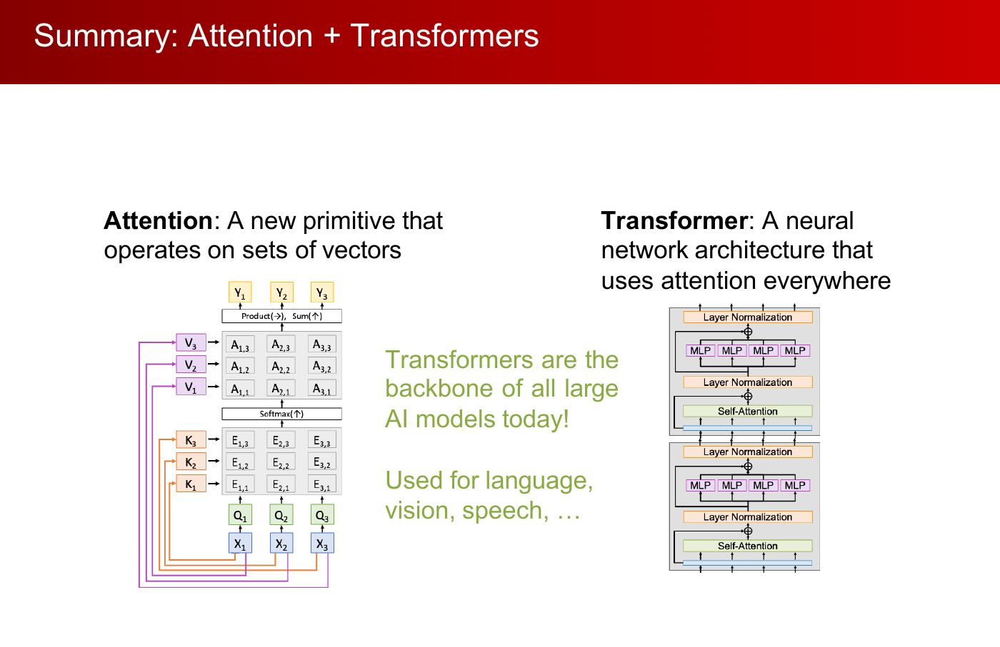

The tradeoff is:

- RNNs work on ordered 1D sequences and have $O(N)$ memory/compute along time, but they are not easily parallelizable because hidden states must be computed sequentially.
- Convolutions are parallelizable, but long-range interaction requires stacking many layers to grow receptive fields.
- Self-attention is highly parallel and gives every output direct access to all inputs, but it is expensive because of the $N^2$ attention map.

This comparison explains why attention became so attractive for large-scale training: it trades sequential recurrence for global communication and parallel matrix operations.

:::tip Key question and answer: why did transformers displace RNNs in large models?
**Question (original intent):** If self-attention is more expensive than RNNs, why did it become dominant?

**Answer:** Because training modern large models is dominated by parallel hardware efficiency and long-range dependency handling. Self-attention is easy to parallelize and lets every token interact globally from the first layer, which is a strong advantage at scale.
:::

## 7. The Transformer Block

**Key definition (lecture wording):** **"Transformer: A neural network architecture that uses attention everywhere."**

A transformer block takes a set of vectors as input. The only interaction between vectors happens through multi-head self-attention. The remaining sublayers operate independently on each token.

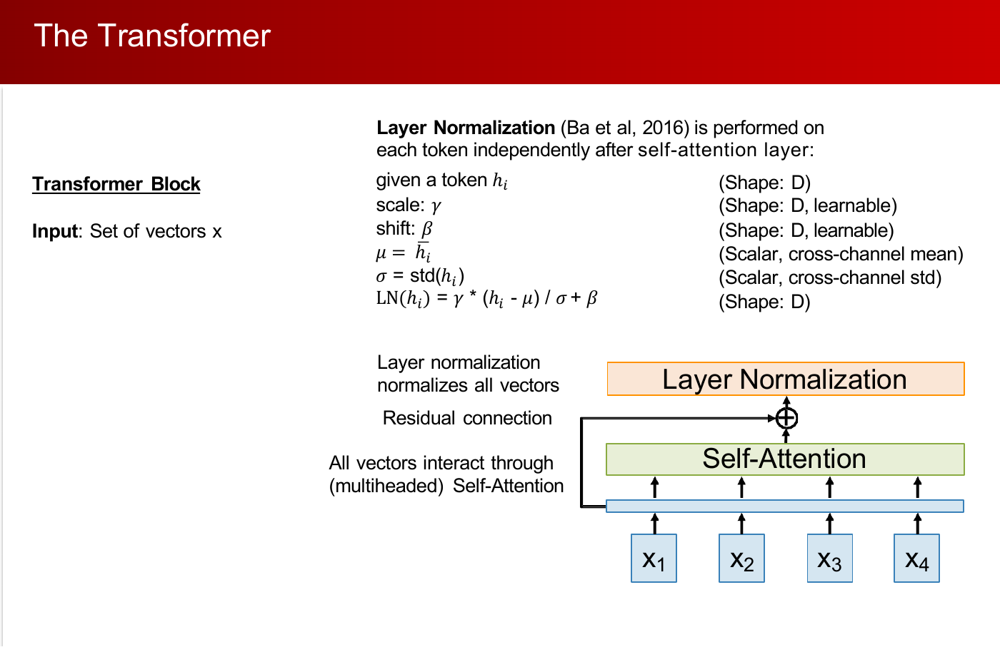

The lecture gives layer normalization per token. For a token vector $h_i$:

$$
\mu = \overline{h_i},\qquad
\sigma = \mathrm{std}(h_i)
$$

$$
\mathrm{LN}(h_i) = \gamma * (h_i - \mu) / \sigma + \beta
$$

Layer normalization is performed independently for each token across channels, not across batch or sequence dimensions.

The feed-forward network inside a transformer block is a tokenwise two-layer MLP:

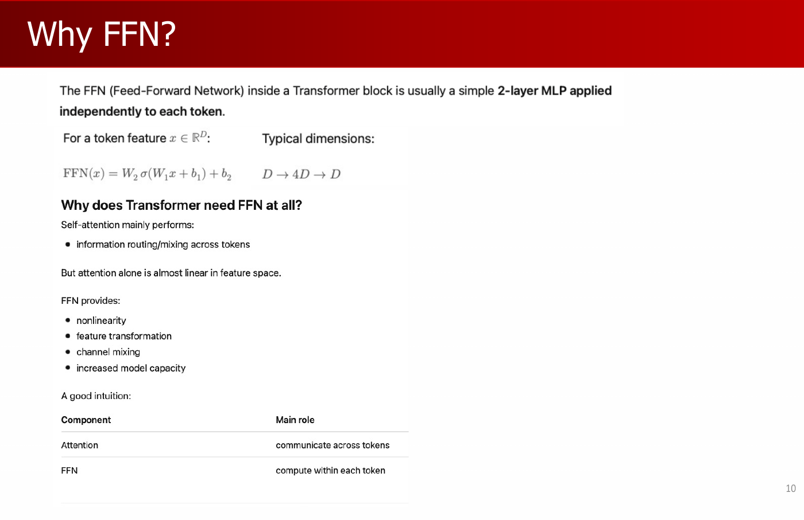

$$
\mathrm{FFN}(x) = W_2 \, \sigma(W_1x + b_1) + b_2
$$

Typical dimensions follow:

$$
D \rightarrow 4D \rightarrow D
$$

Self-attention mainly performs routing and mixing across tokens. FFN adds nonlinearity, feature transformation, channel mixing, and model capacity within each token.

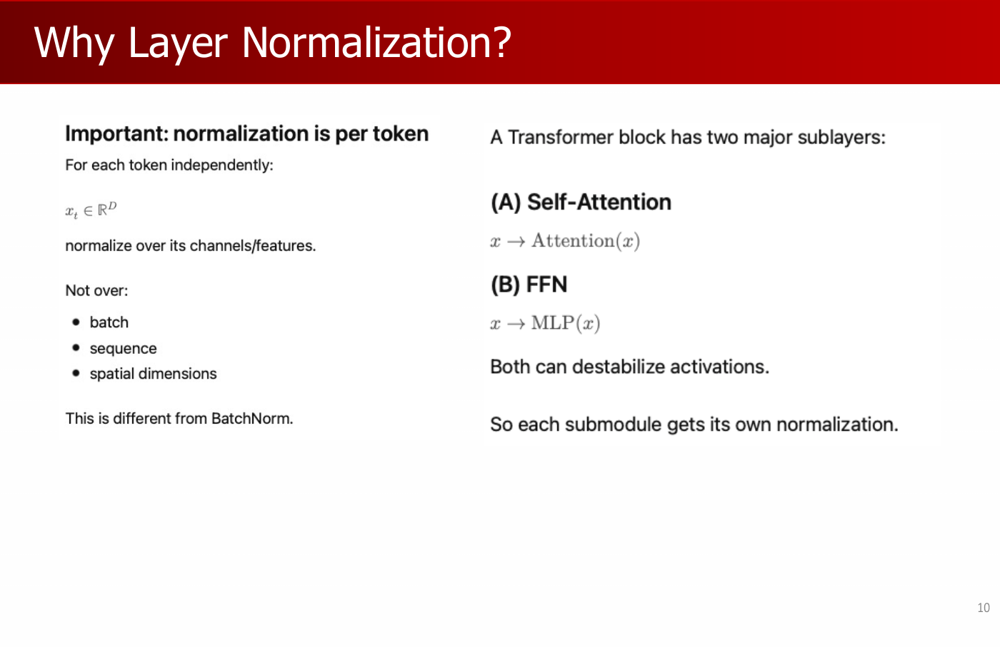

The lecture also asks why layer normalization is needed. Both the self-attention sublayer and the FFN sublayer can destabilize activations, so each submodule gets its own normalization.

:::remark Key question and answer: why does the transformer need FFN at all?
**Question (lecture wording):** **"Why FFN?"**

**Answer:** Attention mostly routes and mixes information across tokens. FFN performs nonlinear computation within each token, increasing expressivity and channel-wise feature transformation.
:::

:::remark Key question and answer: why LayerNorm?
**Question (lecture wording):** **"Why Layer Normalization?"**

**Answer:** Transformer sublayers can destabilize activation scales. LayerNorm normalizes each token over its feature channels, stabilizing optimization without depending on batch statistics.
:::

## 8. Language Modeling with Transformers

For language modeling, the model begins with an embedding matrix of shape $[V \times D]$ that maps tokens to vectors.

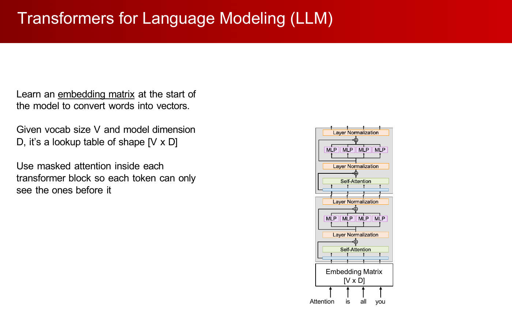

Inside each transformer block, masked self-attention ensures that each token can only see earlier tokens.

At the end, a projection matrix of shape $[D \times V]$ maps each token representation back to logits over the vocabulary:

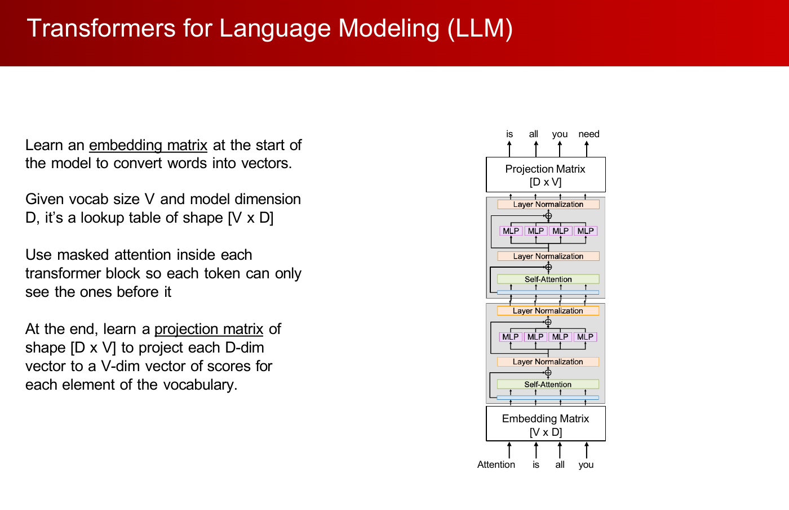

The training objective is next-token prediction with softmax plus cross-entropy loss.

The lecture also highlights how transformer scale has grown: the architecture itself has not changed much since 2017, but models became deeper, wider, and longer-context.

## 9. Common Transformer Tweaks

The lecture groups several widely used modern tweaks under one theme: the architecture stays recognizable, but a few modifications have become common.

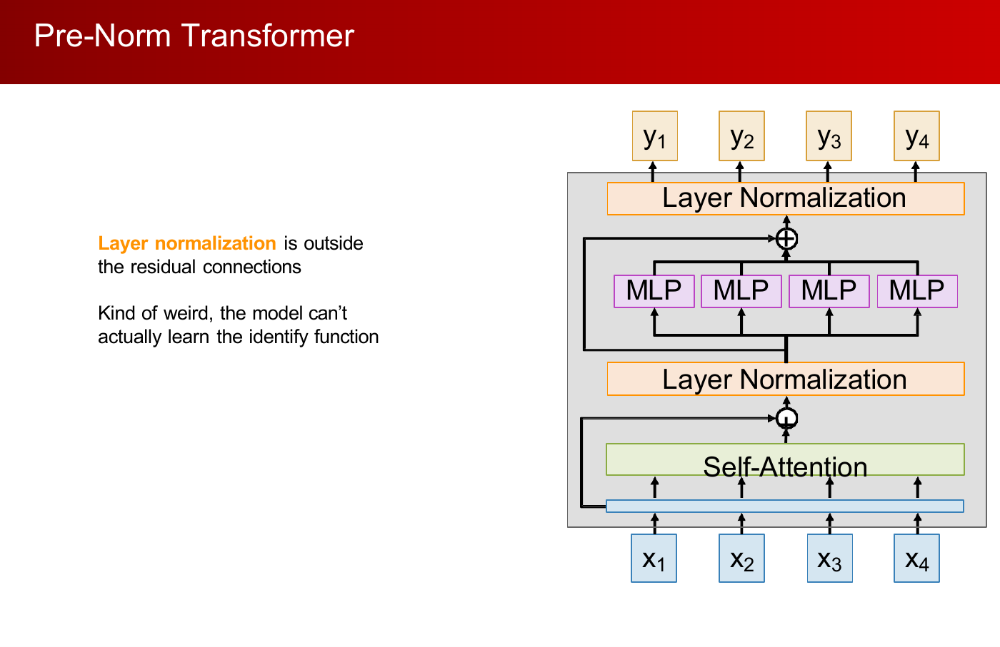

**Pre-Norm** moves layer normalization inside the residual path. This tends to improve optimization stability in deep transformers.

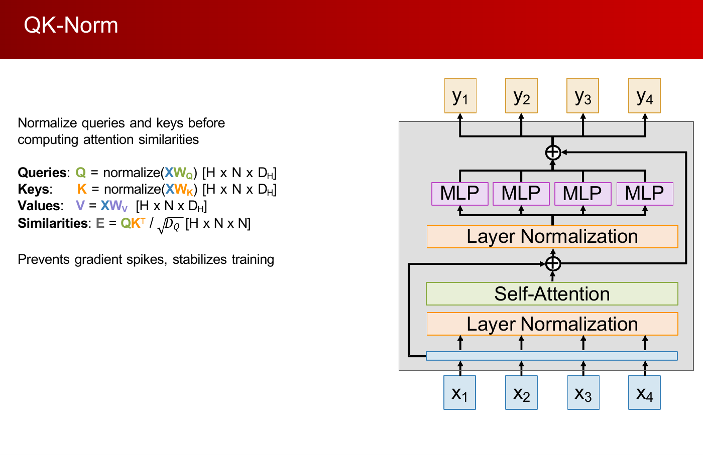

**QK-Norm** normalizes queries and keys before computing similarities:

$$
Q = \mathrm{normalize}(XW_Q),\qquad
K = \mathrm{normalize}(XW_K)
$$

This reduces gradient spikes and stabilizes training.

**Classic MLP** in the block can be written as:

$$
Y = \sigma(XW_1)W_2
$$

**SwiGLU** replaces it with a gated form:

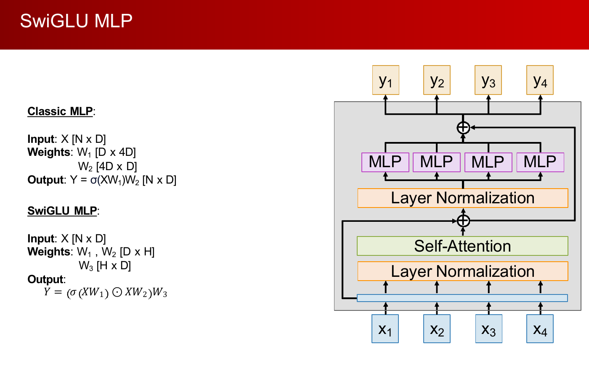

$$
Y = (\sigma(XW_1) \odot XW_2)W_3
$$

This gives a more flexible nonlinear gating mechanism than a plain two-layer MLP.

**Mixture of Experts (MoE)** replaces one shared MLP with multiple experts:

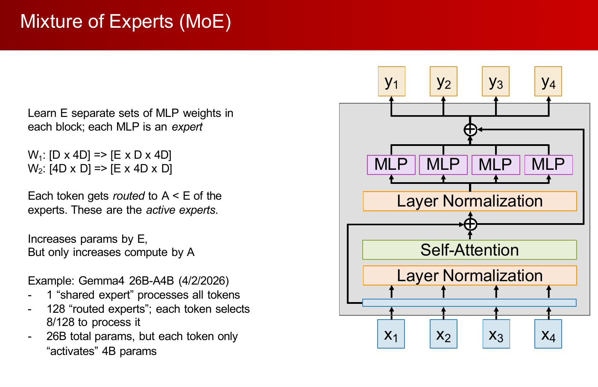

The lecture explains the core tradeoff: parameters can increase by the number of experts $E$, while compute only increases with the number of active experts selected per token.

:::tip Key question and answer: what is the point of MoE?
**Question (original intent):** Why use many experts if only a few are active per token?

**Answer:** MoE increases total parameter capacity without paying full compute cost on every token. Each token only activates a small subset of experts, so the model can be much larger while keeping per-token computation moderate.
:::

## 10. Vision Transformers and Inductive Bias

Vision Transformer converts an image into a sequence of patch tokens.

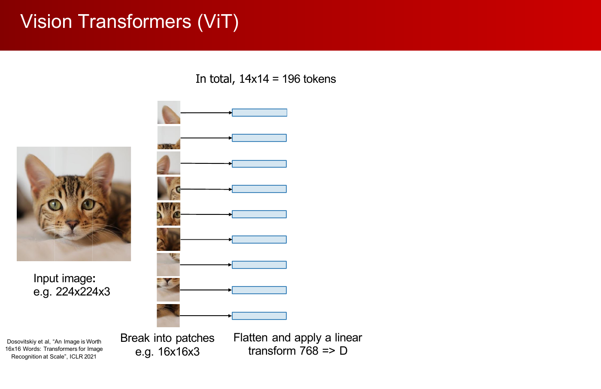

For a $224 \times 224 \times 3$ image with $16 \times 16$ patches, there are:

$$
14 \times 14 = 196 \text{ tokens}
$$

Each patch is flattened and linearly projected:

$$
16 \times 16 \times 3 = 768 \Rightarrow D
$$

The transformer then processes these $D$-dimensional patch vectors, using positional encoding to tell the model the 2D position of each patch.

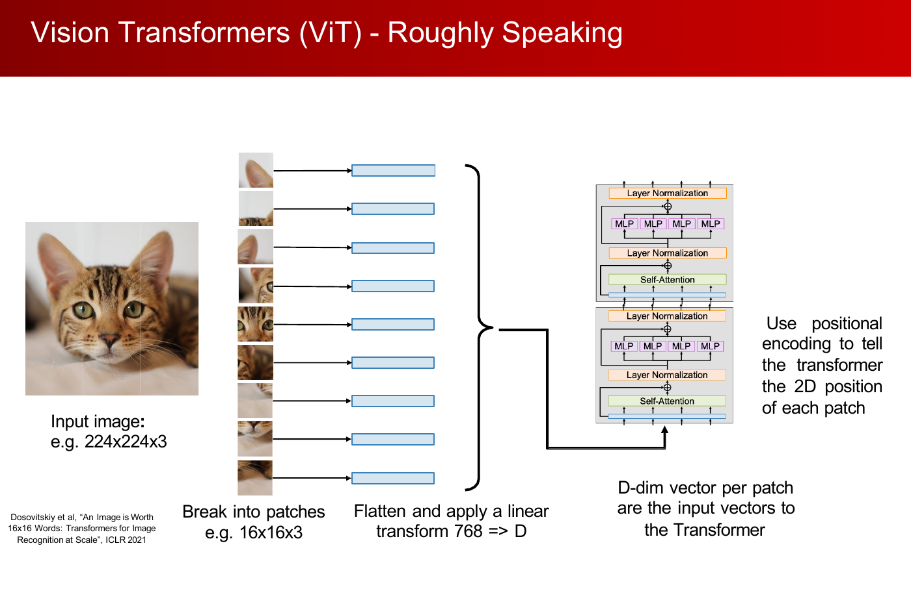

At classification time, the slide uses average pooling over the output patch representations, then a linear layer from $D$ to the number of classes $C$.

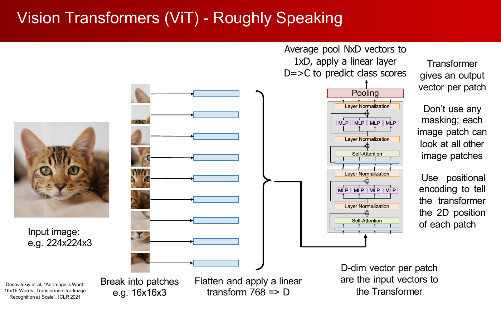

Unlike language modeling, image classification does not use causal masking; every patch can attend to every other patch.

CNNs and ViTs differ strongly in inductive bias.

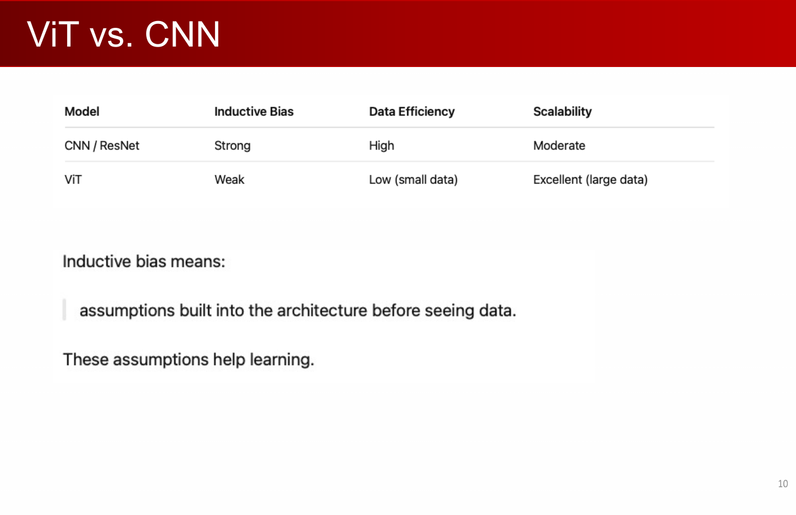

CNNs have strong built-in image assumptions:

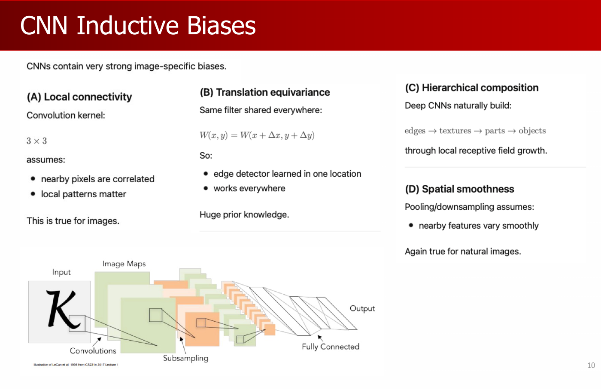

- local connectivity
- translation equivariance
- hierarchical composition
- spatial smoothness

ViT removes most of these hardcoded assumptions:

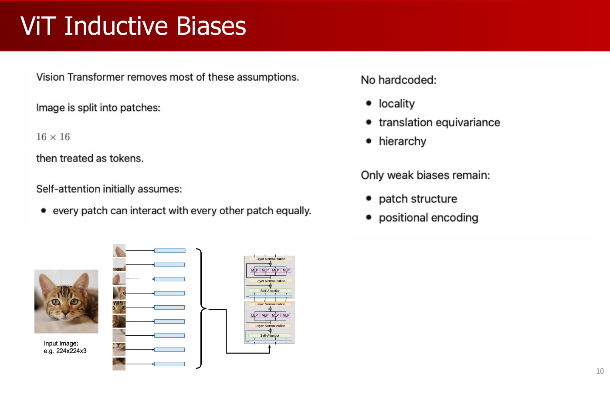

- no hardcoded locality
- no hardcoded translation equivariance
- no hardcoded hierarchy
- only weak biases remain, mainly patch structure and positional encoding

This explains the performance tradeoff:

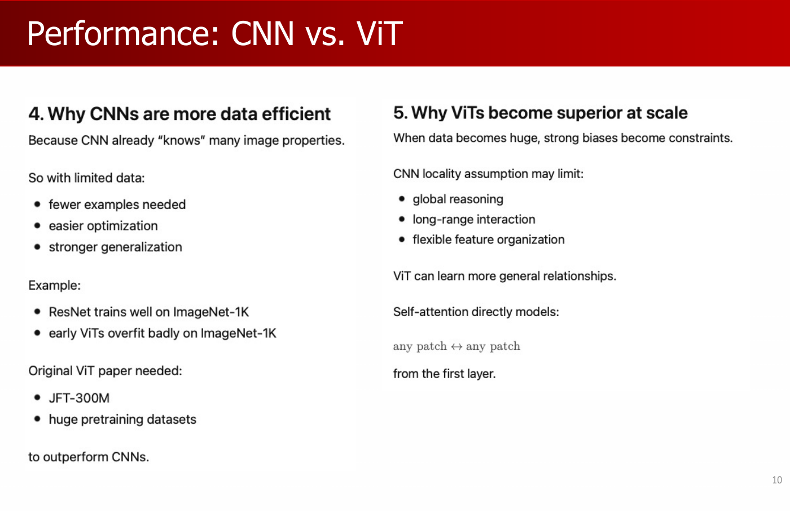

- CNNs are more data-efficient on small and medium datasets because their biases help learning.
- ViTs can win at very large scale because weaker built-in assumptions become less constraining when data is abundant.

:::remark Key question and answer: why do ViTs need more data?
**Question (original intent):** Why are CNNs stronger on small data, while ViTs become superior at scale?

**Answer:** CNN priors encode many useful image assumptions before training, so they learn well from limited data. ViTs have weaker inductive bias, so they usually need more data or pretraining, but this weaker bias becomes an advantage when large-scale data allows the model to learn more general relationships.
:::

## 11. Exam Review

### 11.1 Core Definitions

- Attention: a primitive that operates on sets of vectors by computing weighted sums based on similarity.
- Cross-attention: queries come from one set, keys and values from another.
- Self-attention: queries, keys, and values all come from the same input set.
- Masked self-attention: self-attention with future positions blocked.
- Multi-head attention: several attention heads run in parallel and are then combined.
- Transformer block: self-attention + residual + layer normalization + tokenwise FFN.
- Embedding matrix: lookup table mapping vocabulary items to model vectors.
- Output projection: linear map from model dimension to vocabulary logits.
- Vision Transformer: a transformer operating on image patch tokens.
- Inductive bias: assumptions built into the architecture before seeing data.

### 11.2 Short-Answer Templates

If asked why attention is better than a fixed context vector, answer:

Attention replaces one global bottleneck vector with dynamic access to all input states. The model can gather different information at different output timesteps, which is crucial for long or complex sequences.

If asked what self-attention actually does, answer:

Self-attention lets each token compute similarities to all tokens, normalize them, and read a weighted sum of value vectors. It is a learned content-based communication mechanism across the sequence.

If asked why transformers scale well, answer:

They are built from parallel matrix multiplications, avoid sequential hidden-state dependence, and let every token interact globally from the first layer. This matches modern hardware and large-scale pretraining well.

If asked why ViT is weaker on small data, answer:

ViT removes many strong image-specific priors. That makes it more flexible but less data-efficient, so CNNs usually learn faster and generalize better when data is limited.

### 11.3 Formula Checklist

Seq2seq with attention:

$$
h_t = f_W(x_t, h_{t-1}),\qquad
s_t = g_U(y_{t-1}, s_{t-1}, c)
$$

$$
e_{t,i} = f_{\mathrm{att}}(s_{t-1}, h_i),\qquad
c_t = \sum_i a_{t,i} h_i
$$

Attention:

$$
a_i = \frac{\exp(e_i)}{\sum_j \exp(e_j)}
$$

$$
E = \frac{QK^T}{\sqrt{D}},\qquad
A = \mathrm{softmax}(E),\qquad
Y = AV
$$

LayerNorm:

$$
\mu = \overline{h_i},\qquad
\sigma = \mathrm{std}(h_i),\qquad
\mathrm{LN}(h_i) = \gamma * (h_i - \mu) / \sigma + \beta
$$

FFN and SwiGLU:

$$
\mathrm{FFN}(x) = W_2 \, \sigma(W_1x + b_1) + b_2
$$

$$
Y = (\sigma(XW_1) \odot XW_2)W_3
$$

### 11.4 Common Mistakes

- Treating attention as a black-box alternative to recurrence rather than a weighted retrieval mechanism.
- Forgetting that self-attention cost is dominated by the $N \times N$ similarity matrix.
- Confusing cross-attention with self-attention.
- Saying LayerNorm normalizes across the batch. In this lecture it is per token across channels.
- Saying FFN mixes tokens. FFN works independently on each token; attention mixes across tokens.
- Assuming ViT is always better than CNN. The lecture is explicit that CNNs are usually more data-efficient on smaller datasets.

### 11.5 Self-Check Questions

1. Why does seq2seq attention remove the fixed-context bottleneck?
2. Why is the dot product divided by $\sqrt{D}$?
3. What changes when keys and values are separated from raw data vectors?
4. Why is masked self-attention necessary for language modeling?
5. Why does self-attention have quadratic memory cost in sequence length?
6. What does FFN contribute that attention alone does not?
7. Why is layer normalization done per token?
8. How does QK-Norm stabilize training?
9. Why can MoE increase parameter count faster than compute cost?
10. Why do ViTs usually need more data than CNNs?
