# 第十三讲：生成模型 I

## 1. 生成模型、判别模型与条件生成

这一讲研究的重点不再只是“给样本分类”，而是“理解数据本身如何分布”。这正是从判别学习走向生成学习的核心变化。

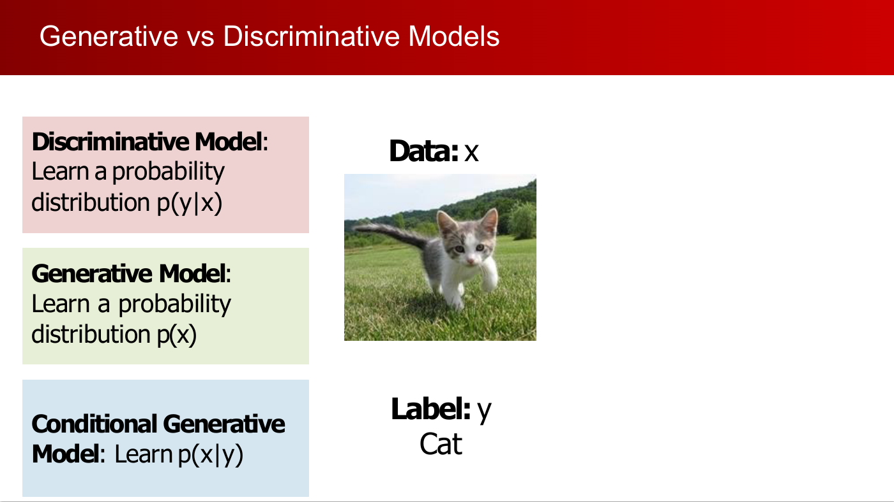

**关键定义（尽量保留讲义原话）：**

- **Discriminative Model: Learn a probability distribution \(p(y \mid x)\)**
- **Generative Model: Learn a probability distribution \(p(x)\)**
- **Conditional Generative Model: Learn \(p(x \mid y)\)**

它们在实际中的区别可以概括为：

- 判别模型关注的是“从输入到标签”的预测。
- 生成模型试图解释“数据样本是怎样产生出来的”。
- 条件生成模型则是在给定条件的前提下生成数据，例如给定类别、文本提示或另一种模态。

生成建模还可以通过 Bayes 公式与判别学习联系起来：

$$
P(x \mid y) = \frac{P(y \mid x) P(x)}{P(y)}
$$

如果我们知道似然项和先验项，就可以构造条件分布。这也是为什么生成模型不仅能做合成，还能支持推断任务。

:::remark 关键问题与解答：为什么要学 \(p(x)\)，而不只学 \(p(y \mid x)\)？
**问题（原意复述）：** 如果分类已经可以直接用 \(p(y \mid x)\) 做得很好，为什么还要关心 \(p(x)\)？

**解答：** 因为 \(p(x)\) 描述的是数据本身的结构。有了对数据分布的理解，模型就不仅能分类，还能做采样、密度估计、不确定性建模、缺失信息推断，甚至在某些场景下反过来帮助条件推断。
:::

## 2. 为什么生成模型重要

这一讲最重要的动机是“歧义性”。很多任务并不存在唯一正确输出。

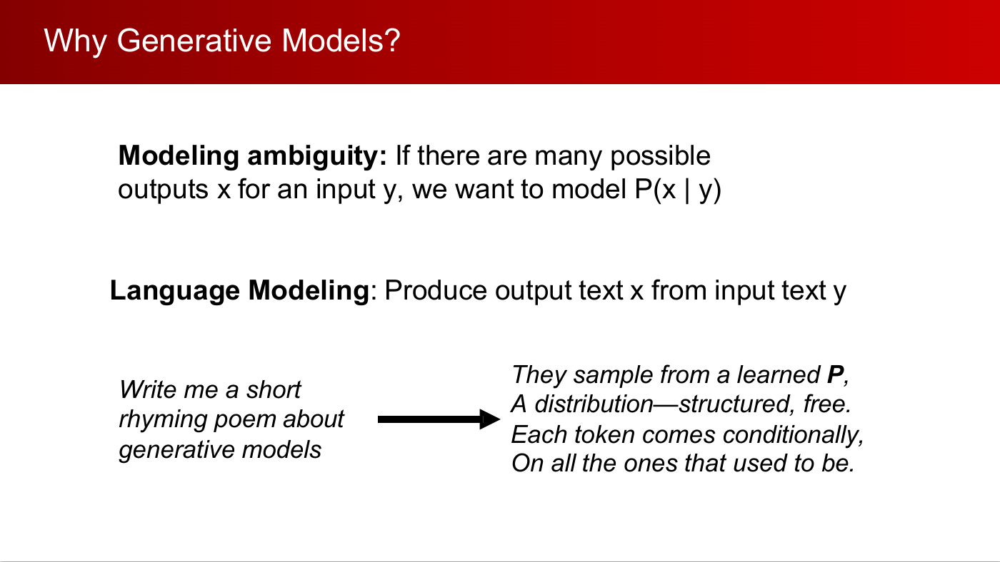

**关键表述（讲义原话）：** **"Modeling ambiguity: If there are many possible outputs \(x\) for an input \(y\), we want to model \(P(x \mid y)\)."**

这类场景包括：

- 语言建模：一句话往后可以有很多合理续写；
- 文生图：同一段提示词可以对应很多不同但都合理的图像；
- 图像到视频、世界模型：未来本身就带有不确定性。

如果只用确定性预测器，模型往往会把多种可能性压成一个“平均答案”。而生成模型的目标是表示“所有合理答案的分布”。

:::remark 关键问题与解答：为什么多解任务更需要生成模型？
**问题（原意复述）：** 当一个输入对应多个正确输出时，为什么生成建模更合适？

**解答：** 因为这时目标已经不是输出一个点估计，而是表达一整个可能性分布。生成模型天然就是为这种“一对多”问题设计的。
:::

## 3. 生成模型的分类框架

这一讲按照“能否显式计算密度”以及“如何采样”来组织生成模型。

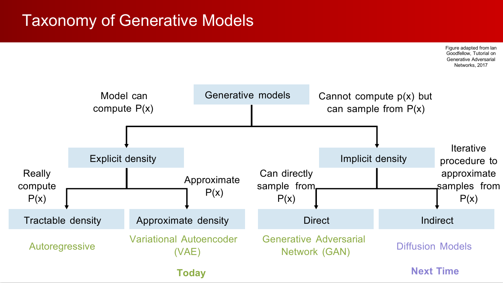

本讲对应的分类是：

- **显式密度、可 tractable 计算：** autoregressive models。
- **显式密度、只能近似：** variational autoencoders, VAE。
- **隐式密度、可直接采样：** generative adversarial networks, GAN。
- **隐式密度、需要迭代采样：** diffusion models，下一讲再讲。

这个分类有用，是因为不同方法在下面几件事上取舍不同：

- 似然是否可计算；
- 样本质量是否高；
- 模式覆盖是否全面；
- 训练是否稳定；
- 是否支持 latent inference。

:::tip 关键组织线索
如果模型能给出可用的 \(p(x)\)，训练目标通常更“正统”，但代价可能是计算复杂或只能近似；如果模型放弃显式密度，采样会更直接，但训练目标和评估方式往往更绕。
:::

## 4. 最大似然与自回归模型

讲义先回到最经典的生成建模视角：最大似然。

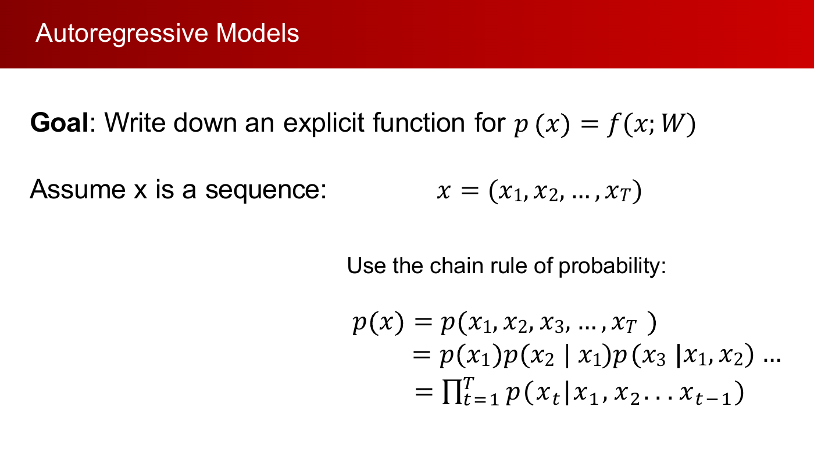

先写出一个显式密度模型

$$
p(x) = f(x; W)
$$

再用最大似然训练：

$$
W^* = \arg\max_W \prod_i p(x^{(i)})
$$

对于序列数据，概率链式法则给出一个完全精确的分解：

$$
p(x) = \prod_{t=1}^{T} p(x_t \mid x_1, x_2, \ldots, x_{t-1})
$$

这就是 autoregressive modeling 的基础。模型每一步都在“给定前文，预测下一个元素”。

大语言模型就是这一思想在文本上的典型应用：把文本按 token 顺序分解。讲义接着把同样的逻辑推广到图像。

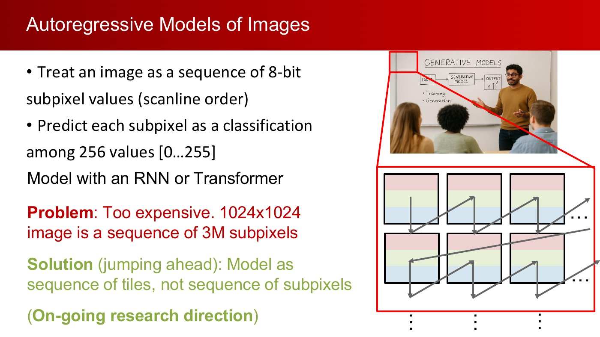

图像也可以被看成一个很长的子像素序列。从理论上看，这样做有显式密度、也能做精确似然训练；但从工程上看，图像序列太长，训练和采样都很贵。

:::remark 关键问题与解答：自回归模型最大的优点是什么？
**问题（原意复述）：** 为什么 autoregressive model 是一种非常“干净”的生成建模框架？

**解答：** 因为链式法则把全局密度 \(p(x)\) 拆成了一串条件概率，训练时可以直接做精确最大似然。也就是说，它既有显式密度，又有清晰、严格的训练目标。
:::

:::warn 关键局限
自回归图像生成在概念上很直接，但计算代价很高。采样必须按顺序进行，而高分辨率图像对应的序列又特别长，因此速度往往很慢。
:::

## 5. 从概率自编码器到变分自编码器

概率自编码器引入了一个 latent variable \(z\)。它不再直接写 \(p(x)\)，而是假设数据是这样生成的：先从简单先验里采样 \(z\)，再根据 \(z\) 解码出 \(x\)。

对应的边缘似然是

$$
p_\theta(x) = \int p(z)\, p_\theta(x \mid z)\, dz
$$

这个形式很自然，但积分通常不可解。

讲义的解决办法是学习一个近似后验：

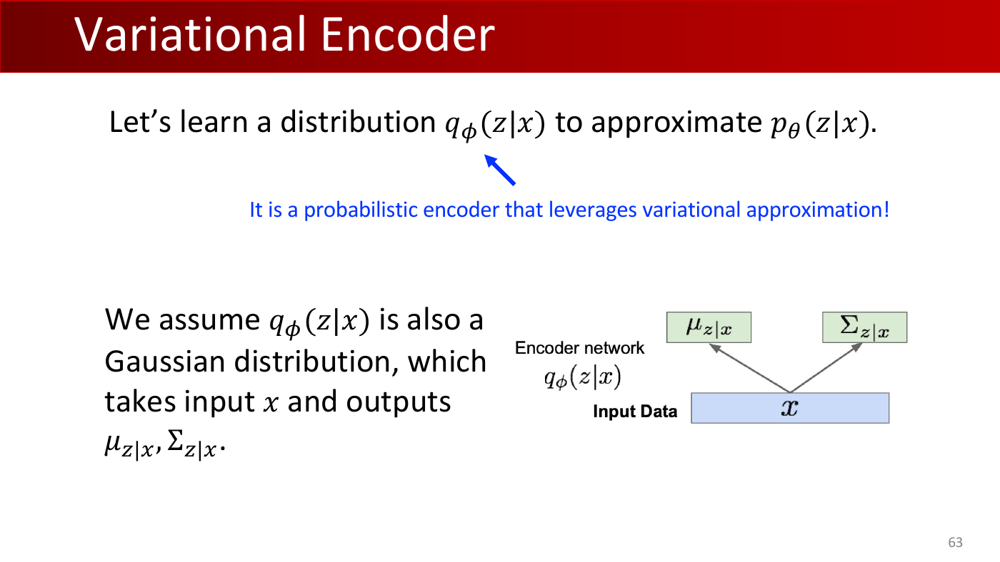

$$
q_\phi(z \mid x)
$$

**关键表述（讲义原话）：** **"Let's learn a distribution \(q_\phi(z \mid x)\) to approximate \(p_\theta(z \mid x)\)."**

因此 encoder 不再是确定性的，而是输出一个分布，通常设成 Gaussian：

- 均值 \(\mu_{z \mid x}\)
- 协方差 \(\Sigma_{z \mid x}\)

这也是 VAE 与普通 autoencoder 的本质区别：它是 probabilistic autoencoder。

:::remark 关键问题与解答：为什么直接训练会不可解？
**问题（讲义原意）：** **"How to train?"** 为什么不能直接最大化 \(p_\theta(x)\)？

**解答：** 因为 latent variable 需要被积分掉：
$$
p_\theta(x) = \int p(z)\, p_\theta(x \mid z)\, dz
$$
对于高维 latent space，这个积分通常不可 tractable 计算，所以必须改写成更容易优化的目标。
:::

:::remark 关键问题与解答：为什么朴素 Monte Carlo 不行？
**问题（原意复述）：** 为什么不直接从 \(p(z)\) 里采很多样本，做 Monte Carlo 近似积分？

**解答：** 因为对某个给定样本 \(x\) 来说，大多数先验样本 \(z \sim p(z)\) 都和它关系不大。尤其在高维空间里，这些样本往往落在几乎不给 \(p_\theta(x \mid z)\) 提供贡献的区域，所以估计效率极低。
:::

## 6. ELBO：VAE 的训练目标

讲义推导了一个可优化的 likelihood 下界。

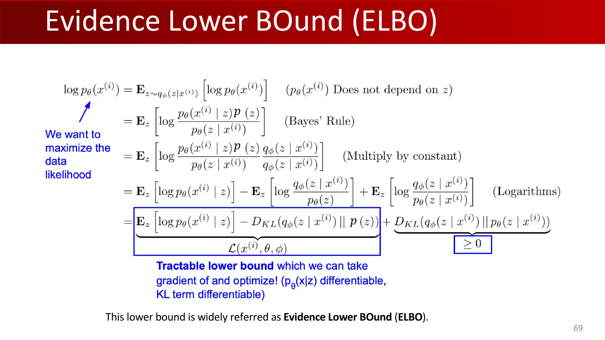

关键分解是：

$$
\log p_\theta(x^{(i)})
=
\mathbb{E}_{z}\left[\log p_\theta(x^{(i)} \mid z)\right]
- D_{KL}\!\left(q_\phi(z \mid x^{(i)}) \,\|\, p(z)\right)
+ D_{KL}\!\left(q_\phi(z \mid x^{(i)}) \,\|\, p_\theta(z \mid x^{(i)})\right)
$$

由于最后一个 KL 项总是非负，于是得到 Evidence Lower Bound：

$$
\mathcal{L}(x^{(i)}, \theta, \phi)
=
\mathbb{E}_{z}\left[\log p_\theta(x^{(i)} \mid z)\right]
- D_{KL}\!\left(q_\phi(z \mid x^{(i)}) \,\|\, p(z)\right)
\le \log p_\theta(x^{(i)})
$$

所以最大化 ELBO，本质上是在近似最大化 likelihood，同时让近似后验不要偏离先验太远。

ELBO 中两个核心项分别表示：

- reconstruction term：要求 decoder 能把观测数据解释好；
- KL term：约束 latent distribution 规整、连续、可采样。

讲义还给出了实践中常用的 Gaussian KL 公式。

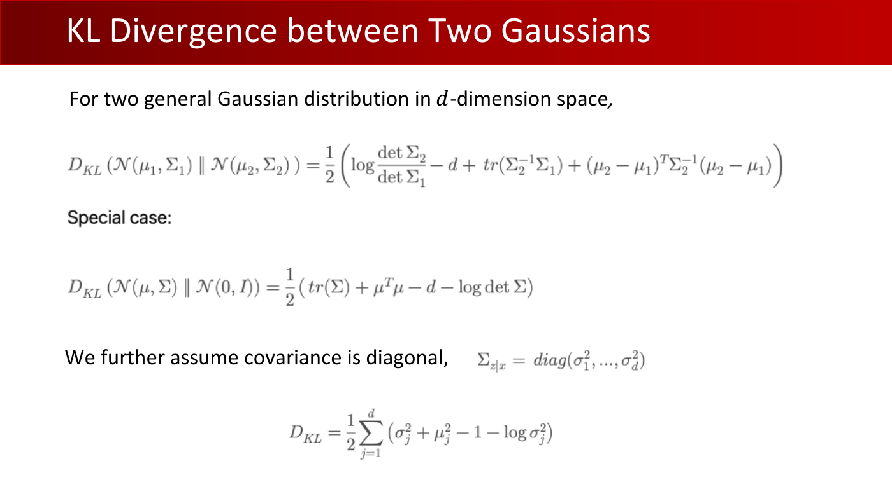

对于两个 Gaussian：

$$
D_{KL}\!\left(\mathcal{N}(\mu_1, \Sigma_1)\,\|\,\mathcal{N}(\mu_2, \Sigma_2)\right)
= \frac{1}{2}\left(
\log \frac{\det \Sigma_2}{\det \Sigma_1}
- d + \mathrm{tr}(\Sigma_2^{-1}\Sigma_1)
+ (\mu_2-\mu_1)^T\Sigma_2^{-1}(\mu_2-\mu_1)
\right)
$$

对于常用先验 \( \mathcal{N}(0, I) \)：

$$
D_{KL}\!\left(\mathcal{N}(\mu, \Sigma)\,\|\,\mathcal{N}(0, I)\right)
= \frac{1}{2}\left(\mathrm{tr}(\Sigma) + \mu^T\mu - d - \log \det \Sigma\right)
$$

如果 \(\Sigma_{z \mid x}\) 是对角阵，

$$
\Sigma_{z \mid x} = \mathrm{diag}(\sigma_1^2, \ldots, \sigma_d^2)
$$

则

$$
D_{KL} = \frac{1}{2}\sum_{j=1}^{d} \left(\sigma_j^2 + \mu_j^2 - 1 - \log \sigma_j^2\right)
$$

:::remark 关键问题与解答：为什么优化 ELBO 就够了？
**问题（原意复述）：** ELBO 只是下界，为什么可以拿它做训练目标？

**解答：** 因为它可计算、可微，而且与 likelihood 有直接联系。最大化 ELBO 一方面提高重构能力，另一方面缩小近似后验与真实后验之间的差距。
:::

## 7. 重参数化、VAE 训练流程与 VAE 的行为特征

接下来的难点是：怎样让采样也能反向传播？

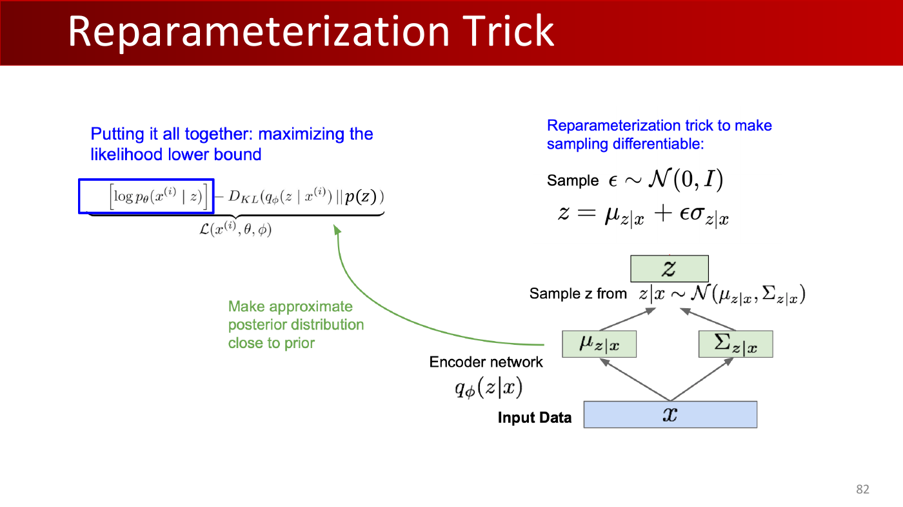

讲义使用 reparameterization trick：

$$
\epsilon \sim \mathcal{N}(0, I),\qquad
z = \mu_{z \mid x} + \epsilon \sigma_{z \mid x}
$$

这样做的关键是把随机性挪到 \(\epsilon\) 里，而把 \(\mu_{z \mid x}\) 和 \(\sigma_{z \mid x}\) 留在可微计算图中。

完整训练流程如下：

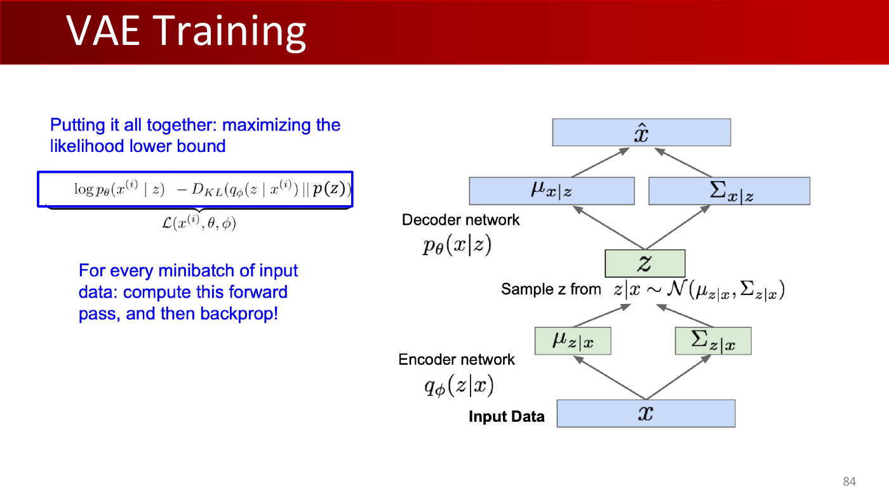

- 先把 \(x\) 编码成 \(\mu_{z \mid x}\) 和 \(\Sigma_{z \mid x}\)；
- 用重参数化方式采样 \(z\)；
- 再把 \(z\) 解码成 \(\hat{x}\) 的条件分布；
- 最后对 ELBO 做前向计算和反向传播。

在采样阶段，则不需要 encoder，直接从 \(z \sim p(z)\) 开始，再经过 decoder 生成数据。

讲义还给出了几个关于 VAE 行为的重要 insight：

- VAE 通常训练更稳定；
- 它天然支持 latent inference，因为 encoder 被一起学出来了；
- 生成图像常常偏模糊，尤其当 decoder 使用较简单的像素级概率假设时；
- 相比 GAN，它通常能覆盖更多数据模式。

:::remark 关键问题与解答：重参数化为什么有效？
**问题（讲义原意）：** **"How to backprop through \(z\)?"**

**解答：** 把采样改写成噪声的确定性变换：
$$
z = \mu_{z \mid x} + \epsilon \sigma_{z \mid x},\qquad \epsilon \sim \mathcal{N}(0, I)
$$
这样梯度就能流过 \(\mu\) 和 \(\sigma\)，而随机性由 \(\epsilon\) 承担。
:::

:::remark 关键问题与解答：为什么 VAE 图像常常模糊？
**问题（原意复述）：** VAE 生成图像常见的“发糊”现象是怎么来的？

**解答：** 因为 decoder 训练时是在最大化一个平滑的概率重构目标。当多个输出都合理时，模型往往会在像素空间做“平均化”，从而把高频细节抹平。
:::

:::remark 关键问题与解答：为什么叫“变分”？
**问题（讲义原意）：** 为什么这个 probabilistic autoencoder 被称为 **"variational"**？

**解答：** 因为它来自 variational inference。我们先选一个近似后验分布族 \(q_\phi(z \mid x)\)，再在这个分布族上优化，去逼近真实后验。这里的“variational”指的就是“在函数或分布空间上做优化”。
:::

## 8. GAN：通过对抗训练做隐式生成

GAN 走的是另一条路线。它不显式建模 likelihood，而是直接学习“生成足够真实、能骗过判别器的样本”。

讲义用一个很自然的问题引出 GAN：如果我们干脆放弃显式密度，只关心会不会采样，会怎样？

标准 minimax 博弈写成：

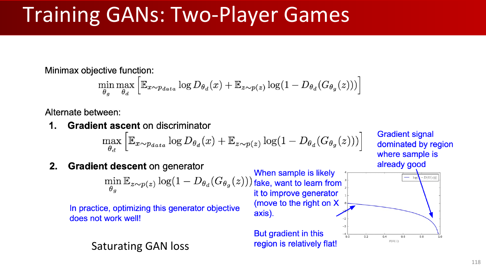

$$
\min_{\theta_g}\max_{\theta_d}
\left[
\mathbb{E}_{x \sim p_{data}} \log D_{\theta_d}(x)
+ \mathbb{E}_{z \sim p(z)} \log\!\left(1 - D_{\theta_d}(G_{\theta_g}(z))\right)
\right]
$$

其中 discriminator 负责区分真假，generator 负责生成骗过 discriminator 的样本。

讲义特别强调，原始 generator 目标会出现 saturating 问题。如果生成样本一开始很差，那么

$$
\min_{\theta_g}
\mathbb{E}_{z \sim p(z)} \log\!\left(1 - D_{\theta_d}(G_{\theta_g}(z))\right)
$$

提供给 generator 的梯度可能会很弱。

所以实践中通常改用 non-saturating 目标：

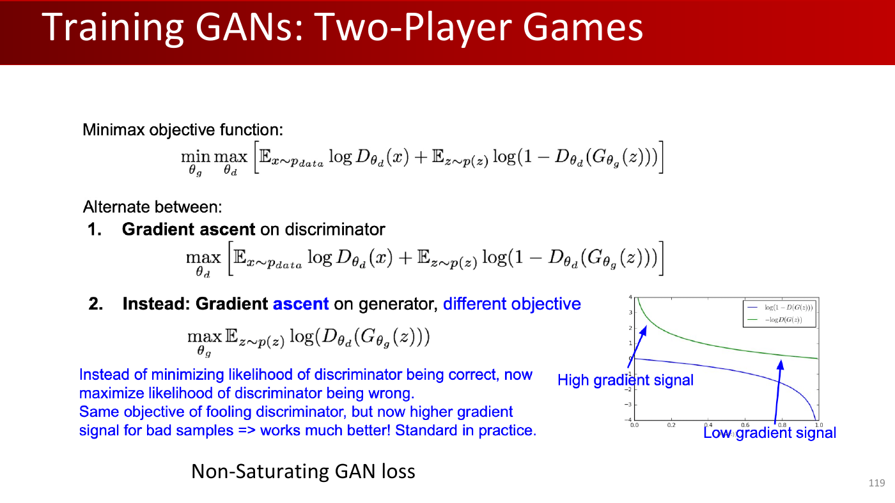

$$
\max_{\theta_g}
\mathbb{E}_{z \sim p(z)} \log\!\left(D_{\theta_d}(G_{\theta_g}(z))\right)
$$

这样虽然目标仍然是“骗过判别器”，但在坏样本阶段能给 generator 更强的梯度信号。

讲义还给出了 DCGAN 风格的一组经典结构经验：

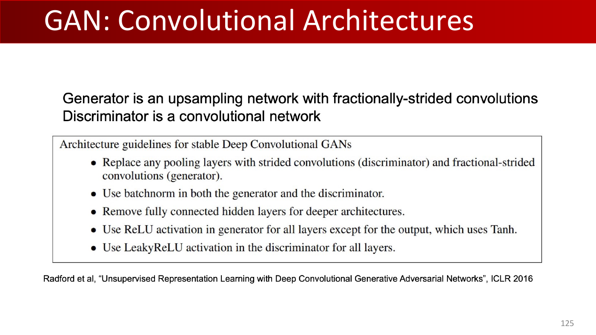

- discriminator 中用 stride convolution 替代 pooling；
- generator 中用 fractionally strided convolution 做上采样；
- 两边都使用 batch normalization；
- 更深的图像结构里移除全连接隐藏层；
- generator 输出层之外使用 ReLU；
- discriminator 使用 LeakyReLU。

:::remark 关键问题与解答：VAE 和 GAN 的训练本质差别是什么？
**问题（原意复述）：** 两者都能生成数据，但训练方式到底差在哪里？

**解答：** VAE 优化的是与 likelihood 直接相关的 ELBO；GAN 并不优化显式密度，而是通过 generator 与 discriminator 的对抗博弈来学习。
:::

:::warn 关键问题：为什么 GAN 难训练？
**问题（原意复述）：** GAN 为什么效果强，但训练又常常很脆弱？

**解答：** 因为它的目标依赖于一个不断变化的对手。generator 的梯度取决于当前 discriminator，discriminator 的行为又取决于当前 generator。这种耦合优化很容易导致不稳定、梯度消失、振荡或 mode collapse。
:::

## 9. GAN 的评估与 VAE vs. GAN

由于 GAN 没有像 likelihood 那样直接清晰的训练指标，评估就变得尤其重要。

讲义介绍了 Fréchet Inception Distance, FID。

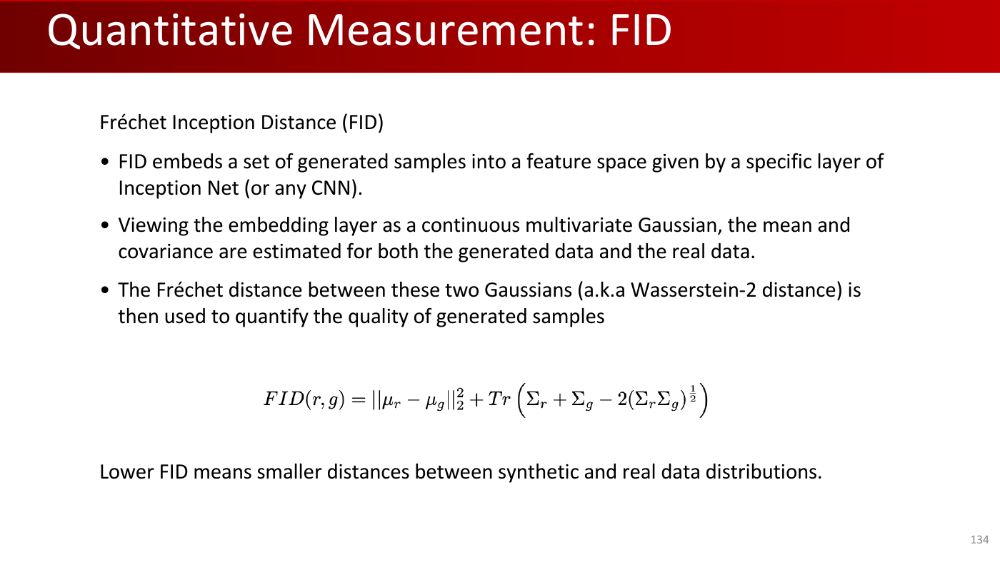

做法是把生成图像与真实图像都送入一个特征空间，常见选择是 Inception 网络的某一层表示。然后把两组特征都近似成 Gaussian，分别估计 \((\mu_r, \Sigma_r)\) 和 \((\mu_g, \Sigma_g)\)，再计算

$$
\mathrm{FID}(r, g)
= \|\mu_r - \mu_g\|_2^2
+ \mathrm{Tr}\!\left(\Sigma_r + \Sigma_g - 2(\Sigma_r \Sigma_g)^{\frac{1}{2}}\right)
$$

FID 越低，说明生成分布在该特征空间里越接近真实分布。

讲义最后给出了一个非常重要的对照总结：

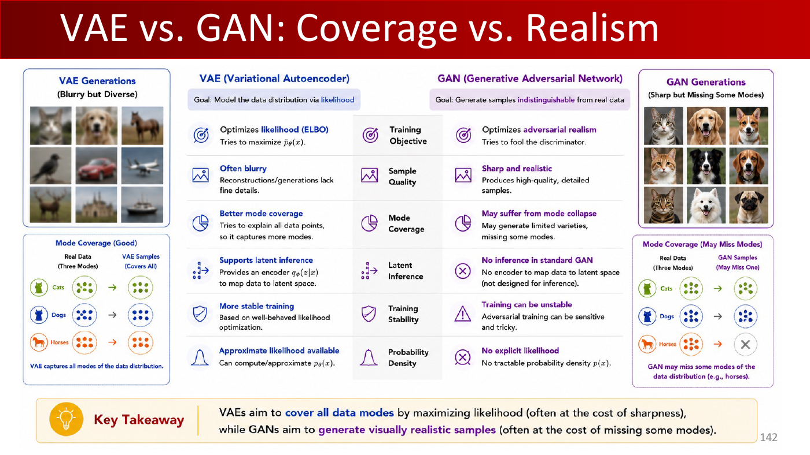

- **VAE：** 模式覆盖更好、支持 latent inference、训练更稳定、可得到近似 likelihood，但样本常常更模糊。
- **GAN：** 样本更锐利、更逼真，没有显式 likelihood，标准形式下 latent inference 弱，容易 mode collapse，训练也更不稳定。

这一讲的核心结论可以概括为：

- VAE 更偏向优化 **coverage**；
- GAN 更偏向优化 **realism**。

:::remark 关键问题与解答：FID 低就一定代表“更好”吗？
**问题（原意复述）：** FID 到底在衡量什么？使用时要注意什么？

**解答：** FID 衡量的是特征空间中的分布接近程度，并不是“语义完美度”的直接刻画。它很好用，但仍然只是代理指标，通常还要结合视觉观察、多样性检查和具体任务评估一起看。
:::

## 10. 考试复习

### 10.1 必会定义

- **生成模型：** 建模数据分布，通常是 \(p(x)\) 或 \(p(x \mid y)\)。
- **判别模型：** 建模标签在给定数据下的分布，通常是 \(p(y \mid x)\)。
- **自回归模型：** 把 \(p(x)\) 分解成一串条件概率的乘积。
- **VAE：** 通过最大化 ELBO 训练的 latent-variable 生成模型。
- **GAN：** 由 generator 和 discriminator 对抗训练得到的隐式生成模型。
- **ELBO：** 对数似然的一个可优化下界。
- **FID：** 生成数据分布与真实数据分布在特征空间中的距离指标。

### 10.2 机制与对比

- 自回归模型有显式且可 tractable 计算的 likelihood，但采样是顺序的、速度慢。
- VAE 支持 latent inference、训练稳定，但图像锐度往往要吃亏。
- GAN 的视觉真实性很强，但没有显式密度，优化更不稳定。
- VAE 属于 approximate-density model；GAN 属于 implicit-density model。

### 10.3 简答题模板

- **Why generative models?**  
因为很多任务存在不确定性和一对多映射，必须建模“可能输出的分布”，而不是只给一个确定答案。

- **Why is VAE training intractable without approximation?**  
因为 \(p_\theta(x)\) 需要对 latent variable 做积分，高维情况下通常不可 tractable 计算。

- **Why use ELBO?**  
因为它是 \(\log p_\theta(x)\) 的可微下界，并且自然分成 reconstruction 与 KL regularization 两部分。

- **Why use the reparameterization trick?**  
因为直接采样会阻断梯度，而 \(z=\mu+\epsilon\sigma\) 可以把随机性和可学习参数分开。

- **Why use non-saturating GAN loss?**  
因为它能在坏样本阶段为 generator 提供更强的梯度信号。

- **How do VAE and GAN differ?**  
VAE 更强调 likelihood-based coverage 与 inference；GAN 更强调 adversarial realism 与样本清晰度。

### 10.4 常见误区

- 不要说标准 GAN 能给出 tractable 的 \(p(x)\)；它做不到。
- 不要把真实后验 \(p_\theta(z \mid x)\) 和近似后验 \(q_\phi(z \mid x)\) 混为一谈。
- 不要忘记 ELBO 是下界，不是精确的 log-likelihood。
- 不要把 FID 说成像素距离；它是在 learned feature space 中计算的。
- 不要把“样本更锐利”误解成“模式覆盖更全面”。

### 10.5 自检清单

- 你能解释 explicit density 和 implicit density 的区别吗？
- 你能从链式法则推出 autoregressive factorization 吗？
- 你能说清楚 ELBO 两项分别在做什么吗？
- 你能不混淆“随机噪声”和“可学习参数”地解释 reparameterization 吗？
- 你能说明为什么 GAN 往往更清晰、但更容易丢模式吗？
