# 第十四讲：大模型 II - 视频 Transformer 与多模态基础模型

## 1. 从图像 Transformer 到视频 Transformer

视频不是一张更大的图像。视频是一串二维帧，所以视频模型必须同时理解空间内容和时间变化。短视频可以把 ViT 从图像 patch 扩展到 video tokens，但 token 数量会迅速膨胀。

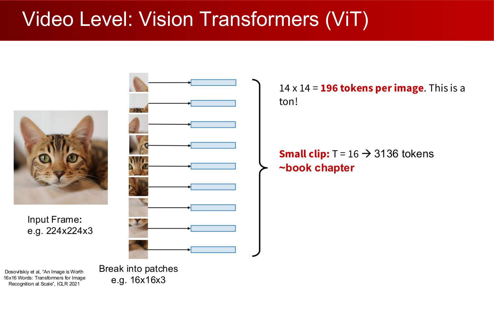

对于一帧 \(224 \times 224\) 图像，如果使用 \(16 \times 16\) patch：

$$
14 \times 14 = 196 \text{ tokens per image},\qquad
T = 16 \Rightarrow 3136 \text{ tokens}
$$

更长的视频会更夸张：

$$
5 \text{ minutes at } 24\text{ fps} \Rightarrow 1{,}411{,}200 \text{ tokens}
$$

核心困难很明确：视频多了时间维，而 transformer attention 在 token 数量变大时会非常昂贵。

:::remark 关键问题与解答：为什么 vanilla ViT 用在视频上很贵？
**问题（原意复述）：** 为什么不能直接把 image-level ViT 用到每一帧，再让所有 tokens 彼此 attention？

**解答：** 因为每一帧都会产生很多 patch tokens，而 self-attention 的开销会随 token 数量近似二次增长。即使是短 clip 也可能有几千个 tokens，长视频就更不可行。
:::

## 2. 提升视频 Transformer 效率的两条路线

让 video transformer 变高效，通常有两条大路线。

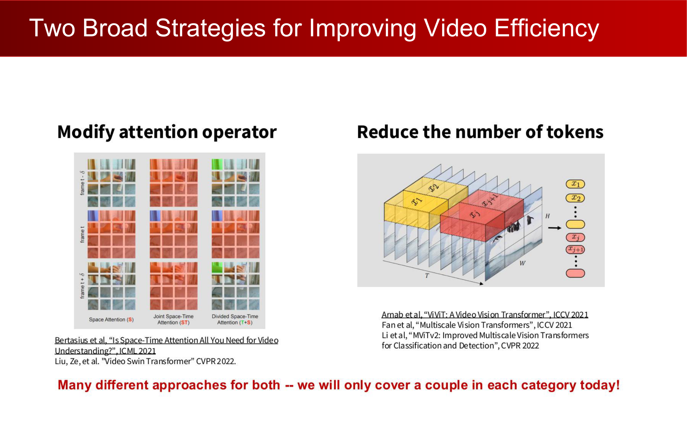

- **修改 attention operator：** 保留较多 tokens，但限制或分解 attention 的计算方式。
- **减少 token 数量：** 让单个 token 覆盖更大的时空区域，或在中间层压缩 token 序列。

这两条路线可以互补。Divided space-time attention 和 Video Swin 主要是在改 attention；tubelets 和 MViT 主要是在减少 tokens。

:::tip 关键组织线索
视频效率通常不是靠一个技巧解决的。一个模型往往既需要更合适的 attention 结构，也需要更少的 tokens。
:::

## 3. Joint、Divided 与 Windowed Space-Time Attention

最直接的视频 attention 是 joint space-time attention：所有空间和时间 tokens 一起互相 attention。

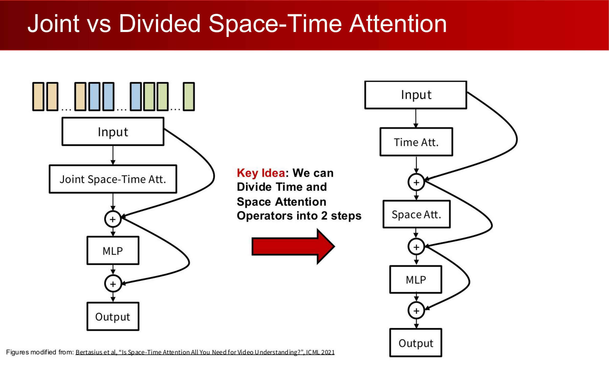

**关键思想（讲义原话）：** **"We can Divide Time and Space Attention Operators into 2 steps."**

Divided space-time attention 会先在同一空间位置上沿时间做 attention，再在空间位置之间做 attention。

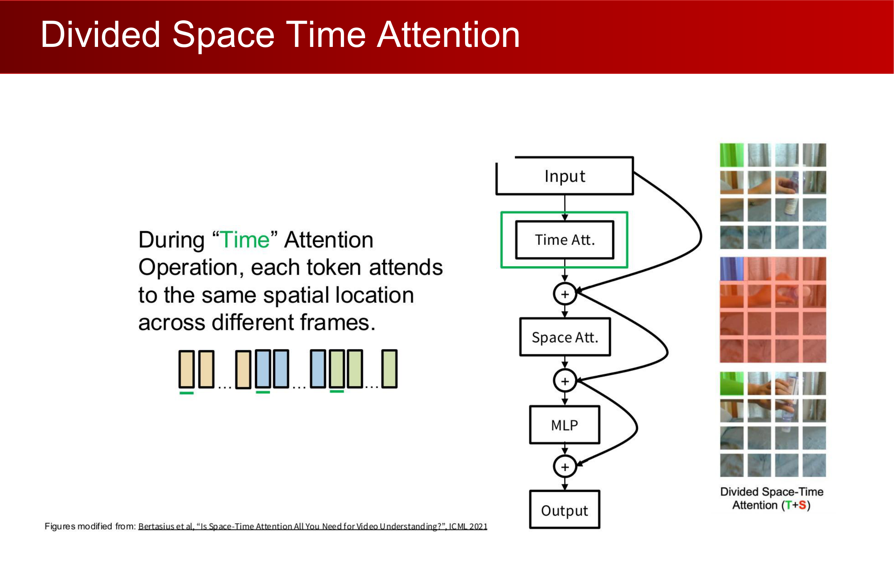

在 time attention 中，每个 token 关注不同帧中相同空间位置的 token；在 space attention 中，tokens 再在同一帧内部交互。这样既降低开销，也给模型加入了合理的归纳偏置：时间对应关系和空间上下文被分开建模。

Video Swin Transformer 走的是另一条路线：

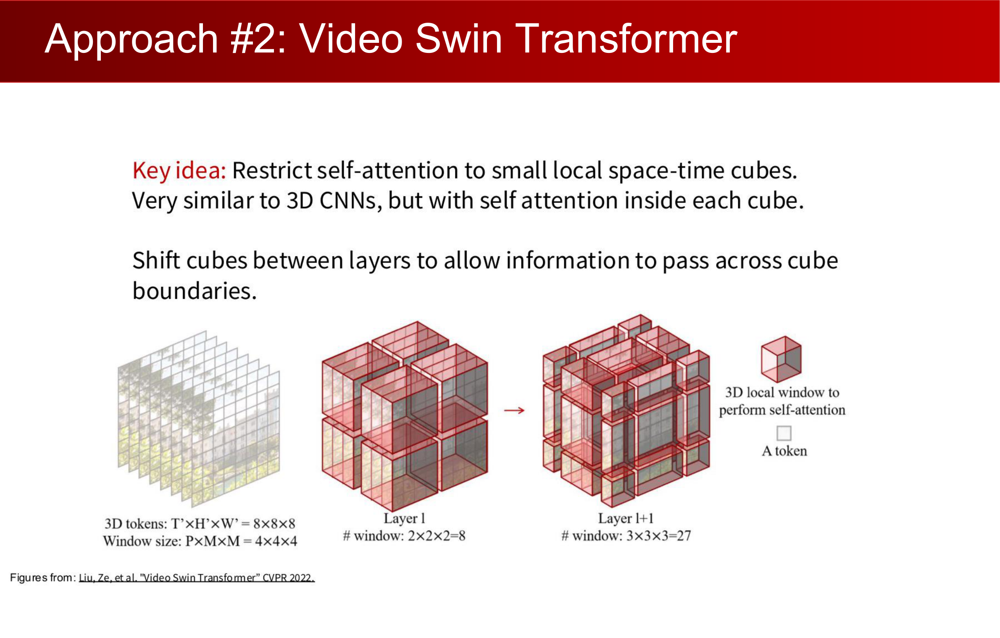

**关键思想（讲义原话）：** **"Restrict self-attention to small local space-time cubes."**

它很像 3D CNN，但每个局部 cube 内部使用 self-attention。不同层之间移动 cube，可以让信息跨越 cube 边界传播。

讲义给出的局部 token/window 例子是：

$$
T' \times H' \times W' = 8 \times 8 \times 8,\qquad
P \times M \times M = 4 \times 4 \times 4
$$

$$
\#\text{window} = 2 \times 2 \times 2 = 8,\qquad
\#\text{window after shift} = 3 \times 3 \times 3 = 27
$$

:::remark 关键问题与解答：joint attention 和 divided attention 的区别
**问题（原意复述）：** Joint space-time attention 和 divided space-time attention 的实际区别是什么？

**解答：** Joint attention 让所有视频 tokens 一次性交互，表达力强但开销高。Divided attention 把操作分解成 temporal attention 和 spatial attention，降低成本，同时保留时间和空间两类交互。
:::

:::remark 关键问题与解答：为什么 local cubes 还要 shift？
**问题（原意复述）：** 如果局部窗口已经高效，为什么还要在不同层之间移动窗口？

**解答：** 如果不移动，每个 token 主要只能和自己 cube 内部的信息交互。Shift 会改变 cube 边界，让信息逐层跨越相邻 cube。
:::

## 4. 减少 Tokens：MViT 与 Tubelets

第二条路线是在 attention 前或 attention 过程中减少 token 数量。

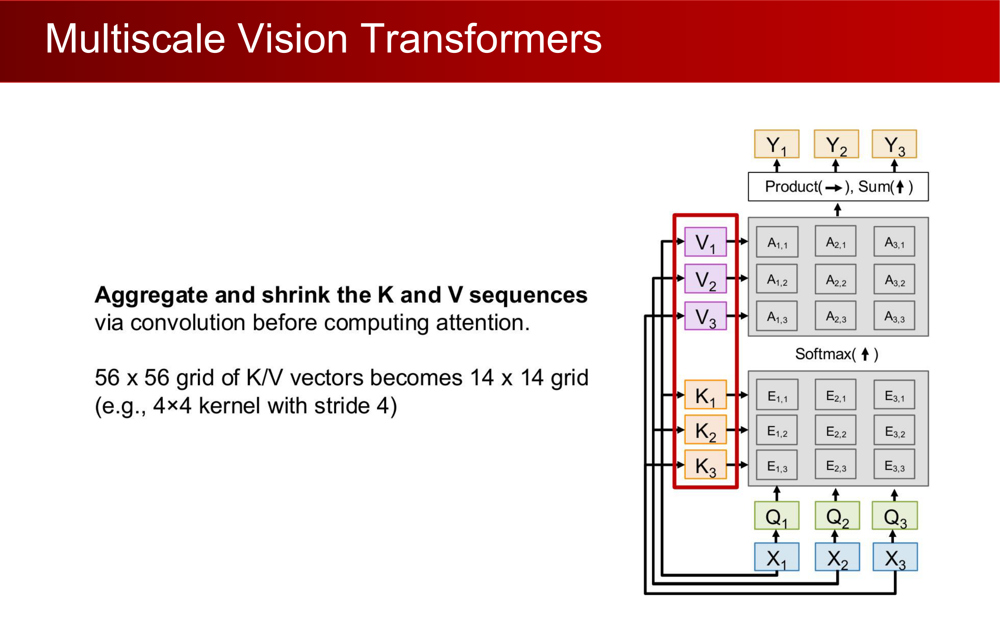

Multiscale Vision Transformers 会先聚合并压缩 key 和 value 序列，再计算 attention。讲义中的例子是把 \(56 \times 56\) 的 K/V 网格压成 \(14 \times 14\)：

$$
56 \times 56 \rightarrow 14 \times 14
\quad(\text{kernel}=4 \times 4,\ \text{stride}=4)
$$

这样 query 可以保留更细尺度，而 key/value 变得更便宜。效果类似多尺度视野：局部细节还在，但 attention 成本下降。

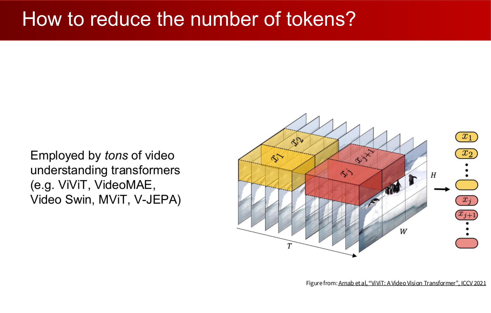

**关键问题（讲义原话）：** **"How to reduce the number of tokens?"**

一个答案是 **tubelets**。它不是逐帧切 patch，而是让一个 tubelet 同时跨越空间和时间。这样一个 token 就能代表一个时空块，所以更高效。

:::remark 关键问题与解答：为什么 tubelets 比逐帧 patches 更高效？
**问题（原意复述）：** 为什么把帧组合成 tubelets 可以降低 video transformer 的成本？

**解答：** Tubelet 一次覆盖多帧和多个空间像素，因此产生的 token 更少。token 变少会直接降低 attention 的计算规模。
:::

## 5. CLIP：对比式图文基础模型

进入 foundation models 后，CLIP 是图文分类与检索的核心例子。

CLIP 学一个 image encoder 和一个 text encoder。匹配的图文对相似度要高，不匹配的图文对相似度要低。

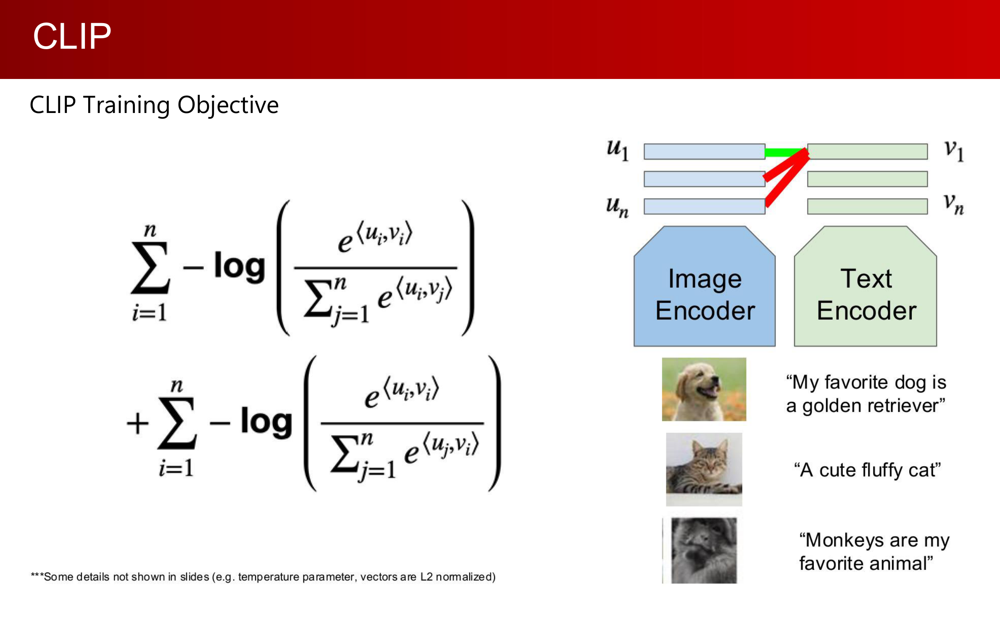

设 \(u_i\) 是图像 embedding，\(v_i\) 是对应文本 embedding。双向 contrastive loss 是：

$$
\mathcal{L}_{\mathrm{CLIP}}
=
\sum_{i=1}^{n}
-\log
\left(
\frac{e^{\langle u_i, v_i\rangle}}
{\sum_{j=1}^{n} e^{\langle u_i, v_j\rangle}}
\right)
+
\sum_{i=1}^{n}
-\log
\left(
\frac{e^{\langle u_i, v_i\rangle}}
{\sum_{j=1}^{n} e^{\langle u_j, v_i\rangle}}
\right)
$$

第一项要求每张图选中正确文本；第二项要求每段文本选中正确图像。

CLIP 还支持 zero-shot classification：

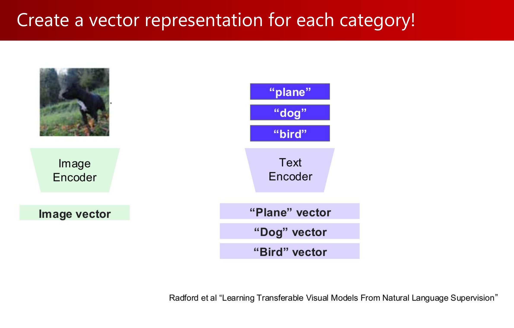

给定一张图，我们为类别提示词生成 text embeddings，例如 "plane"、"dog"、"bird"，再把图像向量和这些文本向量做相似度比较。

CoCa 在这个方向上继续扩展：增加 decoder 和 captioning loss。

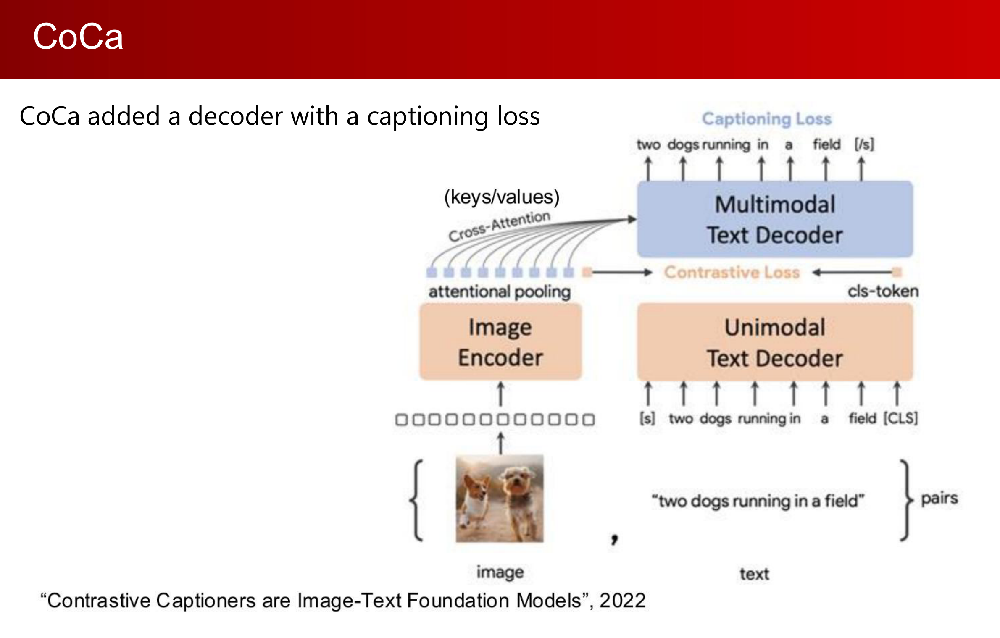

Contrastive objective 负责做全局图文对齐；captioning objective 则让模型按 token 生成文本。

:::remark 关键问题与解答：为什么 CLIP 支持 open-vocabulary classification？
**问题（原意复述）：** 为什么 CLIP 不需要固定 classifier head，也能分类新类别？

**解答：** 因为类别可以表示成文本 embedding。只要 text encoder 能编码类别名或提示词，模型就可以直接比较 image vector 和 text vector，不需要重新训练输出层。
:::

## 6. CLIP-style Models 的优势与局限

CLIP-style models 的吸引力在于：dot product 检索很高效，训练方式足够简单、容易 scale，学到的表示也容易复用。

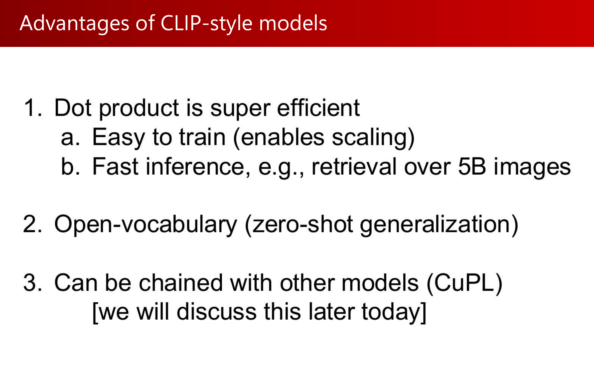

主要优势包括：

- dot product 很高效；
- 训练相对容易，方便扩展；
- 推理可以支持大规模 retrieval；
- open-vocabulary 带来 zero-shot generalization；
- CLIP 可以和其他模型 chain 起来使用。

但 CLIP-style global contrast 有一个重要短板：它未必真正学会 compositional structure。

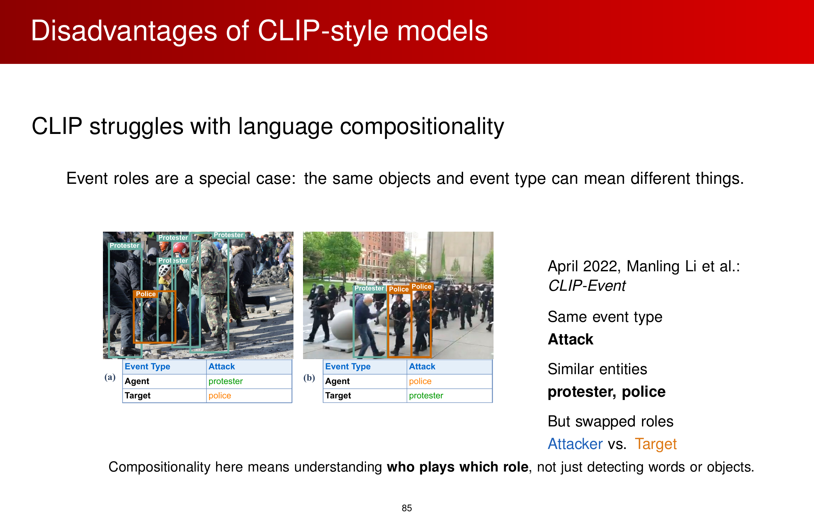

**关键表述（讲义原话）：** **"Compositionality here means understanding who plays which role, not just detecting words or objects."**

在事件理解中，两个样本可能有相同的对象和事件类型，但 agent 与 target 的角色被交换。Global image-text matching 可能知道 "protester"、"police"、"attack" 都出现了，却不一定知道到底是谁攻击谁。

一种补救方法是 event-aware hard negatives：

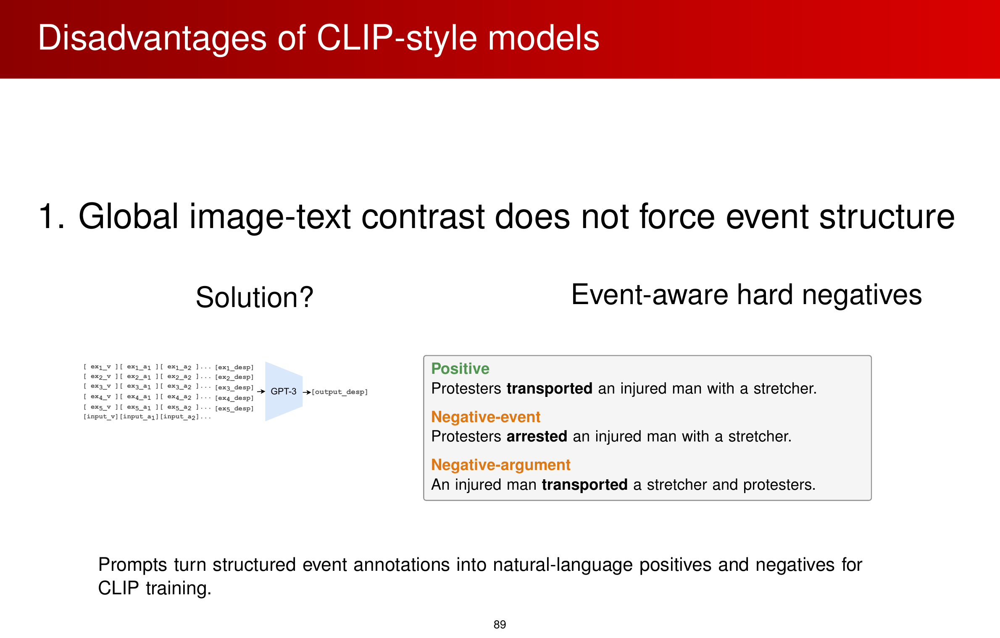

核心做法是构造语义接近但结构错误的负样本，例如改事件类型，或者旋转 argument roles。这样 contrastive task 才会被迫关注事件结构，而不是只看对象词。

:::warn 关键局限：global contrast 不够
**问题（原意复述）：** 为什么 global image-text contrast 会在 event roles 上失败？

**解答：** 因为正样本和负样本可能共享同样的对象和事件词。模型真正需要区分的是 argument structure，但普通 batch negatives 往往没有逼迫它学到这一级组合语义。
:::

:::tip 关键设计经验
Hard negatives 要针对具体失败模式才有用。对于组合语言，负样本应该在角色、关系、顺序或事件结构上出错，而不只是换成无关对象名。
:::

## 7. 用 Foundation Models 做链式视频理解：VidIL

多模态系统不一定都要训练一个端到端集成的视频语言模型。VidIL 展示了另一种模式：组合已有的 frozen models。

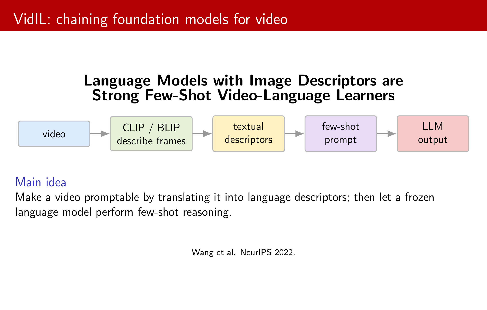

**核心思想（讲义原话）：** **"Make a video promptable by translating it into language descriptors; then let a frozen language model perform few-shot reasoning."**

基本流程是：

- 从视频中采样帧；
- 用 CLIP 或 BLIP 这类 image-language model 描述帧；
- 把视觉证据转成 language descriptors；
- 构造 few-shot prompt；
- 让 frozen LLM 生成 caption、回答问题、预测事件标签或做 retrieval 判断。

Temporal prompts 很重要，因为视频语义依赖顺序。

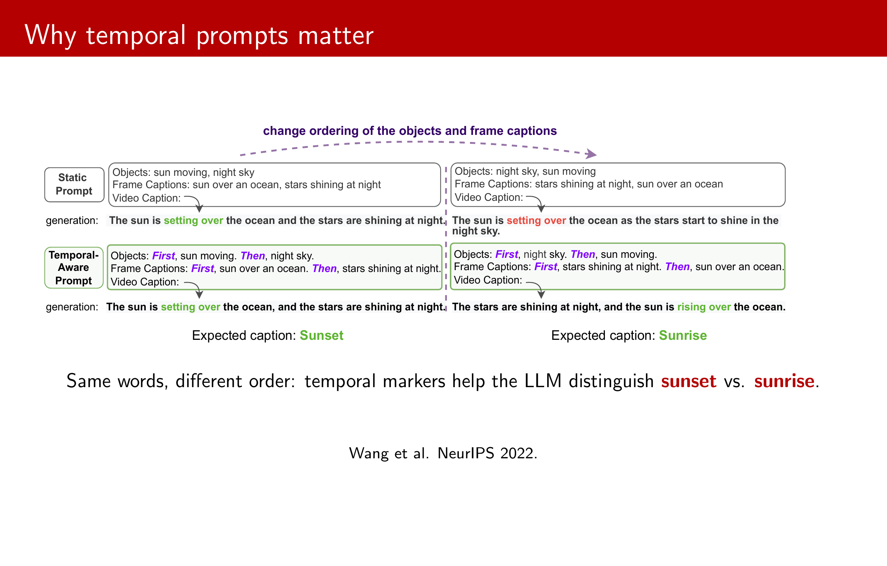

**关键表述（讲义原话）：** **"Same words, different order: temporal markers help the LLM distinguish sunset vs. sunrise."**

实验结论是：当中间表示是语言时，chaining 可以成为很强的 baseline。

:::remark 关键问题与解答：为什么 chaining 能处理视频任务？
**问题（原意复述）：** 为什么 frozen LLM 没有 video pretraining，也能解决一些 video-language tasks？

**解答：** 如果视觉模型能把帧翻译成有用的文本描述，任务就转化成了语言推理问题。LLM 可以利用 few-shot prompting，把 objects、events、attributes、captions 和 temporal markers 组合起来。
:::

:::warn Chaining 的关键局限
Chaining 强依赖中间描述的质量。如果 image-language model 漏掉动作、对象或时间变化，LLM 可能会基于不完整证据给出很流畅但不可靠的推理。
:::

## 8. 集成式 Vision-Language Models：LLaVA 与 Flamingo

Integrated VLMs 会把视觉特征直接接到 autoregressive language model 上。

LLaVA 利用了 LLM 的 autoregressive nature：图像特征被转换成 decoder 可以和文本一起消费的 tokens。

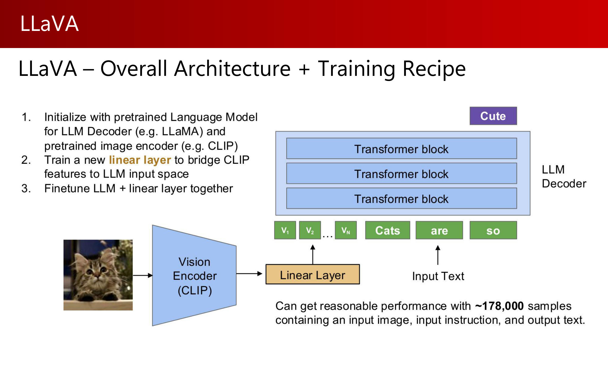

它的训练 recipe 是：

- 用 pretrained language model decoder 和 pretrained image encoder 初始化，例如 LLaMA 与 CLIP；
- 训练一个新的 linear layer，把 CLIP features 映射到 LLM input space；
- 再把 LLM 和 linear layer 一起 finetune。

Flamingo 使用的是另一套 recipe。

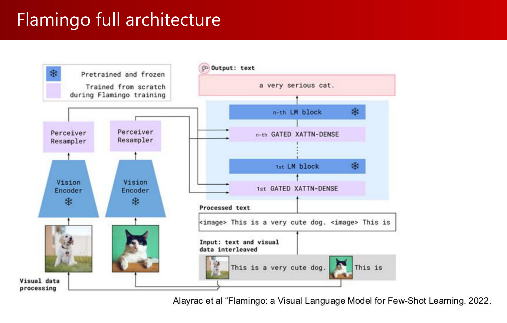

它冻结大量预训练部件，用 Perceiver Resampler 压缩视觉特征，并在语言模型中插入 gated cross-attention 层。这样模型可以处理交错的文本和视觉输入，支持 few-shot multimodal learning。

:::remark 关键问题与解答：LLaVA vs Flamingo
**问题（原意复述）：** LLaVA 和 Flamingo 在架构上有什么区别？

**解答：** LLaVA 用 learned bridge 把图像特征投影进 LLM token space，并 finetune 语言侧。Flamingo 冻结更多预训练组件，通过 resampled visual tokens 和 gated cross-attention 注入视觉信息。
:::

## 9. 数据质量、Dense Captions 与 Omni Models

Foundation models 非常依赖数据。这里的关键取舍是规模和细节。

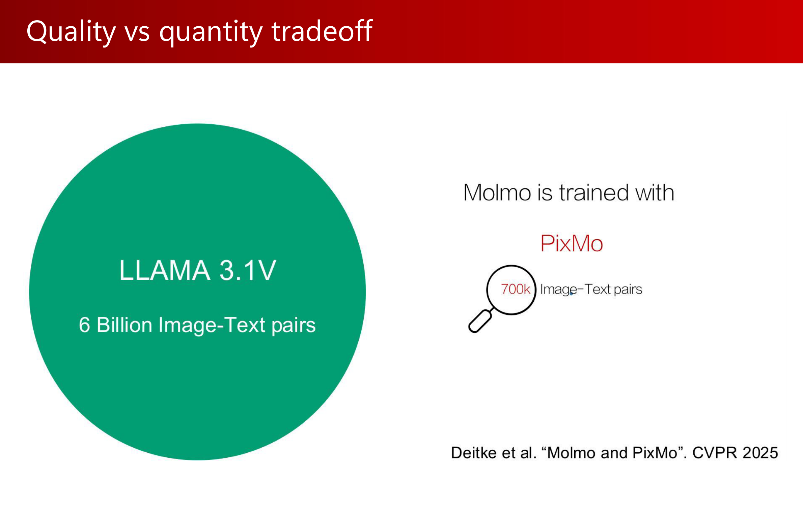

一边是海量弱对齐数据：

$$
6 \text{ billion image-text pairs} \gg 700\text{k image-text pairs}
$$

另一边是 dense、高质量 caption。PixMo-style data 更小，但细节密度更高。

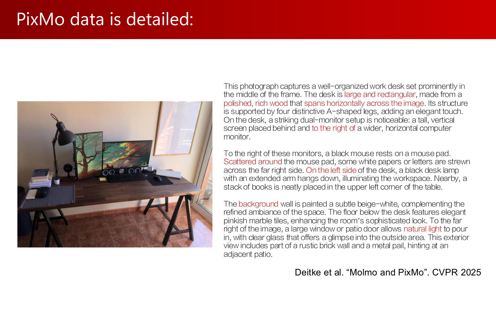

Dense captions 会描述对象、布局、属性、关系和细粒度空间细节。它们收集成本很高，但能教会模型很多原始 image-text pairs 不一定提供的能力。

最后，模型发展方向已经从 vision-language 走向 omni models。

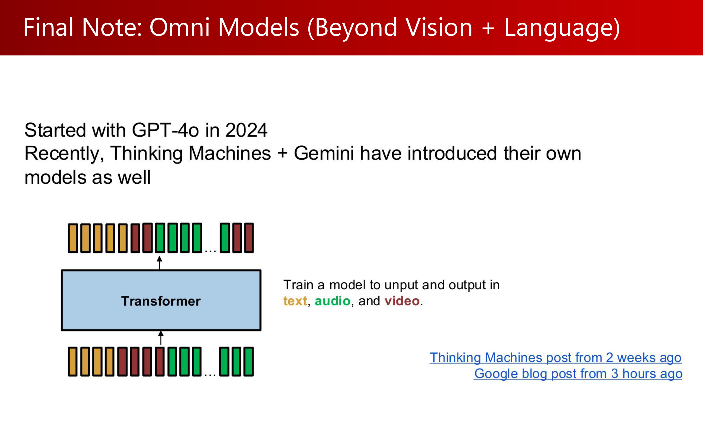

Omni models 试图训练一个统一的 transformer-like 系统，使它能在 text、audio、video 之间输入和输出。方向不再只是“视觉加语言”，而是更一般的 multimodal sequence modeling。

:::remark 关键问题与解答：quality vs quantity
**问题（原意复述）：** 更多 image-text data 是否一定比详细 caption data 更好？

**解答：** 不一定。海量数据有利于 scale 和覆盖面，但 dense captions 能提供布局、关系、属性和细粒度语义监督。最终取决于系统缺的是什么能力。
:::

## 10. 总结与考试复习

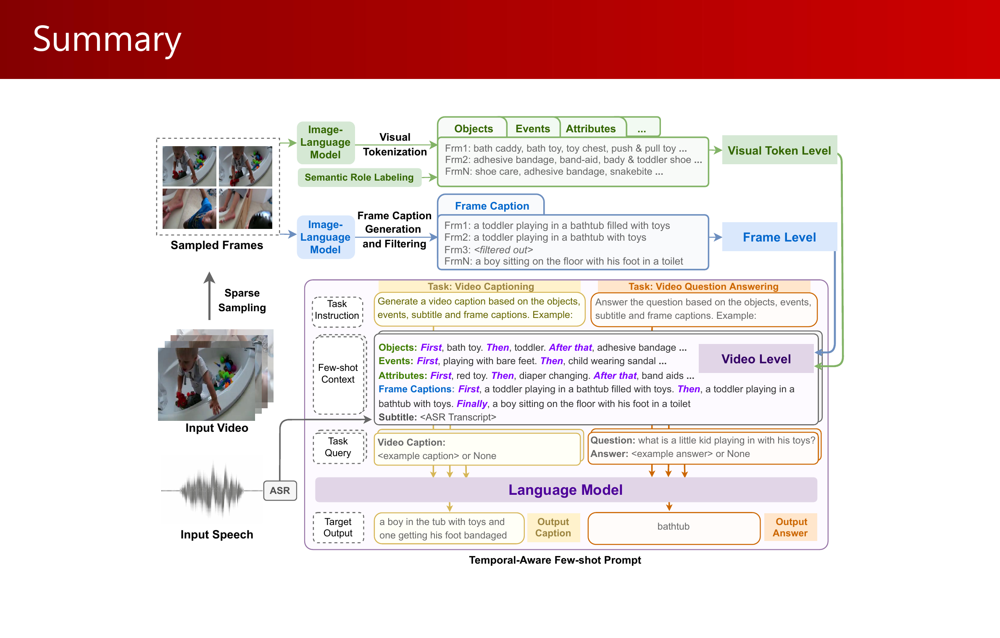

### 10.1 必会定义

- **Video Transformer：** 面向视频 tokens 的 transformer，需要建模空间和时间结构。
- **Divided space-time attention：** 分别建模 temporal interaction 和 spatial interaction 的分解式 attention。
- **Tubelet：** 覆盖多帧和多个空间 patch 的时空 token。
- **CLIP：** 用 contrastive learning 对齐 image embeddings 和 text embeddings 的图文模型。
- **CoCa：** 在图文基础模型中同时使用 contrastive loss 和 captioning loss 的模型。
- **VidIL：** 把视频翻译成 language descriptors，再用 frozen LLM 做 few-shot reasoning 的 chaining 方法。
- **LLaVA：** 把 vision encoder 接到 LLM decoder 上的 integrated VLM。
- **Flamingo：** 使用 visual resampling 与 gated cross-attention 做 few-shot multimodal learning 的 VLM。

### 10.2 简答题模板

- **Why are video transformers expensive?**  
因为视频引入时间维，token 数量迅速增加，而 attention 成本会随 token 数量快速增长。

- **How does divided space-time attention help?**  
它把 attention 分成 temporal 和 spatial 两步，降低开销，同时保留两类关键交互。

- **Why does CLIP enable zero-shot classification?**  
类别名可以被编码成 text vectors，因此分类可以转化成 image-text similarity comparison。

- **Why can CLIP fail at compositionality?**  
Global contrast 可能学会对象词和事件词，却没有学会角色、关系和顺序。

- **Why can chaining foundation models work?**  
如果视觉证据能转换成语言，LLM 就可以利用语言推理和 few-shot prompting 能力完成任务。

- **Why do dense captions matter?**  
它们提供布局、关系、属性和空间结构等细节监督，而这些信息在弱图文对中可能缺失。

### 10.3 常见误区

- 不要把视频当成独立图像堆叠；时间顺序很重要。
- 不要因为 CLIP 能匹配 caption，就认为它理解所有语言组合关系。
- 不要把 chaining 和端到端 integrated VLM training 混为一谈。
- 不要默认小规模高质量数据一定差于大规模弱数据；它们教会模型的能力不同。
- 不要忘记 omni models 已经把范围扩展到 text、audio、video 的输入输出。

### 10.4 自检清单

- 你能解释提升 video efficiency 的两条大路线吗？
- 你能比较 joint、divided 和 local window space-time attention 吗？
- 你能写出并解释 CLIP contrastive loss 的两个方向吗？
- 你能解释 event-aware hard negatives 为什么有用吗？
- 你能用一段话比较 VidIL、LLaVA 和 Flamingo 吗？
