# Lecture 15: Generative Models II - Diffusion, Flow Matching, and Conditional Generation

## 1. From VAE to Diffusion Models

Diffusion models can be understood as a deep latent-variable model. The lecture starts from VAE because diffusion keeps the same broad goal: model the data likelihood by introducing latent variables, then learn a tractable approximation.

For a VAE, the generative model is

$$
p_\theta(x)=\int_z p_\theta(x\mid z)p(z)\,dz,\qquad
\max_\theta \mathbb{E}_{x\sim p_{\text{data}}}[\log p_\theta(x)].
$$

Since the true posterior is hard, VAE introduces a variational posterior and optimizes the ELBO:

$$
\log p_\theta(x)\ge
\mathbb{E}_{q_\phi(z\mid x)}
\left[\log \frac{p_\theta(x\mid z)p(z)}{q_\phi(z\mid x)}\right].
$$

The bottleneck is that a single latent code has to represent object category, shape, pose, texture, and fine details at once.

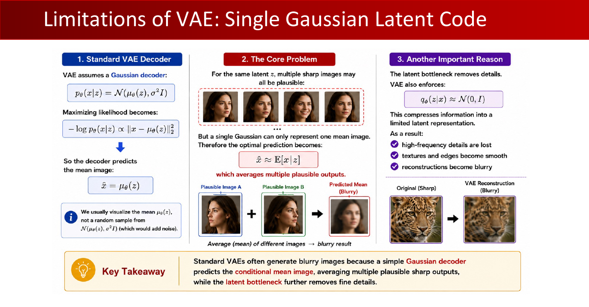

Hierarchical VAEs address this by introducing multiple latent variables:

$$
p(x,z_1,z_2)=p(x\mid z_1)p(z_1\mid z_2)p(z_2),\qquad
q(z_1,z_2\mid x)=q(z_1\mid x)q(z_2\mid z_1).
$$

This is the bridge to diffusion. Instead of only two latent variables, diffusion uses a long Markov chain \(x_0,x_1,\ldots,x_T\). The forward chain gradually corrupts data into noise; the learned reverse chain gradually denoises noise into data.

:::remark Key question and answer: why move beyond a single VAE latent code?
**Question (original intent):** Why is a single latent code in a VAE often insufficient for high-fidelity image generation?

**Answer:** A single Gaussian latent must compress global semantics and local details into one vector. The decoder then tends to average plausible outputs, which can cause blurry images and missing high-frequency details. A hierarchy or a long diffusion chain spreads the modeling burden across many steps.
:::

## 2. Forward Diffusion Process

The forward diffusion process is fixed. It is not learned. It repeatedly adds Gaussian noise to the clean data \(x_0\) until the final state \(x_T\) is close to standard Gaussian noise.

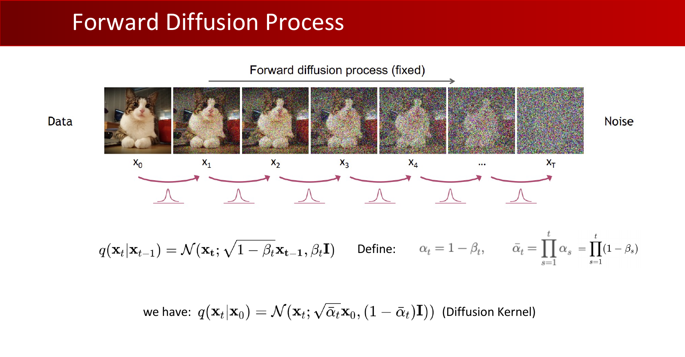

The one-step forward kernel is

$$
q(x_t\mid x_{t-1})=\mathcal{N}(x_t;\sqrt{1-\beta_t}x_{t-1},\beta_t I).
$$

Define

$$
\alpha_t=1-\beta_t,\qquad
\bar{\alpha}_t=\prod_{s=1}^{t}\alpha_s.
$$

Then the closed-form diffusion kernel from \(x_0\) to \(x_t\) is

$$
q(x_t\mid x_0)=\mathcal{N}(x_t;\sqrt{\bar{\alpha}_t}x_0,(1-\bar{\alpha}_t)I).
$$

Equivalently, we can sample \(x_t\) in one step:

$$
x_t=\sqrt{\bar{\alpha}_t}x_0+\sqrt{1-\bar{\alpha}_t}\epsilon,\qquad
\epsilon\sim\mathcal{N}(0,I).
$$

The noise schedule \(\beta_t\) is designed so that \(\bar{\alpha}_T\to 0\), making

$$
q(x_T\mid x_0)\approx \mathcal{N}(0,I).
$$

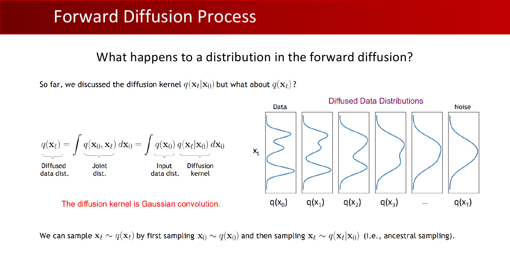

**Key question (lecture wording):** **"What happens to a distribution in the forward diffusion?"**

The distribution is progressively convolved with Gaussian noise. Fine structure is washed out; after enough steps, the distribution approaches a simple Gaussian.

:::remark Key question and answer: why is the forward process useful if it only destroys information?
**Question (original intent):** If forward diffusion only turns data into noise, why define it?

**Answer:** Because it creates supervised denoising targets. We know exactly how much noise was added at every time \(t\), so we can train a neural network to reverse each small corruption step.
:::

## 3. Reverse Denoising and the ELBO

Generation runs the chain backward. Starting from \(x_T\sim\mathcal{N}(0,I)\), the model repeatedly predicts a less noisy sample:

$$
p_\theta(x_{0:T})=p(x_T)\prod_{t=1}^{T}p_\theta(x_{t-1}\mid x_t),
$$

where

$$
p_\theta(x_{t-1}\mid x_t)=\mathcal{N}(x_{t-1};\mu_\theta(x_t,t),\sigma_t^2I).
$$

The ELBO decomposes into reconstruction, reverse-step matching, and prior matching:

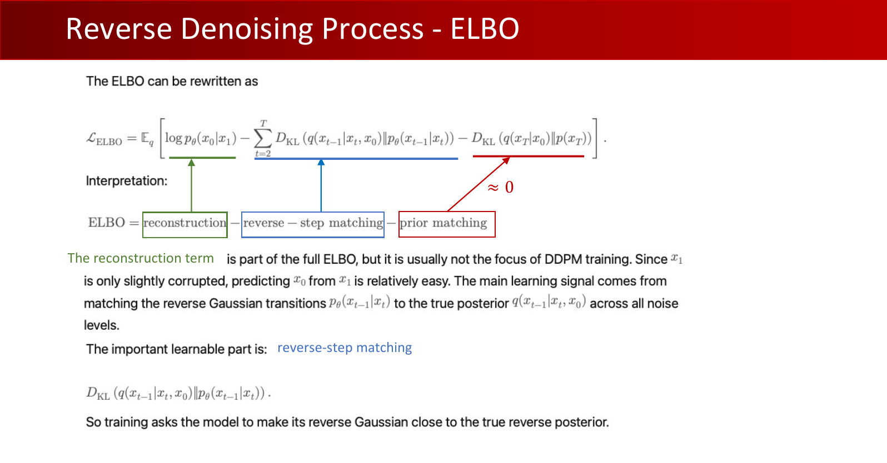

$$
\mathcal{L}_{\text{ELBO}}=
\mathbb{E}_q\left[
\log p_\theta(x_0\mid x_1)
-\sum_{t=2}^{T}D_{\mathrm{KL}}\left(q(x_{t-1}\mid x_t,x_0)\,\|\,p_\theta(x_{t-1}\mid x_t)\right)
-D_{\mathrm{KL}}\left(q(x_T\mid x_0)\,\|\,p(x_T)\right)
\right].
$$

The important learnable part is reverse-step matching: make \(p_\theta(x_{t-1}\mid x_t)\) close to the true posterior \(q(x_{t-1}\mid x_t,x_0)\).

Because the forward process is Gaussian, the true reverse posterior is also Gaussian:

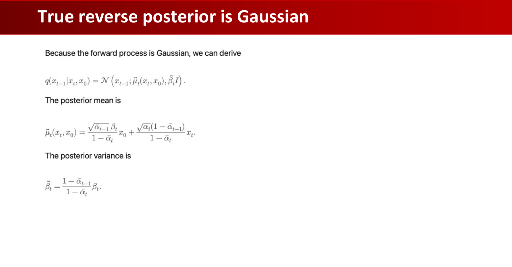

$$
q(x_{t-1}\mid x_t,x_0)=
\mathcal{N}\left(x_{t-1};\tilde{\mu}_t(x_t,x_0),\tilde{\beta}_t I\right),
$$

$$
\tilde{\mu}_t(x_t,x_0)=
\frac{\sqrt{\bar{\alpha}_{t-1}}\beta_t}{1-\bar{\alpha}_t}x_0+
\frac{\sqrt{\alpha_t}(1-\bar{\alpha}_{t-1})}{1-\bar{\alpha}_t}x_t,\qquad
\tilde{\beta}_t=\frac{1-\bar{\alpha}_{t-1}}{1-\bar{\alpha}_t}\beta_t.
$$

:::remark Key question and answer: why is the true reverse posterior useful but not directly usable at inference?
**Question (original intent):** If \(q(x_{t-1}\mid x_t,x_0)\) is known, why do we need a neural network?

**Answer:** During training, \(x_0\) is known, so the true posterior can supervise the model. During generation, we start from pure noise and do not know the clean \(x_0\). The neural network learns to approximate the needed reverse transition using only \(x_t\) and \(t\).
:::

## 4. DDPM Noise-Prediction Objective

DDPM reparameterizes the reverse mean so that the model predicts the added noise instead of directly predicting the clean image.

From the posterior mean, one can write

$$
\tilde{\mu}_t(x_t,x_0)=
\frac{1}{\sqrt{\alpha_t}}
\left(x_t-\frac{\beta_t}{\sqrt{1-\bar{\alpha}_t}}\epsilon\right).
$$

The model uses the same form but replaces \(\epsilon\) with \(\epsilon_\theta(x_t,t)\):

$$
\mu_\theta(x_t,t)=
\frac{1}{\sqrt{\alpha_t}}
\left(x_t-\frac{\beta_t}{\sqrt{1-\bar{\alpha}_t}}\epsilon_\theta(x_t,t)\right).
$$

Therefore, matching the reverse mean is equivalent, up to a time-dependent scale, to predicting the true noise:

$$
\|\mu_\theta-\tilde{\mu}_t\|^2\propto
\|\epsilon_\theta(x_t,t)-\epsilon\|^2.
$$

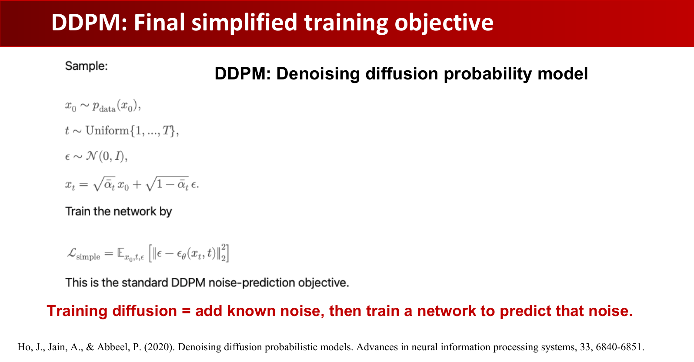

The final simplified objective is

$$
\mathcal{L}_{\text{simple}}=
\mathbb{E}_{x_0,t,\epsilon}
\left[\|\epsilon-\epsilon_\theta(x_t,t)\|_2^2\right],
$$

where

$$
x_0\sim p_{\text{data}},\qquad
t\sim \mathrm{Uniform}\{1,\ldots,T\},\qquad
\epsilon\sim\mathcal{N}(0,I),\qquad
x_t=\sqrt{\bar{\alpha}_t}x_0+\sqrt{1-\bar{\alpha}_t}\epsilon.
$$

**Key sentence (lecture wording):** **"Training diffusion = add known noise, then train a network to predict that noise."**

:::remark Key question and answer: why predict noise instead of directly predicting \(x_0\)?
**Question (original intent):** Why does DDPM train \(\epsilon_\theta(x_t,t)\) rather than directly train a clean-image predictor?

**Answer:** The forward process tells us the exact noise \(\epsilon\) used to create \(x_t\), so noise prediction gives a clean supervised target at every timestep. Through the posterior-mean formula, predicting noise also determines the reverse Gaussian mean.
:::

## 5. Score Function and SDE Perspectives

Diffusion has several equivalent perspectives. One important view is score matching.

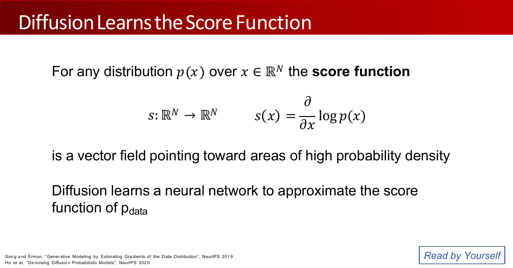

For any distribution \(p(x)\), the score function is

$$
s(x)=\frac{\partial}{\partial x}\log p(x).
$$

The score is a vector field pointing toward higher probability density. Diffusion models can be interpreted as learning score functions at different noise levels.

Another view treats diffusion as a stochastic differential equation:

$$
dx=f(x,t)dt+g(t)dw.
$$

This describes infinitesimal changes in data \(x\), time \(t\), and noise \(w\). The model learns a neural approximation to reverse or solve this process.

:::tip Conceptual shortcut
DDPM, score-based models, and SDE formulations often look different, but they share the same core idea: learn how to move noisy samples back toward the data distribution.
:::

## 6. Flow Matching: Learn the Vector Field Directly

Flow matching gives another route to generative modeling. Instead of explicitly using a diffusion posterior, it constructs a path from data to noise and trains a model to predict the velocity along that path.

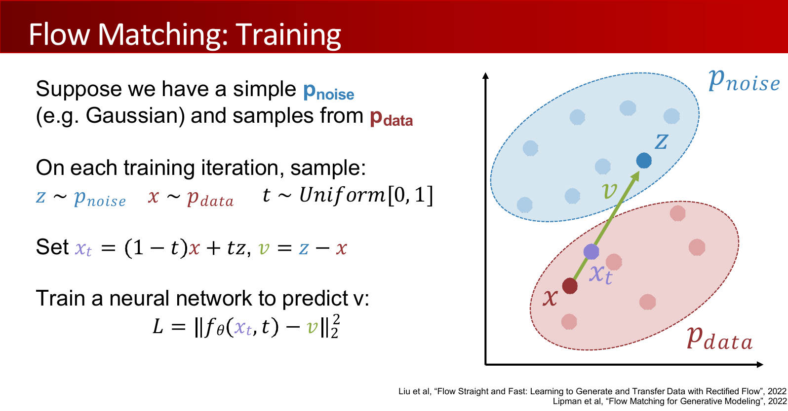

Sample

$$
z\sim p_{\text{noise}},\quad x\sim p_{\text{data}},\quad t\sim \mathrm{Uniform}[0,1].
$$

Define a straight interpolation and its target velocity:

$$
x_t=(1-t)x+tz,\qquad v=z-x.
$$

Train

$$
L=\|f_\theta(x_t,t)-v\|_2^2.
$$

Sampling starts from noise and walks backward along the learned vector field:

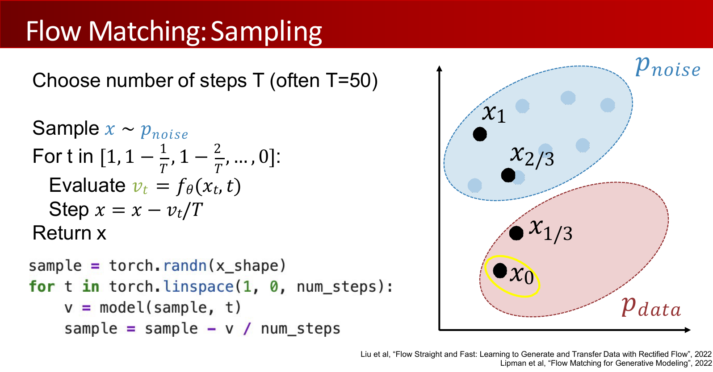

$$
v_t=f_\theta(x_t,t),\qquad x\leftarrow x-\frac{v_t}{T}.
$$

The slide emphasizes that the core loop can be only a few lines of code: initialize random noise, evaluate the velocity field at each time, and update the sample.

:::remark Key question and answer: how is flow matching different from DDPM?
**Question (original intent):** Is flow matching just DDPM with different notation?

**Answer:** No. DDPM is usually derived from a probabilistic noising process and a reverse posterior. Flow matching directly learns a vector field that transports noise to data. Both can generate samples by iterative updates, but the training target and derivation are different.
:::

## 7. Generalized Flow and Generalized Diffusion

The lecture unifies rectified flow, diffusion, and score-based models with a generalized flow form.

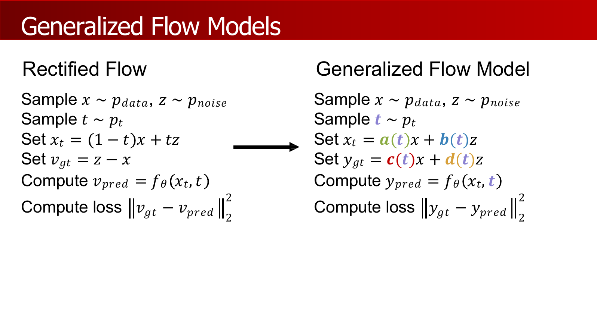

Instead of always using \(x_t=(1-t)x+tz\), define

$$
x_t=a(t)x+b(t)z.
$$

The target can also be a general linear combination:

$$
y_{gt}=c(t)x+d(t)z,\qquad
y_{\text{pred}}=f_\theta(x_t,t),
$$

with loss

$$
\mathcal{L}=\|y_{gt}-y_{\text{pred}}\|_2^2.
$$

Rectified flow is one special case:

$$
a(t)=1-t,\qquad b(t)=t,\qquad c(t)=-1,\qquad d(t)=1.
$$

Diffusion and score-based models can also be placed in this template. Variance preserving and variance exploding schedules use:

$$
a_{\mathrm{VP}}(t)=\sqrt{\sigma(t)},\quad b_{\mathrm{VP}}(t)=\sqrt{1-\sigma(t)},\qquad
a_{\mathrm{VE}}(t)=1,\quad b_{\mathrm{VE}}(t)=\sigma(t).
$$

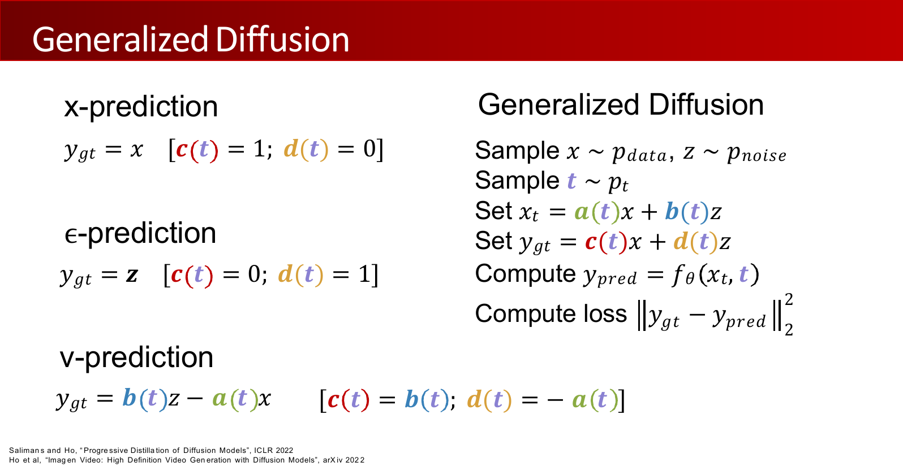

The target choice gives familiar prediction forms:

$$
y_{gt}=x\quad(x\text{-prediction}),\qquad
y_{gt}=z\quad(\epsilon\text{-prediction}),\qquad
y_{gt}=b(t)z-a(t)x\quad(v\text{-prediction}).
$$

:::remark Key question and answer: what does generalized diffusion buy us?
**Question (original intent):** Why introduce \(a(t),b(t),c(t),d(t)\) instead of teaching only DDPM?

**Answer:** It shows that many modern generative models differ mainly in the interpolation path and prediction target. This makes it easier to compare DDPM, score-based models, rectified flow, \(x\)-prediction, \(\epsilon\)-prediction, and \(v\)-prediction in one framework.
:::

## 8. Latent Diffusion Models

Pixel-space diffusion is expensive because images have many pixels. Latent Diffusion Models first compress images into a lower-dimensional latent space, run diffusion there, and decode the final latent back to pixels.

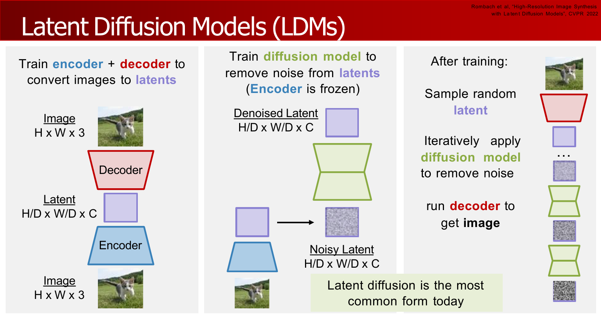

A common setting from the lecture is

$$
256\times256\times3 \to 32\times32\times16.
$$

The pipeline is:

1. Train an encoder and decoder to convert images into continuous latents.
2. Train a diffusion model to remove noise from latents.
3. At inference, sample a random latent, denoise it iteratively, and run the decoder to get an image.

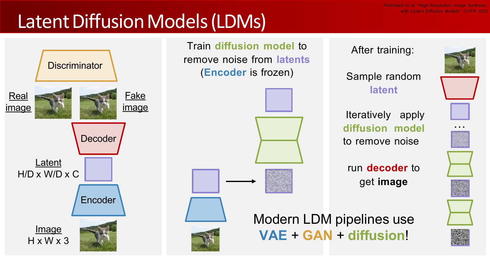

Autoencoder training is not trivial. A VAE-style objective gives a probabilistic latent space, but decoder outputs can be blurry. GAN-style discriminators can improve perceptual sharpness. Modern LDM pipelines often combine **VAE + GAN + diffusion**.

:::remark Key question and answer: why do diffusion in latent space?
**Question (original intent):** Why not run diffusion directly on pixels?

**Answer:** Latent space is much smaller than pixel space, so denoising is cheaper and can use larger models or more steps. The decoder then converts the clean latent into a high-resolution image.
:::

## 9. Conditional Diffusion, DiT, and Applications

Conditional diffusion is almost the same as unconditional diffusion, except the model receives an extra condition \(y\), such as text, class labels, segmentation maps, depth, or poses.

**Key sentence (lecture wording):** **"Almost the same as unconditional diffusion!"**

The model changes from

$$
\epsilon_\theta(x_t,t)
$$

to

$$
\epsilon_\theta(x_t,y,t),
$$

and the loss becomes

$$
\mathbb{E}_{x_t,y,t}
\left[\|\epsilon-\epsilon_\theta(x_t,y,t)\|^2\right].
$$

One common conditioning schema is **Cross attention**:

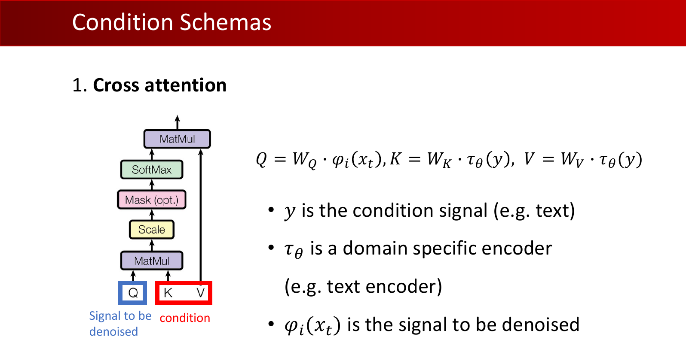

$$
Q=W_Q\varphi_i(x_t),\qquad
K=W_K\tau_\theta(y),\qquad
V=W_V\tau_\theta(y).
$$

Here, \(y\) is the condition signal, \(\tau_\theta\) is a domain-specific encoder such as a text encoder, and \(\varphi_i(x_t)\) is the signal to be denoised. Intuitively, noisy latents ask questions through \(Q\), and the condition provides information through \(K,V\).

Diffusion Transformer (DiT) replaces U-Net-style denoisers with transformer blocks. The main question becomes how to inject conditioning, such as timestep and text. Common choices include predicting scale/shift, cross-attention, and joint attention.

Text-to-image systems use this recipe in latent space:

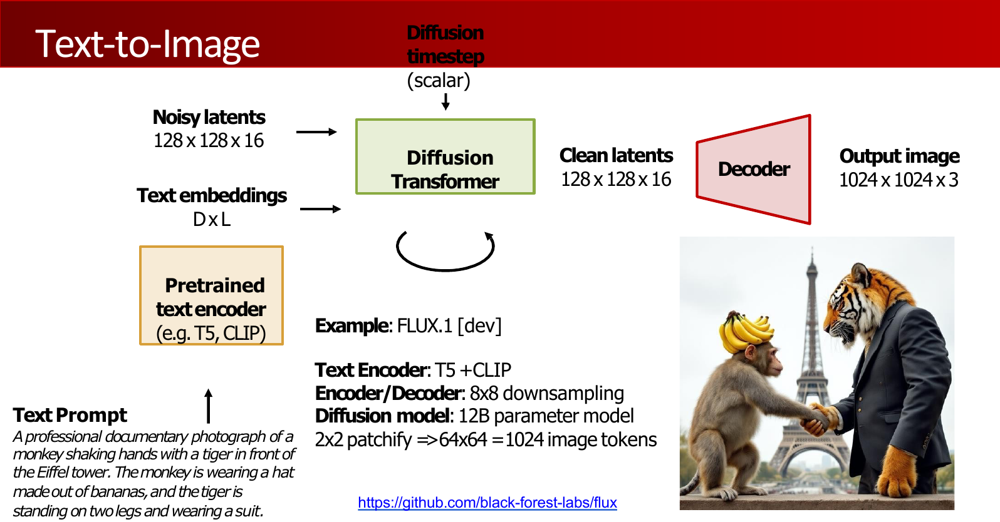

Example dimensions from the lecture:

$$
128\times128\times16 \to 1024\times1024\times3,\qquad
2\times2\text{ patchify}\Rightarrow64\times64=1024\text{ image tokens}.
$$

Text-to-video extends the latent to include time:

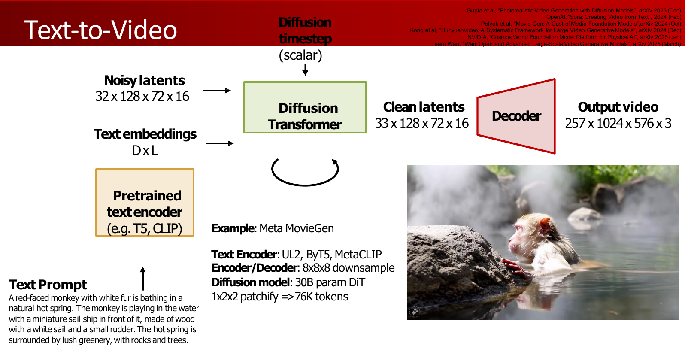

Example dimensions from the lecture:

$$
32\times128\times72\times16 \to 257\times1024\times576\times3,\qquad
1\times2\times2\text{ patchify}\Rightarrow76K\text{ tokens}.
$$

**Key sentence (lecture wording):** **"Conditional generation is of great importance!"**

Applications include text-to-image, spatial control, image editing, personalization, text-to-3D, text-to-music, and text-to-video.

:::tip Key comparison: condition injection methods
Cross-attention is natural for text because the generated latent can attend to text tokens. Scale/shift conditioning is lightweight and common for timestep or class conditioning. Joint attention treats image and text tokens more symmetrically, but it can be more expensive.
:::

## 10. Summary and Exam Review

The lecture closes by situating diffusion among other generative models:

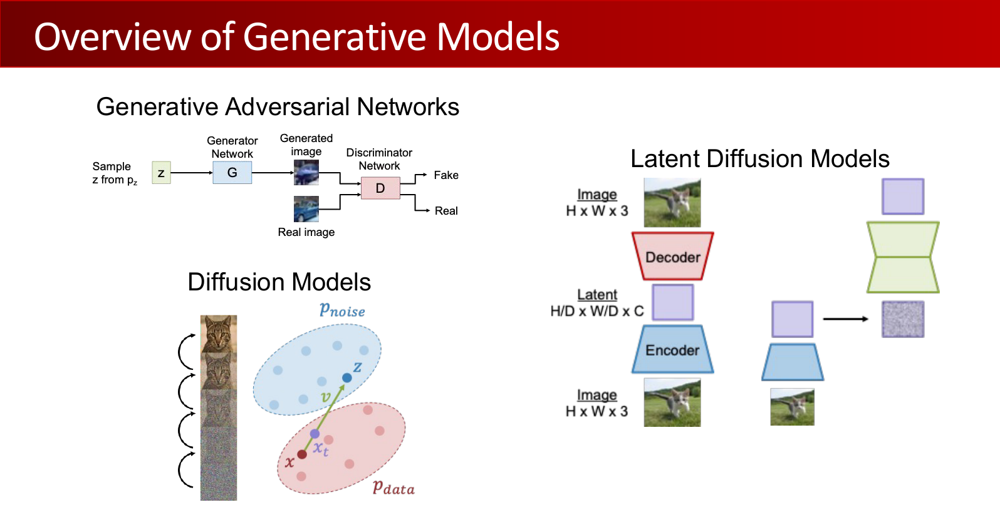

The big picture is:

- GANs learn generation through an adversarial discriminator.
- VAEs learn a latent-variable likelihood lower bound.
- DDPMs learn to reverse a fixed noising process.
- Score/SDE views interpret denoising as following gradients or solving stochastic dynamics.
- Flow matching learns a vector field from noise to data.
- LDMs make diffusion practical by operating in latent space.
- Conditional diffusion turns generative modeling into controllable generation.

### Exam Review

High-value definitions:

- **Forward diffusion process:** a fixed Markov chain that gradually adds Gaussian noise to data.
- **Reverse denoising process:** a learned chain that maps noise back to data through Gaussian reverse transitions.
- **DDPM simplified objective:** train a network to predict the noise added to \(x_0\) at timestep \(t\).
- **Score function:** \(s(x)=\nabla_x\log p(x)\), a vector field pointing toward higher probability density.
- **Flow matching:** learn a velocity field that transports samples from a noise distribution to the data distribution.
- **Latent diffusion:** perform diffusion in compressed latent space, then decode to pixels.
- **Conditional diffusion:** denoise while conditioning on \(y\), such as text or spatial controls.

Short-answer templates:

- If asked why diffusion works, say: a fixed forward process creates known noisy examples, and a neural reverse process learns to remove noise step by step.
- If asked why DDPM predicts noise, say: the true noise is known during training, and the posterior mean can be expressed using that noise.
- If asked to compare DDPM and flow matching, say: DDPM is posterior-matching under a probabilistic noising process; flow matching directly regresses a vector field along a path from data to noise.
- If asked why latent diffusion is efficient, say: it reduces spatial resolution and channel structure before denoising, then uses a decoder to recover high-resolution pixels.
- If asked how text conditioning enters diffusion, say: a text encoder produces condition tokens, and the denoiser uses cross-attention or other conditioning layers to guide denoising.

Common mistakes:

- Do not say the forward diffusion process is learned; it is fixed by the noise schedule.
- Do not confuse \(\beta_t\), \(\alpha_t\), and \(\bar{\alpha}_t\). \(\beta_t\) is noise variance, \(\alpha_t=1-\beta_t\), and \(\bar{\alpha}_t\) is the cumulative product.
- Do not say the model knows \(x_0\) at inference. It only has \(x_t\), timestep \(t\), and optional condition \(y\).
- Do not treat latent diffusion as a different objective; it is usually the same denoising idea applied in latent space.
- Do not assume all conditional diffusion is text-to-image. Conditions can be text, class labels, depth, pose, segmentation, audio, or other modalities.

Self-check:

- Can you derive \(q(x_t\mid x_0)\) from the one-step Gaussian kernel?
- Can you explain why \(q(x_{t-1}\mid x_t,x_0)\) is Gaussian?
- Can you derive why \(\|\mu_\theta-\tilde{\mu}_t\|^2\) reduces to a noise-prediction MSE?
- Can you state the flow matching training target and sampling update?
- Can you explain the roles of \(a(t),b(t),c(t),d(t)\) in generalized diffusion?
- Can you explain why text-to-video has far more tokens than text-to-image?
