# 第 2 讲：经典视觉 I - 滤波与边缘检测

## 1. 学习目标与课程定位

本讲聚焦低层视觉：把图像建模为函数、设计滤波器、构建鲁棒的边缘检测流程。

学完后你应当能够：

- 解释为什么图像可以视为离散函数。
- 推导 1D/2D 中“滑动平均 = 卷积”。
- 说明低通滤波为何能提升抗噪性。
- 按步骤重建 Canny 管线并解释每一步的必要性。

**问题："How to detect the lane?"（如何检测车道线？）**

一个可落地的答案是：先做稳定边缘检测，再结合几何约束（直线拟合、ROI、透视先验）提取车道边界。

## 2. 图像作为函数

图像是在空间坐标上定义、取值范围有限的函数。

$$
f:[a,b]\times[c,d]\rightarrow[0,255]
$$

对彩色图像，函数值是三维向量：

$$
f(x,y)=\begin{bmatrix}r(x,y)\\g(x,y)\\b(x,y)\end{bmatrix}
$$

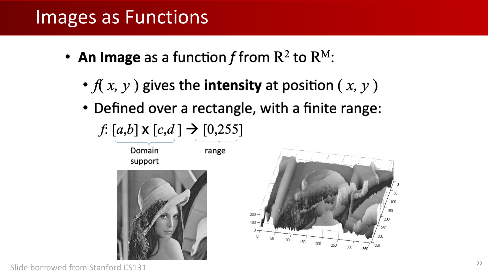

在实现中，图像在规则网格上采样，因此我们处理的是整数索引像素与有限分辨率矩阵。

## 3. 图像梯度：为什么导数有用

对强度场 $f(x,y)$，梯度定义为：

$$
\nabla f=\begin{bmatrix}\frac{\partial f}{\partial x},\frac{\partial f}{\partial y}\end{bmatrix},\quad
\|\nabla f\|=\sqrt{\left(\frac{\partial f}{\partial x}\right)^2+\left(\frac{\partial f}{\partial y}\right)^2}
$$

数值计算通常采用有限差分：

$$
\left.\frac{\partial f}{\partial x}\right|_{x=x_0}\approx\frac{f(x_0+1,y_0)-f(x_0-1,y_0)}{2}
$$

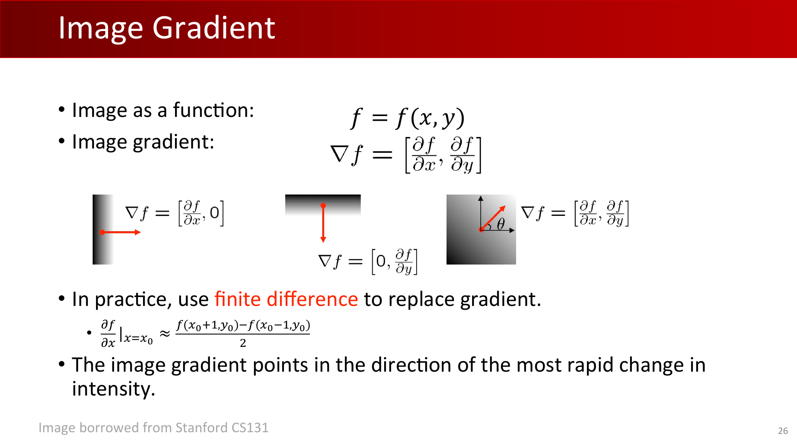

**定义（边缘）：** **边缘是图像中沿某个方向像素强度显著变化、而在其正交方向变化较小的区域。**

## 4. 线性滤波与卷积

### 4.1 从系统视角到卷积表达

1D 线性滤波把 $f[n]$ 映射到 $h[n]$：

$$
h=G(f),\quad h[n]=G(f)[n]
$$

滑动平均可写为卷积：

$$
h[n]=(f*g)[n]=\sum_{m=-\infty}^{\infty}f[m]g[n-m]
$$

### 4.2 频域解释

卷积与傅里叶变换天然配对：

$$
\mathcal{F}(f*g)=\mathcal{F}(f)\mathcal{F}(g)
$$

若 $\mathcal{F}(g)$ 主要集中在低频，$g$ 就是低通滤波器。它会压制高频分量（常对应噪声），从而带来平滑效果。

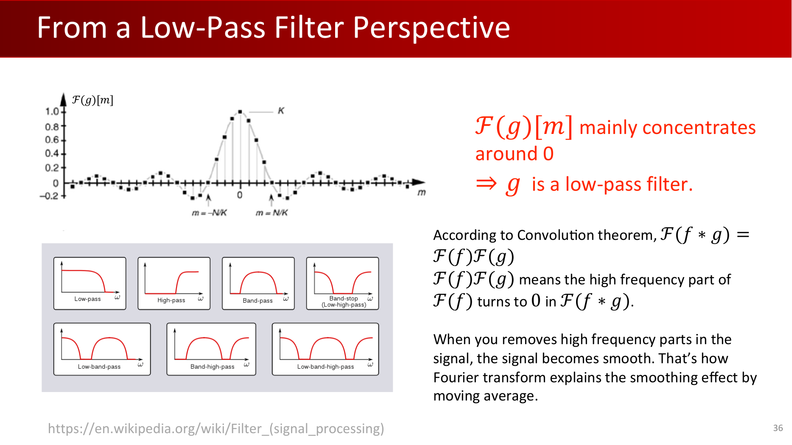

:::remark 📝 问题与解答：矩形滤波器的频域形式
**问题：** **"Our filter is indeed a rectangular function. What is its Fourier transform?"**

**解答：** 其频谱是 sinc 形状：主能量集中在零频附近，并伴随振荡旁瓣。这也是滑动平均表现为低通滤波的根本原因。
:::

## 5. 2D 滤波与非线性阈值化

对 $3\times3$ 滑动平均：

$$
h[m,n]=\frac{1}{9}\sum_{k=n-1}^{n+1}\sum_{l=m-1}^{m+1}f[k,l]
$$

等价卷积形式：

$$
(f*g)[m,n]=\sum_{k,l}f[k,l]g[m-k,n-l]
$$

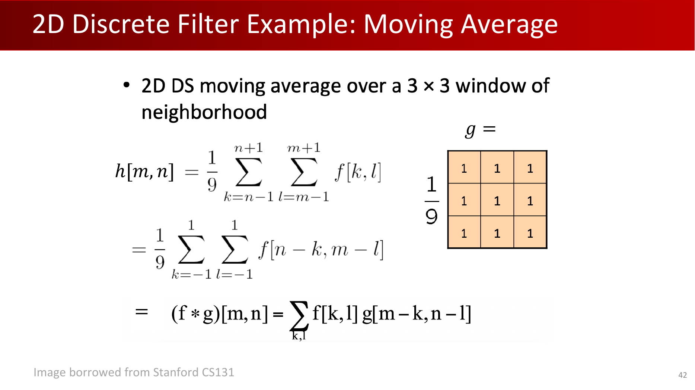

阈值化属于非线性滤波：

$$
h[m,n]=\begin{cases}1,&f[n,m]>\tau\\0,&\text{otherwise}\end{cases}
$$

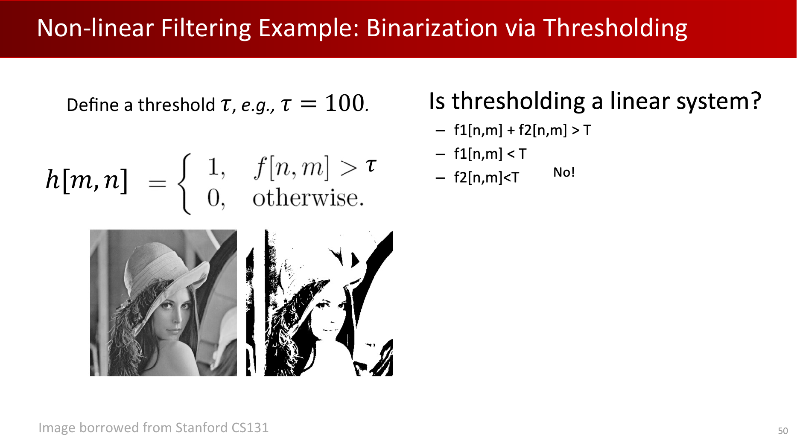

:::tip 💡 问题与解答：阈值化是否线性
**问题：** 阈值化是线性系统吗？

**解答：** 不是。它不满足叠加性，因此是非线性操作。
:::

## 6. 边缘检测准则与成因

边缘的常见成因包括：

- 深度不连续
- 表面朝向不连续
- 表面颜色不连续
- 光照不连续

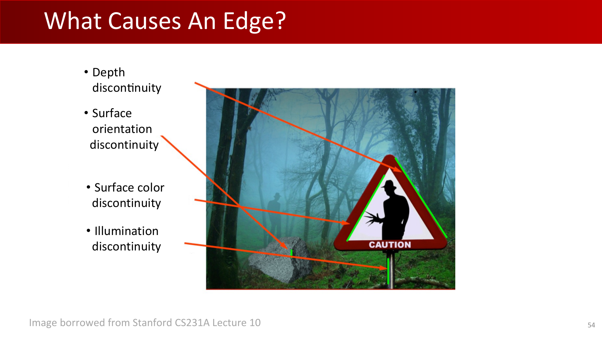

评价检测器时，我们关注精确率、召回率、定位精度与单响应性：

$$
\mathrm{Precision}=\frac{TP}{TP+FP},\quad \mathrm{Recall}=\frac{TP}{TP+FN}
$$

## 7. 从梯度到 Canny 全流程

### 7.1 为什么仅靠梯度不够

**问题：** **"Gradient is non-zero everywhere. Where is the edges?"**

仅看梯度响应会得到过密结果，而且对噪声非常敏感。

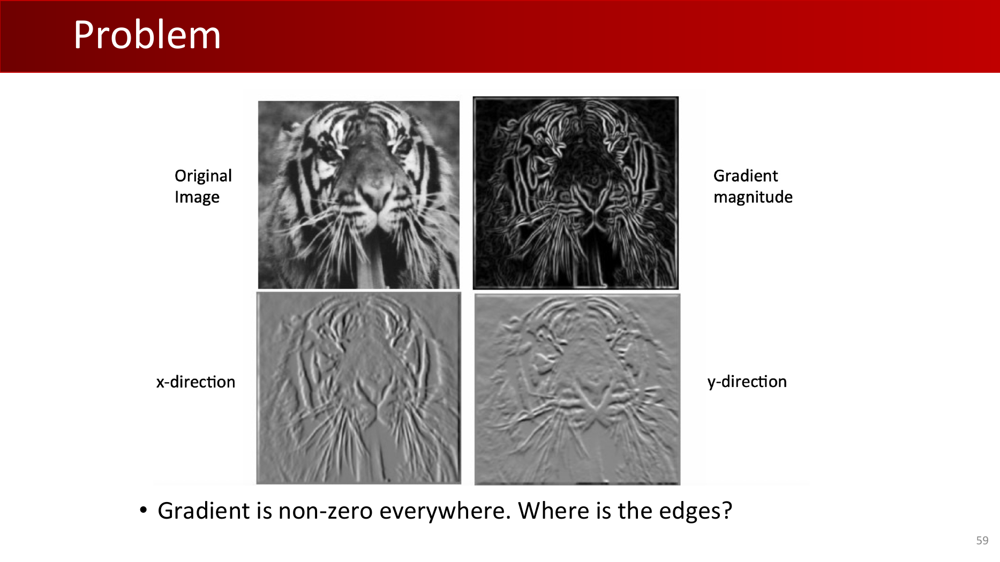

### 7.2 先平滑，再求导

高斯平滑是常用选择：

$$
g(x)=\frac{1}{\sqrt{2\pi}\sigma}\exp\!\left(-\frac{x^2}{2\sigma^2}\right),\quad
\mathcal{F}(g)=\exp\!\left(-\frac{\sigma^2\omega^2}{2}\right)
$$

二维形式：

$$
g(x,y)=\frac{1}{2\pi\sigma^2}\exp\!\left(-\frac{x^2+y^2}{2\sigma^2}\right)
$$

卷积求导定理可降低实现成本：

$$
\frac{d}{dx}(f*g)=f*\frac{d}{dx}g
$$

### 7.3 非极大值抑制（NMS）

对每个像素 $q$，沿梯度方向取邻点：

$$
r=q+g(q),\quad p=q-g(q)
$$

仅当满足下式时保留 $q$：

$$
\text{keep }q\iff g(q)>g(p)\text{ and }g(q)>g(r)
$$

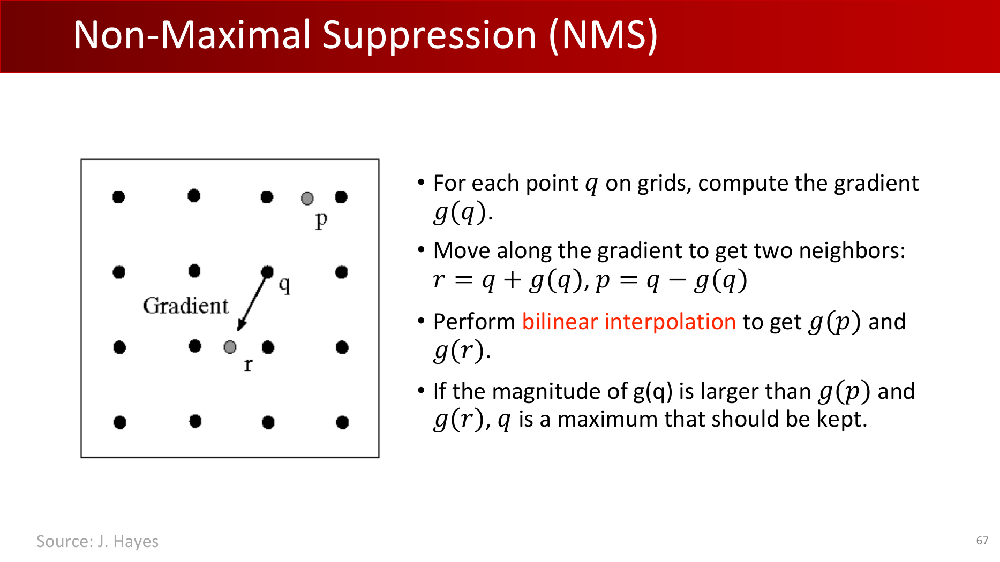

由于 $p,r$ 可能不在网格点上，需要双线性插值。

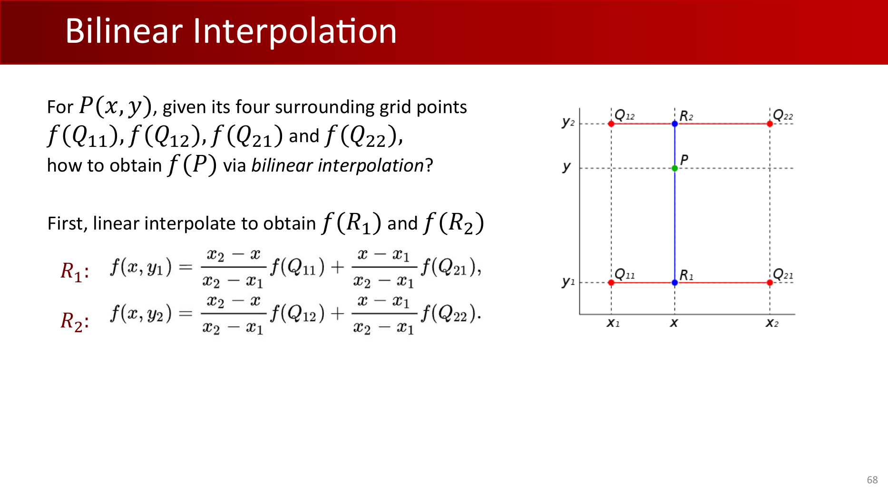

$$
f(x,y_1)=\frac{x_2-x}{x_2-x_1}f(Q_{11})+\frac{x-x_1}{x_2-x_1}f(Q_{21})
$$

$$
f(x,y_2)=\frac{x_2-x}{x_2-x_1}f(Q_{12})+\frac{x-x_1}{x_2-x_1}f(Q_{22})
$$

$$
f(x,y)=\frac{y_2-y}{y_2-y_1}f(x,y_1)+\frac{y-y_1}{y_2-y_1}f(x,y_2)
$$

### 7.4 双阈值与边缘连接

采用双阈值策略：

- 高阈值（`maxVal`）用于启动高置信边缘；
- 低阈值（`minVal`）用于延续与强边缘连通的弱边缘。

课堂给出的经验设置：

$$
\text{maxVal}=0.3\times\operatorname{avg}(\text{NMS-passed magnitudes}),\quad
\text{minVal}=0.1\times\operatorname{avg}(\text{NMS-passed magnitudes})
$$

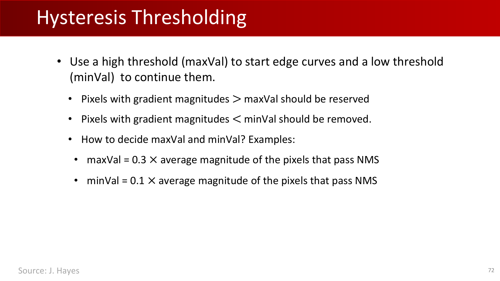

随后利用方向一致性 + 低阈值支撑 + 局部 NMS 一致性进行边缘生长与连接。

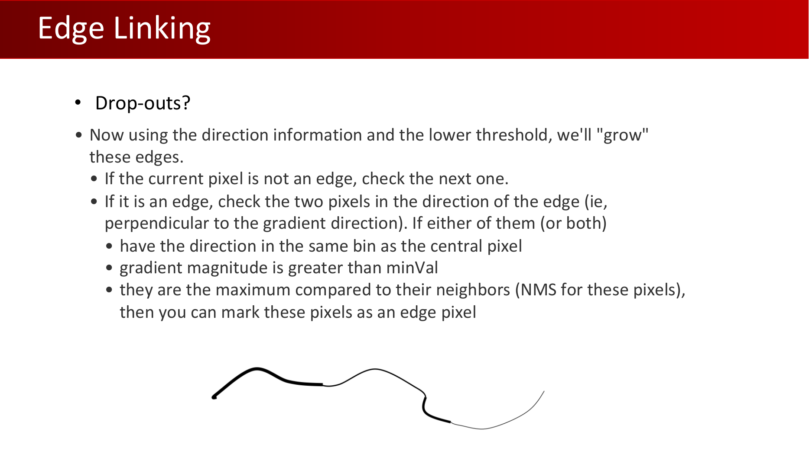

:::warn ⚠️ 问题与解答：Drop-outs
**问题：** **"Drop-outs?"**

**解答：** 对断裂边，迟滞连接会把与强边缘链路连通、且方向一致的弱响应补回来，从而减少断点。
:::

## 8. 平滑与定位的权衡

$\sigma$ 越大，去噪越强，但边界越容易变钝；$\sigma$ 越小，细节保留更好，但更容易受噪声干扰。

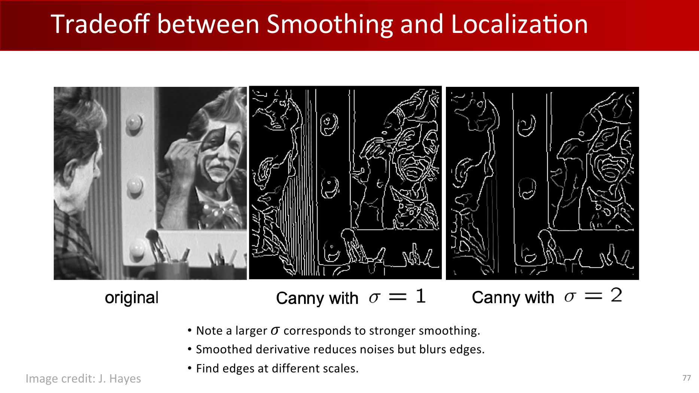

实际工程中，多尺度边缘检测通常优于固定单尺度。

## 9. Canny 检测器：端到端总结

**关键结论：** **高斯一阶导数近似实现了“信噪比与定位精度乘积”最优的边缘算子。**

流程回顾：

1. 高斯平滑。
2. 计算梯度幅值与方向。
3. 非极大值抑制。
4. 迟滞阈值。
5. 边缘连接。

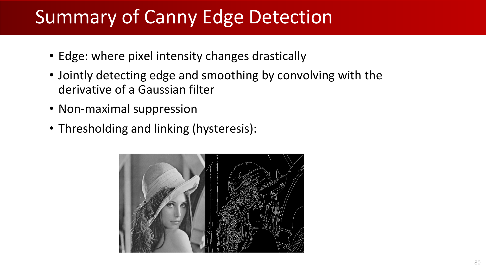

## Exam Review

### A. 必会定义

- **图像函数：** 从空间域到强度/颜色值域的映射。
- **边缘：** 强度在某方向上发生显著变化的区域。
- **线性滤波：** 满足叠加性，可由卷积表示。
- **迟滞阈值：** 通过双阈值实现稳定边缘延续的策略。

### B. 机制链路（必须能口述）

噪声使原始梯度不可靠 -> 低通（高斯）先抑噪 -> 求导提取跃迁 -> NMS 变细边 -> 双阈值与连接保留连通真边。

### C. 简答模板

- 为什么先平滑再做边缘检测？
  - 因为求导会放大高频噪声，平滑能提高信噪比。
- 为什么要 NMS？
  - 把多像素宽的梯度脊线压成近单像素候选边。
- 为什么用双阈值？
  - 保留高置信边的同时恢复与其连通的弱边段。

### D. 常见误区

- 把阈值化误认为线性操作。
- 只用单阈值导致连通性差。
- NMS 忽略插值造成方向偏置。
- 固定单一 $\sigma$，忽视尺度变化。

### E. 自检清单

- 能否推导 1D/2D 中“滑动平均 = 卷积”？
- 能否用 $\mathcal{F}(f*g)=\mathcal{F}(f)\mathcal{F}(g)$ 解释低通行为？
- 能否写出 NMS 的 $q,p,r$ 比较逻辑？
- 能否解释阈值比例和连边判据？
- 能否结合案例说明平滑-定位权衡？
