# Lecture 3: Classic Vision II - Convolution Implementation, Robust Line Fitting, and Harris Corners

## 1. Learning Objectives and Roadmap

This lecture connects three practical threads in classic vision:

- Efficiently implementing convolution on modern hardware.
- Turning edges into robust line models under outliers.
- Detecting stable keypoints using the Harris corner detector.

By the end, you should be able to:

- Explain the exact difference between convolution and correlation.
- Derive least-squares line fitting and its SVD-based homogeneous form.
- Explain why RANSAC works and how to set its iteration count.
- Derive the Harris response from shifted-window energy.

:::remark 📝 Question and answer: lane detection as a system task
**Question:** **"How to detect the lane?"**

**Answer:** Use a modular pipeline: gradient -> edge -> line. The key is not only detecting candidate edges, but making each stage robust (denoising, outlier handling, stable model selection).
:::

## 2. Convolution Operator in Practice

### 2.1 Convolution vs. Correlation

A key slide statement is:

**"Convolution (The kernel $g$ is flipped before shifting)."**

1D and 2D convolution:

$$
(f * g)(n)=\sum_{m=-\infty}^{\infty} f(n-m)\,g(m)
$$

$$
(f * g)(i,j)=\sum_m\sum_n f(i-m,j-n)\,g(m,n)
$$

Cross-correlation (no kernel flip):

$$
(f \star g)(n)=\sum_{m=-\infty}^{\infty} f(n+m)\,g(m)
$$

$$
(f \star g)(i,j)=\sum_m\sum_n f(i+m,j+n)\,g(m,n)
$$

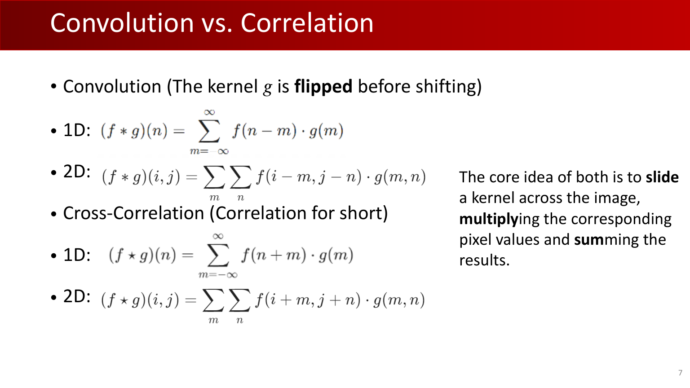

Important properties emphasized in class:

$$
f * g=g * f,
\quad
(f*g)*h=f*(g*h),
\quad
f*(g+h)=f*g+f*h
$$

$$
\mathcal{F}(f*g)=\mathcal{F}(f)\,\mathcal{F}(g),
\quad
\mathcal{F}(f\star g)=\overline{\mathcal{F}(f)}\,\mathcal{F}(g)
$$

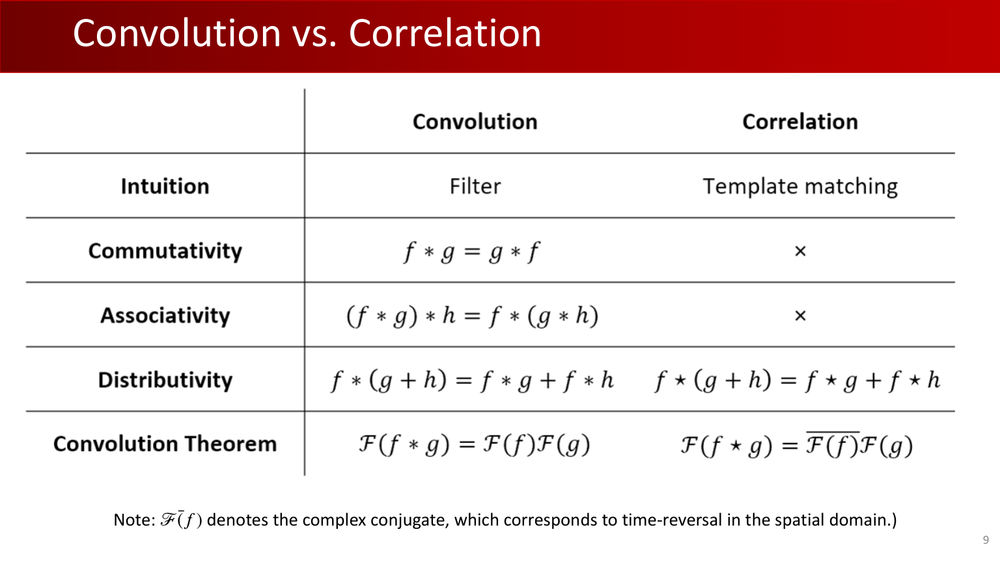

### 2.2 Why Padding Matters

:::tip 💡 Question and answer: why do we need padding?
**Question:** Why do we need padding?

**Answer:** It prevents spatial shrinkage and protects boundary information. Without padding, border pixels are used much fewer times, and feature maps collapse too quickly in deep stacks.
:::

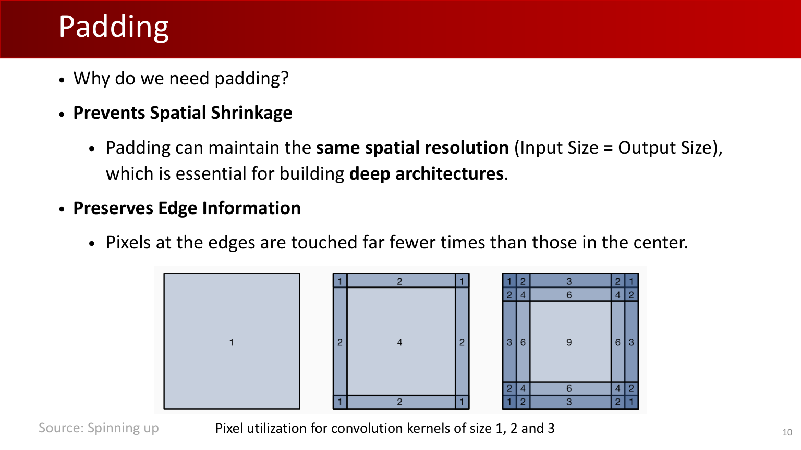

### 2.3 From Sliding Windows to Matrix Multiplication

The practical acceleration route is `im2col + GEMM`:

$$
K\times K\rightarrow 1\times K^2
$$

$$
H\times W\rightarrow K^2\times N,\quad N=H_{out}\times W_{out}
$$

$$
(1\times K^2)\times (K^2\times N)\rightarrow 1\times N
$$

$$
1\times N\rightarrow H_{out}\times W_{out}
$$

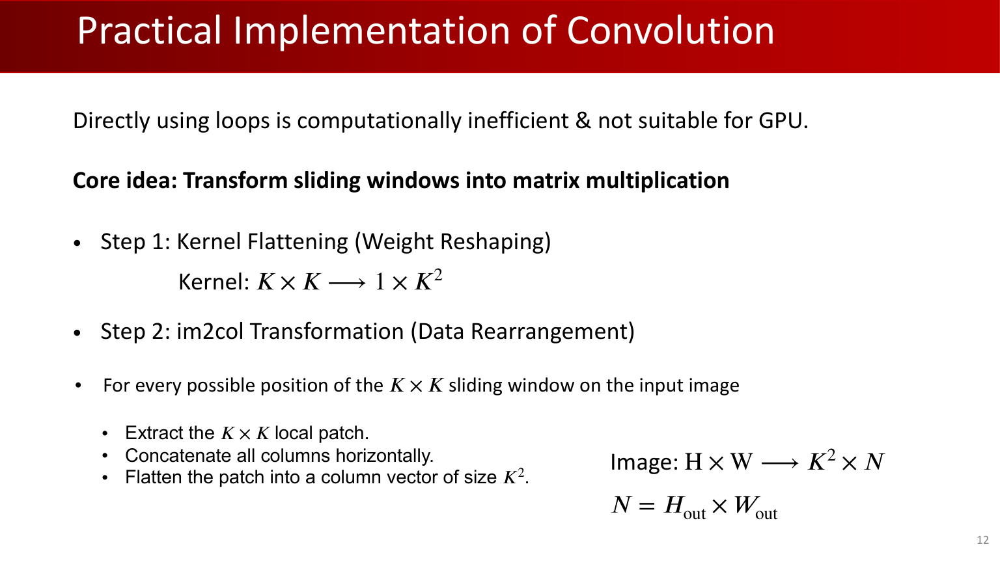

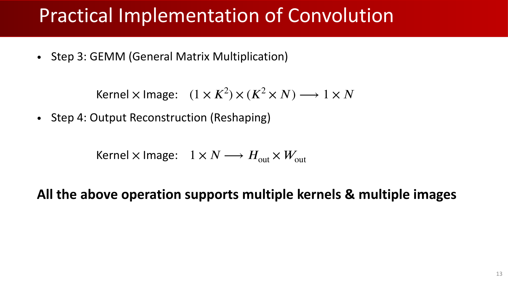

## 3. From Edge Maps to Robust Line Models

### 3.1 Why Edge Detection Alone Is Not Enough

:::remark 📝 Question and answer: "Aren't we done just by doing edge detection?"
**Question:** **"Aren’t we done just by doing edge detection?"**

**Answer:** No. Real data has occlusions, non-ideal shapes, and multiple competing lines. Edge maps are candidates; line fitting and robust selection are still required.
:::

### 3.2 Least-Squares Fitting for $y=mx+b$

For points $(x_i,y_i)$, minimize:

$$
E=\sum_{i=1}^{n}(y_i-mx_i-b)^2
$$

Matrix form:

$$
E=\lVert Y-XB\rVert^2,\quad B=\begin{bmatrix}m\\b\end{bmatrix}
$$

$$
\frac{dE}{dB}=-2X^TY+2X^TXB=0
\Rightarrow
X^TXB=X^TY
\Rightarrow
B=(X^TX)^{-1}X^TY
$$

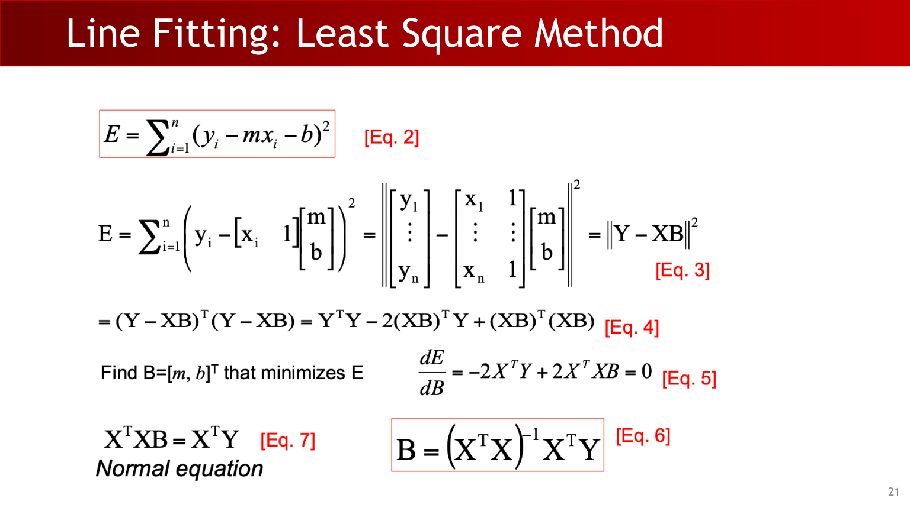

A practical limitation from class: this form fails for vertical lines.

### 3.3 General Line Equation and SVD Solution

Use homogeneous line form:

$$
ax+by=d,
\quad
E=\sum_{i=1}^{n}(ax_i+by_i-d)^2
$$

$$
A=
\begin{bmatrix}
x_1 & y_1 & 1\\
\vdots & \vdots & \vdots\\
x_i & y_i & 1\\
\vdots & \vdots & \vdots\\
x_n & y_n & 1
\end{bmatrix},
\quad
h=\begin{bmatrix}a\\b\\d\end{bmatrix},
\quad
Ah=0
$$

To avoid trivial solution $h=0$:

$$
\min_h \lVert Ah\rVert\quad \text{s.t.}\quad \lVert h\rVert=1
$$

SVD:

$$
A_{n\times 3}=U_{n\times n}D_{n\times 3}V^T_{3\times 3}
$$

$$
V^TV=I_{3\times 3},\ V=[c_1,c_2,c_3],\
D=
\begin{bmatrix}
\operatorname{diag}(\lambda_1,\lambda_2,\lambda_3)\\
O
\end{bmatrix},\
\lambda_1\ge\lambda_2\ge\lambda_3\ge0
$$

With

$$
h=\alpha_1c_1+\alpha_2c_2+\alpha_3c_3,
\quad
\alpha_1^2+\alpha_2^2+\alpha_3^2=1,
$$

we get

$$
\lVert Ah\rVert^2=(\lambda_1\alpha_1)^2+(\lambda_2\alpha_2)^2+(\lambda_3\alpha_3)^2\ge\lambda_3^2
$$

So the optimal solution is:

$$
h=c_3
$$

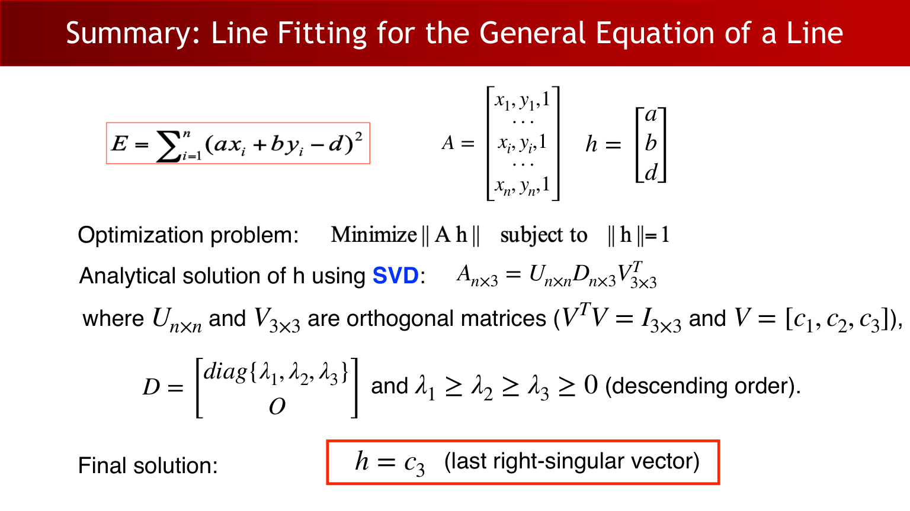

### 3.4 RANSAC: Random Sample Consensus

Core setup:

$$
|P|=|I|+|O|
$$

where $P$ is all points, $I$ inliers, $O$ outliers.

Algorithm skeleton:

1. Sample minimal set size $s$.
2. Fit a candidate model.
3. Count inliers under threshold $\delta$.
4. Repeat $N$ times and keep the best consensus.

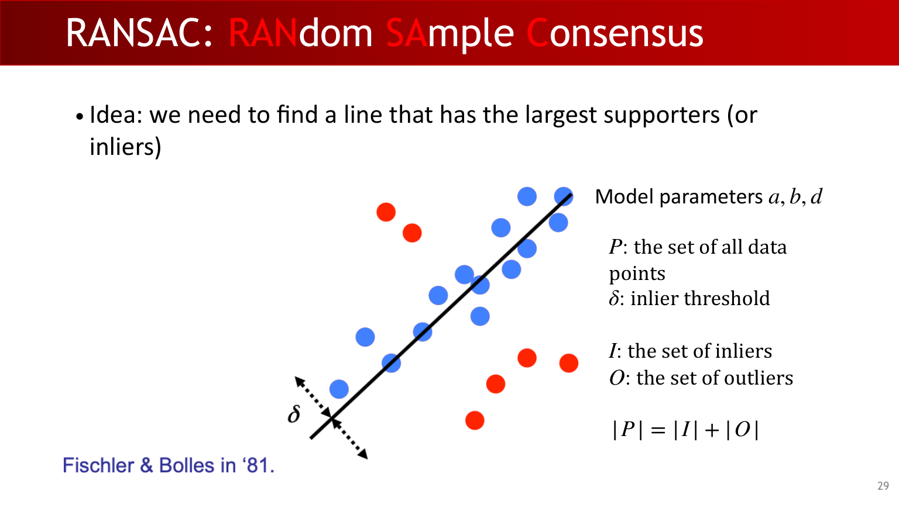

### 3.5 Choosing the Number of Samples

:::remark 📝 Question and answer: how many samples?
**Question:** **"How many samples?"**

**Answer:** Use the failure-probability model:

$$
N=\frac{\log(1-p)}{\log\big(1-(1-e)^s\big)}
$$

where $p$ is target success probability, $e$ outlier ratio, and $s$ minimal sample size.
For example, with $p=0.99$, $e=0.3$, $s=2$, the class table gives about $N=7$.
:::

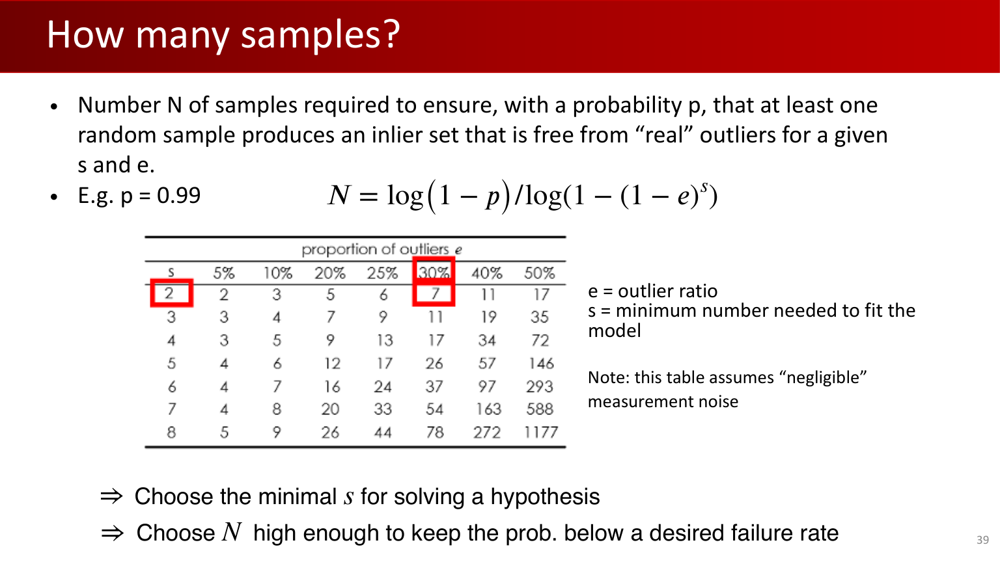

### 3.6 RANSAC vs. Hough from a Voting Perspective

Hough transform moves voting to parameter space (e.g., $y=mx+n$). Compared with RANSAC:

- RANSAC is strong for a dominant single model with outliers.
- Hough can better handle multi-mode structures and high outlier ratios, but may suffer spurious peaks.

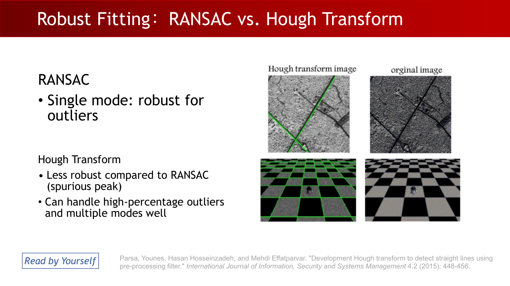

## 4. What Makes a Good Keypoint

:::remark 📝 Question and answer: what points are keypoints?
**Question:** **"What Points are Keypoints?"**

**Answer:** Good keypoints must be salient, repeatable, and accurately localized with enough quantity for matching.
:::

Class criteria summarized:

- **"Repeatability: detect the same point independently in both images."**
- Saliency (informative local structure).
- Accurate localization.
- Sufficient count.
- Invariance to illumination, scale, and viewpoint changes.

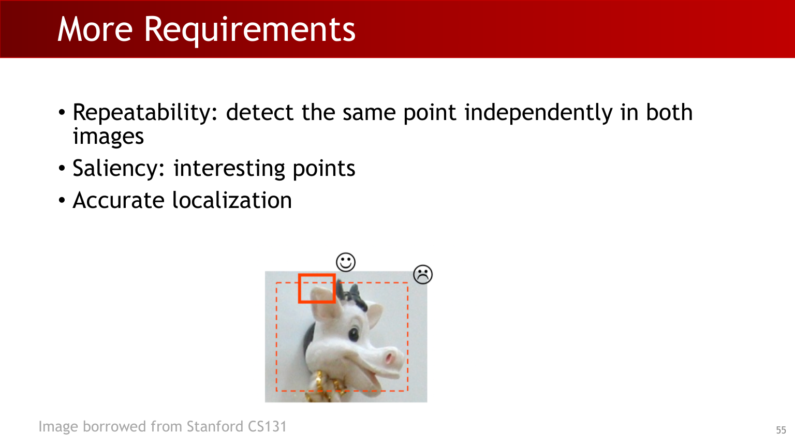

Corners are emphasized because local gradients vary significantly in more than one dominant direction.

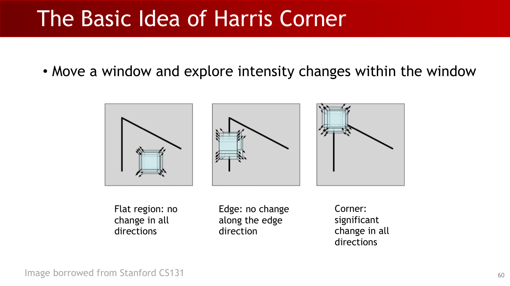

## 5. Harris Corner Detector: Derivation to Pipeline

### 5.1 Shifted-Window Energy

Start from local shift energy:

$$
E_{(x_0,y_0)}(u,v)=\sum_{(x,y)\in N(x_0,y_0)}[I(x+u,y+v)-I(x,y)]^2
$$

Define intensity difference map and window:

$$
D_{u,v}(x,y)=[I(x+u,y+v)-I(x,y)]^2
$$

$$
w(x,y)=
\begin{cases}
1,&-b\le x,y\le b\\
0,&\text{else}
\end{cases}
$$

So:

$$
E_{(x_0,y_0)}(u,v)=(D_{u,v}*w)(x_0,y_0)
$$

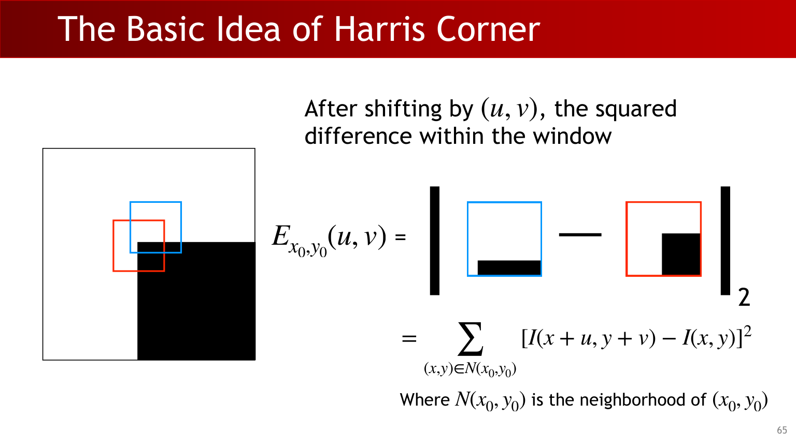

### 5.2 First-Order Approximation and Structure Tensor

For small $(u,v)$:

$$
I[x+u,y+v]-I[x,y]\approx I_xu+I_yv
$$

$$
D_{u,v}(x,y)\approx (I_xu+I_yv)^2=
[u,v]
\begin{bmatrix}
I_x^2 & I_xI_y\\
I_xI_y & I_y^2
\end{bmatrix}
\begin{bmatrix}u\\v\end{bmatrix}
$$

$$
E_{(x_0,y_0)}(u,v)\approx
[u,v]
\begin{bmatrix}
I_x^2*w & I_xI_y*w\\
I_xI_y*w & I_y^2*w
\end{bmatrix}
\begin{bmatrix}u\\v\end{bmatrix}
$$

Define:

$$
M(x,y)=
\begin{bmatrix}
I_x^2*w & I_xI_y*w\\
I_xI_y*w & I_y^2*w
\end{bmatrix}
$$

Then

$$
E_{(x_0,y_0)}(u,v)\approx [u,v]M(x_0,y_0)\begin{bmatrix}u\\v\end{bmatrix}
$$

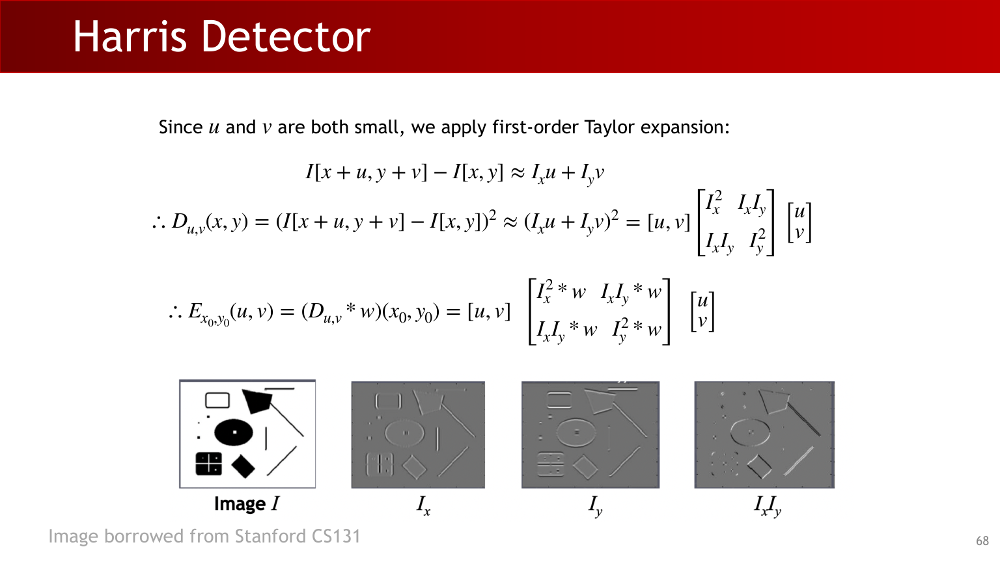

### 5.3 Eigenvalue Interpretation

Since $M$ is symmetric positive semi-definite, eigendecompose:

$$
M(x,y)=Q
\begin{bmatrix}
\lambda_1 & 0\\
0 & \lambda_2
\end{bmatrix}
Q^T,
\quad
\lambda_1,\lambda_2\ge0
$$

$$
E_{(x_0,y_0)}(u,v)\approx \lambda_1u'^2+\lambda_2v'^2,
\quad
\begin{bmatrix}u'\\v'\end{bmatrix}=Q\begin{bmatrix}u\\v\end{bmatrix}
$$

Corner-like condition from class:

$$
\lambda_1,\lambda_2>b,
\quad
\frac{1}{k}<\frac{\lambda_1}{\lambda_2}<k
$$

### 5.4 Corner Response Function and Gaussian Window

Class response function form:

$$
\theta(x,y)=\det(M(x,y))-\alpha\operatorname{Tr}(M(x,y))^2-t
$$

Equivalent conditions shown in class:

$$
\lambda_1,\lambda_2>b
\iff
\lambda_1\lambda_2-2t>0,\quad t=\frac{b^2}{2}
$$

$$
\frac{1}{k}<\frac{\lambda_1}{\lambda_2}<k
\iff
\lambda_1\lambda_2-2\alpha(\lambda_1+\lambda_2)^2>0
$$

$$
\theta=
\frac{1}{2}\big(\lambda_1\lambda_2-2\alpha(\lambda_1+\lambda_2)^2\big)
+
\frac{1}{2}\big(\lambda_1\lambda_2-2t\big)
$$

A practical setting highlighted in slides: if $k\approx 3$, use $\alpha\approx 0.045$.

Gaussian window improves rotation behavior:

$$
M(x,y)=
\begin{bmatrix}
I_x^2*g_\sigma & I_xI_y*g_\sigma\\
I_xI_y*g_\sigma & I_y^2*g_\sigma
\end{bmatrix}
$$

$$
\theta(x,y)=g(I_x^2)g(I_y^2)-[g(I_xI_y)]^2-\alpha[g(I_x^2)+g(I_y^2)]^2-t
$$

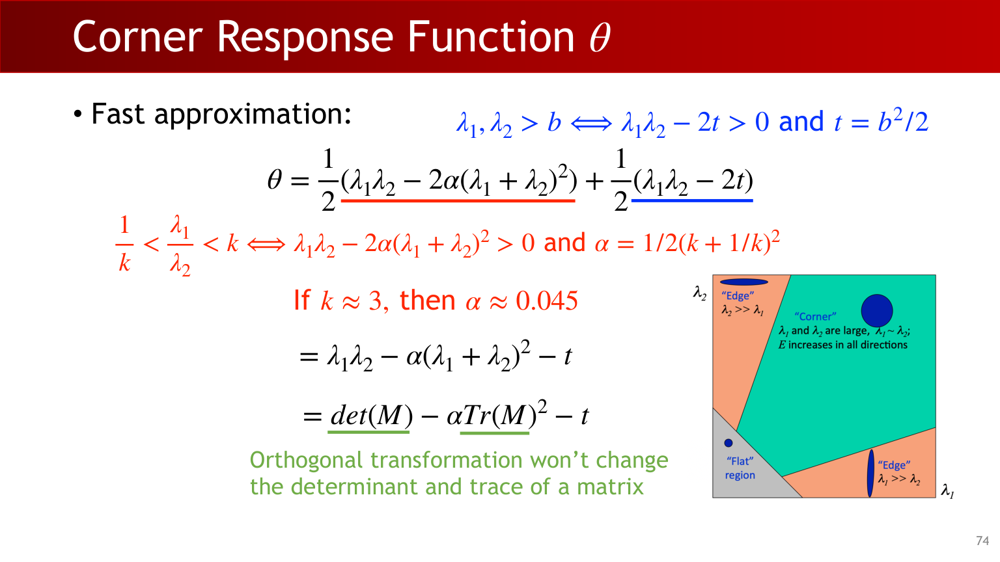

:::tip 💡 Question and answer: why Gaussian window?
**Question:** Why replace a hard rectangle window with a Gaussian window?

**Answer:** A Gaussian window is isotropic and rotation-friendly, so the response is less biased by window orientation while remaining local.
:::

### 5.5 End-to-End Harris Procedure and Property

Pipeline:

1. Compute image derivatives $I_x,I_y$.
2. Build squared/cross terms $I_x^2, I_y^2, I_xI_y$.
3. Aggregate with window (rectangle or Gaussian).
4. Compute response $\theta(x,y)$.
5. Threshold $\theta(x,y)>0$.
6. Run non-maximum suppression.

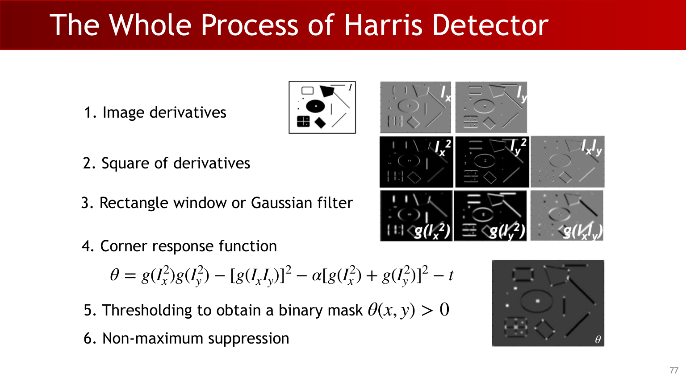

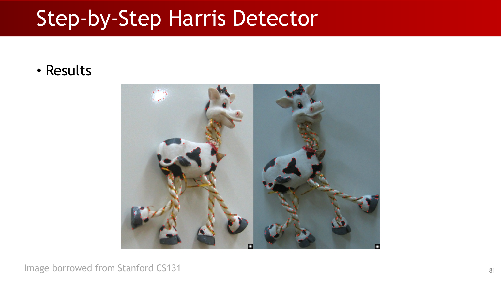

Final property statement from class:

**"Corner response is equivariant with both translation and image rotation."**

## Exam Review

### A. Must-Know Definitions

- **Convolution:** kernel-flipped linear filtering operation.
- **Correlation:** template matching operation without kernel flip.
- **RANSAC:** repeated minimal sampling + consensus maximization under outliers.
- **Structure tensor $M$:** local second-moment matrix encoding directional intensity changes.
- **Harris response $\theta$:** scalar score balancing determinant and trace of $M$.

### B. Mechanism Chain You Should Explain Clearly

Convolution needs efficient implementation -> im2col + GEMM turns sliding windows into matrix multiply -> edge maps alone are insufficient for line estimation -> SVD gives stable homogeneous line fitting -> RANSAC handles outliers via consensus -> corner matching requires repeatable keypoints -> Harris turns shifted-window energy into eigenvalue-based corner scoring.

### C. Short-Answer Templates

- Why does least-squares $y=mx+b$ fail in some cases?
  - Because vertical lines are not representable with finite slope $m$.
- Why does SVD solve homogeneous line fitting?
  - The minimizer of $\lVert Ah\rVert$ under $\lVert h\rVert=1$ is the right-singular vector of the smallest singular value.
- Why do we need RANSAC iterations?
  - To guarantee, with probability $p$, that at least one sample is outlier-free.
- Why use eigenvalues in Harris?
  - They reveal intensity variation strength along principal directions.

### D. Common Mistakes

- Mixing up convolution and correlation in implementation.
- Applying least-squares slope-intercept form to vertical structures.
- Using too few RANSAC iterations for large outlier ratios.
- Skipping smoothing/window aggregation before Harris response.
- Using only thresholding without non-maximum suppression.

### E. Self-Check Checklist

- Can you write convolution and correlation formulas in 1D/2D?
- Can you derive the normal equation and explain its limitation?
- Can you explain why $h=c_3$ in SVD line fitting?
- Can you compute/estimate $N$ in RANSAC from $p,e,s$?
- Can you derive Harris from $E(u,v)$ to $M$ to $\theta$?
