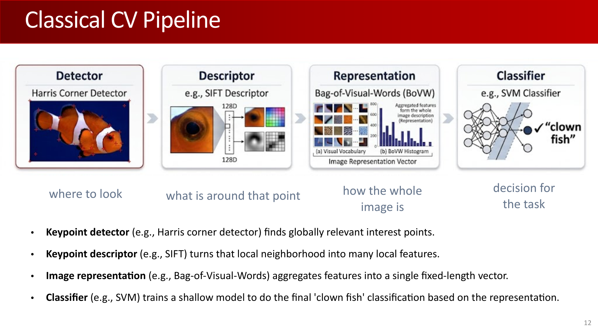
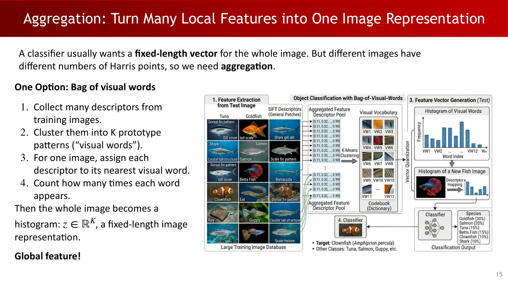
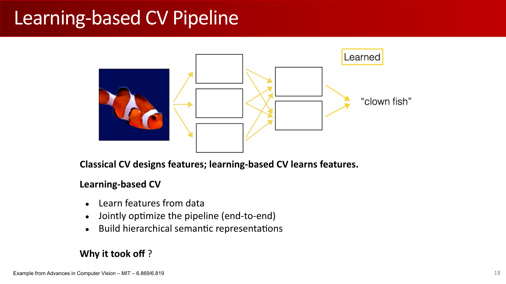
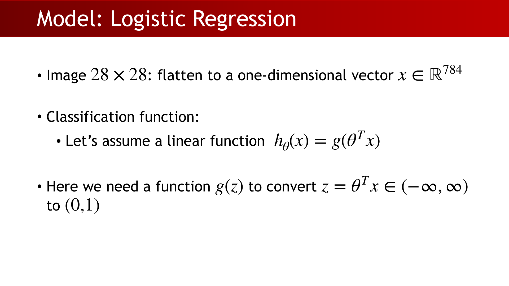
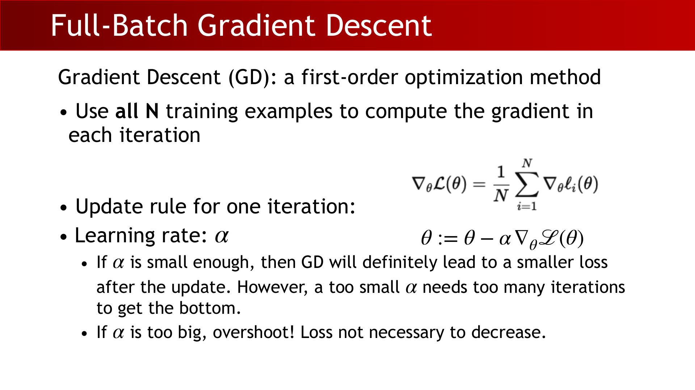
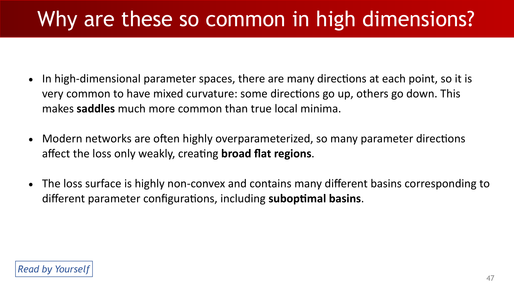
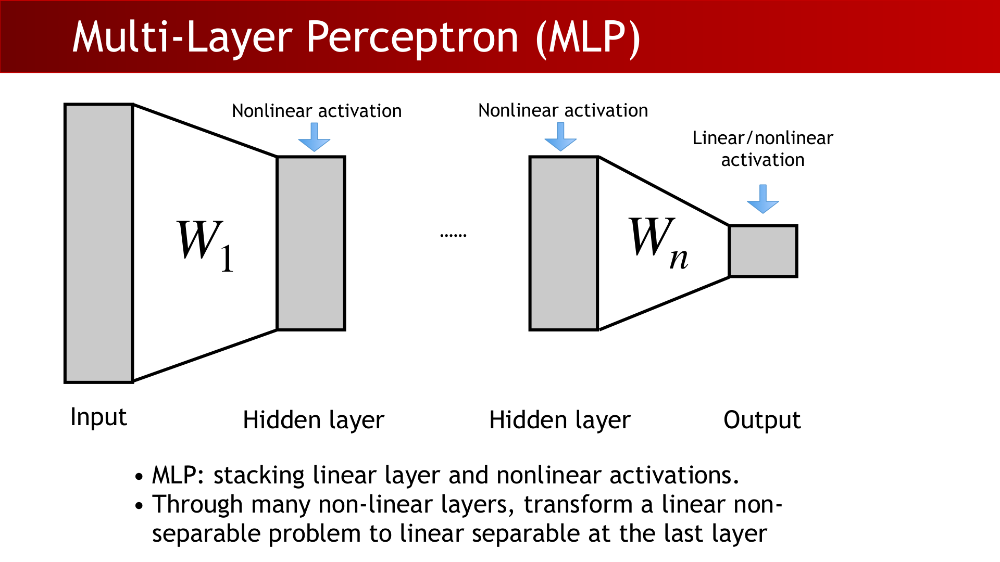
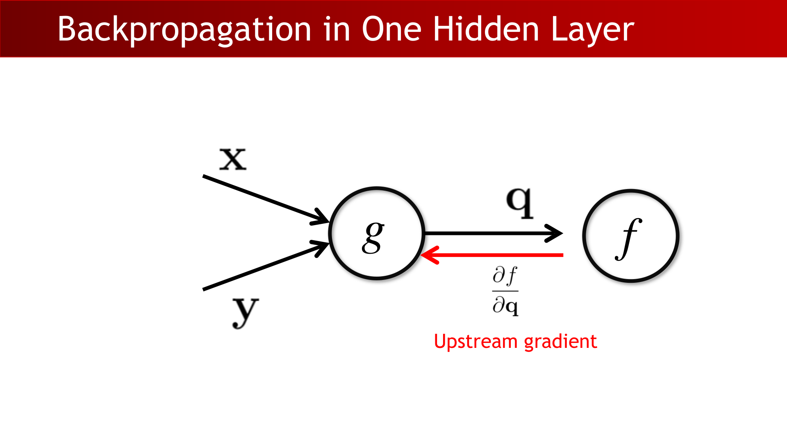
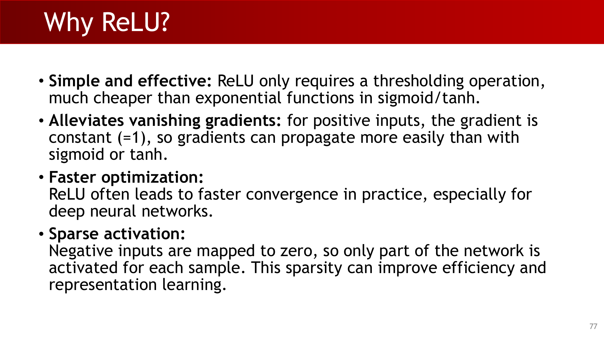
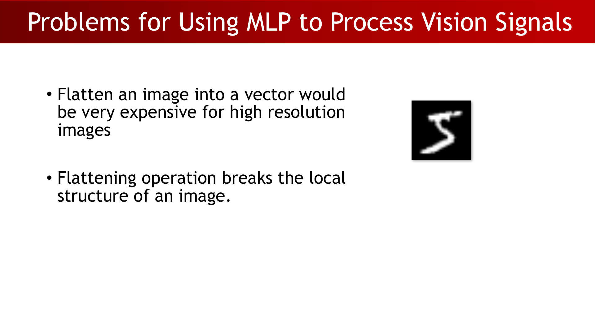

# Lecture 4: From Classical Vision to Deep Learning I

## 1. From Repeatable Corners to Learning Pipelines

The lecture opens by tying together a familiar vision goal: the features we use should remain stable when the image changes in nuisance ways. In practice, that means we want detectors and descriptors that are predictable under translation and rotation, and ideally robust enough to support matching and recognition.

Two properties matter here:

- **Equivariance:** if the input is transformed, the output transforms in a corresponding way.
- **Invariance:** if the input is transformed, the output stays the same.

For a transformation $T$ and a function $f$, the two concepts are written as:

$$
T[f(X)] = f(T(X))
$$

and

$$
 f(T(X)) = f(X).
$$

For Harris, the key takeaway is that the corner response is equivariant with translation and rotation, but it is not scale invariant. That is why scale-aware detectors still matter.

The Harris corner detector is usually written through the local second-moment matrix:

$$
M =
\begin{bmatrix}
G_\sigma * I_x^2 & G_\sigma * I_x I_y\\
G_\sigma * I_x I_y & G_\sigma * I_y^2
\end{bmatrix},
$$

with response

$$
\theta = \det(M) - \alpha\,\mathrm{trace}(M)^2.
$$

The Gaussian window $G_\sigma$ is isotropic, so it preserves rotation behavior while smoothing local evidence.

:::remark 📝 Question and answer: why do we care about equivariance?
**Question:** **Why should a detector or descriptor be equivariant or invariant?**

**Answer:** Because matching should depend on structure, not on accidental image position or orientation. If a feature changes arbitrarily when the image shifts or rotates, then correspondence becomes unstable.
:::

## 2. The Classical CV Pipeline

The classical pipeline is organized around three questions:

- Where should we look?
- What is around that point?
- How should the whole image be represented for the task?

That gives the standard detector-descriptor-classifier flow:

1. A keypoint detector, such as Harris, finds stable interest points.
2. A keypoint descriptor, such as SIFT, turns a local neighborhood into a feature vector.
3. The features are aggregated or directly fed to a classifier.

SIFT is one of the best-known descriptors. It converts a local patch into a 128-dimensional vector, which is then used for matching or recognition. Bag of visual words takes many descriptors, clusters them into prototype patterns, and represents one image as a histogram over those visual words.

This design has an important limitation: the classifier does not see raw pixels, only hand-crafted intermediate representations.

:::tip 💡 Question and answer: what is the purpose of a descriptor?
**Question:** **What does a descriptor do?**

**Answer:** It converts a local image patch into a stable numeric representation so that similar patches can be compared even when their appearance changes slightly.
:::

## 3. Why Learning-Based Vision Took Over

Classical vision became less dominant for three practical reasons:

- It depended heavily on hand-designed features and task-specific engineering.
- Errors accumulated stage by stage, so a weak detector or segmenter could damage the whole pipeline.
- It struggled with high-level semantic understanding.

Learning-based vision flips the design philosophy: instead of designing every feature manually, the model learns features from data and optimizes the full pipeline end to end.

Three enablers made that shift possible:

- Large datasets, especially ImageNet and its benchmarks.
- More compute, especially GPUs and later TPUs.
- Deep learning algorithms that can learn hierarchical semantic representations.

:::remark 📝 Question and answer: why did classical CV lose dominance?
**Question:** **Why did classical CV become less dominant?**

**Answer:** Because the pipeline was too manually engineered, too brittle to error accumulation, and too weak at semantic understanding compared with learned representations.
:::

## 4. Machine Learning 101

The core idea of machine learning is simple: use observations to fit a parameterized model.

The lecture uses line fitting as the warm-up and then transfers the same mindset to neural networks:

- In line fitting, we assume a linear relationship and estimate parameters from data.
- In neural network training, we assume a model family and fit its weights to labeled examples.

The practical training loop has five steps:

1. Prepare labeled data.
2. Build a model.
3. Choose a loss function.
4. Optimize the model on the training set.
5. Evaluate on held-out test data.

For the binary MNIST task, the question is whether a handwritten digit is a 5. Each input image has size $28\times 28$, so we flatten it into a 784-dimensional vector:

$$
x \in \mathbb{R}^{784}.
$$

A linear classifier by itself is too rigid, so we pass the score through the sigmoid function:

$$
g(z)=\frac{1}{1+e^{-z}},
\qquad
h_\theta(x)=g(\theta^T x).
$$

This gives a probability-like output in $(0,1)$.

:::remark 📝 Question and answer: why start from line fitting?
**Question:** **Why does the lecture start from line fitting?**

**Answer:** Because line fitting exposes the same training pattern as neural networks: choose a model, define an objective, and fit parameters from data.
:::

## 5. Likelihood, Loss, and Optimization

Maximum likelihood estimation says: choose the parameters that make the observed data most probable under the assumed model.

For binary classification, the model assigns:

$$
p(y=1\mid x;\theta)=h_\theta(x),
\qquad
p(y=0\mid x;\theta)=1-h_\theta(x).
$$

Assuming independence across data points, the likelihood of the full dataset is:

$$
p(Y\mid X;\theta)=\prod_{i=1}^{N} p(y^{(i)}\mid x^{(i)};\theta).
$$

The negative log-likelihood becomes the standard binary cross-entropy loss:

$$
\mathcal{L}(\theta)= -\sum_{i=1}^{N}\Big[y^{(i)}\log h_\theta(x^{(i)}) + (1-y^{(i)})\log\big(1-h_\theta(x^{(i)})\big)\Big].
$$

The optimization goal is to minimize this loss. Full-batch gradient descent updates the parameters using all $N$ training examples in each iteration:

$$
\theta \leftarrow \theta - \eta\nabla_\theta \mathcal{L}(\theta).
$$

A small learning rate can make progress stable, but too small a value slows training dramatically.

:::remark 📝 Question and answer: why use MLE?
**Question:** **Why do we formulate classification as maximum likelihood estimation?**

**Answer:** It gives a principled objective that turns prediction into probability fitting, and its negative log becomes a convenient loss for optimization.
:::

:::warn ⚠️ Question and answer: why can full-batch GD stall?
**Question:** **Why may full-batch gradient descent stall in deep learning?**

**Answer:** Deep loss landscapes are non-convex and high-dimensional, so optimization can linger near saddle regions or broad flat plateaus where gradients are weak.
:::

Stochastic gradient descent updates with one sample at a time, which is cheap but noisy. Mini-batch gradient descent uses a small subset of training examples in each step, balancing speed and stability.

A compact mini-batch recipe is:

1. Shuffle the training set.
2. Split it into mini-batches of size $m$.
3. Compute gradients on one mini-batch.
4. Update the parameters.
5. Repeat for multiple epochs.

When $m=1$, the method becomes pure SGD. When $m=N$, it becomes full-batch gradient descent.

## 6. Multilayer Perceptrons and Backpropagation

A single linear layer can only represent linearly separable problems. The multilayer perceptron fixes this by stacking linear layers and nonlinear activations:

$$
f(x;\theta)=g\big(W_2\,g(W_1x+b_1)+b_2\big).
$$

A bias term can also be absorbed by appending a constant 1 to the input, which lets the model write the layer compactly as $Wx+b$.

The training cycle is:

1. Initialize weights randomly.
2. Run the forward pass.
3. Compute the loss.
4. Propagate gradients backward.
5. Update the weights.

Backpropagation is the efficient way to compute gradients through a computation graph. The key concept is the chain rule: each node receives an upstream gradient, multiplies it by the local gradient, and sends the result downstream.

Manual differentiation is possible in small examples, but it becomes unmanageable for real models. Backpropagation turns that bookkeeping into matrix operations.

:::remark 📝 Question and answer: why do we need backpropagation?
**Question:** **Why not derive every gradient by hand?**

**Answer:** Because the calculus becomes too large and too brittle. Backpropagation reuses local derivatives, so the same algorithm works even when the network changes.
:::

## 7. Activation Functions

The lecture highlights ReLU as the practical default for deep networks:

$$
\mathrm{ReLU}(x)=\max(0,x).
$$

Why it works well:

- It is cheap to compute.
- It helps reduce vanishing gradients because the positive side has constant slope 1.
- It often converges faster than sigmoid or tanh in deep models.

:::tip 💡 Question and answer: why use ReLU?
**Question:** **Why is ReLU preferred in deep networks?**

**Answer:** It is simple, fast, and keeps gradients alive on the positive side, which makes optimization easier than with saturating activations.
:::

## 8. Why MLPs Are Not a Great Vision Model

Flattening an image into a vector has two problems:

- It is expensive for high-resolution inputs.
- It destroys local spatial structure, which is exactly what vision models should preserve.

That is why MLPs are a weak fit for raw vision signals. Convolutional models and later architectures exploit locality and weight sharing, while plain MLPs treat the image as an unordered list of numbers.

:::remark 📝 Question and answer: what is the core weakness of flattening?
**Question:** **Why is flattening a bad idea for vision?**

**Answer:** Because it discards neighborhood relationships and makes the input dimension huge, so the model loses the structure that images naturally have.
:::

## Exam Review

### A. Must-Know Definitions

- **Equivariance:** the output transforms in a corresponding way when the input is transformed.
- **Invariance:** the output does not change when the input is transformed.
- **SIFT:** a 128-dimensional descriptor for local image patches.
- **Bag of visual words:** a histogram-style image representation built from clustered local descriptors.
- **Maximum likelihood estimation:** parameter estimation by maximizing the probability of the observed data.
- **Sigmoid:** $g(z)=\frac{1}{1+e^{-z}}$.
- **Full-batch gradient descent:** one update uses all training examples.
- **Mini-batch gradient descent:** one update uses a small subset of training examples.
- **Backpropagation:** efficient gradient computation through a computation graph.
- **ReLU:** $\max(0,x)$.

### B. Mechanism Chain You Should Be Able to Explain

Repeatable keypoints lead to descriptors, descriptors lead to aggregated image representations, aggregated representations lead to classical classifiers. Learning-based vision replaces hand-designed features with learned ones. For a binary classifier, the training story is: flatten the image, choose a model, define a likelihood-based loss, optimize it with gradient descent, and use backpropagation to compute gradients efficiently.

### C. Short-Answer Templates

- Why do we use a descriptor?
  - To turn a local patch into a stable feature vector for matching or classification.
- Why does a single-layer model fail on many vision tasks?
  - Because it can only separate linearly separable patterns in the flattened space.
- Why is MLE useful here?
  - It converts classification into a probability-fitting problem and gives a standard loss.
- Why does mini-batch GD help?
  - It reduces compute per update while keeping enough gradient signal for stable progress.
- Why is backpropagation essential?
  - It computes gradients for every parameter efficiently via the chain rule.
- Why is ReLU favored?
  - Because it is cheap and avoids saturation on the positive side.

### D. Common Mistakes

- Treating equivariance and invariance as the same thing.
- Forgetting that classical vision depends on hand-crafted features and aggregation.
- Using a linear model on a task that needs nonlinear separation.
- Confusing likelihood with loss without taking the negative log.
- Thinking full-batch GD is always faster because it uses more data per step.
- Flattening images and expecting the model to preserve spatial locality automatically.

### E. Self-Check Checklist

- Can you define equivariance and invariance clearly?
- Can you explain the detector-descriptor-classifier pipeline?
- Can you write the sigmoid model and the binary likelihood?
- Can you derive the binary cross-entropy loss from the likelihood?
- Can you explain the difference between full-batch GD, SGD, and mini-batch GD?
- Can you describe forward pass, backward pass, and backpropagation in one sentence each?
- Can you explain why ReLU works better than sigmoid in deep models?
- Can you explain why flattening is harmful for vision?
