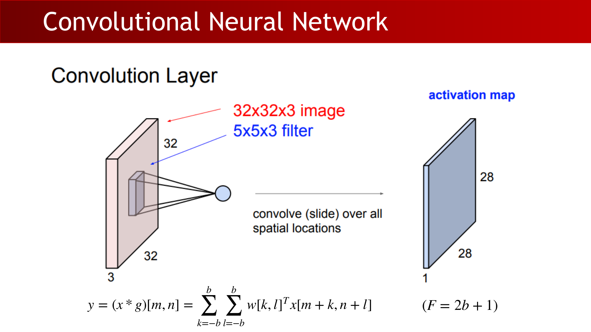
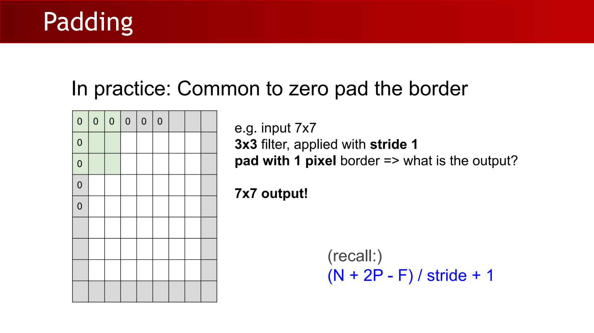
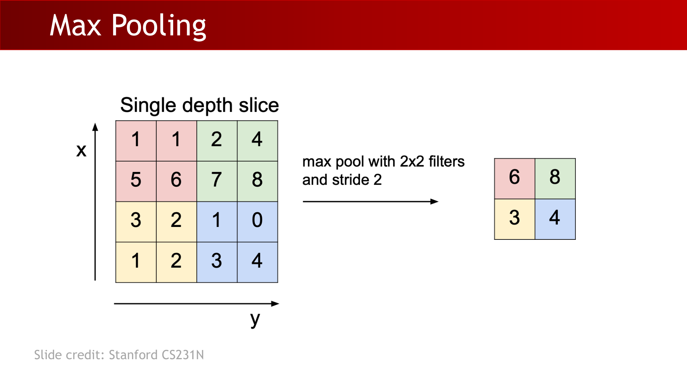
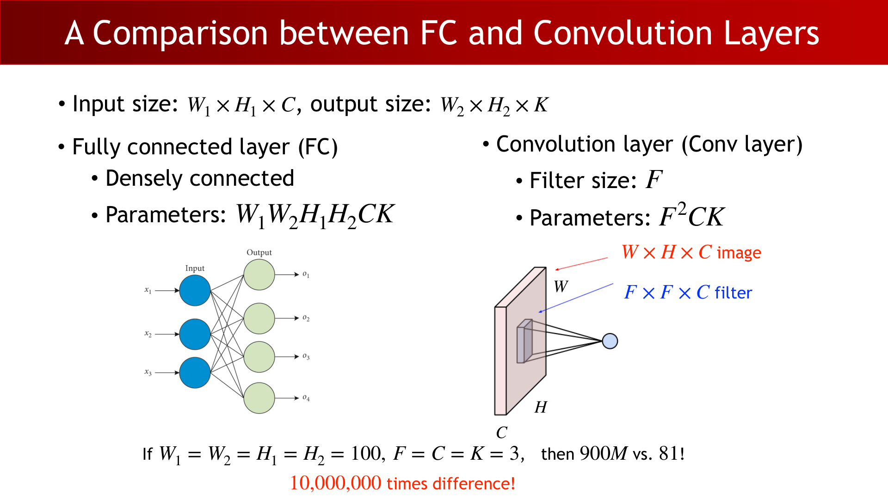
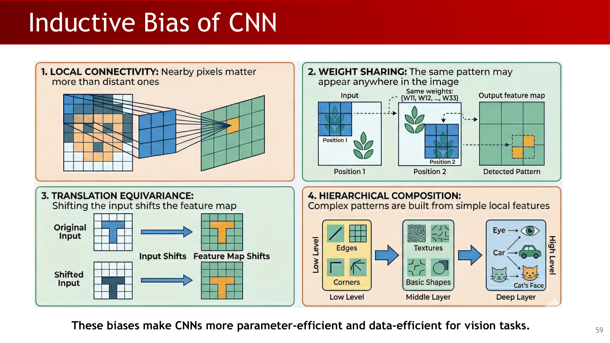
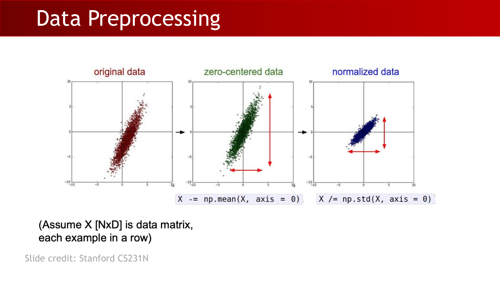
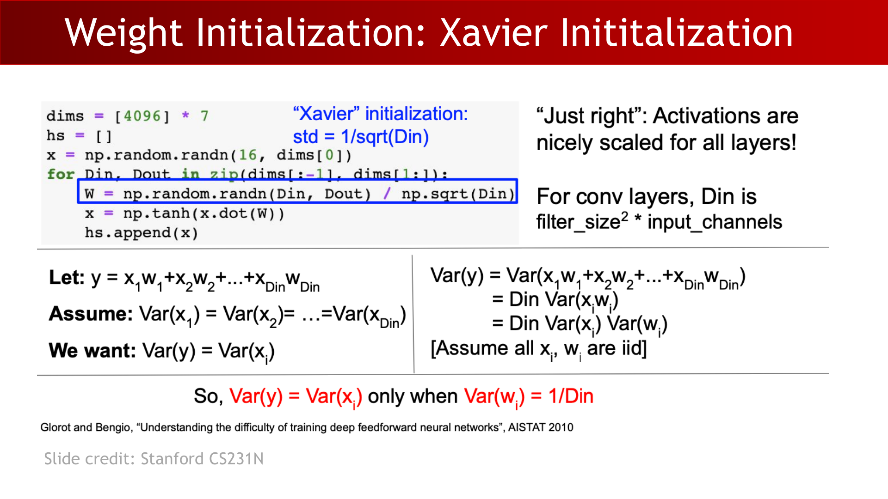
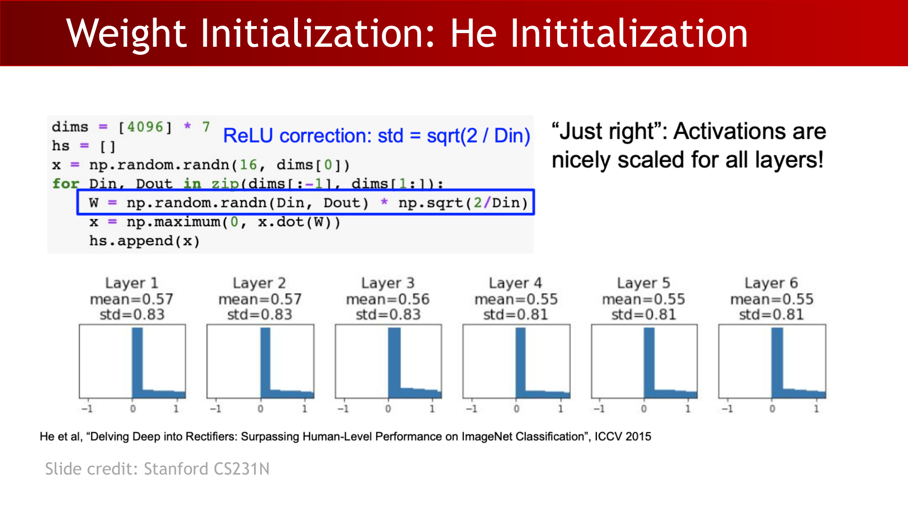
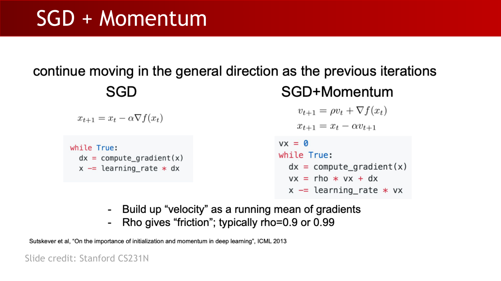
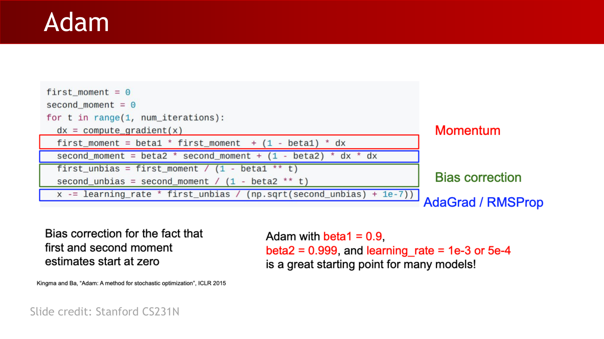

# Lecture 5: Deep Learning II (CNN Foundations and Training)

## 1. Why Move from MLP to CNN

This lecture starts from a practical bottleneck in vision modeling: fully connected MLPs do not respect image structure.

- Flattening an image into a vector is expensive for high-resolution inputs.
- Flattening destroys local spatial structure.
- Vision tasks depend on local patterns (edges, corners, textures) and their compositions.

The neuron-level abstraction is still the same:

$$
f\left(\sum_i w_i x_i+b\right)
$$

You can also view spike-based neurons as a temporal extension:

$$
V_j[t+1]=\lambda V_j[t]+\sum_i w_{ij}S_i[t]+b_j,\qquad
S_j[t]=\mathbb{1}\left(V_j[t]\ge\theta_j\right)
$$

:::remark Question and answer: Why CNN?
**Question (from class prompts):** **Which is more expressive: CNN or FC? What is the problem of FC/MLP?**

**Answer:** **FC is a super set of Conv layer (without sparse and parameter sharing constraints.)**  
But in vision this extra freedom is usually harmful: too many parameters, weak inductive bias, easier overfitting, and poorer data efficiency.
:::

## 2. Convolution Layer Mechanics

2D convolution/correlation computes local weighted sums:

$$
(f*g)[m,n]=\sum_{k=-\infty}^{\infty}\sum_{l=-\infty}^{\infty} f[m+k,n+l]g[k,l]
$$

In CNN practice (finite filter support):

$$
y=(x*g)[m,n]=\sum_{k=-b}^{b}\sum_{l=-b}^{b}w[k,l]^\top x[m+k,n+l],\qquad F=2b+1
$$

Key shape rules:

$$
N_{\text{out}}=\frac{N-F}{\text{stride}}+1,\qquad
N_{\text{out}}=\frac{N+2P-F}{\text{stride}}+1
$$

$$
W_2=\frac{W_1-F+2P}{S}+1,\qquad
H_2=\frac{H_1-F+2P}{S}+1
$$

Parameter count for one conv layer:

$$
\#\text{params}=F^2CK\ (+K\text{ biases})
$$

where `F` is filter size, `C` input channels, `K` number of filters.

:::tip Question and answer: why padding matters
**Question:** If we repeatedly apply `5x5` conv with stride `1` and no padding, what happens?

**Answer:** Spatial size shrinks fast (`32 -> 28 -> 24 -> ...`), which harms representation capacity.  
That is why zero-padding is standard when we want to preserve spatial resolution in early/mid layers.
:::

## 3. Pooling, FC vs Conv, and Why CNN

Pooling downsamples feature maps and introduces local invariance.

For `2x2` pooling (stride 2):

$$
W_2=\left\lfloor\frac{W_1}{2}\right\rfloor,\qquad
H_2=\left\lfloor\frac{H_1}{2}\right\rfloor,\qquad
\#\text{params}=0
$$

Convolution is parameter-efficient compared with fully connected layers:

$$
\#\text{params}_{\mathrm{FC}}=W_1W_2H_1H_2CK,\qquad
\#\text{params}_{\mathrm{Conv}}=F^2CK
$$

The design wins of CNNs come from:

- Sparse connectivity (local receptive fields).
- Parameter sharing (same filter reused across spatial locations).
- Pooling-based downsampling/invariance.

:::remark Question and answer: FC is more expressive, so why not always FC?
**Question:** If FC is more expressive, why not use FC everywhere?

**Answer:** Because vision is structured data. CNN constraints encode useful priors, reduce parameters dramatically, improve optimization, and need less data to generalize.
:::

## 4. Equivariance, Invariance, and CNN Inductive Bias

Image classification is modeled as:

$$
\hat y=f(I;\theta),\qquad y\in\{0,1\}
$$

Small translation/rotation perturbations motivate geometric robustness.

- **Parameter Sharing = Equivariance with Translation** (ignoring boundary effects).
- Pooling helps with local translation/rotation invariance.
- **Convolution is not naturally equivariant with changes in scale and rotation.**

The lecture summarizes four CNN inductive biases:

1. Local connectivity.
2. Weight sharing.
3. Translation equivariance.
4. Hierarchical composition (edges -> textures/shapes -> semantics).

:::remark Question and answer: what does pooling really make invariant?
**Question:** Does pooling make the model invariant to any transformation?

**Answer:** No. Pooling mostly gives local invariance (especially to small shifts). Scale and large rotations usually need extra mechanisms (augmentation, multi-scale design, specialized architectures).
:::

## 5. CNN Training Pipeline

A standard mini-batch loop:

1. Sample a batch.
2. Forward pass and compute loss.
3. Backpropagate gradients.
4. Update parameters.

Training checklist:

- Data preparation.
- Weight initialization.
- Loss definition.
- Optimization setup (optimizer + learning rate).

Data preprocessing typically uses:

$$
X\leftarrow X-\operatorname{mean}(X,\text{axis}=0),\qquad
X\leftarrow X\,/\,\operatorname{std}(X,\text{axis}=0)
$$

:::warn Question and answer: why zero-mean data?
**Question (from class prompt):** If neuron inputs are always positive, what can we say about gradients on `w`?

**Answer:** Gradients tend to share the same sign (all positive or all negative), causing zig-zag optimization and slower convergence. Zero-centering reduces this issue.
:::

## 6. Weight Initialization: From Small Random to Xavier/He

Naive small random initialization:

$$
W=0.01\cdot\operatorname{randn}(D_{\mathrm{in}},D_{\mathrm{out}})
$$

often works only for shallow networks.

Xavier initialization keeps variance stable (for zero-centered activations such as `tanh`):

$$
\sigma_W=\frac{1}{\sqrt{D_{\mathrm{in}}}},\qquad
W=\frac{\operatorname{randn}(D_{\mathrm{in}},D_{\mathrm{out}})}{\sqrt{D_{\mathrm{in}}}}
$$

Variance argument:

$$
\operatorname{Var}(y)=D_{\mathrm{in}}\operatorname{Var}(x_i)\operatorname{Var}(w_i),\qquad
\operatorname{Var}(y)=\operatorname{Var}(x_i)\iff \operatorname{Var}(w_i)=\frac{1}{D_{\mathrm{in}}}
$$

With ReLU, use He initialization:

$$
x\leftarrow \max(0,xW),\qquad
\sigma_W=\sqrt{\frac{2}{D_{\mathrm{in}}}},\qquad
W=\operatorname{randn}(D_{\mathrm{in}},D_{\mathrm{out}})\sqrt{\frac{2}{D_{\mathrm{in}}}}
$$

Initialization remains an active research area (e.g., Fixup, Lottery Ticket, data-dependent initialization).

:::remark Question and answer: why can bad initialization stop learning?
**Question:** Why can a network fail before optimization even starts?

**Answer:** Poor initialization causes activation/gradient scale collapse (vanishing) or saturation/explosion, so useful gradient signal cannot propagate through depth.
:::

## 7. Optimization: SGD, Momentum, Adam

Base SGD update:

$$
x_{t+1}=x_t-\alpha\nabla f(x_t)
$$

Three core SGD issues:

1. Ill-conditioned curvature -> zig-zag path.
2. Saddle points / flat regions -> tiny gradients.
3. Mini-batch noise in gradient estimation:

$$
L(W)=\frac{1}{N}\sum_{i=1}^{N}L_i(x_i,y_i,W),\qquad
\nabla_WL(W)=\frac{1}{N}\sum_{i=1}^{N}\nabla_WL_i(x_i,y_i,W)
$$

Momentum accelerates movement in consistent directions:

$$
v_{t+1}=\rho v_t+\nabla f(x_t),\qquad
x_{t+1}=x_t-\alpha v_{t+1}
$$

Adam combines first/second moments with bias correction:

$$
m_t=\beta_1m_{t-1}+(1-\beta_1)g_t,\quad
v_t=\beta_2v_{t-1}+(1-\beta_2)g_t^2
$$

$$
\hat m_t=\frac{m_t}{1-\beta_1^t},\quad
\hat v_t=\frac{v_t}{1-\beta_2^t},\quad
\theta_t=\theta_{t-1}-\eta\frac{\hat m_t}{\sqrt{\hat v_t}+\epsilon}
$$

Common starting defaults:

$$
\beta_1=0.9,\qquad \beta_2=0.999,\qquad \eta\in\{10^{-3},5\times10^{-4}\}
$$

:::tip Question and answer: optimizer vs learning rate
**Question:** In practice, which matters more, optimizer choice or learning rate?

**Answer:** Learning rate is usually the first-order knob; optimizer choice is second-order. A strong default is Adam + a well-tuned learning rate schedule.
:::

## Exam Review

### A. Must-Know Definitions

- **Convolution layer:** local receptive-field linear operator with shared parameters.
- **Pooling:** downsampling operator with no learned parameters.
- **Sparse connectivity:** each output unit connects to a local neighborhood, not all inputs.
- **Parameter sharing:** same filter weights are reused across spatial positions.
- **Translation equivariance:** input shift leads to corresponding feature-map shift.
- **Invariance (local):** representation changes less under small perturbations.
- **Xavier initialization:** variance-preserving initialization for zero-centered activations.
- **He initialization:** ReLU-aware initialization with variance factor `2/Din`.
- **Momentum:** running-velocity optimization to damp zig-zag.
- **Adam:** adaptive optimizer using first/second moments plus bias correction.

### B. Mechanism Chain You Should Explain Clearly

Image locality -> convolution with shared filters -> pooling/downsampling -> hierarchical feature composition -> classifier head.  
Training then depends on proper preprocessing, initialization, and optimizer/lr settings.

### C. Short-Answer Templates

- Why does CNN beat plain FC on images?
  - CNN injects vision-specific inductive bias and uses far fewer parameters.
- Why padding in early layers?
  - To avoid excessive spatial shrinkage and preserve useful detail.
- Why does pooling help?
  - It reduces spatial sensitivity to small local shifts.
- Why Xavier/He?
  - To keep activation/gradient scales stable across depth.
- Why momentum/Adam beyond SGD?
  - To reduce zig-zag/noise effects and speed up convergence.

### D. Common Mistakes

- Treating translation equivariance as full geometric invariance.
- Assuming pooling solves scale invariance automatically.
- Ignoring parameter-count differences between FC and Conv.
- Using Xavier unchanged for deep ReLU networks.
- Tuning optimizer type while leaving learning rate badly set.

### E. Self-Check Checklist

- Can you derive conv output size with and without padding?
- Can you compare FC vs Conv parameter counts for the same input/output size?
- Can you explain why parameter sharing implies translation equivariance?
- Can you explain why preprocessing affects optimization geometry?
- Can you state when Xavier is appropriate and when He is preferred?
- Can you write SGD, Momentum, and Adam update equations from memory?

