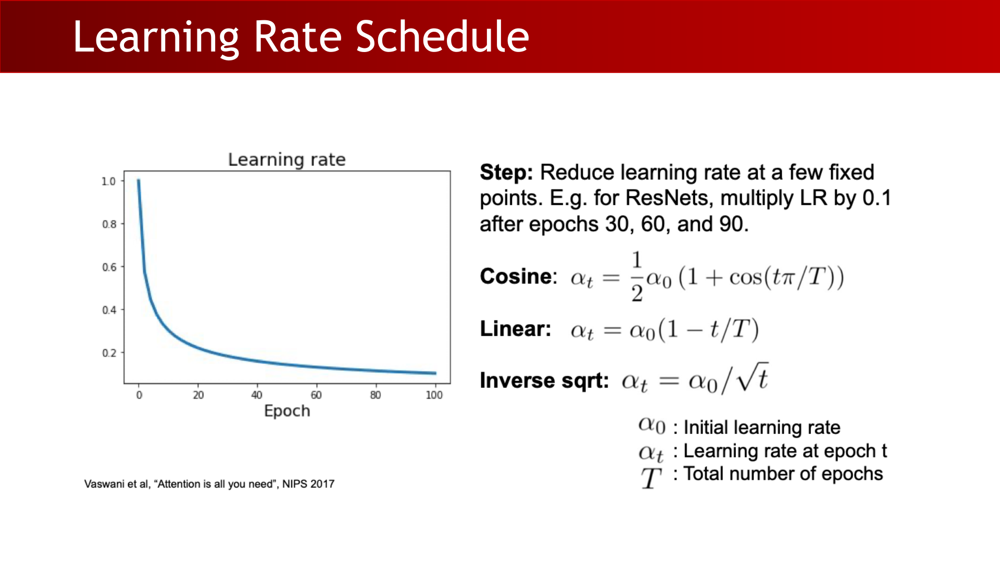
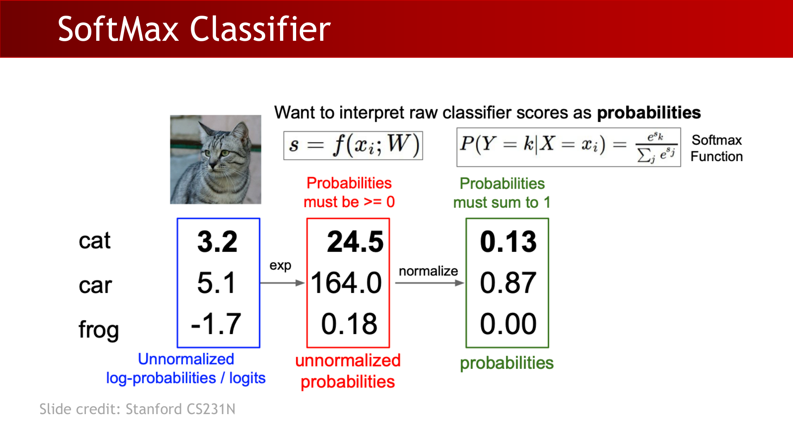
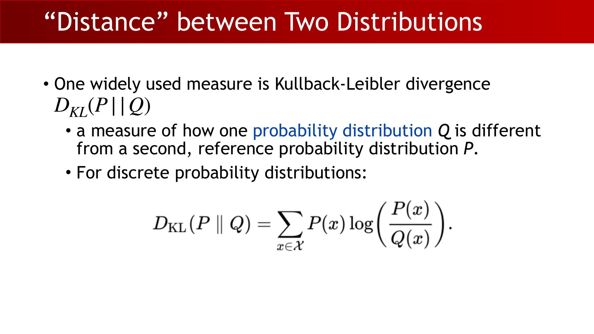
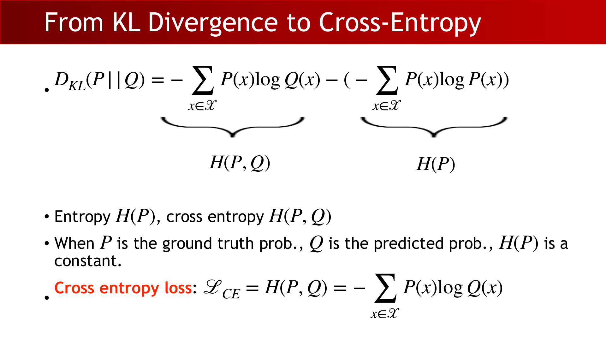
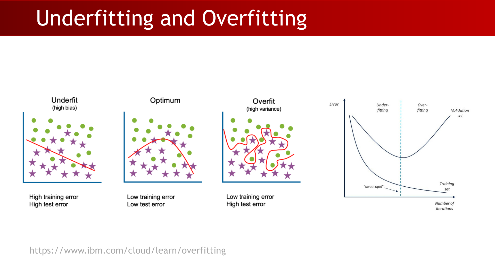
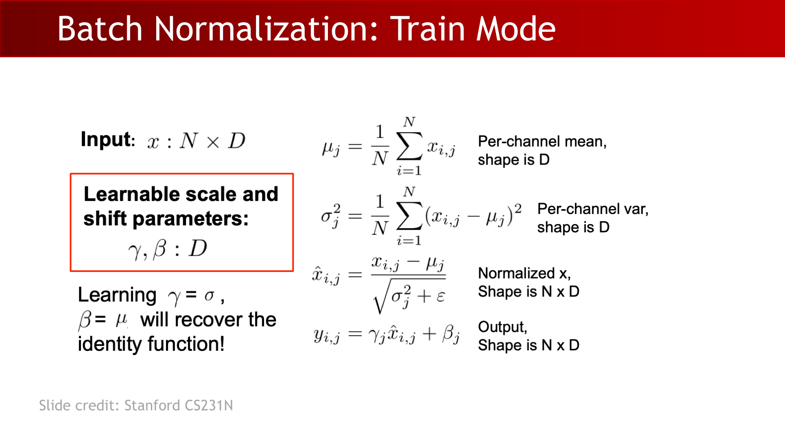
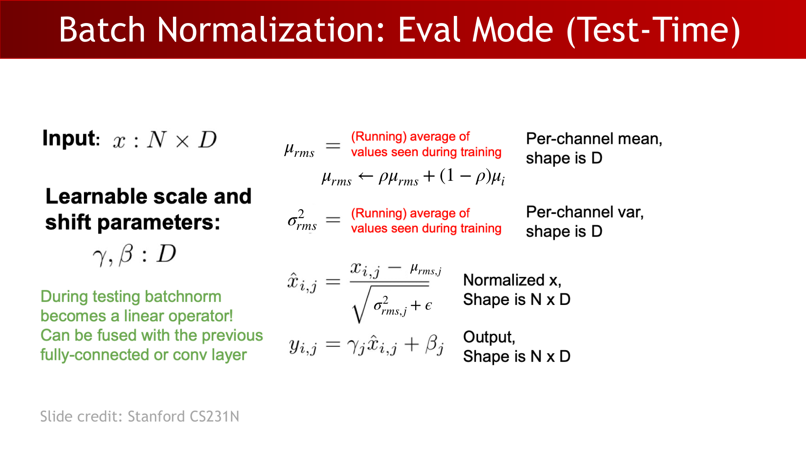
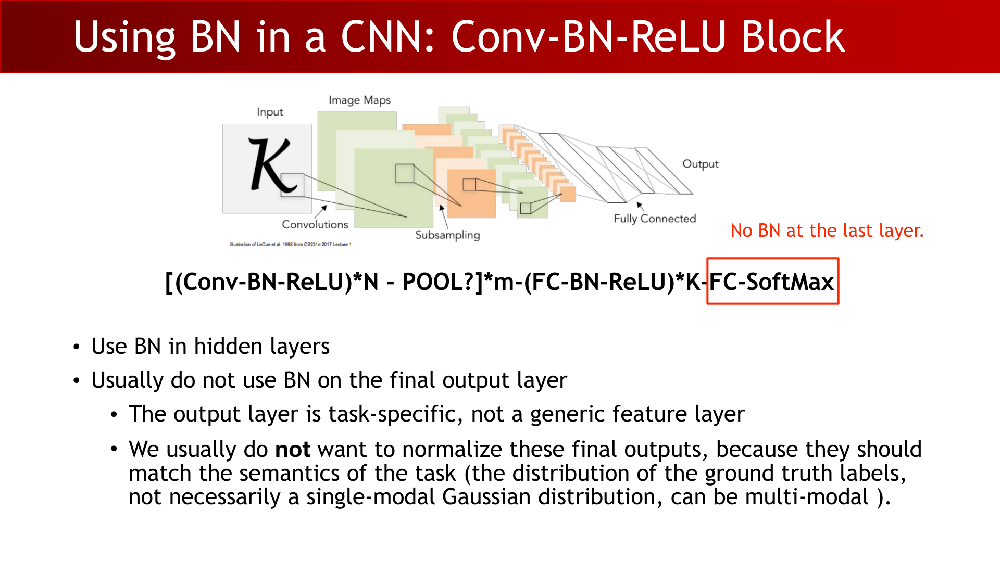
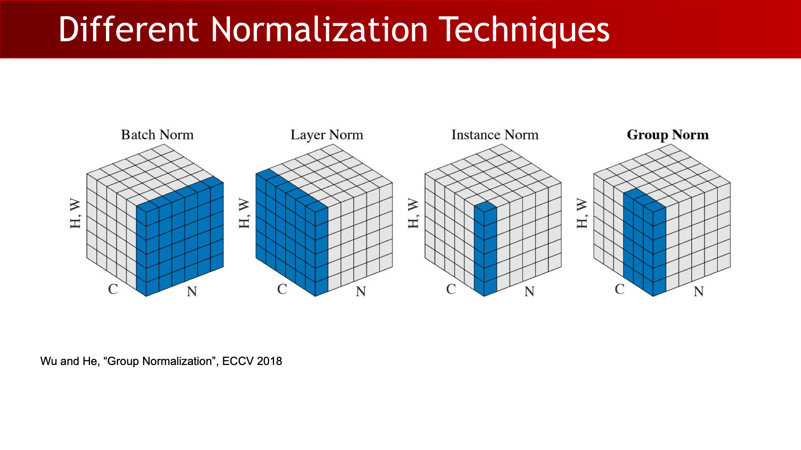
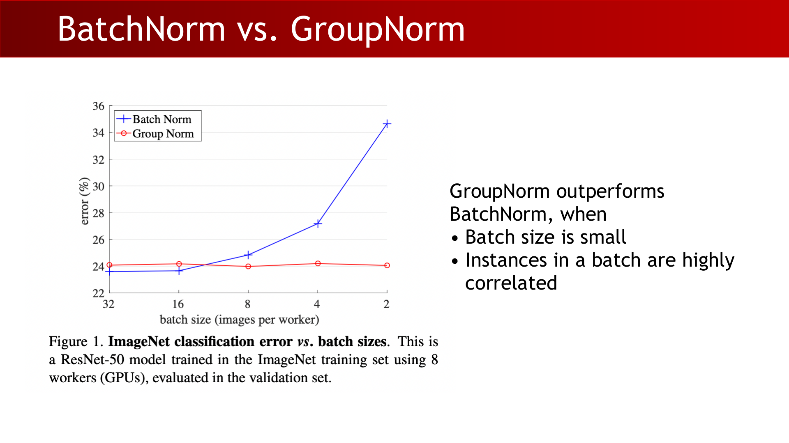

# Lecture 6: Deep Learning III (Optimization, Softmax/Cross-Entropy, and Normalization)

## 1. Optimization Setup: What Must Be Set First

A complete training setup has four tightly coupled parts:

1. Data preprocessing.
2. Weight initialization.
3. Loss function.
4. Optimization (optimizer + learning rate schedule).

In practice, the fourth item decides whether training is stable and fast.

:::remark Key question and answer: optimization start point
**Question (original intent):** **"optimizer?"** and **"learning rate?"**

**Answer:** Start with a robust default (`Adam`) and spend your first tuning budget on learning rate and schedule. Most early training failures come from bad LR choices, not from model architecture.
:::

## 2. Learning Rate, Decay, and Warmup

Learning rate controls step size in parameter space:

- Too small: optimization is very slow.
- Too large: loss oscillates or diverges.
- A workable starting band for this lecture context: around `1e-6` to `1e-3` depending on scale.

Common schedules:

$$
\alpha_t=\frac{1}{2}\alpha_0\left(1+\cos\left(\frac{t\pi}{T}\right)\right)
$$

$$
\alpha_t=\alpha_0\left(1-\frac{t}{T}\right)
$$

$$
\alpha_t=\frac{\alpha_0}{\sqrt{t}}
$$

Linear warmup is often added at the beginning:

- Increase LR from `0` to target LR during the first few thousand iterations.
- Goal: avoid instability when gradients/statistics are still noisy.

:::tip Key question and answer: batch size vs. LR
**Question (original intent):** If batch size increases by `N`, why scale initial LR by `N`?

**Answer:** Larger batches reduce gradient noise and make each step more reliable, so proportionally larger steps are usually tolerable. This is a useful rule of thumb, not a strict law.
:::

## 3. Optimizer Defaults in Practice

A pragmatic hierarchy:

- **"Adam is a good default"** for quick, stable convergence on new datasets.
- `SGD + Momentum` can outperform Adam, but usually needs more LR/schedule tuning.
- If tuning budget is small, cosine decay is often a strong low-friction schedule.

## 4. From Classification Task to CNN Classifier Form

Core task forms:

- Binary classification: output yes/no for a target class.
- Multi-way classification: assign one class among `K` known classes.

Historical CNN classifier template:

$$
\texttt{[(Conv-ReLU)*N - POOL?]*m-(FC-ReLU)*K-FC-SoftMax}
$$

This means feature extraction stacks followed by a Softmax prediction head.

## 5. Softmax: Turning Scores into Probabilities

Key definition (kept close to lecture wording):

- **"SoftMax ... is a generalization of the logistic/sigmoid function to multiple dimensions."**

Given logits `s = f(x_i;W)`, class probabilities are:

$$
P(Y=k\mid X=x_i)=\frac{e^{s_k}}{\sum_j e^{s_j}},\qquad s=f(x_i;W)
$$

Equivalent activation form:

$$
\sigma(z):\mathbb{R}^K\to(0,1)^K,\qquad \sigma(z)_i=\frac{\exp(\beta z_i)}{\sum_{j=1}^{K}\exp(\beta z_j)}
$$

$$
\beta\to\infty\Rightarrow \operatorname{Softmax}(z)\to\arg\max(z)
$$

$$
K=2\Rightarrow \sigma\!\left(\begin{bmatrix}z\\0\end{bmatrix}\right)_1=\operatorname{Sigmoid}(z)
$$

## 6. Loss Design: NLL, Softmax-CE, and Multiclass SVM

For one-hot targets, negative log-likelihood (NLL):

$$
L_i=-\log P(Y=y_i\mid X=x_i)
$$

Combined with Softmax logits:

$$
L_i=-\log\left(\frac{e^{s_{y_i}}}{\sum_j e^{s_j}}\right)
$$

Lecture comparison point:

- **"Softmax classifier + cross-entropy loss"** is the dominant modern choice.
- Multiclass SVM exists but is less common in current deep classification pipelines.

Multiclass SVM form:

$$
L_i=\sum_{j\ne y_i}\max\left(0,\,s_j-s_{y_i}+1\right)
$$

## 7. From KL Divergence to Cross-Entropy

KL divergence for discrete distributions:

$$
D_{KL}(P\parallel Q)=\sum_{x\in\mathcal{X}}P(x)\log\frac{P(x)}{Q(x)}
$$

$$
D_{KL}(P\parallel Q)\ge 0,\qquad D_{KL}(P\parallel Q)=0\iff P=Q
$$

$$
D_{KL}(P\parallel Q)\ne D_{KL}(Q\parallel P)
$$

Decomposition used in the lecture:

$$
D_{KL}(P\parallel Q)=-\sum_{x\in\mathcal{X}}P(x)\log Q(x)-\left(-\sum_{x\in\mathcal{X}}P(x)\log P(x)\right)
$$

$$
H(P,Q)=-\sum_{x\in\mathcal{X}}P(x)\log Q(x),\qquad H(P)=-\sum_{x\in\mathcal{X}}P(x)\log P(x)
$$

When `P` is fixed as ground-truth distribution, minimizing KL is equivalent to minimizing cross-entropy:

$$
\mathcal{L}_{CE}=H(P,Q)=-\sum_{x\in\mathcal{X}}P(x)\log Q(x)
$$

$$
\mathcal{L}_{CE}\approx\log(\#\text{classes})\ \text{(random init)},\qquad \min\mathcal{L}_{CE}=0
$$

:::remark Key question and answer: non-one-hot labels
**Question (original intent):** If target probabilities are not one-hot (uncertainty / label smoothing), what should we optimize?

**Answer:** Optimize a distribution-level loss, typically cross-entropy (or equivalently KL up to an additive constant when `P` is fixed).
:::

## 8. Underfitting vs. Overfitting (Optimization Motivation)

- Underfitting: high training error, often due to insufficient capacity or poor optimization.
- Overfitting: low training error but poor validation/test generalization.
- Better optimization tools (e.g., normalization, skip connections) help reduce underfitting risk in deep nets.

## 9. Batch Normalization: Train/Eval Mechanics

Typical insertion point: after linear/conv layer and before nonlinearity.

Train mode equations:

$$
x\in\mathbb{R}^{N\times D},\qquad \gamma,\beta\in\mathbb{R}^{D}
$$

$$
\mu_j=\frac{1}{N}\sum_{i=1}^{N}x_{i,j},\qquad \sigma_j^2=\frac{1}{N}\sum_{i=1}^{N}(x_{i,j}-\mu_j)^2
$$

$$
\hat{x}_{i,j}=\frac{x_{i,j}-\mu_j}{\sqrt{\sigma_j^2+\epsilon}},\qquad y_{i,j}=\gamma_j\hat{x}_{i,j}+\beta_j
$$

Eval/test mode uses running statistics:

$$
\mu_{\mathrm{rms}}\leftarrow \rho\mu_{\mathrm{rms}}+(1-\rho)\mu_i,\qquad
\sigma_{\mathrm{rms}}^2\leftarrow \rho\sigma_{\mathrm{rms}}^2+(1-\rho)\sigma_i^2
$$

$$
\hat{x}_{i,j}=\frac{x_{i,j}-\mu_{\mathrm{rms},j}}{\sqrt{\sigma_{\mathrm{rms},j}^2+\epsilon}},\qquad y_{i,j}=\gamma_j\hat{x}_{i,j}+\beta_j
$$

Extended CNN block with BN:

$$
\texttt{[(Conv-BN-ReLU)*N - POOL?]*m-(FC-BN-ReLU)*K-FC-SoftMax}
$$

:::warn Key question and answer: BN at output layer
**Question (original intent):** Why usually no BN at the last layer?

**Answer:** The final layer is task-specific output space (e.g., logits). Forcing it to match normalized hidden-feature statistics can distort the semantics needed by the loss/labels.
:::

## 10. Why BatchNorm Works: Classic vs. Modern View

Lecture contrast:

- Classic explanation: reduce **internal covariate shift**.
- Modern empirical view: BN smooths/conditions the optimization landscape, making gradients more predictive and allowing larger stable learning rates.

Practical effects:

- Easier deep optimization.
- More stable gradient scales.
- Mild regularization through batch-statistic noise.

:::remark Key question and answer: "Why BatchNorm Works?"
**Question:** **"Why BatchNorm Works?"** Is it mainly about internal covariate shift?

**Answer:** Internal covariate shift is historically important as intuition, but improved optimization conditioning is now considered the primary mechanism in many modern analyses.
:::

## 11. BN Limits and Why GN Helps in Small-Batch Settings

BN failure mode:

- Small batch size makes mini-batch mean/variance noisy.
- Train-time stats and test-time running stats can mismatch.
- This train/eval mismatch can cause severe performance drops.

Normalization dimensions differ:

- BatchNorm: normalize per channel across batch + spatial dimensions.
- LayerNorm: normalize across channels within one sample.
- InstanceNorm: normalize per sample per channel.
- GroupNorm: normalize per sample over channel groups.

:::tip Key question and answer: "Why BatchNorm?"
**Question:** **"Why BatchNorm?"**

**Answer:** In CNNs, channels often encode different feature detectors. BN normalizes each channel with channel-wise statistics, preserving channel semantics while stabilizing optimization.
:::

:::remark Key question and answer: "Why not LayerNorm?"
**Question:** **"Why not LayerNorm?"**

**Answer:** LayerNorm mixes all channels in one sample, which can cause interference between channel semantics in CNN feature maps. That is often suboptimal for image classification, though LayerNorm is very effective in Transformers.
:::

:::remark Key question and answer: "Why not InstanceNorm?"
**Question:** **"Why not InstanceNorm?"**

**Answer:** InstanceNorm removes sample-specific appearance statistics (contrast/brightness/style), which may discard discriminative cues for classification. It is more natural in style-transfer tasks.
:::

:::tip Key question and answer: "Why GroupNorm sometimes?"
**Question:** **"Why GroupNorm sometimes?"**

**Answer:** GroupNorm removes dependence on batch statistics and remains stable with small batches or highly correlated samples (common in detection/segmentation pipelines).
:::

## Exam Review

### A. Must-know definitions

- **Learning-rate schedule:** predefined rule for changing LR over iterations/epochs.
- **Softmax:** mapping logits to a probability simplex.
- **NLL / Cross-Entropy:** log-likelihood-based classification objective.
- **KL divergence:** directional discrepancy between two distributions.
- **BatchNorm:** channel-wise normalization using batch statistics (train) and running statistics (eval).
- **LayerNorm / InstanceNorm / GroupNorm:** normalization variants differing by reduction dimensions.

### B. Mechanism chain you should explain clearly

Optimization setup (data/init/loss/LR) -> logits -> Softmax probabilities -> CE/KL objective -> gradient updates -> normalization-assisted stable training.

### C. Short-answer templates

- Why is LR schedule important?
  - It balances fast early progress and stable late convergence.
- Why Softmax + CE?
  - It gives probabilistic outputs and a well-behaved log-likelihood objective.
- Why CE when labels are soft?
  - It compares full distributions, not only one-hot class indices.
- Why BN in CNN hidden layers?
  - It stabilizes optimization while preserving channel semantics.
- Why GN for small batches?
  - It avoids noisy batch-stat dependence.

### D. Common mistakes

- Tuning optimizer type while ignoring LR schedule.
- Treating KL as a true metric distance.
- Forgetting BN uses different statistics in train vs. eval.
- Applying BN blindly to final output logits.
- Assuming LayerNorm/InstanceNorm are drop-in replacements for BN in all CNN settings.

### E. Self-check checklist

- Can you derive CE from KL when `P` is fixed?
- Can you write Softmax and per-sample NLL equations from memory?
- Can you explain warmup and why it prevents early instability?
- Can you write BN train-mode and eval-mode equations and explain the difference?
- Can you state when GroupNorm is preferred over BatchNorm?
