# 第七讲：深度学习 IV（残差学习、骨干网络设计与语义分割）

## 1. 为什么超深 Plain CNN 在实践中会失败

本讲先讨论一个核心训练难题：深层退化（degradation）。

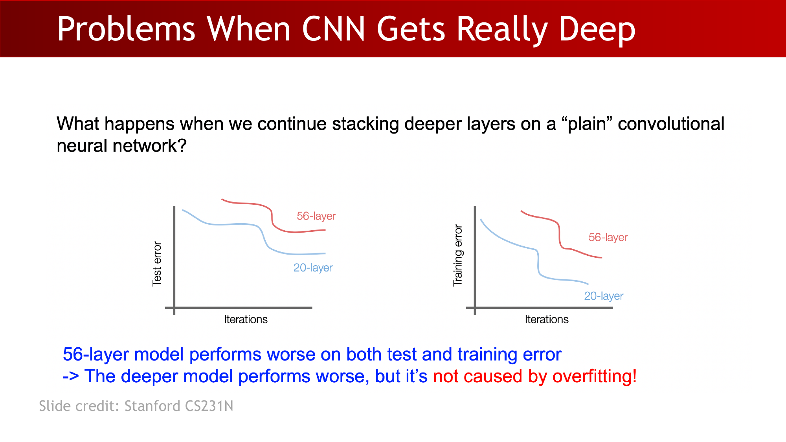

当我们在**普通** CNN（没有 skip connection）上不断加深层数时，深层模型在训练集和测试集上都可能更差。这不是经典的过拟合现象，而主要是优化困难。

:::remark 关键问题与解答：更深的 plain 网络
**问题（原文）：** **"What happens when we continue stacking deeper layers on a ‘plain’ convolutional neural network?"**

**解答：** 优化会明显变难。更深的 plain 网络可能出现更高的训练误差，因此“更深”本身并不保证更好。
:::

:::tip 关键问题与解答：构造性下界
**问题（原文）：** **"What should the deeper model learn to be at least as good as the shallower model?"**

**解答：** 至少要让新增层先学成恒等映射（identity），保证深层网络先不比浅层差，再在此基础上学习增益。
:::

## 2. 残差学习与 Skip Connection 为什么有效

残差学习把目标从直接拟合 $H(x)$ 改为拟合残差 $F(x)$：

$$
H(x)=F(x)+x,
\qquad
H(x)=x\;\text{if}\;F(x)=0
$$

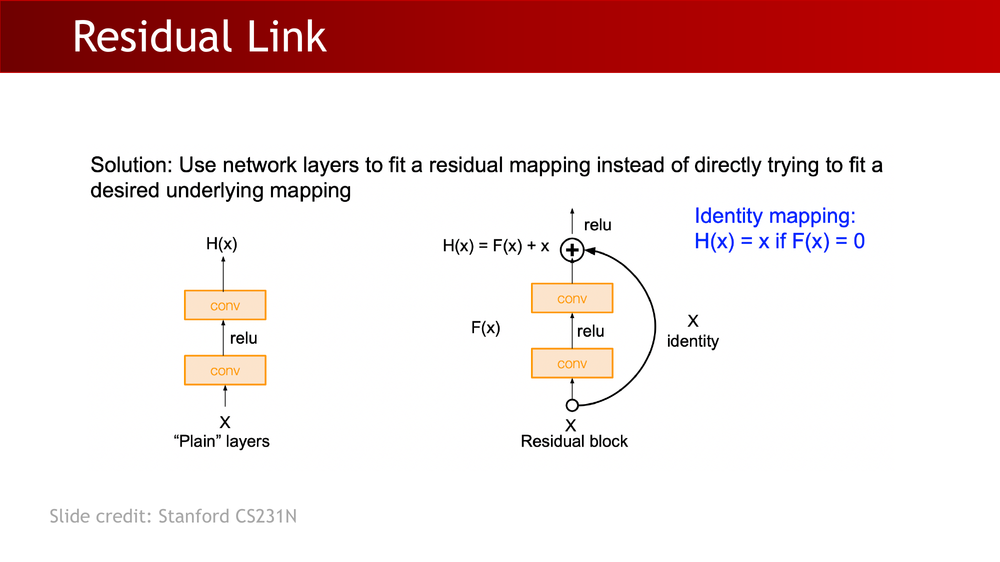

这个设计给了优化一个“保底路径”：当新增层暂时学不好时，块仍可通过恒等分支传递信息。

从优化几何角度看，skip connection 往往会带来更平坦的极小值，并减轻超深网络训练中的混沌行为。

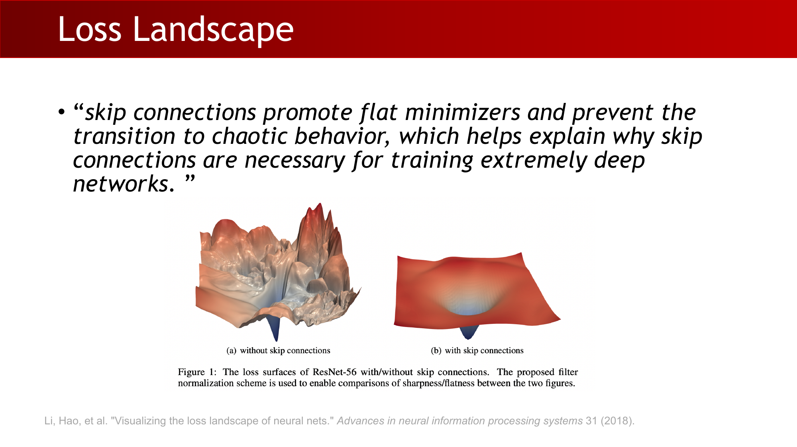

## 3. 泛化间隙与过拟合视角

**关键定义（讲义原话）：** **"Generalization gap: the difference between a model's performance on training data and its performance on unseen data drawn from the same distribution."**

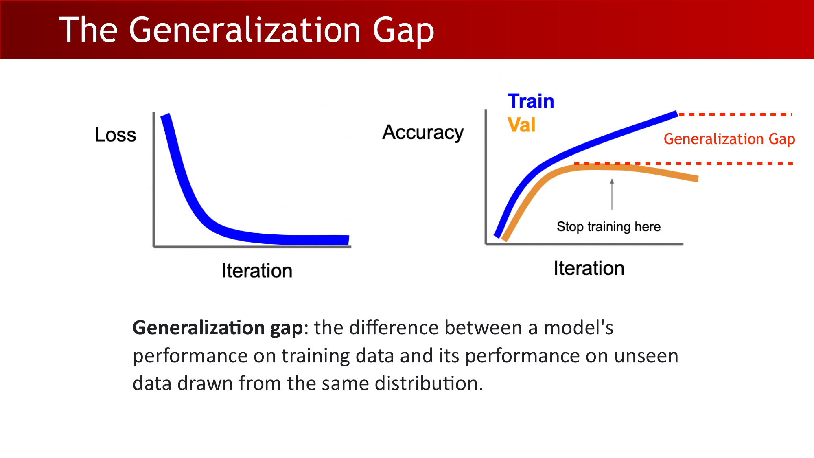

要点区分：

- 训练集欠拟合常见于容量不足或优化不佳。
- 测试集过拟合通常来自“数据变化性”和“模型容量”不匹配。
- 早停（early stopping）可以抑制训练后期训练/验证差距继续拉大。

:::remark 关键问题与解答：过拟合本质
**问题（原意）：** 参数很多的模型为什么仍会在未见数据上失败？

**解答：** 模型会把残差变化（噪声）误当作真实结构去拟合。核心不是只追求更低训练损失，而是降低模型与数据之间的不匹配。
:::

## 4. 数据视角的缓解策略：变化性与增强

真实分类任务要面对多种变化：

- 姿态与形变
- 视角
- 背景
- 光照
- 遮挡
- 类内变化

一个好的分类器应当对这些变化具备不变性或鲁棒性。

:::remark 关键问题与解答：好分类器的要求
**问题（原意）：** 标签不变，为什么还要做数据增强？

**解答：** 增强让训练数据更接近真实世界的变化分布，使模型在训练阶段就学到不变性，而不是把风险留到测试阶段。
:::

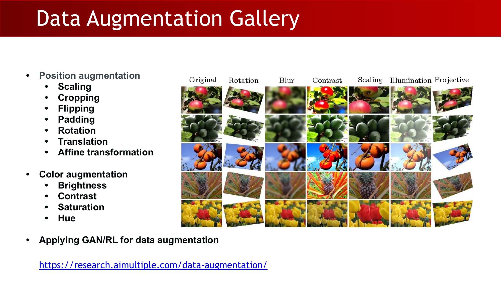

常见增强族：

- 几何增强：缩放、裁剪、翻转、填充、旋转、平移、仿射变换。
- 颜色增强：亮度、对比度、饱和度、色调。

讲义强调的收益：

- 提升预测精度
- 降低过拟合
- 增强泛化能力
- 改善分类任务中的类不平衡问题

## 5. 模型视角的缓解策略：正则化、Dropout、BatchNorm

正则化通过约束复杂度来修正目标函数：

$$
L(W)=\frac{1}{N}\sum_{i=1}^{N}L_i\big(f(x_i,W),y_i\big)+\lambda R(W)
$$

$$
\mathcal{L}=\mathcal{L}_{main}+\lambda R(W)
$$

$$
R(W)=\sum_k\sum_l W_{k,l}^{2},\qquad
R(W)=\sum_k\sum_l |W_{k,l}|,\qquad
R(W)=\sum_k\sum_l \left(\beta W_{k,l}^{2}+|W_{k,l}|\right)
$$

Dropout 和 BatchNorm 也都是实用的抗过拟合手段。

:::tip 关键问题与解答：BatchNorm 的正则化效应
**问题（原意）：** 为什么 BatchNorm 也能起到正则化作用？

**解答：** 它约束了激活统计分布，并在训练时引入与 batch 相关的噪声，常常会提升泛化，并降低对 dropout 的依赖。
:::

## 6. 如何分析并演化分类骨干网络

讲义给出 CNN 架构分析的四个维度：

- 表达能力/容量
- 与任务的匹配度
- 可优化性
- 计算与内存开销

在 ImageNet 规模任务上，模型需要同时捕捉局部细节和全局上下文。

:::remark 关键问题与解答：VGG 为什么偏好小卷积核
**问题（原文）：** **"Why use smaller filters? (3x3 conv)"**

**解答：** 堆叠 $3\times 3$ 卷积可在保持感受野增长的同时引入更多非线性，而且参数量通常比单个大卷积核更经济。
:::

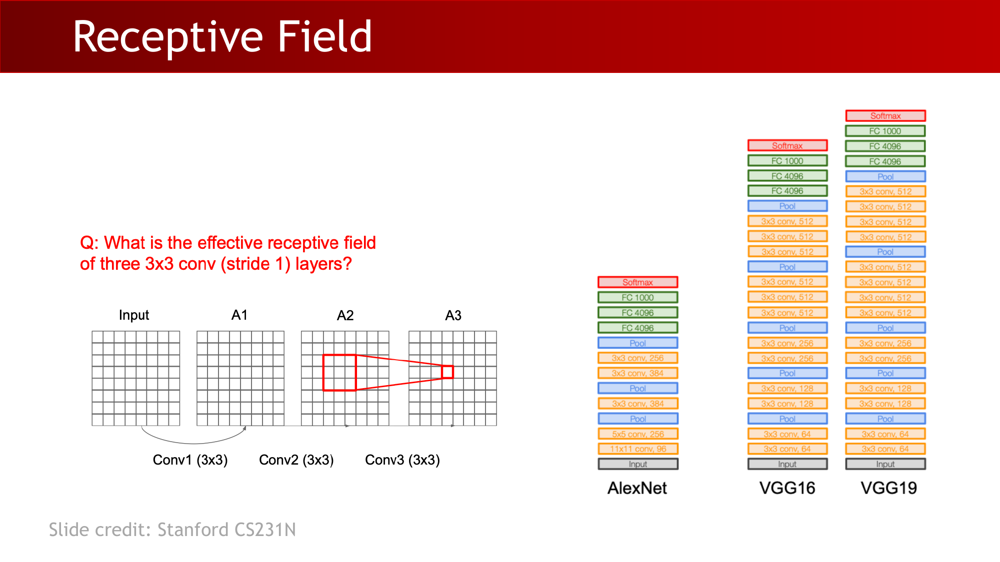

讲义中的常见参数量比较：

$$
3\cdot(3^2C^2)\;\text{vs.}\;7^2C^2
$$

骨干网络演化主线：

- AlexNet -> VGG -> ResNet
- Beyond ResNet：WideResNet、ResNeXt、DenseNet、SENet
- 效率导向：MobileNet
- 自动化设计：NAS（神经架构搜索）

:::tip 关键问题与解答：NAS 动机
**问题（原文）：** **"can we use neural networks to design neural networks?"**

**解答：** 这就是 NAS 的核心思想：用搜索/学习来发现网络结构，并在精度、效率、部署约束之间做权衡。
:::

## 7. 从图像分类到语义分割

**关键定义：** **"Image classification is to categorize an image into several known classes (N)."**

分类器可写成：

$$
y=f_\theta(x),\qquad y\in\{1,\dots,N\}
$$

语义分割则从单个全局标签转向逐像素密集标注。

**关键定义（讲义原意）：** **"Semantic segmentation is a dense labeling (per-pixel classification) problem."**

常见分割目标是像素级交叉熵：

$$
\mathcal{L}_{CE}=\operatorname{mean}(H(P,Q))=-\operatorname{mean}\left(\sum_{x\in\mathcal{X}}P(x)\log Q(x)\right)
$$

## 8. FCN 流程、瓶颈结构与上采样

FCN 风格分割通常采用编码器-解码器流程：

- 下采样（pooling / 步长卷积）提取上下文
- 瓶颈层保存紧凑高层表示
- 上采样恢复输出分辨率

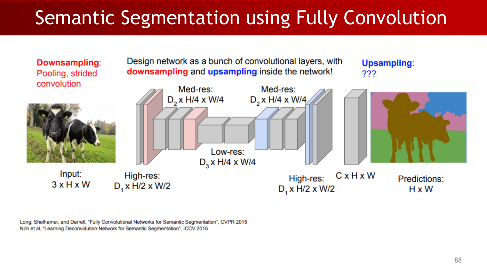

### 8.1 瓶颈结构为什么有价值

- 降低内存与计算开销
- 扩大有效感受野（更强全局上下文）
- 压缩冗余低层细节

### 8.2 上采样机制

Max unpooling 会利用池化时记录的位置把激活“放回去”。

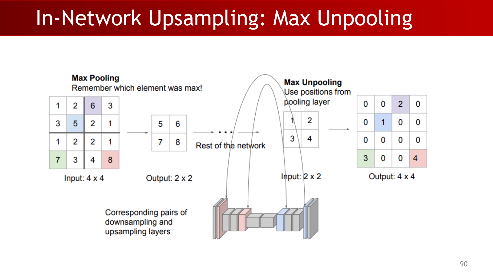

转置卷积可理解为“乘以转置矩阵”：

$$
\vec{x}*\vec{a}=X\vec{a}
$$

$$
\begin{bmatrix}
x&y&z&0&0&0\\
0&0&0&x&y&z
\end{bmatrix}
\begin{bmatrix}
0\\a\\b\\c\\d\\0
\end{bmatrix}
=
\begin{bmatrix}
ay+bz\\bx+cy+dz
\end{bmatrix}
$$

$$
\vec{x}*^{T}\vec{a}=X^{T}\vec{a}
$$

$$
\begin{bmatrix}
x&0\\
y&0\\
z&x\\
0&y\\
0&z\\
0&0
\end{bmatrix}
\begin{bmatrix}
a\\b
\end{bmatrix}
=
\begin{bmatrix}
ax\\ay\\az+bx\\by\\bz\\0
\end{bmatrix}
$$

## 9. U-Net：瓶颈里到底该存什么

本讲反复追问瓶颈应保留哪些信息。

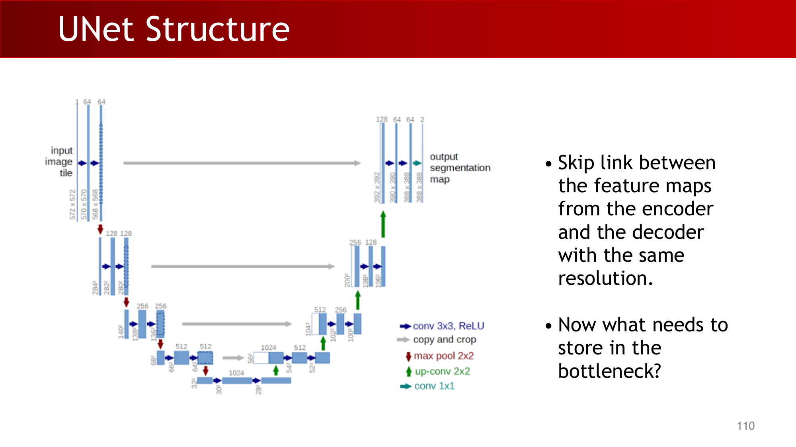

:::remark 关键问题与解答：瓶颈信息内容
**问题（原文）：** **"What needs to be stored in the bottleneck?"**

**解答：** 主要保留全局语义上下文。细粒度空间细节，尤其边界信息，应通过同分辨率的 encoder skip link 进行补充。
:::

瓶颈设计背后的自编码器直觉：

$$
X=\{x\mid x\in\mathbb{R}^{N}\},\quad \hat{x}\in\mathbb{R}^{N},\; z\in\mathbb{R}^{L},\quad N>L
$$

$$
\|x-\hat{x}\|^{2}
$$

## 10. 分割评估指标与替代损失

Pixel accuracy 容易理解，但在类别不平衡时可能误导：

$$
\operatorname{accuracy}=\frac{TP+TN}{TP+TN+FP+FN}
$$

Intersection-over-Union（IoU）更能反映区域重叠质量：

$$
IoU=\frac{\text{target}\cap\text{prediction}}{\text{target}\cup\text{prediction}}
$$

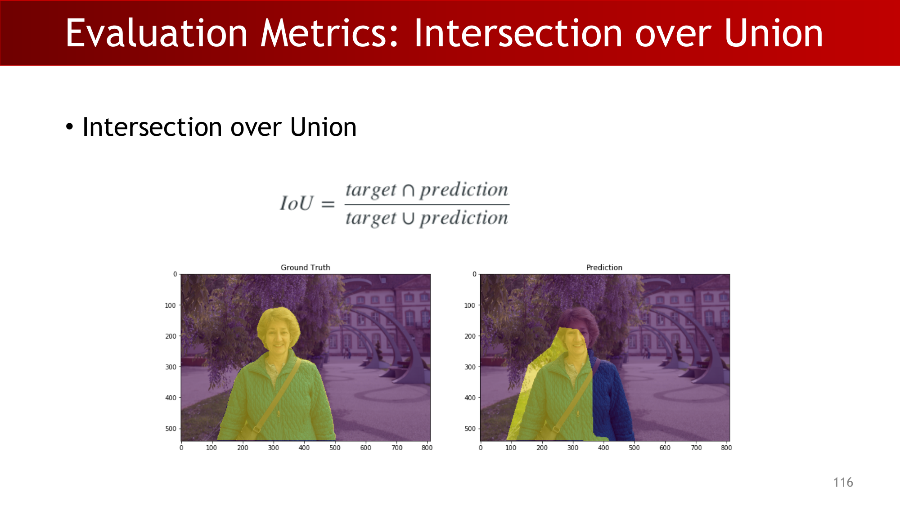

Soft IoU 把 IoU 变成可微目标：

$$
IoU=\frac{I(X)}{U(X)},\qquad
I(X)=\sum_{v\in V}X_v*Y_v,\qquad
U(X)=\sum_{v\in V}(X_v+Y_v-X_v*Y_v)
$$

$$
L_{IoU}=1-IoU=1-\frac{I(X)}{U(X)}
$$

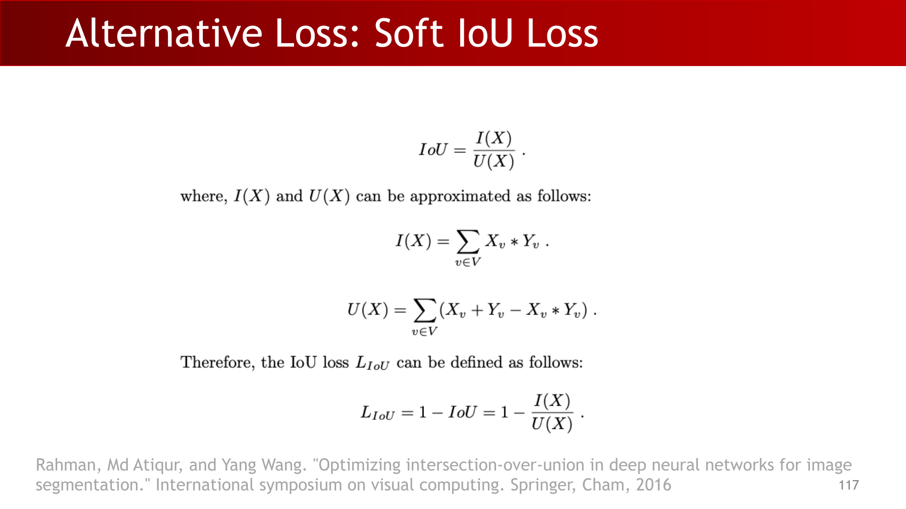

多类别分割中，通常先算各类别 IoU，再取平均得到 mIoU。

## Exam Review

### A. 必会定义

- **深层退化问题：** 更深的 plain CNN 在训练集上都可能更难优化。
- **残差学习：** 在 $H(x)=F(x)+x$ 中学习残差 $F(x)$。
- **泛化间隙：** 同分布下训练表现与未见数据表现之间的差异。
- **语义分割：** 逐像素密集分类任务。
- **IoU / mIoU：** 分割区域重叠质量的核心指标。

### B. 需要能讲清楚的机制链路

plain 深网难优化 -> 残差/跳连稳定优化 -> 数据与模型双侧抑制过拟合 -> 骨干网络在容量与开销间演化 -> FCN/U-Net 恢复密集预测 -> 用 IoU 系列指标评估区域重叠。

### C. 简答题模板

- 为什么要 skip link？
  - 它提供恒等捷径，显著改善超深网络优化。
- 为什么做数据增强？
  - 注入真实变化性，提升不变性与泛化能力。
- 分割任务中瓶颈该存什么？
  - 存全局上下文，边界细节由 skip connection 补回。
- 为什么不能只看 pixel accuracy？
  - IoU 对重叠误差更敏感，对类别不平衡更稳健。

### D. 常见误区

- 以为“加深网络”天然提升效果，忽略 skip 结构。
- 把深层退化简单等同于过拟合。
- 过度增强导致语义内容被破坏。
- 在类别极不平衡时只汇报 pixel accuracy。
- 让瓶颈记忆全部空间细节，而不利用 skip 路径。

### E. 自检清单

- 你能解释为什么 56 层 plain 网络会比 20 层在训练误差上更差吗？
- 你能推导并解释 $H(x)=F(x)+x$ 的 identity 情况吗？
- 你能区分几何增强与颜色增强并给出例子吗？
- 你能说明 U-Net 中 encoder-decoder 与 skip link 的分工吗？
- 你能计算 IoU 并说明何时应优先报告 mIoU 吗？
