# Lecture 9: 3D Vision I - Camera Models, Projection, and Depth

## 1. From 2D Images to 3D Vision

Computer vision often starts from a 2D RGB image, represented as an $H\times W\times 3$ array. 3D vision asks a harder question: how can we recover or reason about the 3D world from partial 2D observations?

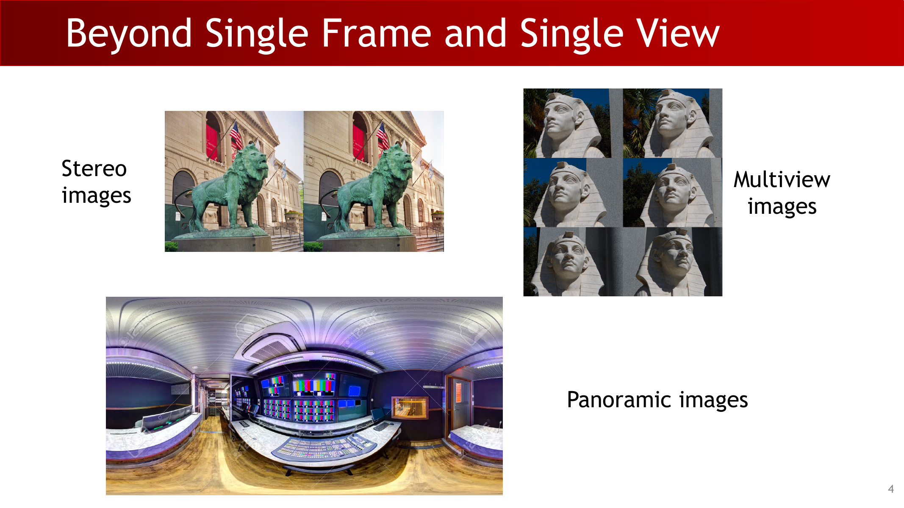

Single-frame RGB is only one data source. Practical 3D systems may use:

- stereo images, where two nearby cameras provide viewpoint disparity;
- multi-view images, where many images observe the same scene from different viewpoints;
- panoramic images, where the field of view is expanded to capture a wider scene;
- depth images and point clouds, where sensors directly provide geometric measurements.

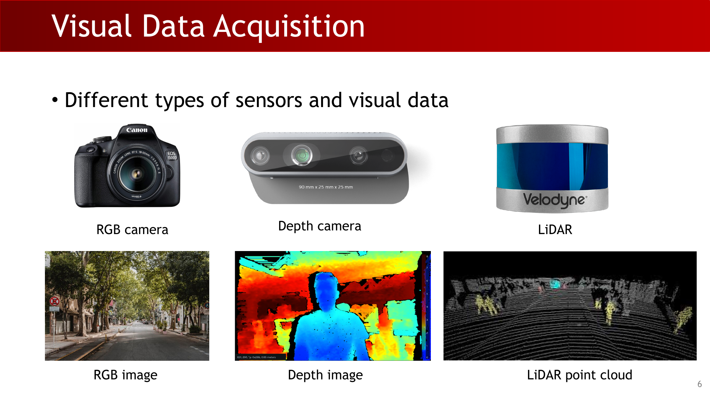

RGB cameras produce color images, depth cameras produce per-pixel depth images, and LiDAR produces sparse or dense 3D point clouds. These modalities are useful because embodied agents, robots, and autonomous vehicles need distance, scale, and collision information, not only semantic labels.

:::remark Key question and answer: why 3D vision?
**Question (original intent):** If an agent only receives 2D images, why is 3D vision still necessary?

**Answer:** 2D appearance does not directly tell metric distance, object scale, free space, or collision risk. 3D vision converts visual observations into geometric quantities that support manipulation, navigation, mapping, and physical interaction.
:::

## 2. Pinhole Camera: Making an Image by Selecting Rays

If we place a film plane in front of an object without controlling incoming light, many rays from the same object point hit many film locations, producing a blurred image. A pinhole camera adds a barrier with a tiny aperture so that each 3D point contributes approximately one ray to the image.

:::remark Key question and answer: raw film plane
**Question (original wording):** **"Do we get a reasonable image?"**

**Answer:** No. Without an aperture, rays from many scene points overlap on the film, so the film records a mixture of light paths rather than a sharp spatial mapping.
:::

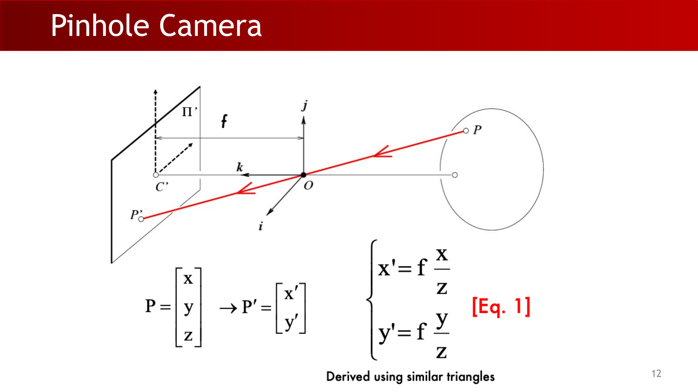

For a 3D point $P=[x,y,z]^T$, similar triangles give:

$$
x' = f\frac{x}{z}, \qquad y' = f\frac{y}{z}
$$

The focal length $f$ controls magnification. Larger depth $z$ makes the projected point closer to the image center; larger $x$ or $y$ moves it farther from the center.

:::tip Derivation: similar triangles
In the 2D cross-section, the image-plane coordinate satisfies:

$$
\frac{x'}{f}=\frac{x}{z}
$$

so $x'=f x/z$. The $y$ direction follows the same geometry.
:::

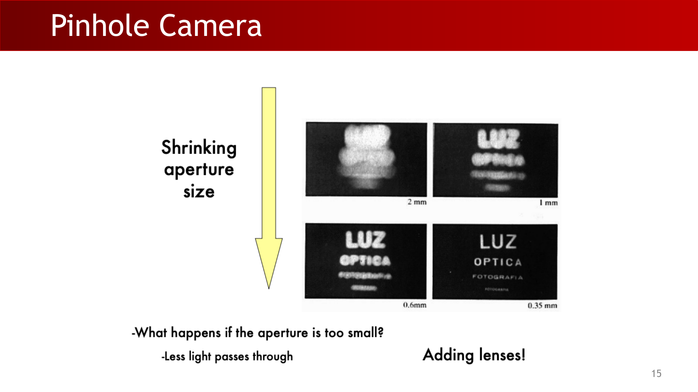

The aperture size is a tradeoff:

- a large aperture admits more light but allows multiple rays from a point neighborhood, increasing blur;
- a very small aperture sharpens geometry but admits too little light, making the image dark and noisy.

:::remark Key question and answer: aperture size
**Question (original wording):** **"Is the size of the aperture important?"** and **"What happens if the aperture is too small?"**

**Answer:** Yes. A smaller aperture reduces geometric blur, but if it becomes too small, less light passes through. Real cameras add lenses to collect more light while still focusing rays.
:::

## 3. Lenses and Radial Distortion

Real cameras use lenses because a pure pinhole wastes light. Under a paraxial refraction model, near-axis rays are approximated by simple geometry:

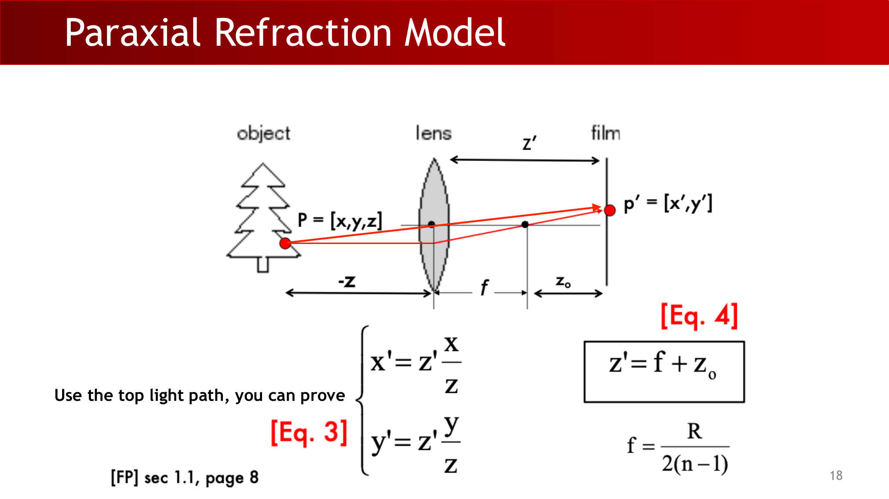

$$
x' = z'\frac{x}{z}, \qquad y' = z'\frac{y}{z}, \qquad z'=f+z_o
$$

For the simplified lens model shown in the lecture:

$$
f=\frac{R}{2(n-1)}
$$

Here $R$ is related to lens curvature and $n$ is the refractive index. The practical idea is that the lens increases light collection while still mapping rays to a focused image plane.

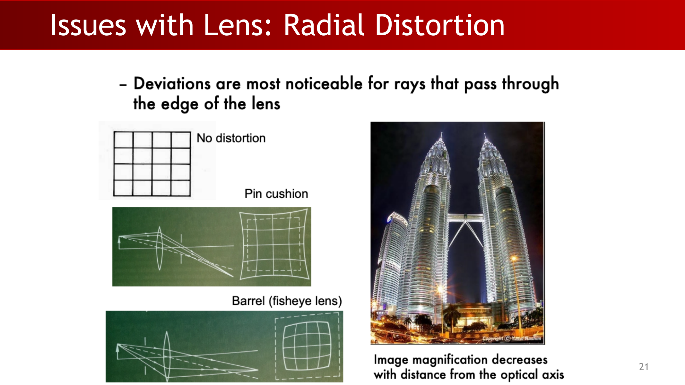

Lenses are not perfect. **Radial distortion** is most visible for rays passing through the edge of the lens. Two common qualitative patterns are:

- pincushion distortion, where straight grid lines bend inward;
- barrel distortion, common in fisheye lenses, where straight grid lines bulge outward.

:::warn Common pitfall: lens model vs. camera matrix
Radial distortion is not the same thing as the intrinsic matrix $K$. The matrix $K$ models ideal perspective projection into pixel coordinates; distortion models deviations from that ideal and is usually handled by additional calibration parameters.
:::

## 4. Intrinsics: From Camera Coordinates to Pixel Coordinates

The intrinsic parameters describe the camera's internal geometry: focal scaling, pixel scaling, principal point offset, and sometimes axis skew.

Starting from normalized perspective projection, pixel coordinates are:

$$
(u,v)=\left(\alpha\frac{x}{z}+c_x,\;\beta\frac{y}{z}+c_y\right),
\qquad \alpha=fk,\quad \beta=fl
$$

The constants $c_x,c_y$ are the principal point offset. The constants $k,l$ convert metric image-plane coordinates into pixels; if pixels are non-square, $\alpha$ and $\beta$ differ.

:::remark Key question and answer: projective transformation
**Question (original wording):** **"Is this a linear transformation? No - division by z is nonlinear. Can we express it in a matrix form?"**

**Answer:** In Euclidean coordinates, the division by $z$ is nonlinear. In homogeneous coordinates, we first compute a linear homogeneous vector and then divide by its last coordinate, so the projection can be represented by a matrix up to scale.
:::

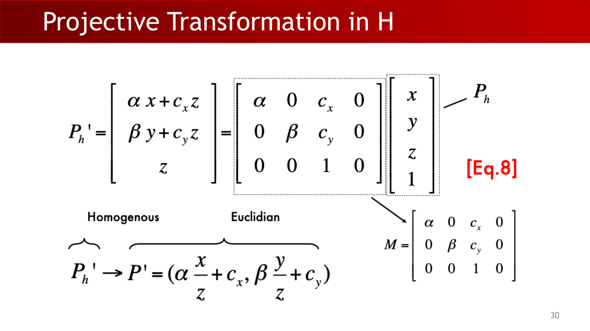

In homogeneous form:

$$
P'_h =
\begin{bmatrix}
\alpha x+c_xz\\
\beta y+c_yz\\
z
\end{bmatrix}
=
\begin{bmatrix}
\alpha & 0 & c_x & 0\\
0 & \beta & c_y & 0\\
0 & 0 & 1 & 0
\end{bmatrix}
\begin{bmatrix}
x\\y\\z\\1
\end{bmatrix}
$$

After homogeneous normalization, this becomes the pixel coordinate $(u,v)$.

The intrinsic matrix is:

$$
K=
\begin{bmatrix}
\alpha & 0 & c_x\\
0 & \beta & c_y\\
0 & 0 & 1
\end{bmatrix},
\qquad
P' = MP = K[I\;0]P
$$

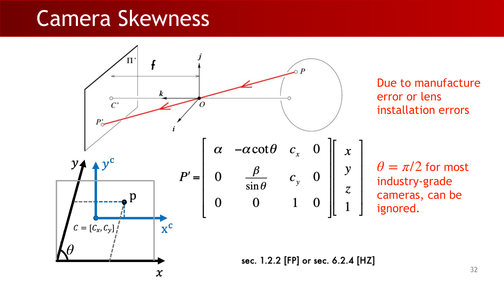

If the image axes are not exactly perpendicular, skew appears:

$$
P'=
\begin{bmatrix}
\alpha & -\alpha\cot\theta & c_x & 0\\
0 & \frac{\beta}{\sin\theta} & c_y & 0\\
0 & 0 & 1 & 0
\end{bmatrix}
\begin{bmatrix}
x\\y\\z\\1
\end{bmatrix}
$$

For most industry-grade cameras, $\theta=\pi/2$, so skew is usually ignored.

## 5. Extrinsics: World Frame to Camera Frame

Extrinsic parameters describe the relative pose between the world reference frame and the camera reference frame. Translation has three degrees of freedom:

$$
T=
\begin{bmatrix}
T_x\\T_y\\T_z
\end{bmatrix}
$$

Rotation also has three degrees of freedom in this lecture's parameterization:

$$
R = R_x(\alpha)R_y(\beta)R_z(\gamma)
$$

Together they map a world-space point $P_w$ into camera space:

$$
P=
\begin{bmatrix}
R & T\\
0 & 1
\end{bmatrix}_{4\times4}
P_w
$$

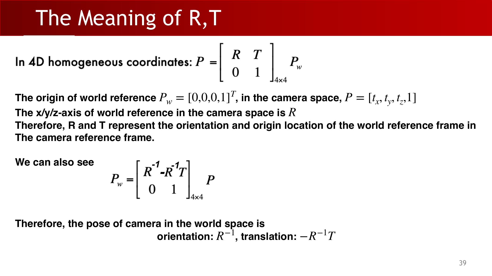

**Key definition (lecture wording):** **"R and T represent the orientation and origin location of the world reference frame in the camera reference frame."**

This convention is important. The same $R,T$ also imply the camera pose in world coordinates:

$$
P_w=
\begin{bmatrix}
R^{-1} & -R^{-1}T\\
0 & 1
\end{bmatrix}_{4\times4}
P
$$

Therefore the camera orientation in world space is $R^{-1}$, and the camera translation in world space is $-R^{-1}T$.

:::warn Common pitfall: extrinsics direction
Do not automatically read $T$ as "camera position in world coordinates." In this convention, $T$ is the world origin expressed in camera coordinates. The camera center in world coordinates is $-R^{-1}T$.
:::

## 6. Full Projective Camera Matrix

The full camera model combines extrinsics and intrinsics:

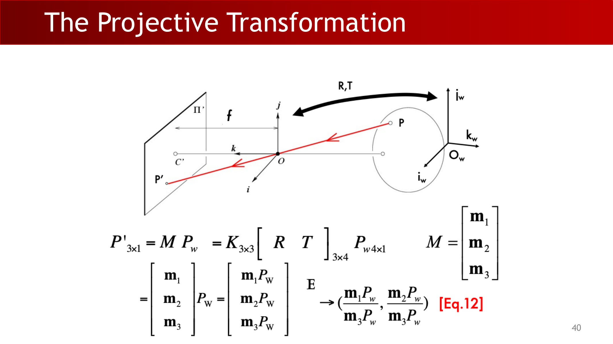

$$
P'_{3\times1} = MP_w = K_{3\times3}[R\;T]_{3\times4}P_{w,4\times1}
$$

Write the rows of $M$ as:

$$
M=
\begin{bmatrix}
\mathbf{m}_1\\
\mathbf{m}_2\\
\mathbf{m}_3
\end{bmatrix}
$$

Then Euclidean pixel coordinates are obtained by homogeneous division:

$$
P' \rightarrow
\left(
\frac{\mathbf{m}_1P_w}{\mathbf{m}_3P_w},
\frac{\mathbf{m}_2P_w}{\mathbf{m}_3P_w}
\right)
$$

This is a perspective camera: depth appears in the denominator, so farther objects project smaller and parallel 3D lines may meet at vanishing points.

:::tip Key question and answer: what does projective transformation preserve?
**Question (original intent):** What properties survive projective transformation?

**Answer:** Incidence relationships such as points lying on lines are preserved, but Euclidean quantities such as lengths, angles, and parallelism are generally not preserved. This is why perspective images can show vanishing points.
:::

## 7. Perspective, Weak Perspective, and Orthographic Models

Perspective projection is accurate but nonlinear because every point has its own depth denominator:

$$
x'=\frac{f'}{z}x,\qquad y'=\frac{f'}{z}y
$$

Weak perspective applies when the object's relative depth variation is small compared with its distance from the camera. Replace each $z$ with an average depth $z_0$:

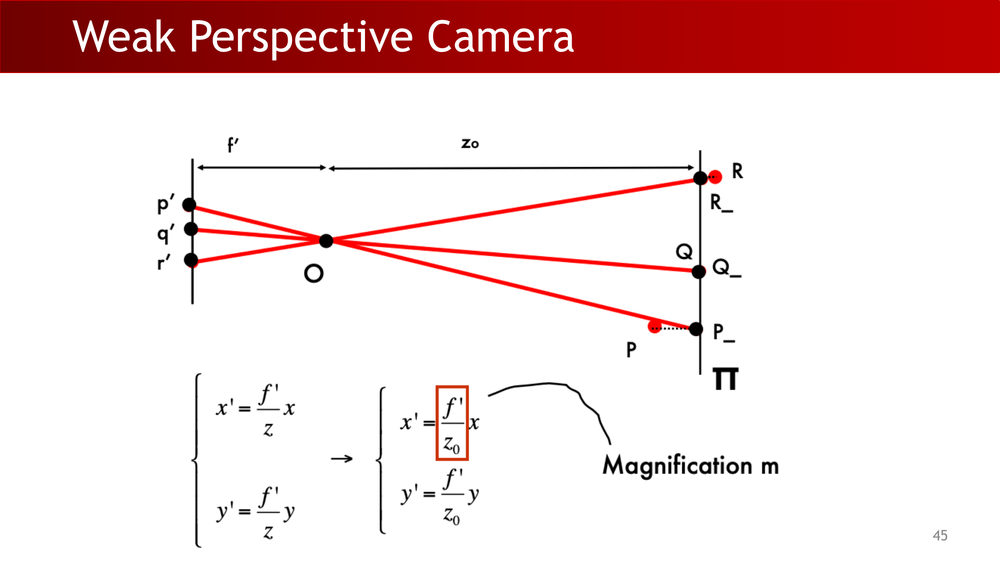

$$
x'=\frac{f'}{z_0}x,\qquad y'=\frac{f'}{z_0}y
$$

The factor $m=f'/z_0$ is a single magnification shared by all points on the object.

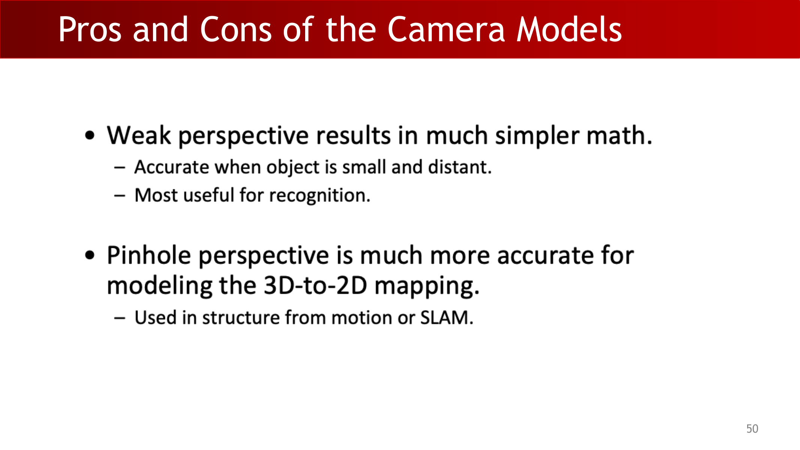

Weak perspective gives much simpler math and is useful when objects are small and distant, especially for recognition tasks. Pinhole perspective is more accurate for 3D-to-2D geometry and is used in structure from motion and SLAM.

Orthographic projection is the limiting case where the center of projection is infinitely far away:

$$
x'=x,\qquad y'=y
$$

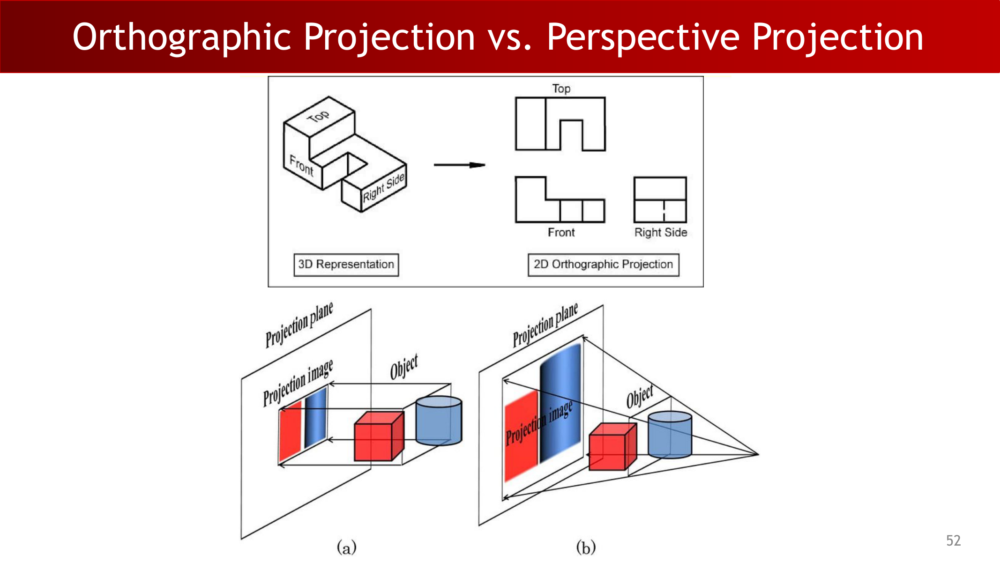

:::remark Key question and answer: choosing projection models
**Question (original intent):** When should we use perspective, weak perspective, or orthographic projection?

**Answer:** Use perspective when metric geometry, depth variation, or camera motion matters. Use weak perspective when the object is small relative to its distance and a single scale is acceptable. Use orthographic projection for engineering-style views or idealized settings where depth-dependent scale change is intentionally removed.
:::

## 8. Depth Images and Depth Backprojection

**Key definition (lecture wording):** **"A single-channel image filled by depth values"** and **"A 2.5D representation."**

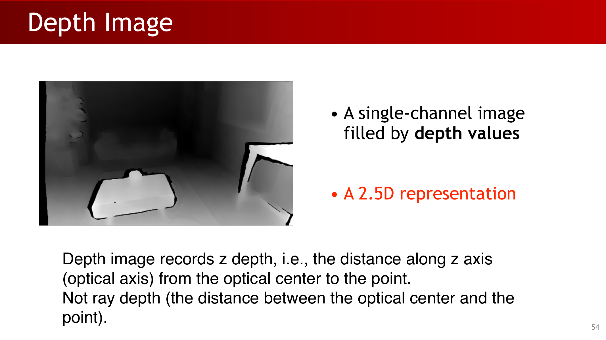

A depth image records z-depth: distance along the optical axis from the optical center to the point. It is not ray depth, which would be the Euclidean distance from the optical center to the point.

:::warn Common pitfall: z-depth vs. ray depth
For a point $(x,y,z)$, z-depth is $z$. Ray depth is $\sqrt{x^2+y^2+z^2}$. These are equal only on the optical axis where $x=y=0$.
:::

For a depth camera, assume the intrinsic matrix $K$ is known. A depth pixel $(u,v,z)$ satisfies:

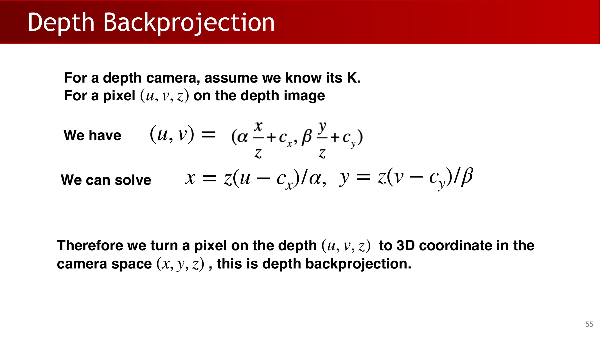

$$
(u,v)=\left(\alpha\frac{x}{z}+c_x,\;\beta\frac{y}{z}+c_y\right)
$$

Solving for 3D camera coordinates:

$$
x=\frac{z(u-c_x)}{\alpha},\qquad y=\frac{z(v-c_y)}{\beta}
$$

So one pixel $(u,v,z)$ becomes one 3D camera-space point $(x,y,z)$.

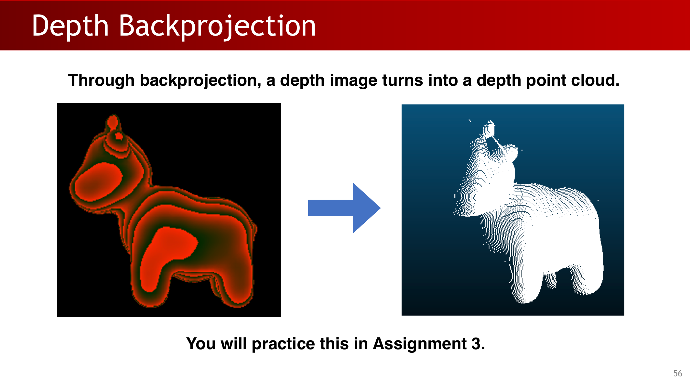

Through backprojection, a depth image turns into a depth point cloud. A true 3D representation should allow metric distance measurement between two points; depth alone is not enough because $K$ is needed to recover $x,y,z$.

:::remark Key question and answer: why depth is only 2.5D
**Question (original intent):** If a depth image contains depth values, why is it still only 2.5D?

**Answer:** It stores one visible surface depth per pixel from one viewpoint. It does not directly store hidden surfaces, full object geometry, or metric 3D coordinates unless camera intrinsics are used for backprojection.
:::

## 9. Exam Review

### Core definitions

- Pinhole camera: selects one dominant ray per scene point and projects by similar triangles.
- Intrinsics $K$: internal camera parameters that map camera coordinates to pixel coordinates.
- Extrinsics $R,T$: pose relationship between world and camera frames.
- Perspective projection: full projective mapping with depth in the denominator.
- Weak perspective: approximate projection using a shared average depth $z_0$.
- Orthographic projection: drops depth-dependent scale change.
- Depth image: single-channel z-depth map, a 2.5D representation.
- Depth backprojection: converts $(u,v,z)$ into camera-space $(x,y,z)$ using $K$.

### Short-answer templates

- To explain pinhole projection: start from ray selection, use similar triangles, then state $x'=fx/z$ and $y'=fy/z$.
- To explain homogeneous coordinates: Euclidean projection is nonlinear because of division by $z$; homogeneous form makes the matrix multiplication linear up to a final normalization.
- To explain extrinsics: state the transformation direction first. In this lecture, $P=[R\;T]P_w$, so camera pose in world coordinates is $R^{-1},-R^{-1}T$.
- To compare camera models: perspective is accurate but nonlinear; weak perspective is simple but valid only for small depth variation; orthographic removes depth scale entirely.
- To explain depth backprojection: use the pixel equation, solve for $x,y$, and emphasize that $z$ is optical-axis depth.

### Common mistakes

- Confusing image-plane metric coordinates with pixel coordinates.
- Treating depth image values as Euclidean ray distance.
- Reading $T$ directly as the camera center in world coordinates.
- Forgetting homogeneous division after multiplying by the camera matrix.
- Applying weak perspective to objects with large depth variation.

### Self-check

1. Can you derive $x'=fx/z$ from similar triangles?
2. Can you write the intrinsic matrix $K$ and explain $\alpha,\beta,c_x,c_y$?
3. Can you explain why projective transformation is not Euclidean-linear but is homogeneous-linear?
4. Can you convert $(u,v,z)$ into $(x,y,z)$ when $K$ is known?
5. Can you choose between perspective, weak perspective, and orthographic projection for a given scenario?
