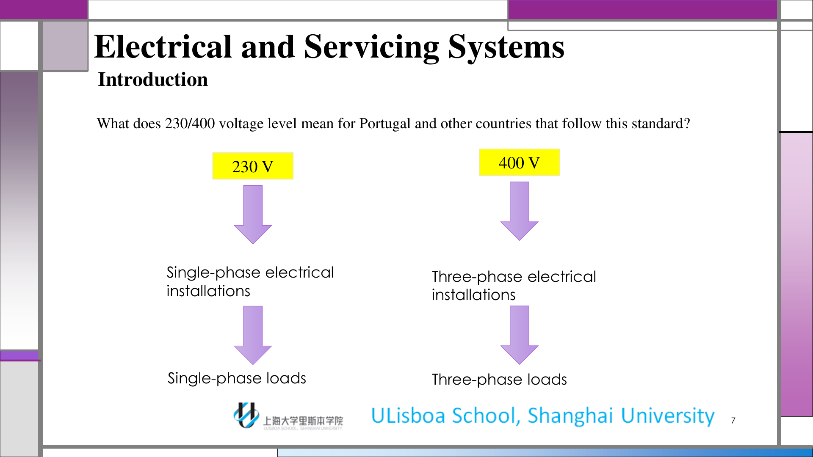
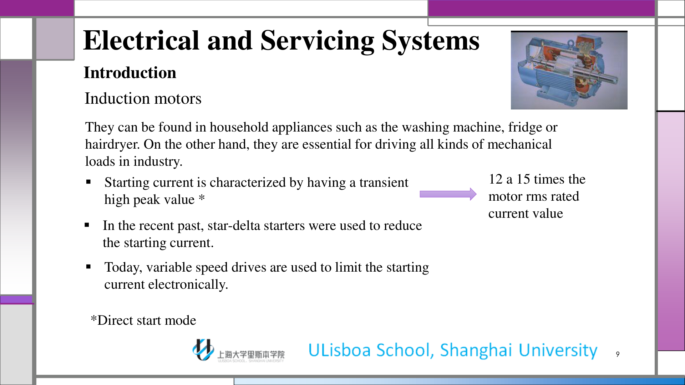
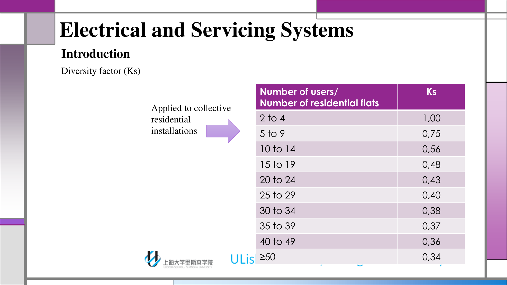
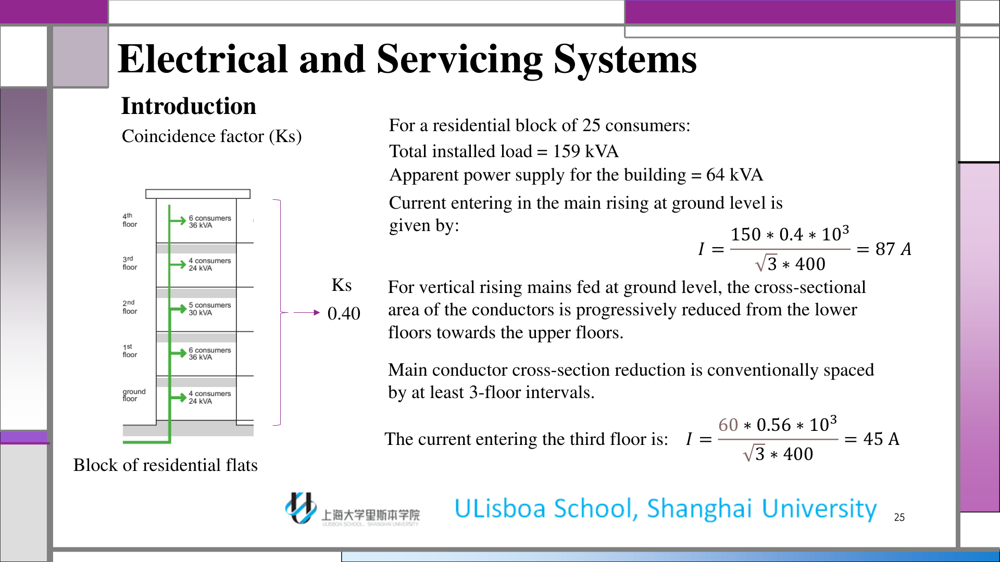
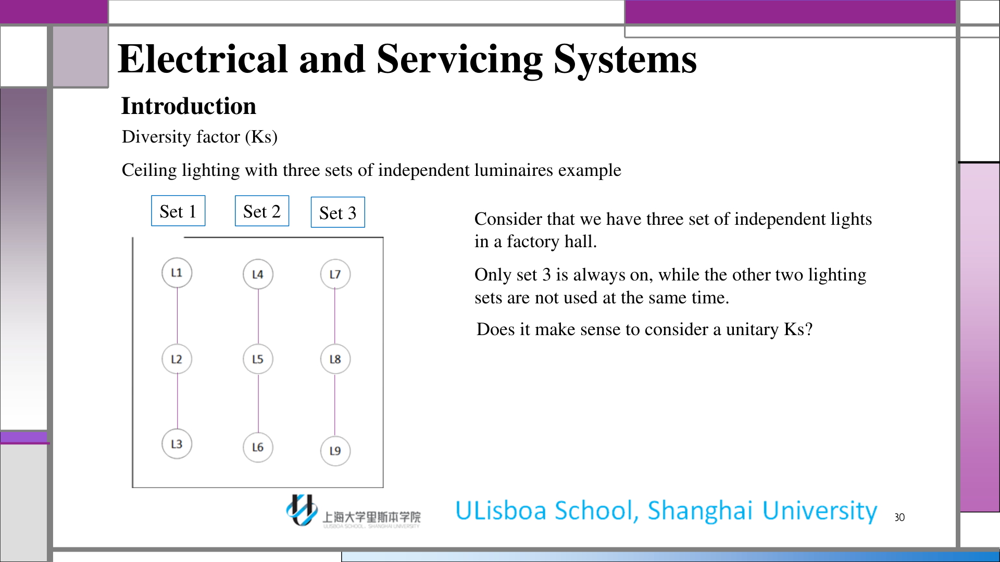
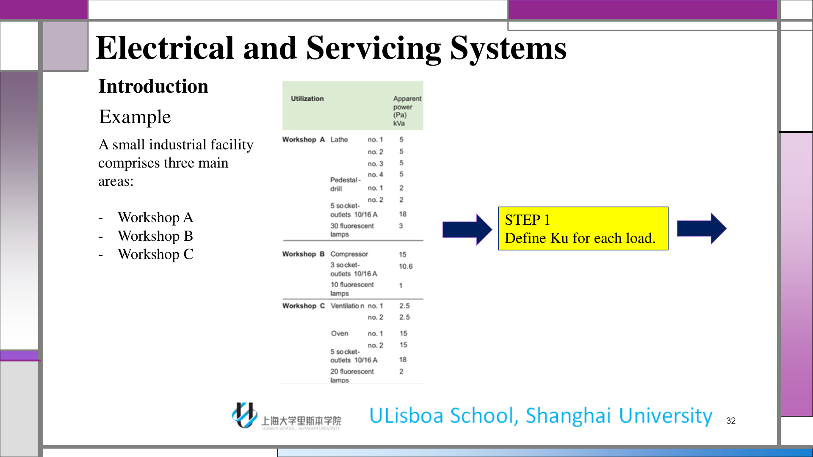
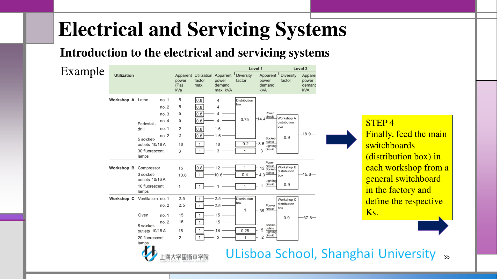

# Lec1 Introduction to Electrical and Servicing Systems

## 1. Learning Scope and Outcomes

This lecture establishes the engineering logic used throughout the course: classify low-voltage systems, characterize common load types, and estimate realistic installation demand for safe design.

By the end of Lec1, you should be able to:

1. Interpret low-voltage level labels used in practice.
2. Distinguish load families (motors, resistive heating, fluorescent/discharge/LED) and their impact on current.
3. Compute estimated demand using utilization/diversity logic rather than pure nameplate summation.
4. Explain why switchboard sizing is based on simultaneous demand, not only installed power.

:::remark 📝 Key Definition
**Installed power** is the sum of nameplate powers at full-load operation.

**Power used** is the expected operating power under real usage scenarios.
:::

## 2. Voltage-Level Framework and the 230/400 Question

The introductory slides position electrical installations in standard voltage classes and then focus on low-voltage practice in buildings and workshops.

:::tip 💡 Key Question and Answer
**Question:** What does the 230/400 voltage level mean in countries following this standard?

**Answer:** In a three-phase low-voltage system, 230 V is the phase-to-neutral voltage and 400 V is the phase-to-phase voltage. This directly affects equipment connection (single-phase vs three-phase) and current estimation formulas.
:::

## 3. Typical Loads and Why Starting Current Matters

The lecture surveys typical electrical loads and emphasizes that each class behaves differently at startup and in steady state.

- Induction motors: major industrial and appliance drivers, often with high starting current peaks.
- Resistive heating/incandescent loads: near-unity power factor behavior.
- Fluorescent, discharge, and LED systems: different driver/ballast characteristics with distinct design implications.

For induction motors, direct start can produce a transient current peak (commonly far above rated RMS current). The course connects this to starter strategy (historical star-delta approaches vs modern variable speed drives).

:::warn ⚠️ Design Reminder
If startup transients are ignored, protective-device selection and feeder sizing can be wrong even when nominal running current looks acceptable.
:::

## 4. Estimated Power in Real Installations

The central design message is that a safe installation must balance cost and technical reliability. Real demand is not the arithmetic sum of all nameplate powers running simultaneously at full load.

Core factors introduced in this lecture:

- $K_u$: maximum utilization factor (equipment-level operating regime).
- $K_s$: diversity/coincidence factor (installation-level simultaneity behavior).
- $K_e$: expansion reserve factor for future growth.

Compact formulas used through examples:

$$
K_u = \frac{P_{used}}{P_{rated}}, \qquad
K_s = \frac{\sum P_{simultaneous}}{\sum P_{installed}}
$$

:::remark 📝 Practical Interpretation
$K_u$ captures "how hard one load is normally used".

$K_s$ captures "how many loads are really on at the same time".
:::

## 5. Ku Examples and Motor Current Calculation

The workshop example quantifies how power factor changes feeder current for the same active power request.

Three-phase current relation:

$$
I = \frac{P}{\sqrt{3} U_{LL} \cos\varphi}
$$

Example shown in class ($P=106\times10^3\,\mathrm{W}$, $U_{LL}=400\,\mathrm{V}$):

$$
I = \frac{106 \times 10^3}{\sqrt{3} \times 400 \times \cos\varphi}
$$

- $\cos\varphi = 0.60 \Rightarrow I \approx 254.9\,\mathrm{A}$
- $\cos\varphi = 0.65 \Rightarrow I \approx 235.38\,\mathrm{A}$
- $\cos\varphi = 0.70 \Rightarrow I \approx 218.56\,\mathrm{A}$

:::tip 💡 Key Question and Answer
**Question:** Which $K_u$ should be chosen for motors?

**Answer:** It depends on the actual operating profile (torque, speed, duty cycle, and loading pattern). There is no universal motor $K_u$ value; choose it from realistic operation, not from optimistic assumptions.
:::

## 6. Ks (Diversity/Coincidence) and Switchboards

The lecture moves from single-load usage to installation simultaneity and panel-level feeding strategy.

For a residential-block example, the slides show:

$$
I = \frac{150 \times 0.4 \times 10^3}{\sqrt{3} \times 400} \approx 87\,\mathrm{A}
$$

$$
I = \frac{60 \times 0.56 \times 10^3}{\sqrt{3} \times 400} \approx 45\,\mathrm{A}
$$

:::remark 📝 Key Definition
**Switchboards (electric panels)** are distribution and protection nodes where circuits are grouped, protected, and monitored. They are not passive boxes; they encode segmentation, selectivity, and maintenance access.
:::

:::tip 💡 Key Question and Answer
**Question:** Does it make sense to set a unitary $K_s$ for three independent lighting sets when only one set is always on and the others are not used simultaneously?

**Answer:** No. A unitary $K_s$ overestimates simultaneous demand in that scenario. The factor should reflect real concurrency to avoid oversizing while preserving safety margins.
:::

## 7. End-to-End Example Workflow (Industrial Facility)

The final slides synthesize the method on a small industrial facility with Workshops A/B/C.

Recommended execution chain:

1. Define $K_u$ for each load/circuit.
2. Group loads per switchboard and define local $K_s$.
3. Feed workshop switchboards from a main distribution board and define upstream $K_s$.
4. Feed workshops from the factory general switchboard and apply the final simultaneity layer.

Final sizing relation used after real apparent power is determined:

$$
I_n = \frac{S}{\sqrt{3} U_{LL}}
$$

:::warn ⚠️ Common Mistake
Do not reuse one global factor at every hierarchy level. Each level (final circuits, local panels, main panels) has its own simultaneity pattern.
:::

## 8. Exam Review Appendix

### 8.1 Must-Master Definitions

- **Installed power**: sum of rated powers at full load.
- **Power used**: expected operating power in real scenarios.
- **$K_u$**: utilization behavior of a specific load.
- **$K_s$**: simultaneity behavior of a group/installation.
- **$K_e$**: capacity reserved for expansion.

### 8.2 Mechanism to Explain in Short Answers

1. Identify load families and operation profile.
2. Apply $K_u$ at load level.
3. Apply $K_s$ at grouping/panel levels.
4. Convert resulting power to current for conductor/protection sizing.

### 8.3 Ready-to-Use Short-Answer Templates

- "I do not sum all nameplate powers directly because simultaneity is lower than full-load coincidence."
- "I assign $K_u$ from operation duty and assign $K_s$ from concurrent usage at each panel level."
- "Then I compute current from three-phase relations to size feeders and protections."

### 8.4 Frequent Pitfalls

- Treating all motor loads as continuously full-load.
- Assuming one fixed $K_s$ for all circuit groups.
- Ignoring startup current when selecting protection.

### 8.5 Self-Check List

1. Can I explain 230/400 V clearly (phase-neutral vs phase-phase)?
2. Can I justify a non-unitary $K_s$ scenario with a real usage pattern?
3. Can I derive current from power and power factor for 3-phase supply?
4. Can I describe the multi-level sizing flow from final circuits to general switchboard?
