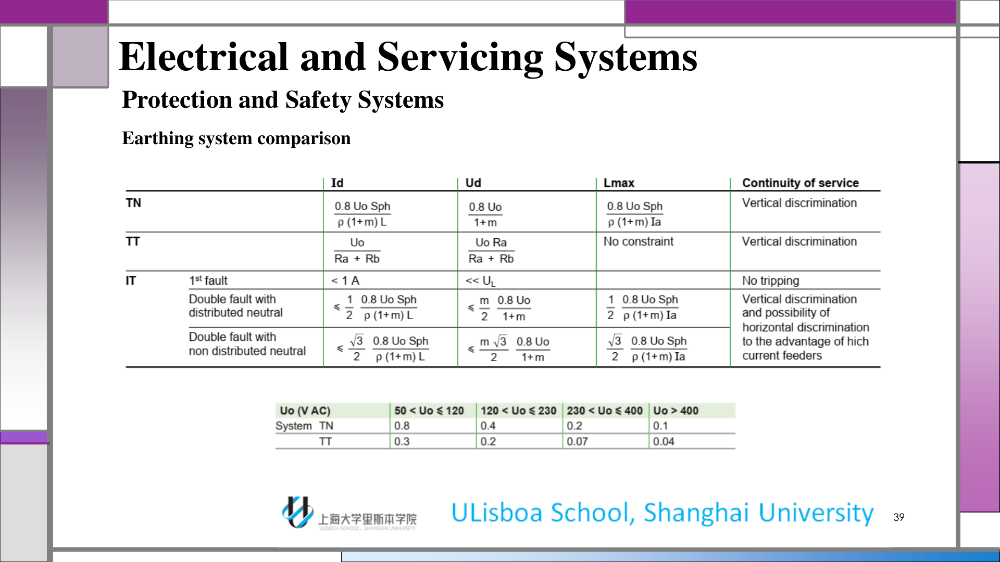
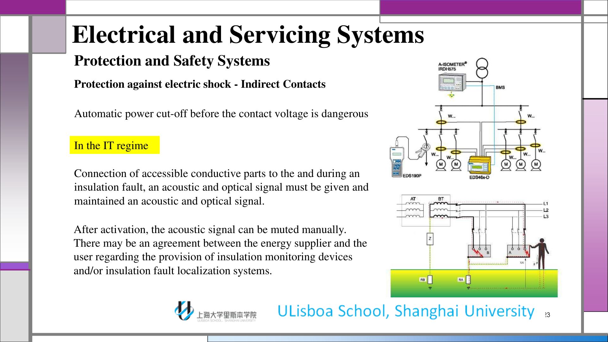
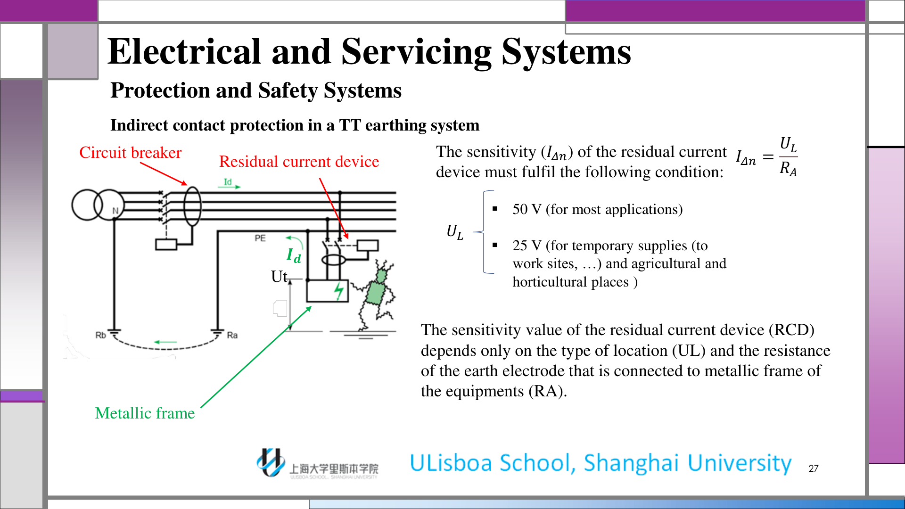
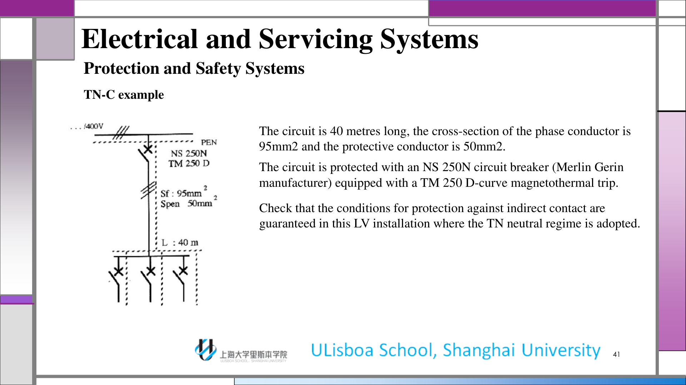
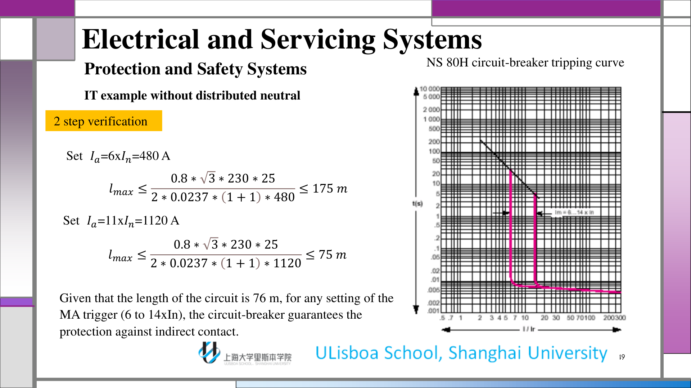

# 第2讲 保护与安全系统

## 1. 学习范围与安全目标

本讲建立低压安装中最核心的安全逻辑：什么会导致触电风险，如何区分直接接触与间接接触，以及在 TT、TN、IT 接地系统下应如何选择保护策略。

学完本讲，你应能做到：

1. 解释人体电流的主要生理危害。
2. 区分直接接触与间接接触。
3. 用接触电压和接地故障关系来判断保护装置是否足够。
4. 说明 TT、TN、IT 系统为什么采用不同的切断方式和不同的连续性取舍。

:::remark 关键定义
**危险的不只是电压本身，而是电流是否经过人体。**

触电风险取决于电流大小、电流路径、持续时间，以及人体和周围环境的状态。
:::

## 2. 触电会造成什么

电流通过人体组织时，会干扰肌肉、呼吸和心脏，因此非常危险。

:::tip 为什么特别大的电流不一定表现为典型的“强直”
在极大电流下，肌肉收缩可能强到把人体直接甩离导体。没有出现典型“抓住不放”的强直，并不代表更安全，通常只是说明危险已经升级。
:::
- **心室颤动**：最危险的后果之一，心脏可能在刺激停止后仍持续无序收缩。
- **灼伤**：电流经过人体时会产生焦耳热，造成烧伤。

## 3. 直接接触与第一道保护

直接接触是指人体意外接触到带电导体，或本来就处于带电状态的导电部件。在低压系统里，最基本的做法很直接：不要让带电部分暴露在可触及范围内，并用隔板、外壳或绝缘把它们隔离起来。

课程强调两层思路：

1. 通过空间布置或外壳把带电部分放到触及不到的位置。
2. 当必须进一步降低风险时，加装高灵敏度剩余电流保护。

:::tip 关键问题与解答
**问题：** 直接接触和间接接触到底有什么区别？

**解答：** 直接接触是接触到本来就应该带电的部分；间接接触是接触到金属外壳等外露导电部分，而这些部分是因为绝缘故障才意外带电的。
:::

在 230/400 V 这类低压系统中，课程还强调可以用瞬时动作的高灵敏度剩余电流断路器作为补充措施，典型灵敏度约为 30 mA，用于人身保护。

:::remark Class II 提示
Class II 配电箱不能只靠主绝缘。它还要增加双重绝缘或加强绝缘，让外壳本身也参与安全保护。
:::

## 4. 接触电压、人体电流与自动切断

当绝缘故障使金属外壳带电时，最关键的量就是接触电压。

$$
I_b = \frac{U_t}{R_b}
$$

:::tip TT 课件真正想表达什么
TT 的保护思路很直接：让接地故障发生，然后检测失衡电流，并在接触电压仍未危险到足够长时间之前迅速断电。
:::
课程还强调，接触电压不仅与故障电流有关，还与接地极电阻、鞋底和地面等附加电阻有关。

自动切断是间接接触防护的核心思路：在危险接触电压持续到足以伤人之前，把电源切掉。

:::tip 关键问题与解答
**问题：** 剩余电流保护器为什么在这里有效？

**解答：** 正常电路里，相线电流和中性线电流大小相等、方向相反。绝缘故障把一部分电流引到大地后，两者出现差值，这个差值就是剩余电流；当它达到动作阈值时，RCD 立即跳闸。
:::

记号上可以写成：

$$
I_P - I_N = I_{res}
$$

健康电路中通常有 $I_N \approx I_L$。

## 5. 接地系统总览

IEC 60364-1 用 TN、TT、IT 三种代码表示接地系统。

- **第一字母**描述变压器中性点如何接地。
- **第二字母**描述外露导电部分如何连接。

课程采用的标准含义是：

- **T**：直接接地。
- **I**：与大地隔离，或者通过高阻抗接地。
- **N**：连接到原供电系统的中性线。

这里的 PE、N、PEN 很重要：

- **PE** 是保护导体。
- **N** 是中性导体。
- **PEN** 把 PE 和 N 合并在同一根导体里。

:::remark 关键理解
接地系统不是命名细节。它决定故障电流大小、接触电压、保护装置类型，以及系统更重视安全切断还是供电连续性。
:::

## 6. TT 系统

在 TT 系统中，变压器中性点直接接到工作接地，而设备外露导电部分接到独立的保护接地极。

因此，故障回路主要由接地极电阻 $R_A$ 和 $R_B$ 决定。

$$
I_d = \frac{U_p}{R_A + R_B}
$$

$$
U_t = \frac{R_A}{R_A + R_B} U_p
$$

由于故障电流受接地电阻限制，仅靠过流保护通常不够，标准做法是使用剩余电流保护器。

RCD 的额定灵敏度必须满足：

$$
I_{\Delta n} \le \frac{U_L}{R_A}
$$

其中 $U_L$ 是约定俗成的接触电压限值。

课程给出的限值是：

- 大多数场合取 $50\,\mathrm{V}$。
- 临时供电、工地、农业和园艺场所取 $25\,\mathrm{V}$。

切断时间也有要求：

- 额定电流不超过 32 A 的回路，故障切断时间不应超过 0.2 s。
- 其他回路不应超过 1 s。
- 同一配电回路上的 RCD 之间还要保证选择性。

:::tip TT 课件真正想表达什么
TT 的保护思路很直接：让接地故障发生，然后检测失衡电流，并在接触电压仍未危险到足够长时间之前迅速断电。
:::

## 7. TN 系统

在 TN 系统中，变压器中性点直接接地，设备外露导电部分通过 PE 或 PEN 导体回接到中性点。

课程区分了两种常见形式：

- **TN-C**：PE 与 N 合并成 PEN。
- **TN-S**：PE 与 N 全程分开。

PEN 导体兼具保护与中性两种功能。它通常沿全长为绿黄双色，在两端连接处还要加蓝色标记。

由于故障回路阻抗低，故障电流很大，绝缘故障的行为很像相线对中性线短路。

$$
I_d = \frac{U_0}{R_{ph1} + R_{PE}}
$$

$$
U_d = R_{PE} I_d
$$

在 230/400 V 网络中，如果故障回路不够短，这个接触电压会很快变得危险。

课程使用最大允许长度来保证保护器件一定能动作：

$$
L_{max} = \frac{0.8 U_0 S_{ph}}{2 \rho I_a (1 + m)}
$$

其中 $m = S_{ph} / S_{PE}$。

如果线路长度超过 $L_{max}$，要么加大导线截面积，要么改用 RCD 保护。

:::tip 关键问题与解答
**问题：** 为什么 TN 系统常常可以用过流保护器件完成安全切断？

**解答：** 因为故障电流足够大，断路器或熔断器能像处理短路一样快速动作。它不是在处理微小漏电，而是在切除接近短路的故障。
:::

### 7.1 TN-C 算例

课程检查了一个 40 m 的 TN-C 回路：相导体截面积 95 mm²，保护导体截面积 50 mm²，保护器件为带 TM 250 D 磁脱扣的 NS 250N 断路器。

磁脱扣范围约为额定电流的 5 到 10 倍，因此保护阈值足以切除类似短路的故障。

按课件中的两个设置，最大允许长度分别约为 203 m 和 101 m，所以 40 m 的线路明显处在受保护范围内。

算例得到的接触电压约为 120.6 V，因此切断时间要求必须小于 200 ms；而断路器在短路区的曲线上小于 50 ms 即可动作，所以满足要求。

## 8. IT 系统

在 IT 系统中，变压器中性点与大地隔离，或者通过高阻抗接地；设备外露导电部分则接地。

这种系统适合强调供电连续性的场景，例如医院和大功率驱动系统。

IT 系统的核心是第一次故障：

- 第一次绝缘故障通常不会立即跳闸。
- 需要绝缘监测装置持续监视系统，并在故障时报警。
- 第一次故障下的接触电压通常不高，但并不意味着可以忽略。

如果发生第二次故障，系统行为就会更像 TN 短路故障。

对于不带中性线的三相安装，课件用的是以 $\sqrt{3} U_0$ 作为有效电压的第二故障最大长度校核：

$$
L_{max} = \frac{0.8 U_0 \sqrt{3} S_{ph}}{2 \rho I_a (1 + m)}
$$

对于带中性线的三相安装，则对应关系改用 $U_0$ 而不是 $\sqrt{3}U_0$。

:::tip IT 和 TT、TN 的根本区别
IT 用“第一次故障不立即切断”的方式换取连续供电，因此必须依赖绝缘监测，而不是只靠被动的断电动作。
:::

## 9. 接地系统比较

比较页把整章内容压缩成了三个结论：

- **TN**：故障电流大，切断快，最大长度受故障回路约束。
- **TT**：故障电流受接地极限制，因此标准方案是用 RCD 断开。
- **IT**：第一次故障不跳闸，但必须监测，第二次故障必须果断切除。

供电连续性的优先级同样重要：

1. TT 和 TN 更重视安全切断。
2. IT 更重视第一次故障时的连续供电。
3. 选哪一种，不是看偏好，而是看应用需求。

## 10. 算例整理

### 10.1 TT 算例

课件中的 TT 算例先算出了接地故障电流：

$$
I_d = \frac{230}{10 + 20} = 7.7\,\mathrm{A}
$$

接触电压为：

$$
U_f = R_A I_f = 154\,\mathrm{V}
$$

这个值已经高于允许的接触电压限值，因此必须依靠 RCD 来保证自动切断。

课件给出的额定灵敏度条件是：

$$
I_{\Delta n} \le 2.5\,\mathrm{A}
$$

### 10.2 TN-C 算例

对于 40 m 的 TN-C 回路，课件把断路器的磁脱扣整定值与最大允许长度一一核对。

结论是：图中给出的两个整定值都能保护这条线路，而且 40 m 明显小于允许的最大长度。

故障时的接触电压约为 120.6 V，因此切断时间必须小于 200 ms；而断路器在短路区的动作时间小于 50 ms，所以满足安全要求。

### 10.3 无分布中性线的 IT 算例

对于 76 m 的 IT 回路，课件检查了两个磁脱扣整定值：

- $I_a = 6 I_n = 480\,\mathrm{A}$ 时，$L_{max} \le 175\,\mathrm{m}$。
- $I_a = 11 I_n = 1120\,\mathrm{A}$ 时，$L_{max} \le 75\,\mathrm{m}$。

由于线路长度为 76 m，第一种整定是可以接受的，课件因此得出结论：所选保护器件可以保证间接接触防护。

该算例的接触电压约为 79.7 V，断路器切除短路所需时间小于 20 ms。

## 11. Exam Review 附录

### 11.1 必会定义

- **直接接触**：触及本来就带电的部分。
- **间接接触**：触及因绝缘故障而带电的外露导电部分。
- **接触电压**：外露导电部分与人体可同时接触到的另一导电点之间出现的电压。
- **RCD**：剩余电流保护器，当相线和中性线电流不平衡时动作。
- **PEN**：保护导体与中性导体合一的导体。

### 11.2 简答题主线

1. 先识别接触类型。
2. 再识别接地系统。
3. 决定保护机理是外壳隔离、自动切断、绝缘监测，还是组合方式。
4. 检查对应的电压限值、电流阈值和切断时间。

### 11.3 可直接套用的答题模板

- “直接接触要靠把带电部分放到触及不到的位置，并在需要时加装快速剩余电流保护。”
- “TT 主要靠 RCD，因为接地故障电流被接地极电阻限制了。”
- “TN 可以用过流保护快速切断，因为故障电流足够大，接近短路。”
- “IT 在第一次故障时优先保证连续供电，并通过绝缘监测装置报警。”

### 11.4 常见误区

- 把所有故障都当成同样的回路阻抗处理。
- 忘记 TT 和 TN 的切断逻辑不同。
- 认为 IT 的第一次故障也应该像普通故障一样立即跳闸。
- 只看电压限值，忽略切断时间限值。

### 11.5 自检清单

1. 我能否不看课件就说清直接接触和间接接触的区别？
2. 我能否从接触电压限值推出 TT 的剩余电流条件？
3. 我能否解释 TN 为什么可以把过流保护当作人身保护手段？
4. 我能否说明 IT 为什么更连续，但必须靠绝缘监测？