# 第3讲 保护器件与短路电流计算

## 1. 学习目标与主线

本讲把两个必须联动完成的工程任务放在一起讲清楚：

1. 选对能够安全分断故障的保护器件。
2. 算准最大/最小短路电流，验证器件整定是否成立。

学完后你应能做到：

1. 解释低压系统中 `MCB/MCCB/RCCB/SPD` 的分工。
2. 准确区分 `Icu` 与 `Ics`，并理解其标准语境。
3. 根据已知数据与精度需求选择短路计算方法。
4. 使用三相、两相、相-中性点短路电流核心公式。
5. 从上级电网、变压器、电机、电缆四部分构建故障回路阻抗。

:::remark 关键问题与解答
**问题（课件核心意图复述）：为什么“保护器件选型”和“短路电流计算”不能分开做？**

**解答：** 因为断路器的动作能力取决于安装点实际故障电流水平。若电流低估，可能拒动或延时过大；若无依据高估，又会导致选型不经济或与网络条件不匹配。
:::

## 2. 低压装置中的保护器件

课程先给出工程上常见的保护器件族：

- 熔断器。
- 断路器（`MCB`、`MCCB`、`RCBO`）。
- 剩余电流保护装置（`RCD`/`RCCB`）。
- 浪涌保护器（`SPD`）。

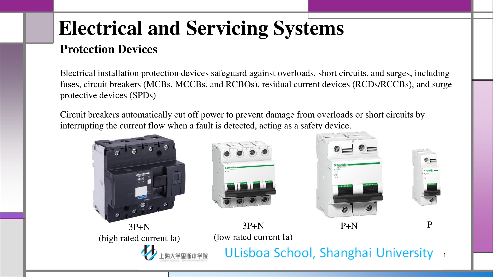

断路器在讲义中的定位是：对过载和短路故障进行自动分断，避免设备损坏。

### 2.1 RCCB 在器件体系中的位置

`RCCB` 作为剩余电流保护元件，在需要直接监测漏电/接地故障分量时使用。

### 2.2 `Ics` 与 `Icu`（核心区分）

课件把两个看似接近、但工程含义不同的指标分开定义：

- **`Icu`**：极限分断能力。
- **`Ics`**：运行分断能力。

:::remark 关键定义（对应课件原意）
**`Icu`（或 `Icn`）表示断路器在不损坏条件下可成功分断的最大故障电流。**

**`Ics` 表示运行短路分断能力：装置分断后复位，仍应保证装置连续运行能力。**
:::

设计含义：

- `Icu` 是极端故障下的“生存上限”。
- `Ics` 是分断后的“可继续运行水平”。
- IEC 60947-2 常把 `Ics` 写成 `Icu` 的百分比（典型 25%、50%、75%、100%）。

讲义中 `EN 60898` 与 `IEC 60947-2` 的对比页强调：铭牌读法必须放在对应标准体系下理解。

## 3. 磁脱扣曲线（`B`、`C`、`D`）

讲义对比了 `B/C/D` 三类曲线的磁脱扣区间。

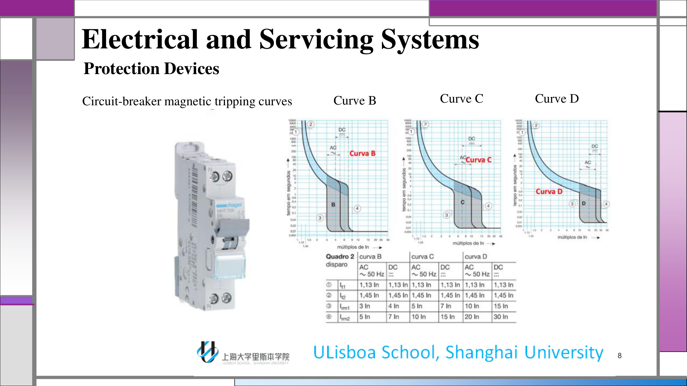

快速理解：

- `B` 曲线：磁脱扣倍数较低、动作更早。
- `C` 曲线：中等冲击电流容忍。
- `D` 曲线：容忍更高冲击电流、磁脱扣更晚。

图中给出的典型范围可近似记为：

- `B`：约 `3-5 In`（交流条件）。
- `C`：约 `5-10 In`（交流条件）。
- `D`：约 `10-20 In`（交流条件）。

:::tip 关键问题与解答
**问题（根据曲线页原意复述）：什么时候应从 B 曲线改到 C 或 D？**

**解答：** 当线路存在更大涌流/励磁冲击，需要避免误跳闸时，应选择更高容忍区间；但前提是仍能满足短路快速切除要求。
:::

## 4. 为什么短路电流取决于阻抗

短路计算部分首先给出一个物理主结论：

- 故障电流由故障点“看到”的等效阻抗决定。

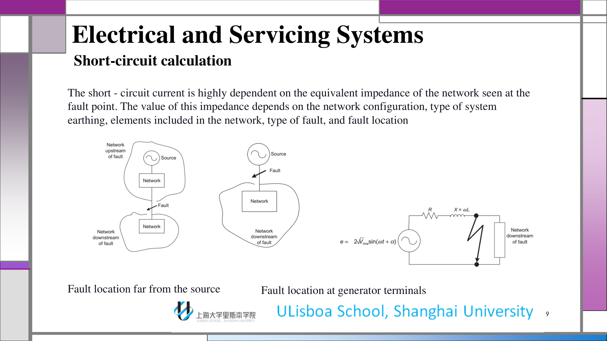

因此短路电流会随以下因素变化：

- 故障点位置（靠近电源或远端）。
- 接地系统类型。
- 上级电网强弱。
- 变压器/电机/电缆在回路中的阻抗贡献。

## 5. 如何选择短路计算方法

本讲给出三种方法：

1. 组成法（Composition）。
2. 常规法（Conventional）。
3. 阻抗法（Impedance）。

选法依据包括：

- 目标是最大值还是最小值。
- 所需精度。
- 可获得的供电与安装参数。
- 装置重要等级。

:::remark 关键问题与解答
**问题（对应课件原句原意）：短路电流计算方法应依据什么来选？**

**解答：** 依据目标电流类型（最大/最小）、精度要求、已知参数完整度和工程重要性。上游数据不足时可先用组成法估算；参数完整时优先阻抗法。
:::

## 6. 常规法（UTE C 15-105:2003）

常规法的核心假设是：故障期间线路起点电压取额定值的 `80%`，并包含负载系数 `1.05`。

### 6.1 最小短路电流

$$
I_{K1\min}=\frac{0.8\times1.05\times U_o}{Z_F+Z_N}
$$

其中：

- `U_o`：相对中性点额定电压。
- `Z_F`：相导体电阻。
- `Z_N`：中性导体电阻。

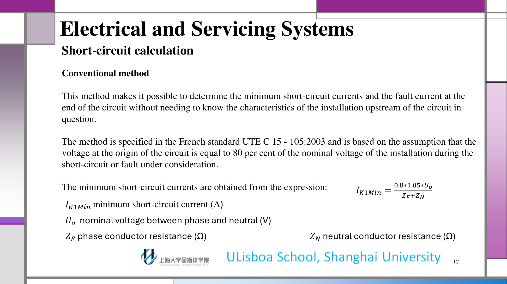

### 6.2 线路末端故障电流

$$
I_d=\frac{0.8\times1.05\times U_o}{Z_F+Z_{PE}}
$$

其中 `Z_{PE}` 为保护导体电阻。

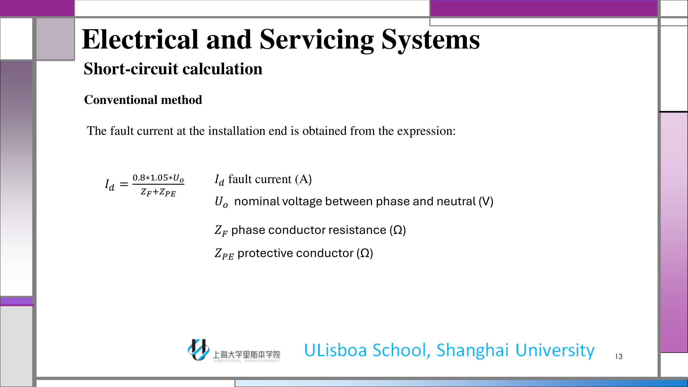

## 7. 阻抗法下的最大短路电流

阻抗法思想是把回路各段 `R`、`X` 分项叠加，再求等效阻抗。

### 7.1 三相对称短路电流

课件把 `I_{k3\max}` 作为最严重的平衡故障工况。

$$
I_{k3\max}=\frac{C_{\max}\,m\,U_o}{\sqrt{\left[R_Q+R_T+R_{Uph}+\rho_0\frac{L}{S\,n_{ph}}\right]^2+\left[X_Q+X_T+X_{Uph}+\lambda\frac{L}{n_{ph}}\right]^2}}
$$

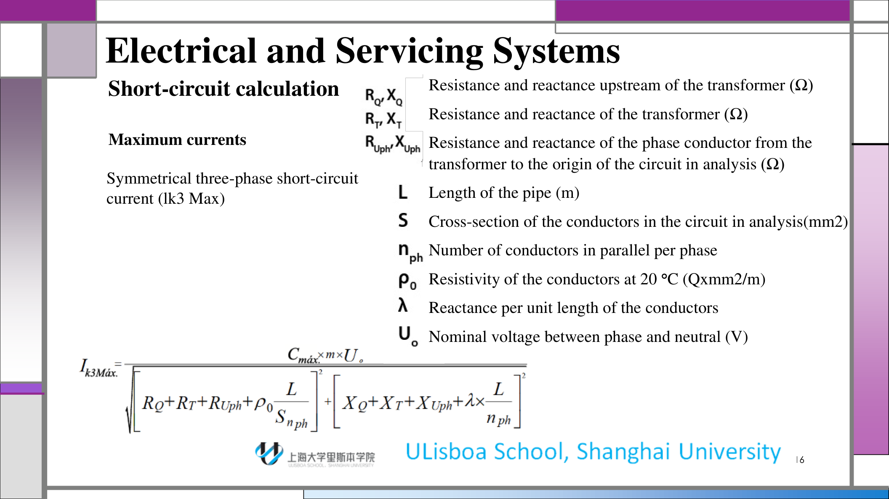

### 7.2 两相短路电流

$$
I_{k2\max}=\frac{\sqrt{3}}{2}I_{k3\max}=0.86\,I_{k3\max}
$$

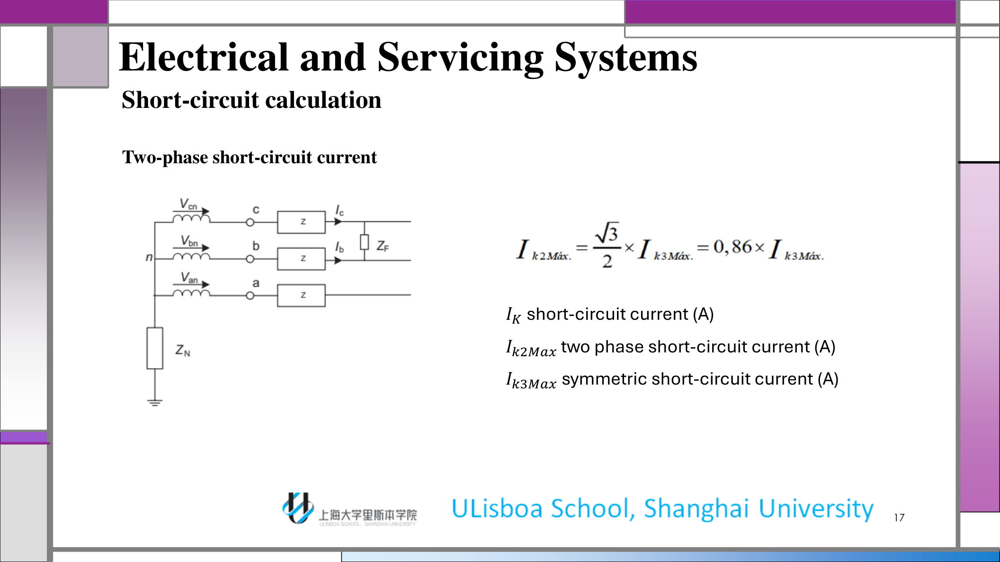

### 7.3 相-中性点短路电流

$$
I_{k1\max}=\frac{C_{\max}\,m\,U_o}{\sqrt{\left[R_Q+R_T+R_{Uph}+R_{UN}+\rho_0L\left(\frac{1}{S\,n_{ph}}+\frac{1}{S_N\,n_N}\right)\right]^2+\left[X_Q+X_T+X_{Uph}+X_{UN}+\lambda L\left(\frac{1}{n_{ph}}+\frac{1}{n_N}\right)\right]^2}}
$$

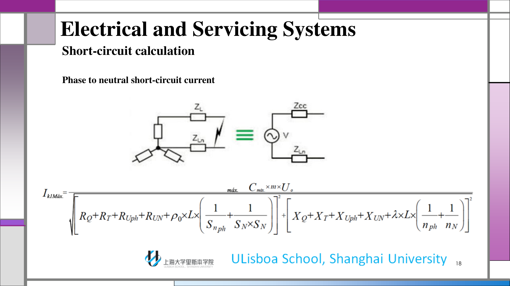

:::tip 补充理解
这类公式分母都可理解为“总电阻项平方 + 总电抗项平方”的平方根。工程上最敏感的参数通常是线路长度 `L`、导体截面，以及上级短路容量。
:::

## 8. 最小短路电流修正规则与意义

在最不利点校核时，课件要求把 `\rho_0` 与 `C_{max}` 替换为更保守参数：

- 断路器校核：`\rho_1=1.25\rho_0`。
- 熔断器校核：`\rho_2=1.5\rho_0`。
- 电压系数采用 `C_{min}`。

:::remark 关键问题与解答
**问题：既然已经算了最大短路电流，为什么还必须算最小短路电流？**

**解答：** 因为保护拒动风险往往发生在“最小故障电流”工况（远端、等效电阻更大、源侧系数更低），不是发生在“最大故障电流”工况。
:::

## 9. 短路阻抗的分块建模

### 9.1 上级电网阻抗

$$
Z_Q=\frac{(mU_n)^2}{S_{kQ}}
$$

讲义给出的 MV 侧短路容量经验值：

- 农村：`150 MVA`。
- 半城市：`250 MVA`。
- 城市：`350-500 MVA`。

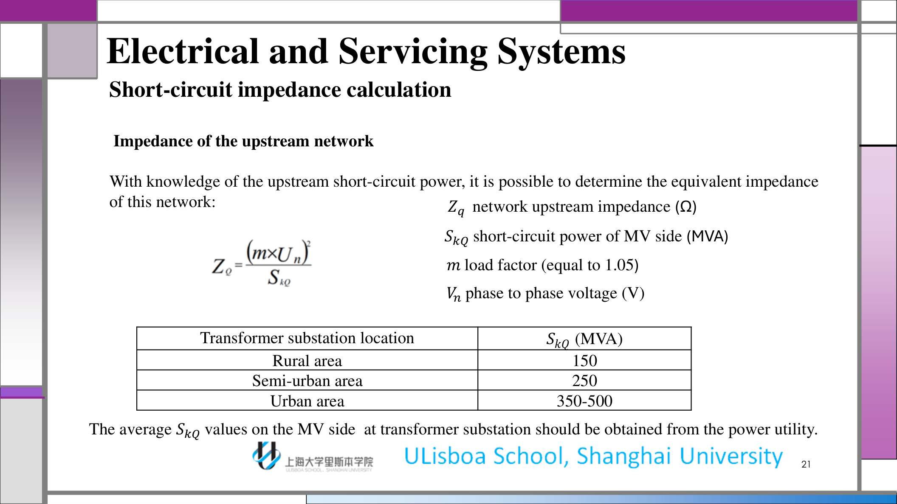

### 9.2 变压器阻抗

$$
Z_T=\frac{U_{kt}}{100}\times\frac{(mU_n)^2}{S_{rT}}
$$

典型短路电压参考：

- `<=630 kVA: 4%`
- `800-1250 kVA: 5%`
- `1600-2000 kVA: 6%`

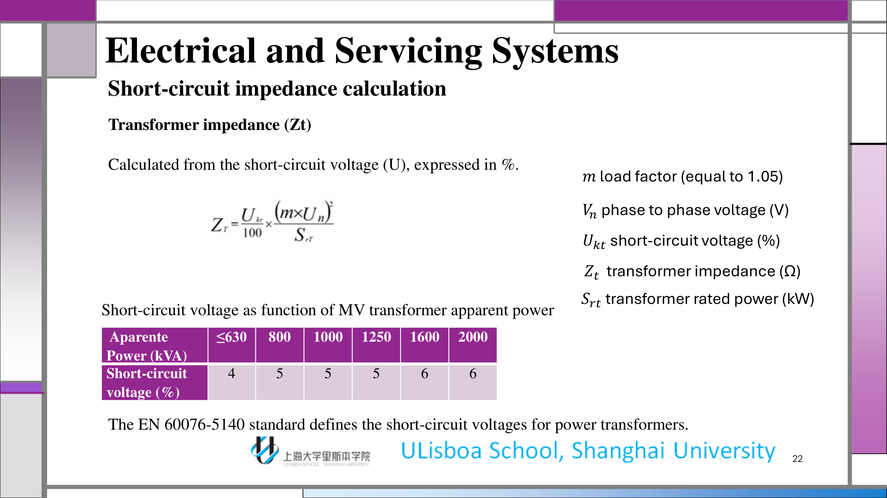

图中趋势强调：只有当系统短路容量远高于变压器额定容量时，才可以近似忽略变压器阻抗。

### 9.3 发电机/同步机阻抗

课件把发电机端短路过程分成三个时段：

1. 次暂态（`10-20 ms`，最高，常见 `>5 In`）。
2. 暂态（至 `200-300 ms`，常见 `3-5 In`）。
3. 稳态（约 `0.3-5 In`，受励磁方式影响）。

电抗换算公式：

$$
X_d'=\frac{X_d'(\%)}{100}\times\frac{U_n^2}{S_{rG}}
$$

$$
X_o=\frac{X_o(\%)}{100}\times\frac{U_n^2}{S_{rG}}
$$

典型区间：

- 汽轮发电机：`10-20`、`15-25`、`150-230`。
- 凸极发电机：`15-25`、`25-35`、`70-120`。

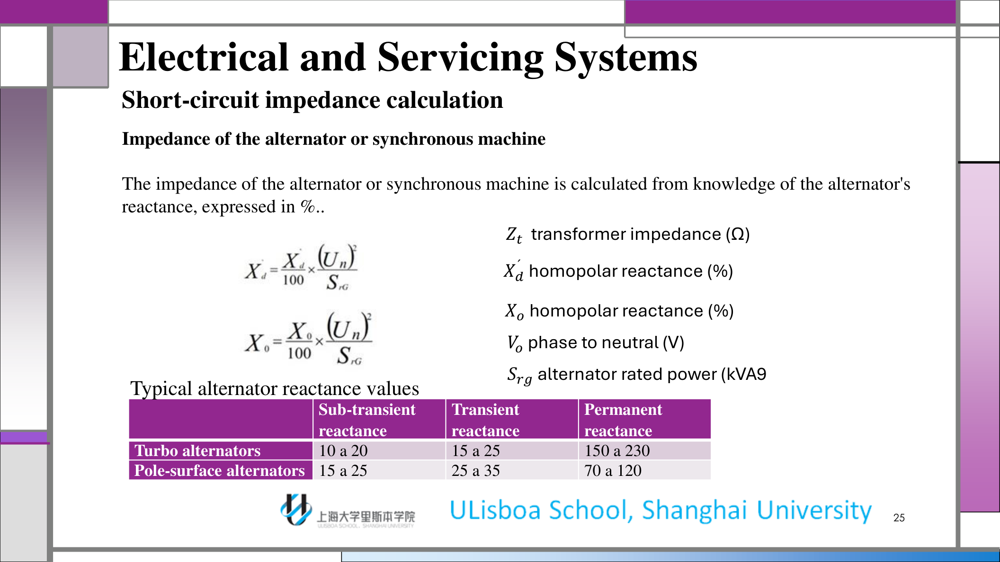

### 9.4 导体与电缆阻抗

$$
R=\rho\frac{L}{n_cS_c}
$$

$$
X=\lambda\frac{L}{n_c}
$$

讲义给出工程近似：低压且截面小于 `150 mm^2` 时，通常可先按电阻主导处理。

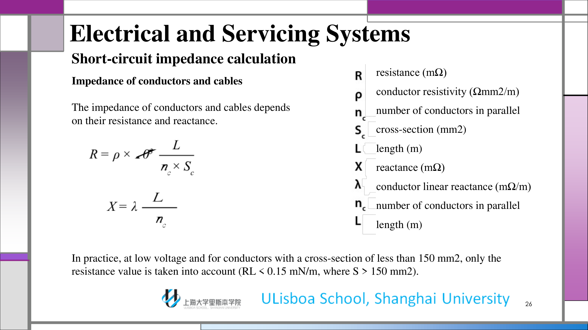

用于最大/最小短路与 TN/IT 故障校核的电阻率规则：

$$
\rho_1=1.25\rho_{20},\quad \rho_1=1.5\rho_{20}
$$

基准值：

$$
\rho_{20,\mathrm{Cu}}=0.018\,\Omega\cdot\mathrm{mm}^2/\mathrm{m},\quad
\rho_{20,\mathrm{Al}}=0.029\,\Omega\cdot\mathrm{mm}^2/\mathrm{m}
$$

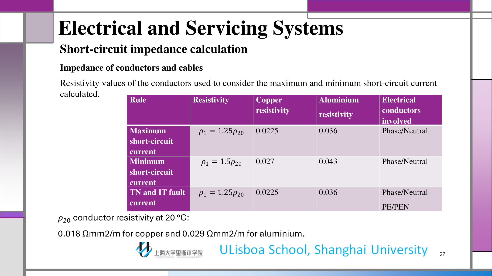

## 10. Exam Review 附录

### 10.1 必会定义

- **额定运行短路分断能力（`Ics`）**：分断并复位后，仍应满足持续运行要求的能力。
- **极限短路分断能力（`Icu`）**：在标准条件下可分断的最大故障电流上限。
- **三相对称短路（`I_{k3}`）**：通常用于最严重故障电流水平校核的平衡故障。
- **最小短路电流**：用于验证保护在最弱故障工况仍能可靠动作。
- **故障回路等效阻抗**：故障点看到的总电阻/电抗组合。

### 10.2 简答题应覆盖的机制

1. 为什么短路电流取决于故障点等效阻抗。
2. 为什么器件选型必须同时看 `Icu` 与 `Ics`。
3. 为什么最大值校核与最小值校核回答的是不同保护问题。
4. 上级电网、变压器、电机、电缆如何共同构成回路阻抗。

### 10.3 可直接套用的答题模板

- “`Icu` 是极限分断上限，`Ics` 体现分断后的可持续运行能力。”
- “三相对称短路用于最严重电流校核；最小短路电流用于验证弱故障下的动作可靠性。”
- “上游参数不足可先用组成法估算；参数完整时阻抗法更适合全工况校核。”
- “最小短路工况采用更保守电阻率与源侧系数，是为了避免保护拒动误判。”

### 10.4 高频误区

- 把一种短路电流计算结果直接套用于所有故障类型。
- 只校核最大短路电流，不校核最小短路电流。
- 不区分标准语境，混用 `EN 60898` 与 `IEC 60947-2` 的铭牌解释。
- 在相-中性点/故障回路计算里漏掉中性线或保护线路径贡献。

### 10.5 自检清单

1. 我能否说明组成法、常规法、阻抗法各自适用场景？
2. 我能否从物理意义解释 `I_{K1\min}` 与 `I_d`，而不只是代数套式？
3. 我能否根据涌流与故障特征解释 `B/C/D` 曲线选型？
4. 我能否从电网到末端电缆完整写出回路阻抗组成？
5. 我能否说明为什么最小短路电流常常是动作校核的决定性工况？
