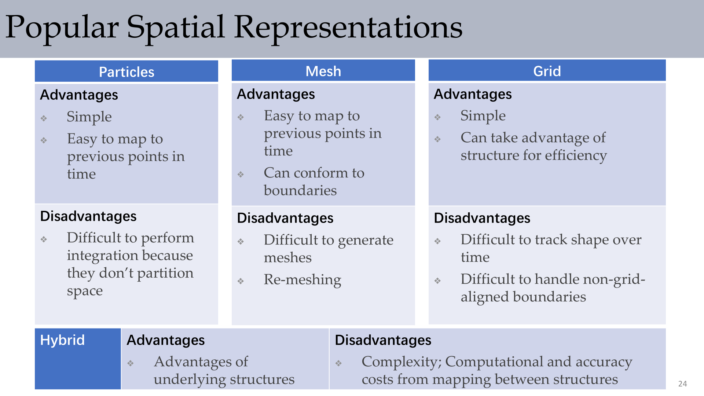
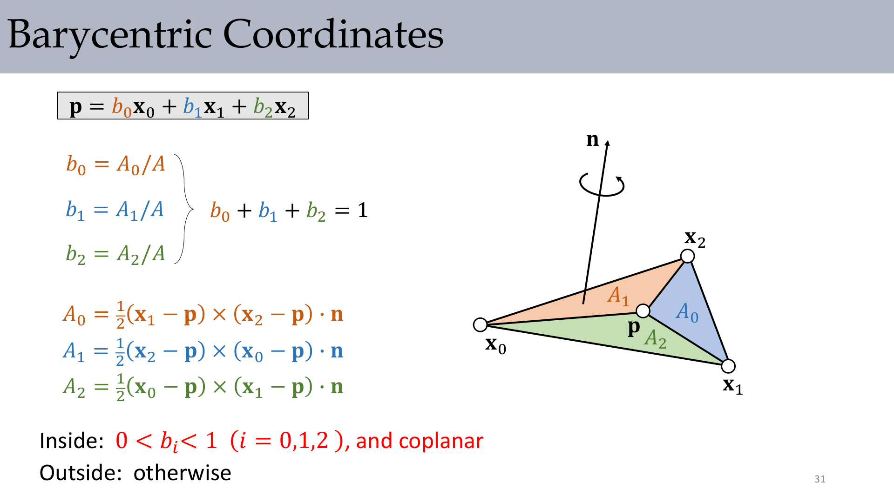
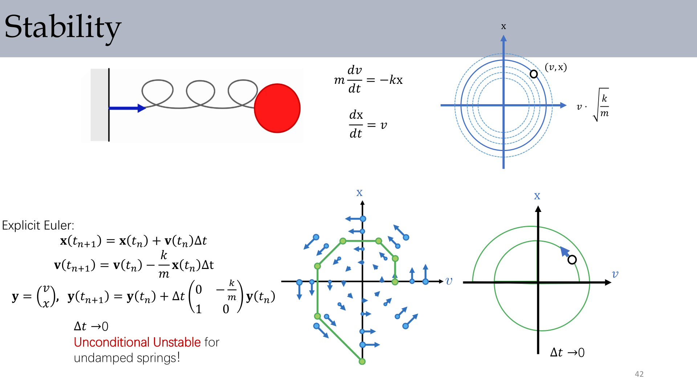
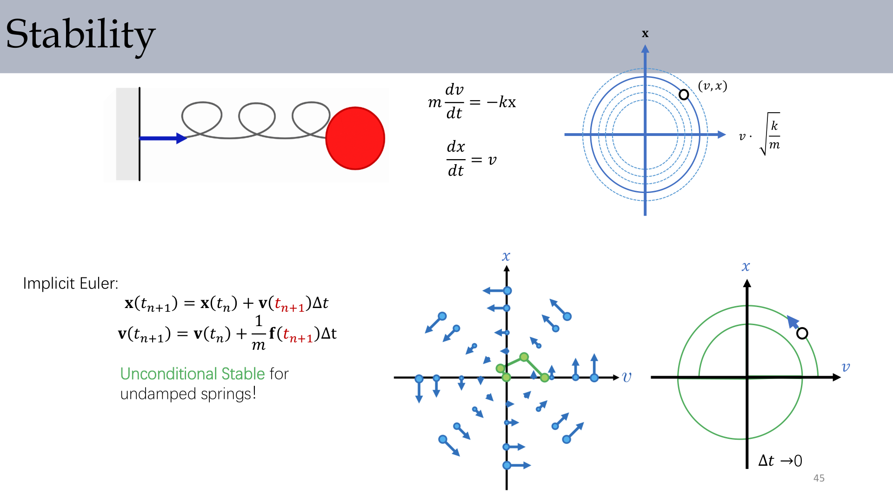
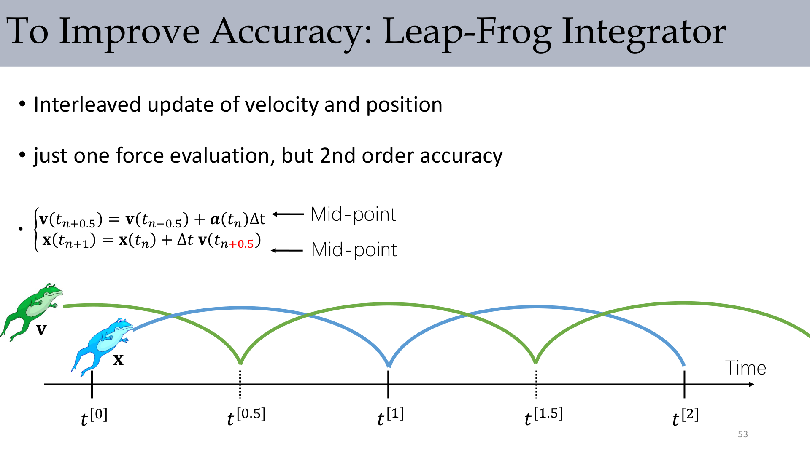

# Lec1 Rendering Pipeline and Time Integration Basics

## 1. Why This Lecture Matters

Computer graphics is not only about drawing. In practice, we build a full loop:

1. Model the world.
2. Simulate how state evolves.
3. Render the updated state.

A robust simulator is built from three coupled blocks:

1. Spatial discretization: choose how to represent the world state.
2. Temporal discretization: choose how to advance state in time.
3. Numerical solver: solve the equations generated by the first two choices.

:::remark Key Question: Why do we need numerical simulation if physics laws are known?
Because many real systems contain infinitely many degrees of freedom (continuous materials, fields, constraints). The governing laws are known, but exact analytic solutions are usually intractable. Numerical simulation turns these laws into computable update rules.
:::

## 2. Physics Model to Computable State

The particle-level starting point is Newton's law:

$$
\mathbf{F} = m\mathbf{a}
$$

For one particle, this looks simple, but simulation systems contain many particles or fields. We therefore store a state and update it repeatedly.

Typical state variables:

- Position $\mathbf{x}$
- Velocity $\mathbf{v}$
- Force $\mathbf{f}$
- Mass $m$

For many particles, stacked vectors and mass matrix notation are convenient:

$$
\frac{d\mathbf{v}}{dt}=\mathbf{M}^{-1}\mathbf{f}
$$

## 3. Spatial Discretization: Representation Choices

### 3.1 Main Representations

Common choices in simulation:

- Mesh (triangle/tetrahedra)
- Particle system / particle cloud
- Volumetric grid
- Hybrid combinations

Each has strengths and weaknesses:

- Grid: structured and efficient, but boundary handling and shape tracking are harder.
- Mesh: boundary-conforming and history-friendly, but meshing/remeshing is costly.
- Particles: simple and history-friendly, but integration and neighborhood treatment are harder.

:::tip Key Question: Should we pick one representation for everything?
Usually no. Hybrid schemes are common because graphics/simulation tasks often need complementary advantages from multiple structures.
:::

### 3.2 Lagrangian vs Eulerian Viewpoints

The lecture emphasizes two fundamental viewpoints:

- **Lagrangian viewpoint**: track material points; often leads to ODE-style evolution.
- **Eulerian viewpoint**: track values on fixed spatial locations; often leads to PDE-style evolution.

### 3.3 ODE and PDE Problem Types

General ODE form:

$$
\mathbf{x}^{(n)} = f\big(t,\mathbf{x},\dot{\mathbf{x}},\ddot{\mathbf{x}},\ldots,\mathbf{x}^{(n-1)}\big)
$$

Diffusion PDE example:

$$
\frac{\partial u}{\partial t} = \sum_{i=1}^{n}\frac{\partial^2u}{\partial x_i^2} = \nabla\cdot\nabla u = \Delta u
$$

Interpretation:

- ODE settings mostly require initial conditions.
- PDE settings require initial conditions and boundary conditions.

:::remark Key Question: Why are boundary conditions emphasized for PDEs?
Because PDE variables live over a spatial domain. Without boundary conditions, the evolution is underdetermined at domain boundaries, and the numeric result is not physically well-posed.
:::

## 4. Geometry and Calculus Essentials

### 4.1 Interpolation and Barycentric Coordinates

Interpolation appears everywhere: sampling grids, mapping attributes on meshes, and transferring values across representations.

Barycentric coordinates on triangles:

$$
\mathbf{p}=b_0\mathbf{x}_0+b_1\mathbf{x}_1+b_2\mathbf{x}_2,
\quad
b_i=\frac{A_i}{A},
\quad
b_0+b_1+b_2=1
$$

Inside test (triangle case):

$$
0<b_i<1\ (i=0,1,2),\ \text{with coplanarity}
$$

### 4.2 Differential Operators You Will Reuse

For scalar and vector fields:

$$
\nabla f = \left(\frac{\partial f}{\partial x},\frac{\partial f}{\partial y},\frac{\partial f}{\partial z}\right)
$$

$$
\nabla\cdot\mathbf{f} = \frac{\partial f}{\partial x}+\frac{\partial g}{\partial y}+\frac{\partial h}{\partial z}
$$

$$
\nabla\times\mathbf{f} = \left(\frac{\partial h}{\partial y}-\frac{\partial g}{\partial z},\frac{\partial f}{\partial z}-\frac{\partial h}{\partial x},\frac{\partial g}{\partial x}-\frac{\partial f}{\partial y}\right)
$$

Second-order quantities:

$$
\mathbf{H}=\mathbf{J}(\nabla f),
\quad
\Delta f=\nabla\cdot\nabla f = \operatorname{trace}(\mathbf{H})
$$

## 5. Time Integration: Stability and Accuracy

### 5.1 Continuous-to-Discrete Transition

Core integral relations:

$$
\mathbf{x}(t_n)-\mathbf{x}(t_{n-1}) = \int_{t_{n-1}}^{t_n}\mathbf{v}(t)\,dt
$$

$$
\mathbf{v}(t_n)-\mathbf{v}(t_{n-1}) = \frac{1}{m}\int_{t_{n-1}}^{t_n}\mathbf{f}(\mathbf{x}_p,t)\,dt
$$

Numerical integrators approximate these integrals.

### 5.2 Explicit Euler

$$
\mathbf{x}_{n+1}=\mathbf{x}_n+\mathbf{v}_n\Delta t,
\quad
\mathbf{v}_{n+1}=\mathbf{v}_n+\frac{1}{m}\mathbf{f}_n\Delta t
$$

For the undamped spring model

$$
m\frac{dv}{dt}=-kx,
\quad
\frac{dx}{dt}=v
$$

the lecture highlights the key fact: explicit Euler is conditionally fragile and can explode for oscillatory systems.

### 5.3 Implicit Euler

$$
\mathbf{x}_{n+1}=\mathbf{x}_n+\mathbf{v}_{n+1}\Delta t,
\quad
\mathbf{v}_{n+1}=\mathbf{v}_n+\frac{1}{m}\mathbf{f}_{n+1}\Delta t
$$

For linear spring force, this leads to an implicit equation:

$$
\mathbf{x}_{n+1}=\mathbf{x}_n+\mathbf{v}_n\Delta t-\frac{k}{m}\mathbf{x}_{n+1}\Delta t^2
$$

So each step needs solving a numerical equation/system, but stability is much better.

:::remark Key Question: Why does implicit Euler improve stability?
Because the force is evaluated at the unknown next state, which introduces numerical damping and suppresses high-frequency amplification that explicit Euler tends to suffer on stiff systems.
:::

### 5.4 Symplectic Euler, Midpoint, RK, Leap-Frog

Symplectic Euler:

$$
\mathbf{v}_{n+1}=\mathbf{v}_n+\frac{1}{m}\mathbf{f}_n\Delta t,
\quad
\mathbf{x}_{n+1}=\mathbf{x}_n+\mathbf{v}_{n+1}\Delta t
$$

Midpoint method:

$$
\mathbf{x}_{n+1}=\mathbf{x}_n+\mathbf{v}_{n+1/2}\Delta t,
\quad
\mathbf{v}_{n+1}=\mathbf{v}_n+\frac{1}{m}\mathbf{f}_{n+1/2}\Delta t
$$

RK4 compact form:

$$
\mathbf{s}_{n+1}=\mathbf{s}_n+\frac{\Delta t}{6}(k_1+2k_2+2k_3+k_4)
$$

Leap-frog (staggered velocity):

$$
\mathbf{v}_{n+1/2}=\mathbf{v}_{n-1/2}+\mathbf{a}_n\Delta t,
\quad
\mathbf{x}_{n+1}=\mathbf{x}_n+\mathbf{v}_{n+1/2}\Delta t
$$

## 6. How to Evaluate an Integrator

The lecture repeatedly asks: how do we evaluate time integration quality?

Three axes:

1. Stability: whether errors/energy blow up over long steps.
2. Convergence (consistency): whether error goes to zero as $h\to0$.
3. Accuracy order: local truncation error behavior, e.g., $\mathcal{O}(h^{n+1})$ for $n$-th order methods.

Examples discussed:

- Explicit Euler local truncation error: $\mathcal{O}(\Delta t^2)$ (first-order method).
- Midpoint local truncation error: $\mathcal{O}(\Delta t^3)$ (second-order method).

:::tip Key Question: Is many sub-steps of Euler equivalent to a higher-order method?
No. Smaller Euler steps can help, but a true higher-order scheme generally gives better error-speed tradeoff than naive sub-stepping at comparable cost.
:::

## 7. Numerical Solvers in the Pipeline

Once discretization yields equations, we need solvers.

Linear-system examples:

- Jacobi / Gauss-Seidel
- Conjugate Gradient (and preconditioned variants)
- Multigrid

Nonlinear examples:

- Newton method
- Quasi-Newton / BFGS

Constrained optimization examples:

- Penalty methods
- Projection corrections
- Lagrange multipliers / primal-dual / ADMM-style approaches

There is no universally best solver; choice depends on structure, conditioning, and accuracy target.

## 8. Formula Sheet (Lecture-Aligned)

- $\mathbf{F}=m\mathbf{a}$
- $\mathbf{x}^{(n)} = f(t,\mathbf{x},\dot{\mathbf{x}},\ldots)$
- $\dfrac{\partial u}{\partial t}=\Delta u$
- $\nabla f$, $\nabla\cdot\mathbf{f}$, $\nabla\times\mathbf{f}$
- $\Delta f = \nabla\cdot\nabla f = \operatorname{trace}(\mathbf{H})$
- $\mathbf{p}=\sum_i b_i\mathbf{x}_i$, $b_i=A_i/A$
- Explicit / implicit / symplectic Euler updates
- Midpoint / RK4 / leap-frog updates
- Truncation-error orders: $\mathcal{O}(\Delta t^2)$, $\mathcal{O}(\Delta t^3)$

## 9. Exam Review

### 9.1 High-Value Definitions

- **Spatial discretization**: finite representation of continuous geometry/fields.
- **Temporal discretization**: converting continuous time evolution to update steps.
- **Stability**: bounded error/energy growth behavior over iterations.
- **Consistency and convergence**: discrete scheme approaches continuous model as step size shrinks.

### 9.2 Mechanism Checklist

1. Pick representation (particle/mesh/grid/hybrid).
2. Write governing equations (ODE/PDE + IC/BC + constraints).
3. Choose time integrator (explicit, implicit, symplectic, RK).
4. Select solver and stopping criteria.
5. Validate by stability, convergence, and practical runtime.

### 9.3 Short-Answer Templates

- Why implicit for stiff systems?
Because implicit updates evaluate future-state forces, improving stability under large stiffness.

- Why is Eulerian often used in fluids?
Because grid-based fixed-space representation naturally supports field evolution and differential operators.

- Why can explicit Euler fail on oscillators?
Because phase and energy errors accumulate and can amplify over steps.

### 9.4 Common Pitfalls

- Confusing geometric vectors with stacked state vectors.
- Ignoring boundary conditions in PDE problems.
- Reporting only visual plausibility without numerical diagnostics.

### 9.5 Self-Check Before Submission

1. Did I state the chosen viewpoint and representation clearly?
2. Did I provide IC/BC and constraints?
3. Did I justify integrator choice by stability and accuracy?
4. Did I identify the required linear/nonlinear solver?
5. Did I provide at least one quantitative error/stability argument?
