# Lec10 Cloth Simulation: Bending Models, Locking, PBD, and Strain Limiting

## 1. Big Picture

This lecture focuses on one core challenge in cloth simulation:

- Cloth should bend easily.
- Cloth should resist stretch strongly.
- Numerical simulation should still stay stable and efficient.

A practical path in this lecture is:

1. Build internal forces (tension/shearing/bending).
2. Analyze why naïve spring setups cause bending weakness and locking.
3. Introduce projection-based simulation (PBD).
4. Extend to strain limiting and area limiting for robust large-deformation behavior.

## 2. Cloth Forces and Why Bending Needs Special Treatment

The motion equation is

$$
\frac{d\mathbf{v}}{dt}=\mathbf{M}^{-1}\mathbf{f}(\mathbf{x},\mathbf{v})
$$

where $\mathbf{f}(\mathbf{x},\mathbf{v})$ contains:

- internal forces: tension, shearing, bending
- external forces: contact, friction, collision, gravity, wind

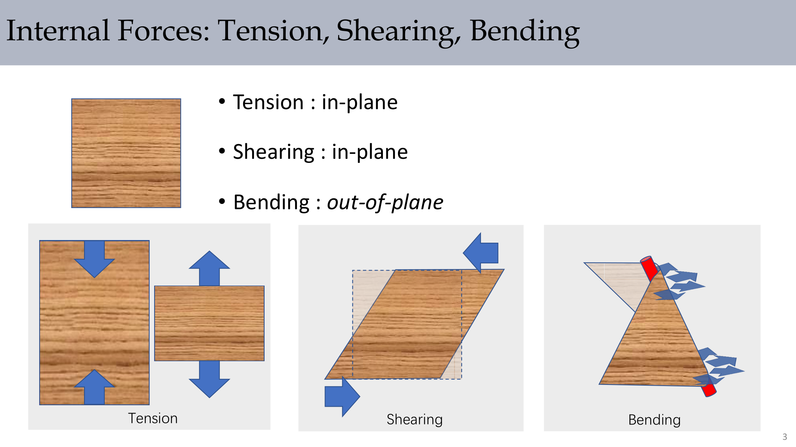

For spring networks, edge springs can cover stretch/shear, but bending quality depends on geometric modeling details.

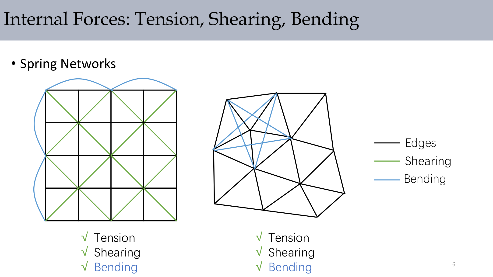

### 2.1 The classic bending-spring issue

A bending spring based only on edge length change provides little resistance when cloth is nearly planar, because length barely changes in that state.

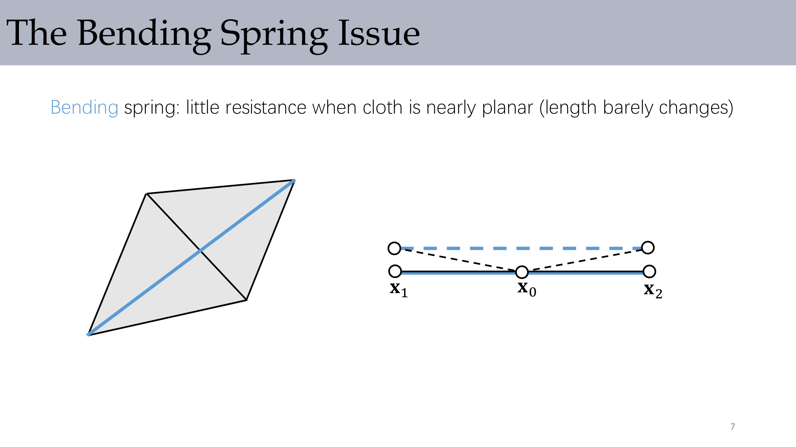

:::remark Key Question (original intent): Why is simple distance-based bending weak near flat states?
Near-planar folds can rotate significantly while keeping spring lengths almost unchanged. If the model only reacts to length, bending stiffness collapses exactly where visual folding behavior is important.
:::

## 3. Dihedral Angle Bending Model

The lecture introduces a dihedral-angle force model:

- **"Bending forces as a function of $\theta$: $\mathbf{f}_i=f(\theta)\mathbf{u}_i$."**

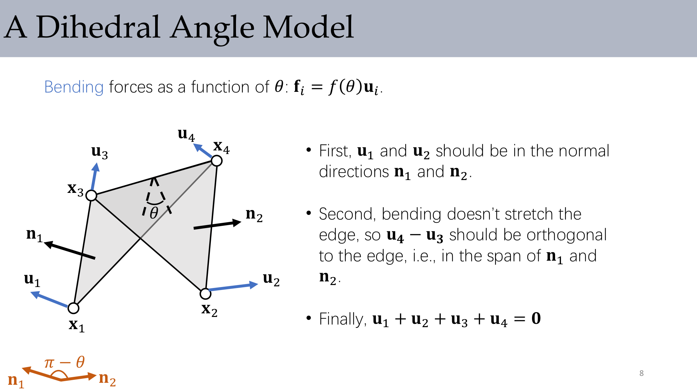

Define

$$
\mathbf{E}=\mathbf{x}_4-\mathbf{x}_3,
\quad
\mathbf{N}_1=(\mathbf{x}_1-\mathbf{x}_3)\times(\mathbf{x}_1-\mathbf{x}_4),
\quad
\mathbf{N}_2=(\mathbf{x}_2-\mathbf{x}_4)\times(\mathbf{x}_2-\mathbf{x}_3)
$$

and directions

$$
\mathbf{u}_1=\lVert\mathbf{E}\rVert\frac{\mathbf{N}_1}{\lVert\mathbf{N}_1\rVert^2},
\qquad
\mathbf{u}_2=\lVert\mathbf{E}\rVert\frac{\mathbf{N}_2}{\lVert\mathbf{N}_2\rVert^2}
$$

$$
\mathbf{u}_3=\frac{(\mathbf{x}_1-\mathbf{x}_4)\cdot\mathbf{E}}{\lVert\mathbf{E}\rVert}\frac{\mathbf{N}_1}{\lVert\mathbf{N}_1\rVert^2}
+\frac{(\mathbf{x}_2-\mathbf{x}_4)\cdot\mathbf{E}}{\lVert\mathbf{E}\rVert}\frac{\mathbf{N}_2}{\lVert\mathbf{N}_2\rVert^2}
$$

$$
\mathbf{u}_4=-\frac{(\mathbf{x}_1-\mathbf{x}_3)\cdot\mathbf{E}}{\lVert\mathbf{E}\rVert}\frac{\mathbf{N}_1}{\lVert\mathbf{N}_1\rVert^2}
-\frac{(\mathbf{x}_2-\mathbf{x}_3)\cdot\mathbf{E}}{\lVert\mathbf{E}\rVert}\frac{\mathbf{N}_2}{\lVert\mathbf{N}_2\rVert^2}
$$

with momentum-consistent sum:

$$
\mathbf{u}_1+\mathbf{u}_2+\mathbf{u}_3+\mathbf{u}_4=\mathbf{0}
$$

Planar-style form:

$$
\mathbf{f}_i=k\frac{\lVert\mathbf{E}\rVert^2}{\lVert\mathbf{N}_1\rVert+\lVert\mathbf{N}_2\rVert}\sin\frac{\pi-\theta}{2}\,\mathbf{u}_i
$$

Rest-angle-aware form:

$$
\mathbf{f}_i=k\frac{\lVert\mathbf{E}\rVert^2}{\lVert\mathbf{N}_1\rVert+\lVert\mathbf{N}_2\rVert}
\left(\sin\frac{\pi-\theta}{2}-\sin\frac{\pi-\theta_0}{2}\right)\mathbf{u}_i
$$

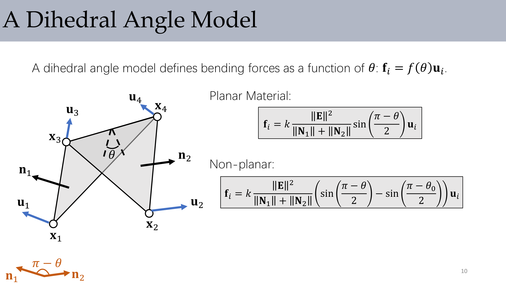

### 3.1 Distance vs angle constraints for bending

- Distance constraint:
  - simple
  - cheap
  - weak in flat state
- Angle constraint:
  - stronger in flat state
  - more expensive

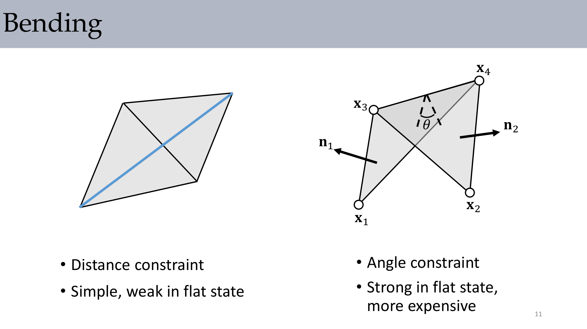

## 4. Stretching and the Locking Issue

A key question from the lecture is:

- **"Issue: Can a simulator fold cloth freely?"**

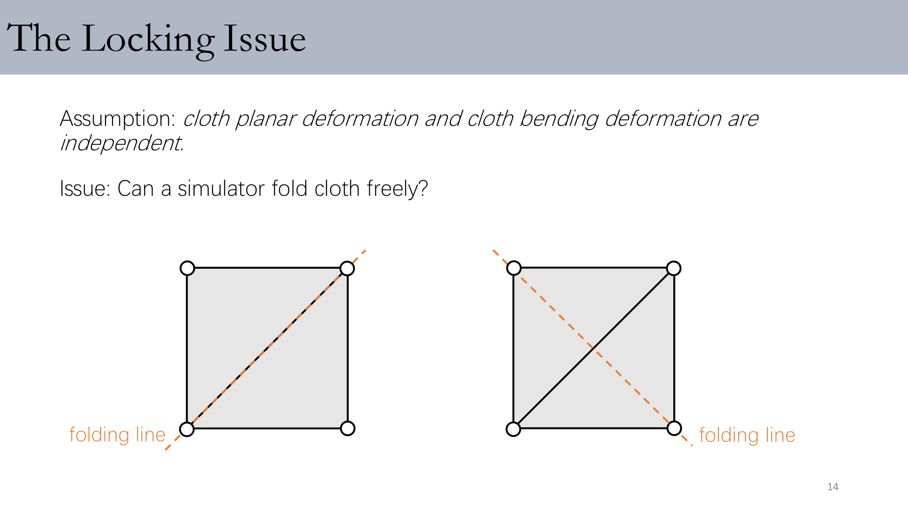

DoF counting intuition (edge constraints dominate):

$$
\mathrm{DoF}=3N_{\mathrm{vertices}}-N_{\mathrm{edges}}
$$

For manifold-like triangulations (lecture approximation):

$$
N_{\mathrm{edges}}\approx 3N_{\mathrm{vertices}}-3N_{\mathrm{boundaryEdges}}
$$

So effective remaining freedom is roughly:

$$
\mathrm{System\ DoFs}\approx 3N_{\mathrm{boundaryEdges}}
$$

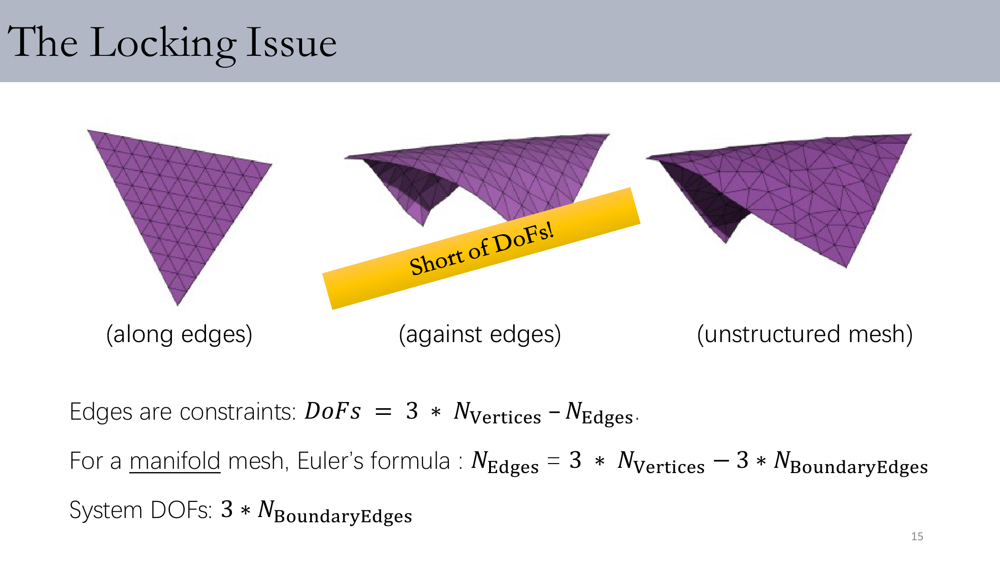

Practical tradeoff:

- very stiff edge springs: locking, instability, tiny timestep
- soft edge springs: rubbery stretching and coarse wrinkles

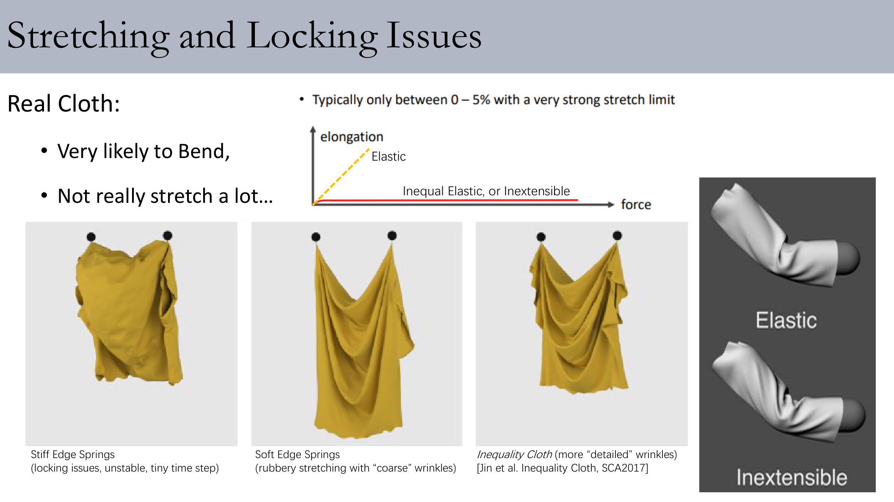

:::remark Key Question (original intent): Why do stiff edge springs easily cause locking?
If too many edge lengths are treated as hard constraints, in-plane deformation space shrinks excessively. Cloth then cannot realize natural fold modes and appears numerically over-constrained.
:::

## 5. Position Based Dynamics (PBD)

The lecture’s central PBD idea:

- **"Position based dynamics (PBD) is based on the projection function."**

A single spring becomes a hard positional constraint:

$$
\phi(\mathbf{x})=\lVert\mathbf{x}_i-\mathbf{x}_j\rVert-L=0
$$

and projection solves

$$
\{\mathbf{x}_i^{new},\mathbf{x}_j^{new}\}=\arg\min\frac{1}{2}\left(m_i\lVert\mathbf{x}_i^{new}-\mathbf{x}_i\rVert^2+m_j\lVert\mathbf{x}_j^{new}-\mathbf{x}_j\rVert^2\right)
\quad
\text{s.t. }\phi(\mathbf{x})=0
$$

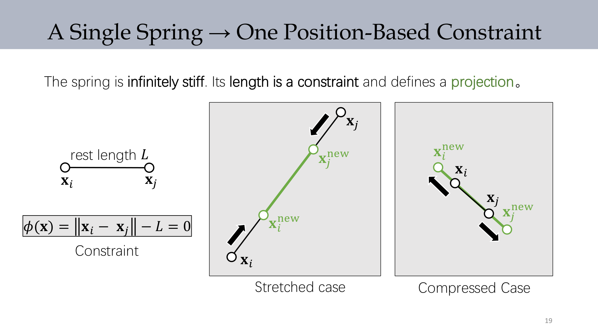

Closed-form two-point projection:

$$
\mathbf{x}_i^{new}\leftarrow \mathbf{x}_i-\frac{m_j}{m_i+m_j}(\lVert\mathbf{x}_i-\mathbf{x}_j\rVert-L)\frac{\mathbf{x}_i-\mathbf{x}_j}{\lVert\mathbf{x}_i-\mathbf{x}_j\rVert}
$$

$$
\mathbf{x}_j^{new}\leftarrow \mathbf{x}_j+\frac{m_i}{m_i+m_j}(\lVert\mathbf{x}_i-\mathbf{x}_j\rVert-L)\frac{\mathbf{x}_i-\mathbf{x}_j}{\lVert\mathbf{x}_i-\mathbf{x}_j\rVert}
$$

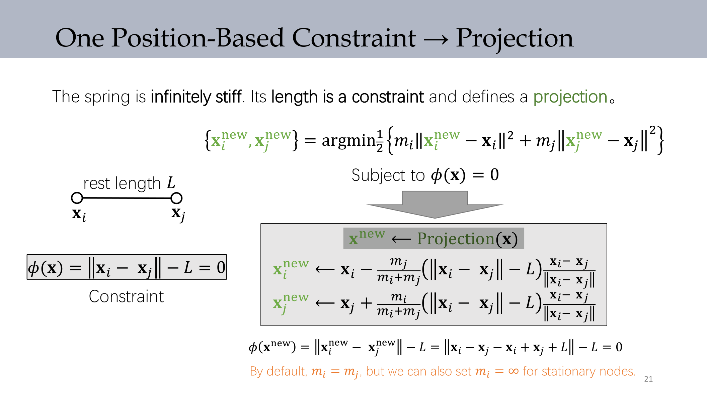

### 5.1 Multi-constraint projection (Jacobi style)

For all edges and iterations:

$$
\mathbf{x}_i^{new}\mathrel{+}=\mathbf{x}_i-\frac{1}{2}(\lVert\mathbf{x}_i-\mathbf{x}_j\rVert-L_e)\frac{\mathbf{x}_i-\mathbf{x}_j}{\lVert\mathbf{x}_i-\mathbf{x}_j\rVert}
$$

$$
\mathbf{x}_j^{new}\mathrel{+}=\mathbf{x}_j+\frac{1}{2}(\lVert\mathbf{x}_i-\mathbf{x}_j\rVert-L_e)\frac{\mathbf{x}_i-\mathbf{x}_j}{\lVert\mathbf{x}_i-\mathbf{x}_j\rVert}
$$

Then average and blend:

$$
\mathbf{x}_i^{new}\leftarrow\frac{\mathbf{x}_i^{new}}{n_i},
\qquad
\mathbf{x}_i\leftarrow\frac{\mathbf{x}_i^{new}+\alpha\mathbf{x}_i}{1+\alpha}
$$

Velocity update after projection is crucial:

$$
\mathbf{v}\leftarrow\mathbf{v}+\frac{\mathbf{x}^{new}-\mathbf{x}}{\Delta t},
\qquad
\mathbf{x}\leftarrow\mathbf{x}^{new}
$$

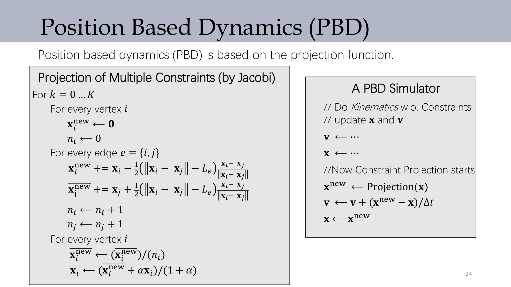

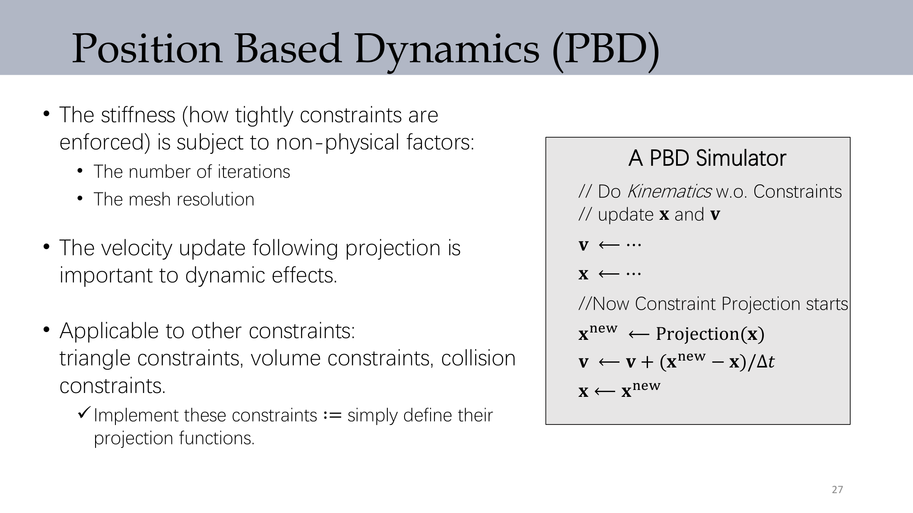

### 5.2 PBD strengths and limits

Pros:

- parallel-friendly (GPU implementations)
- easy to implement
- efficient at low resolution
- generic projection framework (can be extended to other constraints/couplings)

Cons:

- not physically exact
- can be expensive at high resolution
- hierarchical/accelerated variants may introduce oscillation or tuning complexity

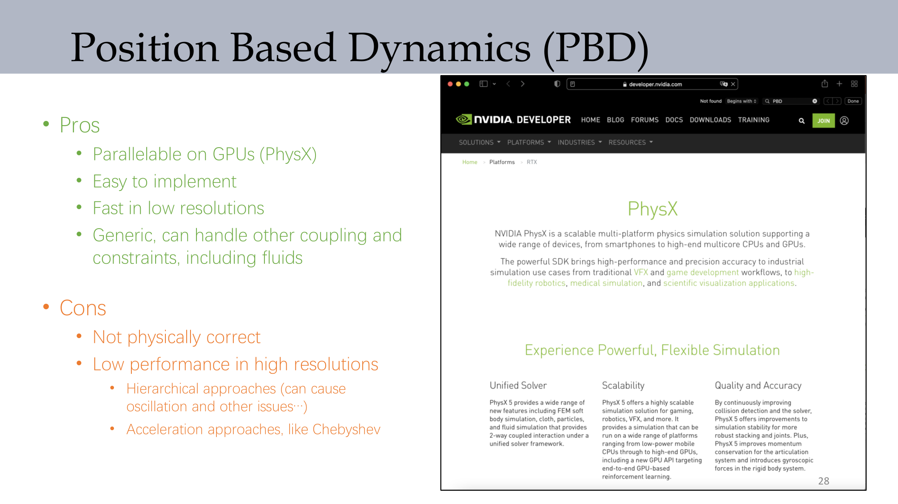

Resources in lecture include Position Based Fluids and XPBD direction.

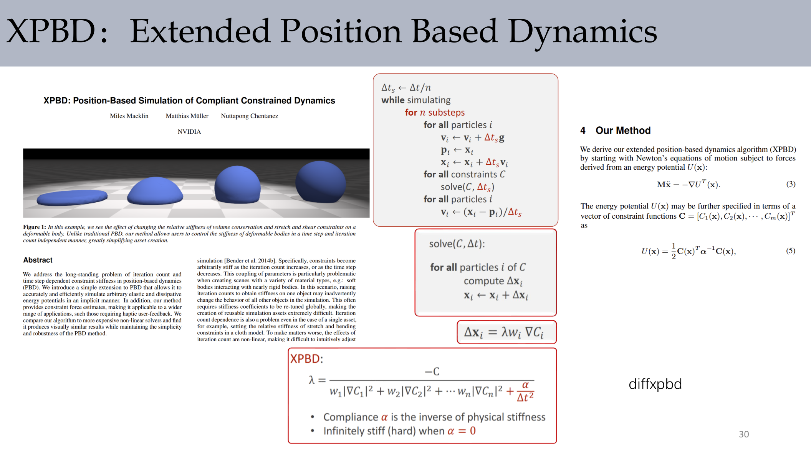

## 6. Strain Limiting: Corrective Projection After Dynamics

Strain limiting uses projection mainly as a correction phase:

1. Do a soft/relaxed dynamic step.
2. Project positions to satisfy strain bounds.
3. Reconstruct velocity from corrected displacement.

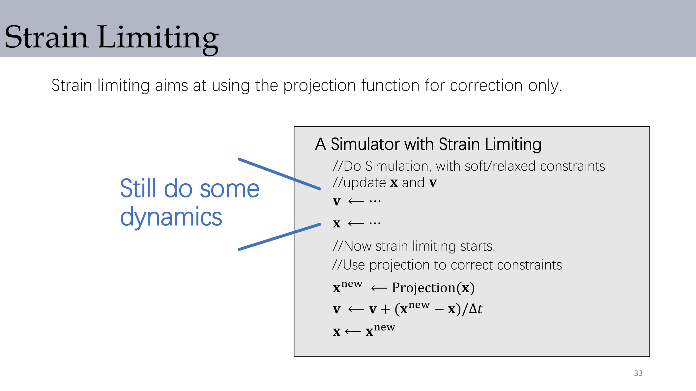

### 6.1 Spring strain limit

Constraint:

$$
\sigma_{min}\le\frac{1}{L}\lVert\mathbf{x}_i-\mathbf{x}_j\rVert\le\sigma_{max}
$$

Procedure:

$$
\sigma\leftarrow\frac{1}{L}\lVert\mathbf{x}_i-\mathbf{x}_j\rVert,
\qquad
\sigma_0\leftarrow\min(\max(\sigma,\sigma_{min}),\sigma_{max})
$$

$$
\mathbf{x}_i^{new}\leftarrow \mathbf{x}_i-\frac{m_j}{m_i+m_j}(\lVert\mathbf{x}_i-\mathbf{x}_j\rVert-\sigma_0L)\frac{\mathbf{x}_i-\mathbf{x}_j}{\lVert\mathbf{x}_i-\mathbf{x}_j\rVert}
$$

$$
\mathbf{x}_j^{new}\leftarrow \mathbf{x}_j+\frac{m_i}{m_i+m_j}(\lVert\mathbf{x}_i-\mathbf{x}_j\rVert-\sigma_0L)\frac{\mathbf{x}_i-\mathbf{x}_j}{\lVert\mathbf{x}_i-\mathbf{x}_j\rVert}
$$

Special cases:

- PBD-like hard length: $\sigma_0\equiv1$
- no limit: very wide bounds

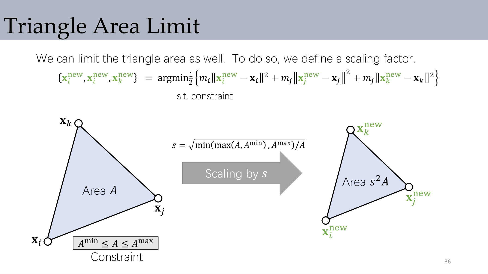

### 6.2 Triangle area limit

Area constraint:

$$
A_{min}\le A\le A_{max}
$$

Compute area and scale:

$$
A\leftarrow\frac{1}{2}\lVert(\mathbf{x}_j-\mathbf{x}_i)\times(\mathbf{x}_k-\mathbf{x}_i)\rVert,
\qquad
s\leftarrow\sqrt{\frac{\min(\max(A,A_{min}),A_{max})}{A}}
$$

Use mass center preserving projection:

$$
\mathbf{c}\leftarrow\frac{m_i\mathbf{x}_i+m_j\mathbf{x}_j+m_k\mathbf{x}_k}{m_i+m_j+m_k}
$$

$$
\mathbf{x}_i^{new}\leftarrow\mathbf{c}+s(\mathbf{x}_i-\mathbf{c}),
\quad
\mathbf{x}_j^{new}\leftarrow\mathbf{c}+s(\mathbf{x}_j-\mathbf{c}),
\quad
\mathbf{x}_k^{new}\leftarrow\mathbf{c}+s(\mathbf{x}_k-\mathbf{c})
$$

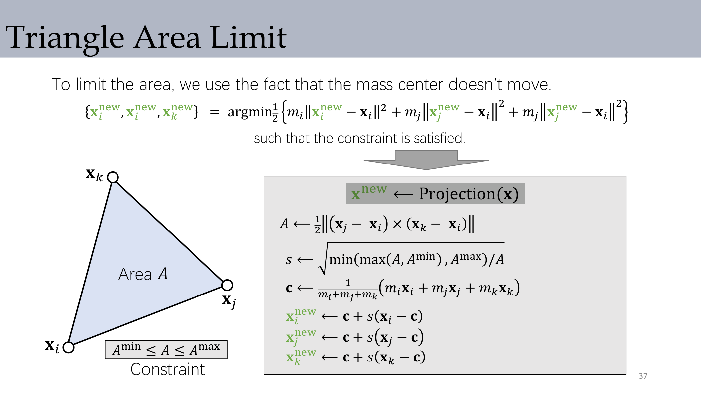

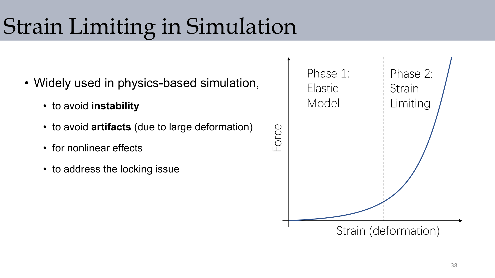

### 6.3 Why strain limiting works in production

It is widely used to:

- reduce instability
- suppress large-deformation artifacts
- introduce nonlinear behavior controls
- mitigate locking

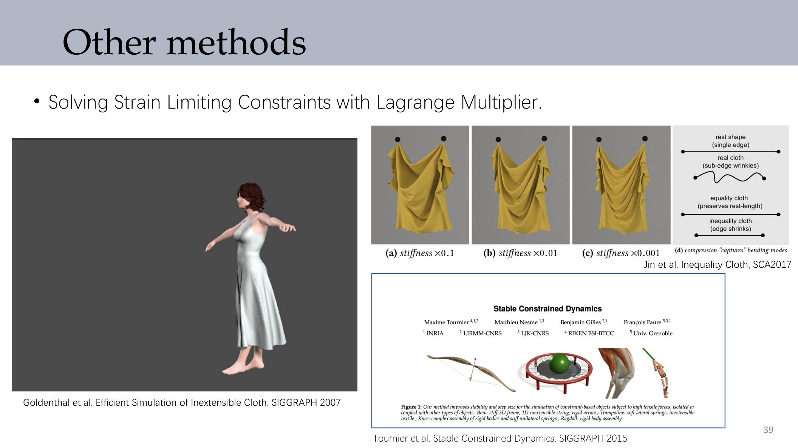

## 7. Other Methods Mentioned

The lecture also points to constraint-solving methods based on Lagrange multipliers and inextensibility-oriented cloth solvers.

## 8. Exam Review

### A. Definitions You Should State Precisely

- **Dihedral angle bending model**: bending force expressed as a function of fold angle $\theta$.
- **Locking**: over-constrained behavior that prevents natural folding modes.
- **PBD projection**: enforce constraints by directly projecting positions.
- **Strain limiting**: use projection as post-dynamics correction to keep deformation within bounds.
- **Area limiting**: constrain triangle area via scale correction around center of mass.

### B. Mechanism Chain (Short-Answer Template)

1. Cloth forces include tension, shearing, and bending.
2. Distance-only bending is weak near flat configurations.
3. Dihedral-angle bending adds a stronger geometric response.
4. Overly stiff edge constraints create locking.
5. PBD enforces constraints through iterative projection.
6. Strain limiting applies controlled corrections after a relaxed dynamic step.

### C. Common Pitfalls

- Treating all edge constraints as infinitely stiff in one shot.
- Forgetting that PBD stiffness depends on iteration count and resolution.
- Ignoring velocity reconstruction after projection.
- Using strain limits without physically meaningful bounds.
- Applying area scaling without center-of-mass consistency.

### D. Self-Check Questions

- Can you explain why distance-based bending underestimates resistance near flat states?
- Can you derive the two-point projection update for $\phi(\mathbf{x})=\lVert\mathbf{x}_i-\mathbf{x}_j\rVert-L=0$?
- Can you explain where locking comes from using DoF counting?
- Can you explain why PBD is robust but not strictly physically correct?
- Can you write the spring strain limiting and triangle area limiting projection steps?

:::remark Self-check Reference Answers
1. Near flat states, fold angle changes can be large while edge lengths change little, so a pure distance model sees weak error and produces weak restoring force.

2. Minimize weighted displacement under the length constraint using $m_i,m_j$ as weights; this yields opposite corrections along $(\mathbf{x}_i-\mathbf{x}_j)$ scaled by mass ratios.

3. If many edges become hard constraints, in-plane DoFs are heavily reduced, and the remaining shape space may not contain the natural fold mode.

4. PBD performs geometric projection, not full force-consistent integration. It gains robustness and speed, but stiffness behavior depends on numerical settings such as iteration count.

5. For spring strain limiting, clamp stretch ratio $\sigma$ into $[\sigma_{min},\sigma_{max}]$ then project endpoints. For triangle area limiting, clamp area, compute $s$, keep center of mass fixed, and scale each vertex about that center.
:::
