# Lec11 Projective Dynamics and MPM

## 1. Big Picture
This lecture connects two major simulation lines:

- Projective Dynamics (PD): a local-global optimization method for stiff constraint systems.
- Material Point Method (MPM): a hybrid particle-grid framework that extends APIC ideas to continuum solids, fluids, plasticity, and fracture.

You should leave with one unified view:

1. Why Newton-style direct optimization is hard for non-convex deformation energies.
2. How PD replaces hard non-convexity with alternating projection + global quadratic solve.
3. How APIC transfer formulas become MLS-MPM when deformation gradient and constitutive stress are injected.

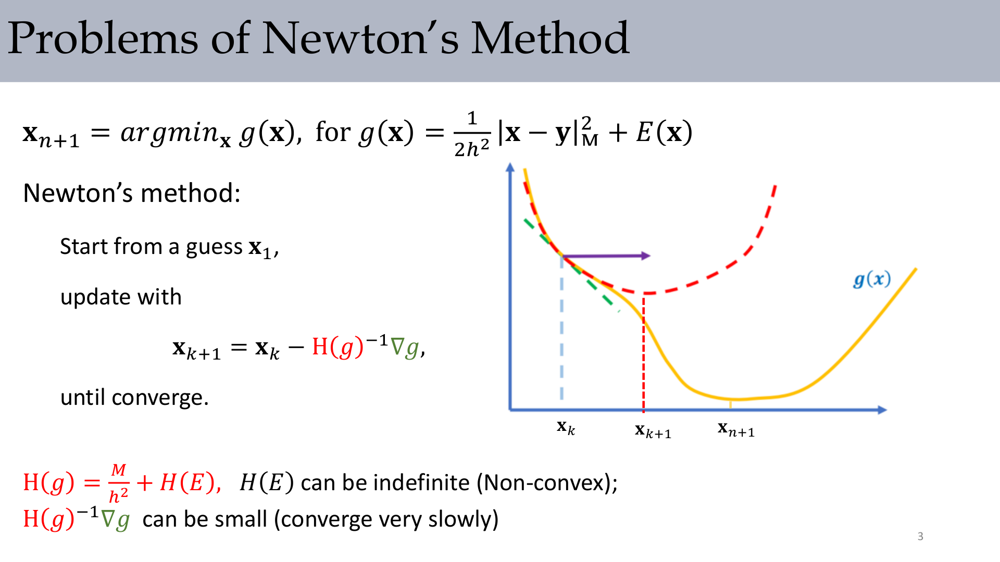

## 2. Why Projective Dynamics Exists
We start from implicit Euler in optimization form:

$$
\mathbf{x}_{n+1}=\arg\min_{\mathbf{x}}\,g(\mathbf{x}),
\qquad
g(\mathbf{x})=\frac{1}{2h^2}\lVert\mathbf{x}-\mathbf{y}\rVert_{\mathbf{M}}^2+E(\mathbf{x}).
$$

Here, the inertial term is local and quadratic, while the deformation energy is typically global and non-convex.

- Newton's method uses $\mathbf{x}_{k+1}=\mathbf{x}_k-\mathbf{H}(g)^{-1}\nabla g$.
- But $\mathbf{H}(g)=\frac{\mathbf{M}}{h^2}+\mathbf{H}(E)$ can be difficult when $E$ is non-convex.
- In practice this means instability risk and expensive repeated linear solves.

### 2.1 Local-Global Split
**Key idea (slide wording): Projective dynamics combines local projections and a global quadratic energy to approximate the global and non-convex energy.**

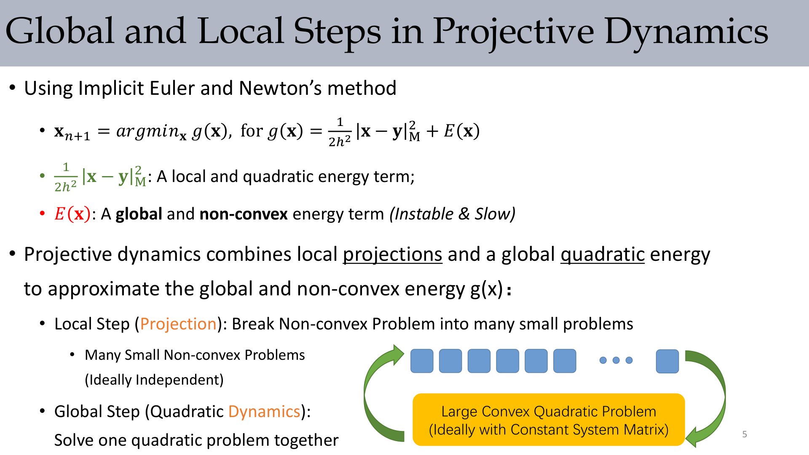

For spring-like constraints:

$$
E(\mathbf{x})=\sum_{e=\{i,j\}}\frac{1}{2}k_e\left(\lVert\mathbf{x}_i-\mathbf{x}_j\rVert-l_{0,e}\right)^2
$$

PD introduces projected local targets and solves a quadratic global objective:

$$
E(\mathbf{x})\approx\sum_{e=\{i,j\}}\frac{1}{2}k_e\left\lVert(\mathbf{x}_i-\mathbf{x}_j)-\bigl(\mathbf{x}^{new}_{e,i}-\mathbf{x}^{new}_{e,j}\bigr)\right\rVert^2.
$$

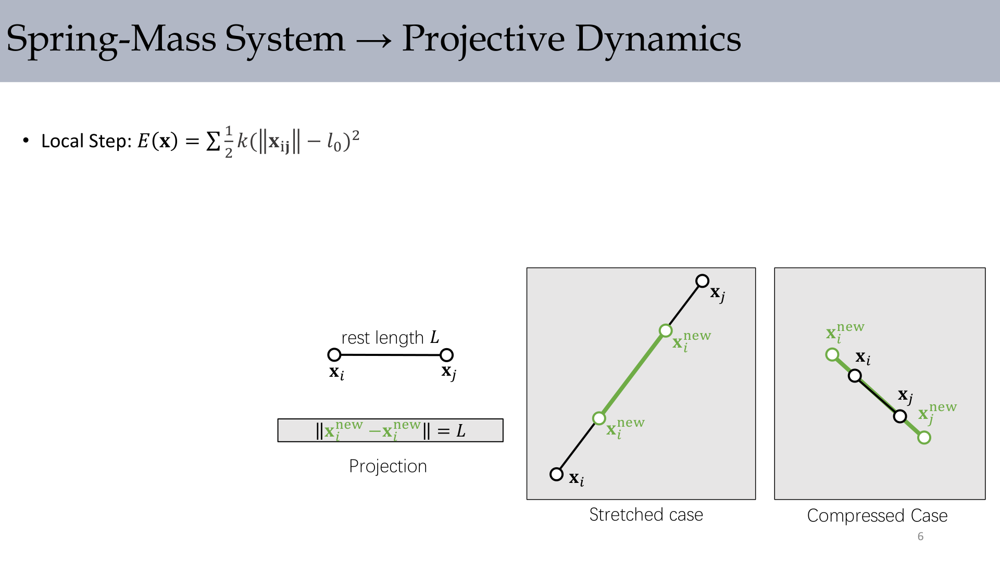

:::remark Key Question (original intent): Why does projection help compared with directly minimizing non-convex spring energies?
Projection converts each difficult local non-convex subproblem into a geometric target update, then the global step becomes a large convex quadratic solve. This removes most bad curvature from the solve stage.
:::

### 2.2 Global Step and Constant Matrix Trick
From the projected energy, the force and approximate Hessian become:

$$
\mathbf{f}_i=-\nabla_iE(\mathbf{x})=-\sum_{e:i\in e}\left[(\mathbf{x}_i-\mathbf{x}_j)-\bigl(\mathbf{x}^{new}_{e,i}-\mathbf{x}^{new}_{e,j}\bigr)\right],
$$

$$
\mathbf{H}=\sum_{e=\{i,j\}}
\begin{bmatrix}
\mathbf{I}_{ii} & -\mathbf{I}_{ij}\\
-\mathbf{I}_{ji} & \mathbf{I}_{jj}
\end{bmatrix}.
$$

Global update:

$$
\left(\frac{1}{h^2}\mathbf{M}+\mathbf{H}\right)\Delta\mathbf{x}
=-\frac{1}{h^2}\mathbf{M}(\mathbf{x}_k-\mathbf{y})+\mathbf{f}(\mathbf{x}_k),
\qquad
\mathbf{x}_{k+1}=\mathbf{x}_k+\Delta\mathbf{x}.
$$

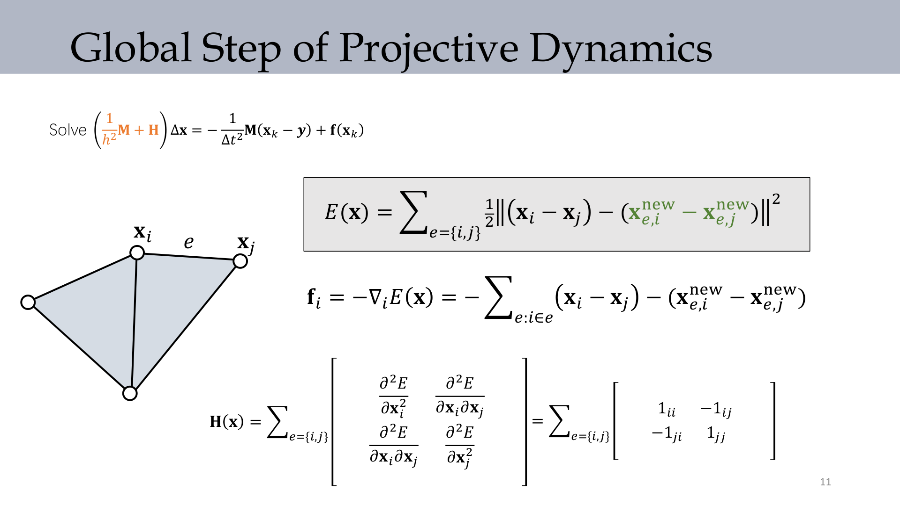

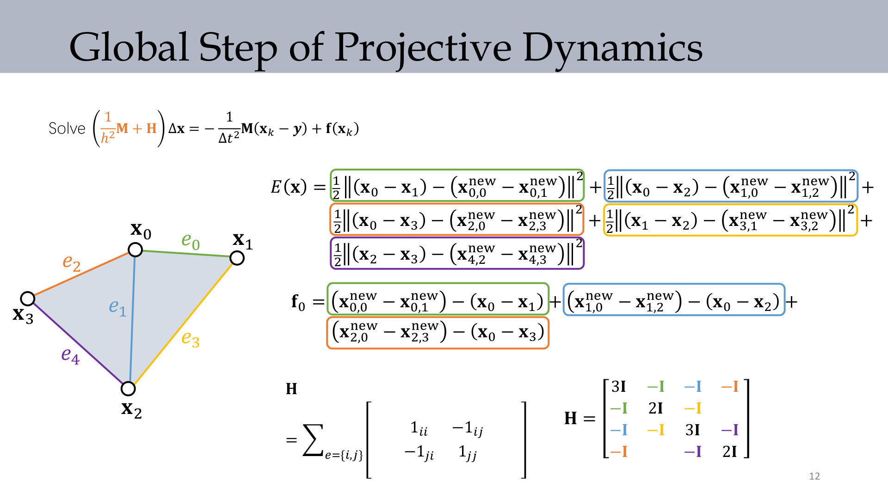

A practical advantage is the near-constant system matrix:

$$
\mathbf{A}:=\frac{1}{h^2}\mathbf{M}+\mathbf{H}_{PD}.
$$

So we can factorize once and reuse many times in local-global iterations.

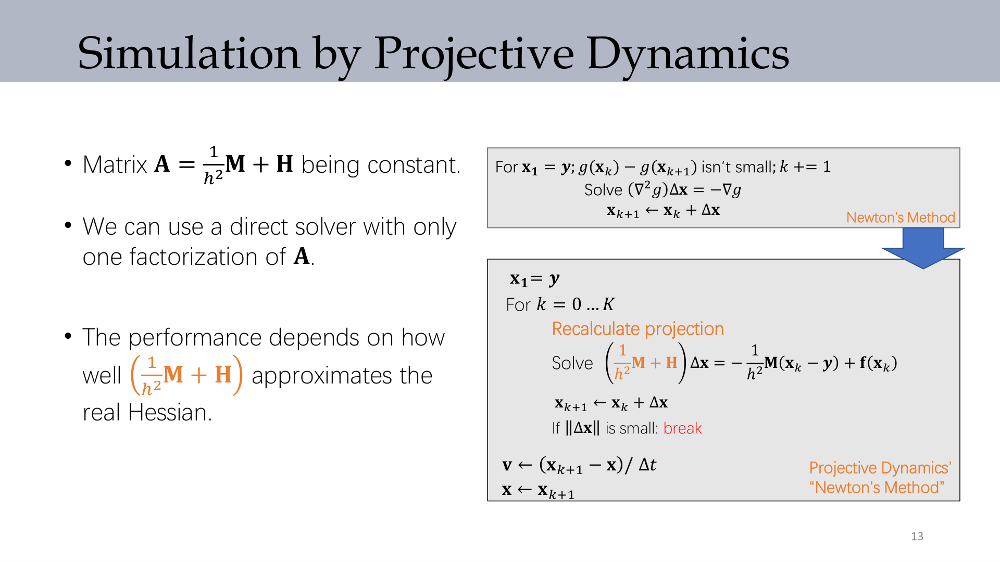

### 2.3 PD vs Newton vs Gradient Descent
A compact comparison:

- Newton: $\mathbf{x}_{k+1}=\mathbf{x}_k-\mathbf{H}(g)^{-1}\nabla g$ (quadratic local convergence, expensive and curvature-sensitive).
- Gradient descent: $\mathbf{x}_{k+1}=\mathbf{x}_k-a_{k+1}\nabla g$ (linear convergence, step-size sensitive).
- PD: $\mathbf{x}_{k+1}=\mathbf{x}_k-\mathbf{A}^{-1}\nabla g$ with constant-ish $\mathbf{A}$ (linear but practical and robust early).

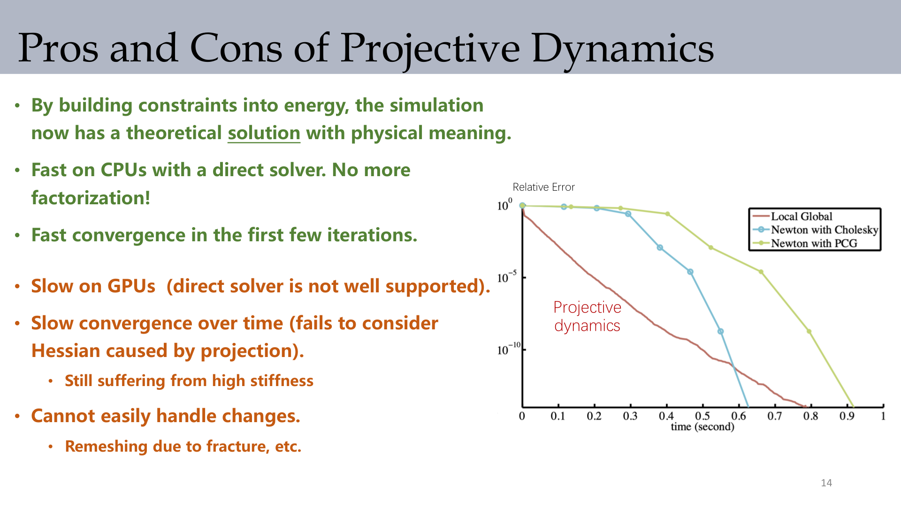

:::remark Key Question (original intent): If PD is fast early, why can it slow down later?
Because the fixed approximate Hessian misses part of the true curvature induced by updated projections. Early iterations remove large errors fast, but asymptotic refinement can stall compared with full Newton updates.
:::

## 3. Continuum Mechanics, PBD, and PD
**Key statement (slide wording): PD bridges the gap between continuum mechanics and PBD.**

- PBD enforces constraints by direct projection of positions/velocities.
- It often looks plausible but is not fully force/energy consistent.
- PD keeps projection-style efficiency while grounding constraints in energy design.

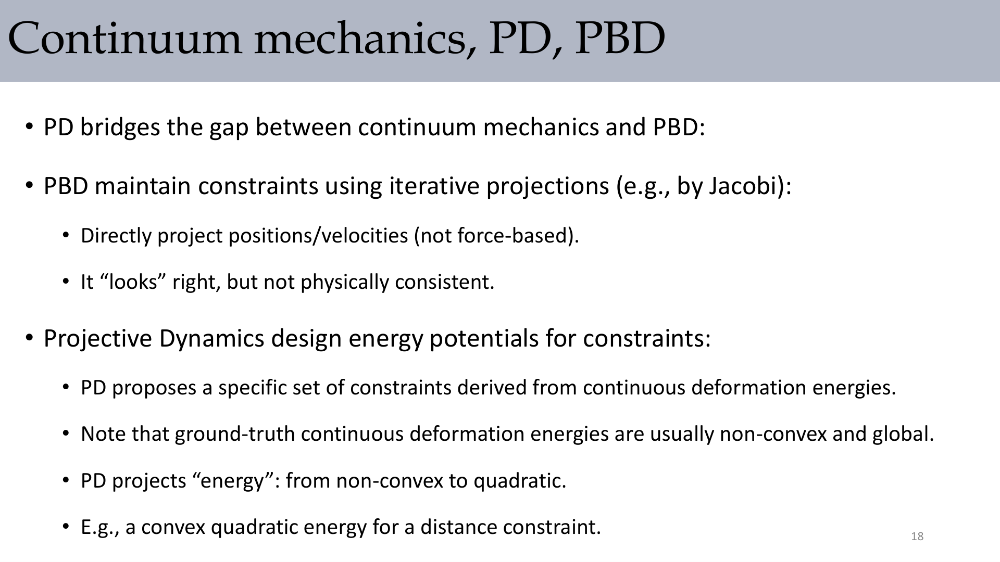

## 4. From APIC to MLS-MPM
MPM can be seen as APIC-style hybrid transfer generalized to deformable continua.

- Eulerian grid: momentum update, collisions, boundary conditions.
- Lagrangian particles: advection, history variables, deformation state.

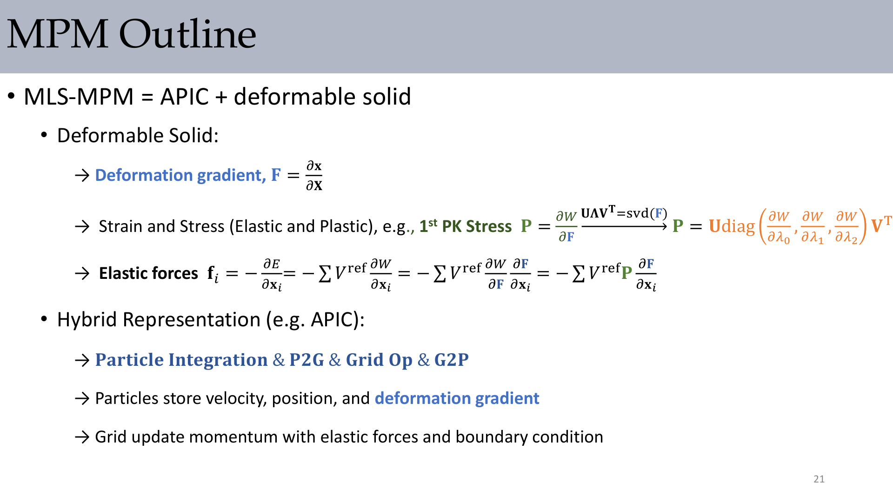

### 4.1 APIC Core (Transfer that Preserves Angular Momentum)
**Key statement (slide wording): Only P2G and G2P conserve angular momentum.**

Particle integration:

$$
\mathbf{x}_p^{n+1}=\mathbf{x}_p^n+\mathbf{v}_p^n\Delta t,
\qquad
\mathbf{v}_p^*=\mathbf{v}_p^n+\mathbf{f}_{extra}\Delta t.
$$

APIC P2G:

$$
(m\mathbf{v})_i^{n+1}=\sum_p w_{i,p}\left[m_p\mathbf{v}_p^n+m_p\mathbf{C}_p^n(\mathbf{x}_i-\mathbf{x}_p^n)\right],
\qquad
m_i^{n+1}=\sum_p m_p w_{i,p}.
$$

Grid op and G2P:

$$
\mathbf{v}_i^*=\frac{(m\mathbf{v})_i^{n+1}}{m_i^{n+1}},
\quad
\mathbf{v}_i^{n+1}=\mathrm{PressureProjection}(\mathbf{v}_i^*,BC),
$$

$$
\mathbf{v}_p^{n+1}=\sum_i w_{i,p}\mathbf{v}_i^{n+1},
\qquad
\mathbf{C}_p^{n+1}=\frac{4}{\Delta x^2}\sum_i w_{i,p}\mathbf{v}_i^{n+1}(\mathbf{x}_i-\mathbf{x}_p^n)^T.
$$

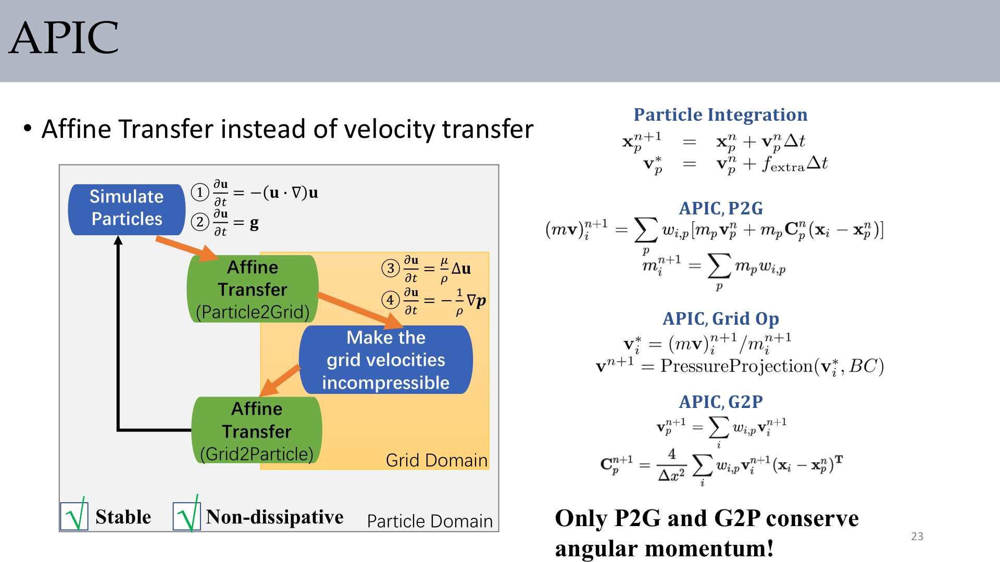

### 4.2 MLS-MPM = APIC + Deformable Solid
Core continuum variables:

$$
\mathbf{F}=\frac{\partial\mathbf{x}}{\partial\mathbf{X}},
\qquad
\mathbf{P}=\frac{\partial W}{\partial\mathbf{F}},
\qquad
\mathbf{f}_i=-\sum_p V_p^{ref}\,\mathbf{P}\frac{\partial\mathbf{F}}{\partial\mathbf{x}_i}.
$$

And deformation update:

$$
\mathbf{F}_p^{n+1}=(\mathbf{I}+\Delta t\,\mathbf{C}_p^n)\mathbf{F}_p^n.
$$

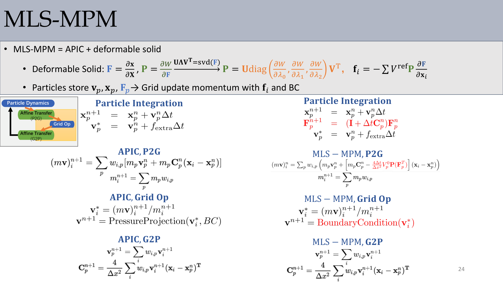

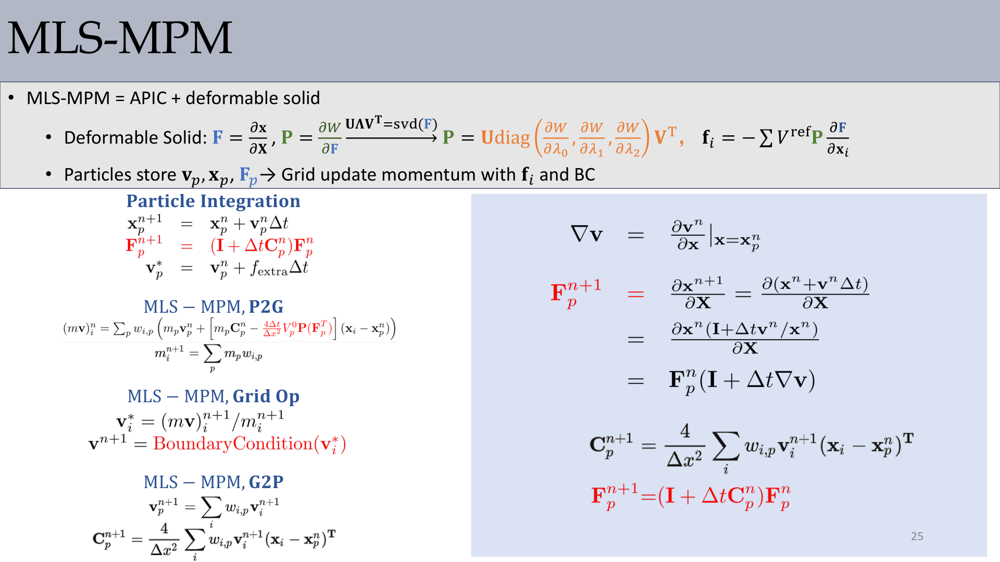

Stress contribution enters P2G as:

$$
(m\mathbf{v})_i^n
=\sum_p w_{i,p}\left(m_p\mathbf{v}_p^n+
\left[m_p\mathbf{C}_p^n-\frac{4\Delta t}{\Delta x^2}V_p^0\mathbf{P}(\mathbf{F}_p^n)^T\right](\mathbf{x}_i-\mathbf{x}_p^n)
\right).
$$

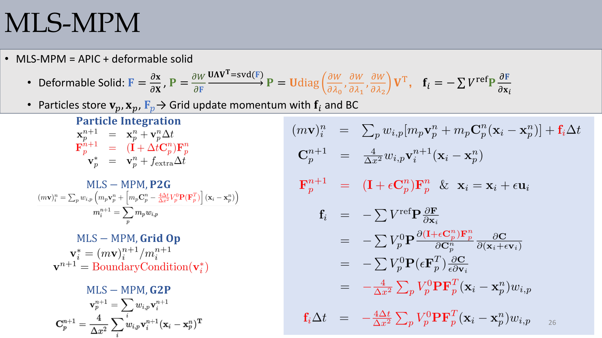

### 4.3 Boundary Conditions on Grid Velocities
Typical BC mappings:

$$
\mathbf{v}_i^{n+1}=BC_{sticky}(\hat{\mathbf{v}}_i^{n+1})=0,
$$

$$
\mathbf{v}_i^{n+1}=BC_{slip}(\hat{\mathbf{v}}_i^{n+1})
=\hat{\mathbf{v}}_i^{n+1}-\mathbf{n}(\mathbf{n}^T\hat{\mathbf{v}}_i^{n+1}),
$$

$$
\mathbf{v}_i^{n+1}=BC_{separate}(\hat{\mathbf{v}}_i^{n+1})
=\hat{\mathbf{v}}_i^{n+1}-\mathbf{n}\,\min(\mathbf{n}^T\hat{\mathbf{v}}_i^{n+1},0).
$$

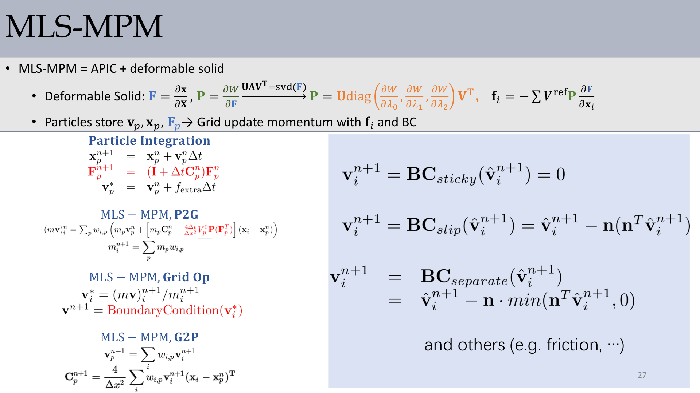

## 5. Constitutive Models in MLS-MPM
### 5.1 Elastic Solids
Continuum momentum equation and Cauchy stress mapping:

$$
\rho\frac{d\mathbf{u}}{dt}=\nabla\cdot\boldsymbol{\sigma}+\mathbf{f}_{body},
\qquad
\boldsymbol{\sigma}=\det(\mathbf{F})^{-1}\mathbf{P}\mathbf{F}^T.
$$

Elastic examples:

$$
\text{Neo-Hookean:}\quad \mathbf{P}=\mu(\mathbf{F}-\mathbf{F}^{-T})+\lambda\log(J)\mathbf{F}^{-T},
$$

$$
\text{Corotated:}\quad \mathbf{P}=2\mu(\mathbf{F}-\mathbf{R})+\lambda(J-1)J\mathbf{F}^{-T},
\quad J=\det(\mathbf{F}),\; I_c=\lVert\mathbf{F}\rVert_F^2.
$$

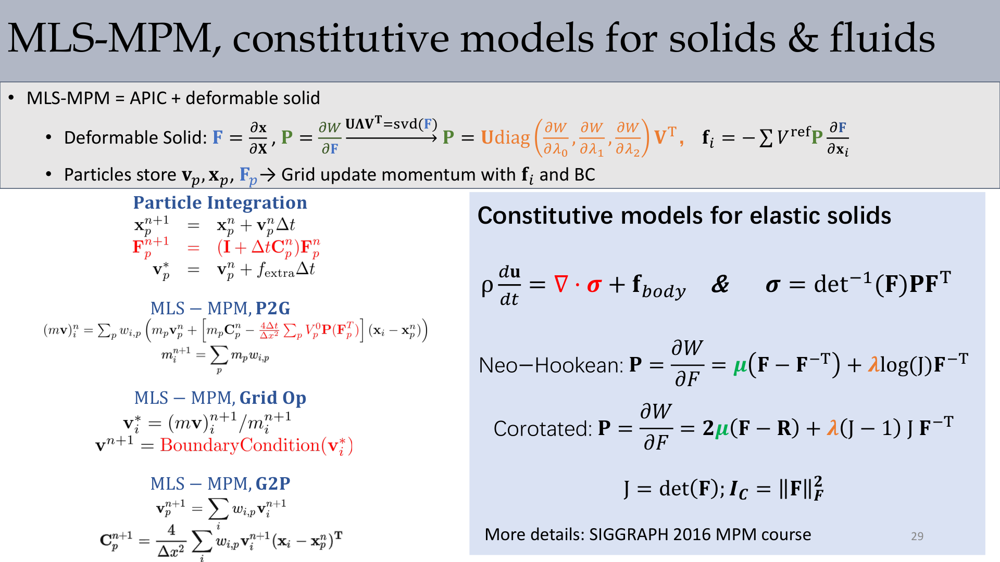

### 5.2 Plastic Solids
Multiplicative split and clamp strategy:

$$
\mathbf{F}_p=\mathbf{F}_{p,plastic}\mathbf{F}_{p,elastic},
\qquad
\mathbf{P}=\frac{\partial W(\mathbf{F}_{p,elastic})}{\partial\mathbf{F}_{p,elastic}}.
$$

$$
\mathbf{F}_{p,elastic}^{n+1}=(\mathbf{I}+\Delta t\mathbf{C}_p^n)\mathbf{F}_p^n,
\quad
\mathrm{svd}(\mathbf{F}_{p,elastic}^{n+1})=\mathbf{U}\mathbf{\Lambda}\mathbf{V}^T,
$$

$$
\Lambda_{elastic}=\max(\min(\Lambda_{ii},1+\theta_s),1-\theta_c),
\qquad
\mathbf{F}_{p,elastic}^{n+1}=\mathbf{U}\mathbf{\Lambda}_{elastic}\mathbf{V}^T.
$$

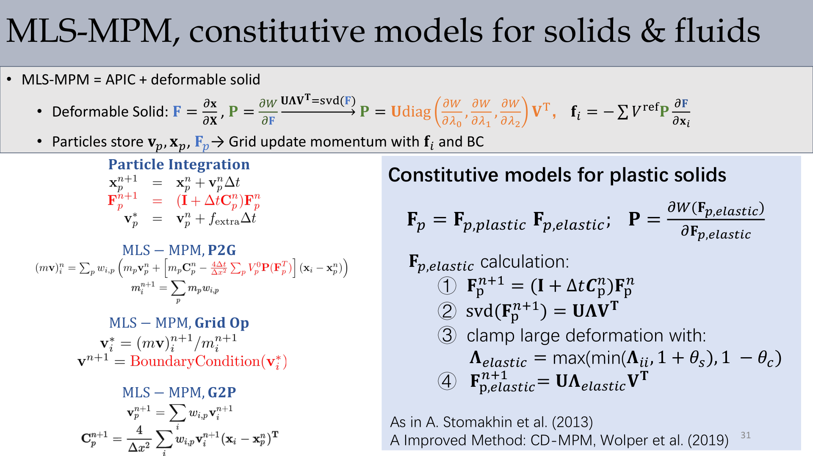

### 5.3 Weakly Compressible Fluids
Pressure-like closure in the same framework:

$$
\mathbf{f}_i\Delta t = -\frac{1}{\rho}\nabla p\,\Delta t,
\qquad p=K(1-J).
$$

From deformation update:

$$
\det(\mathbf{F}_p^{n+1})=\det(\mathbf{I}+\Delta t\mathbf{C}_p^n)\det(\mathbf{F}_p^n)
\Rightarrow
J_p^{n+1}=(1+\Delta t\,\mathrm{tr}(\mathbf{C}_p^n))J_p^n.
$$

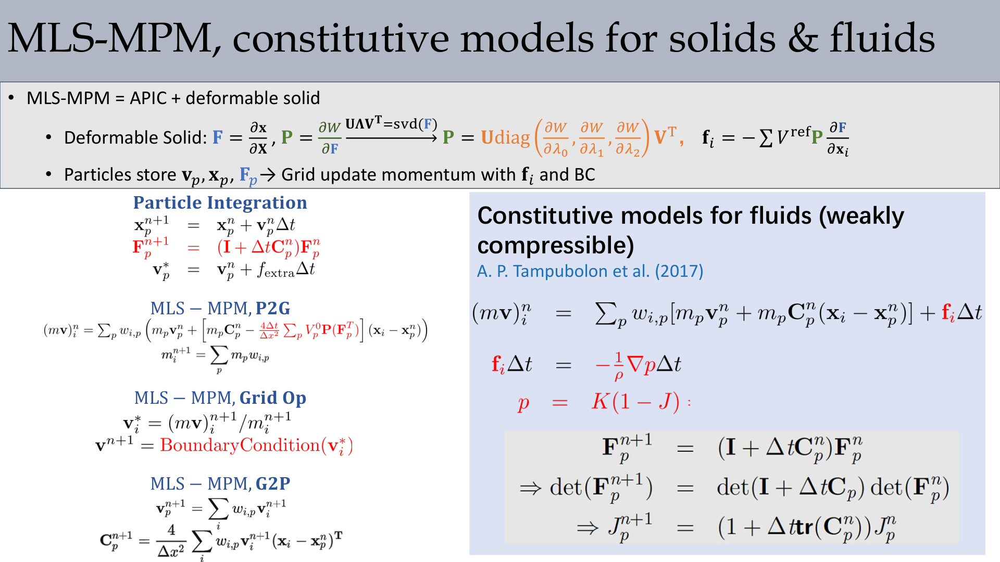

### 5.4 Fracture Modeling Direction
Phase-field-style degradation can be injected through constitutive energy:

$$
\mathbf{P}
=\frac{\partial W(\mathbf{F}_{p,elastic})}{\partial\mathbf{F}_{p,elastic}}
=\frac{\partial\Bigl([(1-\epsilon)c^2+\epsilon]W^+(\mathbf{F}_{p,e})+W^-(\mathbf{F}_{p,e})+\cdots\Bigr)}{\partial\mathbf{F}_{p,elastic}}.
$$

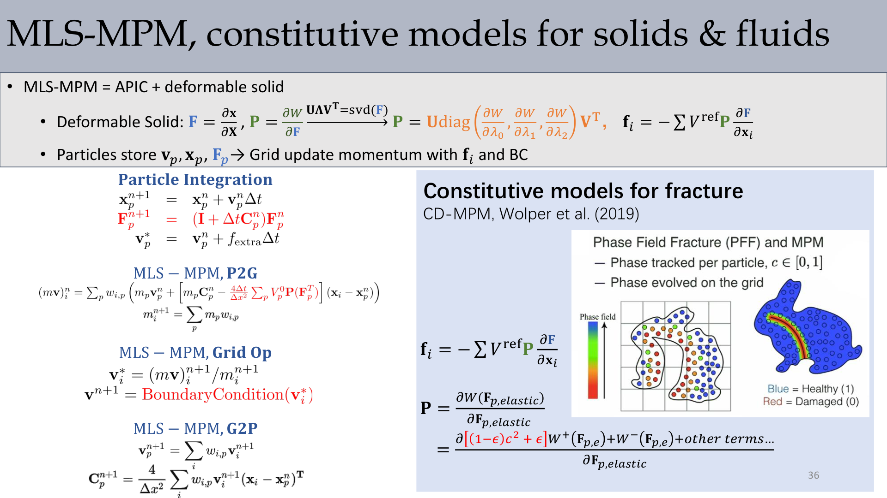

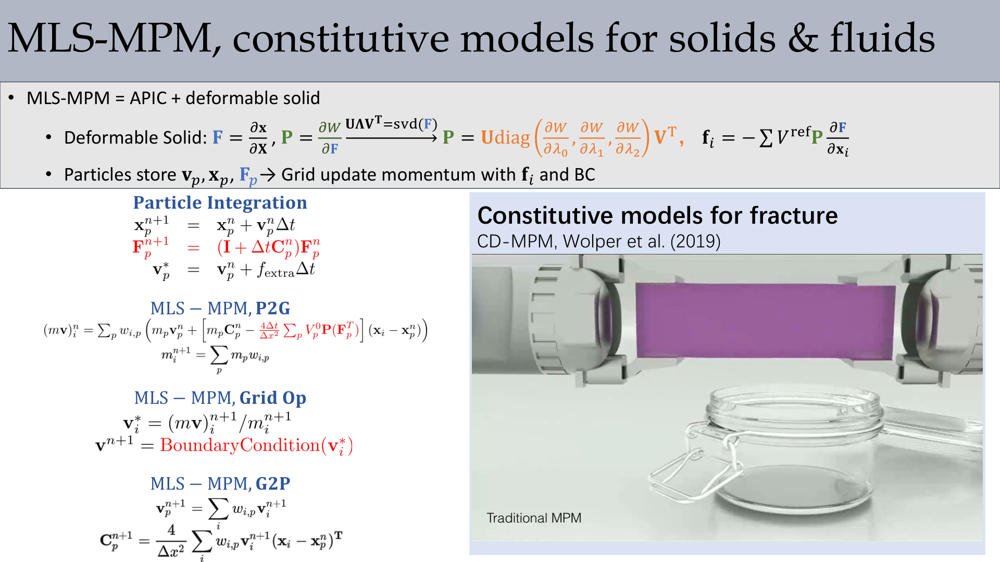

### 5.5 Lagrangian Mesh Coupling
A practical direction for hair/cloth/soft solids:

1. Add FEM or mass-spring mesh on top of MPM particles.
2. Use mesh vertices/elements as particle carriers for extra structure.
3. Convert Lagrangian internal forces to Eulerian grid forces.

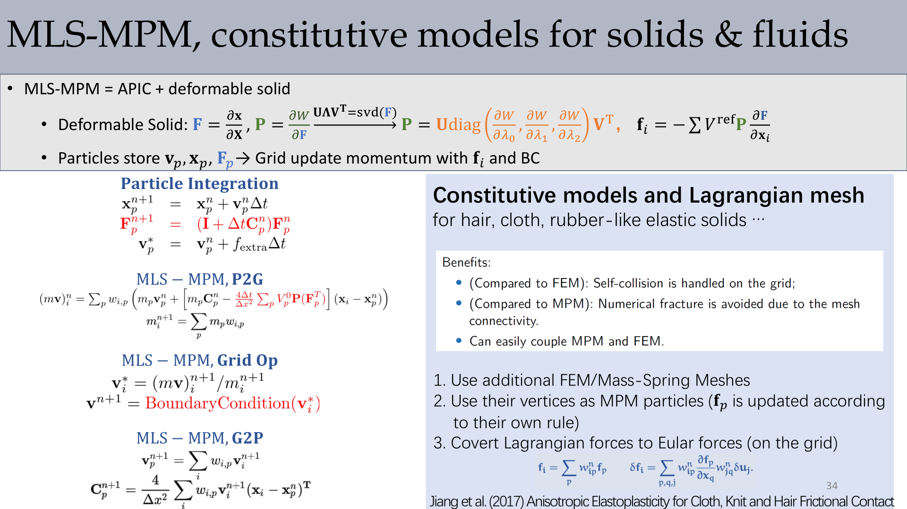

:::remark Key Question (original intent): Why combine Lagrangian mesh with MPM?
You keep mesh-level material structure and directional behavior while still using grid-level collision/contact robustness. This is especially useful for cloth, hair, and anisotropic responses.
:::

## 6. From MPM to MLS-MPM: What Changed
The transition can be seen as combining two ideas:

- APIC-style affine transfer and angular-momentum-friendly reconstruction.
- MPM discretization with constitutive stress terms injected into momentum update.

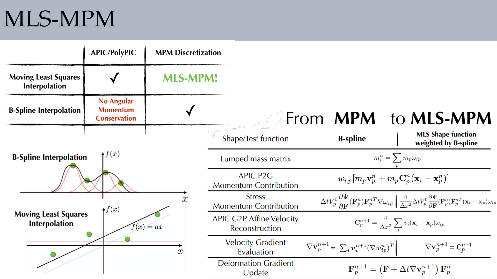

Recent directions include compact kernels, improved fracture coupling, and data-driven parameter tuning.

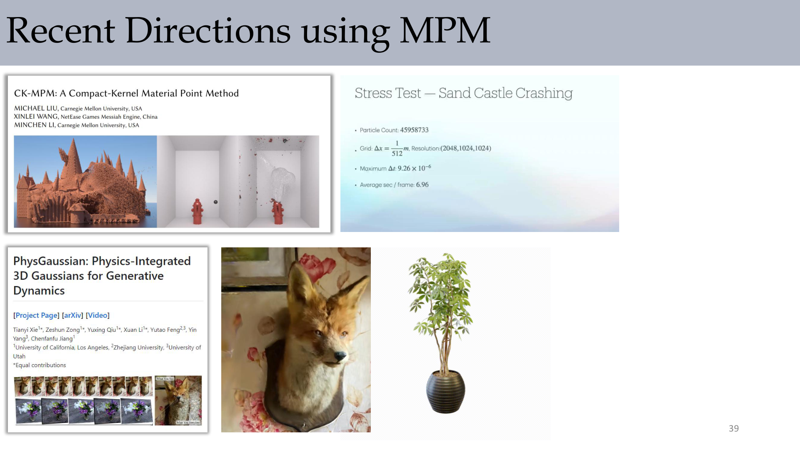

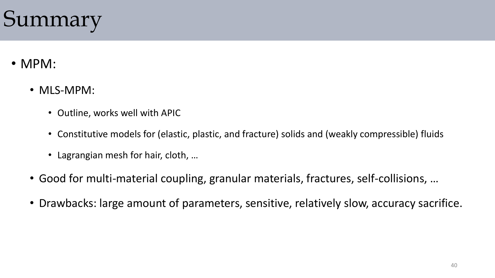

## 7. Exam Review
### A. Definitions You Should State Precisely
- **Projective Dynamics**: local projection + global quadratic solve as an approximation to non-convex deformation optimization.
- **MLS-MPM**: APIC-style hybrid transfer plus continuum constitutive modeling using deformation gradient and stress.
- **1st Piola-Kirchhoff stress**: $\mathbf{P}=\partial W/\partial\mathbf{F}$.
- **Cauchy stress mapping**: $\boldsymbol{\sigma}=\det(\mathbf{F})^{-1}\mathbf{P}\mathbf{F}^T$.

### B. Mechanism Chain (Short-Answer Template)
1. Start with particles storing $\mathbf{x}_p,\mathbf{v}_p,\mathbf{F}_p$.
2. P2G transfers momentum (APIC affine term + constitutive stress term).
3. Apply grid operations and boundary conditions.
4. G2P reconstructs particle velocity and affine matrix.
5. Update deformation gradient and constitutive stress for next step.

### C. Common Pitfalls
- Treating PBD projection as physically equivalent to force-based energy minimization.
- Forgetting that PD's fixed matrix gives speed but may reduce late-stage convergence quality.
- Writing APIC formulas but dropping affine terms in code.
- Mixing elastic/plastic parts of $\mathbf{F}$ without SVD clamp logic.
- Using fluid-like pressure closure without checking compressibility assumptions.

### D. Self-Check Questions
1. Why is PD often faster than full Newton in early iterations?
2. Which APIC transfer stages are critical for angular momentum conservation?
3. Why does MLS-MPM need both $\mathbf{C}_p$ and $\mathbf{F}_p$?
4. How do sticky/slip/separate BCs differ in normal-direction treatment?
5. Why is constitutive design the real "personality" of an MPM material?

:::remark Self-check Reference Answers
1. PD reuses a constant (or near-constant) global matrix after local projections, so each iteration is cheaper while still reducing large residual components quickly.
2. The affine P2G and G2P pair is the key; omitting affine reconstruction destroys the intended angular momentum behavior.
3. $\mathbf{C}_p$ captures local velocity gradient/affine motion for transfer, while $\mathbf{F}_p$ captures finite deformation history for constitutive response.
4. Sticky sets velocity to zero; slip removes normal component; separate only removes inward normal component to prevent penetration.
5. Because stress laws convert deformation to force. Transfer/discretization provides plumbing, but constitutive equations decide whether the material behaves like rubber, sand, fluid, or brittle solids.
:::
