# 第12讲 碰撞、塑性与断裂

## 1. 全局图景
本讲把三个在同一个模拟器里经常同时出现的话题串在一起：

- 碰撞处理：先找接触候选，再确认真实相交，最后修改运动，使轨迹保持可接受。
- 塑性：描述材料超过弹性范围后留下的永久形变。
- 断裂：决定何时应当发生拓扑变化，例如开裂或分离。

理解本讲时，可以先记住这张总图：

1. 碰撞检测 = broad phase + narrow phase。
2. 检测阶段本身又各有离散版和连续版。
3. 碰撞响应也同样分为离散与连续两类。
4. 当碰撞和接触被稳定处理后，才适合继续讨论超出弹性范围的材料行为，也就是塑性与断裂。

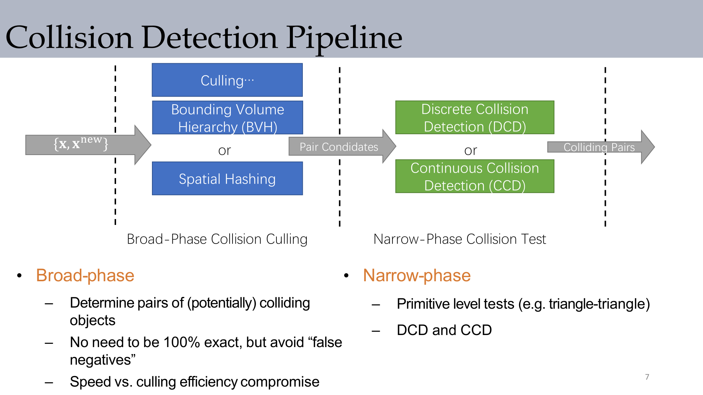

## 2. 碰撞检测
### 2.1 Broad Phase 的目标
**关键表述（沿用讲义原话）：Broad-phase determines pairs of (potentially) colliding objects. No need to be 100% exact, but avoid false negatives.**

如果直接测试所有物体对，暴力复杂度为

$$
C_n^2=\frac{n(n-1)}{2}.
$$

这个代价很快就会不可接受，所以 broad phase 会先用廉价的几何过滤器去掉明显不可能碰撞的物体对，再把更贵的精确测试留给 narrow phase。

它的设计原则是不对称的：

- 可以接受 false positive，因为后续 narrow phase 还会再筛。
- 绝不能轻易出现 false negative，因为真实碰撞一旦漏掉，后面就完全没有补救机会。

### 2.2 AABB Sweep-and-Prune
轴对齐包围盒（AABB）是最简单、也最常见的过滤方式。

- 先给每个物体包一个 AABB。
- 把每个 AABB 投影到坐标轴上。
- 对投影区间端点排序。
- 先删掉在某个轴上不重叠的物体对。
- 只对在所有测试轴上都重叠的候选对做后续测试。

讲义给出的典型复杂度是

$$
O(n\log n + k),
$$

其中 $k$ 是剪枝后仍然保留下来的候选对数量。

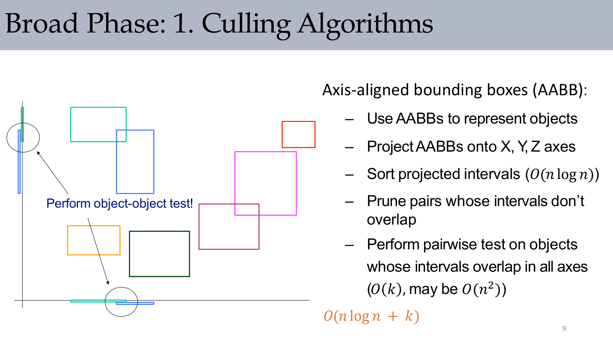

AABB 的优点是便宜、实现直接；缺点是当物体很细长或者旋转较大时，包围盒会很松，导致 false positive 明显增多。

### 2.3 OBB 与分离轴定理
如果物体方向变化比较重要，定向包围盒（OBB）通常比 AABB 更紧。它的标准相交测试是 SAT（Separating Axis Test）。

**关键表述（沿用讲义原话）：Two objects A, B are disjoint if for some vector $\mathbf{v}$ the projections $A\mathbf{v}$ and $B\mathbf{v}$ onto the vector do not overlap.**

这个向量就叫分离轴。

对 3D OBB，只需要测试 15 条轴：

- 盒子 A 的 3 个面法线，
- 盒子 B 的 3 个面法线，
- 两盒边方向两两叉积得到的 9 条轴。

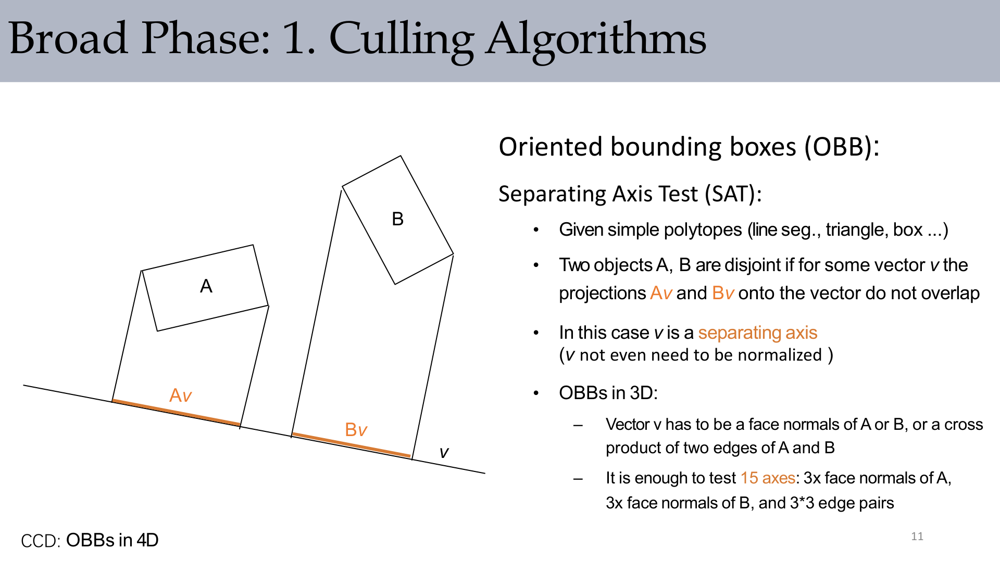

相比 AABB，OBB 更紧，但测试也更贵。讲义还留了一句很有提示性的备注：在 CCD 里，人们有时会从时空角度理解成“4D OBB”。

### 2.4 大规模场景与自碰撞中的 BVH
包围体层次结构（BVH）会按照几何或拓扑邻近关系，把物体或图元组织成一棵树。

它的核心收益是递归剪枝：

- 如果两个高层包围体不相交，那么整棵子树都可以一起丢掉。
- 只有当高层包围体相交时，才继续向下递归到相关子节点。

对于自碰撞，讲义给出两个相互配合的过程：

- `Process_Node(A)`：递归处理单个节点，并测试其子节点之间的配对。
- `Process_Pair(B, C)`：只有当两个节点的包围体相交时，才继续递归它们。

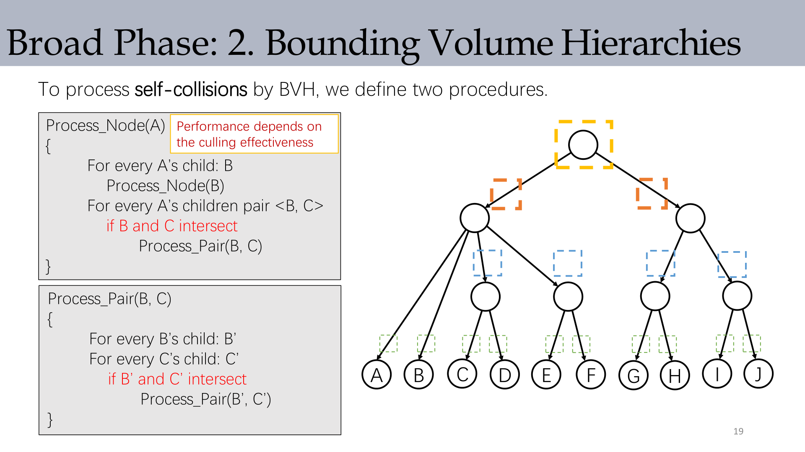

这样就不需要在同一个物体内部盲目测试所有图元对。它的实际效率很大程度上取决于 BVH 的剪枝质量。

### 2.5 空间划分与哈希
另一条 broad phase 路线不是“分物体”，而是“分空间”。

常见结构包括：

- uniform grid，
- quadtree / octree，
- kd-tree，
- BSP 风格的空间划分。

对运动物体，通常还要把其占据区域适当扩张，确保一个时间步内的运动不会被漏掉。

讲义里的具体例子是用于 vertex-triangle test 的网格哈希：

$$
H(x,y,z):=[(z*\mathrm{gridsize}+y)*\mathrm{gridsize}+x]\bmod n.
$$

流程是：

1. 按所在网格单元给顶点做哈希。
2. 按包围盒所覆盖的所有网格单元给四面体或三角形做哈希。
3. 只对落在同一个哈希桶里的图元运行 narrow phase。

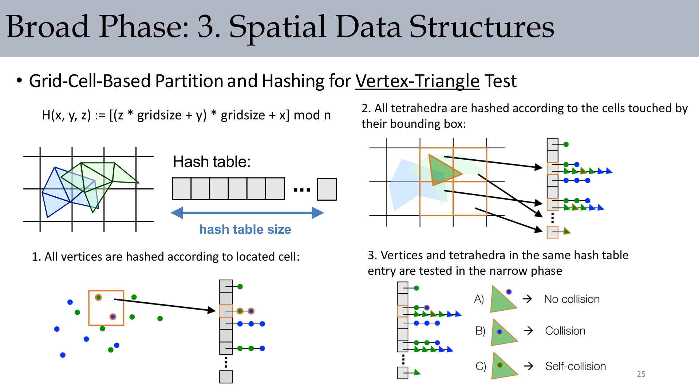

这种方法在动态场景里很有吸引力，前提是局部密度不要过于极端。

## 3. Narrow-Phase 碰撞检测
### 3.1 DCD：离散碰撞检测
**关键定义（沿用讲义原话）：DCD tests if any intersection exists in each state at discrete time instant: $\mathbf{x}^{[0]}, \mathbf{x}^{[1]}, \ldots$**

对三角网格来说，最基本的离散测试是 edge-triangle intersection。

设边上的运动点为

$$
\mathbf{x}(t)=(1-t)\mathbf{x}_a+t\mathbf{x}_b.
$$

要与三角形所在平面相交，它必须满足

$$
\bigl((1-t)\mathbf{x}_a+t\mathbf{x}_b-\mathbf{x}_0\bigr)\cdot(\mathbf{x}_{10}\times\mathbf{x}_{20})=0,
$$

于是可解得

$$
t=\frac{\mathbf{x}_{0a}\cdot(\mathbf{x}_{10}\times\mathbf{x}_{20})}{\mathbf{x}_{ba}\cdot(\mathbf{x}_{10}\times\mathbf{x}_{20})}.
$$

随后还要检查两件事：

- $t\in[0,1]$，也就是交点确实落在线段上；
- $\mathbf{x}(t)$ 是否落在三角形内部。

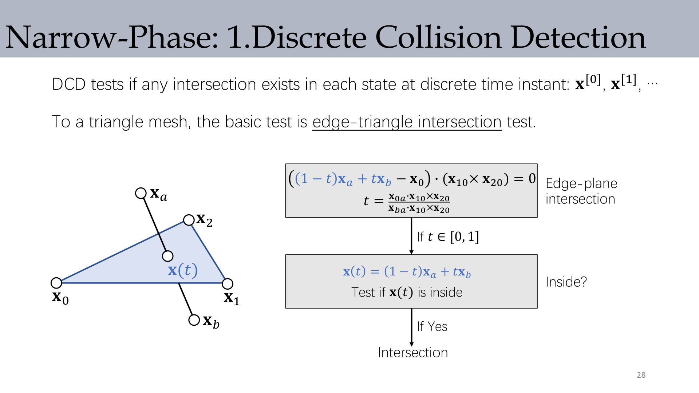

:::remark 关键问题（原问保留）：Inside?
解出 edge-plane 的交点，只能说明线段与三角形所在平面相交。只有当这个交点进一步落在三角形区域内部时，才是真正的 edge-triangle 相交，而不是“碰到了无限平面”。
:::

DCD 的优点是简单、通常也比较稳，但它有一个著名弱点：tunneling。也就是物体在两个采样状态之间已经穿过去了，但这两个离散状态本身都看不出相交。

### 3.2 CCD：连续碰撞检测
**关键定义（沿用讲义原话）：CCD tests if any intersection exists between two states: $\mathbf{x}^{[0]}$ and $\mathbf{x}^{[1]}$.**

对三角网格，最基本的两类连续测试是：

- vertex-triangle，
- edge-edge。

核心思想是：询问在这个时间步里，相关图元是否会在某个时刻变成共面。对 vertex-triangle 情况，共面条件是

$$
\mathbf{x}_{30}(t)\cdot\bigl(\mathbf{x}_{10}(t)\times\mathbf{x}_{20}(t)\bigr)=0,
$$

它会展开成三次方程

$$
at^3+bt^2+ct+d=0.
$$

如果某个根落在 $[0,1]$ 内，再继续检查对应时刻下顶点是否落在三角形内部。

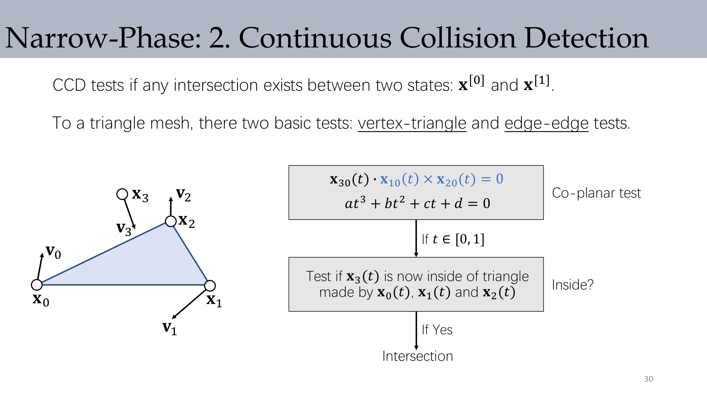

对 edge-edge CCD，也是先解共面时刻，再检查这两个线段在该时刻是否在线段有限范围内真正相交。

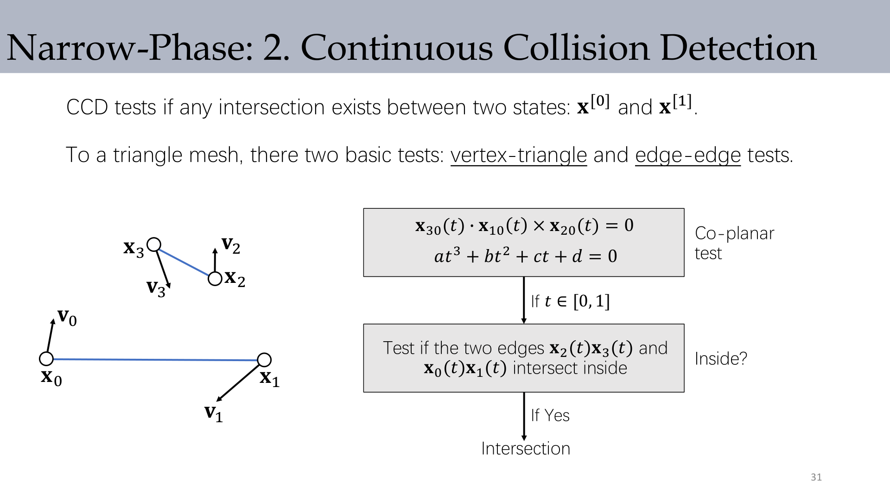

:::remark 关键问题（原意复述）：为什么 DCD 会 tunneling，而 CCD 可以避免？
因为 DCD 只看若干离散状态，碰撞完全可能发生在两个状态之间；CCD 则直接在整个时间区间里搜索是否存在有效碰撞时刻，所以能够捕捉到“步内发生”的事件。
:::

### 3.3 为什么 CCD 更难
讲义特别强调了 CCD 的三个工程难点：

- 浮点误差敏感，尤其是三次方程求根附近；
- 计算开销明显高于 DCD；
- 实现与调试都更复杂。

所以实际工程里通常不是“处处上 CCD”，而是“先靠 broad phase 尽量缩小工作量，再把 CCD 用在真正需要鲁棒性的地方”。

## 4. 碰撞响应
### 4.1 离散响应：Intersection Elimination
离散响应从“已经相交”的状态出发，直接尝试把穿插消掉。

这种做法在下面几类场景里尤其有用：

- 时间步过大，
- 初始状态就带有相交，
- 外部导入或编辑的几何本身有问题，
- 数值误差累积导致漂移。

对 cloth-volume 和 volume-volume 接触，直接把顶点或边推到体外通常是比较自然的，因为“内外”定义清晰。

但 cloth-cloth 接触要难得多：

- DCD 本身就可能因为 tunneling 而错过真正事件；
- 薄片曲面天然没有一个统一、明确的 inside/outside 定义。

Baraff 等人的方法会先用 flood fill 把布料分成若干区域，再决定哪个区域处于相交状态；但讲义明确指出它 **cannot handle boundary well**。

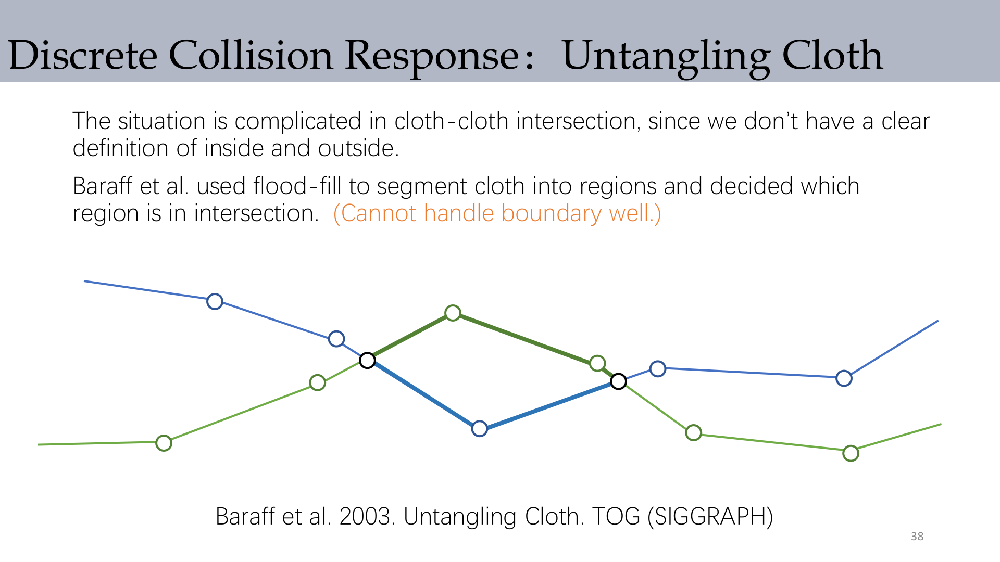

:::remark 关键问题（原意复述）：为什么 cloth-cloth 的相交消除比 cloth-volume 难很多？
实体体积有明确的“内部/外部”概念，所以把穿进去的点往外推是有物理意义的。布料是薄的双面曲面，一旦互相穿插，尤其在边界和褶皱附近，往哪边推都可能变得不再明确。
:::

讲义还提到后续工作，例如 intersection contour minimization，把 untangling 做成另一种优化问题。

### 4.2 连续响应：目标与取舍
**关键表述（沿用讲义原话）：Given the calculated next state $\mathbf{x}^{[1]}$, we want to update it into $\bar{\mathbf{x}}^{[1]}$, such that the path from $\mathbf{x}^{[0]}$ to $\bar{\mathbf{x}}^{[1]}$ is intersection-free.**

讲义把连续响应分成两大类：

- interior point methods，
- impact zone optimization。

它们之间的高层取舍是：

- interior point 方法更慢、会移动所有顶点、步子更谨慎，但通常非常稳；
- impact zone 方法更快，只更新碰撞区域，可以走更大的步，但不保证总能成功。

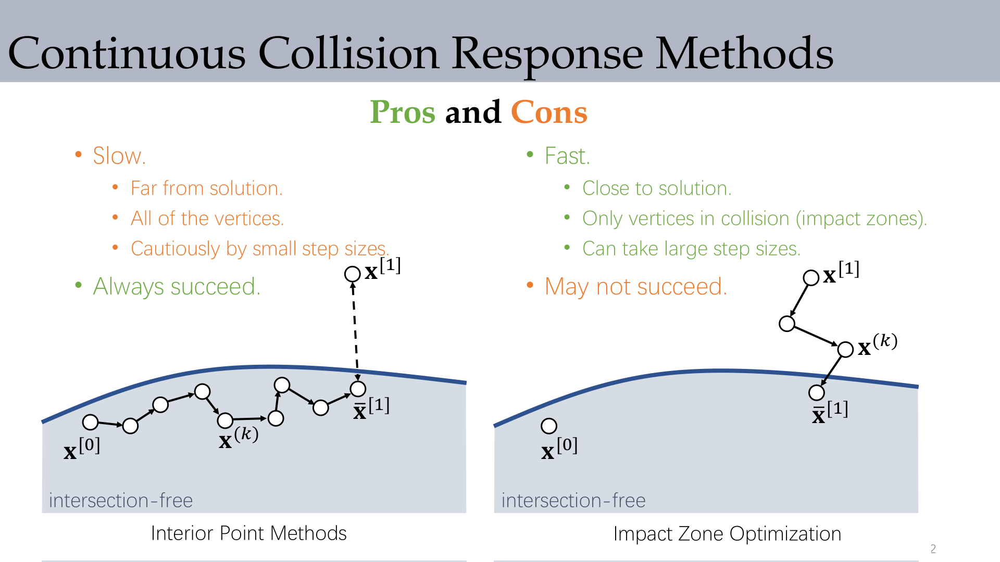

### 4.3 Interior Point Methods
Interior point 响应被写成一个优化问题：

$$
\bar{\mathbf{x}}^{[1]}\leftarrow \arg\min_{\mathbf{x}}\left(\frac{1}{2}\lVert \mathbf{x}-\mathbf{x}^{[1]}\rVert^2-\rho\sum E(d(\mathbf{x}))\right).
$$

其中 barrier 项负责惩罚靠近碰撞的配置。讲义里的梯度下降式更新为

$$
\alpha=\min(1,\mathrm{CCD}(\mathbf{x},\mathbf{v})),
$$

$$
\mathbf{x}^{(k+1)}\leftarrow \mathbf{x}^{(k)}+\alpha\left(\mathbf{x}^{[1]}-\mathbf{x}^{(k)}+\rho\sum \frac{\partial E}{\partial \mathbf{x}}\right).
$$

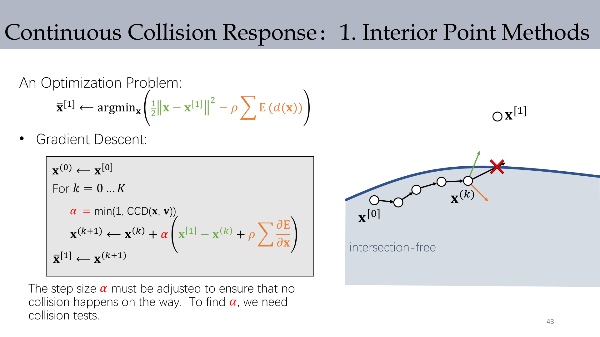

一个简单的对数 barrier 是

$$
E(\mathbf{x})=-\rho\log\lVert \mathbf{x}_{ij}\rVert,
$$

对应的排斥力为

$$
\mathbf{f}_i(\mathbf{x})=-\nabla_iE=\rho\frac{\mathbf{x}_{ij}}{\lVert \mathbf{x}_{ij}\rVert^2},
\qquad
\mathbf{f}_j(\mathbf{x})=-\nabla_jE=-\rho\frac{\mathbf{x}_{ij}}{\lVert \mathbf{x}_{ij}\rVert^2}.
$$

:::remark 关键问题（原意复述）：为什么步长 $\alpha$ 还必须由 CCD 来约束？
因为下降方向即便能降低目标函数，也仍然可能在“走过去的途中”穿过碰撞流形。CCD 在这里扮演的是安全线搜索的角色：它把步长裁到足够小，从而保证整段运动路径都是无相交的。
:::

### 4.4 IPC：Incremental Potential Contact
IPC 把接触直接并入隐式欧拉的能量最小化框架。

**关键表述（沿用讲义原话）：Implicit Euler = energy minimization.**

没有接触时，

$$
\mathbf{x}_{n+1}=\arg\min_{\mathbf{x}}\frac{1}{2h^2}\lVert \mathbf{x}-\mathbf{y}\rVert_{\mathbf{M}}^2+E(\mathbf{x}).
$$

加入接触势后，

$$
\mathbf{x}_{n+1}=\arg\min_{\mathbf{x}}\frac{1}{2h^2}\lVert \mathbf{x}-\mathbf{y}\rVert_{\mathbf{M}}^2+E(\mathbf{x})+\rho\sum E(d(\mathbf{x})).
$$

讲义里采用的是具有局部支撑的 $C^2$ barrier：

$$
E(\mathbf{x})=
\begin{cases}
-\bigl(\lVert \mathbf{x}_{ij}\rVert-\hat d\bigr)^2\ln\left(\dfrac{\lVert \mathbf{x}_{ij}\rVert}{\hat d}\right), & 0<\lVert \mathbf{x}_{ij}\rVert<\hat d,\\[6pt]
0, & \text{else.}
\end{cases}
$$

“局部支撑”这一点很关键：当距离已经大于阈值 $\hat d$ 时，barrier 直接为零，不再影响远处配置。

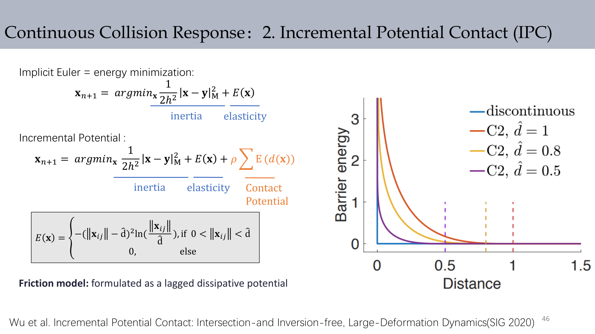

伪代码里暴露出的几个核心实现步骤是：

- 计算当前活跃约束集，
- 构造带 barrier 的目标函数，
- 把 Hessian 投影成 SPD，
- 做 Newton 步，
- 用 CCD 裁剪步长，
- 重算约束集并继续迭代。

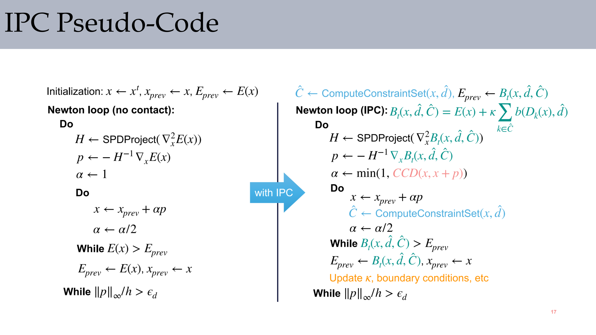

讲义还提到两个近期方向：

- SIGGRAPH 2023：围绕性能、精度和 GPU 友好性做改进；
- SIGGRAPH Asia 2024：例如 `ppf-contact-solver` 一类接触求解器工作。

另外，摩擦在这里被表述为 lagged dissipative potential。

### 4.5 Impact Zone Optimization 与实用系统
**关键表述（沿用讲义原话）：The goal of impact zone optimization is to optimize $\mathbf{x}^{[1]}$ until it becomes intersection-free.**

它的目标函数是

$$
\bar{\mathbf{x}}^{[1]}\leftarrow \arg\min_{\mathbf{x}}\frac{1}{2}\lVert \bar{\mathbf{x}}-\mathbf{x}^{[1]}\rVert^2,
$$

同时满足非穿透约束，例如对 vertex-triangle 对有

$$
C(\mathbf{x})=-(\mathbf{x}_3-b_0\mathbf{x}_0-b_1\mathbf{x}_1-b_2\mathbf{x}_1)\cdot\mathbf{N}\le 0,
$$

对 edge-edge 对有

$$
C(\mathbf{x})=-(b_2\mathbf{x}_2+b_3\mathbf{x}_3-b_0\mathbf{x}_0-b_1\mathbf{x}_1)\cdot\mathbf{N}\le 0.
$$

从几何上看，这些约束都是在限制相关图元沿接触法线方向不要再次穿过去。

讲义给出的实用流程是：

1. 先做 CCD，
2. 找到并优化 impact zones，
3. 必要时要么使用 interior point method，要么把碰撞顶点冻结回 pre-collision 状态，形成 rigid impact zones。

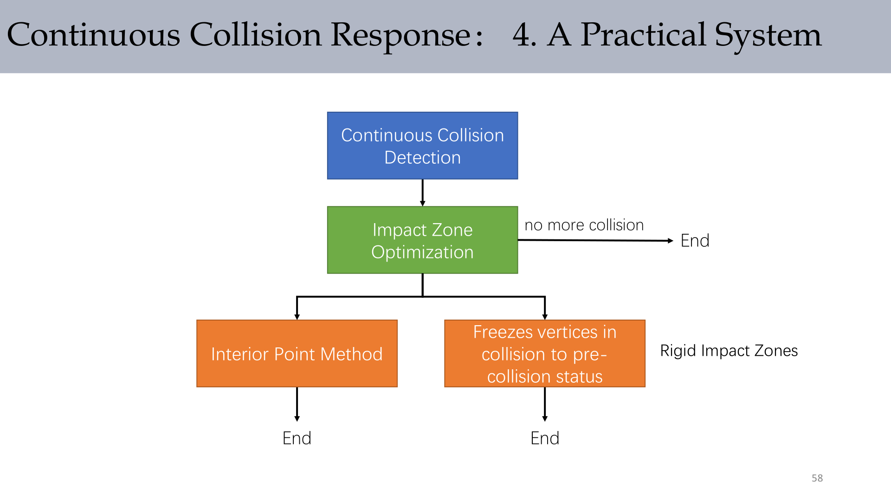

:::remark 关键问题（原意复述）：为什么 impact zone optimization 很快，但仍然可能失败？
因为它只更新碰撞区域里的顶点，所以比全局 interior-point 优化便宜得多，也能走更大的步。但正因为它工作在较小的活跃集合上，容易忽略集合之外的耦合，还可能受到 tunneling 或局部不可行性的影响。
:::

:::remark 关于讲义公式的一点说明
讲义中 vertex-triangle 约束的重心组合里重复出现了 $\mathbf{x}_1$。本笔记在引用公式时保留图片中的写法，同时补充说明它的几何含义是：橙色点表示三角形上的重心点，用来定义法向非穿透约束。
:::

## 5. 塑性与断裂
### 5.1 应力度量与材料阶段
一旦形变超过弹性范围，就要开始关心 yield、strain hardening、necking，最后才到 fracture。

讲义把两种常见应力度量放在一起对比：

- Cauchy stress 使用当前面积；
- PK stress 使用参考面积。

对应公式是

$$
\sigma_t=\frac{F}{A}=\frac{F}{A_0}\frac{A_0}{A},
\qquad
\mathbf{P}=\frac{F}{A_0}.
$$

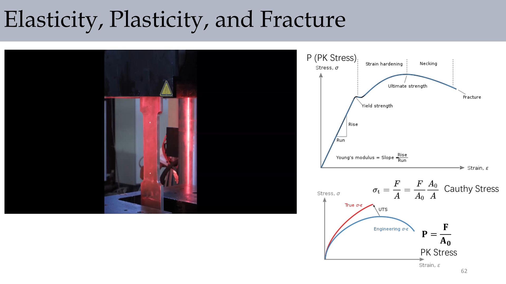

后面在断裂可视化里还会用到一个相关关系，即牵引力公式

$$
\mathbf{t}=\boldsymbol{\sigma}\mathbf{n},
$$

它把界面法线 $\mathbf{n}$ 映射成该取向切面上的 traction 向量。

:::remark 关键问题（原意复述）：为什么仿真笔记里会同时出现 Cauchy stress 和 PK stress？
Cauchy stress 直接对应当前变形配置中的单位面积受力，因此很适合写空间平衡方程和 traction 关系；PK stress 则参考的是初始配置，更适合与形变梯度和拉格朗日能量导数配套使用。
:::

### 5.2 塑性应变模型
讲义采用的应变度量是 Green strain：

$$
\boldsymbol{\epsilon}=\frac{1}{2}(\mathbf{F}^T\mathbf{F}-\mathbf{I})=
\begin{bmatrix}
\epsilon_{uu} & \epsilon_{uv}\\
\epsilon_{uv} & \epsilon_{vv}
\end{bmatrix}.
$$

弹性能只在弹性应变上计算：

$$
E=\int W(\epsilon_e)\,dA,
\qquad
\epsilon_e=\epsilon-\epsilon_p.
$$

塑性应变在参考态为零，随后按 yield + clamp 规则更新：

$$
\epsilon_p^{\mathbf{x}=\mathbf{X}}=0,
$$

$$
\epsilon_p^{t=i+1}=\left(\epsilon_p^{t=i}+\Delta\epsilon_p\right)
\min\left(1,\frac{\gamma_2}{\lVert \epsilon_p^{t=i}+\Delta\epsilon_p\rVert_F}\right),
$$

$$
\Delta\epsilon_p=
\frac{\max(0,\lVert \epsilon'\rVert_F-\gamma_1)}{\lVert \epsilon'\rVert_F}\,\epsilon',
\qquad
\epsilon'=\epsilon_e-\frac{\mathrm{Tr}(\epsilon_e)}{3}\mathbf{I}_3.
$$

这里 $\gamma_1$ 是屈服阈值，$\gamma_2$ 用来限制累计塑性应变的大小。

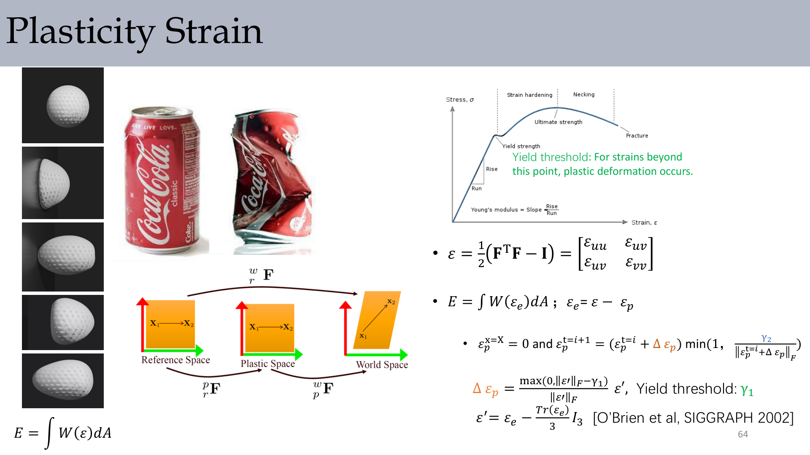

### 5.3 FEM + Remeshing 断裂流程
讲义给出的经典断裂链条是

$$
\text{strain} \rightarrow \text{stress tensor }\sigma \rightarrow \text{tensile/compressive forces} \rightarrow \text{separation tensor} \rightarrow \text{remeshing}.
$$

拉伸与压缩应力部分写为

$$
\sigma^+=\sum_{i=1}^3\max(0,\nu^i(\sigma))\,\mathbf{m}(\hat{\mathbf{n}}^i(\sigma)),
$$

$$
\sigma^-=\sum_{i=1}^3\min(0,\nu^i(\sigma))\,\mathbf{m}(\hat{\mathbf{n}}^i(\sigma)).
$$

其中辅助映射为

$$
\mathbf{m}(\mathbf{a})=
\begin{cases}
\mathbf{a}\mathbf{a}^T/\lvert \mathbf{a}\rvert, & \mathbf{a}\neq 0,\\
0, & \mathbf{a}=0.
\end{cases}
$$

讲义里的 separation tensor 为

$$
\zeta=\frac{1}{2}\left(-\mathbf{m}(\mathbf{f}^+)+\sum_{\mathbf{f}\in\{\mathbf{f}^+\}}\mathbf{m}(\mathbf{f})+\mathbf{m}(\mathbf{f}^-)-\sum_{\mathbf{f}\in\{\mathbf{f}^-\}}\mathbf{m}(\mathbf{f})\right).
$$

如果 $\zeta$ 的最大正特征值 $\nu^+$ 超过韧性阈值 $\tau$，就沿对应特征向量 $\mathbf{n}^+$ 的垂直方向切开网格。

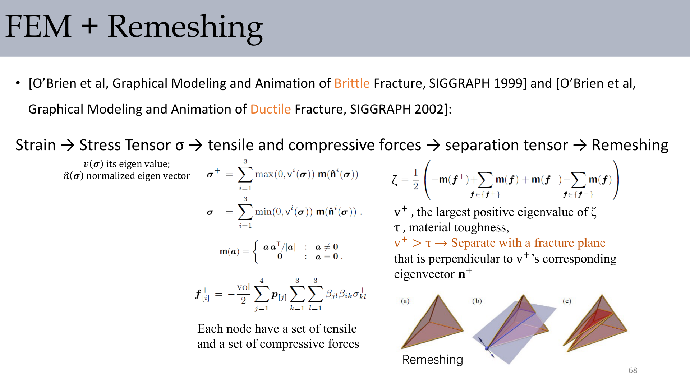

这类方法的物理意义很强，但代价也高，而且 remeshing 很容易带来质量不佳的新单元。

### 5.4 其他断裂方向
讲义给出了一组很紧凑的对比：

- FEM + remeshing：物理表达力强，但慢，而且依赖网格质量。
- Mass spring + pre-fracture：便宜、可控，但裂纹模式常常是固定的，物理感较弱。
- Meshless particle-based methods：避免频繁重建网格，用粒子相互作用表达断裂。
- XFEM：把仿真网格与裂纹表面解耦。

### 5.5 无网格粒子法
Meshless 断裂方法不用显式切开有限元网格，而是直接更新粒子运动与形变状态。

讲义中的力累积形式为

$$
\mathbf{T}_a=-\sum_b V_b\,\boldsymbol{\sigma}_b\,\nabla \widetilde W_{ba},
$$

形变梯度更新为

$$
\mathbf{F}_p^{n+1}=\mathbf{F}_p^n(\mathbf{I}+\Delta t\nabla \mathbf{v}).
$$

并给出常见张量量

$$
J=\det(\mathbf{F}),
\qquad
\mathbf{B}=\mathbf{F}\mathbf{F}^T,
\qquad
\bar{\mathbf{B}}=J^{-2/3}\mathbf{B}.
$$

可以把它概括成如下链条：

1. body force 驱动粒子速度和位置，
2. 速度梯度更新形变，
3. 形变决定应变与应力，
4. 应力再反馈到变形能和断裂决策里。

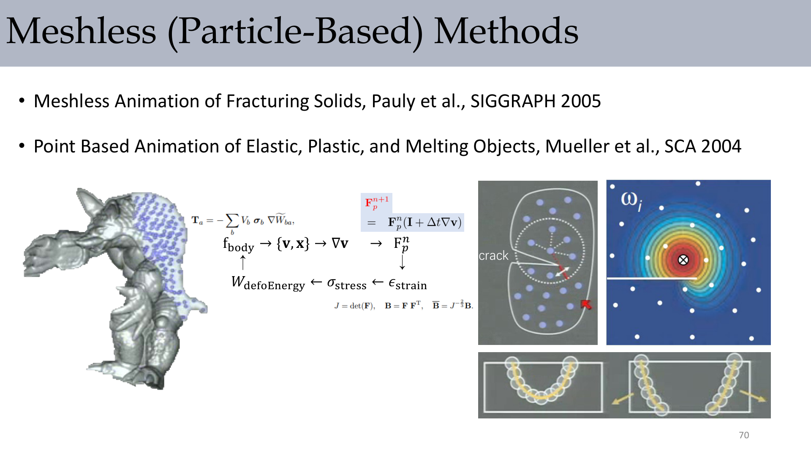

### 5.6 XFEM
XFEM 在这里被介绍为一种“把裂纹表面和仿真网格解耦”的方法。

**关键表述（沿用讲义原话）：The extended Finite Element Method (XFEM) is proposed for decoupling the simulation mesh from the crack surface.**

它的要点是：

- 裂纹表面由 level set 表示，
- surface remeshing 只在渲染时需要，
- 最大难点是如何在多面体区域上对不连续 integrand 做积分。

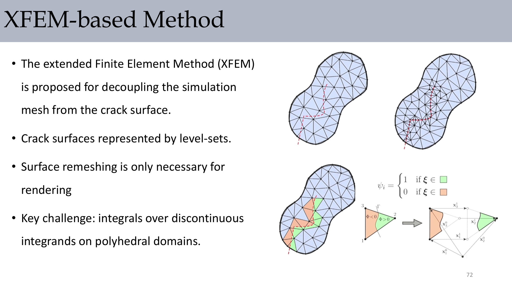

它的吸引力在于：裂纹几何变化时，不需要每次都重建整个仿真网格。

### 5.7 基于样例的塑性
最后一个例子是数据驱动的刚体塑性形变。

它不是只依赖解析本构，而是混合多个样例形变，并通过梯度下降来更新插值权重。

讲义里给出三个核心表达式：

$$
\Delta \mathbf{x}_i=\alpha\cdot\max(\lVert \mathbf{j}_i\rVert-\mathrm{yield},0)\cdot\frac{\mathbf{j}_i}{\lVert \mathbf{j}_i\rVert},
$$

$$
\mathbf{x}_i=\sum W\cdot\mathrm{interpolate}(\mathbf{T}_0,\mathbf{T}_1,\ldots,\mathbf{e})\cdot\mathbf{u}_i,
$$

$$
\Delta \mathbf{e}=\lVert \Delta \mathbf{x}\rVert\frac{\mathbf{J}^T\Delta \mathbf{x}}{\lVert \mathbf{J}^T\Delta \mathbf{x}\rVert}.
$$

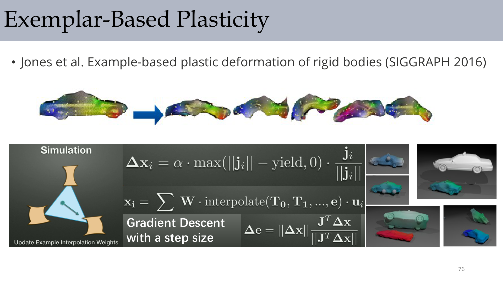

它提醒我们：永久形变并不一定只能来自经典连续体本构，也可以来自样例驱动或学习式表达。

## 6. Exam Review
### A. 必须准确说出的定义
- **Broad phase**：廉价的保守剪枝阶段，允许 false positive，但不能漏掉真实碰撞。
- **DCD**：在若干离散采样状态上检查是否相交。
- **CCD**：在整个时间区间内检查是否曾经发生相交。
- **Interior point collision response**：通过 barrier 优化下一状态，使运动路径不穿过碰撞约束。
- **IPC**：把接触 barrier 加入隐式欧拉能量最小化后的连续响应框架。
- **Plasticity**：材料超过弹性范围后留下的永久形变。
- **Fracture**：由足够强的应力或形变驱动的拓扑分离。

### B. 应记住的机制链条
1. Broad phase：廉价包围或空间过滤 $\rightarrow$ 候选对。
2. Narrow phase：精确图元测试 $\rightarrow$ 确认碰撞信息。
3. 连续响应：把 $\mathbf{x}^{[1]}$ 改成 $\bar{\mathbf{x}}^{[1]}$，使整段路径无相交。
4. 塑性：算应变 $\rightarrow$ 分出弹性/塑性部分 $\rightarrow$ 应用屈服规则 $\rightarrow$ 更新永久形变。
5. 断裂：算应力 $\rightarrow$ 构造裂纹驱动量 $\rightarrow$ 与韧性比较 $\rightarrow$ 决定切开或富集表示。

### C. 简答模板
- 为什么 broad phase 可以不精确？
因为它追求的是保守而不是精确。false positive 只会增加 narrow phase 工作量；false negative 则会直接漏掉真实碰撞。

- 为什么 CCD 比 DCD 贵？
因为 CCD 要在整个时间区间内解碰撞时刻，常常涉及求根和额外的 inside test，而不是只看几个离散状态。

- 为什么 IPC 比较鲁棒？
因为接触被写进了优化目标里的 barrier potential，同时每次更新又由 CCD 裁步，所以整段更新路径都会被约束为无相交。

- 为什么 remeshing 断裂更贵？
因为一旦出现裂纹，拓扑结构本身就变了，所以不仅要更新状态变量，还要维护新的离散化与单元质量。

### D. 常见误区
- 误以为 broad phase 必须精确。
- 忘了“与平面相交”并不等于“与三角形或线段真正相交”。
- 误以为 DCD 足以保证快速运动物体不穿透。
- 写了 barrier 项，却在没有 CCD 安全裁步的情况下直接走完整 Newton 步。
- 把 Cauchy stress 和 PK stress 当成同一配置下的量混用。
- 把塑性和断裂看成同一件事。

### E. 自检问题
1. 为什么 AABB sweep-and-prune 能做到 $O(n\log n+k)$，而不是暴力 $O(n^2)$？
2. 在 CCD 里解出共面时刻后，为什么还需要额外测试？
3. 为什么 cloth-cloth untangling 比 volume push-out 更难？
4. IPC 里的 contact barrier 到底起什么作用？
5. $\sigma_t=F/A$ 和 $\mathbf{P}=F/A_0$ 在概念上有什么区别？
6. 在本讲的塑性/断裂模型里，$\gamma_1$、$\gamma_2$ 和 $\tau$ 分别控制什么？

:::remark 自检参考答案
1. 因为投影区间排序只要 $O(n\log n)$，真正进入候选集的只剩下重叠区间对，其数量记为 $k$。
2. 因为还必须做 inside test，例如顶点是否真的落在三角形内部，或两条线段是否在线段有限范围内相交。
3. 因为布料没有统一明确的 inside/outside 定义，而且步内漏检、褶皱和边界都会让 disentangle 更不稳定。
4. 它会在穿透发生前就把靠近接触的配置变得非常昂贵，从而把 non-penetration 转成适合优化处理的能量项。
5. Cauchy stress 用当前变形后的面积度量单位面积受力；PK stress 用参考配置面积度量单位面积受力。
6. $\gamma_1$ 是屈服阈值，$\gamma_2$ 用来限制累计塑性应变，$\tau$ 是断裂韧性阈值。
:::
