# Lec13 AI for Physics and Physics for AI

## 1. Big Picture
This lecture asks two complementary questions:

1. How can AI help us represent, simulate, and even discover physics?
2. How can ideas from physics help us design better AI models and theory?

A clean map is:

- `AI for Physics`: use learning to represent states, accelerate simulation, regularize ill-posed tasks, solve inverse problems, and assist scientific discovery.
- `Physics for AI`: borrow physical mechanisms and mathematical viewpoints to build generative models, learning theory, and optimization methods.

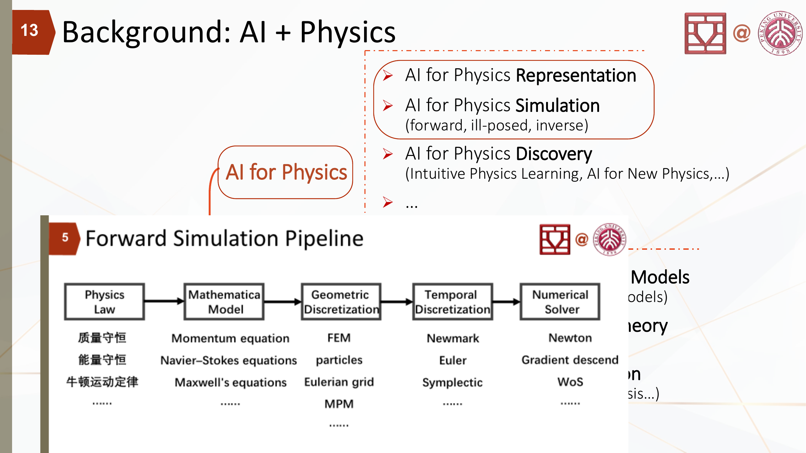

The important mindset is that this is not a "simulation versus learning" lecture. It is a lecture about interfaces:

- between equations and data,
- between structure and flexibility,
- between forward prediction and inverse inference,
- between scientific modeling and modern machine learning.

## 2. Why Combine AI and Physics?
### 2.1 From Empirical Science to Data-Driven Science
A historical motivation is the four-paradigm view of science:

- empirical science: observe and record phenomena;
- theoretical science: explain them with laws and equations;
- computational science: simulate those laws numerically;
- data-driven science: learn from large-scale data when explicit modeling is incomplete, expensive, or partially unknown.

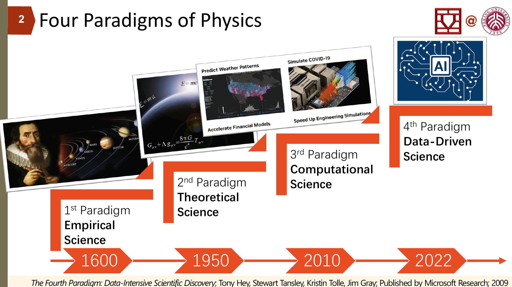

Physics simulation already lives in the third paradigm, but many modern tasks naturally spill into the fourth:

- measurements are sparse,
- parameters are uncertain,
- geometry is complicated,
- scales are too large for brute-force computation,
- and some goals are inverse rather than forward.

### 2.2 What a Forward Simulator Actually Does
A forward simulator starts from three ingredients:

- a representation of geometry and state,
- physical laws such as conservation laws or constitutive models,
- numerical algorithms that discretize and solve the resulting equations.

It then advances the system in time to produce trajectories, deformations, flow fields, or coupled multi-physics behavior.

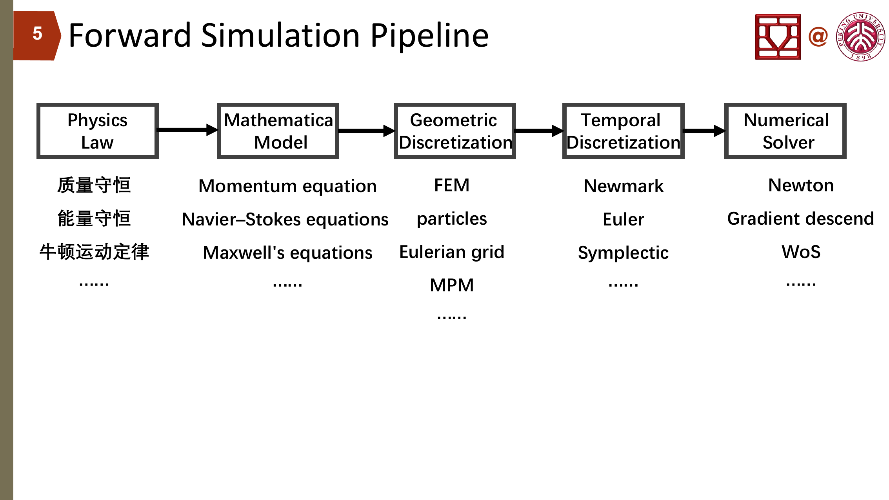

The lecture highlights typical targets such as:

- deformable bodies,
- thin shells and cloth,
- fluids,
- granular and multi-phase systems,
- coupled phenomena across different physical domains.

### 2.3 Numerical Simulation, Learning, and Hybrid Methods
Pure numerical simulation has strong interpretability and physical guarantees, but it can be slow, brittle, and hard to use when the world is only partially observed. Pure deep learning is flexible and data-adaptive, but it may violate physical constraints or generalize poorly outside the training distribution.

Hybrid methods try to keep the best of both:

- use simulation to provide structure, priors, and differentiable constraints;
- use learning to provide speed, missing information, or expressive surrogates;
- use both together when either one alone is inadequate.

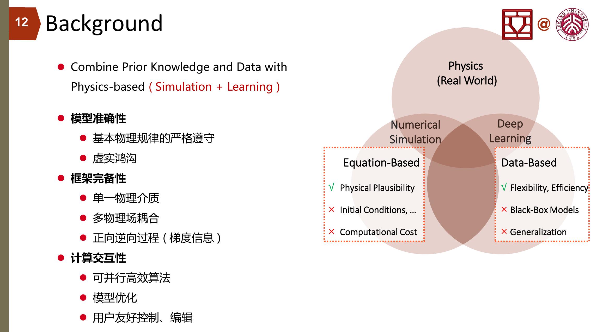

:::remark Key Question (original intent): Why not simply replace numerical simulation with deep learning?
Because the two methods fail in different ways. Numerical simulation is structured but often expensive and incomplete; deep learning is flexible but can ignore conservation laws, struggle out of distribution, and require large amounts of data. The combined route is attractive precisely because many graphics and physics tasks need both inductive bias and adaptability.
:::

## 3. AI for Physics Representation
### 3.1 Explicit Representations
The first place AI meets physics is representation.

Classical simulation uses explicit state layouts such as:

- Eulerian grids for field quantities like pressure, density, and velocity;
- particles for Lagrangian samples of mass, momentum, or material points;
- meshes for surfaces, shells, and deformable solids.

These explicit structures suggest different learning backbones:

- grids pair naturally with CNNs, U-Nets, and ResNets;
- particles pair naturally with PointNet-style, graph, and continuous convolution methods;
- meshes pair naturally with graph neural networks, mesh convolutions, and topology-aware architectures.

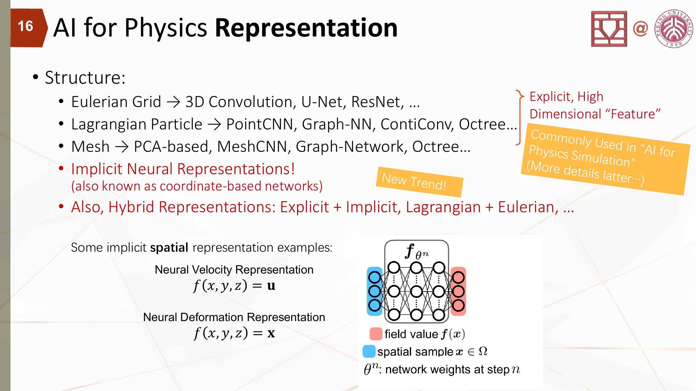

The main lesson is simple: representation is not a cosmetic choice. It decides what locality, invariance, connectivity, and resolution the model can exploit.

### 3.2 Implicit Neural Representations
A newer direction is to store the physical state in a coordinate-based neural field rather than in a fixed discrete array.

Typical examples are:

$$
 f(x,y,z)=\mathbf{u}
$$

for a neural velocity field, or

$$
 f(x,y,z)=\mathbf{x}
$$

for a neural deformation map.

Instead of saying "the value lives only on grid nodes or mesh vertices," we say "the network can be queried at any spatial coordinate." That gives:

- continuous spatial access,
- resolution independence at inference time,
- a natural way to represent complicated geometry or fields.

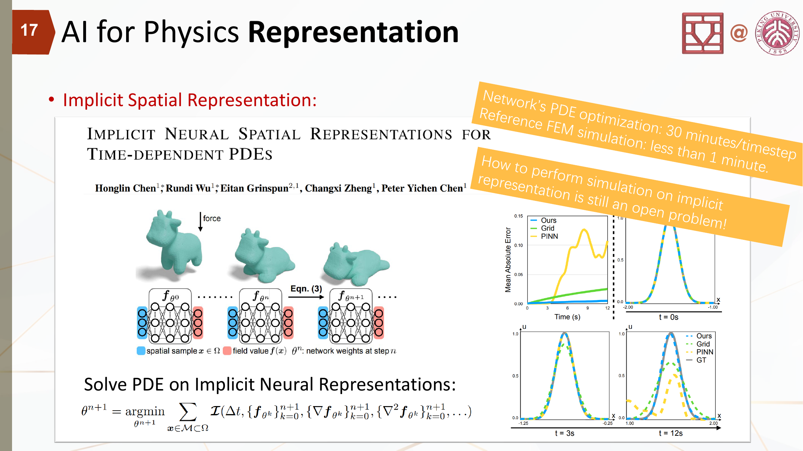

The lecture also points to an ambitious extension: solve PDEs directly on implicit neural representations. A representative optimization form is

$$
\theta^{n+1}=\arg\min_{\theta^{n+1}}\sum_{x\in\mathcal{M}\subset\Omega}\mathcal{I}\!\left(\Delta t,\{f_{\theta^{k}}\}_{k=0}^{n+1},\{\nabla f_{\theta^{k}}\}_{k=0}^{n+1},\{\nabla^2 f_{\theta^{k}}\}_{k=0}^{n+1},\ldots\right).
$$

This says: optimize network parameters so the represented field satisfies the PDE residual and time-stepping constraints.

### 3.3 Hybrid Representations
The lecture does not argue that implicit representations should replace explicit ones everywhere. In practice, many strong methods are hybrid:

- explicit geometry + implicit field,
- particles + grid,
- Lagrangian motion + Eulerian solve,
- neural surrogate inside a classical solver.

That hybrid view matters because simulation is not only about expressing a state. It is also about applying local operators, enforcing constraints, and solving sparse numerical subproblems efficiently.

:::remark Key Question (original intent): Why can implicit representations be expressive yet still difficult for simulation?
Because expressiveness and solver-friendliness are different goals. A neural field can represent a continuous function compactly, but PDE solvers still need derivatives, constraints, stability control, and efficient optimization. Representing a field continuously does not automatically make time integration or constraint enforcement easy.
:::

## 4. AI for Physics Simulation
### 4.1 Accelerating Forward Problems
The first major simulation role is speed.

The lecture emphasizes three forward-learning patterns.

First, a model can learn a **solution operator**:

$$
\{\mathbf{x}_0,\dot{\mathbf{x}}_0,\ldots\}+\{bc\}\xrightarrow{\mathrm{AI}}\{\mathbf{x}_t,\dot{\mathbf{x}}_t,\ldots\}.
$$

Here the network maps initial and boundary conditions directly to the final or full solution.

Second, a model can learn a **time evolution operator**:

$$
\{\mathbf{x}_{t-1},\dot{\mathbf{x}}_{t-1},\ldots\}+\{bc\}\xrightarrow{\mathrm{AI}}\{\mathbf{x}_t,\dot{\mathbf{x}}_t,\ldots\}.
$$

Here the network predicts one step from the current state, like a learned simulator.

Third, a model can improve an existing simulator by doing:

- super-resolution,
- correction,
- projection,
- or substep replacement for expensive components.

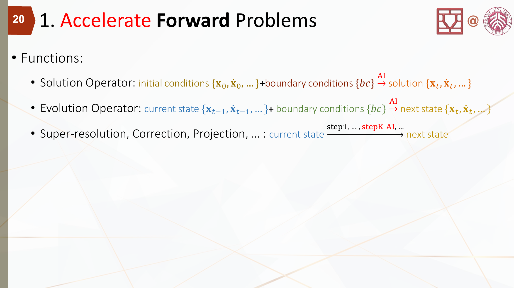

A strong example is fluid super-resolution: run a cheaper low-resolution simulation, then infer a high-resolution result with learned temporal coherence.

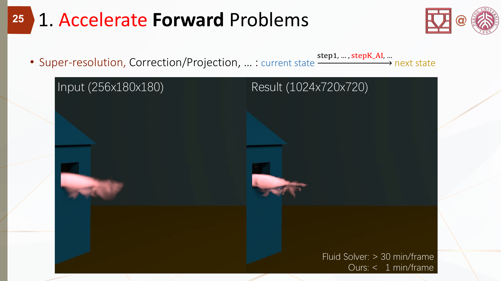

The point is not only raw speed. It is also that some operators are expensive because they repeatedly solve similar mappings. Learning those mappings can amortize cost across many runs.

:::remark Key Question (original intent): What is the practical difference between a solution operator and a time evolution operator?
A solution operator jumps from problem setup to solution, so it behaves like a direct map from conditions to outcomes. A time evolution operator advances state by state, so it behaves like a learned integrator. The former is attractive when the whole mapping is stable and reusable; the latter is attractive when sequential rollout and interaction matter.
:::

### 4.2 Regularizing Ill-Posed Problems
Many tasks are not missing compute. They are missing information.

A problem is ill-posed when at least one of the usual guarantees fails:

- a solution may not exist,
- it may not be unique,
- or it may not depend stably on the input.

The lecture organizes several strategies.

#### A. Data Complement
Add missing information through learned priors or completion models. This is useful when observations are sparse, noisy, low-resolution, or incomplete.

#### B. Data Translation
Translate from an easier observation space to a more meaningful control or state space.

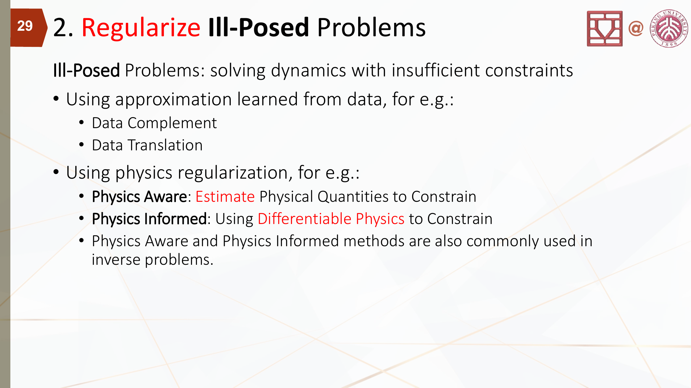

A fluid-control example maps between density observations and velocity/control variables so that the prediction becomes more physically meaningful and editable.

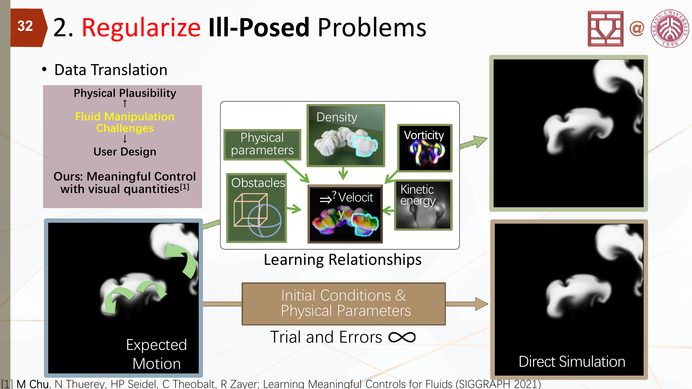

#### C. Physics-Aware Learning
A physics-aware method estimates latent physical quantities or parameters and uses them to constrain learning.

The lecture's example writes

$$
\mathbf{u}_t=\mathrm{Generator}(d_t,\ldots),
$$

with a physically structured last layer

$$
\mathbf{u}_t=\nabla\times\phi,
$$

and advection consistency

$$
 d_{t+1}=\mathrm{Advection}(d_t,\mathbf{u}_t).
$$

Optional conditions such as physical parameters, kinetic energy, or vorticity can be injected so the learned controller is not just visually plausible, but meaningfully steerable.

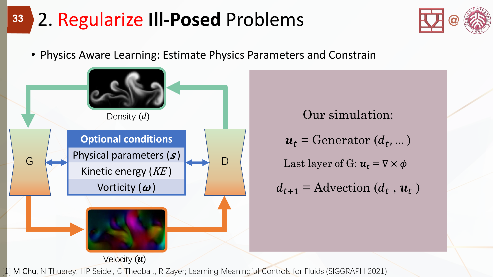

A related generalization test is whether the learned model still behaves sensibly when the physical parameter regime changes.

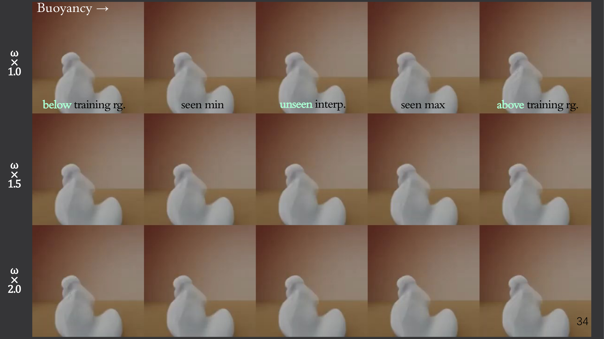

#### D. Physics-Informed Learning and Differentiable Physics
A physics-informed method goes further: it directly uses equations, residuals, or differentiable simulation operators inside optimization or training.

Typical tools include:

- differentiable physics engines,
- PINNs,
- differentiable elastodynamics and fluid solvers,
- automatic differentiation or accurate finite-difference variants for gradients.

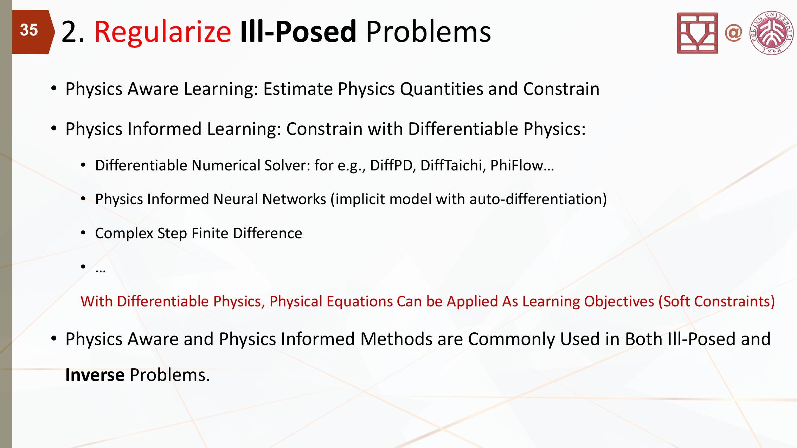

This is the right viewpoint when learning should not merely predict physics-flavored outputs, but must satisfy physical laws during training or inference.

:::remark Key Question (original intent): What is the difference between physics-aware and physics-informed learning?
Physics-aware learning uses physical quantities, parameters, or architecture choices to guide the model. Physics-informed learning directly inserts physical equations or differentiable simulators into the optimization objective or computational graph. In short: aware means "guided by physics," while informed means "constrained by physics during training or solving."
:::

### 4.3 Resolving Inverse Problems
Inverse problems reverse the arrow of simulation.

Instead of predicting outcomes from known conditions, we try to infer hidden causes from observations:

- unknown parameters,
- unknown forces,
- unknown states,
- unknown geometry,
- or control signals that explain measured phenomena.

The lecture stresses why real-world inverse problems are hard:

- observations are sparse or partial,
- scenes contain complex coupled physics,
- measurements are noisy,
- and many different latent states can explain similar observations.

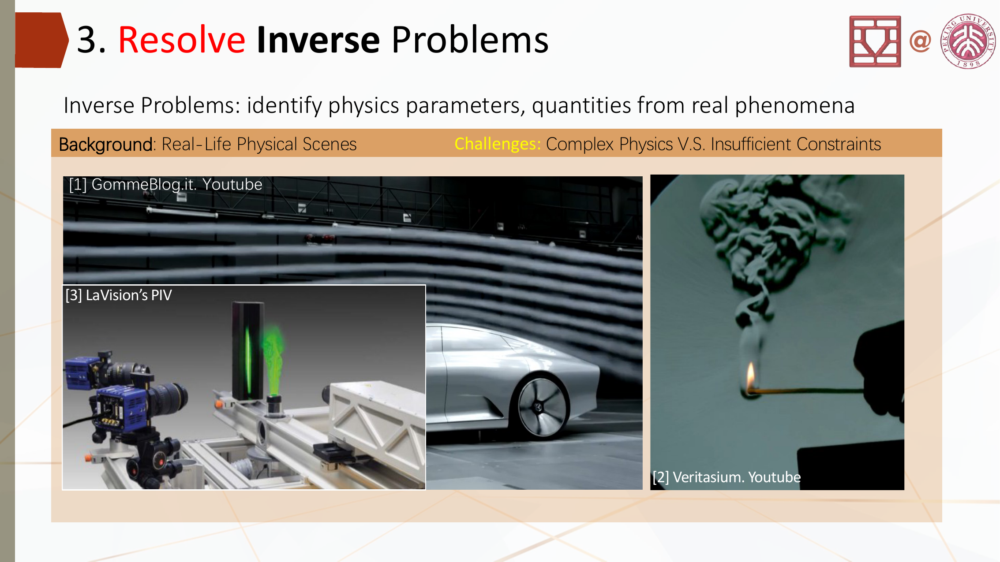

A representative dataset example is ScalarFlow, where only sparse RGB views are available.

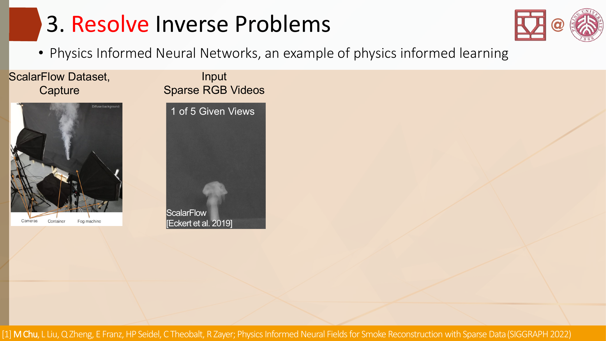

A physics-informed neural-field formulation can represent both appearance and dynamics:

$$
 f(x,y,z,t)=(\sigma,\mathbf{c}),
$$

$$
 f(x,y,z,t)=\mathbf{u},
$$

or more explicitly

$$
 f_{vis}(x,y,z,t)=(\sigma,\mathbf{c}),\qquad f_{vel}(x,y,z,t)=(u,v,w).
$$

Automatic differentiation then provides quantities such as

$$
\frac{\partial \mathbf{u}}{\partial t},\quad \frac{\partial \sigma}{\partial t},\quad \nabla \mathbf{u},\quad \nabla \sigma,\ldots
$$

which can be penalized through fluid priors:

$$
\frac{\partial \mathbf{u}}{\partial t}+\mathbf{u}\cdot\nabla\mathbf{u}=-\frac{1}{\rho}\nabla p+\nu\nabla\cdot\nabla\mathbf{u}+\mathbf{f},
$$

$$
\nabla\cdot\mathbf{u}=0,
$$

$$
\frac{\partial \sigma}{\partial t}+\mathbf{u}\cdot\nabla\sigma=0.
$$

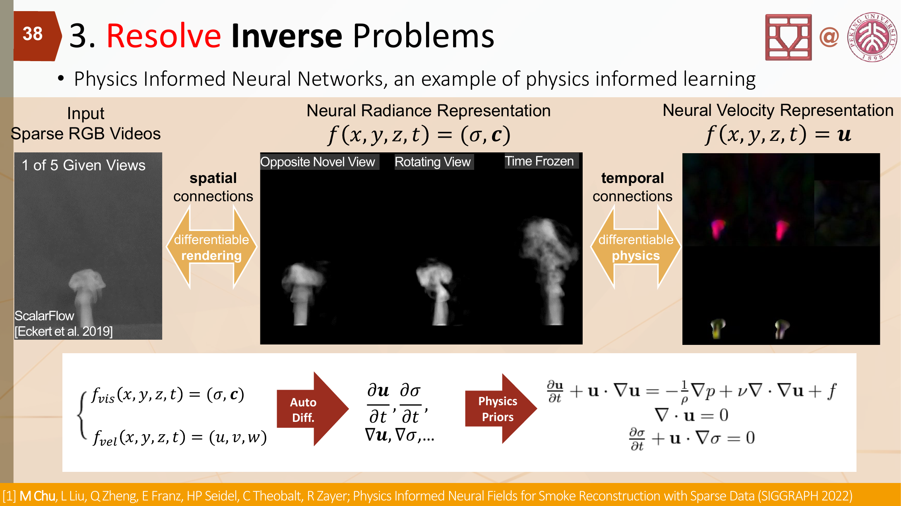

The lecture also reminds us that inverse problems are not only solved by gradient-based physics-informed fitting. Reinforcement learning is another route when the task is better expressed as sequential decision-making or control.

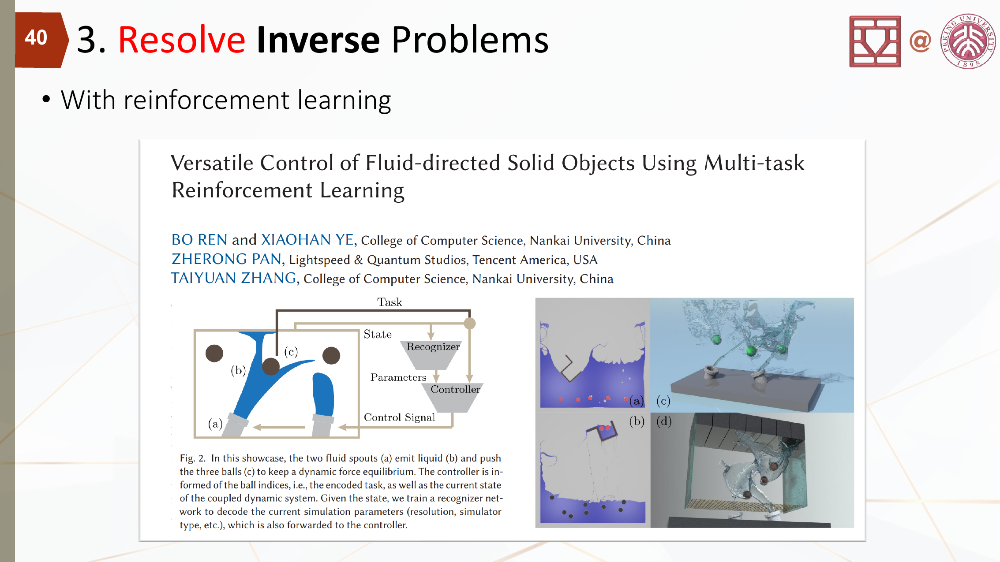

:::remark Key Question (original intent): Why are inverse problems much harder in the real world than in clean benchmark settings?
Because real observations are incomplete, noisy, and ambiguous, while the underlying physics may be high-dimensional and coupled. The map from cause to observation is many-to-one, so reversing it is fundamentally unstable unless we add priors, regularization, or additional physical structure.
:::

### 4.4 Summary and Open Problems
The lecture summarizes three major AI-for-simulation roles:

1. surrogate models for forward acceleration,
2. differentiable physics and PINN-style constraints,
3. reinforcement learning and optimization for control or inverse tasks.

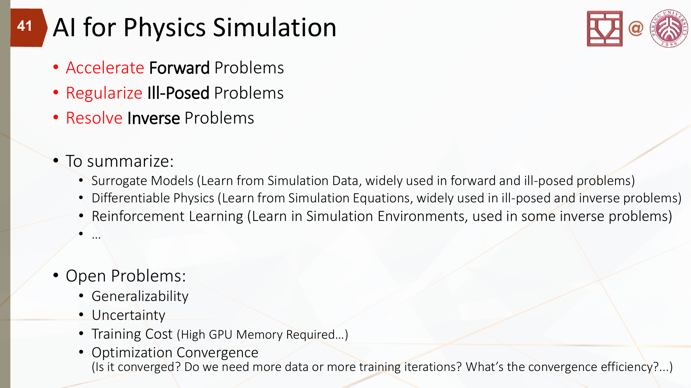

Open problems remain substantial:

- generalizability across scenes, resolutions, and parameter ranges,
- uncertainty estimation and reliability,
- convergence efficiency,
- training cost,
- and how much data versus how much physical structure is actually needed.

:::remark Key Questions (original wording/intent): Is it converged? Do we need more data or more training iterations? What is the convergence efficiency? Is it generalizable? Is there certainty?
These questions are still central because learning-based physics systems often mix approximation error, optimization error, model bias, and data bias. A method is not mature merely because it produces plausible videos; we want stable training, believable uncertainty, and performance that survives beyond the exact training distribution.
:::

## 5. AI for Physics Discovery
Physics simulation is not only about prediction. It can also become a tool for discovery.

The lecture groups several discovery directions:

- intuitive or qualitative physics: learning commonsense physical behavior;
- symbolic physics: recovering interpretable equations or rules;
- new physics: using AI to help identify unknown mechanisms or scientific patterns;
- causal learning: separating correlation from cause-effect structure;
- invariant learning: discovering quantities or symmetries that stay stable across conditions;
- active learning or AI scientists: choosing experiments adaptively;
- world models: learning internal predictive models of environments;
- neurosymbolic methods: combining neural flexibility with symbolic structure.

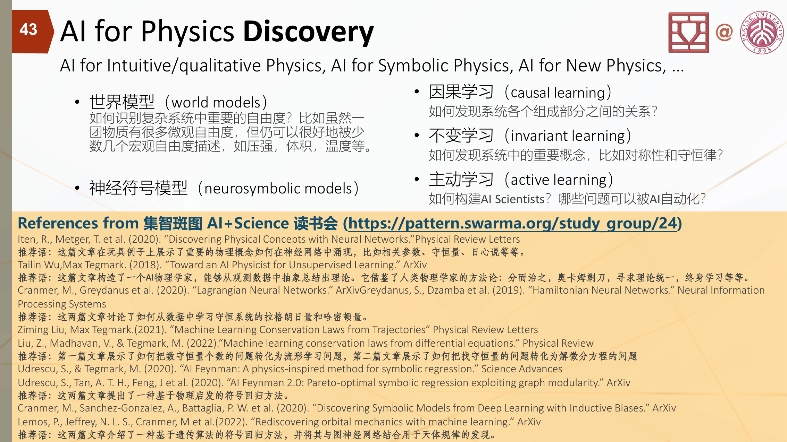

These directions differ in output, but they share a common ambition: move from fitting observed data to extracting reusable scientific structure.

:::remark Key Question (original intent): What does “discovery” mean here if we already have data and simulators?
Discovery means learning something structurally new rather than merely matching observations. That “something” could be a latent law, a causal relation, an invariant, a symbolic expression, or an experimentally useful hypothesis. In other words, the target is scientific insight, not only predictive accuracy.
:::

## 6. Physics for AI
### 6.1 Physics-Inspired Generative Models
The interaction also runs in the opposite direction: physical ideas can inspire AI itself.

A flagship example is the diffusion model. It borrows intuition from diffusion processes:

- a forward process gradually corrupts data with noise,
- a reverse process learns to undo that corruption step by step.

The slide writes the forward Markov transition as

$$
q(\mathbf{x}_t\mid \mathbf{x}_{t-1})
$$

and the learned reverse transition as

$$
p_{\theta}(\mathbf{x}_{t-1}\mid \mathbf{x}_t).
$$

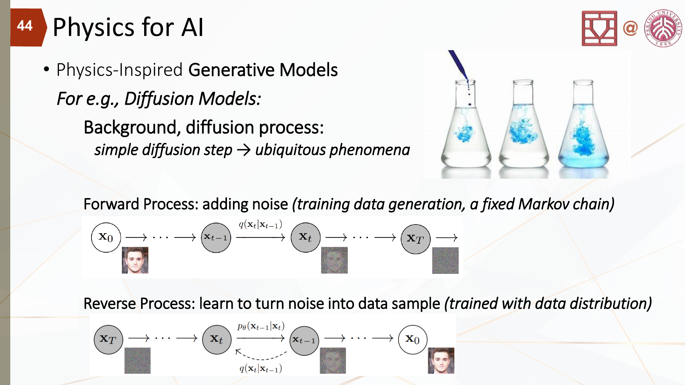

The reason this is physics-inspired is not that it literally simulates fluid or solid mechanics. It is that it turns a simple physical process idea, diffusion, into a tractable generative modeling framework.

:::remark Key Question (original intent): Why are diffusion models considered physics-inspired rather than just another neural architecture?
Because their construction is organized around a physical process metaphor: repeated stochastic diffusion forward, learned reversal backward. The mathematics of time evolution, noise injection, and reverse dynamics is the design principle, not an afterthought.
:::

### 6.2 Physics-Inspired Learning Theory and Optimization
Physics also contributes theoretical viewpoints.

A key example is operator learning. Classical universal approximation usually talks about functions such as

$$
F:x\mapsto F(x),\qquad (x,y)\mapsto F(x,y).
$$

But many scientific tasks are naturally operator-valued:

$$
G:u(x)\mapsto G(u)(y).
$$

That means the input is itself a function, and the output is another function conditioned on it.

The lecture uses this to motivate physics-inspired learning theory: we often care less about isolated scalar maps and more about mappings between spaces of fields, signals, or boundary-value problems.

It also highlights physics-inspired optimization themes such as:

- momentum and energy viewpoints,
- convergence-rate analysis,
- acceleration mechanisms,
- and dynamical-system interpretations of training.

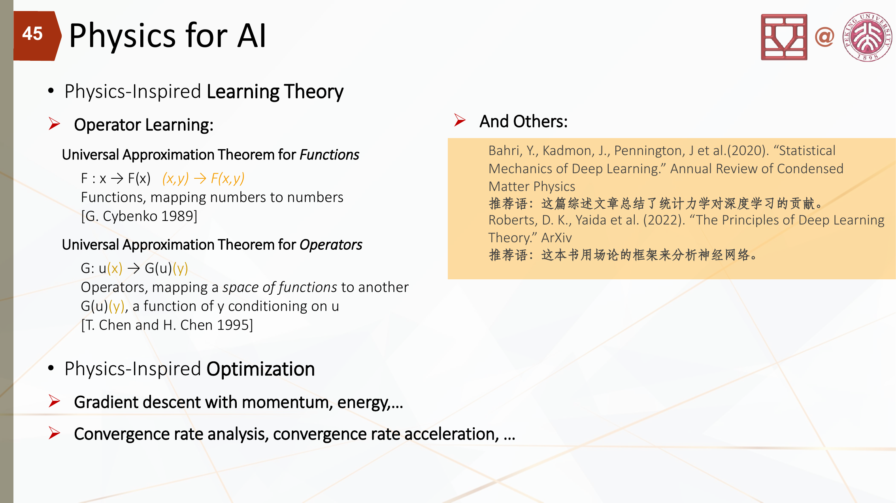

:::remark Key Question (original intent): Why is operator learning a stronger abstraction than ordinary function approximation?
Because many physical problems do not map a few numbers to a few numbers. They map one field, signal, or boundary condition function to an entire solution function. Operator learning targets that higher-level object directly, which is much closer to how PDE solvers and scientific models are actually used.
:::

## 7. Exam Review
### A. Definitions You Should State Precisely
- **AI for Physics**: using machine learning to represent, simulate, infer, or discover physical systems.
- **Physics for AI**: using physical principles and mathematical viewpoints to design AI models, theory, or optimization.
- **Solution operator**: a map from initial/boundary conditions directly to a solution.
- **Time evolution operator**: a map from the current state to the next state.
- **Physics-aware learning**: learning guided by physical quantities, parameters, or structure.
- **Physics-informed learning**: learning constrained by explicit equations, residuals, or differentiable simulation.
- **Inverse problem**: infer hidden causes, parameters, or states from observations.
- **Operator learning**: learn mappings between function spaces rather than ordinary pointwise scalar maps.

### B. Mechanism Chains to Memorize
1. Explicit representation choice $\rightarrow$ model inductive bias $\rightarrow$ learnable locality/connectivity.
2. Implicit neural field $\rightarrow$ continuous query $\rightarrow$ derivative-based constraints $\rightarrow$ PDE fitting or solving.
3. Forward acceleration $\rightarrow$ learn solution/evolution/correction operator $\rightarrow$ amortize repeated simulation cost.
4. Ill-posed regularization $\rightarrow$ add priors, hidden physical variables, or differentiable equations $\rightarrow$ reduce ambiguity.
5. Inverse problem solving $\rightarrow$ match observations + enforce physics $\rightarrow$ infer latent causes.
6. Physics for AI $\rightarrow$ diffusion/operator/optimization viewpoints $\rightarrow$ better model design and theory.

### C. Short-Answer Templates
- Why are hybrid simulation-learning methods attractive?
Because simulation provides structure and physical bias, while learning provides speed, priors, and flexibility for missing or expensive components.

- What is the difference between physics-aware and physics-informed learning?
Physics-aware learning uses physical quantities or structure to guide the model; physics-informed learning directly constrains optimization with equations or differentiable simulation.

- Why is inverse inference unstable without regularization?
Because many latent physical states can explain the same sparse observation, so the inverse map is ambiguous and noise-sensitive.

- Why is operator learning important for scientific machine learning?
Because many scientific tasks map functions to functions, not just vectors to vectors, so operator learning matches the real abstraction level of PDE problems.

- Why do diffusion models belong in this lecture?
Because they show the reverse influence: a physical process idea can become the organizing principle of a powerful AI model.

### D. Common Pitfalls
- Treating AI as a drop-in replacement for all numerical solvers.
- Forgetting that representation choice strongly affects what a model can generalize.
- Confusing super-resolution with physically faithful prediction.
- Calling a method physics-aware when it actually uses equation residuals and is physics-informed.
- Assuming inverse problems become easy once a neural network is added.
- Thinking operator learning is just ordinary regression with larger tensors.

### E. Self-Check Questions
1. Why do explicit grids, particles, and meshes naturally pair with different neural architectures?
2. What extra difficulty appears when we solve PDEs directly on an implicit neural representation?
3. When would you prefer a solution operator over a time evolution operator?
4. Why does adding physics variables or residuals help ill-posed problems?
5. Why can sparse-view smoke reconstruction benefit from both differentiable rendering and differentiable physics?
6. Why is operator learning closer to the needs of scientific computing than ordinary function approximation?

:::remark Self-check Reference Answers
1. Because each representation exposes a different notion of locality, connectivity, symmetry, and resolution, so the architecture should match that structure.
2. Representation alone is not enough; we still need stable differentiation, time integration, and constraint enforcement while optimizing network parameters.
3. Prefer a solution operator when repeated problem instances share a stable setup-to-solution map; prefer a time evolution operator when sequential rollout and interaction matter.
4. They shrink the space of plausible solutions by injecting physical structure, which reduces ambiguity and improves stability.
5. Differentiable rendering links the latent volume to image observations, while differentiable physics links the latent fields across time through conservation laws and PDE priors.
6. Because scientific solvers usually consume functions such as boundary conditions or fields and return solution functions, so function-to-function maps are the natural target.
:::
