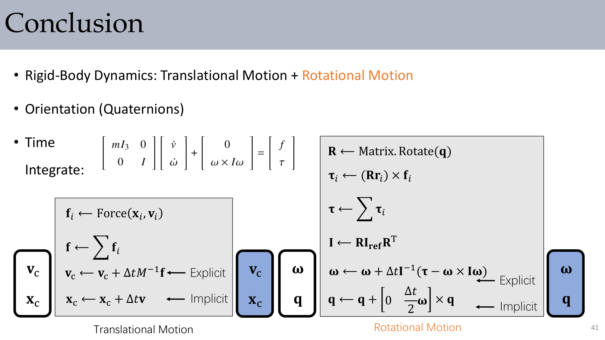
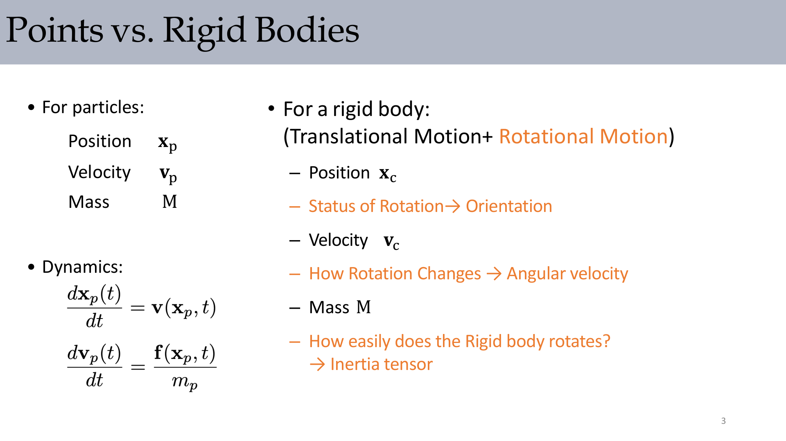
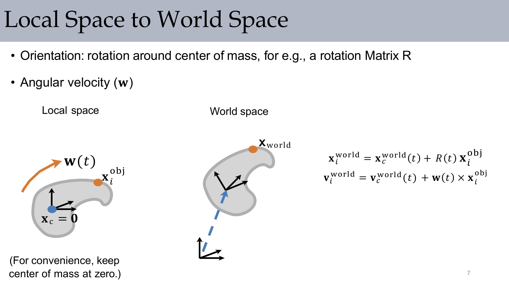
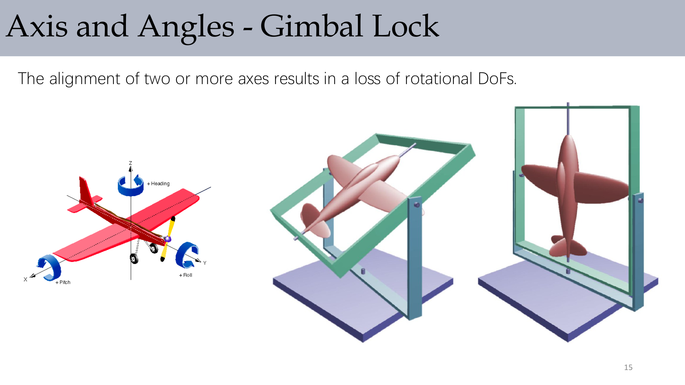
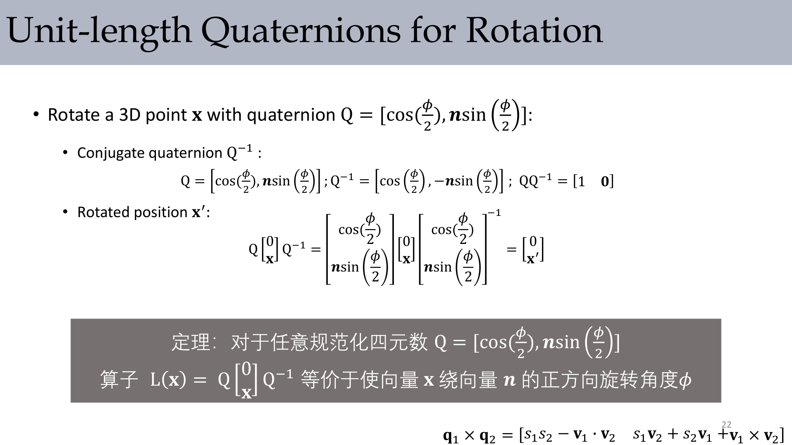
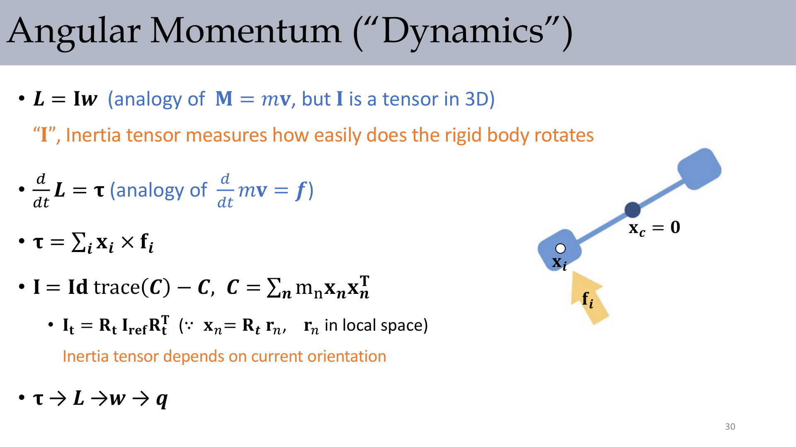
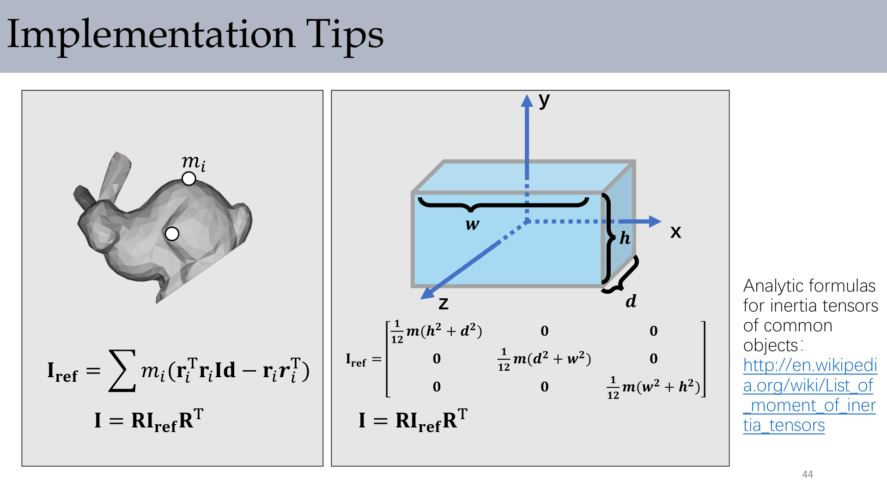

# Lec2 Rigid Body Dynamics: Orientation, Inertia, and Time Integration

## 1. Why This Lecture Matters

Rigid-body simulation is the first place where translational and rotational dynamics must be solved together. In graphics, this is the core for spinning objects, collisions, articulated systems, and believable motion.

In this lecture, one simulation step is organized as:

1. Evaluate forces on sample points.
2. Aggregate translational quantities.
3. Compute torques and inertia in world space.
4. Integrate orientation and angular velocity.

:::remark Key Question: Why can we not treat a rigid body as a single particle?
A particle model only tracks position and linear velocity. A rigid body also needs orientation, angular velocity, and inertia tensor, because different mass distributions respond differently to torque.
:::

## 2. Particle vs. Rigid Body State

Compared with a particle, a rigid body introduces rotational state:

- Center of mass position $\mathbf{x}_c$
- Center of mass velocity $\mathbf{v}_c$
- Orientation (matrix / Euler angles / quaternion)
- Angular velocity $\boldsymbol{\omega}$
- Mass $M$
- Inertia tensor $\mathbf{I}$

A practical decomposition is:

- Translational motion of center of mass
- Rotational motion around center of mass

## 3. Translational Motion of the Center of Mass

The center of mass behaves like a mass point with total mass. The lecture gives:

$$
\mathbf{x}_c = \frac{\sum_i m_i\mathbf{x}_i}{\sum_i m_i},
\quad
\mathbf{v}_c = \frac{\sum_i m_i\mathbf{v}_i}{\sum_i m_i},
\quad
\mathbf{a}_c = \frac{\sum_i m_i\mathbf{a}_i}{\sum_i m_i}
$$

Force accumulation and explicit update are:

$$
\mathbf{f}=\sum_i\mathbf{f}_i,
\quad
\mathbf{v}_c \leftarrow \mathbf{v}_c + \Delta t\,M^{-1}\mathbf{f},
\quad
\mathbf{x}_c \leftarrow \mathbf{x}_c + \Delta t\,\mathbf{v}_c
$$

## 4. Local Space to World Space

Keep the body-frame center at origin and map local points to world:

$$
\mathbf{x}^{\mathrm{world}}_i = \mathbf{x}^{\mathrm{world}}_c + \mathbf{R}\,\mathbf{x}^{\mathrm{obj}}_i
$$

Velocity of a material point is

$$
\mathbf{v}^{\mathrm{world}}_i = \mathbf{v}^{\mathrm{world}}_c + \boldsymbol{\omega}\times(\mathbf{R}\,\mathbf{r}_i)
$$

This equation is the bridge from geometric orientation to physical velocity.

## 5. Orientation Representations and Their Trade-offs

### 5.1 Rotation Matrix

Key properties:

- **Columns are unit vectors and mutually orthogonal**
- $\mathbf{R}^{-1}=\mathbf{R}^{\mathsf{T}}$
- Preserves lengths, angles, and handedness

Pros: direct for vertex transformation.  
Cons for dynamics: 9 parameters for 3 DoFs, and time derivative handling is not convenient.

### 5.2 Euler/Tait-Bryan Angles

They are intuitive for control and UI, but can suffer from gimbal lock.

:::warn Key Question: What is gimbal lock in simulation terms?
When two rotation axes align, one rotational DoF is lost locally. Then angle updates become ill-conditioned, and numerical integration can behave poorly.
:::

### 5.3 Quaternions

The lecture recommends unit quaternions for dynamics because:

- almost unique (only $\mathbf{q}$ and $-\mathbf{q}$ represent the same orientation)
- no gimbal lock
- efficient concatenation
- well-defined derivative with angular velocity

## 6. Quaternion Rotation and Algebra

Quaternion multiplication for $\mathbf{q}=(s,\mathbf{v})$:

$$
\mathbf{q}_1\otimes\mathbf{q}_2=
\big(s_1s_2-\mathbf{v}_1\cdot\mathbf{v}_2,\;s_1\mathbf{v}_2+s_2\mathbf{v}_1+\mathbf{v}_1\times\mathbf{v}_2\big)
$$

Unit quaternion for axis-angle $(\mathbf{n},\phi)$:

$$
\mathbf{Q}=\left[\cos\frac{\phi}{2},\;\mathbf{n}\sin\frac{\phi}{2}\right],
\qquad
\mathbf{Q}^{-1}=\left[\cos\frac{\phi}{2},\;-\mathbf{n}\sin\frac{\phi}{2}\right]
$$

Point rotation:

$$
[0,\mathbf{x}'] = \mathbf{Q}\otimes [0,\mathbf{x}]\otimes \mathbf{Q}^{-1}
$$

Consecutive rotations compose by multiplication order.

## 7. Angular Momentum, Torque, and Inertia Tensor

Core dynamics relations:

$$
\mathbf{L}=\mathbf{I}\boldsymbol{\omega},
\qquad
\frac{d\mathbf{L}}{dt}=\boldsymbol{\tau},
\qquad
\boldsymbol{\tau}=\sum_i\mathbf{x}_i\times\mathbf{f}_i
$$

Per-point torque in world space:

$$
\boldsymbol{\tau}_i=(\mathbf{R}\mathbf{r}_i)\times\mathbf{f}_i,
\qquad
\boldsymbol{\tau}=\sum_i\boldsymbol{\tau}_i
$$

Reference inertia tensor in local space:

$$
\mathbf{I}_{\mathrm{ref}}=\sum_i m_i\left((\mathbf{r}_i^{\mathsf{T}}\mathbf{r}_i)\mathbf{I}_3-\mathbf{r}_i\mathbf{r}_i^{\mathsf{T}}\right)
$$

Transform to world space:

$$
\mathbf{I}_t=\mathbf{R}_t\,\mathbf{I}_{\mathrm{ref}}\,\mathbf{R}_t^{\mathsf{T}}
$$

:::tip Key Question: Why must inertia be updated with orientation?
Because inertia in world coordinates depends on current orientation. If $\mathbf{I}$ is kept fixed while the body rotates, angular dynamics become physically inconsistent.
:::

## 8. Time Integration for Rotational Motion

Quaternion derivative driven by angular velocity:

$$
\frac{d\mathbf{q}}{dt}=\frac{1}{2}[0,\boldsymbol{\omega}]\otimes\mathbf{q}
$$

A practical explicit step:

$$
\mathbf{q}_{n+1}=\mathbf{q}_n+\frac{\Delta t}{2}[0,\boldsymbol{\omega}_n]\otimes\mathbf{q}_n,
\qquad
\mathbf{q}_{n+1}\leftarrow\frac{\mathbf{q}_{n+1}}{\|\mathbf{q}_{n+1}\|}
$$

For angular velocity, lecture concludes with Euler rigid-body update:

$$
\boldsymbol{\omega}_{n+1}=\boldsymbol{\omega}_n+\Delta t\,\mathbf{I}^{-1}\left(\boldsymbol{\tau}_n-\boldsymbol{\omega}_n\times(\mathbf{I}\boldsymbol{\omega}_n)\right)
$$

This is the rotational analog of explicit/implicit translational updates, but with nonlinearity from $\boldsymbol{\omega}\times(\mathbf{I}\boldsymbol{\omega})$.

## 9. Implementation Notes from the Lecture

- Implement translation first, then add rotation.
- A good sanity check is constant $\mathbf{L}$ spin (no external torque).
- **Gravity does not generate torque if applied at center of mass.**
- Renormalize quaternion periodically.
- Keep clear separation of local-space precomputation ($\mathbf{I}_{\mathrm{ref}}$) and per-step world conversion ($\mathbf{I}_t$).

## 10. Formula Sheet (Lecture-Aligned)

- $\mathbf{x}_c=\dfrac{\sum_i m_i\mathbf{x}_i}{\sum_i m_i}$
- $\mathbf{v}_c\leftarrow\mathbf{v}_c+\Delta t\,M^{-1}\mathbf{f}$, $\mathbf{x}_c\leftarrow\mathbf{x}_c+\Delta t\,\mathbf{v}_c$
- $\mathbf{x}^{\mathrm{world}}_i=\mathbf{x}^{\mathrm{world}}_c+\mathbf{R}\mathbf{x}^{\mathrm{obj}}_i$
- $\mathbf{R}^{-1}=\mathbf{R}^{\mathsf{T}}$
- $\mathbf{q}_1\otimes\mathbf{q}_2$
- $[0,\mathbf{x}']=\mathbf{Q}\otimes[0,\mathbf{x}]\otimes\mathbf{Q}^{-1}$
- $\mathbf{L}=\mathbf{I}\boldsymbol{\omega}$, $\dfrac{d\mathbf{L}}{dt}=\boldsymbol{\tau}$
- $\mathbf{I}_{\mathrm{ref}}=\sum_i m_i((\mathbf{r}_i^{\mathsf{T}}\mathbf{r}_i)\mathbf{I}_3-\mathbf{r}_i\mathbf{r}_i^{\mathsf{T}})$
- $\mathbf{I}_t=\mathbf{R}_t\mathbf{I}_{\mathrm{ref}}\mathbf{R}_t^{\mathsf{T}}$
- $\dfrac{d\mathbf{q}}{dt}=\dfrac{1}{2}[0,\boldsymbol{\omega}]\otimes\mathbf{q}$
- $\boldsymbol{\omega}_{n+1}=\boldsymbol{\omega}_n+\Delta t\,\mathbf{I}^{-1}(\boldsymbol{\tau}_n-\boldsymbol{\omega}_n\times\mathbf{I}\boldsymbol{\omega}_n)$

## 11. Exam Review

### 11.1 High-Value Definitions

- **Rigid body state**: translational variables plus orientation, angular velocity, and inertia.
- **Torque**: rotational counterpart of force.
- **Inertia tensor**: rotational counterpart of mass in 3D.
- **Quaternion derivative**: kinematic link between angular velocity and orientation update.

### 11.2 Mechanism Checklist

1. Compute forces $\mathbf{f}_i$.
2. Integrate $\mathbf{v}_c,\mathbf{x}_c$.
3. Build $\mathbf{R}$ from quaternion.
4. Compute torque and world inertia.
5. Integrate $\boldsymbol{\omega}$ and quaternion.
6. Renormalize quaternion and continue.

### 11.3 Short-Answer Templates

- Why quaternion for dynamics?
Because it avoids gimbal lock, composes efficiently, and has a clean derivative with angular velocity.

- Why update $\mathbf{I}$ every step?
Because world-space inertia depends on current orientation.

- Why can gravity give zero torque?
If force acts through center of mass, the lever arm is zero.

### 11.4 Common Pitfalls

- Mixing local and world coordinates in torque calculation.
- Forgetting quaternion normalization.
- Treating inertia as a scalar in 3D rigid-body rotation.
- Using wrong multiplication order for consecutive quaternion rotations.

### 11.5 Self-Check Before Submission

1. Did I separate translation and rotation states clearly?
2. Did I define torque and inertia with correct coordinate space?
3. Did I include quaternion derivative and normalization?
4. Did I explain why $\mathbf{I}_t=\mathbf{R}\mathbf{I}_{\mathrm{ref}}\mathbf{R}^{\mathsf{T}}$?
5. Did I provide at least one physically meaningful sanity test?
