# 第3讲 刚体碰撞与 Shape Matching

## 1. 为什么这一讲重要

本讲补上了刚体仿真的关键环节：即便我们已经会做刚体积分，仍然需要可靠的碰撞与接触处理。课程把力方法、冲量方法、位置方法放在同一框架下比较，帮助你按目标选算法。

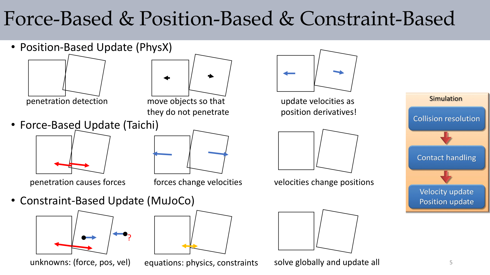

:::remark 关键问题：为什么有了运动方程，碰撞处理仍然困难？
因为接触会引入不连续和不等式约束。速度会瞬时跳变，穿透需要被阻止，摩擦还会耦合切向和法向运动。
:::

## 2. 碰撞与接触流程

课程反复使用的拆解是：

1. 碰撞检测
2. 碰撞响应
3. 持续接触处理

方法选择取决于目标：

- 游戏：优先稳定与速度
- 高保真仿真：冲量 + 约束联合
- 机器人与控制：偏好全局约束求解

## 3. 基于 SDF 的碰撞检测

### 3.1 Signed Distance Function 基础

**有符号距离函数** $\phi(\mathbf{x})$ 同时编码“距离”和“内外侧”：

- **$\phi(\mathbf{x}) > 0$**：外部
- **$\phi(\mathbf{x}) < 0$**：内部
- **$\phi(\mathbf{x}) = 0$**：表面

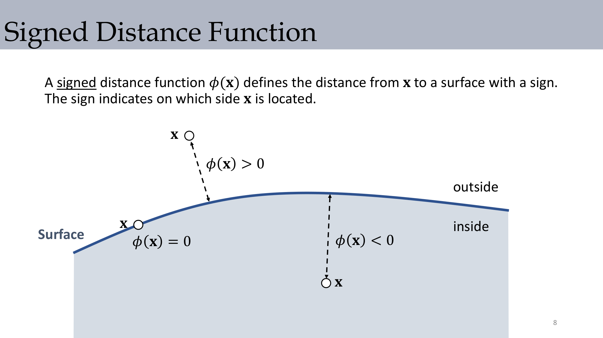

典型 SDF：

$$
\phi_{\text{plane}}(\mathbf{x})=(\mathbf{x}-\mathbf{p})\cdot\mathbf{n},
\qquad
\phi_{\text{sphere}}(\mathbf{x})=\lVert\mathbf{x}-\mathbf{c}\rVert-r
$$

### 3.2 通过 CSG 规则组合

多个隐式表面组合时：

$$
\phi_{\cap}(\mathbf{x})=\max_i\phi_i(\mathbf{x}),
\qquad
\phi_{\cup}(\mathbf{x})=\min_i\phi_i(\mathbf{x})
$$

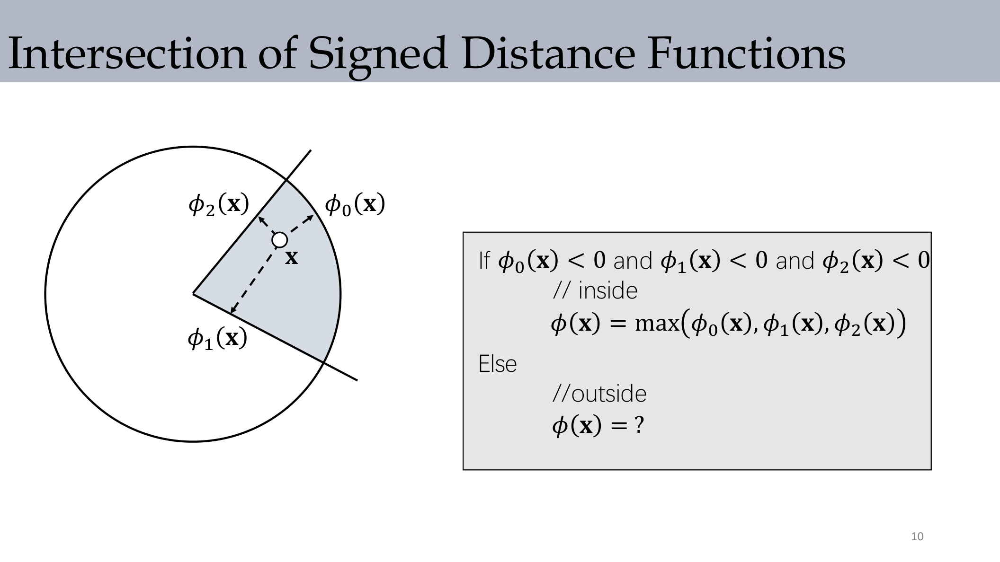

:::tip 关键问题：为什么交集用 max，并集用 min？
交集要求点对所有形体都在内部，所以要看“最不满足”的那一个，即最大值；并集只要进入任一形体即可，所以由最小值决定。
:::

## 4. 力方法中的 Penalty 家族

### 4.1 二次势能 Penalty

发生穿透后，沿法向施加恢复力：

$$
\mathbf{f}\leftarrow-k\,\phi(\mathbf{x})\,\mathbf{N},
\qquad
\mathbf{N}=\nabla\phi(\mathbf{x})
$$

其势能对穿透深度是二次型，因此接触附近近似线性弹簧。

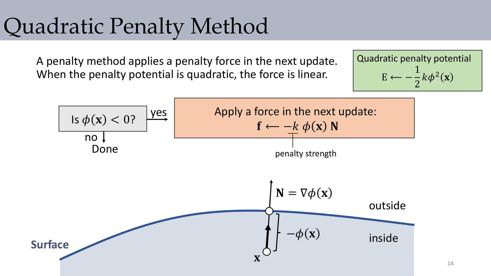

### 4.2 带 Buffer 的 Penalty

引入缓冲区 $\varepsilon$，在真正穿透前就激活惩罚：

$$
\text{if }\phi(\mathbf{x})<\varepsilon,\quad
\mathbf{f}\leftarrow k(\varepsilon-\phi(\mathbf{x}))\mathbf{N}
$$

它能减轻深穿透，但不能严格保证不穿透。

### 4.3 Log-Barrier Penalty

屏障型力：

$$
\mathbf{f}\leftarrow\rho\,\frac{1}{\phi(\mathbf{x})}\mathbf{N}
$$

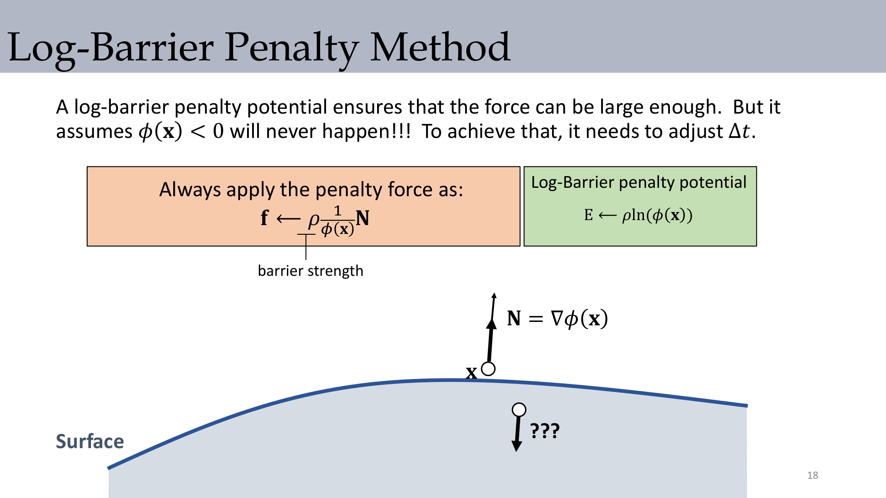

该力在边界附近可非常大，但前提是保持 $\phi(\mathbf{x})>0$，并配合谨慎时间步长控制。

:::warn 关键问题：屏障力已经很大，为什么还会失败？
因为离散积分步长有限，状态可能一步跨过可行域边界。没有自适应 $\Delta t$ 或额外安全机制时，仍可能直接进入穿透。
:::

## 5. 粒子接触的冲量方法

冲量法把碰撞看成瞬时事件，会同时改位置和速度。

### 5.1 位置与速度更新

位置投影：

$$
\mathbf{x}_{new}\leftarrow\mathbf{x}-\phi(\mathbf{x})\nabla\phi(\mathbf{x})
$$

速度分解与更新：

$$
\mathbf{v}_N=(\mathbf{v}\cdot\mathbf{N})\mathbf{N},
\qquad
\mathbf{v}_T=\mathbf{v}-\mathbf{v}_N
$$

$$
\mathbf{v}_N^{new}=-\mu_N\mathbf{v}_N,
\qquad
\mathbf{v}_T^{new}=a\mathbf{v}_T,
\qquad
\mathbf{v}_{new}=\mathbf{v}_N^{new}+\mathbf{v}_T^{new}
$$

$$
a\leftarrow\max\left(1-\frac{\mu_T}{1+\mu_N}\frac{\lVert\mathbf{v}_N\rVert}{\lVert\mathbf{v}_T\rVert},0\right)
$$

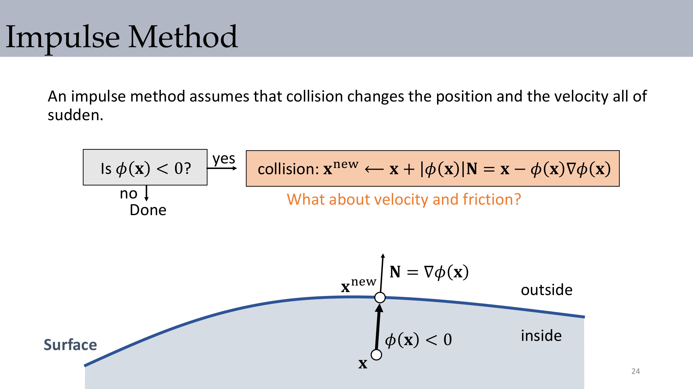

:::remark 关键问题：为什么只做位置修正不够？
只改位置只能消除当前帧穿透；若不改速度，下一帧仍可能沿原速度再次穿透。
:::

## 6. 刚体冲量响应

接触点满足 $\mathbf{x}_i=\mathbf{x}+\mathbf{R}\mathbf{r}_i$，其速度为：

$$
\mathbf{v}_i=\mathbf{v}_{cm}+\boldsymbol{\omega}\times(\mathbf{R}\mathbf{r}_i)
$$

在接触点施加冲量 $\mathbf{j}$ 后：

$$
\mathbf{v}^{new}=\mathbf{v}+\frac{1}{M}\mathbf{j},
\qquad
\boldsymbol{\omega}^{new}=\boldsymbol{\omega}+\mathbf{I}^{-1}((\mathbf{R}\mathbf{r}_i)\times\mathbf{j})
$$

用法向相对速度分类接触：

$$
v_{rel}=\mathbf{n}\cdot(\mathbf{v}_A-\mathbf{v}_B)
$$

- $v_{rel}<0$：碰撞中
- $v_{rel}=0$：滑动接触
- $v_{rel}>0$：分离

### 6.1 无摩擦冲量大小

两刚体（3D）下，冲量标量可写为：

$$
J=\frac{-(1+c)\,\mathbf{n}\cdot\mathbf{v}_{rel}}
{\frac{1}{M_a}+\frac{1}{M_b}+\left(\mathbf{I}_a^{-1}(\mathbf{x}_a\times\mathbf{n})\times\mathbf{x}_a+\mathbf{I}_b^{-1}(\mathbf{x}_b\times\mathbf{n})\times\mathbf{x}_b\right)\cdot\mathbf{n}}
$$

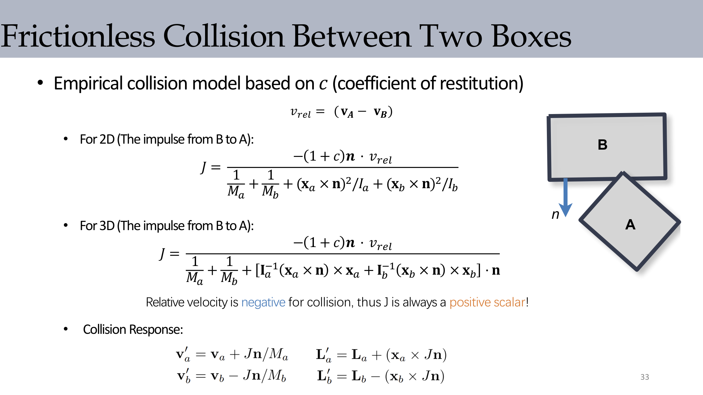

## 7. 含摩擦的刚体碰撞

总冲量按法向和切向分解：

$$
\mathbf{J}=J_n\mathbf{n}+J_t\mathbf{t},
\qquad
J_t\in[-\mu J_n,\mu J_n]
$$

这个截断就是库仑摩擦锥约束的离散实现。

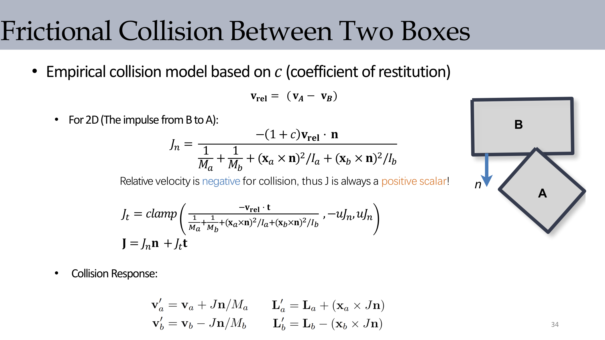

:::tip 关键问题：为什么切向冲量必须截断？
如果不截断，切向修正会超过摩擦物理上限，可能人为注入能量，导致滑动行为不稳定。
:::

## 8. 复杂刚体的逐顶点冲量求解

对网格型刚体（课程示例是刚体兔子），可对候选顶点建立目标速度，再反解冲量：

$$
\Delta\mathbf{v}_i=\mathbf{v}_i^{new}-\mathbf{v}_i=\mathbf{K}\mathbf{j}
$$

$$
\mathbf{K}=\frac{1}{M}\mathbf{I}_3-(\mathbf{R}\mathbf{r}_i)^*\mathbf{I}^{-1}(\mathbf{R}\mathbf{r}_i)^*
$$

$$
\mathbf{j}=\mathbf{K}^{-1}(\mathbf{v}_i^{new}-\mathbf{v}_i)
$$

其中叉乘矩阵写法为 $\mathbf{r}\times\mathbf{q}=\mathbf{r}^*\mathbf{q}$。

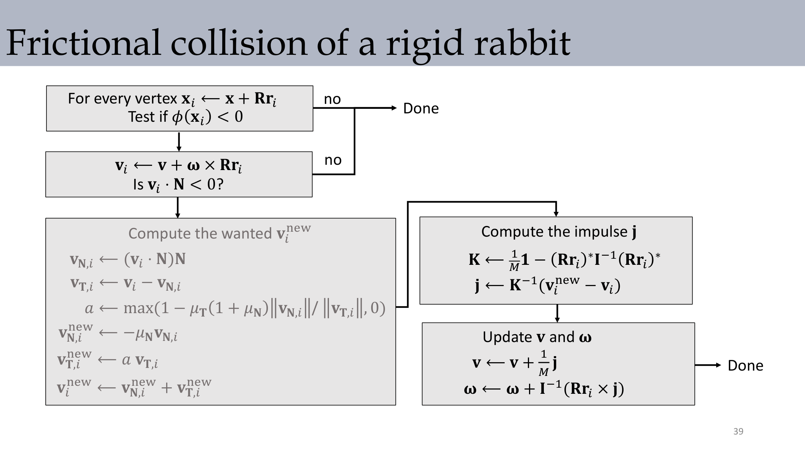

## 9. 多接触与耦合冲量

多个接触同时发生时，冲量之间会互相耦合。课件将其写成分块线性系统，每个接触点速度变化都依赖多个冲量变量。

核心结论：密集接触场景下，逐个独立处理常常不够，需要耦合求解提高一致性。

## 10. 位置方法替代：Shape Matching

### 10.1 两阶段思想

1. 各顶点按速度和外力独立预测位置。
2. 将预测结果重新投影到最接近的刚体变换。

它牺牲部分力学严格性，换取稳定性与易实现性。

### 10.2 数学形式

给定预测点 $\mathbf{y}_i$，求解：

$$
\min_{\mathbf{c},\mathbf{R}}\sum_i\frac{1}{2}\lVert\mathbf{c}+\mathbf{R}\mathbf{r}_i-\mathbf{y}_i\rVert^2
$$

可得：

$$
\mathbf{c}=\frac{1}{N}\sum_i\mathbf{y}_i,
\qquad
\mathbf{A}=\left(\sum_i(\mathbf{y}_i-\mathbf{c})\mathbf{r}_i^T\right)\left(\sum_i\mathbf{r}_i\mathbf{r}_i^T\right)^{-1}
$$

再做极分解 $\mathbf{A}=\mathbf{R}\mathbf{S}$，回投影：

$$
\mathbf{x}_i\leftarrow\mathbf{c}+\mathbf{R}\mathbf{r}_i,
\qquad
\mathbf{v}_i\leftarrow\frac{\mathbf{c}+\mathbf{R}\mathbf{r}_i-\mathbf{x}_i}{\Delta t}
$$

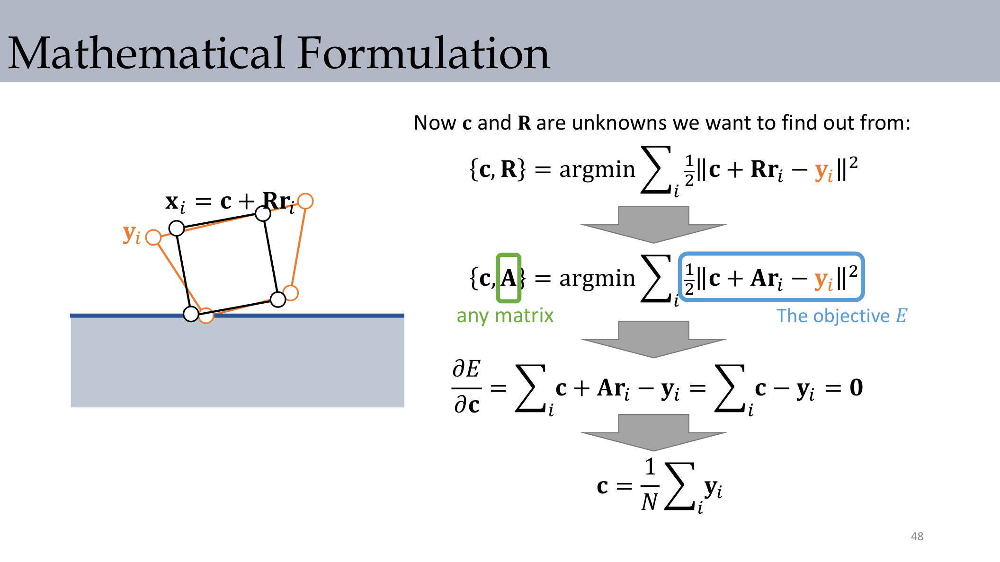
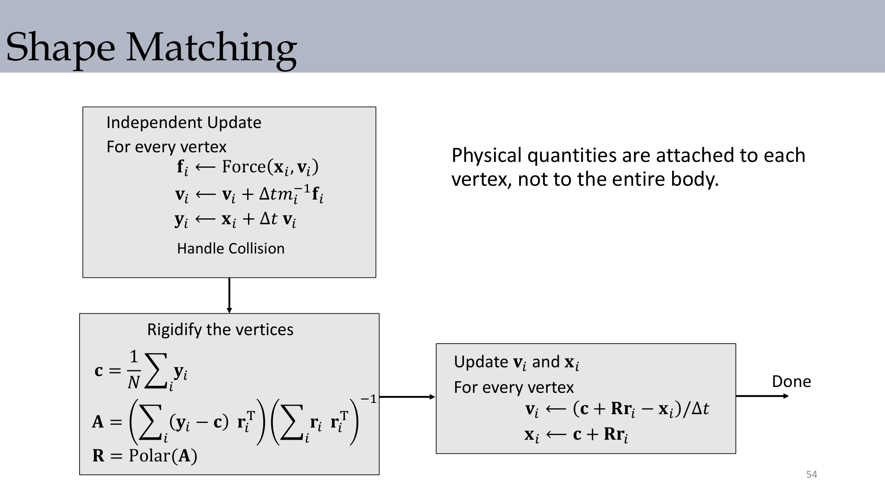

:::remark 关键问题：为什么实时系统常用 shape matching？
因为它实现简单、稳定性强、与粒子/布料系统兼容好。代价是在严格摩擦和精确接触目标上不如约束法精细。
:::

## 11. 实践中的方法选择

- 力方法 penalty：直观、上手快，但强依赖刚度和步长调参。
- 冲量方法：碰撞物理意义明确，但堆叠和多接触需额外策略。
- 位置方法 shape matching：工程上稳健高效，但精确物理性较弱。

## 12. Exam Review

### 12.1 高价值定义

- **碰撞流程**：检测 + 响应 + 接触处理。
- **SDF**：描述到边界有符号距离的标量场。
- **Penalty 方法**：把接触转化为势能导出的力。
- **冲量方法**：在碰撞瞬间直接修改速度。
- **Shape Matching**：将预测顶点投影到最近刚体变换。

### 12.2 机制清单

1. 构建或选择检测器（SDF 或几何库）。
2. 用相对速度分类接触状态。
3. 计算法向与切向响应（恢复系数与摩擦约束）。
4. 同步更新刚体平动速度和角速度。
5. 多接触时按需做耦合冲量求解。
6. 使用 shape matching 时完成“预测-投影”闭环。

### 12.3 简答模板

- 为什么 penalty 必须控制步长？
因为接触力通过离散时间积分，步长过大容易越界并产生穿透。

- 为什么冲量法更适合冲击事件？
因为冲击本身是速度不连续，冲量法直接建模这种瞬时跳变。

- 为什么明知不够严格还用 shape matching？
因为它在实时场景中提供了非常好的稳定性、速度和实现成本平衡。

### 12.4 常见误区

- 接触点、法向、惯量项混用不同坐标系。
- 切向冲量未做摩擦截断。
- 密集接触时仍逐个独立处理导致不一致。
- 把 shape matching 结果误当作严格力学解。

### 12.5 提交前自检

1. 能否用 $v_{rel}$ 正确区分碰撞/滑动/分离？
2. 能否解释冲量如何同时更新 $\mathbf{v}$ 与 $\boldsymbol{\omega}$？
3. 能否比较 penalty 与 impulse 的失败模式？
4. 能否写出 shape matching 的目标函数与回投影步骤？
5. 能否说明游戏、高保真仿真、机器人三类任务的选型差异？
