# Lec4 Constrained Dynamics: Lagrange Multipliers, Contact, and Complementarity

## 1. Why Constraints Matter in Simulation

This lecture reframes many graphics simulation tasks as constrained dynamics:

- We still solve time evolution from initial states.
- We still enforce physics laws (ODE/PDE forms).
- We additionally enforce kinematic/contact conditions such as equality constraints $h(\mathbf{q})=0$ and inequality constraints $g(\mathbf{q})\ge 0$.

In other words, simulation quality is not only about integration accuracy, but also about how robustly constraints are handled.

:::remark Key Question: Why can we not just integrate unconstrained equations and "fix" violations later?
Because many constraints encode actual mechanics (joints, non-penetration, inextensibility). If we ignore them during solve, we introduce drift, unstable correction loops, and non-physical energy behavior.
:::

## 2. Core View: Problem and Numerical Tools

A compact system view from the lecture:

1. Unknown coordinates/state: $\mathbf{q}=(\mathbf{x}_1,\mathbf{x}_2,\ldots)$.
2. Physics equations: $f_{\mathrm{ODE}}(\mathbf{q},\dot{\mathbf{q}},\mathbf{f},t)=0$ (or PDE form).
3. Constraints: equalities and inequalities.

Typical computational backends include:

- Linear system solvers (LU, Cholesky, CG/PCG)
- Nonlinear solvers (Newton, quasi-Newton)
- Constrained optimization and complementarity solvers

This is why constrained simulation is naturally a solver-design problem, not only a force-modeling problem.

## 3. Penalty Method: Soft Constraints

**Penalty methods** add restoring forces to push states back toward valid regions.

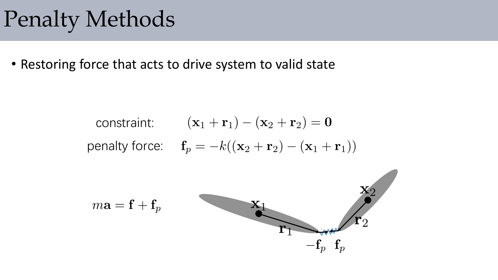

For a simple pairwise equality-style condition:

$$
C(\mathbf{x})=(\mathbf{x}_1+\mathbf{r}_1)-(\mathbf{x}_2+\mathbf{r}_2)=\mathbf{0}
$$

a common penalty force is:

$$
\mathbf{f}_p=-k\big((\mathbf{x}_2+\mathbf{r}_2)-(\mathbf{x}_1+\mathbf{r}_1)\big),\qquad
m\mathbf{a}=\mathbf{f}+\mathbf{f}_p
$$

Advantages and drawbacks:

- Simple to add into existing force-based solvers
- Requires parameter tuning (stiffness $k$)
- Large $k$ creates stiffness and smaller stable time steps
- Constraint violation is reduced, not eliminated

:::remark Key Question: If penalty is easy, why do we still need hard-constraint methods?
Because practical scenes with tight joints or persistent contact need near-zero violation, and penalty-only methods often trade accuracy for stability.
:::

## 4. Lagrange Multipliers: Hard Constraints

The lecture then switches to constraint forces as unknown reactions.

### 4.1 Implicit Surface and Gradient

A constraint manifold can be expressed as:

$$
g(\mathbf{x})=0
$$

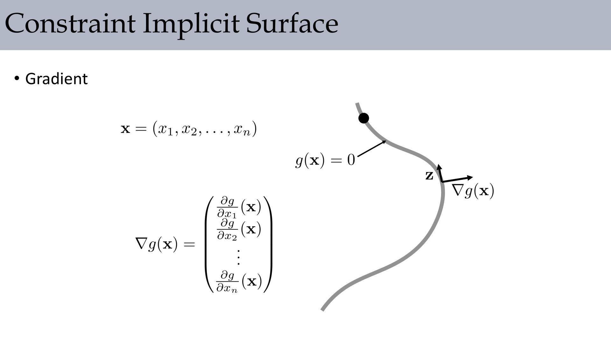

Its gradient gives the normal direction to the manifold:

$$
\nabla g(\mathbf{x})=
\begin{pmatrix}
\frac{\partial g}{\partial x_1}(\mathbf{x})\\
\frac{\partial g}{\partial x_2}(\mathbf{x})\\
\vdots\\
\frac{\partial g}{\partial x_n}(\mathbf{x})
\end{pmatrix}
$$

### 4.2 Workless Constraint Force

**Constraint force is as strong as necessary** and ideally does no work along feasible motion:

$$
\mathbf{f}_c\cdot\mathbf{z}=0
\quad\Rightarrow\quad
\mathbf{f}_c=\lambda\nabla g(\mathbf{x})
$$

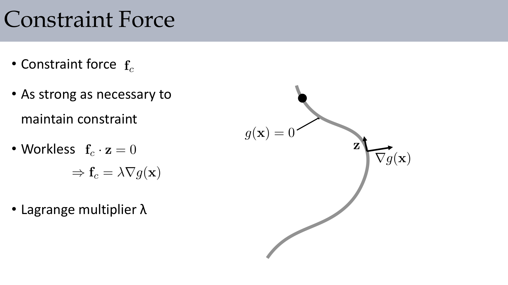

Here $\lambda$ is the Lagrange multiplier and represents reaction strength.

## 5. Constraint Dynamics Equations

With Jacobian $J$, the constrained dynamics writes:

$$
M\mathbf{a}=\mathbf{F}+\mathbf{F}_c=\mathbf{F}+J^T\boldsymbol{\lambda}
$$

and acceleration-level compatibility is:

$$
\ddot g(\mathbf{x})=\dot J\mathbf{v}+J\mathbf{a}=0
$$

The lecture emphasizes a useful hierarchy:

- Position level: $g(\mathbf{x})=0$
- Velocity level: $\dot g(\mathbf{x})=J(\mathbf{x})\mathbf{v}=0$
- Acceleration level: $\ddot g(\mathbf{x})=\dot J\mathbf{v}+J\mathbf{a}=0$

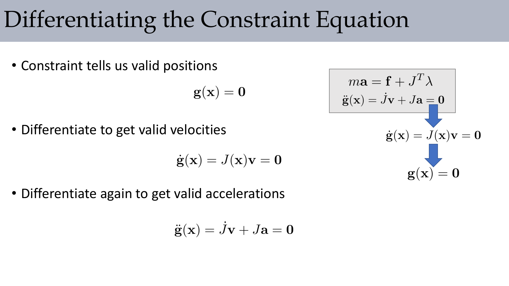

## 6. Multiple Constraints and Linear Solve Forms

For $m$ constraints, we solve coupled unknowns $(\mathbf{a},\boldsymbol\lambda)$.

A reduced Schur-complement form:

$$
(JM^{-1}J^T)\boldsymbol{\lambda}=-JM^{-1}\mathbf{F}-\dot J\mathbf{v}
$$

A saddle-point form:

$$
\begin{pmatrix}
M & -J^T\\
-J & 0
\end{pmatrix}
\begin{pmatrix}
\mathbf{y}\\
\boldsymbol{\lambda}
\end{pmatrix}
=
\begin{pmatrix}
\mathbf{0}\\
-\mathbf{b}
\end{pmatrix},
\quad
\mathbf{b}=JM^{-1}\mathbf{F}+\dot J\mathbf{v},
\quad
\mathbf{y}=\mathbf{a}-M^{-1}\mathbf{F}
$$

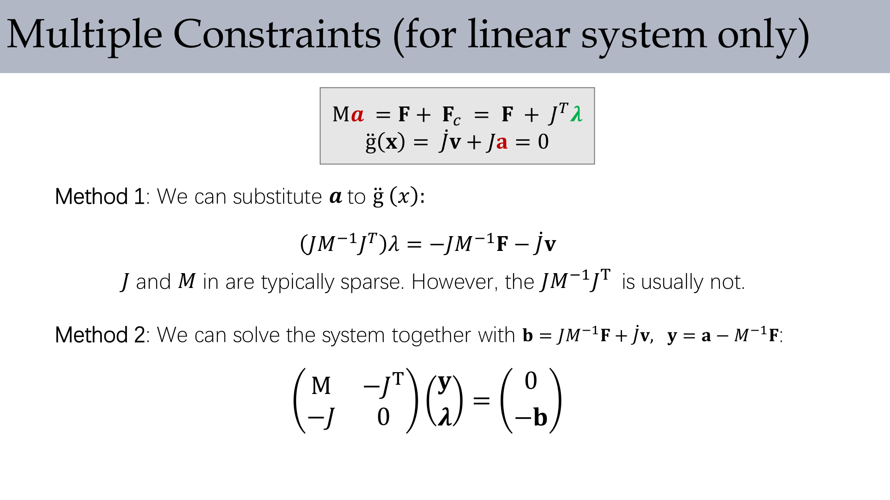

:::tip Key Question: Why does the lecture mention sparsity of $J$ and $M$ but density of $JM^{-1}J^T$?
Because this affects solver choice and memory cost directly. Forming the reduced matrix explicitly can destroy sparsity and become expensive.
:::

## 7. Drift and Baumgarte Stabilization

Time discretization introduces constraint drift, even if continuous equations are exact.

A common stabilization used in class:

$$
J\mathbf{v}_{n+1}=-\alpha\frac{g(\mathbf{x}_n)}{h},
\qquad
M\frac{\mathbf{v}_{n+1}-\mathbf{v}_n}{h}=\mathbf{F}+J^T\boldsymbol\lambda
$$

leading to a corrected multiplier equation:

$$
(JM^{-1}J^T)\boldsymbol\lambda
=-JM^{-1}\mathbf{F}-J\frac{\mathbf{v}_n}{h}-\alpha\frac{g}{h^2}
$$

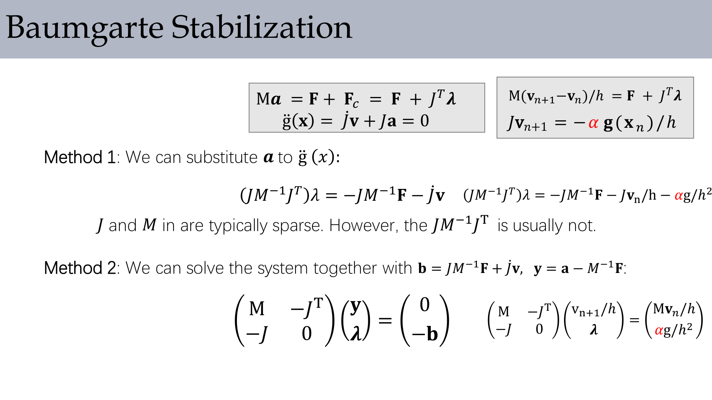

:::remark Key Question: What does Baumgarte actually trade off?
It trades strict geometric exactness for practical numerical damping of drift. Tuning is important: too weak leaves drift, too strong causes oscillation/stiffness.
:::

## 8. Rigid Body as a Constrained System

The lecture rewrites multi-rigid-body dynamics in a unified constrained form with stacked states, forces, and Jacobians.

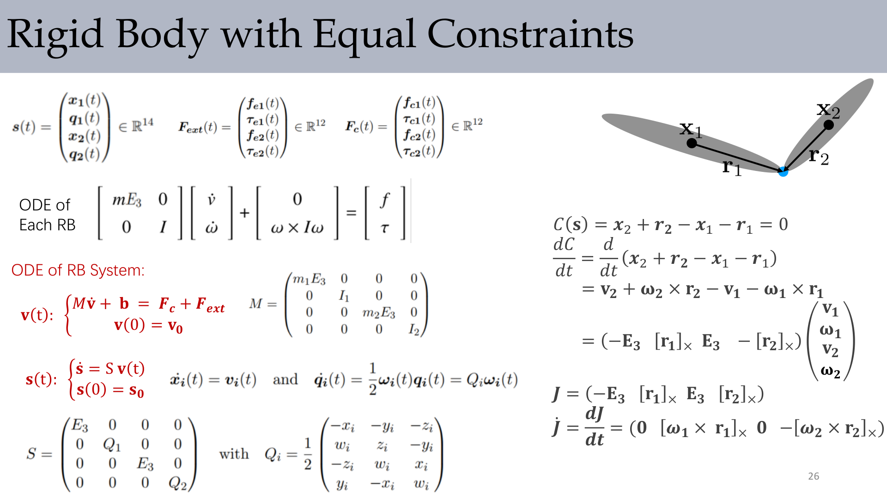

A representative joint equality constraint:

$$
C(\mathbf{s})=\mathbf{x}_2+\mathbf{r}_2-\mathbf{x}_1-\mathbf{r}_1=0
$$

Velocity-level derivative:

$$
\frac{dC}{dt}=\mathbf{v}_2+\boldsymbol\omega_2\times\mathbf{r}_2-\mathbf{v}_1-\boldsymbol\omega_1\times\mathbf{r}_1
$$

with Jacobian structure:

$$
J=\big(-E_3\;[\mathbf{r}_1]_\times\;E_3\;-[\mathbf{r}_2]_\times\big)
$$

## 9. Constraint-Based Rigid Body Contact

For contact-rich scenes, the lecture compares two worldviews:

- Impulse-based: solve impulses directly
- Constraint-based: solve velocities and constraint reactions together

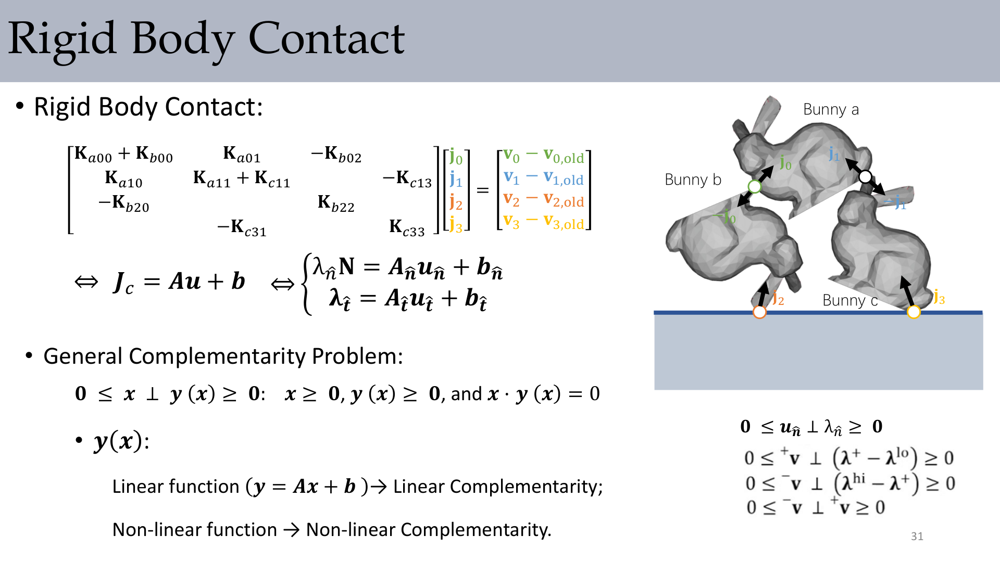

Normal contact condition is expressed as complementarity:

$$
0\le u_{\hat n}\perp\lambda_{\hat n}\ge 0
$$

where roughly:

- $u_{\hat n}$: normal relative velocity/gap-rate term
- $\lambda_{\hat n}$: normal contact reaction

## 10. Complementarity and Friction Coupling

The lecture introduces general complementarity form:

$$
0\le x\perp y(x)\ge 0
$$

- Linear $y=Ax+b$ leads to LCP
- Nonlinear $y(\cdot)$ leads to NCP

Normal and tangential parts are coupled through friction-cone style conditions:

$$
\mu\lambda_{\hat n}-\|\lambda_{\hat t}\|\ge 0,
\qquad
\|\mathbf{v}_{\hat t}\|\big(\mu\lambda_{\hat n}-\|\lambda_{\hat t}\|\big)=0
$$

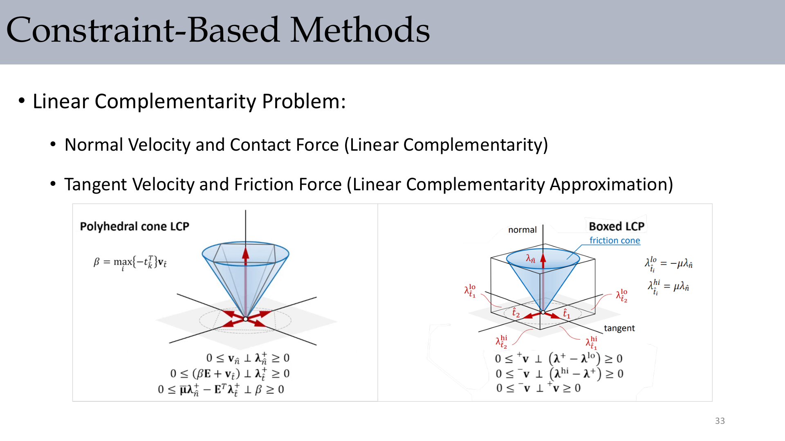

### 10.1 Numerical Methods Mentioned

The lecture lists major families for LCP/NCP-type solves:

- Pivoting methods
- Fixed-point methods
- Non-smooth Newton methods

## 11. Tools and Modeling Directions

The lecture also points to practical engines and references.

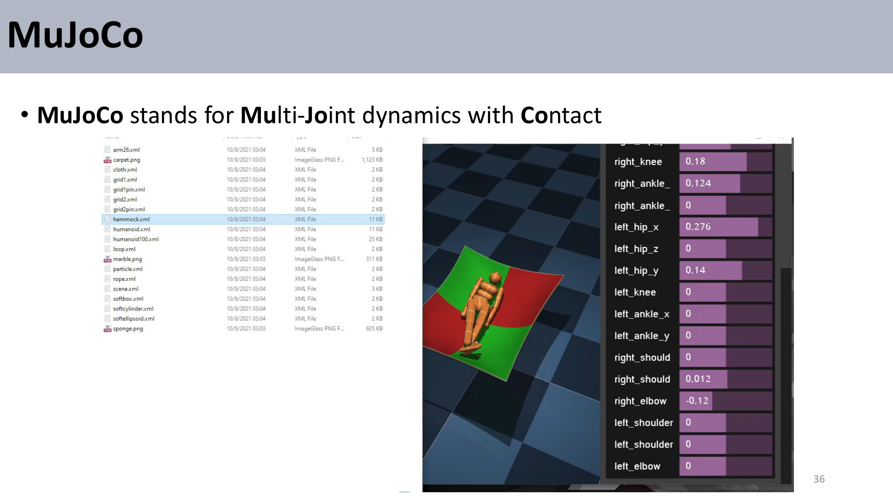

**MuJoCo** is highlighted as **Multi-Joint dynamics with Contact**, representing a mature constrained dynamics pipeline in practice.

## 12. Generalized Coordinates Perspective

A concluding direction is moving from maximal coordinates plus auxiliary constraints toward reduced generalized coordinates.

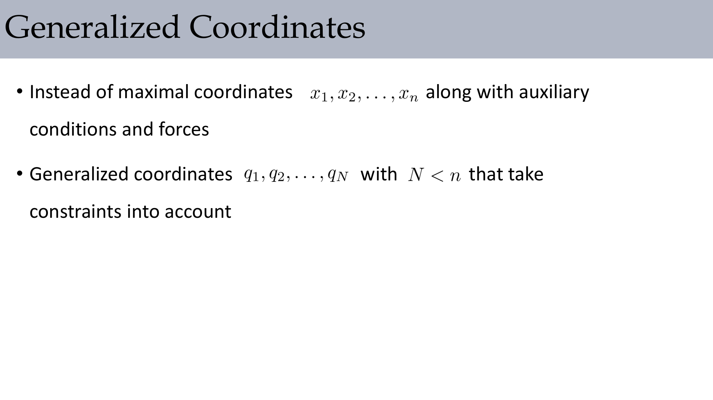

The key idea is:

- Maximal coordinates: many variables + explicit constraints
- Generalized coordinates: fewer variables ($N\lt n$) that already encode constraints

:::tip Key Question: Does generalized coordinate modeling remove all constraints?
Not always. It absorbs many holonomic constraints into parameterization, but contact and some inequality constraints still need dedicated handling.
:::

## 13. Exam Review

### 13.1 High-Value Definitions

- **Constraint**: a geometric/kinematic condition that valid states must satisfy.
- **Penalty method**: soft enforcement by adding restoring forces.
- **Lagrange multiplier**: unknown reaction magnitude generating hard-constraint forces.
- **Complementarity**: mutually exclusive activity relation (e.g., gap-rate vs contact force).
- **LCP/NCP**: linear/nonlinear complementarity formulations for contact/friction.

### 13.2 Mechanism Checklist

1. Write unconstrained dynamics $M\mathbf{a}=\mathbf{F}$.
2. Add constraint reaction via $J^T\boldsymbol\lambda$.
3. Add kinematic consistency equations at velocity/acceleration levels.
4. Solve coupled system (reduced or saddle-point form).
5. Add stabilization for drift in discrete time.
6. For contact, enforce complementarity and friction coupling.

### 13.3 Short-Answer Templates

- Why penalty can fail at large stiffness: it introduces stiff dynamics and can require very small time steps.
- Why multipliers are physically meaningful: they represent reaction magnitudes required to satisfy constraints.
- Why contact is harder than equality joints: inequality activation/deactivation and friction coupling create complementarity structure.

### 13.4 Common Pitfalls

- Using only position correction without velocity-level consistency.
- Ignoring drift accumulation over long runs.
- Treating tangential friction independently from normal constraints.
- Building dense reduced matrices without considering sparsity/runtime.

### 13.5 Self-Check

- Can you derive $\ddot g=\dot J\mathbf{v}+J\mathbf{a}$ from $g(\mathbf{x})=0$?
- Can you explain when to prefer penalty, multiplier, or hybrid handling?
- Can you state the physical meaning of $0\le u_{\hat n}\perp\lambda_{\hat n}\ge0$ in one sentence?
