# Lec5 Fluid Simulation: Eulerian Pipeline, Free Surface Tracking, and Numerical Diffusion Control

## 1. Governing View: What Equation Dominates Fluid Motion?

For this lecture, the central dynamics model is the **Navier-Stokes momentum equation**:

$$
\rho\frac{D\mathbf{v}}{Dt}=\rho\left(\frac{\partial \mathbf{v}}{\partial t}+\mathbf{v}\cdot\nabla\mathbf{v}\right)=-\nabla p+\rho\mathbf{g}+\mu\nabla^2\mathbf{v}
$$

- Left-hand side: material acceleration (Lagrangian view)
- Right-hand side: pressure, body force, viscosity (Eulerian field operators)
- Practical consequence: particle and grid formulations are two equivalent viewpoints of the same continuum model.

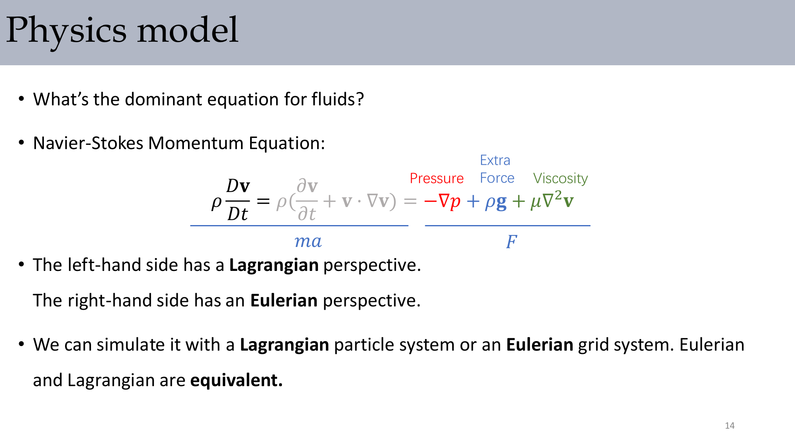

:::remark Key Question: Why is this equation written in a mixed Lagrangian-Eulerian form?
Because advection naturally follows moving material (Lagrangian intuition), while pressure/viscous operators are easier to discretize on fixed grids (Eulerian numerics). Modern solvers combine both to balance physical meaning and computational robustness.
:::

## 2. Mass Conservation and Incompressibility

Momentum equation alone is not enough. We must enforce mass conservation:

$$
\frac{\partial \rho}{\partial t}+\nabla\cdot(\rho\mathbf{v})=0
$$

For incompressible flow (common in graphics water/smoke approximation):

$$
\frac{D\rho}{Dt}=0\ \Rightarrow\ \nabla\cdot\mathbf{v}=0
$$

So pressure is not only a force term, but also the mechanism that projects velocity to divergence-free space.

:::tip Key Point
In graphics solvers, pressure projection is primarily a constraint-enforcement step for incompressibility, not just a direct thermodynamic pressure simulation.
:::

## 3. Two Viewpoints and the Material Derivative

The bridge between Lagrangian and Eulerian descriptions is the material derivative:

$$
\frac{D\mathbf{q}}{Dt}=\frac{\partial \mathbf{q}}{\partial t}+\mathbf{v}\cdot\nabla\mathbf{q}
$$

Interpretation:

- $\frac{\partial \mathbf{q}}{\partial t}$: local temporal change at fixed position
- $\mathbf{v}\cdot\nabla\mathbf{q}$: advective transport through space

This decomposition is the conceptual root of the operator-splitting pipeline later.

## 4. Grid Discretization: Finite Difference Foundations

A regular Eulerian grid stores scalar/vector fields and enables simple finite differencing.

Typical formulas used repeatedly:

$$
\frac{f(t_0+\Delta t)-f(t_0-\Delta t)}{2\Delta t}\approx\frac{df(t_0)}{dt}+O(\Delta t^2)
$$

$$
\Delta f_{i,j}\approx\frac{f_{i-1,j}+f_{i+1,j}+f_{i,j-1}+f_{i,j+1}-4f_{i,j}}{h^2}
$$

Boundary treatment determines whether outside values are fixed (Dirichlet), derivative-constrained (Neumann), or mixed (Robin).

:::remark Key Question: Why does Laplace/Poisson solving always emphasize boundary conditions?
Because without proper boundary constraints, the linear system is under-determined or physically wrong. In fluid simulation, boundary choice directly controls inflow/outflow and wall behavior.
:::

## 5. Why Staggered Grid (MAC) Matters

Cell-centered central differences can be awkward for velocity derivatives. The staggered (MAC) grid places:

- $u$ on vertical faces
- $v$ on horizontal faces
- pressure/scalars at cell centers

This alignment makes divergence and gradient operators more consistent and helps suppress checkerboard artifacts.

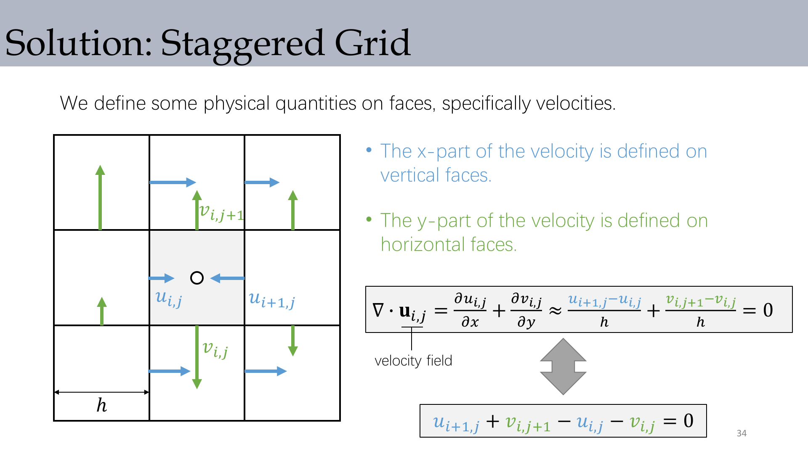

## 6. Eulerian Splitting Pipeline for Incompressible Viscous Flow

A practical update cycle is split into four subproblems:

1. Advection: $\frac{\partial \mathbf{u}}{\partial t}=-\mathbf{u}\cdot\nabla\mathbf{u}$
2. External acceleration: $\frac{\partial \mathbf{u}}{\partial t}=\mathbf{g}$ (or other forces)
3. Viscosity/diffusion: $\frac{\partial \mathbf{u}}{\partial t}=\frac{\mu}{\rho}\Delta\mathbf{u}$
4. Pressure projection: $\frac{\partial \mathbf{u}}{\partial t}=-\frac{1}{\rho}\nabla p$ with $\nabla\cdot\mathbf{u}=0$

This split is modular and engineer-friendly, but each substep introduces approximation error.

## 7. Advection: Semi-Lagrangian Backtracing

Direct Eulerian discretization of advection can be unstable. Semi-Lagrangian method traces backward:

$$
\mathbf{x}_{\text{old}}=\mathbf{x}-\Delta t\,\mathbf{u}(\mathbf{x}),\qquad u_{i,j}^{\text{new}}=u(\mathbf{x}_{\text{old}})
$$

with interpolation (often bilinear/trilinear, or staggered interpolation for MAC).

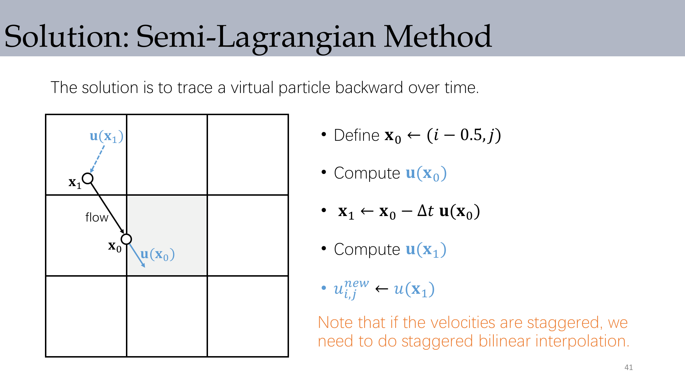

:::remark Key Question: What if the traced point is outside the fluid region?
Use boundary values when information enters from known boundaries, and use extrapolation from nearest valid fluid states when caused by numerics. Then run advection on newly activated cells as needed.
:::

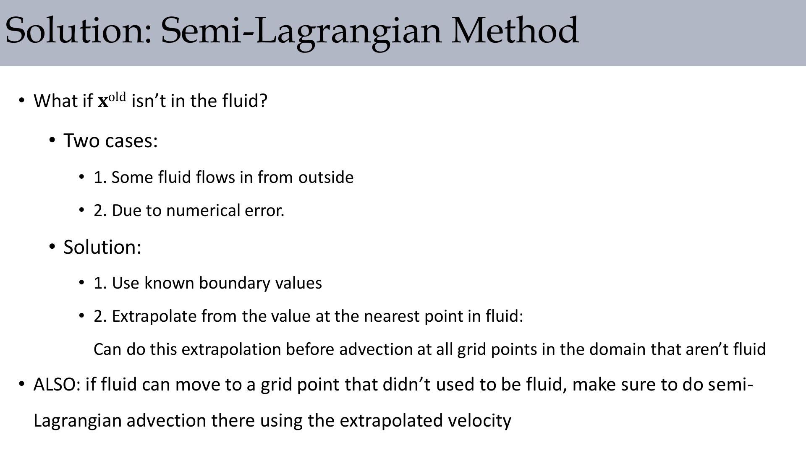

## 8. Numerical Diffusion: The Core Trade-off

Semi-Lagrangian advection is unconditionally stable, but introduces artificial smoothing. A modified-equation view in 1D gives:

$$
\frac{\partial q}{\partial t}+u\frac{\partial q}{\partial x}=\frac{u\Delta x}{2}\frac{\partial^2 q}{\partial x^2}
$$

Right-hand side behaves like extra diffusion (numerical viscosity), which damps small-scale structures.

:::tip Practical Reminder
CFL condition still matters for accuracy and error control, even if a method is called "unconditionally stable" in the strict instability sense.
:::

## 9. Viscosity and Pressure Projection

### 9.1 Viscosity/Diffusion Step

A common explicit stencil form:

$$
u_{i,j}^{\text{new}}=u_{i,j}+\frac{\mu}{\rho}\Delta t\,\frac{u_{i-1,j}+u_{i+1,j}+u_{i,j-1}+u_{i,j+1}-4u_{i,j}}{h^2}
$$

Large $\frac{\mu}{\rho}\Delta t$ may require smaller substeps or implicit treatment.

### 9.2 Projection Step and Poisson Solve

$$
\mathbf{u}^{\text{new}}=\mathbf{u}^*-\frac{\Delta t}{\rho}\nabla p,
\qquad
\nabla\cdot\mathbf{u}^{\text{new}}=0
$$

leads to

$$
\nabla\cdot\nabla p=\frac{\rho}{\Delta t}\nabla\cdot\mathbf{u}^*
$$

and in 2D five-point form:

$$
4p_{i,j}-p_{i-1,j}-p_{i+1,j}-p_{i,j-1}-p_{i,j+1}=\frac{\rho h}{\Delta t}\left(-u_{i+1,j}-v_{i,j+1}+u_{i,j}+v_{i,j}\right)
$$

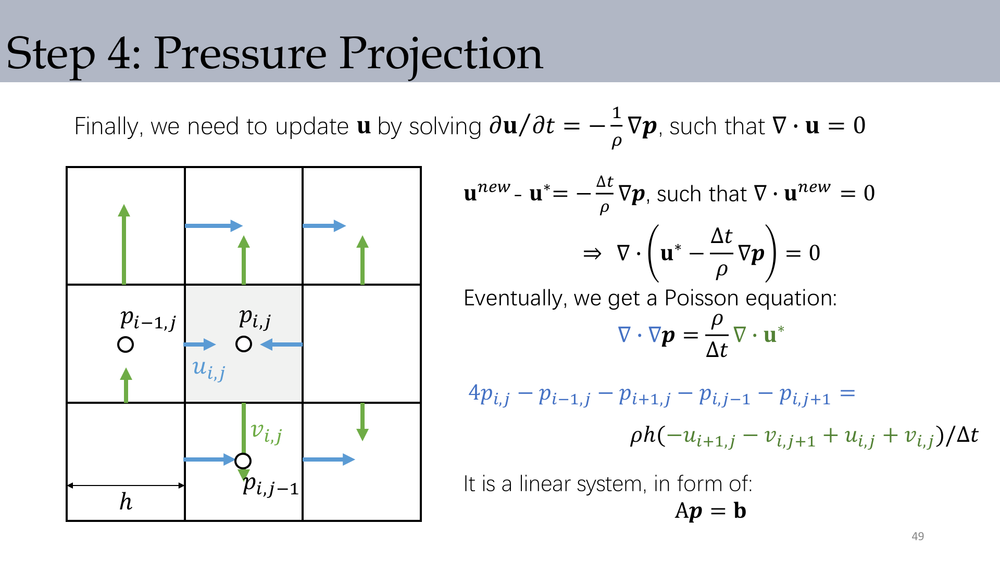

### 9.3 Boundary Conditions in Pressure Solve

- Free surface/open side: typically Dirichlet with constant pressure (often set to zero gauge pressure)
- Solid walls: Neumann-style normal constraint, with no-stick/no-slip variants for tangential behavior

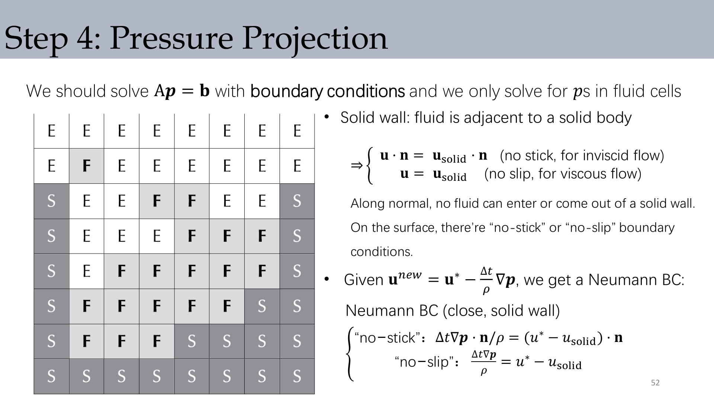

:::remark Key Question: Why do we solve pressure only in fluid cells?
Because pressure is used to correct fluid velocity. Empty/air/solid cells enter as boundary influences rather than unknown fluid-pressure DOFs in the linear system.
:::

## 10. Free-Surface Water Tracking

In water simulation, incompressible velocity update is not enough; we must know where fluid exists.

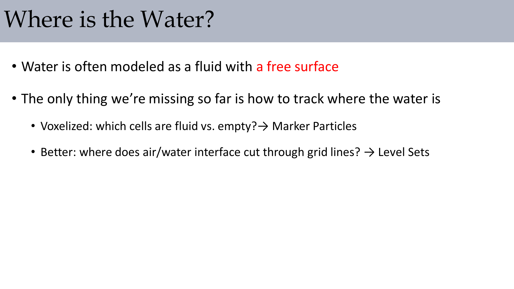

Two mainstream options:

- Marker particles: mark occupied cells by advected particles
- Level set: represent interface by signed distance function $\phi$

For level sets:

$$
\frac{\partial \phi}{\partial t}=-\mathbf{u}\cdot\nabla\phi,
\qquad
\|\nabla\phi\|=1
$$

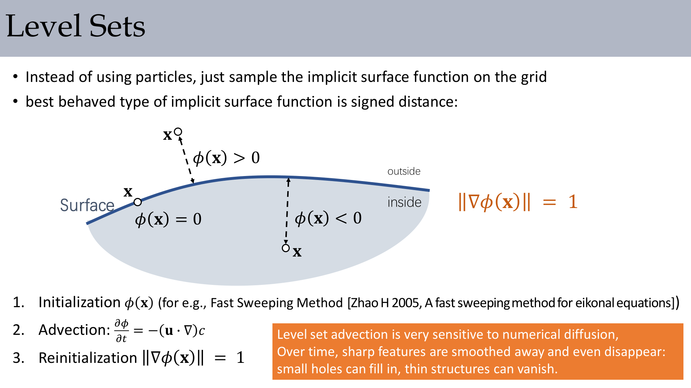

:::remark Key Question: Why can level sets lose thin details?
Because numerical diffusion in advection/reinitialization smooths high-curvature fine features, so thin sheets/holes can shrink or vanish over time.
:::

## 11. Dye/Smoke Approximation with Buoyancy

For smoke-like flows, density variation is often treated as small, while buoyancy captures visible effects:

$$
\frac{\partial \mathbf{u}}{\partial t}=-\mathbf{u}\cdot\nabla\mathbf{u}+\mathbf{g}+\mathbf{f}_{\text{buoyancy}}+\frac{\mu}{\rho}\Delta\mathbf{u}-\frac{1}{\rho}\nabla p,
\qquad
\frac{\partial c}{\partial t}=-\mathbf{u}\cdot\nabla c
$$

$$
\mathbf{f}_b=-\alpha c+\beta(T-T_{\text{amb}}),\qquad p=p'+\rho gH
$$

This keeps the solver structure close to incompressible flow while adding plausible thermal/density motion.

## 12. Reducing Numerical Diffusion: Advanced Directions

Common improvement directions mentioned in lecture:

- Higher-order advection (MacCormack, BFECC families)
- Flow-map methods and covector advection
- Advection-reflection to reduce splitting-related energy loss
- Vorticity confinement and vortex-based methods

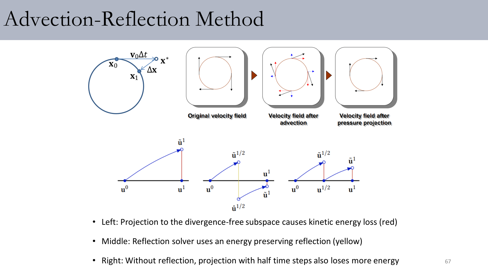

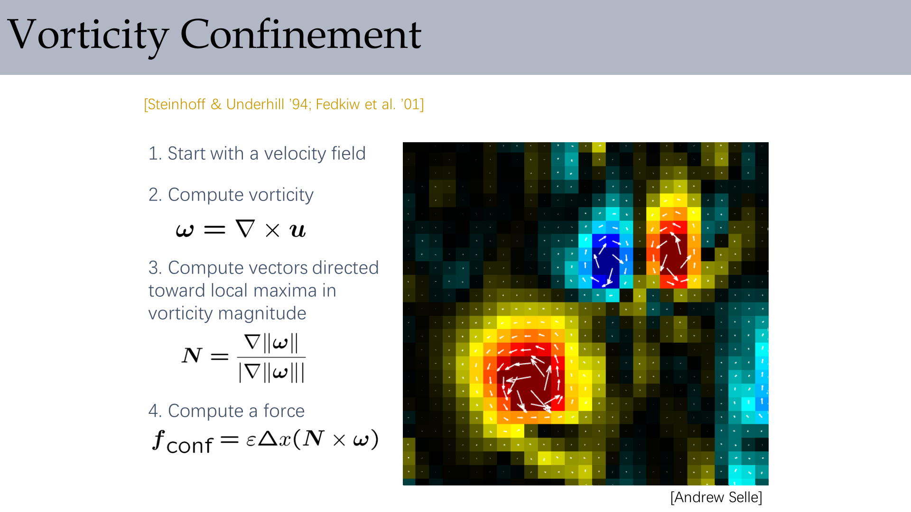

Vorticity confinement formulas:

$$
\boldsymbol\omega=\nabla\times\mathbf{u},\qquad
\mathbf{N}=\frac{\nabla\|\boldsymbol\omega\|}{\|\nabla\|\boldsymbol\omega\|\|},\qquad
\mathbf{f}_{\text{conf}}=\varepsilon\Delta x(\mathbf{N}\times\boldsymbol\omega)
$$

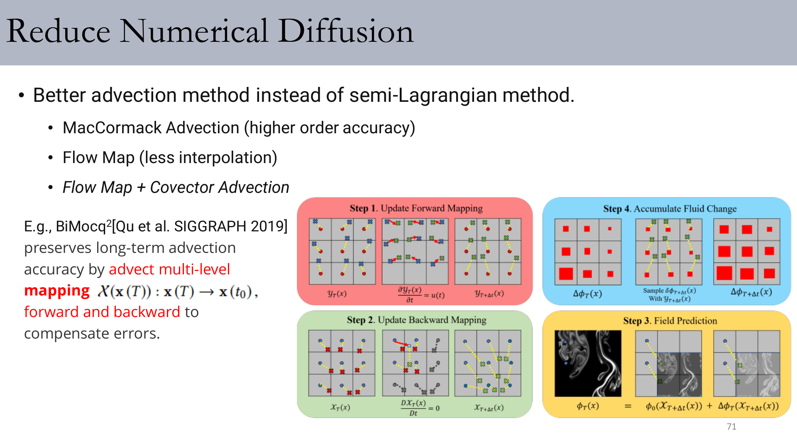

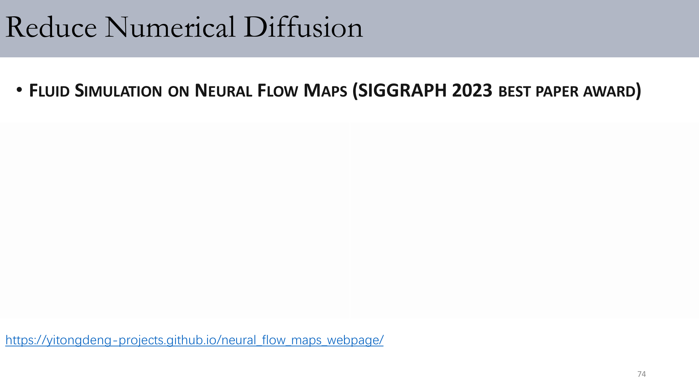

## Exam Review

### A. Definition Checklist

- **Material derivative**: $\frac{D}{Dt}=\frac{\partial}{\partial t}+\mathbf{v}\cdot\nabla$
- **Incompressibility**: $\nabla\cdot\mathbf{u}=0$
- **Projection step**: solve pressure Poisson equation and subtract pressure gradient from intermediate velocity
- **Level set**: signed distance representation of interface with $\phi=0$ as surface

### B. Mechanism Chain (Short Answer Template)

1. Start from Navier-Stokes momentum equation.
2. Split into advection, force, diffusion, projection.
3. Use Semi-Lagrangian advection for stability.
4. Solve Poisson equation for pressure to enforce $\nabla\cdot\mathbf{u}=0$.
5. Update free surface via markers or level set.
6. Add anti-diffusion techniques if visual detail decays too quickly.

### C. Typical Pitfalls

- Confusing physical viscosity with numerical diffusion.
- Ignoring boundary conditions when assembling pressure solve.
- Treating "stable" advection as "accurate" advection.
- Forgetting reinitialization quality in level-set pipelines.

### D. Self-Check Questions

- Can you derive pressure Poisson from incompressibility constraint and velocity correction?
- Can you explain why MAC staggering improves discrete divergence/gradient consistency?
- Can you compare marker particles and level sets in one sentence each?
- Can you name at least two methods to reduce Semi-Lagrangian blurring and explain their intuition?
