# 第6讲 FLIP：流体隐式粒子、漂移补偿与数值扩散抑制

## 1. 控制方程与混合视角

图形学里的 FLIP/PIC 流体求解器仍然从同一组连续体方程出发：

$$
\rho \frac{D\mathbf{v}}{Dt} = -\nabla p + \rho\mathbf{g} + \mu\nabla^2\mathbf{v}
$$

$$
\frac{\partial \rho}{\partial t} = -\nabla\cdot(\rho\mathbf{v}),
\qquad
\frac{D\rho}{Dt}=0 \Rightarrow \nabla\cdot\mathbf{v}=0
$$

核心理解不变：物质导数更接近拉格朗日跟踪，而压力/粘性算子更适合欧拉网格离散。

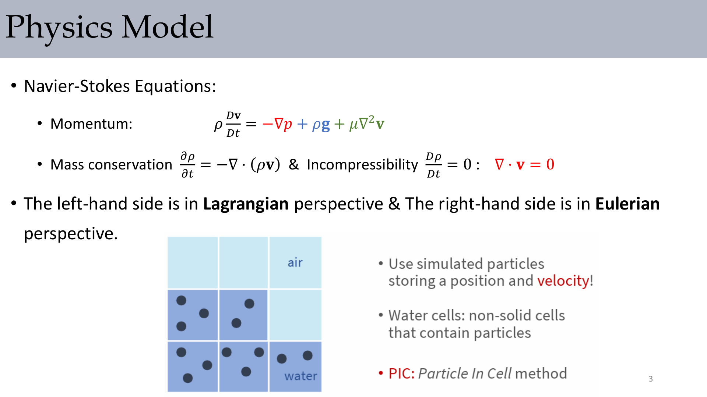

:::remark 关键问题（原意复述）：“左侧是拉格朗日视角，右侧是欧拉视角”，这对实现意味着什么？
它直接决定了任务拆分方式：用粒子携带运动历史，用网格稳定求解不可压与微分算子。PIC/FLIP 本质上就是这种混合设计。
:::

## 2. PIC 基线流程与耗散问题

PIC 的核心句子是 **"Particles carry velocity → can skip grid advection!"**。

典型分裂步骤为：

$$
\frac{\partial \mathbf{u}}{\partial t}=-(\mathbf{u}\cdot\nabla)\mathbf{u},
\quad
\frac{\partial \mathbf{u}}{\partial t}=\mathbf{g},
\quad
\frac{\partial \mathbf{u}}{\partial t}=\frac{\mu}{\rho}\Delta\mathbf{u},
\quad
\frac{\partial \mathbf{u}}{\partial t}=-\frac{1}{\rho}\nabla p
$$

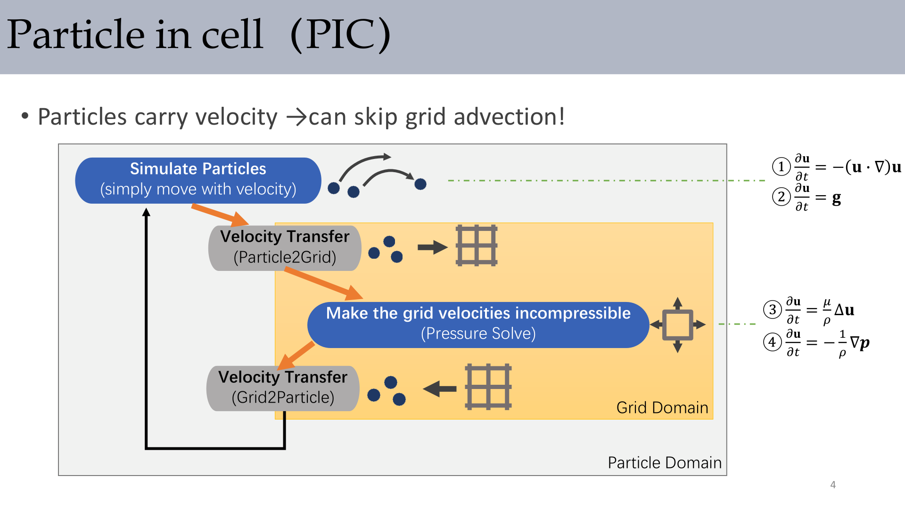

一个实用循环是：

```cpp
for (int step = 0; step < numSubSteps; step++) {
  integrateParticles(sdt);
  handleParticleCollisions(boundaryConditions);
  transferVelocities(toGrid=true);
  solveIncompressibility();
  transferVelocities(toGrid=false);
}
```

:::remark 关键问题（原句保留）：**"Problem: dissipation due to interpolation between particles and grids."** 为什么 PIC 会丢细节？
因为 PIC 会用网格插值结果直接覆盖粒子速度。每次传递都像一次低通滤波，小尺度涡结构会持续衰减。
:::

## 3. FLIP 更新思路与 FLIP95 混合

FLIP 保留粒子速度历史，只从网格读取“增量”，例如：

$$
\Delta\mathbf{u}\sim -\frac{\Delta t}{\rho}\nabla p
$$

这正对应讲义中的 **"Particles keep their velocities → only update velocity changes"**。

为了平衡稳定性和细节，讲义采用

$$
\mathbf{u}_p = 0.05\,\mathbf{u}_p^{\mathrm{PIC}} + 0.95\,\mathbf{u}_p^{\mathrm{FLIP}}
$$

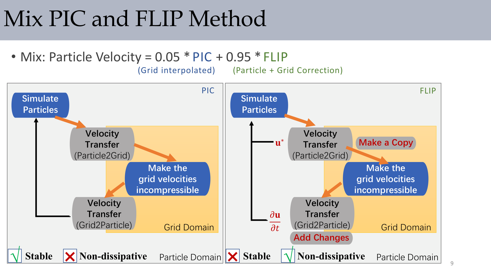

:::remark 关键问题（原意复述）：为什么不全程用纯 FLIP？
纯 FLIP 保细节更好，但也更容易噪声和漂移。掺入少量 PIC 阻尼后，通常能得到更稳的工程表现。
:::

## 4. FLIP95 实现细节

### 4.1 粒子积分与边界处理

粒子更新：

$$
\mathbf{v}_i \leftarrow \mathbf{v}_i + \Delta t\,\mathbf{g},
\qquad
\mathbf{x}_i \leftarrow \mathbf{x}_i + \Delta t\,\mathbf{v}_i
$$

讲义给出的边界夹取（x 方向示例）：

$$
\text{if } x_i.x < x_{\min}+h+r:\; x_i.x=h+r,\; v_i.x=0
$$

$$
\text{if } x_i.x > x_{\min}+(\mathrm{res}-1)h-r:\; x_i.x=(\mathrm{res}-1)h-r,\; v_i.x=0
$$

边界说明是 **"No-stick boundary: Only replace \(u_{i,j}\) (along normal) with \(u_{solid}\)"**。

### 4.2 粒子/网格传递与权重

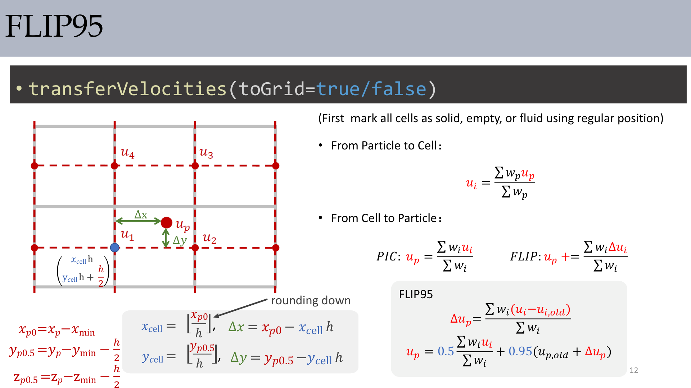

粒子到网格：

$$
u_i = \frac{\sum_p w_p u_p}{\sum_p w_p}
$$

网格到粒子：

$$
\text{PIC: } u_p = \frac{\sum_i w_i u_i}{\sum_i w_i},
\qquad
\text{FLIP: } u_p \mathrel{+}= \frac{\sum_i w_i\Delta u_i}{\sum_i w_i}
$$

讲义中的索引与偏移写法：

$$
x_{p0}=x_p-x_{\min},\quad y_{p0.5}=y_p-y_{\min}-\frac{h}{2},\quad z_{p0.5}=z_p-z_{\min}-\frac{h}{2}
$$

$$
x_{\mathrm{cell}}=\left\lfloor\frac{x_{p0}}{h}\right\rfloor,
\quad
y_{\mathrm{cell}}=\left\lfloor\frac{y_{p0.5}}{h}\right\rfloor,
\quad
\Delta x=x_{p0}-x_{\mathrm{cell}}h,
\quad
\Delta y=y_{p0.5}-y_{\mathrm{cell}}h
$$

FLIP 增量与混合：

$$
\Delta u_p=\frac{\sum_i w_i(u_i-u_{i,old})}{\sum_i w_i}
$$

$$
u_p = 0.5\frac{\sum_i w_i u_i}{\sum_i w_i} + 0.95(u_{p,old}+\Delta u_p)
$$

:::tip 一致性提醒
该页公式里 PIC 系数明确写成 `0.5`，但 FLIP95 的口头定义是 `0.05/0.95`。实现时要核对代码目标。
:::

## 5. 用 Gauss-Seidel 投影实现不可压

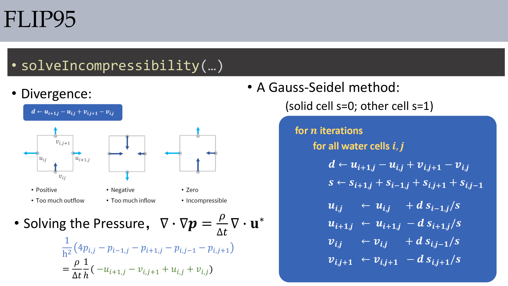

散度与泊松方程：

$$
d\leftarrow u_{i+1,j}-u_{i,j}+v_{i,j+1}-v_{i,j}
$$

$$
\nabla\cdot\nabla p = \frac{\rho}{\Delta t}\nabla\cdot\mathbf{u}^*
$$

$$
\frac{1}{h^2}\left(4p_{i,j}-p_{i-1,j}-p_{i+1,j}-p_{i,j-1}-p_{i,j+1}\right)
=\frac{\rho}{\Delta t}\frac{1}{h}\left(-u_{i+1,j}-v_{i,j+1}+u_{i,j}+v_{i,j}\right)
$$

Gauss-Seidel 更新（`solid cell s=0; other cell s=1`）：

$$
s\leftarrow s_{i+1,j}+s_{i-1,j}+s_{i,j+1}+s_{i,j-1}
$$

$$
u_{i,j}\leftarrow u_{i,j}+d\,\frac{s_{i-1,j}}{s},
\quad
u_{i+1,j}\leftarrow u_{i+1,j}-d\,\frac{s_{i+1,j}}{s}
$$

$$
v_{i,j}\leftarrow v_{i,j}+d\,\frac{s_{i,j-1}}{s},
\quad
v_{i,j+1}\leftarrow v_{i,j+1}-d\,\frac{s_{i,j+1}}{s}
$$

讲义里还给了可选压力累计：

$$
p_{i,j}\leftarrow p_{i,j}+\frac{d}{s}\cdot\frac{\rho h}{\Delta t}
$$

:::remark 关键问题（原意复述）：这里的 `s` 掩码到底起什么作用？
它把固体单元从局部更新中屏蔽掉，只在有效流体邻域分配修正量，从而让投影与边界条件兼容。
:::

## 6. Over-Relaxation 与 Drift Compensation

讲义用 **"Drifting!"** 标记了 FLIP 常见伪影（粒子逐步团聚/压缩）。

### 6.1 Over-Relaxation

$$
d = o\cdot\left(u_{i+1,j}+v_{i,j+1}-u_{i,j}-v_{i,j}\right),\qquad 1<o<2\;(\text{e.g., }o=1.9)
$$

Over-relaxation 的作用是放大每次局部修正，加快散度收敛。

### 6.2 漂移补偿项

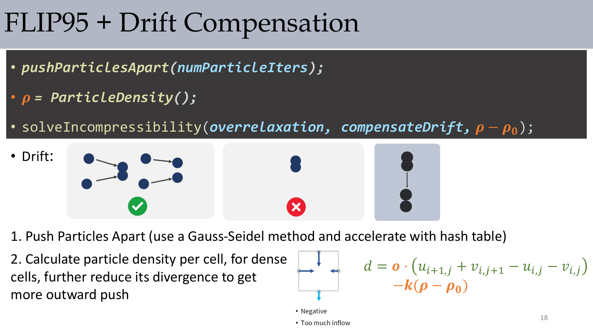

$$
d = o\cdot\left(u_{i+1,j}+v_{i,j+1}-u_{i,j}-v_{i,j}\right) - k(\rho-\rho_0)
$$

当密度高于基准时：

$$
\rho > \rho_0
$$

补偿项会增加向外校正。

### 6.3 Push Particles Apart + 空间哈希加速

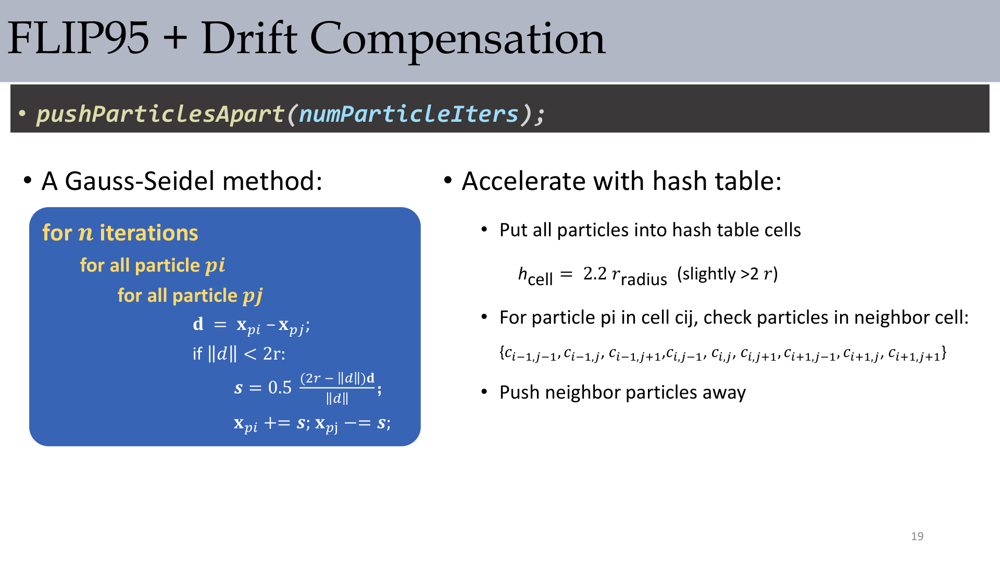

$$
\mathbf{d}=\mathbf{x}_{p_i}-\mathbf{x}_{p_j},
\qquad
\lVert\mathbf{d}\rVert<2r\Rightarrow
\mathbf{s}=0.5\,\frac{(2r-\lVert\mathbf{d}\rVert)\mathbf{d}}{\lVert\mathbf{d}\rVert}
$$

$$
\mathbf{x}_{p_i}\mathrel{+}=\mathbf{s},\qquad \mathbf{x}_{p_j}\mathrel{-}=\mathbf{s}
$$

$$
h_{\mathrm{cell}}=2.2\,r_{\mathrm{radius}}
$$

### 6.4 位移网格上的粒子密度统计

讲义原句是 **"Grid is shifted by h/2 in both directions!"**。

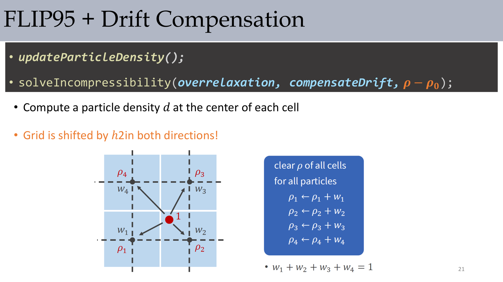

$$
\rho_1\leftarrow\rho_1+w_1,
\ \rho_2\leftarrow\rho_2+w_2,
\ \rho_3\leftarrow\rho_3+w_3,
\ \rho_4\leftarrow\rho_4+w_4,
\quad
w_1+w_2+w_3+w_4=1
$$

:::remark 关键问题（原意复述）：为什么要按粒子密度补偿，而不仅靠速度散度？
因为速度场看起来可接受时，粒子仍可能发生可见团聚。密度反馈能直接抑制这种“视觉压缩”伪影。
:::

## 7. Mixed Lagrangian-Eulerian Fluids 结果语境

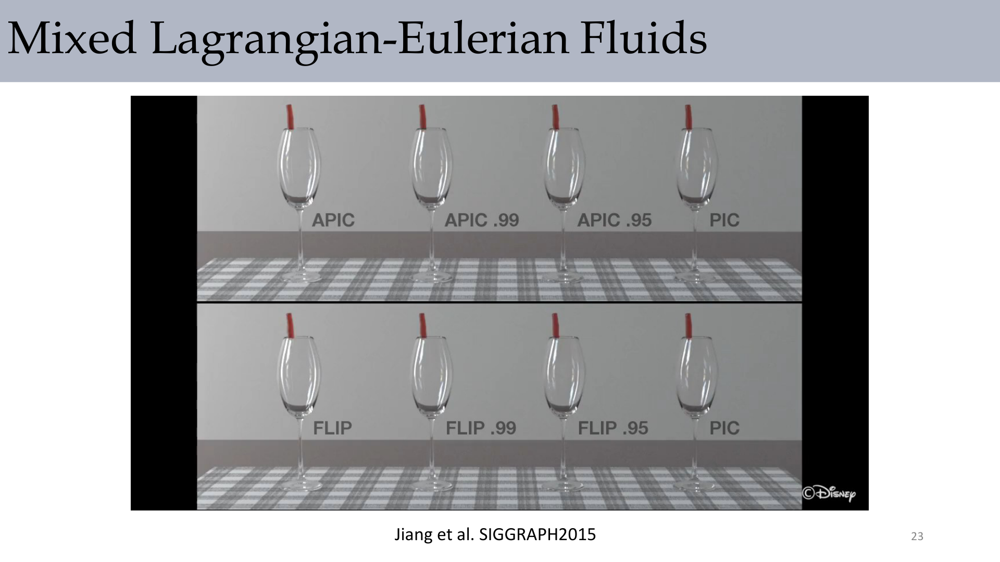

这组对比强调了混合方法的动机：粒子保持平流细节，网格负责不可压约束，两者互补。

## 8. 在基础 FLIP 之外进一步抑制数值扩散

讲义关键提示是 **"Better advection method instead of semi-Lagrangian method."**。

讲义列出的主线方向：

- MacCormack advection（高阶精度）
- Flow map（更少插值）
- Flow map + covector advection
- Advection-reflection（修正分裂误差）
- Vorticity confinement
- Vortex method

### 8.1 Advection-Reflection 方法

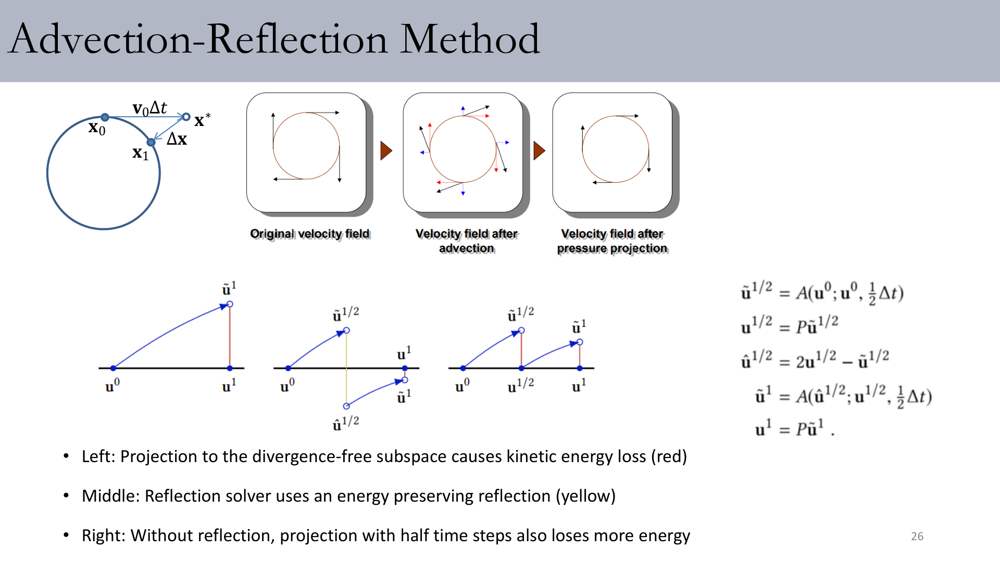

$$
\tilde{\mathbf{u}}^{1/2} = A(\mathbf{u}^0;\mathbf{u}^0,\tfrac{1}{2}\Delta t),
\quad
\mathbf{u}^{1/2}=P\tilde{\mathbf{u}}^{1/2}
$$

$$
\hat{\mathbf{u}}^{1/2}=2\mathbf{u}^{1/2}-\tilde{\mathbf{u}}^{1/2}
$$

$$
\tilde{\mathbf{u}}^{1}=A(\hat{\mathbf{u}}^{1/2};\mathbf{u}^{1/2},\tfrac{1}{2}\Delta t),
\quad
\mathbf{u}^{1}=P\tilde{\mathbf{u}}^{1}
$$

$$
\mathbf{x}^*=\mathbf{x}_0+\mathbf{v}_0\Delta t,
\qquad
\Delta\mathbf{x}=\mathbf{x}^*-\mathbf{x}_1
$$

### 8.2 涡量约束（Vorticity Confinement）

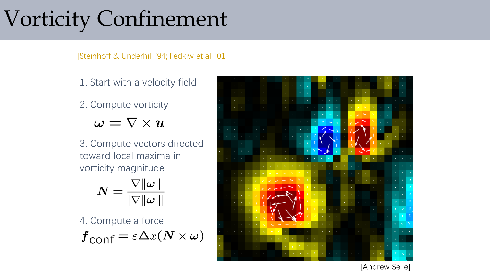

$$
\boldsymbol{\omega}=\nabla\times\mathbf{u}
$$

$$
\mathbf{N}=\frac{\nabla\lVert\boldsymbol{\omega}\rVert}{\lVert\nabla\lVert\boldsymbol{\omega}\rVert\rVert}
$$

$$
\mathbf{f}_{\mathrm{conf}}=\varepsilon\Delta x(\mathbf{N}\times\boldsymbol{\omega})
$$

### 8.3 涡方法（Vortex Method）形式

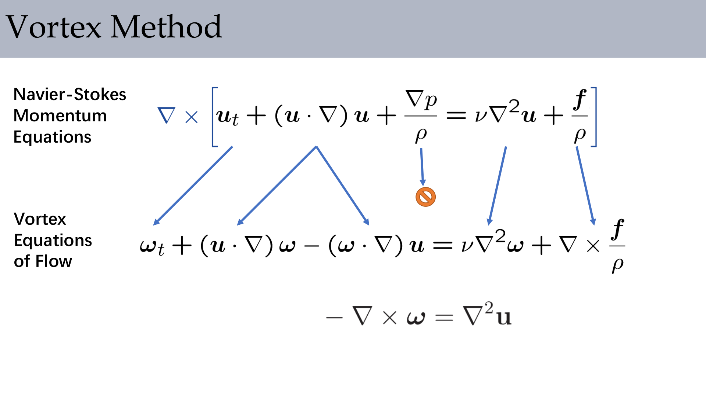

$$
\nabla\times\left[\mathbf{u}_t+(\mathbf{u}\cdot\nabla)\mathbf{u}+\frac{\nabla p}{\rho}\right]
=\nabla\times\left[\nu\nabla^2\mathbf{u}+\frac{\mathbf{f}}{\rho}\right]
$$

$$
\boldsymbol{\omega}_t+(\mathbf{u}\cdot\nabla)\boldsymbol{\omega}-(\boldsymbol{\omega}\cdot\nabla)\mathbf{u}
=\nu\nabla^2\boldsymbol{\omega}+\nabla\times\frac{\mathbf{f}}{\rho}
$$

$$
-\nabla\times\boldsymbol{\omega}=\nabla^2\mathbf{u}
$$

### 8.4 MacCormack / BiMocq2 / 映射校正

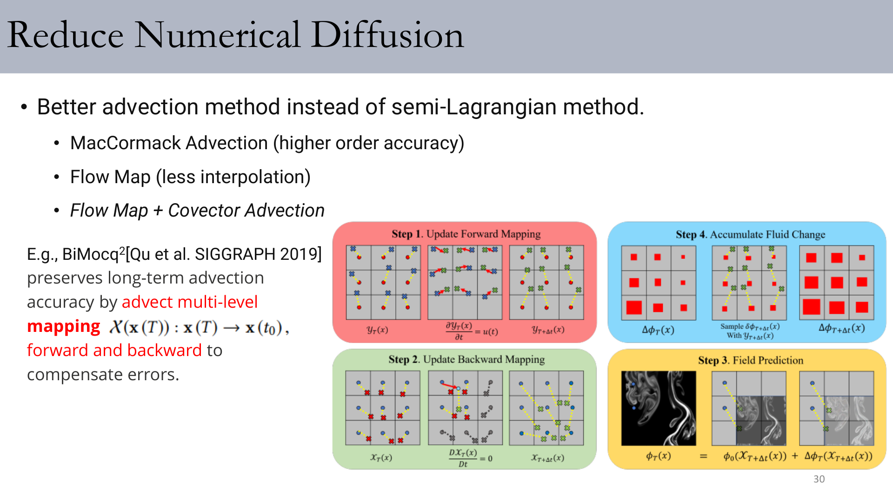

讲义中的 MacCormack 修正式：

$$
\hat{\phi}^{n+1}=A(\phi^n),
\quad
\hat{\phi}^{n}=A^R(\hat{\phi}^{n+1}),
\quad
\phi^{n+1}=\hat{\phi}^{n+1}+\frac{\phi^n-\hat{\phi}^{n}}{2}
$$

BiMocq2 映射表达：

$$
\chi(\mathbf{x}(T)):\mathbf{x}(T)\to\mathbf{x}(t_0)
$$

### 8.5 Covector / Impulse-Fluid 方向

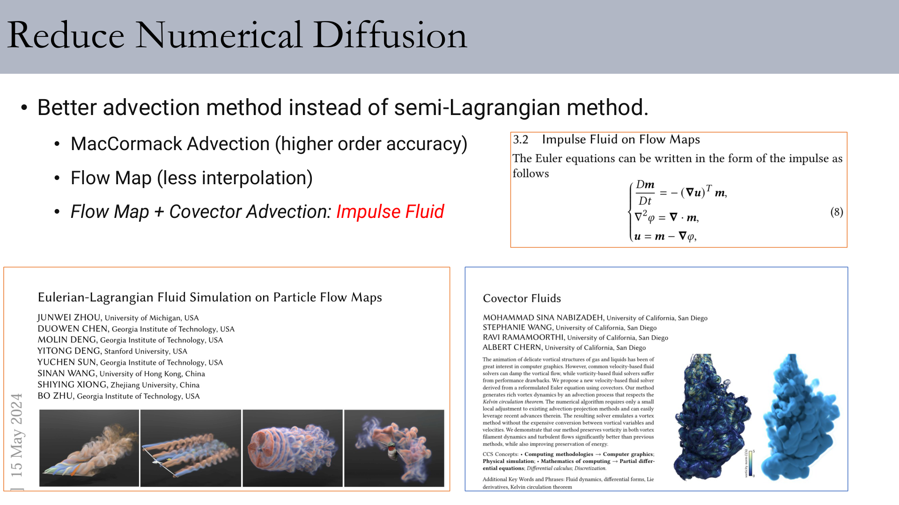

$$
\frac{D\mathbf{m}}{Dt}=-(\nabla\mathbf{u})^T\mathbf{m},
\quad
\nabla^2\varphi=\nabla\cdot\mathbf{m},
\quad
\mathbf{u}=\mathbf{m}-\nabla\varphi
$$

讲义给出的参考链接：
[Neural Flow Maps（SIGGRAPH 2023 Best Paper）](https://yitongdeng-projects.github.io/neural_flow_maps_webpage/)

:::remark 关键问题（原意复述）：这些方法如何在“稳定”之外恢复细节？
共同思路是保留半拉格朗日体系的稳健性，同时叠加误差校正机制（前后向修正、反射步骤、涡量回注、映射补偿）来找回小尺度运动。
:::

## 9. Exam Review

### A. 必会定义

- **PIC**：每步用网格插值速度覆盖粒子速度；稳健但易耗散。
- **FLIP**：用网格速度增量更新粒子速度；细节保留好但可能漂移/噪声。
- **Over-relaxation**：用 `o`（`1<o<2`）放大散度修正以加速收敛。
- **Drift compensation**：加入 `-k(\rho-\rho_0)` 密度项抑制粒子团聚与压缩。
- **Advection-reflection**：在平流/投影链路加入反射式校正，减少能量损失。

### B. 机制链（简答模板）

1. 从 Navier-Stokes 与不可压约束出发。
2. 使用粒子-网格混合传递（PIC/FLIP）。
3. 解压力泊松方程得到无散速度。
4. 当 FLIP 出现团聚/漂移时加入 over-relaxation 与 drift compensation。
5. 通过高阶/误差校正平流方法进一步抑制数值扩散。

### C. 常见误区

- PIC 权重过高导致细节被过度阻尼。
- 只看速度散度，忽略粒子密度的视觉伪影。
- over-relaxation 调得过激却不检查稳定性。
- 调试时忽略边界处理（`no-stick` 法向替换）。
- 把不同抗扩散方法的修正对象混为一谈。

### D. 自检问题

- 你能用一句话解释 PIC 为什么“稳定但耗散”吗？
- 你能默写 FLIP 增量公式和 FLIP95 混合思路吗？
- 你能说明为什么粒子-网格方法仍必须做压力投影吗？
- 你能解释 `\rho_0` 在漂移补偿中的角色吗？
- 你能比较 MacCormack、advection-reflection、vorticity confinement 各自修正的误差来源吗？
