# Lec7 SPH and APIC: Particle-Based Fluids, Affine Transfers, and Continuum Conservation

## 1. Big Picture

This lecture connects two major particle-based fluid directions:

- SPH (Smoothed Particle Hydrodynamics): directly evaluate density, pressure, and viscosity from local particle neighborhoods.
- APIC (Affine Particle-In-Cell): keep the particle-grid hybrid pipeline, but transfer affine motion instead of only translational velocity.

The common thread is this: we want stable simulation, low dissipation, and physically meaningful conservation.

## 2. SPH Foundations: From Averaging to Kernel Operators

### 2.1 Particle State and the Core Query

In a particle system, each particle stores mass, position, and velocity:

$$
\mathbf{x} = [\mathbf{x}_0,\dots,\mathbf{x}_i,\dots]^T,
\quad
\mathbf{v} = [\mathbf{v}_0,\dots,\mathbf{v}_i,\dots]^T,
\quad
\mathbf{m}=[m_0,\dots,m_i,\dots]^T
$$

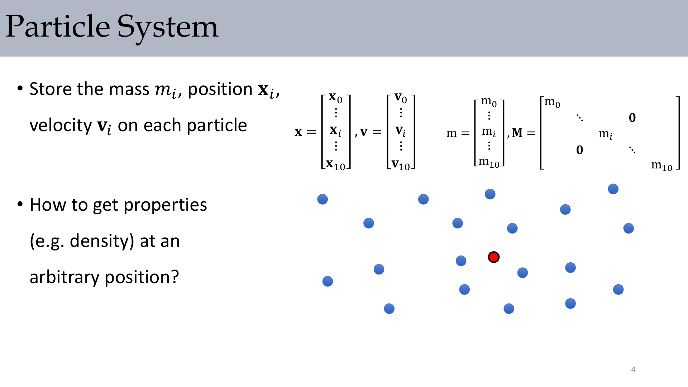

:::remark Key Question (original intent): How do we get properties (e.g., density) at an arbitrary position?
The answer is local interpolation: nearby particles contribute with distance-based weights. The whole SPH construction is about designing these weights so the interpolation is smooth, stable, and physically meaningful.
:::

### 2.2 Why Simple Neighborhood Averaging Fails

A naive model uses equal weights inside a radius:

$$
A_i^{\mathrm{smooth}} = \frac{1}{n}\sum_j A_j
$$

Even with volume weighting,

$$
A_i^{\mathrm{smooth}} = \frac{1}{n}\sum_j V_jA_j,
$$

it is still not smooth when neighbor count changes abruptly.

### 2.3 Final SPH Interpolation Form

The practical SPH form is:

$$
A_i^{\mathrm{smooth}} = \sum_j V_jA_jW_{ij}
$$

with

$$
V_i = \frac{m_i}{\rho_i^{\mathrm{smooth}}},
\qquad
\rho_i^{\mathrm{smooth}} = \sum_j m_jW_{ij}
$$

so we get

$$
A_i^{\mathrm{smooth}} = \sum_j \frac{m_j}{\sum_k m_kW_{jk}}A_jW_{ij}
$$

### 2.4 Kernel Design and Typical Examples

A smoothing kernel should satisfy locality and normalization, e.g.:

$$
\int W(x)\,dx=1,
\qquad
q=\frac{\|\mathbf{x}_i-\mathbf{x}_j\|}{h}
$$

One cubic spline kernel used in the lecture:

$$
W_{ij} = \frac{3}{2\pi h^3}
\begin{cases}
\frac{2}{3} - q^2 + \frac{1}{2}q^3, & 0\le q<1 \\
\frac{1}{6}(2-q)^3, & 1\le q<2 \\
0, & 2\le q
\end{cases}
$$

Also shown:

$$
W_{\mathrm{poly6}}(q)=\frac{315}{64\pi d^9}(d^2-q^2)^3,
\quad 0\le q\le d,
\text{ else }0
$$

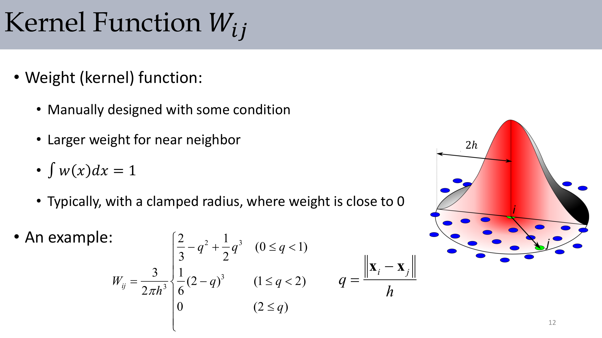

### 2.5 Kernel Gradient and Laplacian

For SPH forces we need first and second derivatives.

$$
\nabla_iW_{ij}=\frac{\partial W_{ij}}{\partial q}\frac{\mathbf{x}_i-\mathbf{x}_j}{\|\mathbf{x}_i-\mathbf{x}_j\|h},
\qquad
\nabla_jW_{ji}=-\nabla_iW_{ij}
$$

$$
\nabla_i\cdot\nabla_iW_{ij}
=\frac{\partial^2W_{ij}}{\partial q^2}\frac{1}{h^2}
+\frac{\partial W_{ij}}{\partial q}\frac{2}{h^2q},
\qquad
\Delta_jW_{ji}=\Delta_iW_{ij}
$$

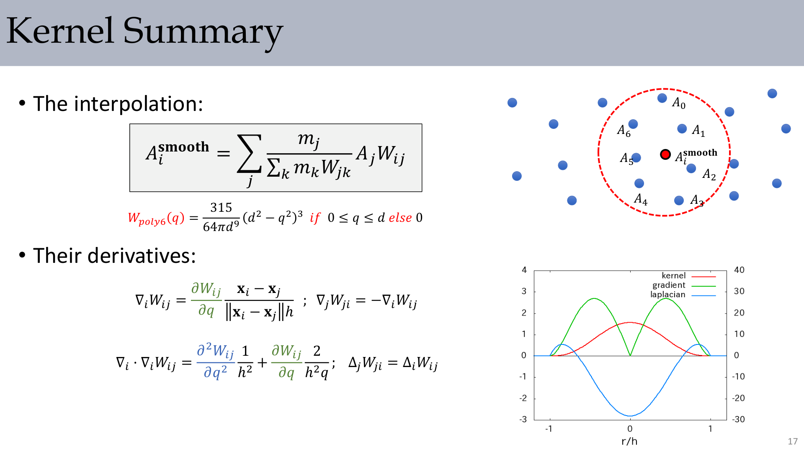

:::remark Key Question (original intent): Why does SPH care so much about gradient and Laplacian of kernels?
Because pressure force depends on kernel gradient, while viscosity uses a Laplacian-like operator. If these operators are inconsistent, force symmetry and momentum behavior degrade quickly.
:::

## 3. SPH Fluid Dynamics Formulation

### 3.1 Split Navier-Stokes Terms for Particle Updates

Lecture split (Eulerian form):

$$
\frac{\partial\mathbf{u}}{\partial t}=-(\mathbf{u}\cdot\nabla)\mathbf{u},
\quad
\frac{\partial\mathbf{u}}{\partial t}=\mathbf{g},
\quad
\frac{\partial\mathbf{u}}{\partial t}=\frac{\mu}{\rho}\Delta\mathbf{u},
\quad
\frac{\partial\mathbf{u}}{\partial t}=-\frac{1}{\rho}\nabla p
$$

Lagrangian view for particles:

$$
\frac{d\mathbf{u}}{dt}=0,
\quad
\frac{d\mathbf{u}}{dt}=\mathbf{g},
\quad
\frac{d\mathbf{u}}{dt}=\frac{\mu}{\rho}\Delta\mathbf{u},
\quad
\frac{d\mathbf{u}}{dt}=-\frac{1}{\rho}\nabla p
$$

### 3.2 Density, Pressure EOS, and Pressure Force

$$
\rho(\mathbf{x})=\sum_i m_iW(\mathbf{x}-\mathbf{x}_i),
\qquad
p_i=k(\rho_i-\rho_0)^\gamma\ (\gamma\approx 7)
$$

$$
p(\mathbf{x})=\sum_i p_i\frac{m_i}{\rho_i}W(\mathbf{x}-\mathbf{x}_i),
\qquad
\nabla p(\mathbf{x})=\sum_i p_i\frac{m_i}{\rho_i}\nabla W(\mathbf{x}-\mathbf{x}_i)
$$

$$
\mathbf{f}_{ip}=-\frac{m_i}{\rho_i}\sum_j p_j\frac{m_j}{\rho_j}\nabla_iW(\mathbf{x}_j-\mathbf{x}_i)
$$

:::remark Key Question (original intent): "How to calculate the pressure field?" and "What is $p_i$?"
Use particle pressure interpolation for the field and an equation of state for per-particle pressure. In weakly compressible SPH, $p_i=k(\rho_i-\rho_0)^\gamma$ is the standard closure.
:::

### 3.3 Viscosity and Its Momentum-Conserved Fix

Naive form:

$$
\mathbf{f}_{iv}=\nu m_i\sum_jm_j\frac{\mathbf{v}_j}{\rho_j}\Delta_iW(\mathbf{x}_j-\mathbf{x}_i)
$$

This does not enforce pairwise cancellation in general.

Conserved form:

$$
\mathbf{f}_{iv}^{\mathrm{cons}}=\nu m_i\sum_jm_j\left(\frac{\mathbf{v}_j}{\rho_j}-\frac{\mathbf{v}_i}{\rho_i}\right)\Delta_iW(\mathbf{x}_j-\mathbf{x}_i)
$$

### 3.4 Pressure and Its Momentum-Conserved Fix

Naive pressure force may violate pairwise antisymmetry.

Conserved form:

$$
\mathbf{f}_{ip}^{\mathrm{cons}}=-m_i\sum_jm_j\left(\frac{p_j}{\rho_j^2}+\frac{p_i}{\rho_i^2}\right)\nabla_iW(\mathbf{x}_j-\mathbf{x}_i)
$$

### 3.5 SPH Step Summary and Tradeoffs

A practical SPH step is:

1. Integrate positions/velocities with gravity.
2. Compute density by kernel summation.
3. Compute viscosity force.
4. Compute pressure from EOS.
5. Compute pressure force and update velocity.

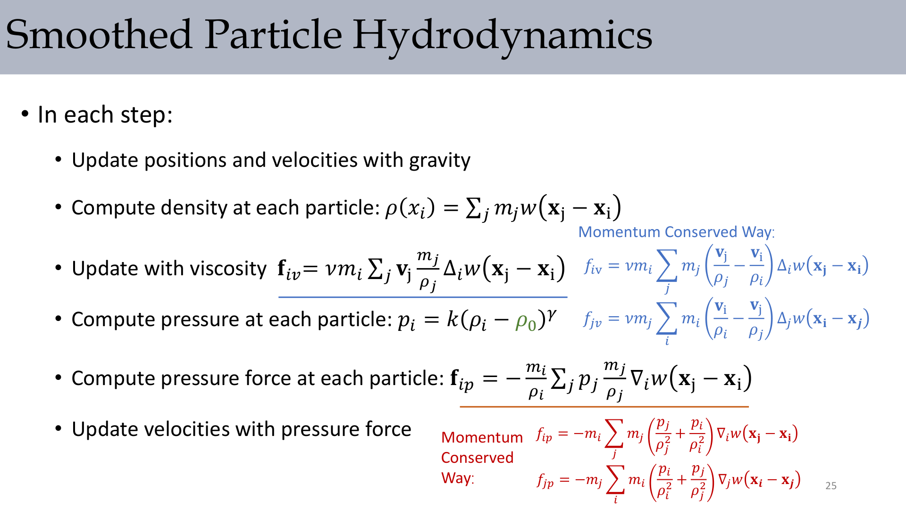

SPH characteristics from the lecture:

- Advantage: fast and GPU-friendly.
- Advantage: particle representation handles free surfaces/obstacles naturally.
- Limitation: needs dense neighborhoods for stability and accuracy.
- Limitation: pressure is local approximation, so incompressibility is not guaranteed.
- Typical improvements: IISPH, PCISPH, Position-Based Fluids.

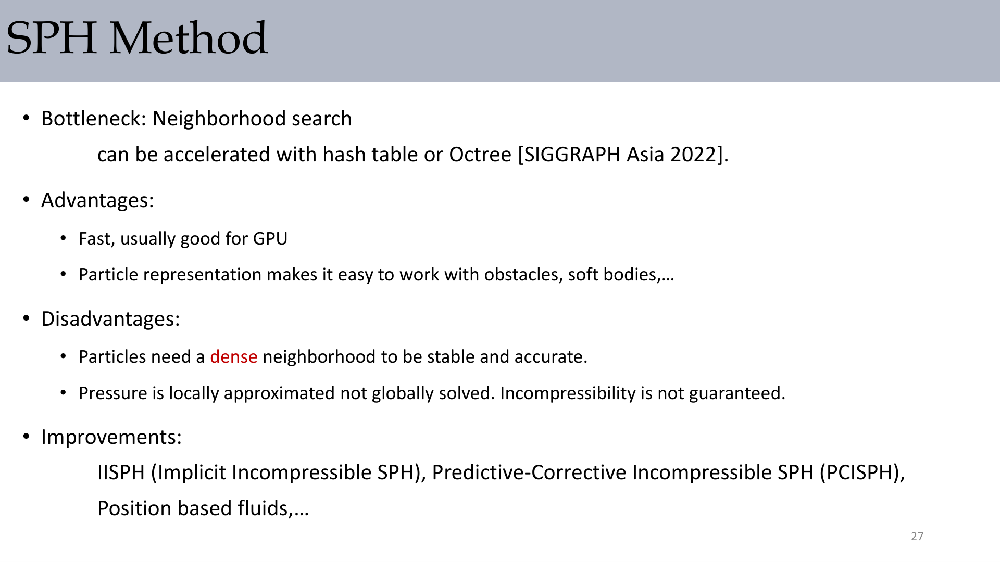

## 4. Eulerian vs Lagrangian vs Hybrid

The governing relation is:

$$
\frac{d\mathbf{u}}{dt}=\frac{\partial\mathbf{u}}{\partial t}+\mathbf{u}\cdot\nabla\mathbf{u}
= -\frac{1}{\rho}\nabla p + \nu\nabla\cdot\nabla\mathbf{u}+\mathbf{f},
\qquad
\nabla\cdot\mathbf{u}=0
$$

Pure Eulerian and pure Lagrangian each solve only part of the implementation problem well. Hybrid methods use particles for advection and grids for pressure projection.

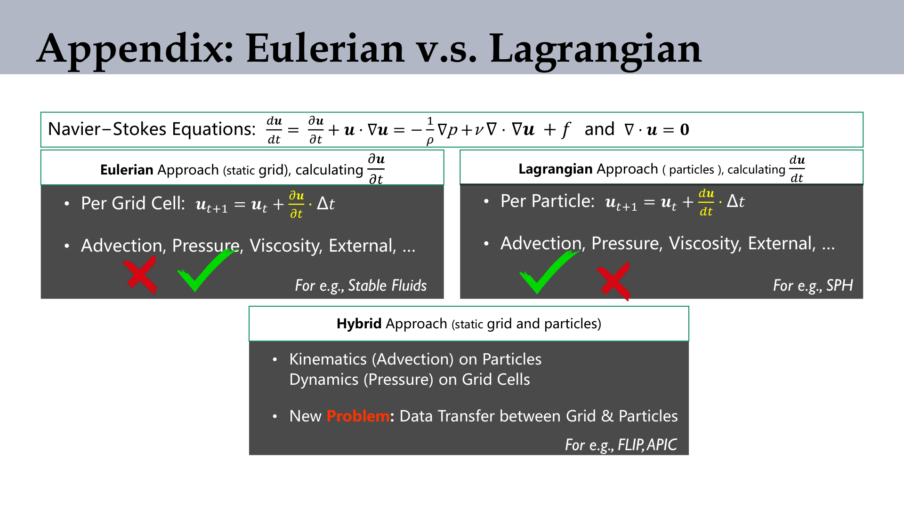

:::remark Key Question (original phrase): "New Problem: Data Transfer between Grid & Particles"
Hybrid methods gain stability/detail tradeoffs, but transfer design becomes the core numerical challenge. PIC/FLIP/APIC are different answers to this transfer problem.
:::

## 5. PIC, RPIC, and APIC

### 5.1 PIC Baseline

The lecture summary is:

- **"PIC: translational velocity transfer (dissipation)"**

$$
\text{PIC P2G: }
m_i^n=\sum_pw_{ip}^nm_p,
\quad
m_i^n\mathbf{v}_i^n=\sum_pw_{ip}^nm_p\mathbf{v}_p^n
$$

$$
\text{PIC G2P: }
\mathbf{v}_p^{n+1}=\sum_iw_{ip}^n\tilde{\mathbf{v}}_i^{n+1}
$$

### 5.2 RPIC Extension

The lecture summary is:

- **"RPIC: translational velocity and rotational velocity"**

$$
(m\mathbf{v})_i^{n+1}=\sum_pw_{i,p}\Big[m_p\mathbf{v}_p^n+m_p\boldsymbol\omega_p^n\times(\mathbf{x}_i-\mathbf{x}_p^n)\Big]
$$

$$
\boldsymbol\omega_p^{n+1}=(\mathbf{K}_p^n)^{-1}\mathbf{L}_p^{n+1}
$$

### 5.3 APIC Core Idea and Equations

The lecture summary is:

- **"APIC: affine motion transfer, represented by matrix $\mathbf{C}$"**

$$
\text{APIC P2G: }
(m\mathbf{v})_i^{n+1}=\sum_pw_{i,p}\Big[m_p\mathbf{v}_p^n+m_p\mathbf{C}_p^n(\mathbf{x}_i-\mathbf{x}_p^n)\Big]
$$

$$
\text{APIC G2P: }
\mathbf{v}_p^{n+1}=\sum_iw_{i,p}\mathbf{v}_i^{n+1},
\qquad
\mathbf{C}_p^{n+1}=\mathbf{B}_p^{n+1}(\mathbf{D}_p^n)^{-1}
$$

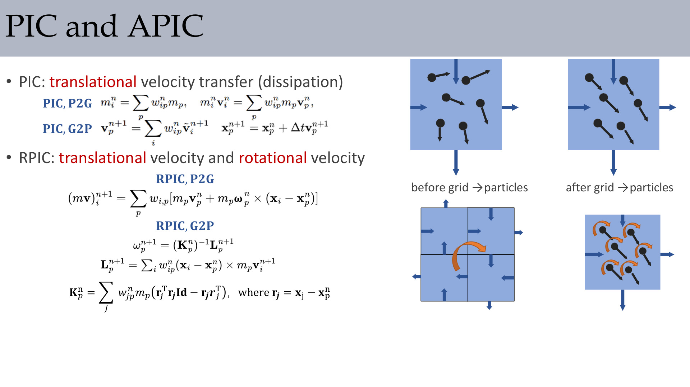

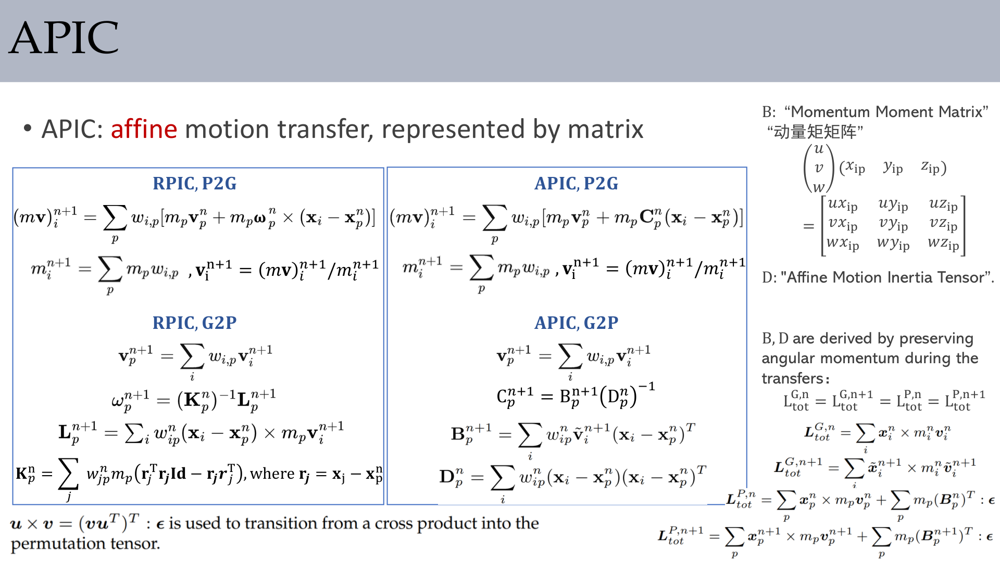

### 5.4 Avoiding Expensive or Singular $\mathbf{D}_p^{-1}$

Centered-grid quadratic/cubic B-spline gives constant-form $\mathbf{D}_p$:

$$
\omega_{ip}^n=N_{\mathrm{quadratic}}\Rightarrow \mathbf{D}_p^n=\frac{1}{4}\Delta x^2\mathbf{I},
\qquad
\omega_{ip}^n=N_{\mathrm{cubic}}\Rightarrow \mathbf{D}_p^n=\frac{1}{3}\Delta x^2\mathbf{I}
$$

For quadratic centered grids:

$$
\mathbf{C}_p^{n+1}=\frac{4}{\Delta x^2}\sum_iw_{i,p}\mathbf{v}_i^{n+1}(\mathbf{x}_i-\mathbf{x}_p^n)^T
$$

On MAC grids, linear interpolation uses identity:

$$
\omega_{ip}^n(\mathbf{D}_p^n)^{-1}(\mathbf{x}_i-\mathbf{x}_p^n)=\nabla\omega_{ip}^n
$$

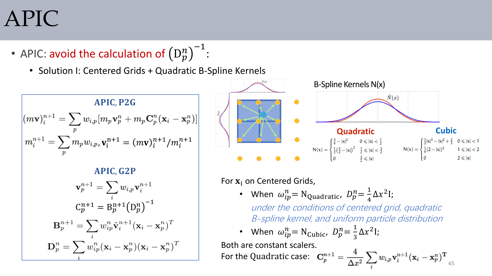

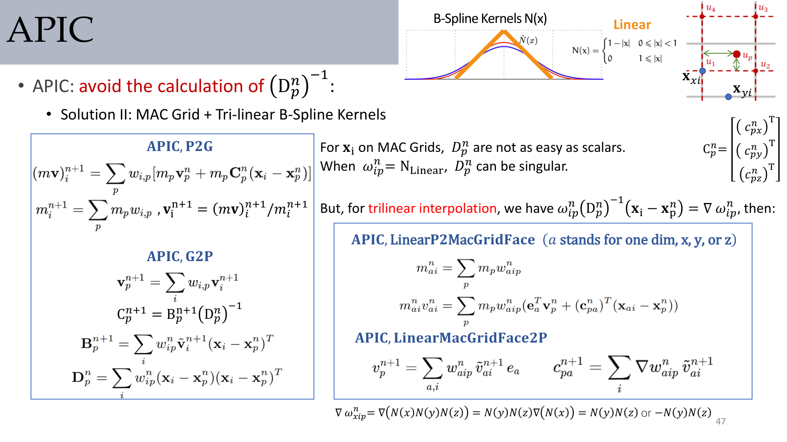

### 5.5 Full APIC Pipeline

Particle integration + APIC transfer + grid pressure projection + APIC back transfer:

$$
\mathbf{x}_p^{n+1}=\mathbf{x}_p^n+\mathbf{v}_p^n\Delta t,
\qquad
\mathbf{v}_p^*=\mathbf{v}_p^n+\mathbf{f}_{\mathrm{extra}}\Delta t
$$

$$
\mathbf{v}_i^*=(m\mathbf{v})_i^{n+1}/m_i^{n+1},
\qquad
\mathbf{v}_i^{n+1}=\mathrm{PressureProjection}(\mathbf{v}_i^*,BC)
$$

$$
\mathbf{v}_p^{n+1}=\sum_iw_{i,p}\mathbf{v}_i^{n+1},
\qquad
\mathbf{C}_p^{n+1}=\frac{4}{\Delta x^2}\sum_iw_{i,p}\mathbf{v}_i^{n+1}(\mathbf{x}_i-\mathbf{x}_p^n)^T
$$

- **"Only P2G and G2P conserve angular momentum!"**

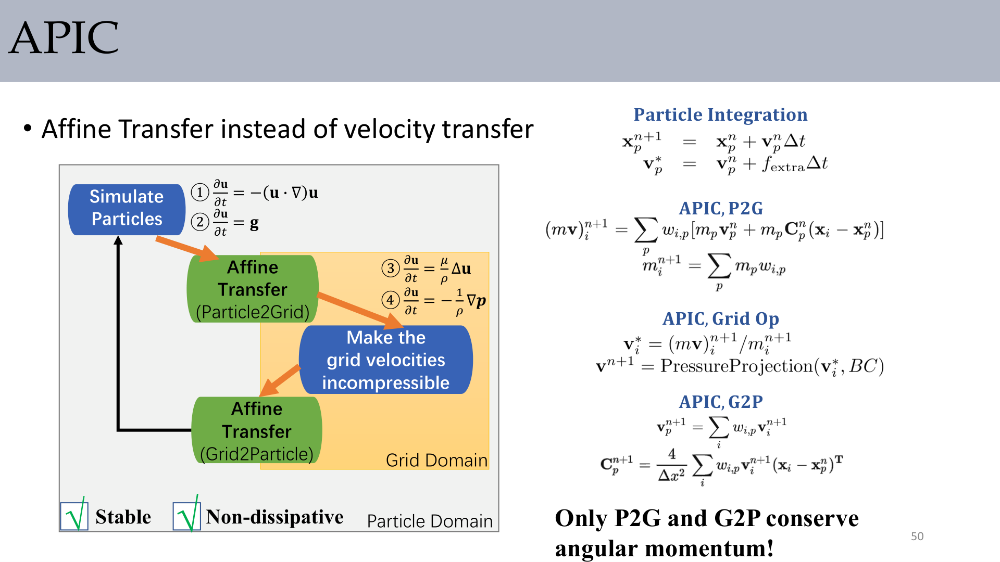

:::remark Key Question (original): compare PIC and APIC, how does $\mathbf{v}_p^n$ contribute to $\mathbf{v}_i^n$?
PIC transfers only a local constant velocity component. APIC transfers constant plus first-order (affine) variation via $\mathbf{C}_p^n(\mathbf{x}_i-\mathbf{x}_p^n)$, so local shear/rotation is preserved much better.
:::

## 6. Appendix A: Fluid-Solid Coupling

### 6.1 One-Way Coupling

Main idea:

- Solid affecting fluid: enforce boundary conditions.
- Fluid affecting solid: compute coupling pressure and apply force.

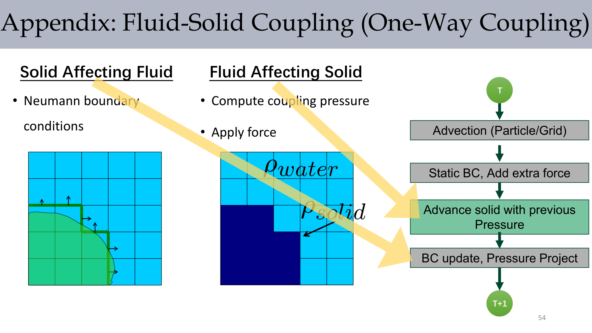

### 6.2 Two-Way Coupling (Variational View)

$$
KE=\iiint_{\mathrm{fluid}}\frac{1}{2}\rho\|\mathbf{u}\|^2+\frac{1}{2}\mathbf{V}^*\mathbf{M}_s\mathbf{V}
$$

$$
\mathbf{u}^{n+1}=\tilde{\mathbf{u}}-\frac{\Delta t}{\rho}\nabla p,
\qquad
\mathbf{V}^{n+1}=\mathbf{V}^n+\Delta t\mathbf{M}_s^{-1}\mathbf{J}p
$$

$$
\frac{\Delta t}{\rho^2}\mathbf{G}^T\mathbf{M}_f\mathbf{G}p=\frac{1}{\rho}\mathbf{G}^T\mathbf{M}_f\tilde{\mathbf{u}}
$$

$$
\nabla\cdot\mathbf{u}^{n+1}=0,
\qquad
\mathbf{u}^{n+1}\cdot\hat{\mathbf{n}}=\mathbf{v}^{n+1}\cdot\hat{\mathbf{n}}
$$

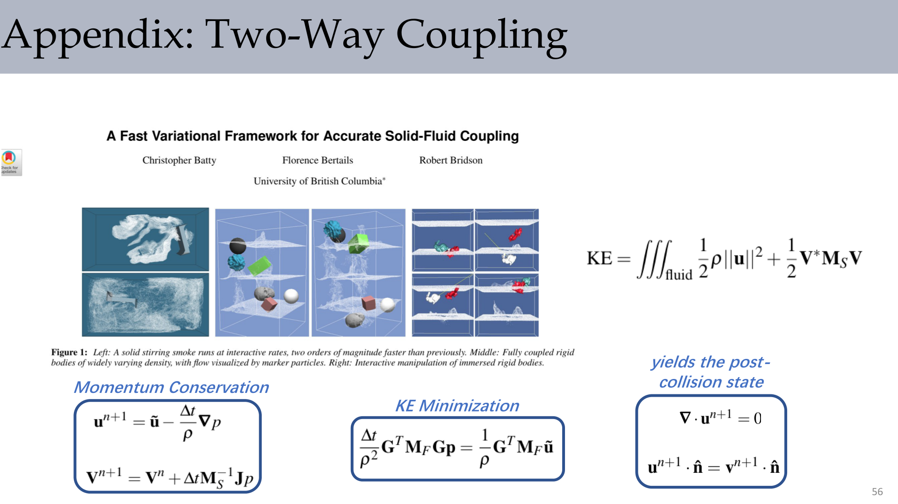

:::remark Key Question (original intent): one-way or two-way coupling?
Use one-way when the solid motion barely changes fluid feedback. Use two-way when momentum exchange is strong and visual/physical error from decoupling is noticeable.
:::

## 7. Appendix B: Conservation Laws for Continua

### 7.1 Mass Conservation

$$
\frac{d}{dt}\int_\Omega\rho\,dV
=-\oiint_{\partial\Omega}\rho\mathbf{v}\cdot\mathbf{n}\,dS
=-\int_\Omega\nabla\cdot(\rho\mathbf{v})\,dV
$$

$$
\frac{\partial\rho}{\partial t}=-\nabla\cdot(\rho\mathbf{v})
$$

For incompressible flow:

$$
\frac{D\rho}{Dt}=0\Rightarrow\nabla\cdot\mathbf{v}=0
$$

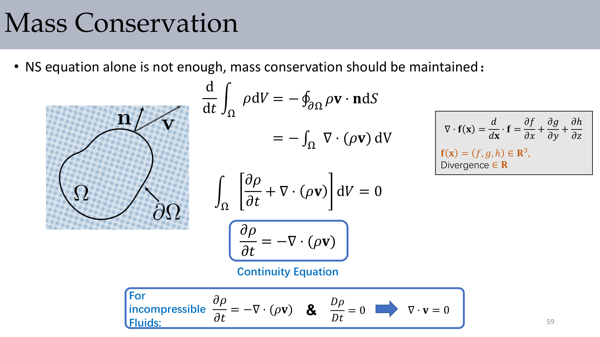

### 7.2 Linear Momentum and Cauchy Stress

$$
\int_\Omega\rho\frac{d\mathbf{v}}{dt}dV
=\oiint_{\partial\Omega}\mathbf{f}_{\mathrm{surface}}dS + \int_\Omega\mathbf{f}_{\mathrm{body}}dV
$$

$$
\mathbf{t}=\boldsymbol\sigma\mathbf{n},
\qquad
\oiint_{\partial\Omega}\boldsymbol\sigma\mathbf{n}\,dS=\int_\Omega\nabla\cdot\boldsymbol\sigma\,dV
$$

$$
\rho\frac{d\mathbf{v}}{dt}=\nabla\cdot\boldsymbol\sigma+\mathbf{f}_{\mathrm{body}}
$$

### 7.3 Angular Momentum Balance

No net torque from internal traction implies stress symmetry:

$$
\sigma_{01}dh=\sigma_{10}dh
\Rightarrow
\boldsymbol\sigma=\boldsymbol\sigma^T
$$

### 7.4 Newtonian Stress to Viscous Laplacian

$$
\boldsymbol\sigma=-p\mathbf{I}+\mu\left(\nabla\mathbf{u}+(\nabla\mathbf{u})^T\right)
$$

$$
\rho\left(\frac{\partial\mathbf{u}}{\partial t}+\mathbf{u}\cdot\nabla\mathbf{u}\right)
= -\nabla p + \nabla\cdot\left[\mu\left(\nabla\mathbf{u}+(\nabla\mathbf{u})^T\right)\right] + \rho\mathbf{g}
$$

Under incompressibility, the viscous term simplifies to component-wise Laplacians (e.g., $\mu\nabla^2u$).

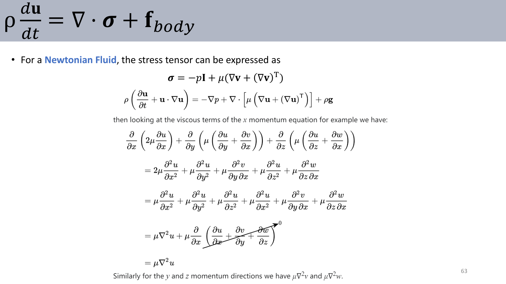

:::remark Key Question (original intent): Why does viscosity often appear as $\mu\nabla^2\mathbf{u}$ in incompressible fluids?
Because the extra term from expanding $\nabla\cdot(\mu(\nabla\mathbf{u}+(\nabla\mathbf{u})^T))$ contains derivatives of $\nabla\cdot\mathbf{u}$, which vanish when $\nabla\cdot\mathbf{u}=0$.
:::

## 8. Exam Review

### A. Definitions You Should State Precisely

- **SPH interpolation**: weighted local particle summation using kernels.
- **Kernel support radius**: compact neighborhood where kernel is non-zero.
- **Momentum-conserved SPH force forms**: pairwise antisymmetric pressure/viscosity discretizations.
- **PIC**: constant (translational) transfer, robust but dissipative.
- **RPIC**: adds rotational transfer.
- **APIC**: affine transfer via matrix $\mathbf{C}$, reducing dissipation while preserving local motion structure.

### B. Mechanism Chain (Short-Answer Template)

1. Start from Navier-Stokes split into advection/external/viscosity/pressure terms.
2. SPH: approximate density/pressure/forces via kernels.
3. Fix internal-force momentum issues using symmetric (conserved) forms.
4. Hybrid methods: advection on particles, pressure projection on grids.
5. APIC: use affine P2G/G2P transfer to reduce PIC dissipation.

### C. Common Pitfalls

- Using SPH pressure/viscosity formulas without momentum-symmetry checks.
- Ignoring neighborhood quality (too sparse neighbors -> unstable SPH).
- Treating APIC as only "better interpolation" without angular-momentum reasoning.
- Forgetting that transfer design dominates hybrid solver quality.
- Mixing continuum equations and discrete force formulas without consistency.

### D. Self-Check Questions

- Can you derive the final SPH interpolation form from $V_i=m_i/\rho_i$?
- Can you explain why naive SPH pressure/viscosity can violate momentum conservation?
- Can you write the APIC P2G and G2P equations from memory?
- Can you explain the role of $\mathbf{D}_p$, and why some settings make it easy or singular?
- Can you connect Cauchy stress form to the incompressible Navier-Stokes viscous term?

