# 第8讲 FEM 与超弹性材料模型

## 1. 全局图景

本讲从连续体力学出发，建立可落地的 FEM 形变仿真流程：

- 从守恒律和应力出发。
- 定义形变、应变与能量。
- 用能量导出 FEM 力。
- 扩展到超弹性与不变量驱动的材料模型。

## 2. 连续体守恒律

### 2.1 质量守恒

$$
\frac{d}{dt}\int_\Omega \rho\, dV = -\oint_{\partial\Omega} \rho \mathbf{v}\cdot\mathbf{n}\, dS
= -\int_\Omega \nabla\cdot(\rho\mathbf{v})\, dV
$$

连续性方程：

$$
\frac{\partial \rho}{\partial t} = -\nabla\cdot(\rho\mathbf{v})
$$

不可压缩条件：$\frac{D\rho}{Dt}=0$，因此 $\nabla\cdot\mathbf{v}=0$。

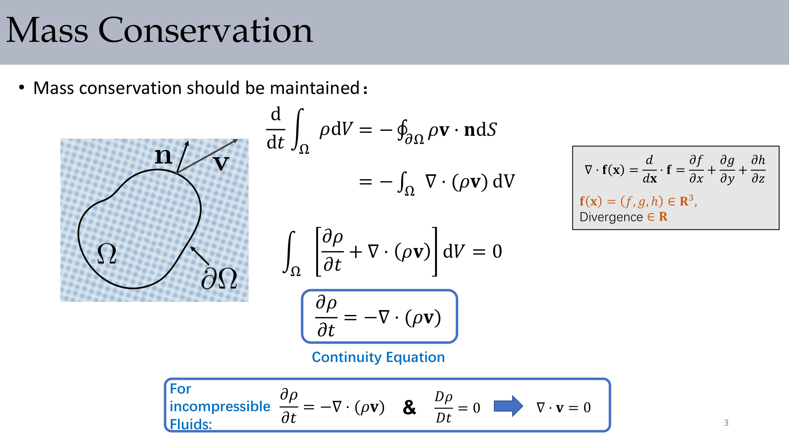

### 2.2 线动量守恒

体力与表面力共同决定加速度：

$$
\int_\Omega \rho\,\frac{d\mathbf{v}}{dt}\, dV = \oint_{\partial\Omega} \mathbf{f}_{\text{surface}}\, dS + \int_\Omega \mathbf{f}_{\text{body}}\, dV
$$

牵引力与 Cauchy 应力：

$$
\mathbf{t} = \boldsymbol\sigma\,\mathbf{n}
$$

从而得到 Cauchy 运动方程：

$$
\rho\,\frac{d\mathbf{u}}{dt} = \nabla\cdot\boldsymbol\sigma + \mathbf{f}_{\text{body}}
$$

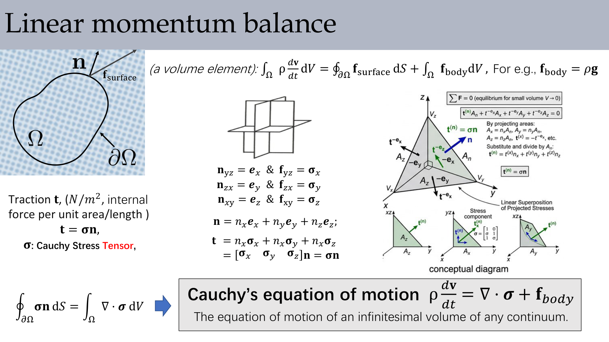

### 2.3 角动量守恒

无穷小体元上的牵引力不产生合力矩，得到应力对称性：

$$
\boldsymbol\sigma = \boldsymbol\sigma^T
$$

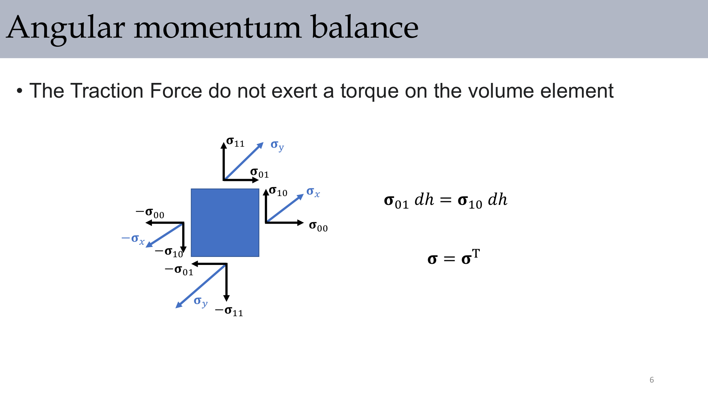

### 2.4 牛顿流体应力（回顾）

$$
\boldsymbol\sigma = -p\mathbf{I} + \mu(\nabla\mathbf{v} + (\nabla\mathbf{v})^T)
$$

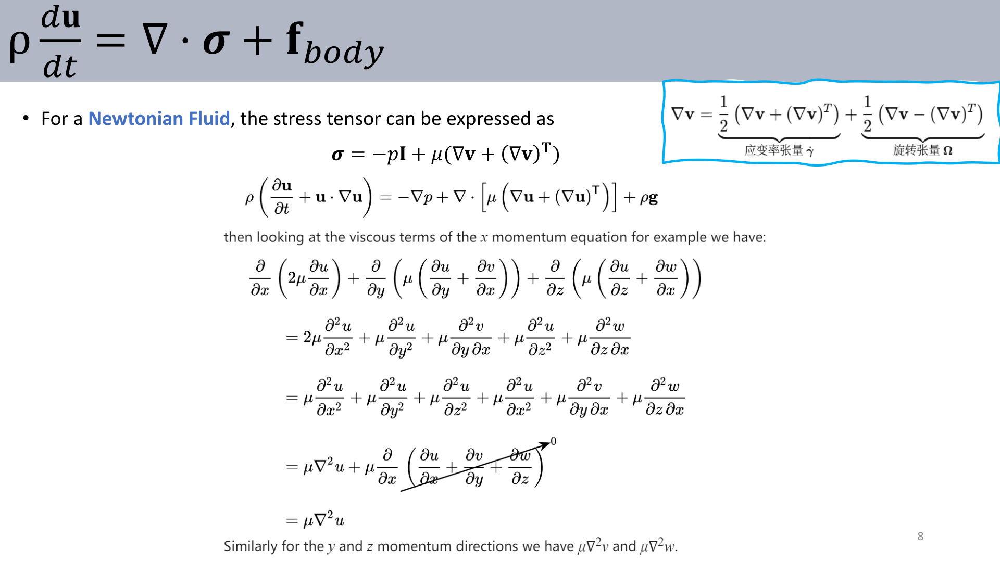

:::remark 关键问题（原意复述）：角动量守恒为什么重要？
因为它保证 Cauchy 应力张量是对称的，这是后续应变、能量与 FEM 推导的基础。
:::

## 3. 弹性建模：弹簧-质点 vs FEM

### 3.1 弹簧-质点直觉

$$
F = \frac{l}{l_0},\quad G = \frac{l}{l_0} - 1,\quad E = \frac{1}{2}kG^2
$$

$$
\mathbf{f}_i = -kG\frac{\mathbf{x}_{ij}}{\|\mathbf{x}_{ij}\|}
$$

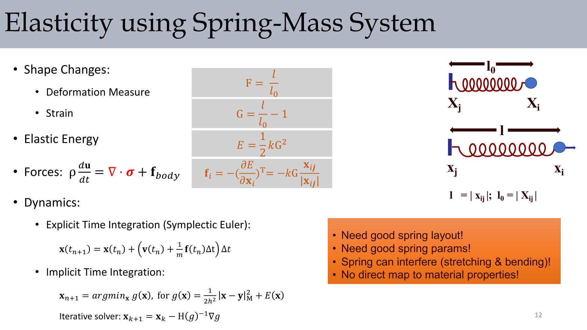

缺点：依赖弹簧布局、参数难调、难直接对应材料参数。

### 3.2 连续体 FEM 视角

FEM 以形变度量、应变、能量密度与应力为核心，材料参数具有物理意义。

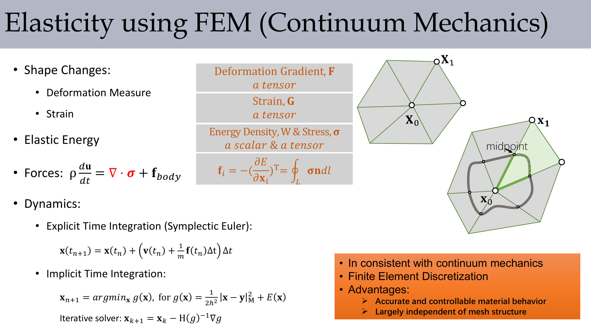

:::remark 关键问题（原意复述）：为什么要从弹簧转向 FEM？
弹簧容易实现，但材料行为受网格与参数影响很大；FEM 从能量出发，材料参数稳定且可控，更接近真实物理。
:::

## 4. 形变场与形变梯度

形变映射：

$$
\mathbf{x} = \varphi(\mathbf{X})
$$

局部线性化：

$$
\mathbf{x} \approx \mathbf{F}\mathbf{X} + \mathbf{b},
\quad \mathbf{F}=\frac{\partial\mathbf{x}}{\partial\mathbf{X}}
$$

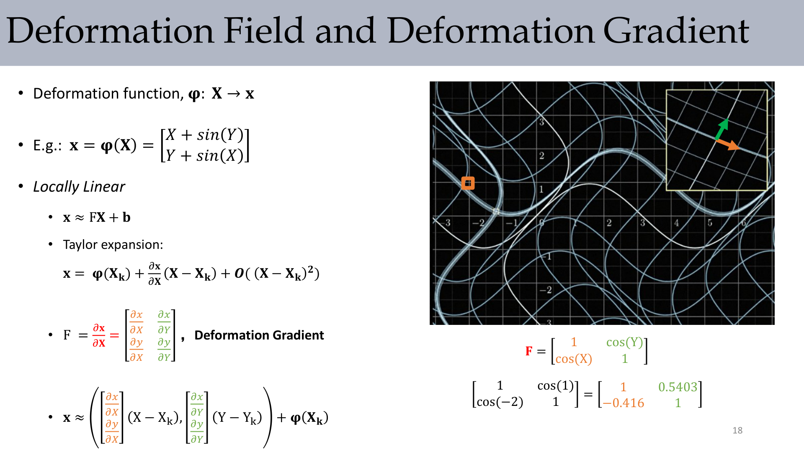

三角形线性 FEM：

$$
\mathbf{F}[\mathbf{X}_{10}\ \mathbf{X}_{20}] = [\mathbf{x}_{10}\ \mathbf{x}_{20}],
\quad \mathbf{F} = [\mathbf{x}_{10}\ \mathbf{x}_{20}][\mathbf{X}_{10}\ \mathbf{X}_{20}]^{-1}
$$

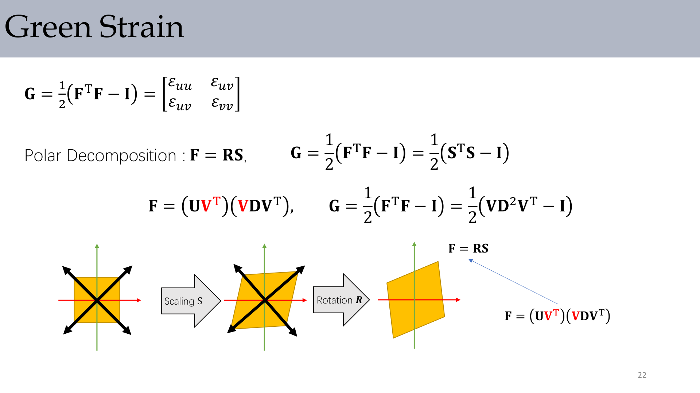

## 5. Green 应变与旋转剥离

$$
\mathbf{G} = \frac{1}{2}(\mathbf{F}^T\mathbf{F} - \mathbf{I})
$$

极分解：

$$
\mathbf{F} = \mathbf{R}\mathbf{S},\quad \mathbf{G} = \frac{1}{2}(\mathbf{S}^T\mathbf{S} - \mathbf{I})
$$

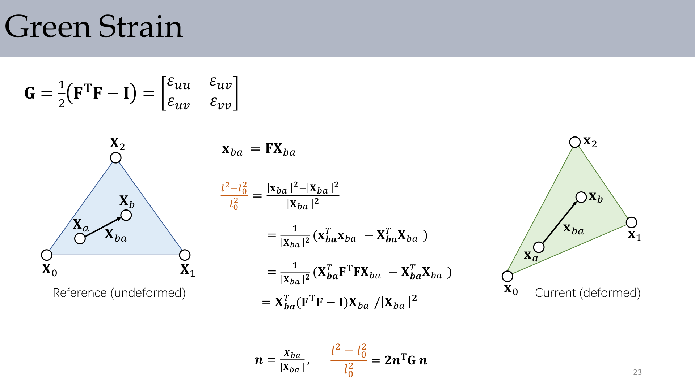

几何关系：

$$
\frac{l^2-l_0^2}{l_0^2} = 2\mathbf{n}^T\mathbf{G}\mathbf{n}
$$

## 6. 能量密度与应力

能量密度 $W(\mathbf{G})$ 给出总能量：

$$
E = \int W(\mathbf{G})\, dA = A_{\text{ref}} W(\epsilon_{uu},\epsilon_{vv},\epsilon_{uv})
$$

StVK 模型：

$$
W = \frac{\lambda}{2}(\epsilon_{uu}+\epsilon_{vv})^2 + \mu(\epsilon_{uu}^2+\epsilon_{vv}^2+2\epsilon_{uv}^2)
$$

应力：

$$
\mathbf{S} = \frac{\partial W}{\partial\mathbf{G}} = 2\mu\mathbf{G} + \lambda\,\text{trace}(\mathbf{G})\mathbf{I}
$$

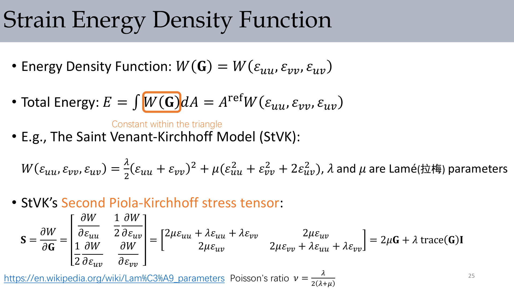

力来自能量梯度：

$$
\mathbf{f}_i = -\left(\frac{\partial E}{\partial \mathbf{x}_i}\right)^T
$$

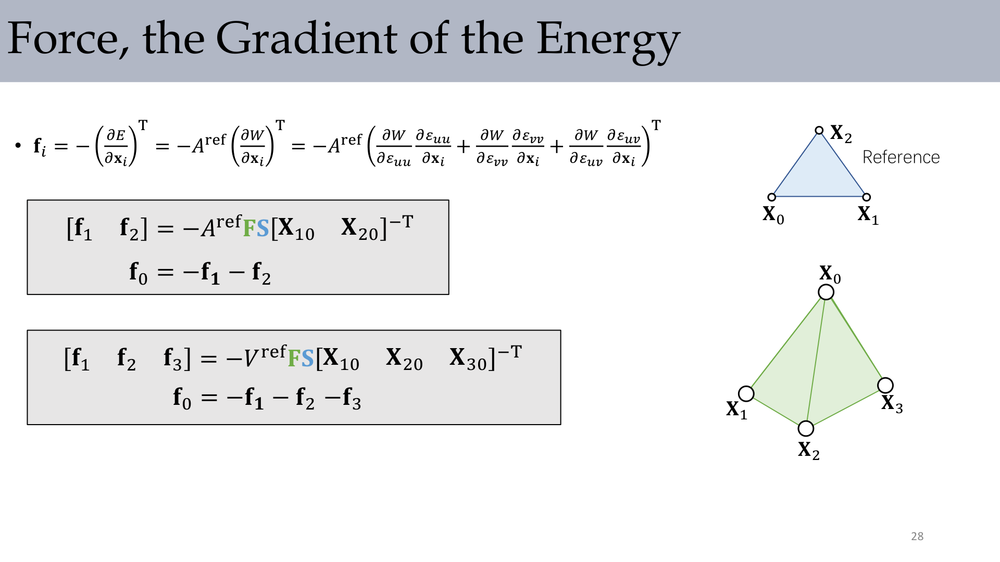

## 7. 不同应力与 Nanson 公式

应力与牵引力的映射：

- 二阶 PK：$\mathbf{T} = \mathbf{S}\mathbf{N}$（参考）
- 一阶 PK：$\mathbf{P} = \mathbf{F}\mathbf{S}$
- Cauchy：$\mathbf{t} = \boldsymbol\sigma\mathbf{n}$（当前）

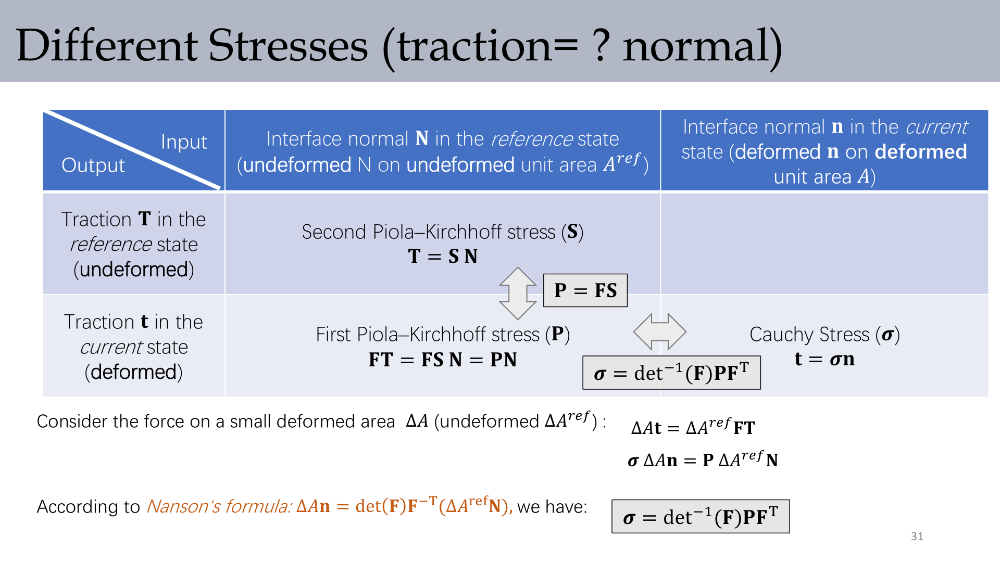

Nanson 公式：

$$
\mathbf{A}\mathbf{n} = \det(\mathbf{F})\mathbf{F}^{-T}(A_{\text{ref}}\mathbf{N})
$$

因此：

$$
\boldsymbol\sigma = \det(\mathbf{F})^{-1}\mathbf{P}\mathbf{F}^T
$$

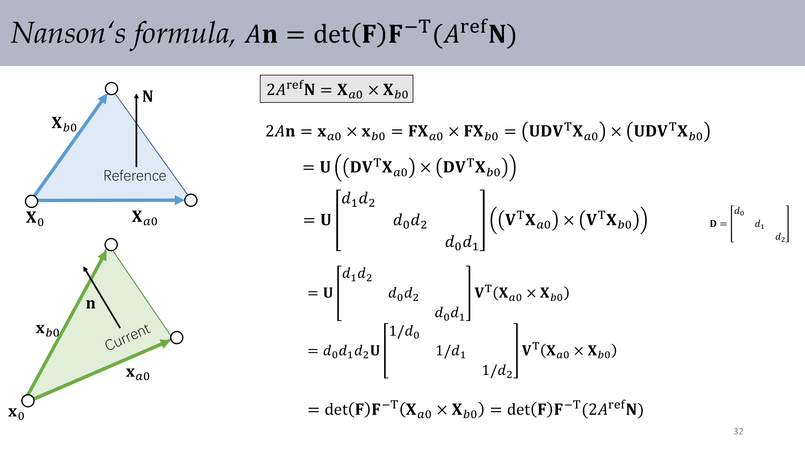

## 8. 线性 FEM 力总结

四面体：

$$
\mathbf{E}=[\mathbf{X}_{10}\ \mathbf{X}_{20}\ \mathbf{X}_{30}],
\quad \mathbf{F}=[\mathbf{x}_{10}\ \mathbf{x}_{20}\ \mathbf{x}_{30}]\mathbf{E}^{-1}
$$

$$
[\mathbf{f}_1\ \mathbf{f}_2\ \mathbf{f}_3] = -V_{\text{ref}}\mathbf{P}\mathbf{E}^{-T},
\quad \mathbf{f}_0 = -\mathbf{f}_1-\mathbf{f}_2-\mathbf{f}_3
$$

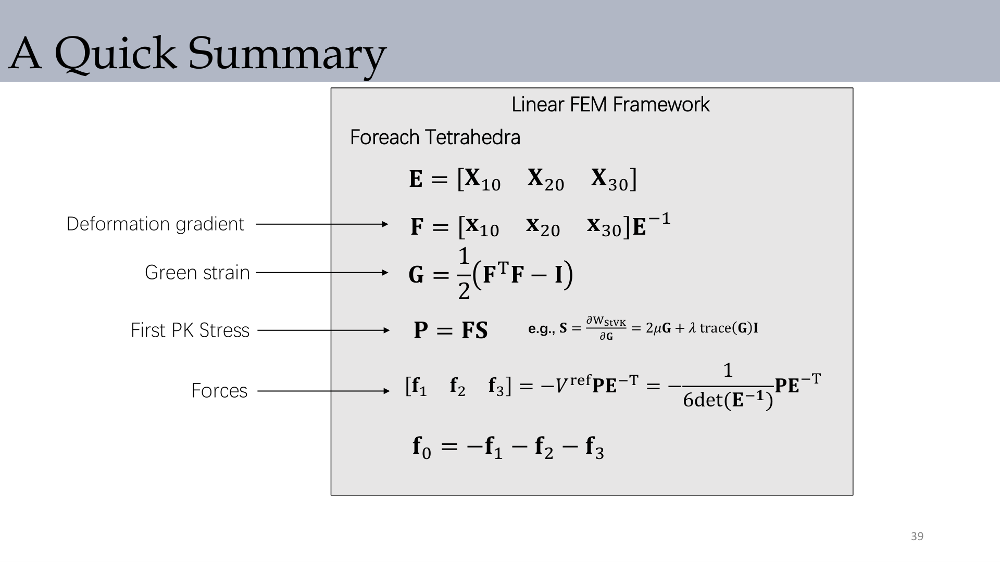

## 9. 超弹性与不变量

超弹性能量形式：

$$
E = \int_\Omega \Psi(\mathbf{F})\, d\mathbf{x},
\quad \mathbf{f}_i = -\left(\frac{\partial E}{\partial \mathbf{x}_i}\right)^T
$$

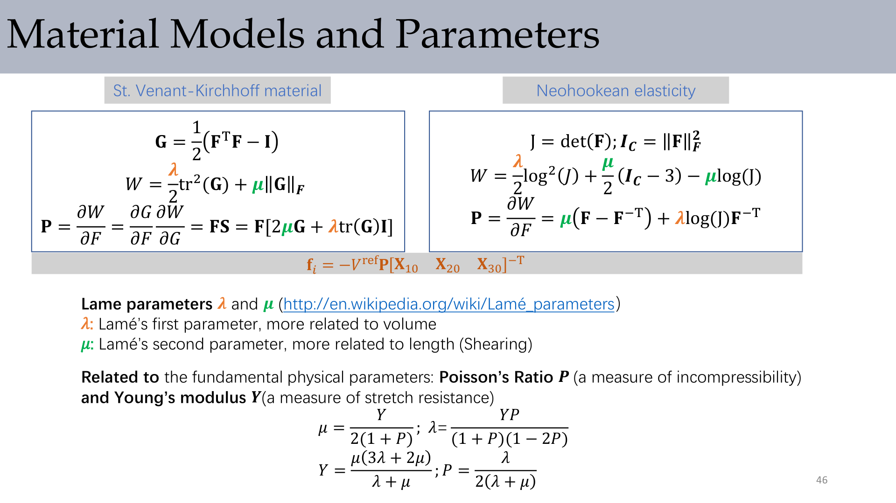

Cauchy-Green 不变量：

$$
\mathbf{C} = \mathbf{F}^T\mathbf{F}
$$

$$
I_C = \text{tr}(\mathbf{C}),\quad II_C = \text{tr}(\mathbf{C}^2),\quad III_C = \det(\mathbf{C}) = J^2
$$

$$
I_C^* = \frac{1}{2}(I_C^2 - II_C)
$$

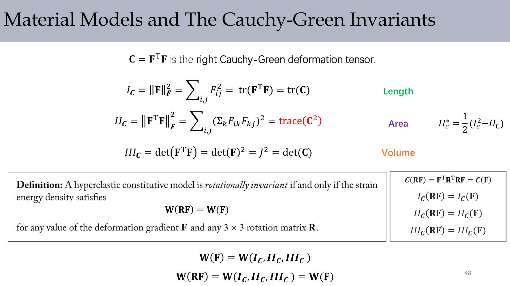

## 10. 材料模型与对比

常见选择：

- StVK：旋转不变，但抗压弱、体积保持不准。
- Neo-Hookean：体积保持更好，但压缩很硬且翻转时失效。

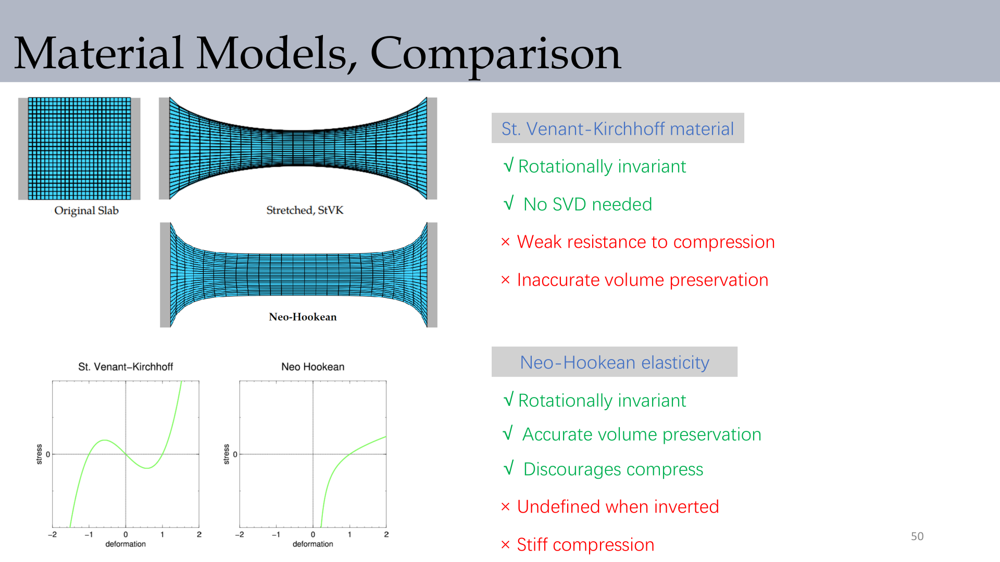

示例公式：

$$
W_{\text{StVK}} = \frac{\lambda}{2}(I_C-3)^2 + \frac{\mu}{4}(II_C-2I_C+3)
$$

$$
W = \frac{\lambda}{2}\log^2 J + \frac{\mu}{2}(I_C-3) - \mu\log J,
\quad \mathbf{P} = \mu(\mathbf{F}-\mathbf{F}^{-T}) + \lambda\log(J)\mathbf{F}^{-T}
$$

## 11. 各向同性材料

各向同性模型只依赖主伸长：

$$
W(\mathbf{F}) = W(\mathbf{U}\mathbf{\Lambda}\mathbf{V}^T) = W(\lambda_0,\lambda_1,\lambda_2)
$$

$$
\mathbf{P}(\mathbf{F}) = \mathbf{U}\,\text{diag}\left(\frac{\partial W}{\partial \lambda_0},\frac{\partial W}{\partial \lambda_1},\frac{\partial W}{\partial \lambda_2}\right)\mathbf{V}^T
$$

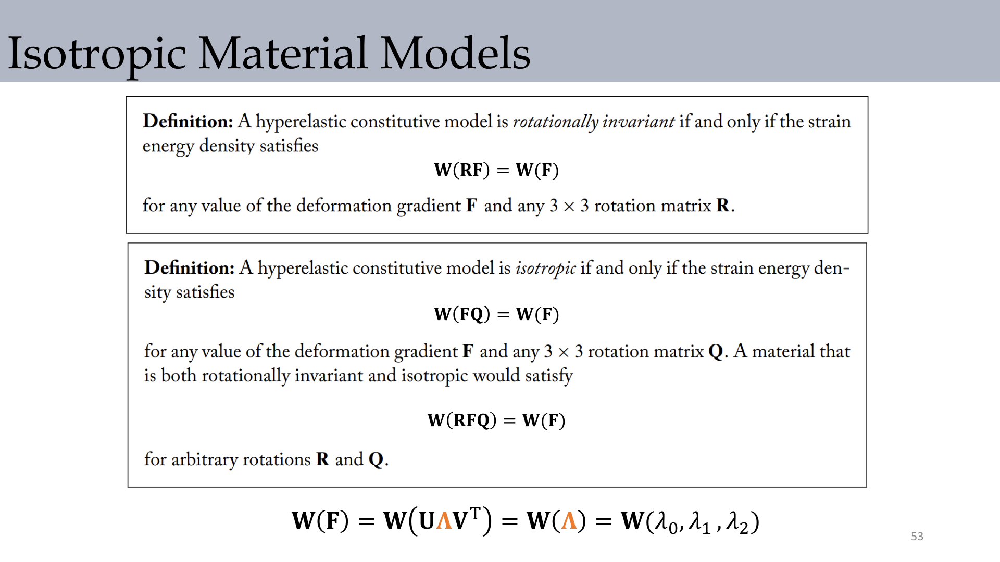

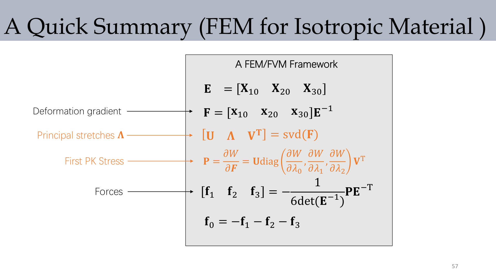

## 12. 课后阅读

- Teran et al. 2003. Finite Volume Methods for the Simulation of Skeleton Muscles. SCA.
- Sifakis and Barbic (2012). FEM simulation of 3D deformable solids: A practitioner's guide to theory, discretization and model reduction.
- Xu et al. 2015. Nonlinear Material Design Using Principal Stretches. TOG (SIGGRAPH).

## 13. Exam Review

### 关键定义

- 形变映射：$\mathbf{x}=\varphi(\mathbf{X})$，形变梯度 $\mathbf{F}=\partial\mathbf{x}/\partial\mathbf{X}$。
- Green 应变：$\mathbf{G}=\frac{1}{2}(\mathbf{F}^T\mathbf{F}-\mathbf{I})$。
- 应力类型：二阶 PK（$\mathbf{S}$）、一阶 PK（$\mathbf{P}$）、Cauchy（$\boldsymbol\sigma$）。
- 不变量：$I_C, II_C, III_C$，其中 $\mathbf{C}=\mathbf{F}^T\mathbf{F}$。

### 机制要点

1. $\mathbf{F}$ 如何把参考向量映射到当前向量。
2. $\mathbf{G}$ 如何剥离旋转并表达伸长。
3. 能量密度 $W$ 如何产生力 $\mathbf{f}_i=-\partial E/\partial\mathbf{x}_i$。
4. Nanson 公式如何连接参考与当前应力。

### 简答模板

- **定义应力类型：** 说明它作用的法向（参考 or 当前）以及如何得到牵引力。
- **对比 StVK 与 Neo-Hookean：** StVK 简单但抗压弱；Neo-Hookean 体积更稳但压缩硬、翻转失效。
- **线性 FEM 流程：** 求 $\mathbf{E}$ 与 $\mathbf{F}$，计算 $W$ 与 $\mathbf{P}$，再用 $-V_{\text{ref}}\mathbf{P}\mathbf{E}^{-T}$ 装配力。

### 易错点

- 搞混参考法向与当前法向。
- 直接用 $\mathbf{F}$ 当应变，忽略旋转。
- 在大压缩场景下使用 StVK 而不做修正。

### 自检清单

- 能否从 $\mathbf{P}$ 推导 $\boldsymbol\sigma$？
- 能否用不变量解释旋转不变性？
- 能否写出单元级力的公式？
