# Lec9 Spring-Mass System: Explicit/Implicit Euler and Energy Minimization

## 1. Big Picture

This lecture builds a complete simulation pipeline for a spring-mass system:

1. Spatial discretization: particles + springs.
2. Temporal discretization: explicit Euler vs implicit Euler.
3. Numerical optimization: convert implicit Euler to minimization and solve it with Newton-type methods.

The central takeaway is:

- **"Implicit Euler = energy minimization"**.
- Once written in minimization form, stability and solver design become much clearer.

## 2. Spatial Discretization: Particle System and Spring Energy

### 2.1 Particle State Representation

Each particle stores state and parameters:

- position $\mathbf{x}$
- velocity $\mathbf{v}$
- force calculator/output $\mathbf{f}$
- mass $m$

A full particle system is the collection of all particles over simulation time.

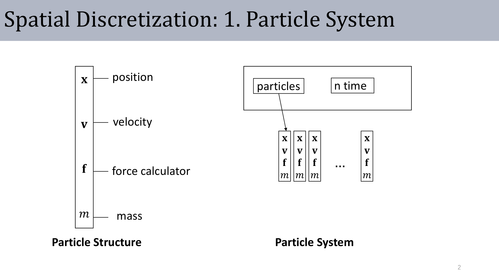

### 2.2 Spring Energy and Pairwise Force

For a spring connecting particles $i$ and $j$:

$$
\mathbf{x}_{ij}=\mathbf{x}_j-\mathbf{x}_i,
\qquad
E_{ij}=\frac{1}{2}k\left(\lVert\mathbf{x}_{ij}\rVert-l_0\right)^2
$$

The spring force from $j$ to $i$ is

$$
\mathbf{f}_{ij}=k\left(\lVert\mathbf{x}_{ij}\rVert-l_0\right)\frac{\mathbf{x}_{ij}}{\lVert\mathbf{x}_{ij}\rVert}=-\mathbf{f}_{ji}
$$

Total force on particle $i$:

$$
\mathbf{f}_i=\sum_{j\in N(i)}\mathbf{f}_{ij}+\mathbf{f}_i^{ext}
$$

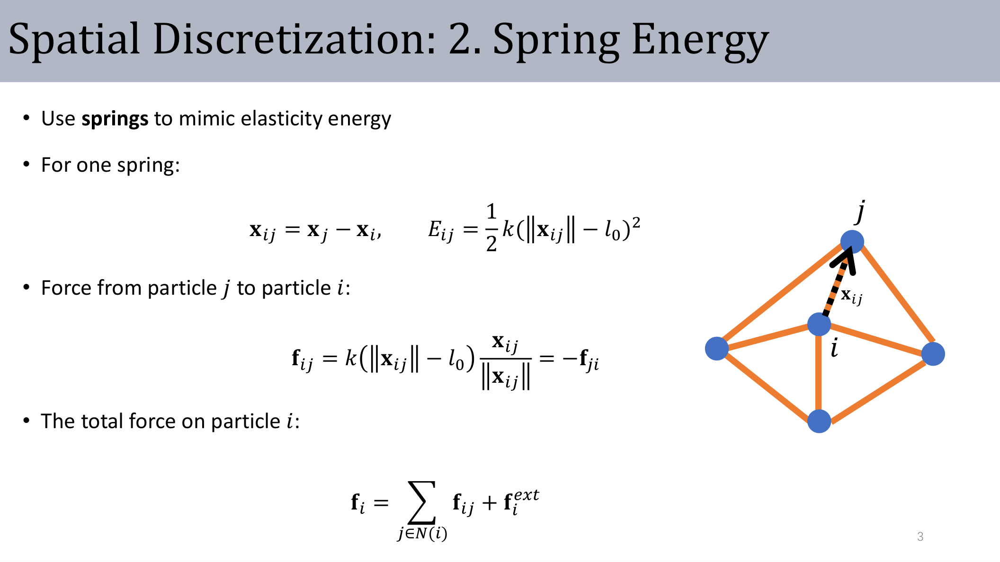

:::remark Key Question (original intent): Why is $\mathbf{f}_{ij}=-\mathbf{f}_{ji}$ so important?
Because internal pairwise antisymmetry gives momentum consistency inside the system. If this symmetry is broken, the model can generate artificial net internal force.
:::

## 3. Temporal Discretization: Explicit Euler Baseline

### 3.1 Integral Form to Explicit Updates

Explicit Euler uses left-endpoint approximation:

$$
\mathbf{x}(t_n)-\mathbf{x}(t_{n-1})=\int_{t_{n-1}}^{t_n}\mathbf{v}(t)\,dt\approx \mathbf{v}(t_{n-1})\Delta t
$$

$$
\mathbf{v}(t_n)-\mathbf{v}(t_{n-1})=\frac{1}{m}\int_{t_{n-1}}^{t_n}\mathbf{f}(t)\,dt\approx \frac{1}{m}\mathbf{f}(t_{n-1})\Delta t
$$

So the practical step is

$$
\mathbf{x}(t_{n+1})=\mathbf{x}(t_n)+\mathbf{v}(t_n)\Delta t,
\qquad
\mathbf{v}(t_{n+1})=\mathbf{v}(t_n)+\frac{1}{m}\mathbf{f}(t_n)\Delta t
$$

### 3.2 Explicit Simulator Loop

At each step $t_n\to t_{n+1}$:

1. Compute spring forces from current positions.
2. Update positions with current velocity.
3. Update velocities with current force.

The method is simple and fast, but accuracy/stability are limited for stiff systems.

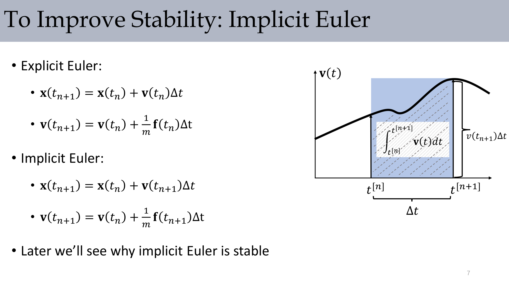

:::remark Key Question (original phrase): "We know this is very inaccurate..." Why?
Because force depends on position, but explicit Euler evaluates force at the old state. For stiff springs, this causes large truncation error and easy energy blow-up unless $\Delta t$ is very small.
:::

## 4. Implicit Euler: From Update Rule to Optimization

### 4.1 Implicit Equations

Implicit Euler changes evaluation time:

$$
\mathbf{x}(t_{n+1})=\mathbf{x}(t_n)+\mathbf{v}(t_{n+1})\Delta t,
\qquad
\mathbf{v}(t_{n+1})=\mathbf{v}(t_n)+\frac{1}{m}\mathbf{f}(t_{n+1})\Delta t
$$

Using block vectors for all particles and $h=\Delta t$:

$$
\mathbf{x}_{n+1}=\mathbf{x}_n+h\mathbf{v}_{n+1},
\qquad
\mathbf{v}_{n+1}=\mathbf{v}_n+h\mathbf{M}^{-1}\mathbf{f}(\mathbf{x}_{n+1})
$$

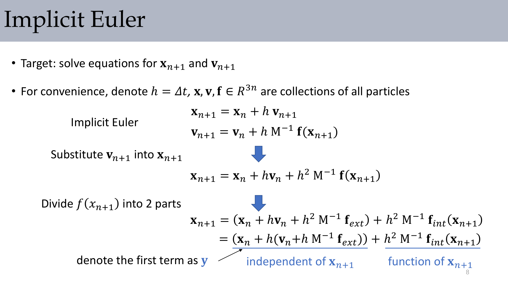

### 4.2 Isolate External and Internal Force Terms

Substitute velocity into position equation:

$$
\mathbf{x}_{n+1}=\mathbf{x}_n+h\mathbf{v}_n+h^2\mathbf{M}^{-1}\mathbf{f}_{ext}+h^2\mathbf{M}^{-1}\mathbf{f}_{int}(\mathbf{x}_{n+1})
$$

Define

$$
\mathbf{y}=\mathbf{x}_n+h\left(\mathbf{v}_n+h\mathbf{M}^{-1}\mathbf{f}_{ext}\right)
$$

Then

$$
\mathbf{x}_{n+1}=\mathbf{y}+h^2\mathbf{M}^{-1}\mathbf{f}_{int}(\mathbf{x}_{n+1})
$$

### 4.3 Convert to Energy Minimization

Use $\mathbf{f}_{int}(\mathbf{x})=-dE(\mathbf{x})/d\mathbf{x}$ and define

$$
g(\mathbf{x})=\frac{1}{2h^2}\lVert\mathbf{x}-\mathbf{y}\rVert_\mathbf{M}^2+E(\mathbf{x}),
\qquad
\lVert\mathbf{x}\rVert_\mathbf{M}^2=\mathbf{x}^T\mathbf{M}\mathbf{x}
$$

Then solving implicit Euler is equivalent to

$$
\mathbf{x}_{n+1}=\arg\min_{\mathbf{x}} g(\mathbf{x})
$$

This is the lecture’s key statement:

- **"Implicit Euler = energy minimization"**
- **"Stable under any timestep size"** (in the numerical sense of unconditional stability for this implicit treatment)

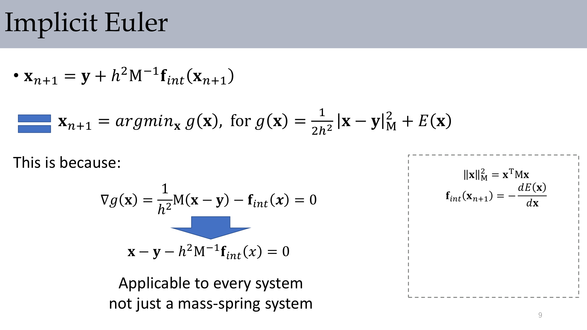

:::remark Key Question (original intent): Why does minimization improve stability?
The term $\frac{1}{2h^2}\lVert\mathbf{x}-\mathbf{y}\rVert_\mathbf{M}^2$ acts like inertial regularization, while $E(\mathbf{x})$ encodes elasticity. Their balance avoids the aggressive explicit extrapolation that often destabilizes stiff systems.
:::

## 5. Numerical Solver: Newton and Practical Bottlenecks

### 5.1 Newton Iteration

We solve

$$
\mathbf{x}_{n+1}=\arg\min_{\mathbf{x}} g(\mathbf{x})
$$

by Newton updates:

$$
\mathbf{x}_{k+1}=\mathbf{x}_k-\mathbf{H}(g)^{-1}\nabla g
$$

### 5.2 Cost Drivers

The lecture emphasizes:

- Build Hessian $\mathbf{H}(g)\in\mathbb{R}^{3n\times 3n}$ at each iteration.
- Solve a large linear system at each iteration.
- Use line search to prevent overshoot.

So the main bottleneck is exactly what the slide highlights:

- **"Solve Matrix equation at every step (main bottleneck)"**.

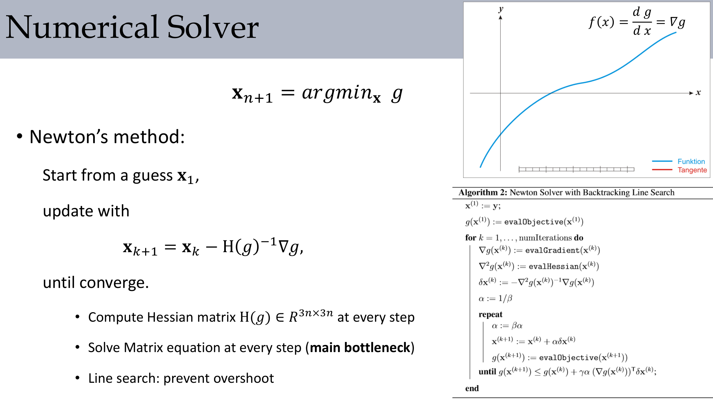

### 5.3 Solver Landscape

There is no universally best solver:

- Nonlinear systems: Newton, quasi-Newton, BFGS.
- Linear/quadratic subproblems: Jacobi/Gauss-Seidel, Conjugate Gradient, Multigrid.

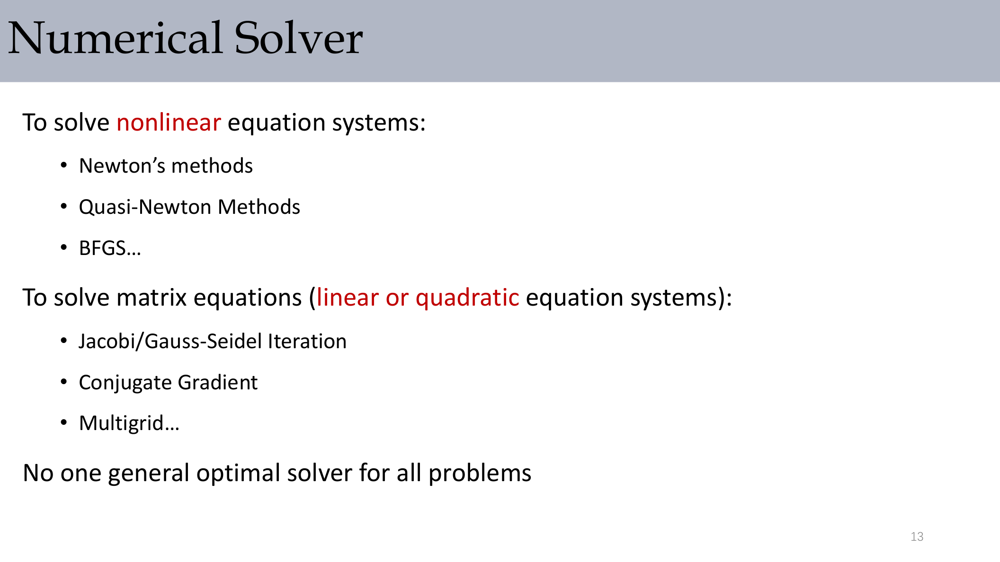

:::remark Key Question (original intent): Why not one universal optimal solver?
Different systems vary in sparsity pattern, conditioning, nonlinearity, and required accuracy. Solver choice is a tradeoff between robustness, memory, parallelism, and convergence speed.
:::

## 6. Results and Applications

### 6.1 Implicit Euler Results in Cloth/Rod Cases

Implicit integration supports stable behavior in cloth/rod examples under larger timesteps than explicit baselines.

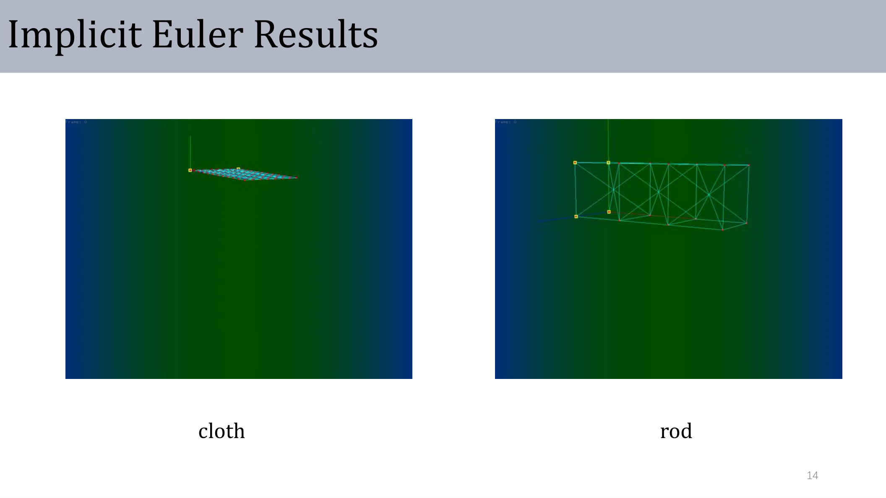

### 6.2 Spring-Mass Beyond Cloth

Spring-mass ideas also appear in soft-body vehicle simulation and deformation-centric applications.

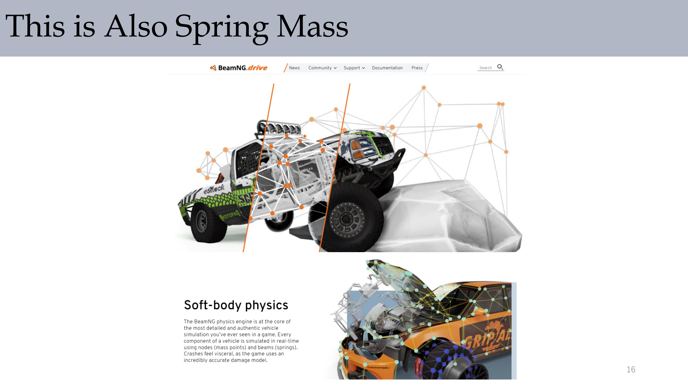

## 7. Appendix Math: Derivatives and Assembly

### 7.1 Gradient and Hessian Basics

For scalar $f(\mathbf{x})$:

$$
\nabla f(\mathbf{x})=
\begin{bmatrix}
\partial f/\partial x\\
\partial f/\partial y\\
\partial f/\partial z
\end{bmatrix},
\qquad
\mathbf{H}=\mathbf{J}(\nabla f(\mathbf{x}))
$$

### 7.2 Spring Force and Tangent Stiffness

For a two-point spring with $\mathbf{x}_{01}=\mathbf{x}_0-\mathbf{x}_1$:

$$
E(\mathbf{x})=\frac{k}{2}(\lVert\mathbf{x}_{01}\rVert-L)^2,
\qquad
\mathbf{f}(\mathbf{x})=-\nabla E(\mathbf{x})=
\begin{bmatrix}
\mathbf{f}_e\\-\mathbf{f}_e
\end{bmatrix}
$$

$$
\mathbf{f}_e=-k(\lVert\mathbf{x}_{01}\rVert-L)\frac{\mathbf{x}_{01}}{\lVert\mathbf{x}_{01}\rVert}
$$

$$
\mathbf{H}(\mathbf{x})=
\begin{bmatrix}
\mathbf{H}_e & -\mathbf{H}_e\\
-\mathbf{H}_e & \mathbf{H}_e
\end{bmatrix}
$$

$$
\mathbf{H}_e=k\frac{\mathbf{x}_{01}\mathbf{x}_{01}^T}{\lVert\mathbf{x}_{01}\rVert^2}+k\left(1-\frac{L}{\lVert\mathbf{x}_{01}\rVert}\right)\left(\mathbf{I}-\frac{\mathbf{x}_{01}\mathbf{x}_{01}^T}{\lVert\mathbf{x}_{01}\rVert^2}\right)
$$

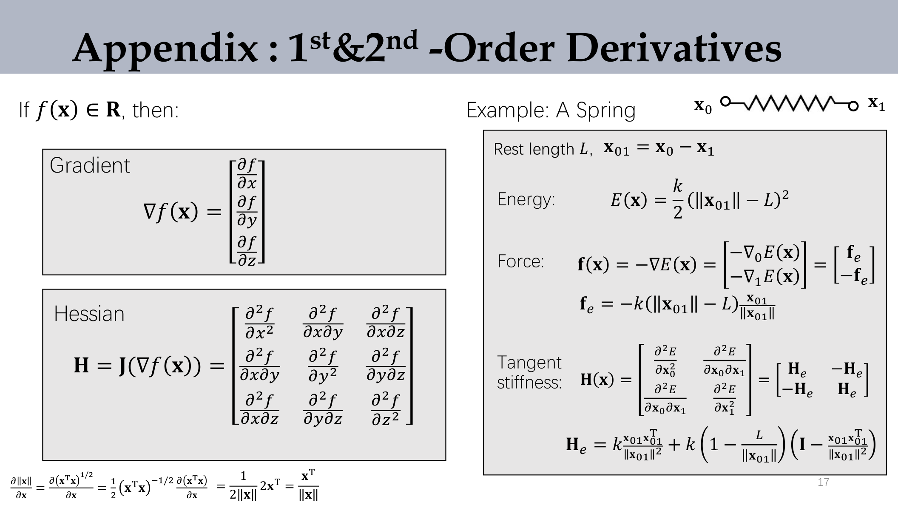

### 7.3 Global Assembly for Simulation Steps

In practice:

$$
\nabla g(\mathbf{x}^{(k)})=\frac{1}{h^2}\mathbf{M}(\mathbf{x}^{(k)}-\mathbf{y})-\mathbf{f}(\mathbf{x}^{(k)}),
\qquad
\frac{\partial^2g(\mathbf{x}^{(k)})}{\partial\mathbf{x}^2}=\frac{1}{h^2}\mathbf{M}+\mathbf{H}(\mathbf{x}^{(k)})
$$

$$
\mathbf{H}(\mathbf{x})=\sum_{e=\{i,j\}}
\begin{bmatrix}
\mathbf{H}_e & -\mathbf{H}_e\\
-\mathbf{H}_e & \mathbf{H}_e
\end{bmatrix}
$$

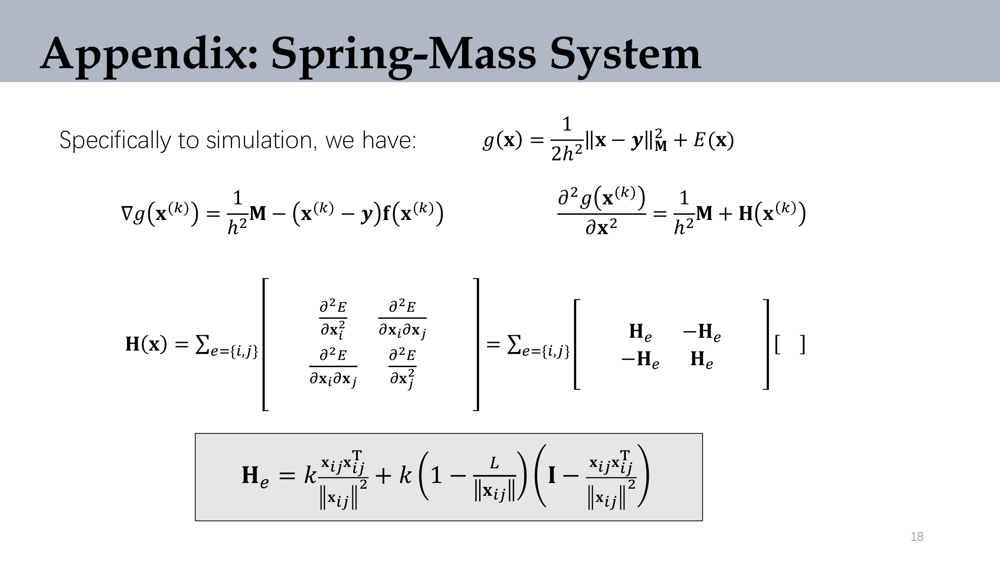

:::remark Key Question (original intent): Why does the global Hessian use $\begin{bmatrix}\mathbf{H}_e&-\mathbf{H}_e\\-\mathbf{H}_e&\mathbf{H}_e\end{bmatrix}$ blocks?
A spring couples exactly two endpoints. Its second derivatives contribute positive self-terms and negative cross-terms. Assembling all springs gives a sparse symmetric block matrix.
:::

## 8. Exam Review

### A. Definitions You Should State Precisely

- **Particle state**: $(\mathbf{x},\mathbf{v},\mathbf{f},m)$ per particle.
- **Spring energy**: $E_{ij}=\frac{1}{2}k(\lVert\mathbf{x}_{ij}\rVert-l_0)^2$.
- **Implicit Euler**: evaluate force at the unknown next state.
- **Energy minimization form**: $\mathbf{x}_{n+1}=\arg\min g(\mathbf{x})$.
- **Newton step**: $\mathbf{x}_{k+1}=\mathbf{x}_k-\mathbf{H}^{-1}\nabla g$.

### B. Mechanism Chain (Short-Answer Template)

1. Build spring energy and forces from particle positions.
2. Explicit Euler is straightforward but unstable for stiff systems unless very small $\Delta t$.
3. Rewrite implicit Euler into a nonlinear equation in $\mathbf{x}_{n+1}$.
4. Convert that equation into minimizing $g(\mathbf{x})$.
5. Solve with Newton + line search + linear solver.

### C. Typical Pitfalls

- Mixing sign conventions for $\mathbf{f}_{int}$ and $\nabla E$.
- Assuming implicit Euler is “free”: it trades timestep robustness for heavier solves.
- Ignoring line search and getting Newton overshoot/divergence.
- Treating Hessian assembly as dense (it should be sparse block-structured).

### D. Self-Check Questions

- Can you derive $\mathbf{x}_{n+1}=\mathbf{y}+h^2\mathbf{M}^{-1}\mathbf{f}_{int}(\mathbf{x}_{n+1})$ from implicit Euler?
- Can you explain why implicit Euler can be written as minimizing $\frac{1}{2h^2}\lVert\mathbf{x}-\mathbf{y}\rVert_\mathbf{M}^2+E(\mathbf{x})$?
- Can you write one Newton step and identify its two computational bottlenecks?
- Can you explain the physical meaning of the inertia term and elasticity term in $g(\mathbf{x})$?
- Can you reconstruct $\mathbf{H}_e$ for one spring and describe how global assembly works?

:::remark Self-check Reference Answers
1. Substitute $\mathbf{v}_{n+1}=\mathbf{v}_n+h\mathbf{M}^{-1}\mathbf{f}(\mathbf{x}_{n+1})$ into $\mathbf{x}_{n+1}=\mathbf{x}_n+h\mathbf{v}_{n+1}$, then split $\mathbf{f}=\mathbf{f}_{ext}+\mathbf{f}_{int}(\mathbf{x}_{n+1})$ and define $\mathbf{y}=\mathbf{x}_n+h(\mathbf{v}_n+h\mathbf{M}^{-1}\mathbf{f}_{ext})$.

2. Rearranging gives $\mathbf{x}-\mathbf{y}-h^2\mathbf{M}^{-1}\mathbf{f}_{int}(\mathbf{x})=0$. With $\mathbf{f}_{int}(\mathbf{x})=-dE/d\mathbf{x}$, this is the first-order optimality condition of $g(\mathbf{x})=\frac{1}{2h^2}\lVert\mathbf{x}-\mathbf{y}\rVert_\mathbf{M}^2+E(\mathbf{x})$.

3. Newton step is $\mathbf{x}_{k+1}=\mathbf{x}_k-\mathbf{H}(g)^{-1}\nabla g$. Bottlenecks: assembling $\mathbf{H}(g)$ and solving the linear system.

4. $\frac{1}{2h^2}\lVert\mathbf{x}-\mathbf{y}\rVert_\mathbf{M}^2$ keeps the new state close to inertial prediction; $E(\mathbf{x})$ penalizes elastic deformation.

5. One spring contributes block matrix $\begin{bmatrix}\mathbf{H}_e&-\mathbf{H}_e\\-\mathbf{H}_e&\mathbf{H}_e\end{bmatrix}$. Summing over all springs forms a sparse global Hessian.
:::
