# 第 1 讲：操作系统与四个基础概念

## 学习目标

学完本讲后，你应该能够：

1. 解释 OS 作为裁判者、魔术师和胶水层分别在做什么。
2. 说明为什么 OS 设计会随硬件时代持续演化。
3. 讲清四个核心抽象：线程、地址空间、进程、双态保护。
4. 分析单核 CPU 如何制造“多个虚拟 CPU”的错觉。
5. 解释 base-and-bound 翻译机制以及它如何实现隔离。
6. 区分 syscall、interrupt、exception 三类控制转移路径。
7. 用一套可直接应试的框架回答 OS 导论常见问题。

## 1. 什么是操作系统？

1. **什么是操作系统（Operating System）？**  
操作系统是管理计算机硬件资源并为应用提供统一运行接口的核心软件。  
它主要负责：进程/线程调度、内存管理、文件系统、设备与 I/O、权限与隔离、系统调用接口等。

2. **操作系统 vs 计算机系统 vs 系统软件**  
- **计算机系统（Computer System）**：整体概念，包含硬件（CPU/内存/磁盘/网络）+ 固件 + 操作系统 + 应用。  
- **系统软件（System Software）**：支撑应用运行的一大类软件，包含操作系统、编译器、运行时库、驱动、虚拟机、中间件等。  
- **操作系统（OS）**：系统软件中的核心子集，直接管理硬件并提供基础抽象（进程、文件、虚拟内存等）。

3. **操作系统 vs 分布式系统 vs 网络系统 vs 存储系统 vs 数据库系统**  
- **操作系统**：单机（或节点级）资源管理与抽象层。  
- **分布式系统**：多台机器协同，对外呈现“一个系统”的能力（容错、一致性、复制、分片）。通常建立在多个 OS 之上。  
- **网络系统（Networked Systems）**：强调主机间通信与网络协议（TCP/IP、路由、RPC 等），不一定追求分布式透明性。  
- **存储系统（Storage Systems）**：关注数据持久化、可靠性、容量与性能（RAID、分布式文件系统、对象存储等）。  
- **数据库系统（DBMS）**：面向结构化/半结构化数据的管理与查询，提供事务、索引、并发控制、恢复等。  

从整体上看，OS 是应用与硬件之间的一层关键软件: 它同时扮演三种角色：

- **裁判者（Referee）**：管理保护、隔离、共享和资源分配。
- **魔术师（Illusionist）**：把复杂硬件包装成易用抽象（文件、虚拟内存、虚拟 CPU）。
- **胶水层（Glue）**：提供通用服务（存储、网络、授权、界面约定）。

:::remark 关键问题：为什么 OS 不是“驱动程序的拼盘”？
**问题（原意复述）：为什么不能让应用直接访问硬件，而必须有 OS 这一层？**

解答：
- 现代机器上同时运行多个程序与用户，直接访问会立刻破坏隔离。
- 程序需要稳定抽象，而硬件细节在持续变化。
- 安全性、可靠性和公平共享都需要集中仲裁。
:::

## 2. 为什么 OS 设计持续变化

本讲按“硬件与人力成本”来划分 OS 历史阶段：

- 硬件贵、人力便宜：早期批处理与大型共享机。
- 硬件变便宜、人力变贵：PC/工作站与 GUI 时代。
- 硬件很便宜、人力很贵：泛在设备与普遍联网。

常用演进链条是：

- Batch -> Multiprogramming -> Timesharing -> Graphical UI -> Ubiquitous devices.

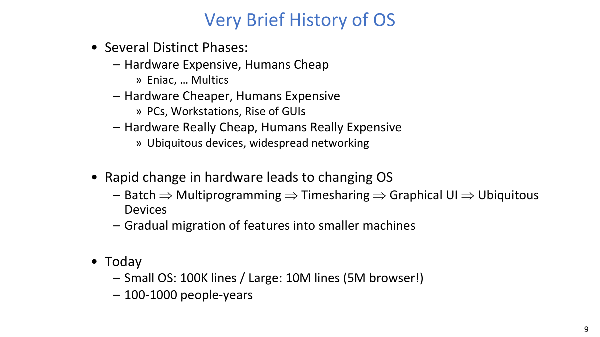

现代 OS 大多不是从零开始，而是沿谱系演进。

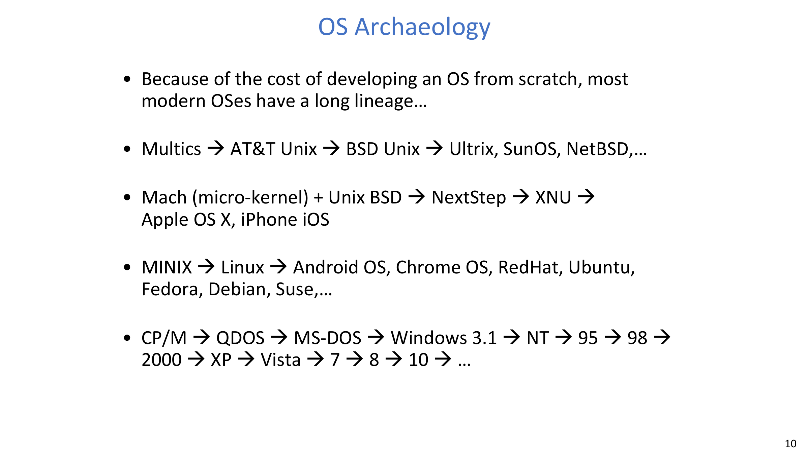

:::tip 关键问题：为什么 OS 谱系在工程上很重要？
**问题（原意复述）：既然能写新代码，为什么还要继承旧内核谱系？**

解答：
- OS 规模巨大，兼容性约束跨越几十年。
- 现有内核已经沉淀了硬件支持、API 稳定性和运维经验。
- 创新通常以渐进演化发生，而非整体重写替换。
:::

## 3. 底线任务：运行程序，但要安全地运行

OS 的底线任务很直接：运行程序。

但“运行”是一个完整流程：

1. 把可执行文件的代码段/数据段加载到内存。
2. 创建栈和堆。
3. 把控制权交给用户程序。
4. 在执行过程中持续提供系统服务。
5. 同时保护 OS 与其他程序不被破坏。

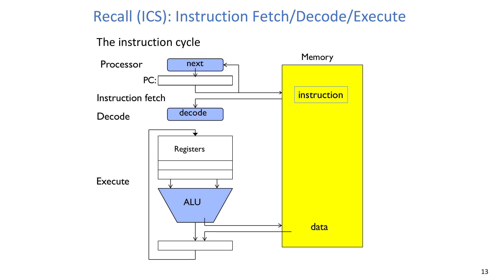

:::warn 关键问题：为什么 OS 不能“启动后就退场”？
**问题（原意复述）：程序加载完了，OS 为什么还必须持续参与？**

解答：
- 程序执行文件/网络/进程/内存操作都依赖 syscall。
- 中断与异常处理必须经过特权路径。
- 没有持续仲裁，隔离与公平会迅速失效。
:::

## 4. 概念 1：控制线程（Thread of Control）

课件中的关键定义是：

- **Thread: Single unique execution context**。

线程状态的锚点包括：

- 程序计数器（PC），
- 寄存器与执行标志位，
- 栈指针与栈内容。

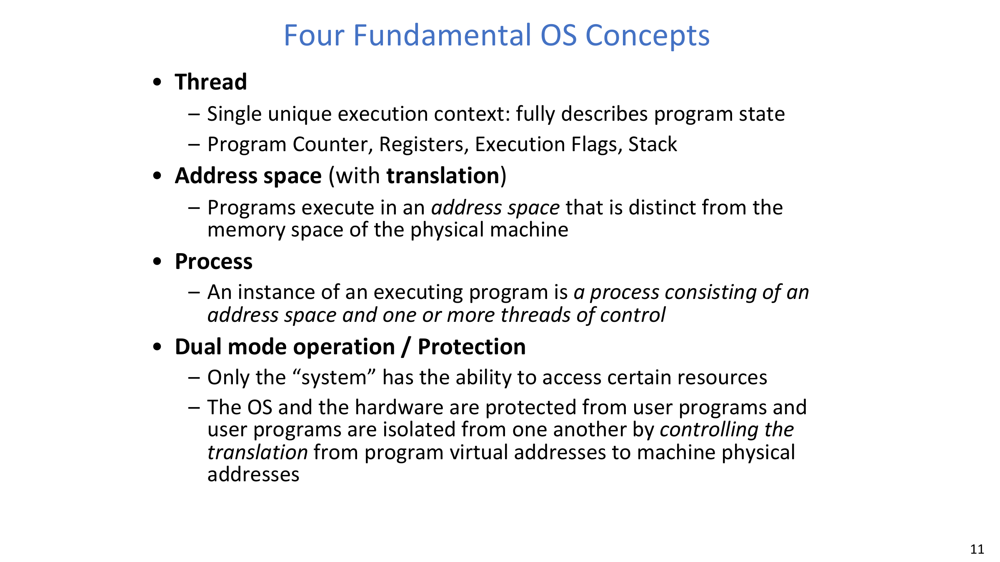

在运行时语义上：

- 当线程上下文驻留在处理器寄存器中时，它就在执行。
- 其余状态保存在内存里，后续可被恢复。

## 5. 概念 2：地址空间（Address Space）

课件中的关键定义是：

- **Programs execute in an address space that is distinct from the memory space of the physical machine**。

容量直觉可写为：

$$
|\mathcal{AS}_{32}| = 2^{32},\qquad |\mathcal{AS}_{64}| = 2^{64}
$$

$$
\text{Addr}_{\max}^{(32)} = 2^{32} - 1
$$

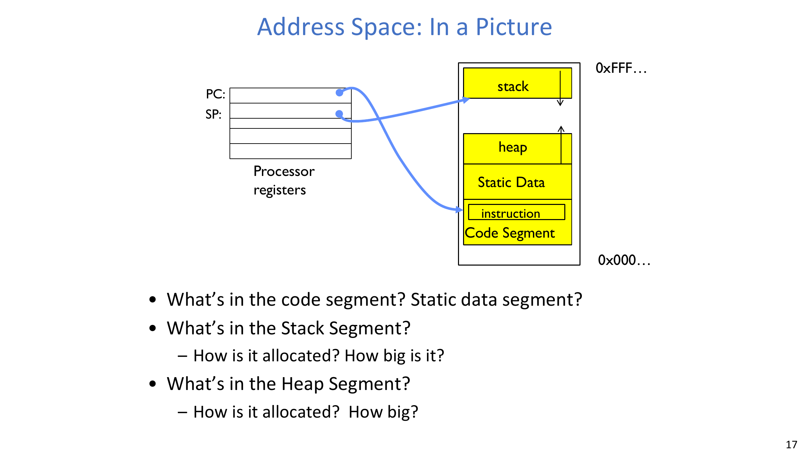

本讲重点讨论的典型区段：

- 代码段（code segment），
- 静态数据段（static data segment），
- 堆（heap），
- 栈（stack）。

:::remark 关键问题：一个地址在实践中到底“意味着什么”？
**问题（原意复述）：读写某个地址时，系统实际会发生什么？**

解答：
- 可能表现为普通内存访问。
- 可能映射为设备行为（memory-mapped I/O）。
- 也可能因翻译/保护检查失败而触发 fault。
:::

## 6. 概念 3：进程（Process）

课件中的关键定义是：

- **A process is an instance of an executing program consisting of an address space and one or more threads of control**。

进程级拥有的资源包括：

- 内存/地址空间，
- 文件描述符与文件系统上下文，
- 通信端点及相关资源。

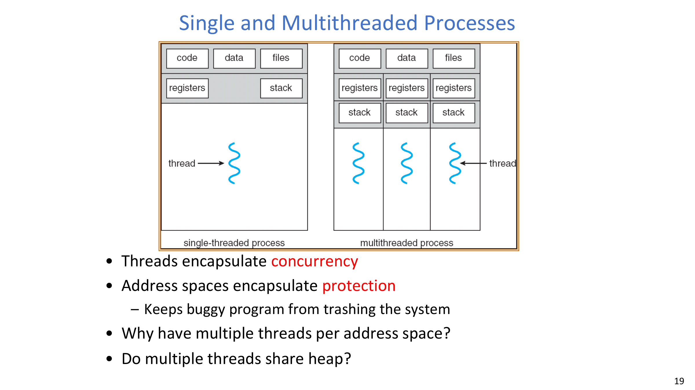

课件强调的基础权衡：

- 保护更强通常意味着更高开销，
- 共享更轻通常意味着隔离更弱。

:::tip 关键问题：为什么要在一个进程里放多个线程？
**问题（原意复述）：多个线程会共享堆吗？这样做的价值是什么？**

解答：
- 会，共享同一进程内的 code/data/heap 与多类资源。
- 进程内通信更快、更自然。
- 但必须用同步机制约束竞态风险。
:::

## 7. 多道程序与“多个 CPU 错觉”

在单个物理 CPU 上，OS 通过时间复用制造多个虚拟 CPU。

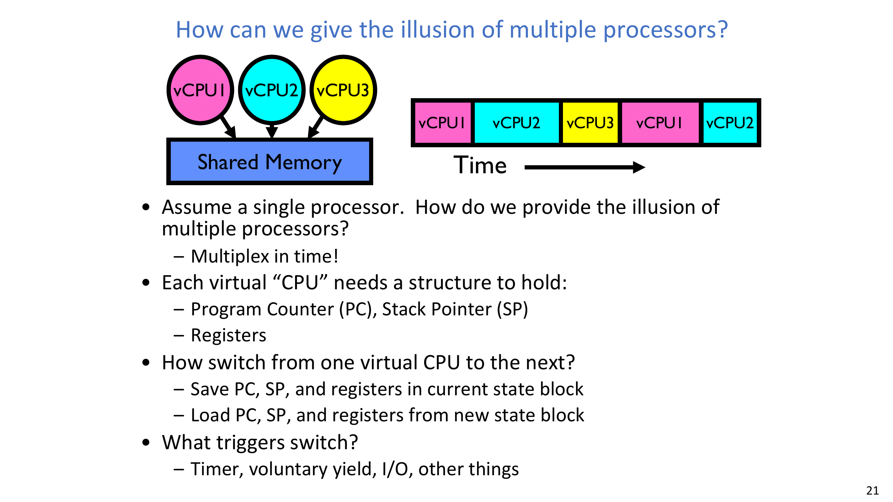

每个 vCPU 至少需要保存：

- PC，
- SP，
- 寄存器集合。

一次上下文切换的核心步骤：

1. 保存当前线程/进程上下文，
2. 装入下一个上下文，
3. 从恢复后的 PC 继续执行。

常见触发源：

- 定时器中断，
- 主动 yield，
- I/O 完成，
- 同步 fault/exception。

:::warn 关键问题：为什么并发会显得“非确定”？
**问题（原意复述）：同一程序、同一输入，为什么调度顺序和结果会变？**

解答：
- 交错顺序取决于异步事件与调度决策。
- 切换点可能出现在许多指令边界。
- 正确程序必须对所有合法交错都成立，而不是依赖一次“好运顺序”。
:::

## 8. 保护（Protection）是核心契约

本讲中的保护目标有两个且必须同时满足：

- 进程与进程隔离，
- OS 与用户进程隔离。

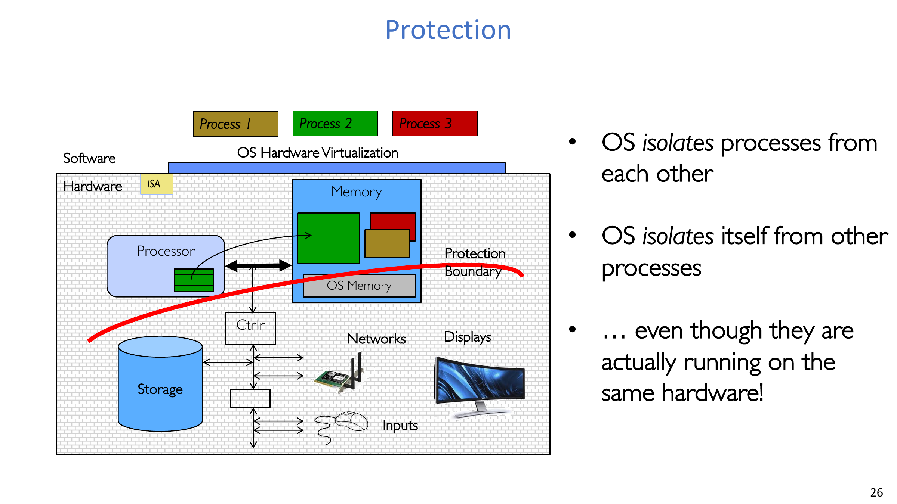

重点安全属性：

- 可靠性：避免单个程序 bug 导致系统整体崩溃，
- 安全/隐私：限制进程可访问范围，
- 公平性：限制 CPU/内存/I/O 资源占用。

对应机制包括：

- 地址翻译边界限制，
- 特权指令与特权寄存器约束，
- syscall 路径与子系统权限检查。

## 9. 概念 4：双态运行（Dual Mode Operation）

硬件至少提供两种模式：

- 用户态（受限特权），
- 内核态（完整特权）。

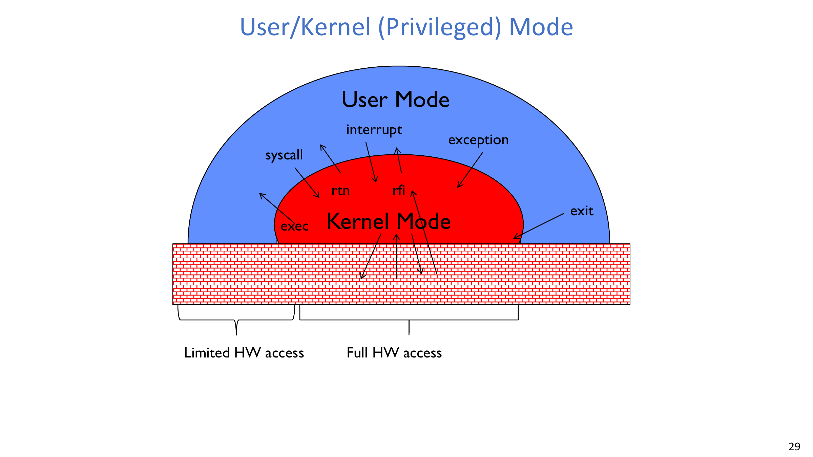

关键硬件支持：

- 一个 mode bit（user/system），
- 从用户态 trap 进入内核态并保存用户 PC/上下文，
- 通过 return-from-interrupt 恢复用户上下文并清除内核特权。

:::remark 关键问题：为什么双态是“必需项”？
**问题（原意复述）：为什么不能让用户程序直接执行特权指令？**

解答：
- 否则任意进程都可改写保护寄存器、设备状态甚至内核内存。
- 隔离、安全与公平将无法被强制执行。
- 双态是让 OS 保护真正落地的最小硬件契约。
:::

## 10. Base-and-Bound 翻译：第一代实用保护机制

Base-and-Bound（B&B）把地址翻译与边界检查组合在一起。

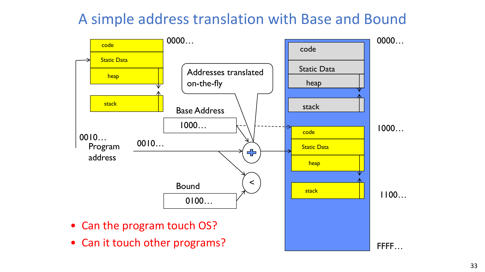

校对后的公式形式：

$$
\text{PA} = \text{Base} + \text{VA}
$$

$$
0 \le \text{VA} < \text{Bound}
$$

等价物理区间写法：

$$
\text{Base} \le \text{PA} < \text{Base} + \text{Bound}
$$

课件中的一个二进制示例：

$$
\text{Base}=1000_2,\ \text{Bound}=0100_2,\ \text{VA}=0010_2\Rightarrow \text{PA}=1010_2
$$

课件还对比了两种翻译时机：

- 装载期重定位：程序装载时翻译（需要 relocating loader；地址路径上无运行时加法）。
- 运行期翻译：每次访存按硬件在线翻译（更适合多道程序）。

:::error 关键问题：在 B&B 下程序还能访问 OS 或其他进程吗？
**问题（原意复述）："Can the program touch OS? Can it touch other programs?"**

解答：
- 只要 base/bound 设置正确且硬件强制检查，就不能越界访问。
- 越界访问会触发 trap/exception，而不是静默篡改。
:::

## 11. 非程序化控制转移与中断向量

本讲把进入内核的控制转移分为三类：

- syscall（进程主动发起的软件请求），
- interrupt（外部异步事件），
- exception/trap（进程内部同步异常）。

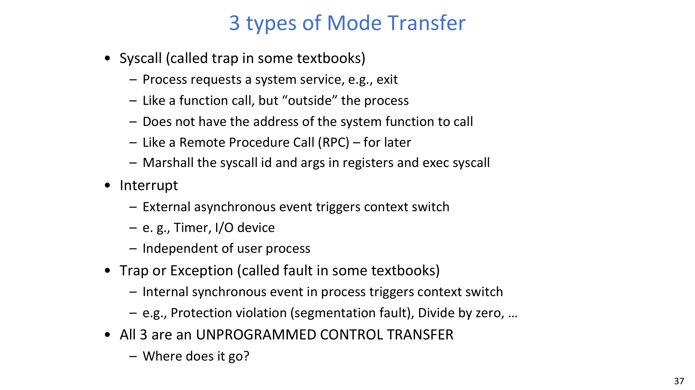

从用户代码视角，这三类都属于“非程序化控制转移”：进程不能直接自由跳转到任意内核地址。

目标处理函数的定位依赖中断/异常向量：

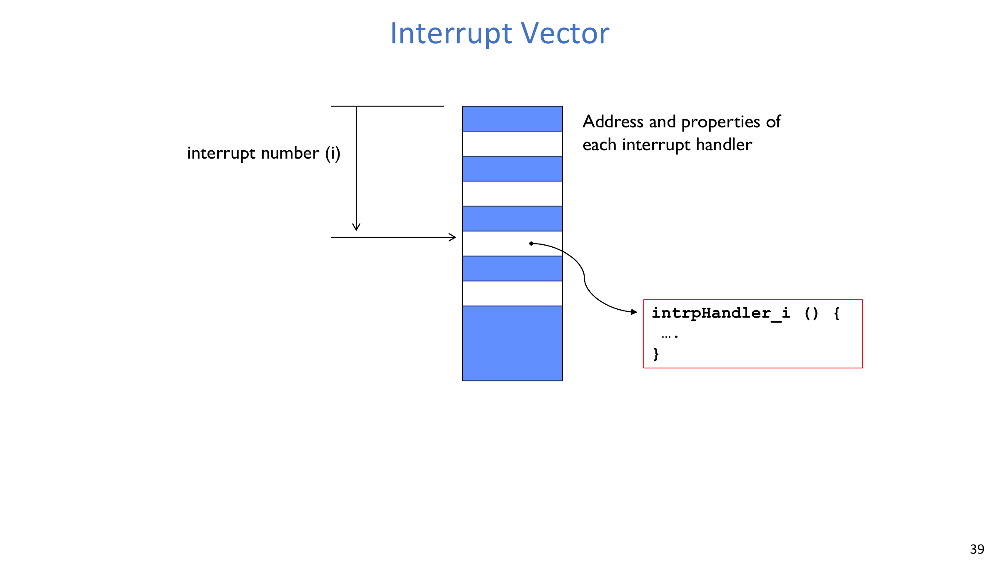

硬件根据事件号/中断号 `i` 索引向量表第 `i` 项，读取处理函数地址与属性，再安全转移控制权。

:::remark 关键问题：如何安全得到内核目标地址？
**问题（原意复述）：How do we get the system target address of an unprogrammed control transfer?**

解答：
- 硬件把中断/异常号作为索引。
- 向量表中预置了内核处理入口与元信息。
- 用户代码无法借这条路径伪造任意内核跳转目标。
:::

## 12. Lab 0 快照

本讲末尾给出的 Lab 0 提示包括：

- Booting Pintos，
- Debugging 流程，
- Kernel Monitor 基础。

时间说明（按原课件）：

- 课件中展示的 deadline 是 **2026 年 3 月 12 日（星期四）**。

## Exam Review

### A. 高价值定义

- **Thread**：单执行上下文（PC/寄存器/标志位/栈）。
- **Address Space**：带翻译与保护语义的进程可见虚拟内存域。
- **Process**：拥有资源的执行环境，内部含一个或多个线程。
- **Dual Mode**：用户态与内核态的硬件特权分离。

### B. 机制链（必须会串）

1. 装载可执行段，创建栈/堆。
2. 进入用户执行上下文。
3. 用户代码在“可翻译、可保护”的地址空间中运行。
4. 事件（syscall/interrupt/exception）把控制权交给内核。
5. 内核处理后返回用户上下文。

### C. 简答模板

- “为什么进程和线程都需要？”
: 进程给保护边界；线程给并发执行单位。
- “单核如何做多 CPU 幻象？”
: 上下文保存/恢复 + 时间复用 + 调度策略。
- “为什么双态不可省略？”
: 没有特权分离就没有可执行的隔离。

### D. 常见误区

- 混淆进程边界与线程边界的资源归属。
- 误以为“共享内存”天然安全。
- 把 interrupt 与 syscall 误当成同源事件。
- 忽略“地址翻译”和“访问保护”在硬件上的耦合关系。

### E. 自检清单

- 你能写出 B&B 的合法地址条件吗？
- 你能解释上下文切换的触发时机吗？
- 你能清晰区分 syscall / interrupt / exception 吗？
- 你能说明为什么需要中断向量索引吗？
- 你能把四大概念串成一条完整运行时主线吗？
