# Lecture 10: Scheduling 2 - Case Studies, Fairness, Real Time, and Forward Progress

## Learning Objectives

By the end of this lecture, you should be able to:

1. Explain why one scheduler policy rarely fits all workload mixes and platforms.
2. Distinguish throughput, completion time, fairness, and deadline guarantees as different objectives.
3. Explain why Round Robin can fail for hard real-time workloads and how EDF addresses it.
4. Analyze starvation, priority inversion, and priority donation with concrete execution scenarios.
5. Compare Linux O(1), Lottery Scheduling, and Linux CFS from policy and implementation viewpoints.
6. Choose a scheduler based on system goals and evaluate trade-offs with suitable methods.

## 1. Quick Recap: What We Already Know

The previous lecture gave us the core policy toolbox:

- FCFS: simple and high throughput in some settings, but can hurt short jobs.
- RR: bounded waiting and better interaction, but may increase overhead.
- Strict priority: favors important work, but can starve low-priority tasks.
- SJF/SRTF: best average completion time if future service demand were known.
- Lottery/MLFQ: practical attempts to balance fairness and responsiveness.

A useful RR bound reused in this lecture is:

$$
W_{\max} \le (N-1)Q
$$

:::remark Key Question: can one policy fit every machine class?
**Question (slide wording): Should you schedule the set of apps identically on servers, workstations, pads, and cellphones?**

Answer:
- Usually no.
- Different machines optimize different outcomes (latency, throughput, energy, predictability).
- Scheduler design must reflect deployment context, not just algorithm elegance.
:::

## 2. Mixed Workloads and Classification Pitfalls

Real systems often run interactive, batch, and service workloads together.

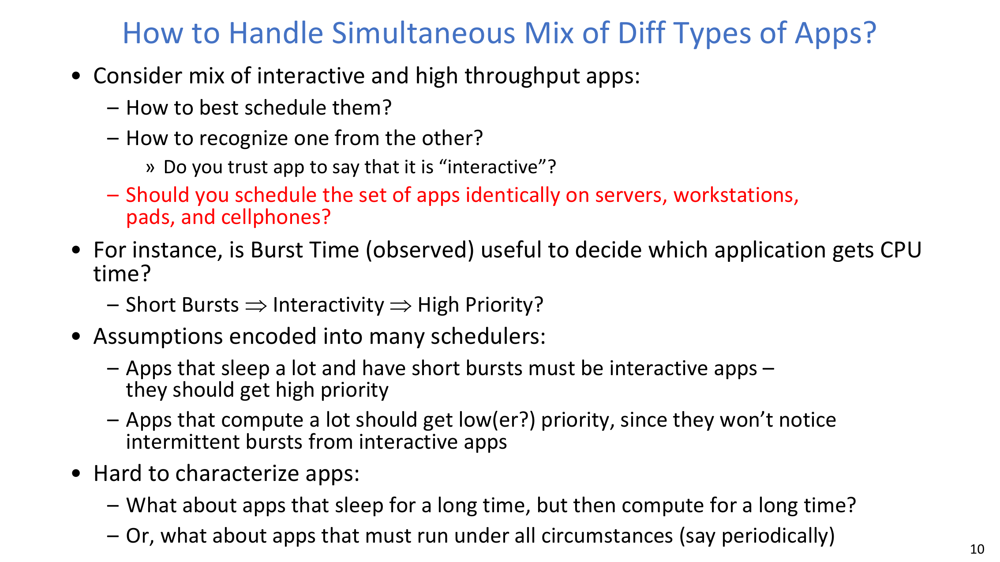

Common heuristic in many schedulers:

- Short bursts and frequent sleep are treated as interactive behavior.
- Long CPU bursts are treated as compute-heavy behavior.

Why this is hard:

- Applications can change phases over time.
- Self-reported app class can be unreliable.
- The same app may deserve different treatment on phone vs server.

:::warn Key Question: is observed burst time enough to identify app type?
**Question (slide intent): Is burst-time observation alone sufficient to decide who should get CPU next?**

Answer:
- Not reliably.
- Burst behavior is informative but incomplete; phase changes and mixed behavior can break simple rules.
- Robust schedulers combine heuristics with guardrails against starvation and gaming.
:::

## 3. Multi-Core Scheduling and Synchronization Side Effects

On multicore systems, scheduling is not only policy; it is also data-structure and synchronization engineering.

- Per-core run queues improve scalability.
- Affinity helps cache reuse by re-scheduling a thread on the same CPU.
- Gang scheduling can reduce useless spin-waiting in tightly coupled parallel applications.
- In modern systems, the scheduler primarily schedules threads; process switches add address-space costs.

Spinlock behavior matters in this context:

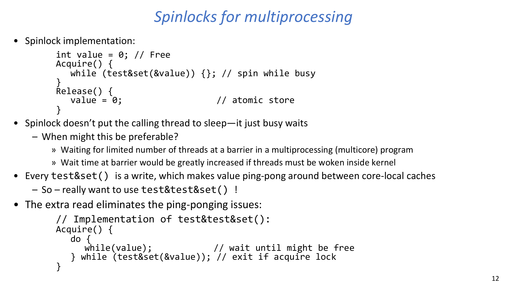

- `test&set` spinning is busy waiting (no sleep).
- For short critical sections, spinning can beat sleep/wakeup overhead.
- Repeated writes in naive spinning cause cache-line ping-pong.
- `test-and-test-and-set` reduces coherence traffic by adding a read phase.

:::remark Key Question: when is spinning preferable to blocking?
**Question (slide intent): When might busy waiting be better than sleeping?**

Answer:
- When lock hold time is very short.
- When threads are expected to resume quickly (e.g., barrier-style coordination).
- Otherwise, blocking is usually better for CPU efficiency.
:::

## 4. Real-Time Scheduling: Why EDF Matters

Hard real-time systems care about predictable worst-case timing, not only average performance.

Setup used in slides:

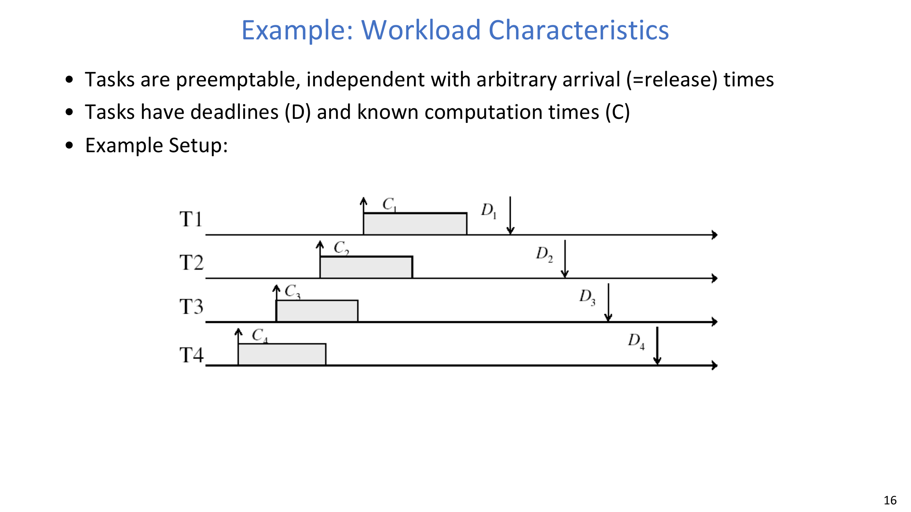

- Periodic task model: task \(i\) is described by \((P_i, C_i)\).
- Deadlines must be met consistently.

Round Robin can miss deadlines in such workloads:

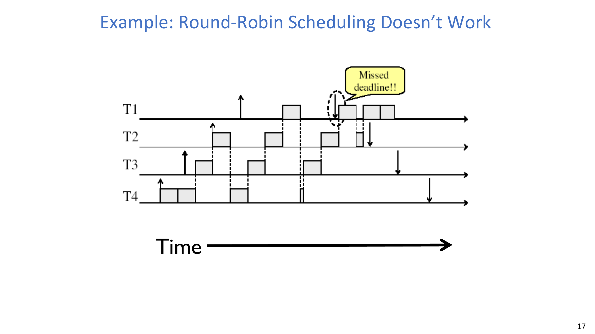

EDF (Earliest Deadline First) assigns dynamic priority by closest absolute deadline:

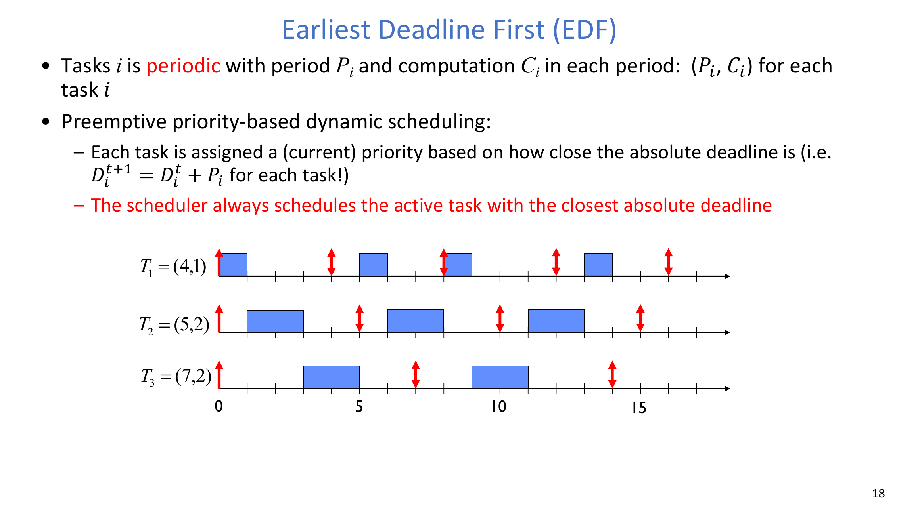

$$
D_i^{t+1} = D_i^t + P_i
$$

Feasibility condition shown in lecture:

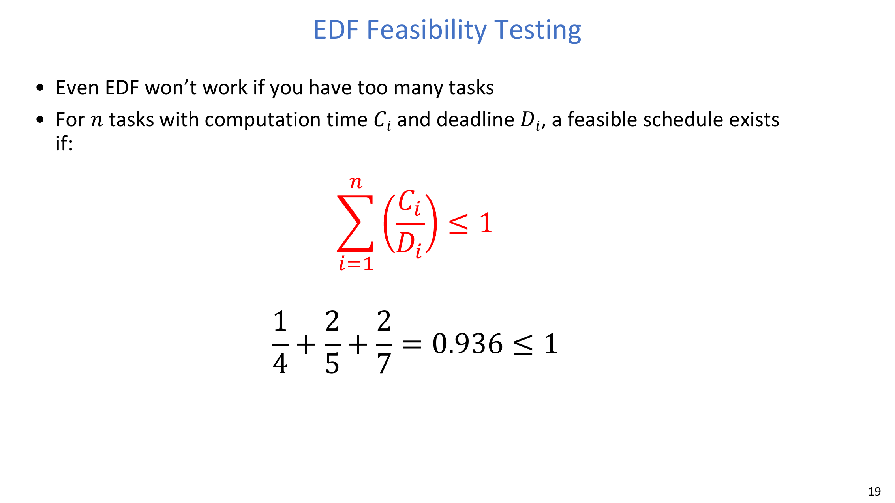

$$
\sum_{i=1}^{n} \left(\frac{C_i}{D_i}\right) \le 1
$$

Slide example:

$$
\frac{1}{4} + \frac{2}{5} + \frac{2}{7} = 0.936 \le 1
$$

:::tip Key Question: why can RR fail while EDF succeeds?
**Question (slide intent): Why doesn’t Round Robin work for strict deadline-driven workloads?**

Answer:
- RR enforces fairness in turn-taking, not urgency of deadlines.
- EDF directly prioritizes earliest deadlines, so it aligns policy with real-time objective.
:::

## 5. Ensuring Forward Progress: Starvation Across Policies

Important distinction:

- Starvation: a task waits indefinitely and fails to make progress.
- Deadlock: cyclic resource waiting.

The lecture examines common scheduler behaviors:

- Non-work-conserving design can trivially starve tasks.
- LCFS can starve early arrivals under sustained load.
- FCFS can block everyone if non-preemptive execution never yields.
- RR bounds wait time, so it is strong on wait-time fairness.
- Strict priority can starve low-priority tasks.

Core takeaway:

- Progress guarantees depend on both preemption and policy safeguards.
- Fairness in waiting time does not automatically mean fairness in throughput.

## 6. Priority Inversion and Priority Donation

Priority inversion occurs when a high-priority task is blocked by a low-priority task holding a lock, while medium-priority tasks keep running.

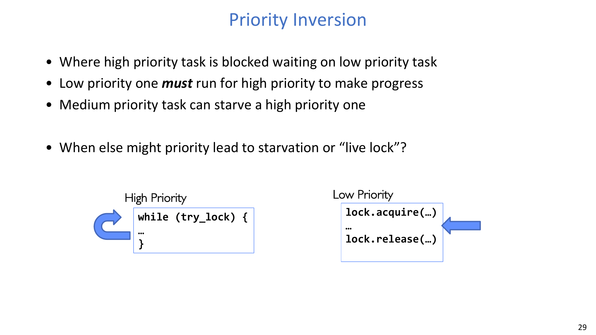

This can violate timeliness even though a high-priority task exists.

Priority donation/inheritance addresses it:

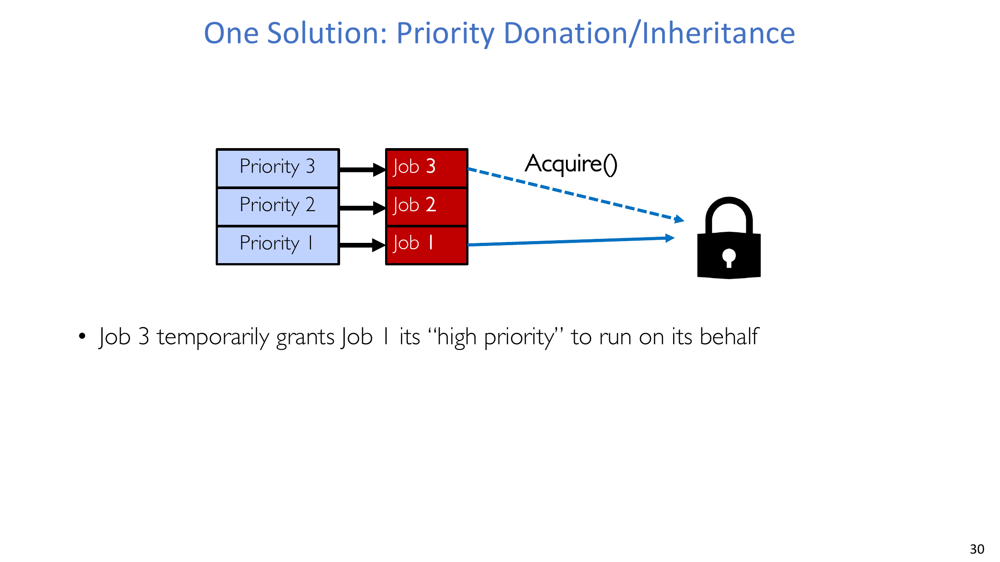

- Temporarily raise lock holder priority to unblock the high-priority waiter.
- After releasing the lock, restore normal priority relationships.

Case study in lecture:

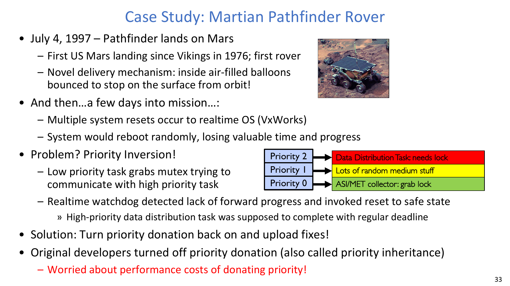

- Mars Pathfinder (1997) experienced resets due to priority inversion.
- Re-enabling priority inheritance resolved the forward-progress failure.

:::warn Key Question: why not disable donation to save overhead?
**Question (case-study intent): Is the runtime overhead of donation worth it?**

Answer:
- For safety-critical or deadline-sensitive systems, yes.
- Without donation, rare lock interactions can trigger catastrophic timing failures.
:::

## 7. Unix Nice and Linux O(1): Priority Engineering in Practice

As workloads diversified, production kernels evolved beyond textbook policies.

Linux O(1) scheduler ideas:

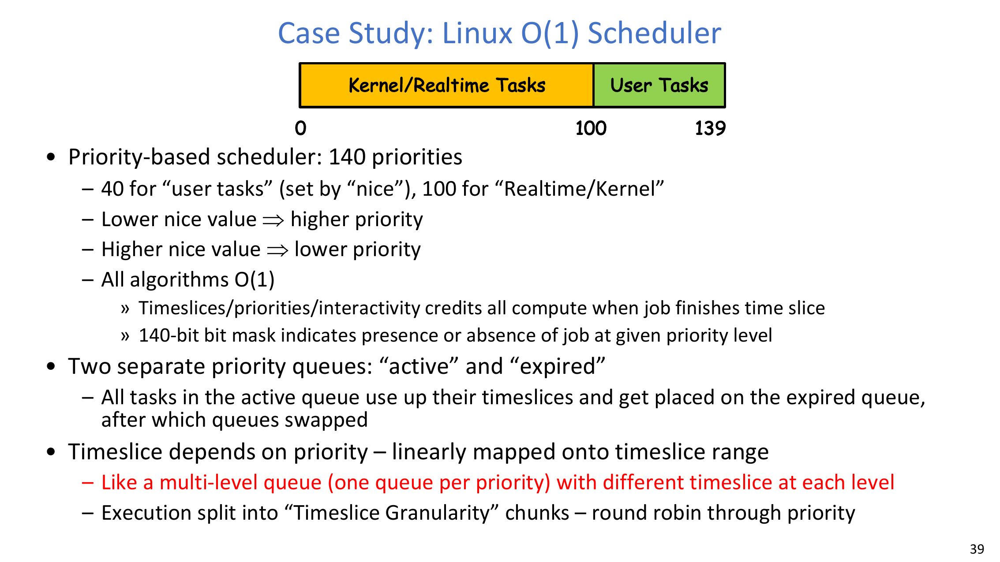
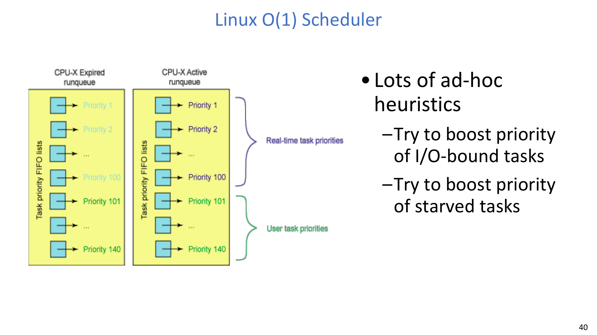

- 140 priorities total.
- User tasks (influenced by `nice`) and realtime/kernel ranges are separated.
- Active/expired run queues and bitmap lookup enable O(1) selection.
- Many heuristics try to reward interactive tasks and relieve starvation.

One representative heuristic from slides:

$$
P\to sleep\_avg = (sleep\_time - run\_time) \times coefficient
$$

Interpretation:

- Higher `sleep_avg` suggests more I/O-bound/interactive behavior.
- The scheduler boosts such tasks more aggressively.

## 8. Proportional Share to CFS

Lottery scheduling gives probabilistic proportional sharing.

$$
N_{ticket} = \sum N_i
$$

- Draw a random dart in \([1, N_{ticket}]\).
- Schedule the first job whose cumulative tickets exceed the dart.

Linux CFS turns fairness into a concrete runtime metric:

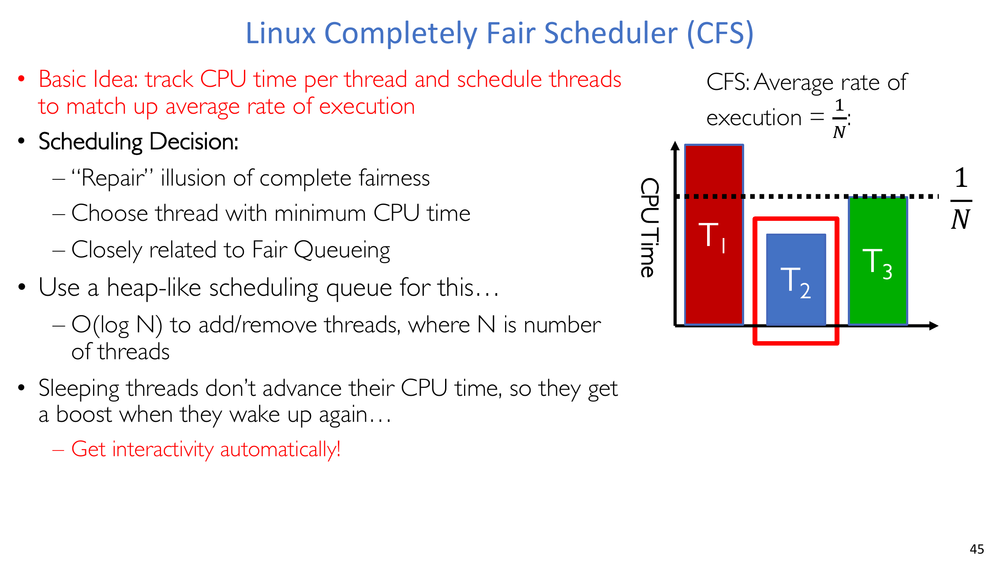

$$
\text{execution rate} = \frac{1}{N}
$$

Responsiveness constraint (target latency):

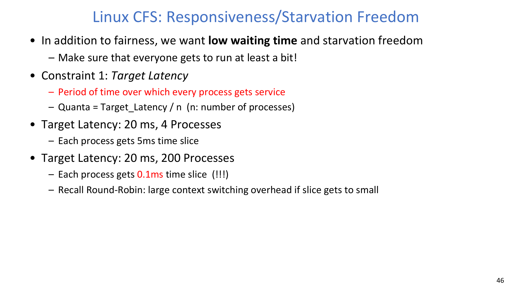

$$
Q = \frac{\text{Target Latency}}{n}
$$

Weighted share in CFS:

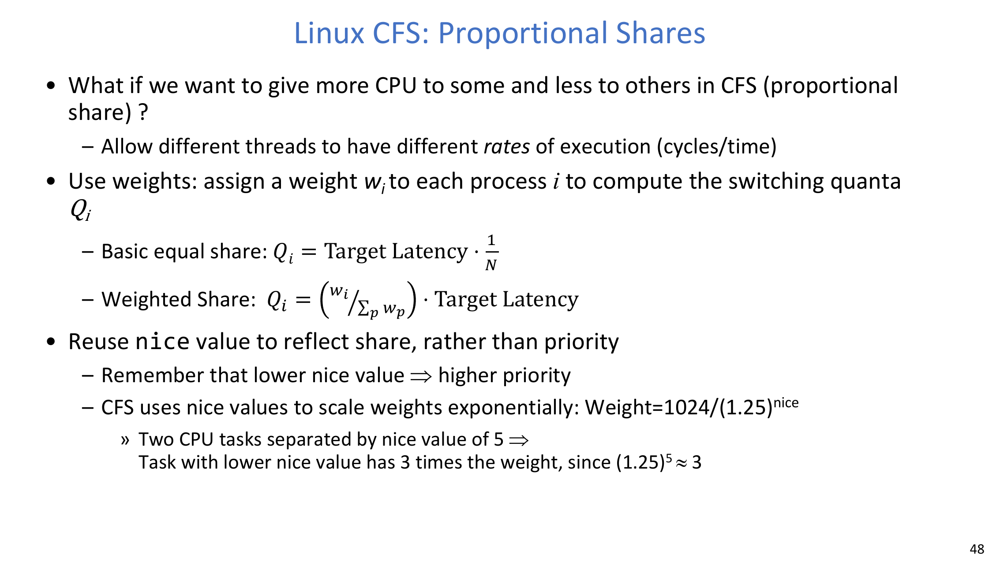

$$
Q_i = \text{Target Latency} \cdot \frac{1}{N}
$$

$$
Q_i = \left(\frac{w_i}{\sum_p w_p}\right) \cdot \text{Target Latency}
$$

Nice-to-weight mapping:

$$
\text{Weight} = \frac{1024}{(1.25)^{\text{nice}}}
$$

$$
(1.25)^5 \approx 3
$$

Implication:

- A nice-value gap of 5 gives about 3x weight difference.
- CFS uses this to balance fairness and controlled preference.

:::remark Key Question: why does CFS need minimum granularity?
**Question (slide intent): If Target Latency enforces fairness, why add a minimum slice length?**

Answer:
- Too small slices cause excessive context-switch overhead.
- Minimum granularity protects throughput while preserving fairness trends.
:::

## 9. Choosing and Evaluating Schedulers

The lecture provides a practical goal-to-policy mapping:

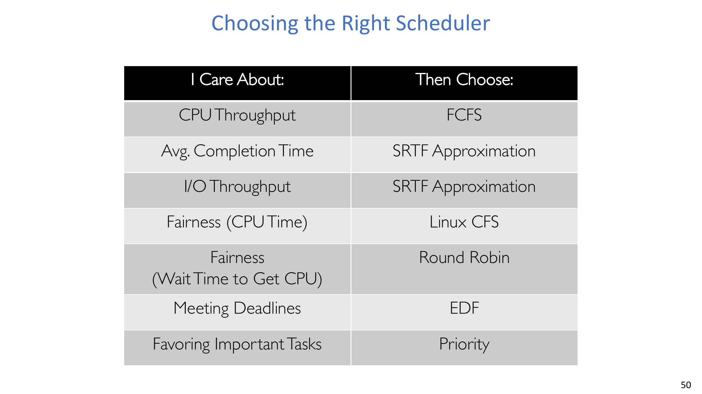

Typical choices:

- CPU throughput -> FCFS.
- Average completion time -> SRTF approximation.
- I/O throughput -> SRTF approximation.
- CPU-time fairness -> Linux CFS.
- Waiting-time fairness -> Round Robin.
- Meeting deadlines -> EDF.
- Favoring critical work -> priority scheduling.

Evaluation methods to combine:

- Deterministic modeling on fixed workloads.
- Queueing-theoretic analysis for stochastic arrivals.
- Implementation/simulation measurement on realistic traces.

## 10. Capacity Planning Insight: Scheduling Is Not Magic

When load approaches saturation, policy details alone cannot save response time.

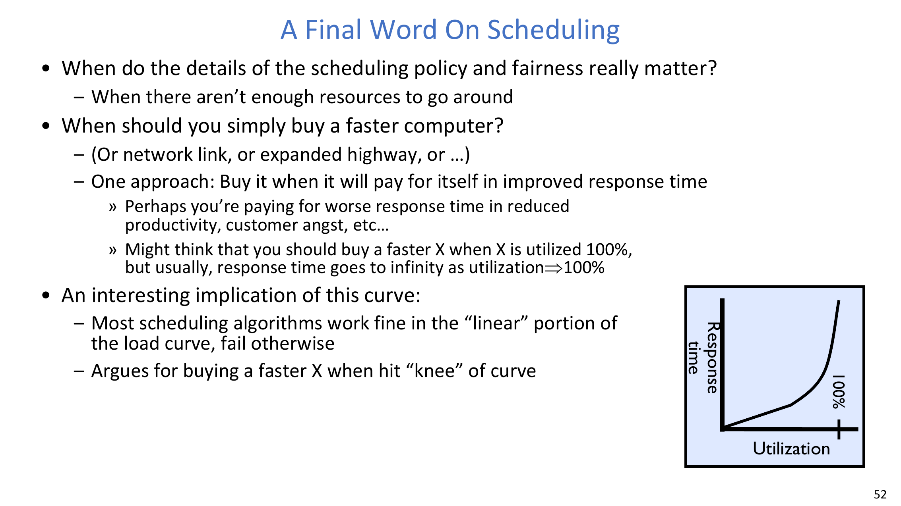

Key message:

- Response time often grows sharply as utilization approaches 100%.
- Buy capacity before the knee, not after collapse.
- Many schedulers look similar in the linear region but diverge badly in overload.

## 11. Exam Review

### 11.1 Must-know definitions

- **Starvation**: indefinite lack of progress despite runnable work.
- **Priority inversion**: high-priority task blocked by lower-priority lock holder.
- **Priority donation/inheritance**: temporary priority raise for lock holder.
- **EDF**: dynamic-priority real-time scheduler by earliest deadline.
- **CFS**: fair-share scheduler approximating an ideal multitasking processor.

### 11.2 High-value short-answer templates

1. **Why can RR be fair yet unsuitable for hard real-time tasks?**  
   RR bounds waiting turns but ignores deadline urgency; EDF maps directly to deadline criticality.
2. **Why did Linux move from O(1)-style heuristics toward CFS-style fairness metrics?**  
   Heuristics can be brittle and ad hoc; CFS provides a cleaner fairness model with tunable constraints.
3. **How does priority donation protect forward progress?**  
   It allows the lock holder to run soon enough to release the lock, unblocking the high-priority waiter.

### 11.3 Common pitfalls

- Assuming fairness in one metric implies fairness in all metrics.
- Ignoring lock interactions when reasoning about scheduler correctness.
- Treating observed short CPU bursts as always equivalent to interactivity.
- Believing scheduler changes alone fix overload without capacity changes.

### 11.4 Self-check

:::tip Self-check 1
Given a workload objective (throughput, average completion, deadline guarantee, or wait fairness), choose a scheduler and justify one trade-off.
:::

:::tip Self-check 2
Explain a concrete priority-inversion scenario and show exactly how priority donation changes the execution order.
:::

:::tip Self-check 3
For CFS, explain how `Target Latency`, `Minimum Granularity`, and weights jointly shape responsiveness and throughput.
:::
