# 第 11 讲：调度 3——死锁、检测、预防与避免

## 学习目标

学完本讲后，你应该能够：

1. 区分饥饿与死锁，并解释为什么死锁是更强的失效形态。
2. 用单车道桥、锁、内存空间、dining lawyers 等例子分析死锁如何形成。
3. 准确说出死锁发生的四个必要条件，并把它当成设计检查表。
4. 读懂资源分配图，解释“有环”在什么情况下意味着死锁、什么情况下不意味着死锁。
5. 应用死锁检测算法，并正确解释未完成节点的含义。
6. 从系统工程视角比较 prevention、recovery、avoidance、denial 四类策略。
7. 解释 Banker 算法的直觉和判定规则。

## 1. 本讲会复用的快速回顾

本讲从前面调度内容切入，然后进入死锁主题。

仍然会用到的三个回顾公式：

$$
D_i^{t+1} = D_i^t + P_i
$$

$$
N_{ticket} = \sum_i N_i
$$

$$
\text{execution rate} = \frac{1}{N}
$$

为什么这里还要回顾：死锁处理并不是孤立问题，进展性、公平性、响应性都会和锁/资源行为耦合。

## 2. 死锁与饥饿

- **饥饿（Starvation）**：线程长期等待，无法取得进展。
- **死锁（Deadlock）**：一组线程在资源上形成循环等待。
- 二者关系：死锁一定导致相关线程饥饿；但饥饿不一定是死锁。

工程上的关键差异：

- 饥饿在调度或资源模式变化后可能结束。
- 死锁在没有外部干预时不会自行结束。

:::remark 关键问题：二者的本质差别到底是什么？
**问题（课件原句）：Starvation \(\neq\) Deadlock. What changes in guarantees once waiting becomes cyclic?**

解答：
- 饥饿是“可能一直等”，但结构上未必不可能前进。
- 死锁是“结构上不可能前进”，因为依赖关系已经形成闭环。
:::

## 3. 桥与锁示例：死锁如何落地发生

单车道桥本质上就是资源图模型：

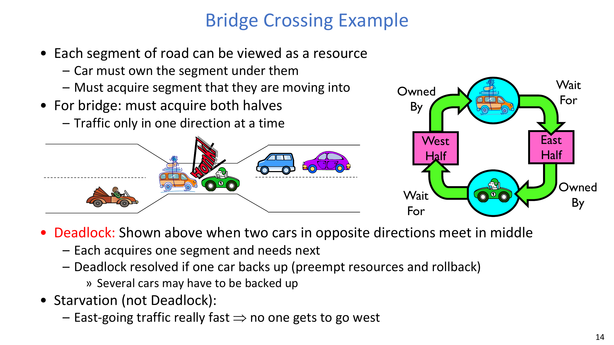

- 每一段路都可看作一个资源。
- 车占有当前路段，再申请下一路段。
- 两个反向来车在中间会形成循环等待。

锁死锁是同构问题：

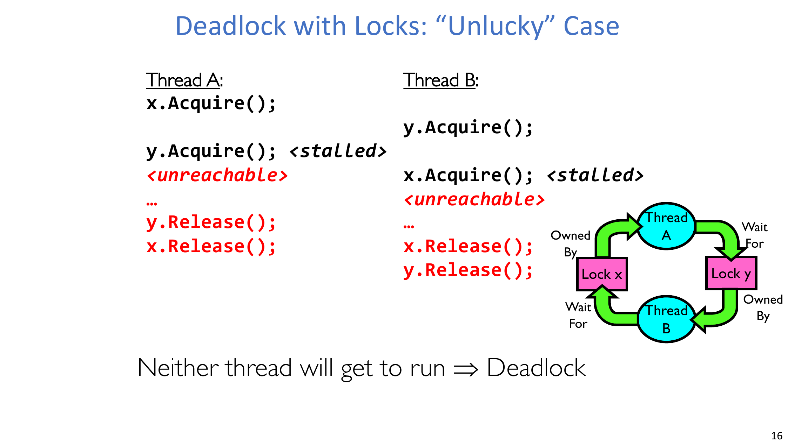

- 线程 A：`x.Acquire(); y.Acquire(); ...`
- 线程 B：`y.Acquire(); x.Acquire(); ...`
- 在 “unlucky” 调度交错下会出现循环等待。

:::warn 关键问题：为什么这类 bug 很难排查？
**问题（课件原意）：Why can the same lock code sometimes run fine and sometimes deadlock?**

解答：
- 死锁触发依赖调度交错，具备非确定性。
- 测试很可能只覆盖到“幸运交错”。
- 正确性应建立在加锁顺序约束上，而不是“平时没出事”。
:::

## 4. 不只是锁：空间死锁与 Dining Lawyers

死锁不只发生在互斥锁上。

内存空间死锁：

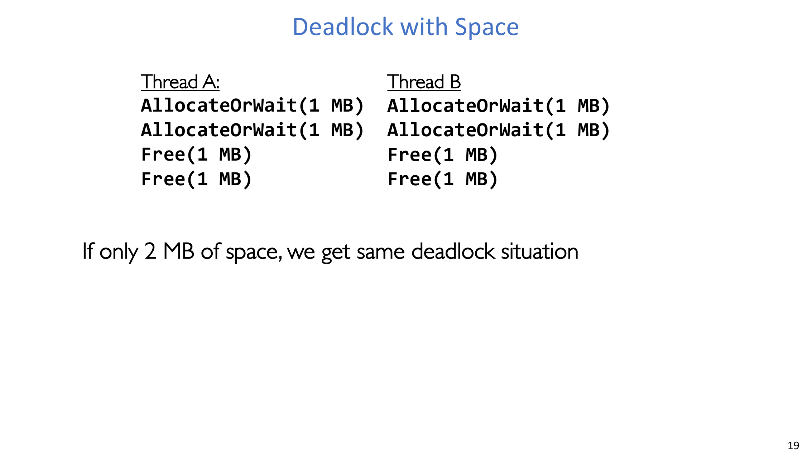

- 两个线程都需要两个单位资源。
- 若总容量只有两个单位，则双方都可能“先拿到一个、再等待另一个”，最终互卡。

Dining lawyers：

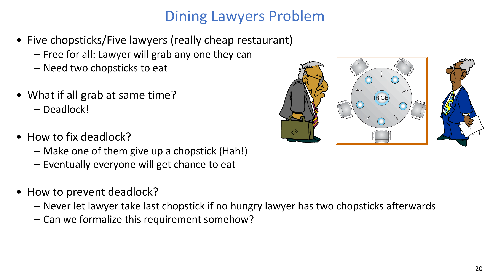

- 五个律师、五根筷子，每人吃饭需要两根。
- 如果所有人同时先拿一根，就可能没人能继续。

:::tip 关键问题：这个例子带来的策略启发是什么？
**问题（课件原句）：Can we formalize “never let everyone get stuck with one chopstick”?**

解答：
- 可以。核心是设计规则去破坏至少一个死锁必要条件（常见是 hold-and-wait 或 circular wait）。
- 这也是后续引入形式化模型与避免算法的动机。
:::

## 5. 死锁发生的四个必要条件

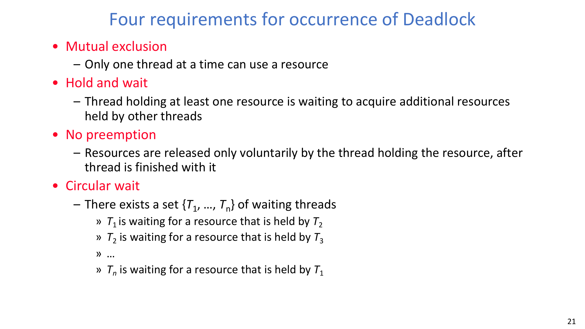

只有四个条件同时成立，死锁才可能发生：

1. **Mutual exclusion（互斥）**
2. **Hold and wait（持有并等待）**
3. **No preemption（不可抢占）**
4. **Circular wait（循环等待）**

设计含义：

- 只要能稳定破坏其中任意一个条件，就能从协议层面消除死锁可能性。

## 6. 资源分配图（RAG）

RAG 提供了死锁分析的形式化语言：

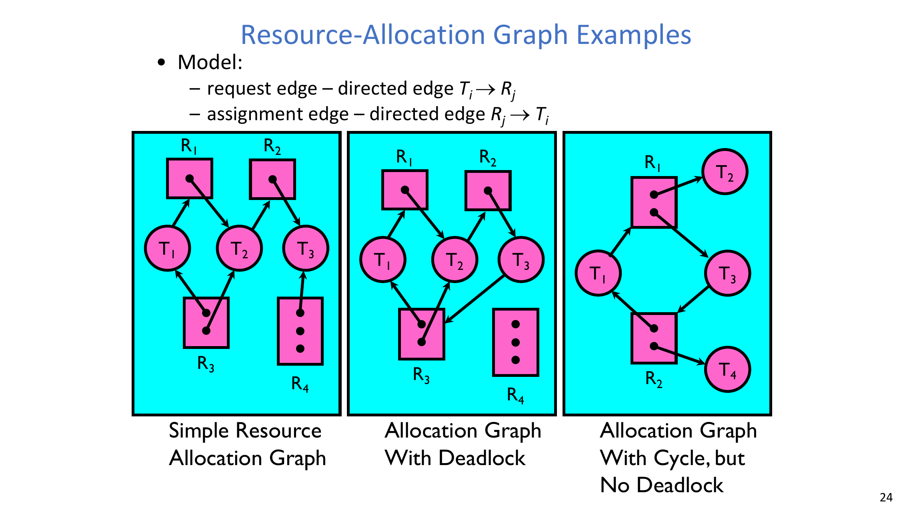

- 请求边：\(T_i \rightarrow R_j\)
- 分配边：\(R_j \rightarrow T_i\)
- 资源类型 \(R_i\) 可有 \(W_i\) 个实例。

:::remark 关键问题：图里有环就一定死锁吗？
**问题（课件原句）：Does a circle in a resource-allocation graph mean a deadlock?**

解答：
- 不一定。
- 单实例资源下，有环通常强烈指向死锁。
- 多实例资源下，即使有环也可能仍存在安全完成序列。
:::

## 7. 死锁检测算法

检测算法核心如下：

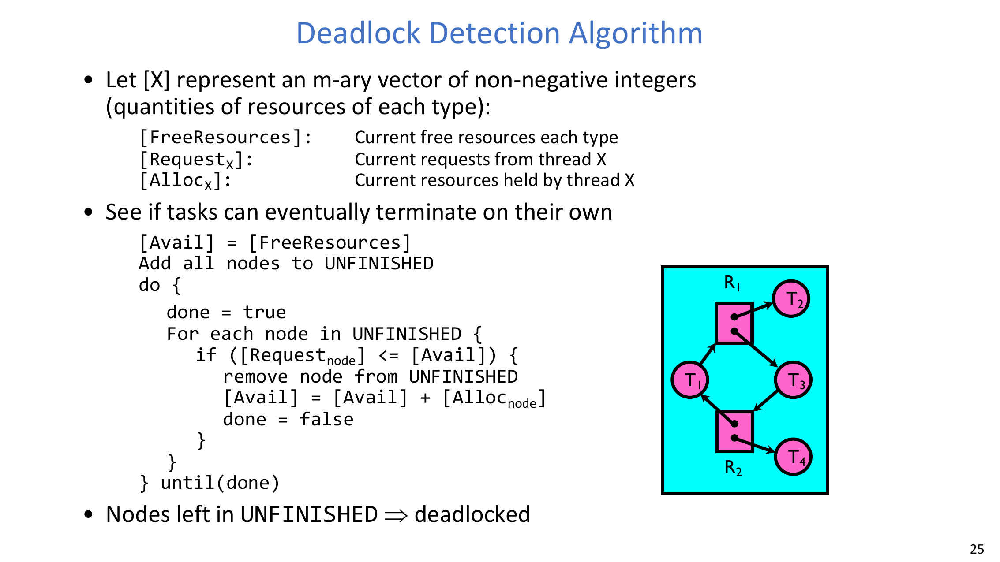

向量定义：

- \([FreeResources]\)：当前空闲资源。
- \([Request_X]\)：线程 \(X\) 尚未满足的请求。
- \([Alloc_X]\)：线程 \(X\) 当前已持有资源。

算法判定条件与状态更新：

$$
[Request_{node}] \le [Avail]
$$

$$
[Avail] = [Avail] + [Alloc_{node}]
$$

解释：

- 反复剔除“当前可完成”的节点。
- 若最终 `UNFINISHED` 仍有节点，表示在当前模型下它们处于死锁。

:::warn 关键问题：为什么 “UNFINISHED 还有节点” 就能判死锁？
**问题（课件原句）：Nodes left in UNFINISHED \(\Rightarrow\) deadlocked — why?**

解答：
- 因为剩余节点的请求都无法被任何可行完成链满足。
- 在不外部干预的前提下，不存在可推进的执行序列。
:::

## 8. 系统处理死锁的四类路径

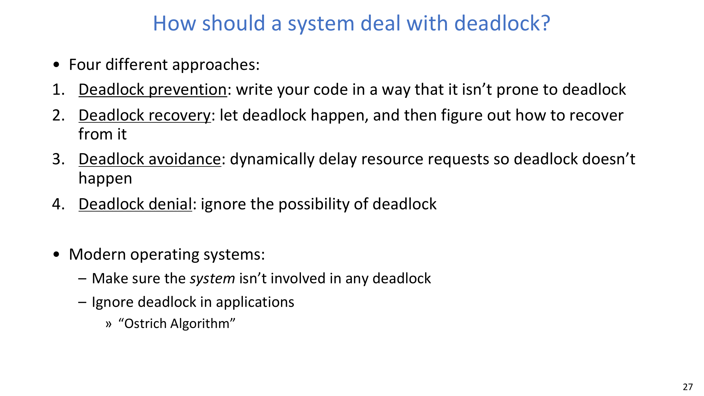

1. **Prevention**：从协议设计上杜绝死锁。
2. **Recovery**：允许死锁出现，再检测并修复。
3. **Avoidance**：运行时逐次判定请求，保持系统处于安全区。
4. **Denial**：忽略死锁可能（应用侧常见 Ostrich 思路）。

现代系统常见取舍：

- 内核与关键子系统尽量保证不死锁。
- 许多应用层场景中，系统不做全局强保证。

## 9. 预防的工程手段：原子申请与一致顺序

两个常见预防策略：

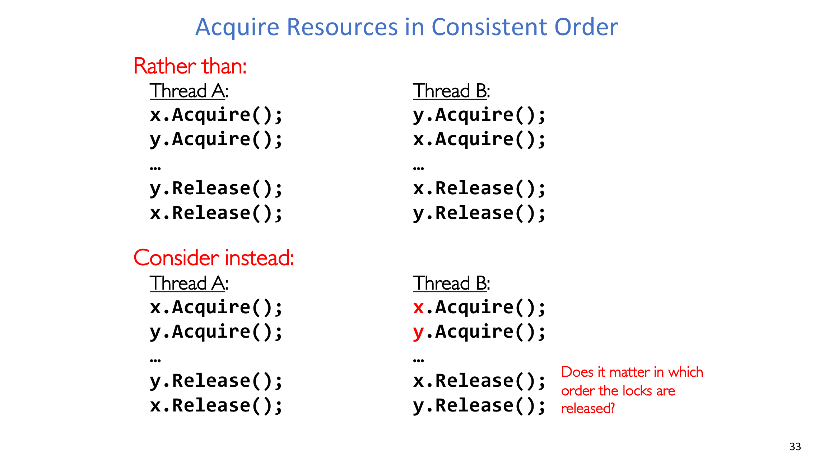

- 原子地申请所需资源（all-or-nothing）。
- 强制全局加锁/资源申请顺序（如统一先 `x` 后 `y`）。

本质是从构造上消除循环等待路径。

:::tip 关键问题：释放顺序重要吗？
**问题（课件提示）：Does it matter in which order the locks are released?**

解答：
- 死锁预防主要依赖**申请顺序（acquire order）**，不是释放顺序。
- 一致的申请顺序能阻断环路形成。
:::

## 10. 恢复的工程手段：终止、抢占、回滚

恢复常见做法：

- 终止一个或多个线程并回收资源。
- 临时抢占资源。
- 回滚到安全点（数据库事务中很常见）。

代价是：

- 能恢复进展；
- 但可能破坏程序语义、一致性或用户体验。

:::error 关键问题：为什么不总是走 recovery？
**问题（课件原意）：If recovery can break deadlock, why not always use it?**

解答：
- 强制终止/抢占可能留下不一致状态。
- 回滚依赖额外的可回滚设计与元数据。
- 在许多场景里，预防/避免比事后补救更稳妥。
:::

## 11. Avoidance 与安全状态

“只要当前不死锁就立刻批准请求”这个规则并不够。

- 关键是避免进入 **unsafe state**，而不是只看“此刻是否死锁”。
- unsafe 的含义是：现在还没死锁，但后续请求可能把系统逼入必死锁状态。

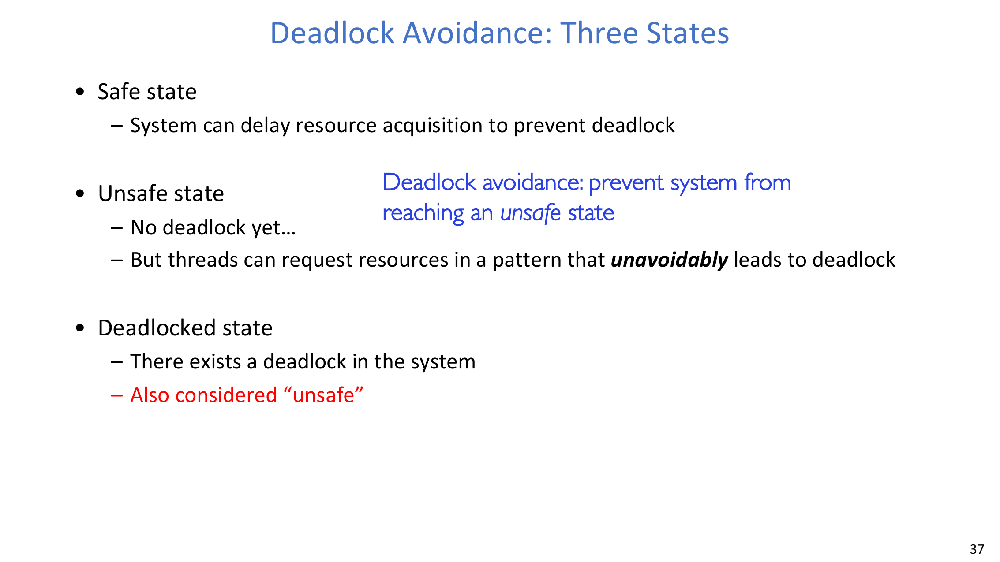

:::remark 关键问题：为什么“当前没死锁”仍然危险？
**问题（课件原句）：No deadlock yet — why may the system still be unsafe?**

解答：
- 因为当前批准可能消灭所有未来可完成序列。
- Avoidance 要检查“是否至少还存在一个完整安全完成序列”。
:::

## 12. Banker 算法

Banker 算法就是安全状态检查的经典实现。

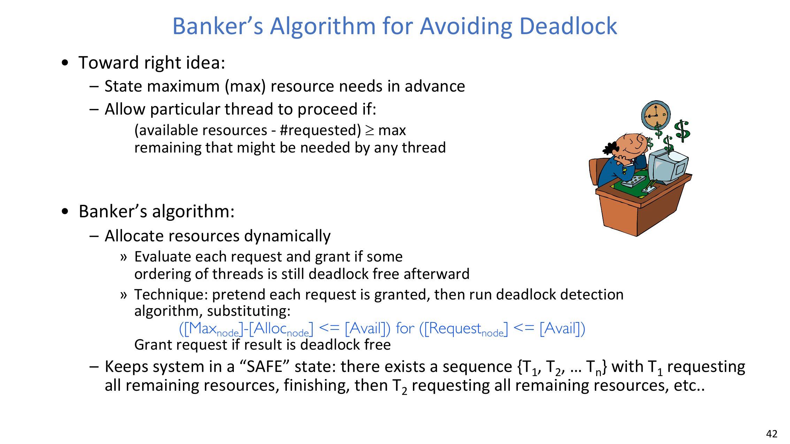

在模拟完成阶段使用的核心条件：

$$
[Max_{node}] - [Alloc_{node}] \le [Avail]
$$

课件里的等价直觉表达：

$$
(\text{available resources} - \#\text{requested}) \ge \text{max remaining needed by any thread}
$$

解释：

- 先“假设批准”一次请求；
- 用 `Need = Max - Alloc` 跑安全性检查；
- 仅当仍存在完整完成序列时才真正批准。

Dining lawyers 下的理解：

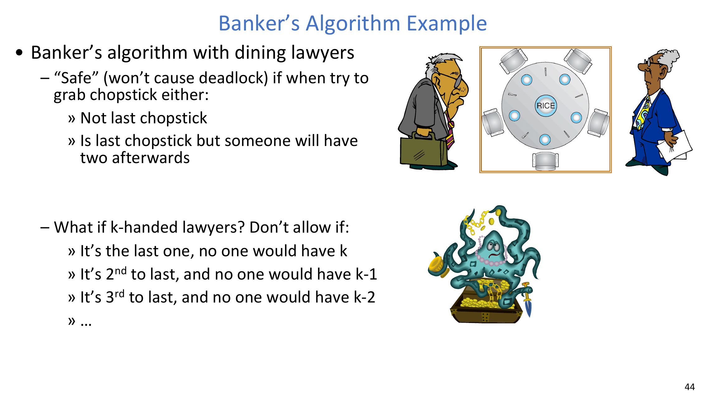

- 安全条件之一是：不是最后一根筷子，或虽是最后一根但会让某人马上凑齐可完成。
- 推广到 \(k\)-handed 场景时，规则本质仍是“始终保留完成路径”。

:::remark 关键问题：为什么必须事先声明最大需求？
**问题（课件原句）：Why state maximum resource needs in advance?**

解答：
- 若不知道最大需求，系统无法界定未来最坏请求。
- 无法界定未来请求上界，就无法有效做安全状态预测。
:::

## 13. 总结

- 死锁是由循环资源等待导致的结构性“无进展”。
- 四个必要条件构成完整的可发生性检查框架。
- RAG 与向量算法支持形式化检测。
- prevention 破条件、recovery 做补救、avoidance 在线保安全。
- Banker 算法是经典的安全状态避免方法。

## 14. Exam Review

### 14.1 必会定义

- **Deadlock**：循环等待导致相关线程都无法继续。
- **Starvation**：长期无法获得进展，未必形成循环。
- **Safe state**：存在至少一种完整完成顺序。
- **Unsafe state**：当前未死锁，但存在不可避免走向死锁的风险。
- **Banker’s algorithm**：通过请求准入策略维持系统在安全状态。

### 14.2 高价值简答模板

1. **为什么“有环”不总等于死锁？**  
   因为多实例资源下仍可能存在可行完成顺序。
2. **prevention 与 avoidance 的差异是什么？**  
   prevention 是静态协议约束；avoidance 是运行时逐请求安全判定。
3. **为什么 Banker 比“即时死锁检查”更强？**  
   它检查的是未来可完成性，而不只是当前是否已经死锁。

### 14.3 常见误区

- 把 starvation 和 deadlock 当成同义词。
- 只检查“现在是否死锁”，忽略 unsafe 状态迁移。
- 认为锁死锁总是稳定复现、容易定位。
- 忽视 recovery（kill/preempt/rollback）的语义代价。

### 14.4 自检

:::tip 自检 1
给定两把锁 `x` 和 `y`，先构造一个会死锁的交错，再用全局加锁顺序修复它。
:::

:::tip 自检 2
对一个“有环但资源多实例”的资源分配图，给出一个能避免死锁的完成顺序。
:::

:::tip 自检 3
给定 `Free`、`Alloc`、`Max`，计算 `Need = Max - Alloc` 并判断状态是否安全。
:::
