# 第 13 讲：现代计算机系统中的调度（论文专题）

## 学习目标

学完本讲后，你应该能够：

1. 解释为什么现代调度问题已经与尾延迟、GPU 集群、共享缓存深度耦合。
2. 讲清 ZygOS、Tiresias、DRF、FairRide 的核心思想与取舍。
3. 区分单资源公平与多资源公平的定义差异。
4. 使用 dominant share 和 hit ratio 公式分析分配质量。
5. 解释为何缓存共享中的策略无关性很难，以及概率阻断为何有效。
6. 将这些系统与经典 FCFS/RR/SJF 的公平与效率视角进行对比。

## 1. 全景：四个现代调度案例

本讲围绕四篇代表性工作展开：

- **ZygOS**：面向微秒级 RPC 服务的低尾延迟系统。
- **Tiresias**：在不完整作业信息下进行分布式深度学习 GPU 调度。
- **DRF（Dominant Resource Fairness）**：多资源类型场景下的公平分配。
- **FairRide**：面向策略性用户的公平且近最优缓存共享机制。

主线非常统一：调度策略需要同时平衡 **延迟、吞吐、公平性、不确定性与用户策略行为**。

## 2. ZygOS：数据中心低尾延迟

### 2.1 问题背景

微秒级服务（如 KV 存储、内存数据库）在 fan-out/fan-in 模式下对尾延迟极其敏感。

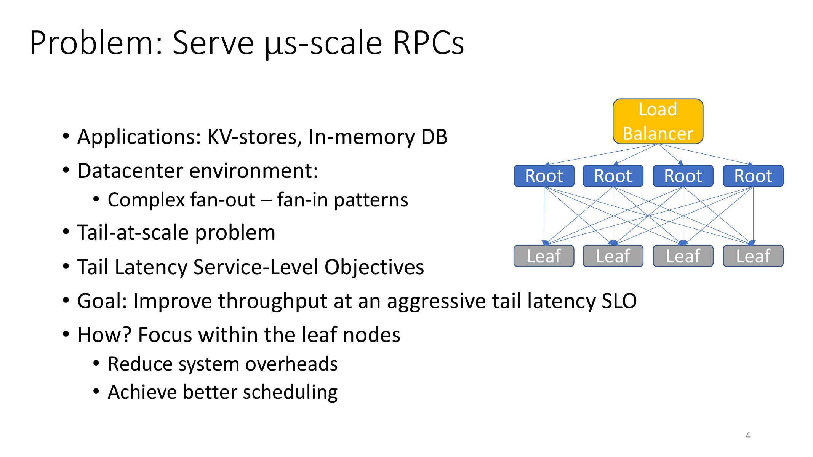

:::remark 关键问题：为什么尾部行为主导用户体验？
**问题（原意）：在大规模 fan-out RPC 树中，为什么哪怕尾部概率很小，也会主导端到端延迟 SLO？**

解答：
- 一个请求通常依赖多个子请求返回。
- 端到端延迟更接近最慢分支，而不是平均分支。
- 因此即便均值看起来很好，p99 仍可能成为实际瓶颈。
:::

### 2.2 核心设计

ZygOS 的目标是结合两类系统优势：

- Dataplane 优势：低开销、share-nothing 快路径。
- 单队列近似的 work-conserving 行为：避免有核空闲而其他核排队。

它在 shuffle 层引入应用无关的 work stealing，并通过轻量级核间通知降低队首阻塞。

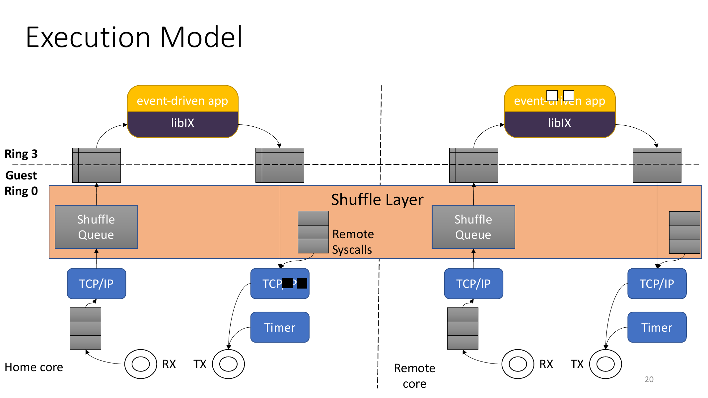

### 2.3 评估信号

实验显示：在低服务时间区间，ZygOS 的 SLO crossing throughput 与尾延迟表现优于基线。

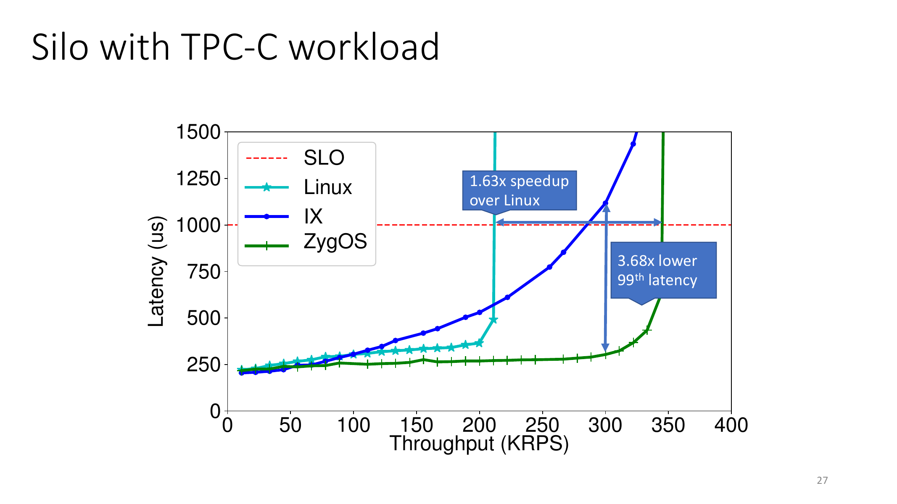

讲义突出数字包括：

- 在展示的 Silo 场景中，相对 Linux 约 **1.63x speedup**。
- 在可比负载下，高分位延迟明显降低。

:::tip 关键问题：为什么低服务时间下“模型贴合度”更重要？
**问题（原意）：当服务时间极短时，哪些系统能真正贴近理论队列模型？**

解答：
- 服务时间很小时，软件与调度开销占比迅速上升。
- 系统若不能压低开销，实测行为会偏离理论模型。
- ZygOS 的关键就在于缩小这种偏差。
:::

## 3. Tiresias：在不完整信息下调度深度学习作业

### 3.1 两个工程挑战

Tiresias 面向生产 GPU 集群中的两个现实约束：

1. 作业完成时间事先未知。
2. 过度合并放置会导致空闲 GPU 碎片化，进而拉长排队等待。

同时，它观察到 DL 作业在时间维和空间维都高度异构。

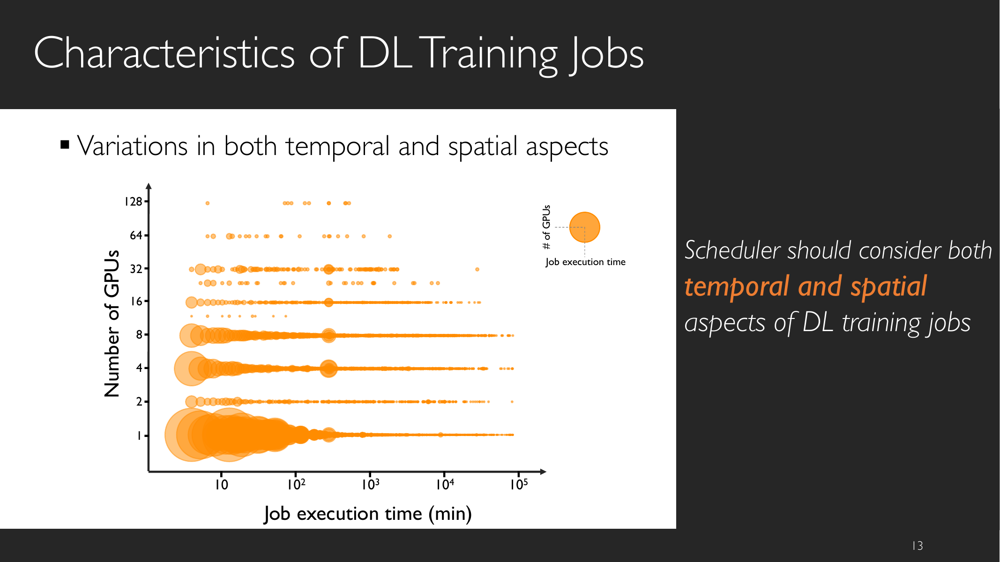

:::remark 关键问题：什么叫“without complete knowledge”？
**问题（原意）：如果不知道真实作业时长，如何仍然逼近短作业优先的收益？**

解答：
- 用 attained service（已执行工作量）作为稳健代理量。
- 优先服务“更年轻/已服务更少”的作业，以降低平均完成时间。
- 接受近似性，再通过机制设计保证稳定和实用。
:::

### 3.2 2DAS 调度

Tiresias 使用二维 attained service：

$$
\text{Age}_{2D}(j) = g_j \cdot t_j
$$

其中 \(g_j\) 为分配 GPU 数量，\(t_j\) 为已执行时间。

这个定义同时刻画：

- 时间进度（temporal），
- 空间占用（spatial）。

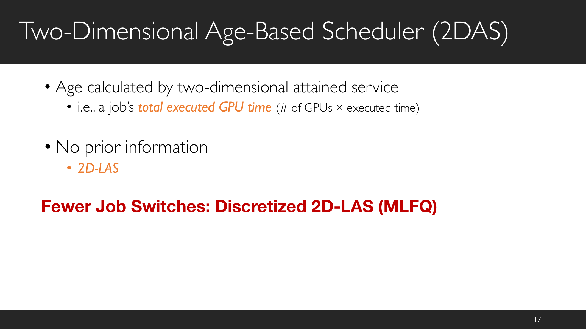

### 3.3 放置策略

除调度顺序外，Tiresias 还采用 model-profile-based placement：

- 不同模型对网络竞争与不均衡敏感度不同。
- 是否合并放置由模型特征决定，而不只由队列顺序决定。

### 3.4 结果结论

本讲强调：

- 在测试床中，平均 JCT 相对 YARN-CS 显著改善。
- 在 trace-driven 模拟中，相对 Gandiva 也有明显收益。

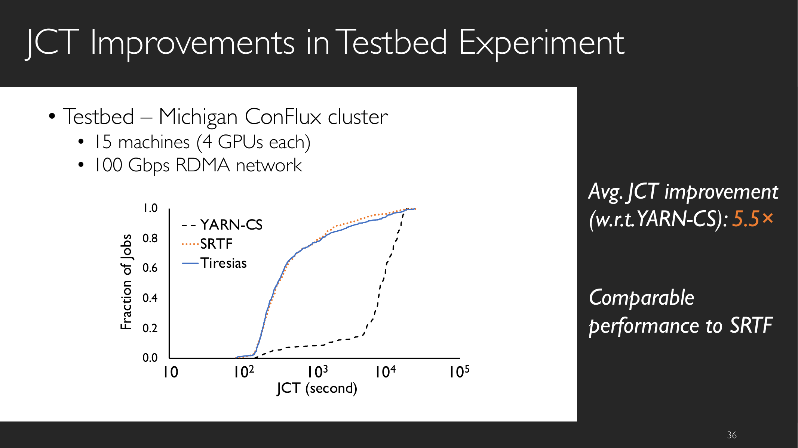

:::warn 关键问题：为什么“总是合并放置”会有副作用？
**问题（原意）：既然合并能提高训练效率，为什么不能永远合并？**

解答：
- 合并会占用连续 GPU 资源块，留下碎片化残余资源。
- 资源碎片会放大后续作业的排队等待。
- 因此必须联合优化训练效率与排队动态。
:::

## 4. DRF：多资源公平分配

### 4.1 为什么单资源公平不够

经典单资源 max-min 直觉（如仅看 CPU）无法直接解决多资源分配。

在数据中心中，作业往往按不同配比共同消耗 CPU、内存、磁盘、I/O。

### 4.2 DRF 关键定义

公平份额基线：

$$
\text{Fair-share baseline} = \frac{1}{n}
$$

DRF 核心定义：

$$
\text{dominant share}_i = \max_k\left(\frac{a_{ik}}{R_k}\right)
$$

其中 \(a_{ik}\) 是用户 \(i\) 在资源 \(k\) 上的分配量，\(R_k\) 是该资源总量。

DRF 的核心做法：对 dominant share 应用 max-min fairness。

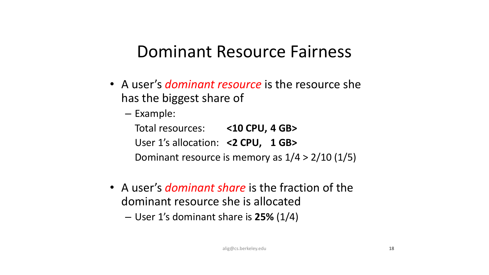

讲义示例里的比较为：

$$
\frac{1}{4} > \frac{2}{10} = \frac{1}{5}
$$

因此示例中该用户的 dominant resource 是 memory。

### 4.3 策略属性对比

DRF 与 Asset fairness、CEEI 等方案可从以下属性比较：

- share guarantee，
- strategy-proofness，
- Pareto efficiency，
- 各类 monotonicity 指标。

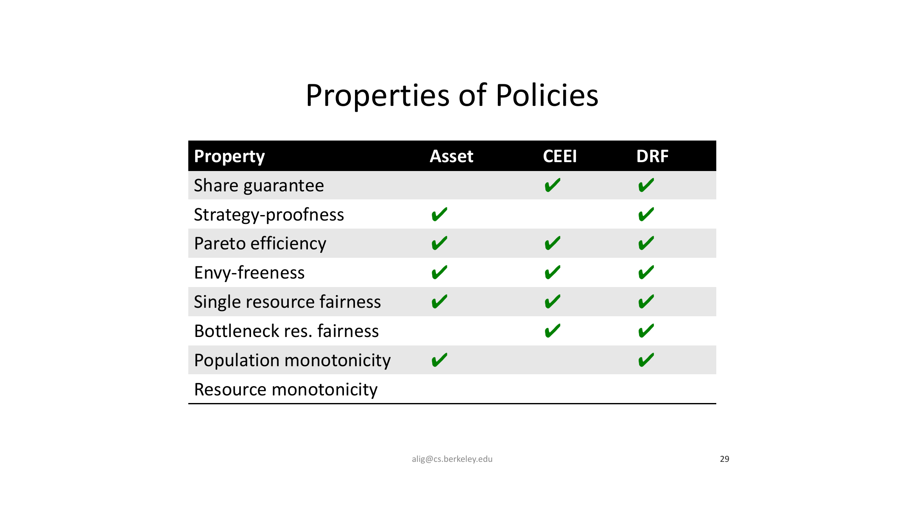

:::remark 关键问题：为什么 DRF 成为集群调度中的常见默认方案？
**问题（原意）：DRF 的工程吸引力主要来自什么？**

解答：
- 在异构需求下仍保持清晰的公平语义。
- dominant share 具有可解释、可观测的操作意义。
- 在公平、效率与策略鲁棒性之间给出较好的平衡。
:::

## 5. FairRide：近最优的公平缓存共享

### 5.1 模型与效用

FairRide 研究共享缓存下的策略性用户问题。

讲义中的简化模型：

- 文件大小相同。
- 用户 \(i\) 访问文件 \(j\) 的速率为 \(r_{ij}\)。
- 策略决定每个文件的缓存比例 \(p_j\)。

用户效用定义为命中率：

$$
HR_i = \frac{\text{total hits}_i}{\text{total accesses}_i}
= \frac{\sum_j p_j r_{ij}}{\sum_j r_{ij}}
$$

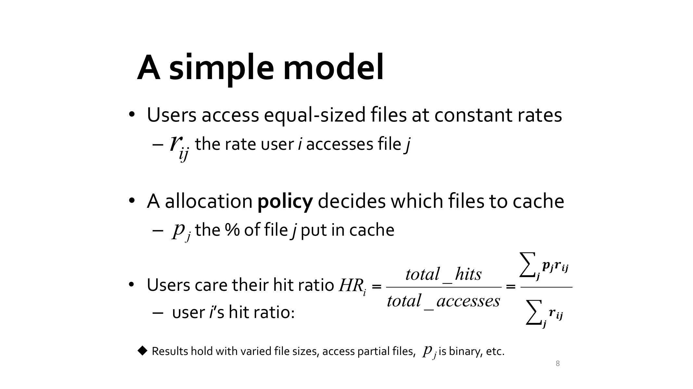

### 5.2 基本张力

讲义强调三类目标：

1. Isolation guarantee（share guarantee），
2. Strategy-proofness，
3. Pareto efficiency。

并给出核心不可能性结论：

- 在一般情况下，不存在同时满足三者的分配策略。
- 现实设计通常是“强保两项，另一项尽量接近最优”。

### 5.3 FairRide 机制

FairRide 从 max-min 式共享出发，但额外对“不付成本”的访问进行阻断。

阻断采用概率形式：

$$
p(n_j) = \frac{1}{n_j + 1}
$$

其中 \(n_j\) 是缓存文件 \(j\) 的“其他用户”数量。

示例：

$$
p(1)=50\%, \quad p(4)=20\%
$$

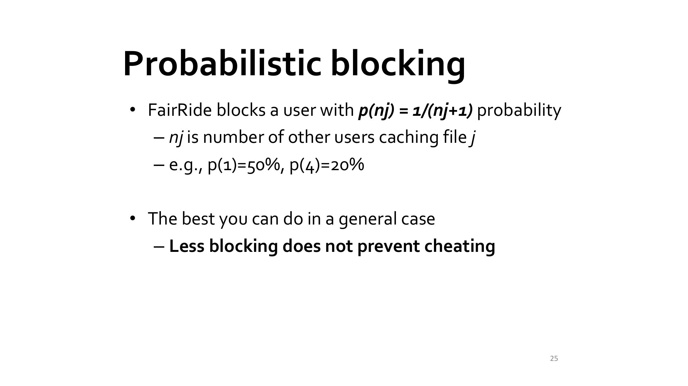

:::error 关键问题：为什么必须引入概率阻断？
**问题（原意）：若纯 max-min 会被钻空子，为什么随机阻断能改变激励结构？**

解答：
- 确定性规则更容易被预测性利用。
- 随机阻断会把“虚报/刷访问”的收益变成期望损失。
- 合理设计阻断概率可同时抑制作弊并保留较高效率。
:::

### 5.4 最终取舍

FairRide 在最终属性表中的位置是：

- 保持 isolation guarantee，
- 恢复 strategy-proofness，
- 获得 near-optimal（非绝对最优）Pareto efficiency。

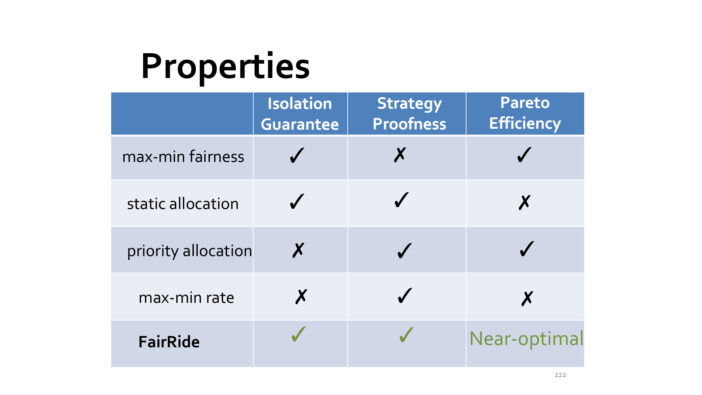

## 6. 跨论文归纳

### 6.1 与经典调度相比，变化在哪里

- FCFS/RR/SJF 主要关注“顺序”和 CPU 时间进展。
- 现代系统还必须处理多维资源、不确定性和用户策略行为。
- “谁先运行”只是一部分，放置策略、类定价机制、反作弊机制同样关键。

### 6.2 统一分析框架

可以用四个问题统一比较四篇工作：

1. 优化目标是什么（tail、JCT、公平、缓存效用）？
2. 不确定性来自哪里（服务时长、作业长度、用户行为）？
3. 公平单位是什么（队列时间、dominant share、hit ratio）？
4. 约束策略靠什么机制落地（stealing、2D age、dominant-share equalization、probabilistic blocking）？

## 7. Exam Review

### 7.1 必会定义

- **Tail latency SLO**：约束高分位延迟而非均值延迟的服务目标。
- **2D attained service (2DAS)**：Tiresias 中按 GPU-时间乘积定义的年龄量。
- **Dominant resource**：用户分配占比最大的资源维度。
- **Dominant share fairness (DRF)**：对 dominant share 应用 max-min 的公平机制。
- **Strategy-proofness**：用户无法通过虚报/操纵需求提升自身效用。
- **Probabilistic blocking**：通过随机阻断抑制策略性作弊的机制。

### 7.2 高价值简答模板

1. **为什么不能直接用单资源 max-min 管理集群？**  
   因为异构需求会产生跨资源失衡，公平必须在 dominant share 层定义，而不是固定看某一资源。
2. **Tiresias 的核心贡献是什么？**  
   在不完整作业信息下，联合采用时空二维年龄调度和模型感知放置，显著改善 JCT。
3. **FairRide 与纯 max-min 缓存分配的关键差异是什么？**  
   它加入概率阻断机制，在保持高效率的同时增强策略无关性。

### 7.3 常见误区

- 在 fan-out RPC 场景中只看平均延迟，不看尾延迟。
- 调度 GPU 时只优化单作业速度，忽略碎片化与排队代价。
- 误以为 DRF 就是“CPU 平均分”。
- 误以为确定性公平分配天然具备策略无关性。

### 7.4 自检

:::tip 自检 1
给定两类需求 \(\langle 1\ \text{CPU}, 4\ \text{GB}\rangle\) 与 \(\langle 3\ \text{CPU}, 1\ \text{GB}\rangle\)，解释为什么只比较 CPU 百分比不足以定义公平。
:::

:::tip 自检 2
针对一个 DL 集群，给出一个“减少抢占反而使平均 JCT 变差”的场景，并解释背后的调度权衡。
:::

:::tip 自检 3
根据 \(p(n_j)=1/(n_j+1)\) 计算 \(n_j=2\) 和 \(n_j=5\) 时的阻断概率，并解释为什么共享用户越多时阻断强度越低。
:::

