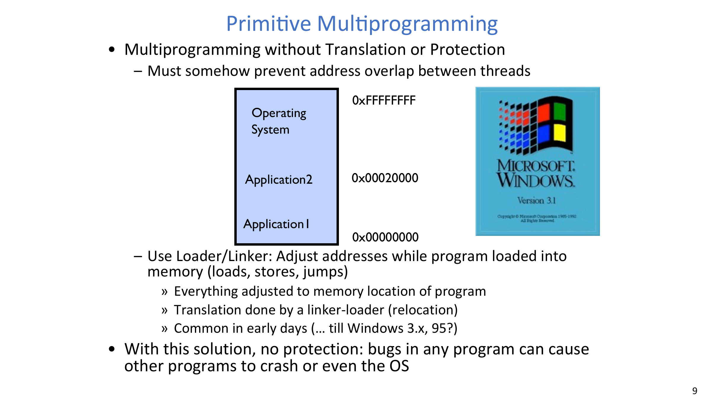
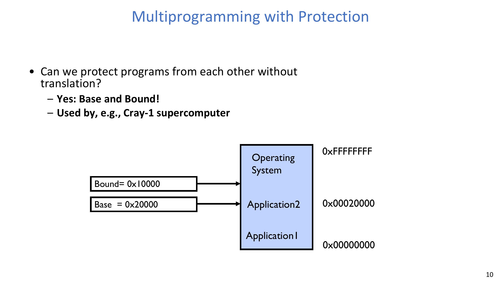
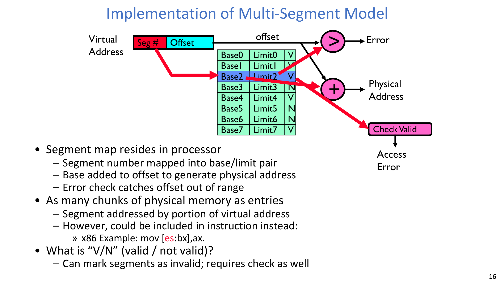
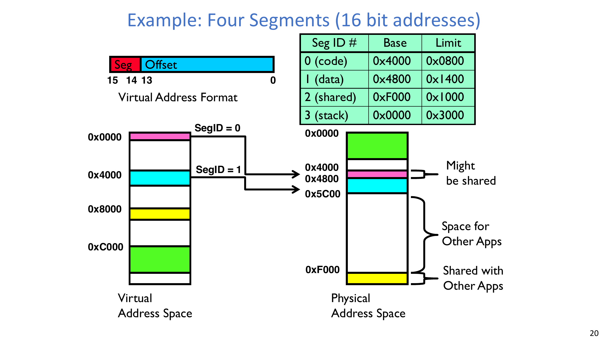
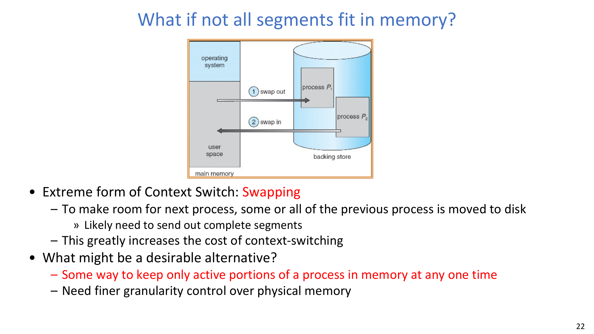
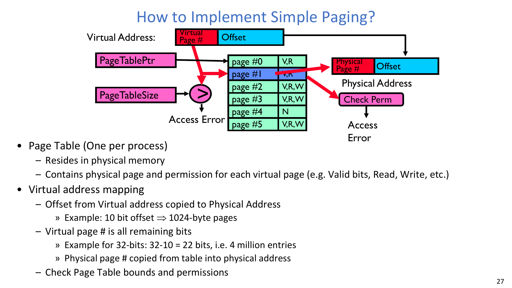
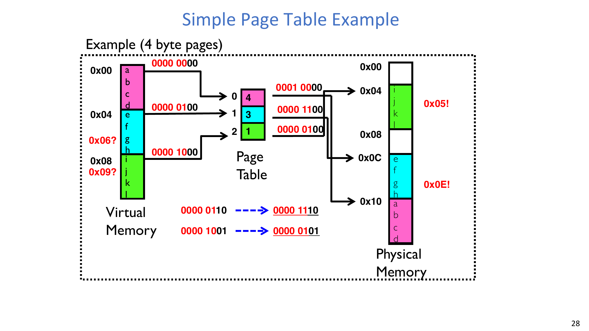
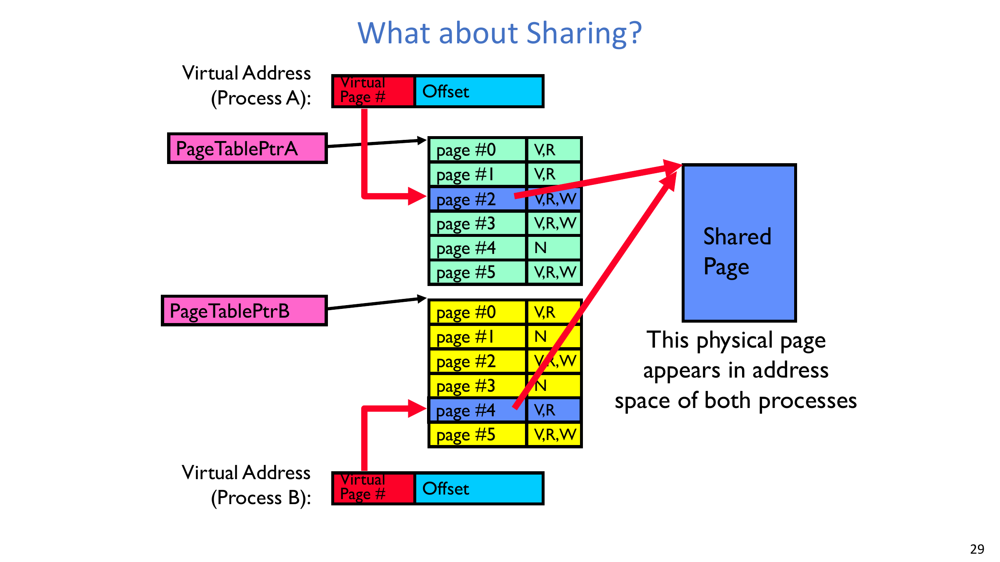
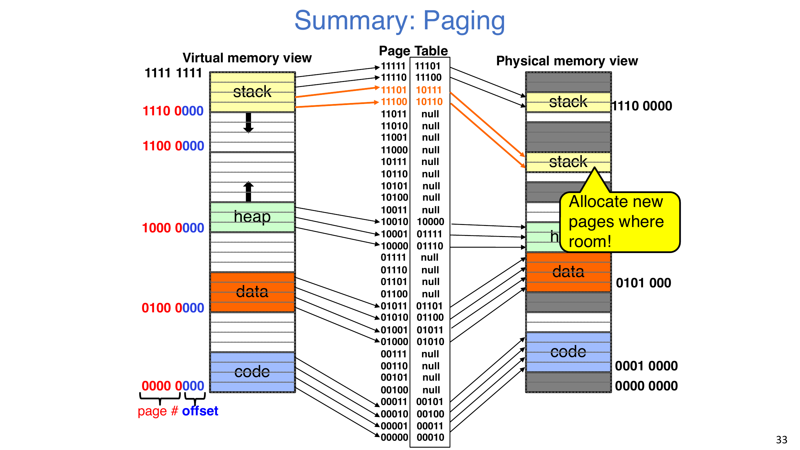
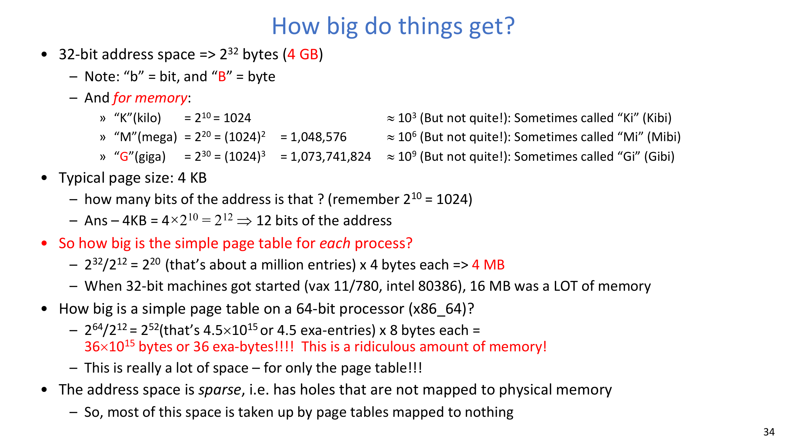

# 第 13 讲：内存 1——地址翻译与虚拟内存

## 学习目标

学完本讲后，你应该能够：

1. 解释为什么内存虚拟化必须同时提供保护与地址翻译。
2. 根据位宽计算地址空间大小与页表大小。
3. 比较单道程序、仅重定位的多道程序，以及 base-and-bound 保护。
4. 解释分段地址翻译的机制、优势与碎片化限制。
5. 解释简单分页的翻译流程、共享能力与增长行为。
6. 分析为什么在稀疏 64 位地址空间上，朴素的一层页表会变得巨大。

## 1. 为什么需要内存虚拟化

物理内存是共享硬件，但每个进程都需要“私有、稳定”的编程视图。

这里有两个要求必须同时满足：

- **保护（Protection）**：一个进程不能破坏另一个进程或内核。
- **翻译（Translation）**：程序看到的地址可以映射到不同的物理位置。

一个很实用的统一视角是“操作系统插入控制点（interposition）”：

- I/O 通过系统调用插入，
- CPU 通过中断插入，
- 内存通过硬件翻译处理常见访问，通过页错误处理异常访问。

:::remark 关键问题：为什么内存插入不能全靠软件完成？
**问题（原意复述）：既然 OS 需要控制内存访问，为什么不把每次 load/store 都陷入内核？**

解答：
- 每条指令都可能访问内存，如果每次都陷入内核，开销会不可接受。
- MMU 负责硬件快速路径。
- OS 只在少数异常路径介入（例如缺页、权限违规、映射不存在）。
:::

## 2. 地址空间基础与规模计算

**地址空间（Address Space）**表示程序可发出的地址集合。

在按字节编址、地址位宽为 k 时：

$$
\text{Address space size} = 2^k\ \text{bytes}
$$

本讲反复使用的基础换算：

$$
2^{10}\,\text{B} = 1024\,\text{B} = 1\,\text{KB}
$$

$$
4\,\text{KB} = 4\times 2^{10}\,\text{B} = 2^{12}\,\text{B}
$$

对 32 位进程：

$$
2^{32}\ \text{bytes} \approx 4\times10^9\ \text{bytes}
$$

一个 32 位整数占 4 字节，因此可容纳的 32 位整数个数是：

$$
\frac{2^{32}}{4\,\text{B}} = 2^{30}
$$

## 3. 进程虚拟地址空间与访问语义

**虚拟地址空间（Virtual Address Space）**不只是一个数值区间，还包含地址对应的映射状态与权限状态。

一次虚拟地址访问可能：

- 读写普通内存，
- 触发异常（例如段错误），
- 访问内存映射 I/O，
- 访问显式映射的共享区域。

这说明地址翻译不是“纯算术映射”，而是“带策略语义的映射”。

## 4. 从单道程序到原始多道程序

单道程序下，一次只跑一个应用，天然没有地址冲突问题。

不带保护/翻译的原始多道程序，把多个程序放进物理内存，再依赖装载时重定位。

这种方案能同时运行多个程序，但任一程序的错误写入仍可能覆盖其他程序甚至 OS。

:::warn 关键问题：仅靠重定位到底缺了什么？
**问题（原意复述）：Linker/Loader 已经能改地址了，为什么系统仍不安全？**

解答：
- 重定位只决定“装载时放在哪里”，不约束“运行时能访问哪里”。
- 没有硬件边界检查，错误指针随时可能越界写入他人内存。
- 因此隔离性无法保证。
:::

## 5. Base and Bound：最小翻译下的硬件保护

Base-and-bound 把运行时检查和重定位放进硬件：

- 先用 bound 检查 offset 是否越界；
- 再把 base 与 offset 相加得到物理地址。

核心条件：

$$
0 \le \text{Offset} < \text{Bound}
$$

$$
\text{PA} = \text{Base} + \text{Offset}
$$

这已经是重要进步：进程可以与 OS、与其他进程实现隔离。

:::remark 关键问题：base-and-bound 能完全解决内存复用吗？
**问题（原意复述）：既然 base-and-bound 已经能保护进程，为什么还要继续演化机制？**

解答：
- 它对“单一连续区域”效果好；
- 真实进程地址空间是稀疏的（代码/数据/堆/栈/共享区）；
- 单块连续模型在碎片和共享场景下过于僵硬。
:::

## 6. 为什么简单 Base-and-Bound 不够

很快会出现三个工程限制：

1. 进程大小不一，长期运行后外部碎片持续增加。
2. 稀疏地址空间在单连续区模型下表达困难。
3. 进程间共享在单体布局下实现成本高。

这直接推动了分段，再进一步推动分页。

## 7. 分段：为进程提供多个逻辑区域

### 7.1 翻译流水线

分段把进程拆为多个逻辑区域，例如 code、data、heap、stack，以及可选共享段。

翻译规则：

$$
\text{PA} = \text{Base}[\text{Seg}] + \text{Offset}
$$

访问合法当且仅当：

$$
V[\text{Seg}] = 1\ \land\ \text{Offset} < \text{Limit}[\text{Seg}]
$$

### 7.2 四段示例与共享

段号先选定 base/limit，再做段内偏移翻译。不同段可以映射到完全不同的物理位置。

因此分段天然支持：

- 稀疏布局，
- 分段权限控制，
- 按段共享。

### 7.3 运行期观察

- 每次取指/load/store 都要做翻译。
- 段表项必须带权限位（代码只读、数据/栈可读写等）。
- 栈/堆增长可通过故障触发与受控扩展实现。

:::tip 关键问题：分段已经很灵活，为什么仍可能很重？
**问题（原意复述）：如果分段这么灵活，它的扩展性瓶颈在哪里？**

解答：
- 段大小可变，放置时会带来碎片压力。
- 可变块换入换出成本高。
- 内存繁忙时，搬移与整理开销会持续放大。
:::

## 8. 交换（Swapping）与更细粒度需求

当段放不下时，系统会把段甚至整个进程内存换到磁盘。

交换能腾出容量，但上下文切换成本会显著上升。

因此我们需要“固定大小单位”的更细粒度管理方式。

## 9. 分页：固定大小翻译与更稳健分配

### 9.1 核心机制

分页把虚拟内存和物理内存都切成固定大小页面/页框。

地址分解：

$$
\text{VA} = \text{VPN} \parallel \text{Offset}
$$

$$
\text{PageSize} = 2^{|\text{Offset}|}
$$

当 offset 为 10 位：

$$
|\text{Offset}| = 10 \Rightarrow \text{PageSize} = 2^{10} = 1024\,\text{B}
$$

对 32 位虚拟地址：

$$
|\text{VPN}| = 32 - 10 = 22
$$

$$
\#\text{PTEs} = 2^{22}\ \text{(about 4 million)}
$$

### 9.2 例题直觉

offset 位在翻译前后保持不变，只有页号部分需要查页表。

### 9.3 分页下的共享

不同进程可以把不同 VPN 映射到同一个物理页框。

常见用途：

- 共享内核映射（配合特权位保护），
- 同一二进制/库的只读代码页共享，
- 显式共享内存 IPC 区域。

:::remark 关键问题：为什么共享映射必须严格受控？
**问题（原意复述）：共享很有用，为什么不能随意把页映射给多个进程？**

解答：
- 共享会改变隔离边界；
- 权限必须与语义一致（只读或可写）；
- 错误共享会重新引入数据破坏与越权风险。
:::

## 10. 分页增长行为与页表规模爆炸

当栈继续增长时，新虚拟页可以映射到任意空闲物理页框，不要求物理连续。

这是相对可变连续段模型的一大优势。

但朴素一层页表会非常大。

对 32 位地址、4KB 页、4 字节页表项：

$$
\frac{2^{32}}{2^{12}} = 2^{20}\ \text{entries}
$$

$$
2^{20}\times 4\,\text{B} = 2^{22}\,\text{B} = 4\,\text{MB}
$$

对 64 位地址、4KB 页、8 字节页表项：

$$
\frac{2^{64}}{2^{12}} = 2^{52}\ \text{entries}
$$

$$
2^{52}\times 8\,\text{B} = 2^{55}\,\text{B} \approx 36\times10^{15}\,\text{B}
$$

核心问题是稀疏性：绝大多数虚拟页并未映射，但平面页表仍要为“全部可能页号”预留索引空间。

:::error 关键问题：页表很大是否意味着分页思想失败？
**问题（原意复述）：如果简单页表太大，分页是不是不可行？**

解答：
- 不是。问题不在分页本身，而在“平面表示法”。
- 多级页表（下一讲）可以按需稀疏存储翻译结构。
- 这样既保留分页优势，又降低页表内存成本。
:::

## 11. 分段与分页：工程化对比

分段的优点：

- 贴合程序逻辑区域，
- 区域级权限与共享表达自然。

分段的不足：

- 可变大小放置导致外部碎片，
- 搬移/换出决策成本高。

分页的优点：

- 固定大小分配管理简单，
- 共享与增长更容易，
- 不要求物理连续。

朴素分页的不足：

- 在稀疏地址空间下页表可能非常大。

实际系统常做组合：以分页为主机制，同时保留分段式保护域思想或历史兼容能力。

## 12. 总结

- 内存虚拟化必须同时解决 **保护** 与 **翻译**。
- base-and-bound 提供了早期硬件隔离，但灵活性不足。
- 分段提升了逻辑结构表达与稀疏映射能力，但受碎片与扩展性限制。
- 分页解决了可变块分配痛点，并支持高效共享。
- 平面页表在稀疏 64 位空间上不可扩展，因此需要多级翻译结构。

## 13. Exam Review

### 13.1 Must-Know Definitions

- **Address space**：进程可发出的地址集合及其映射/权限语义。
- **Base-and-bound**：由 bound 检查与 base 相加组成的硬件保护与重定位机制。
- **Segmentation**：按段号+段内偏移翻译，段表包含 base/limit/权限。
- **Paging**：按虚拟页号映射到物理页框号，offset 保持不变。
- **External fragmentation**：可变块分配后，已分配块之间产生不可用空洞。
- **Sparse address space**：虚拟空间很大，但实际映射区域很少。

### 13.2 High-Value Short-Answer Templates

1. **为什么 base-and-bound 不够用？**  
   它只对单一连续区域的隔离很有效，但对稀疏布局、共享映射和长期碎片控制支持不足。
2. **为什么分页能改进内存复用？**  
   固定大小页框让分配更简单，减轻外部碎片压力，并支持非连续增长与可控共享。
3. **为什么 64 位下平面页表会“爆炸”？**  
   页表项数量随虚拟页总数线性增长，即使大量虚拟页未映射，平面设计仍要为其保留索引空间。

### 13.3 Common Pitfalls

- 把“仅重定位装载”等同于“运行时保护”。
- 混淆内部碎片与外部碎片成因。
- 忘记分页翻译中 offset 位是直接复制的。
- 误以为虚拟地址空间更大就等于可用物理内存更多。

### 13.4 Self-Check

:::tip 自检 1
给定 4KB 页和 48 位虚拟地址，offset 位数与 VPN 位数分别是多少？
:::

:::tip 自检 2
某进程的 code/data/heap/stack 之间存在大空洞。请用一段话说明为什么分段或分页比单连续 base-and-bound 更适合这种布局。
:::

:::tip 自检 3
计算：在 32 位进程、8KB 页面、4 字节页表项条件下，平面页表总内存开销是多少？
:::
