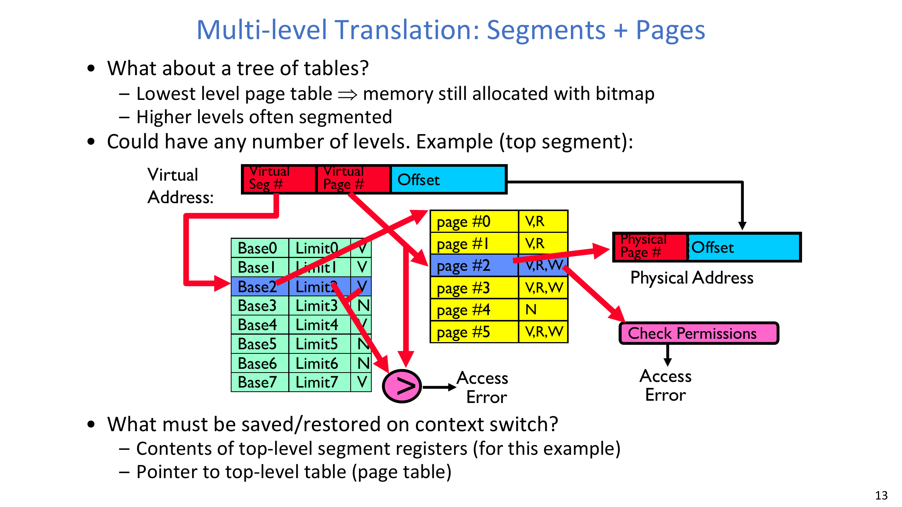
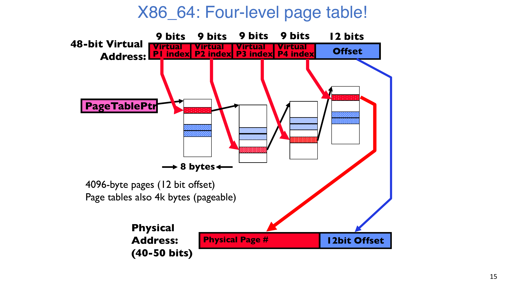
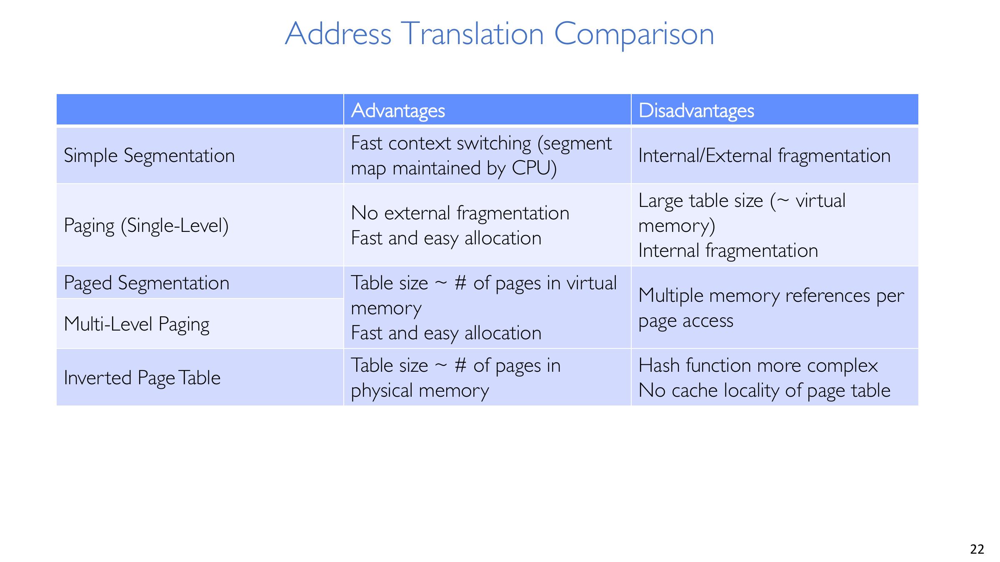
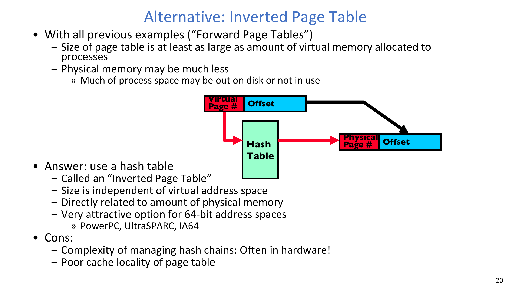
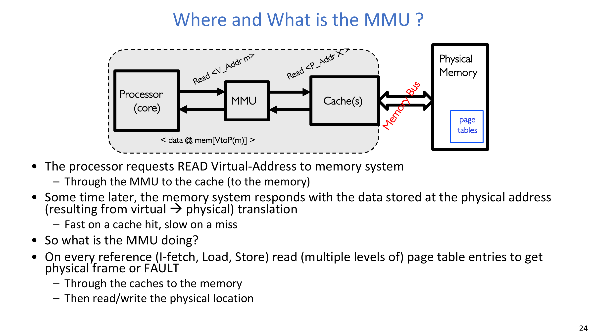
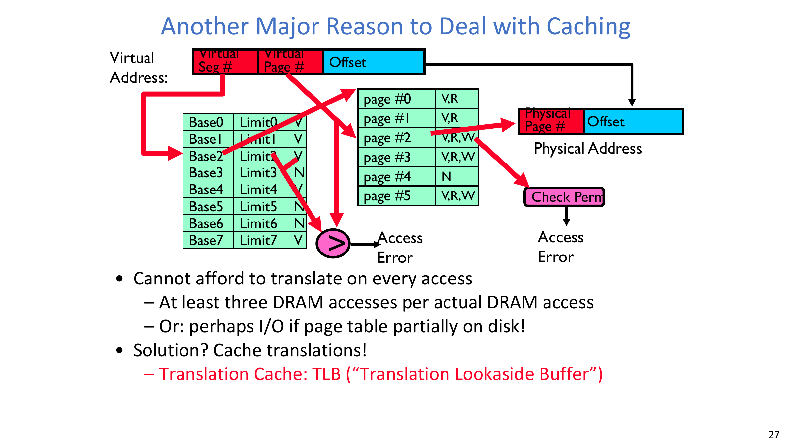
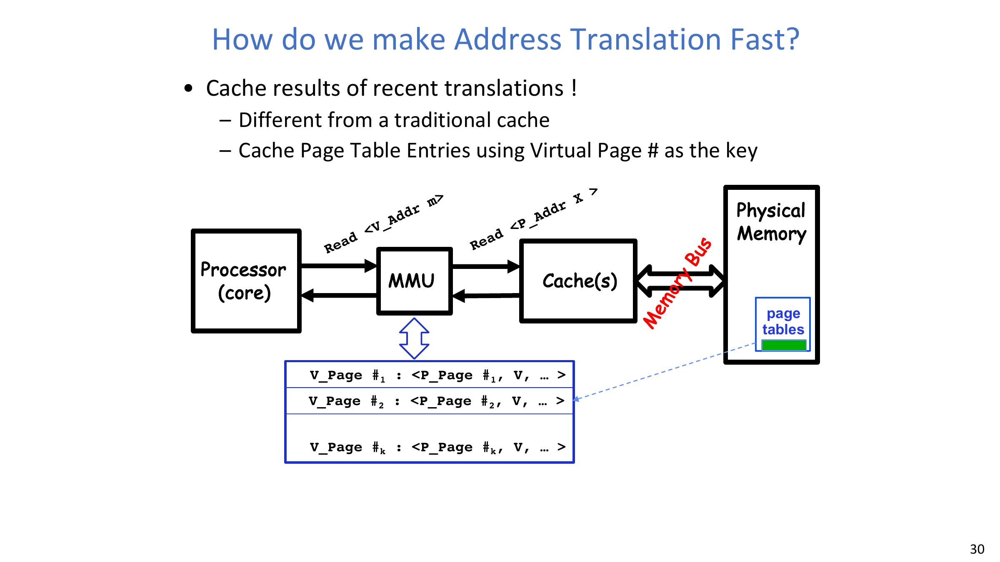
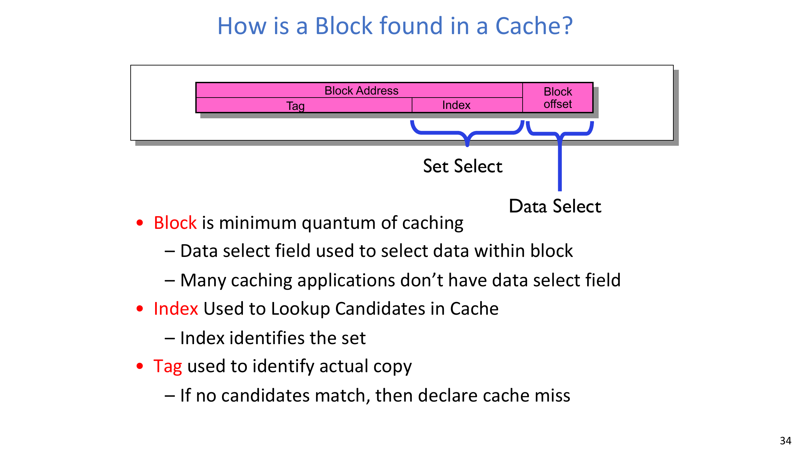
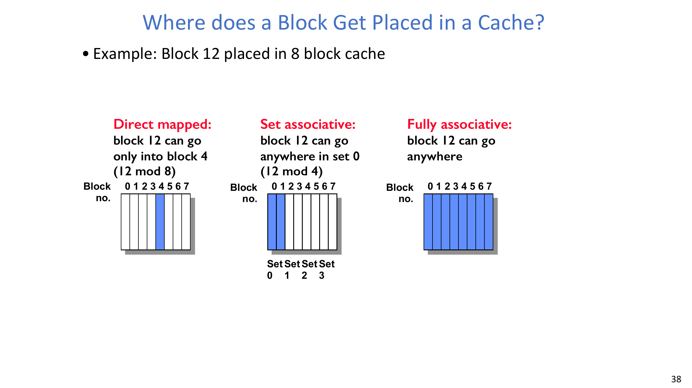
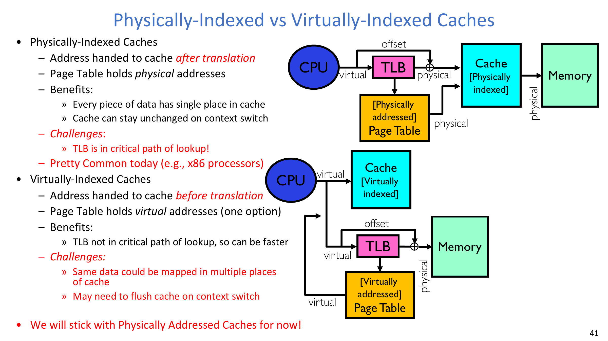

# 第 14 讲：内存 2——虚拟内存（续）、Caching 与 TLB

## 学习目标

学完本讲后，你应该能够：

1. 解释为什么平面页表不可扩展，以及多级翻译如何利用稀疏性。
2. 读懂关键 PTE 状态，并说明 demand paging、copy-on-write 与共享映射语义。
3. 比较前向页表、多级页表与反向页表的设计权衡。
4. 说明 MMU 在访问路径中的位置，以及翻译延迟为什么关键。
5. 推导并使用 AMAT，正确区分不同类型的 cache miss。
6. 解释 TLB 工作机制、写策略，以及物理索引/虚拟索引缓存的取舍。

## 1. 快速回顾：为什么翻译结构不断演进

从 base-and-bound 到分段，再到分页，主线一直没变：既要隔离正确，又要把翻译成本压到能支撑每次取指/load/store。

一层页表概念简单，但在稀疏 32/64 位地址空间下元数据代价很高，因此真实系统必须结合层次化结构和翻译缓存。

:::remark 关键问题：为什么不能一直用单层页表？
**问题（原意复述）：如果一层分页模型很直观，为什么还要引入多级结构？**

解答：
- 平面页表会为巨大虚拟空间预留条目，即使绝大多数页根本没映射。
- 多级页表只在“实际用到的区域”分配低层表。
- 这样保留分页语义，同时显著降低页表内存开销。
:::

## 2. 多级翻译：Segment + Page 树

本讲先展示了“上层分段 + 下层分页”组合视图：先定位逻辑区域，再在该区域内做页级翻译。

对经典 32 位两级拆分：

$$
32 = 10 + 10 + 12
$$

$$
\text{PageSize} = 2^{12} = 4096\,\text{B} = 4\,\text{KB}
$$

若 PTE 为 4 字节，则每个页表页可容纳：

$$
\frac{4096\,\text{B}}{4\,\text{B}} = 1024 = 2^{10}
$$

因此示例里每级索引自然对应 10 位。

### 2.1 PTE 语义不止“合法/非法”

页表项不只存位置和权限，“invalid” 也不只有一种含义。

本讲涉及的常见语义：

- 未分配 / 非法访问。
- 页面不在 DRAM（按需调页）。
- copy-on-write 尚未分裂。
- zero-fill-on-demand 尚未物化。

:::tip 关键问题：PTE invalid 一定是致命错误吗？
**问题（原意复述）：invalid 是否必然等同于段错误并终止？**

解答：
- 不一定。它可能是保护异常，也可能是可恢复状态。
- 对 demand paging 来说，invalid 可能表示“在磁盘上，正在调入”。
- 对 COW 或零页延迟分配来说，也可能触发合法的内核处理路径。
:::

## 3. 共享与真实架构实例

共享可以发生在段级，也可以发生在页级。多级表在保留稀疏分配优势的同时支持这两类共享。

### 3.1 x86_64 四级页表

讲义中常见的 48 位 canonical 拆分：

$$
48 = 9 + 9 + 9 + 9 + 12
$$

这种分法让各级页表页大小与索引规模配合得比较自然。

### 3.2 IA64 风格的多级示意

课程同时给出更深层级的 64 位示意：

$$
64 = 7 + 9 + 9 + 9 + 9 + 9 + 12
$$

重点不是背某个 ISA 的固定布局，而是理解：层级越深，稀疏表示越省；但 miss 时 walk 深度也会增加。

:::warn 关键问题：层级既然省内存，为什么不无限加深？
**问题（原意复述）：如果多级页表很节省，是否层数越多越好？**

解答：
- 层数增加会提高 page walk 延迟与内存引用次数。
- 近空表过多也会增加管理复杂度。
- 工程上需要在稀疏收益和关键路径延迟之间取平衡。
:::

## 4. 系统级权衡：多级页表与反向页表

讲义把主要策略做了并列对比：

- 多级页表：稀疏友好、共享/分配直观，但每次访问潜在查找层数更多。
- 反向页表：规模与物理内存相关，适合超大虚拟空间，但哈希链管理与局部性处理更复杂。

### 4.1 保护前提：谁有权修改翻译状态

进程不能直接改自己的翻译表，否则隔离会立刻失效。

双模式执行保障了这一点：

- 用户态执行普通程序。
- 内核态执行特权操作（页表基址更新、映射修改、描述符更新等）。
- x86 ring 是实现细节之一，多数 OS 实际采用内核/用户两态抽象。

:::error 关键问题：为什么页表更新必须是特权操作？
**问题（原意复述）：如果进程能随意改映射，最先破坏什么？**

解答：
- 它可以任意映射物理页，从而绕过内存隔离。
- 可直接读写内核或其他进程空间。
- 因此页表页与映射控制必须是内核受保护资源。
:::

## 5. MMU 在哪，为什么“裸翻译”代价高

MMU 位于每次内存访问的关键路径上。若没有翻译缓存，每次数据访问之前可能先发生多次内存访问，只为拿到目标物理页。

所以系统必须同时优化两类缓存：

- 数据缓存；
- 翻译缓存。

## 6. Caching 基础与局部性

缓存有效的根因是程序具有局部性。

- 时间局部性：最近访问的数据很可能再次访问。
- 空间局部性：最近地址附近的数据很可能被访问。

本讲用 AMAT 统一衡量：

$$
\text{AMAT} = (\text{HitRate} \times \text{HitTime}) + (\text{MissRate} \times \text{MissTime})
$$

$$
\text{HitRate} + \text{MissRate} = 1
$$

示例计算：

$$
\text{HitRate}=90\% \Rightarrow \text{AMAT}=(0.9\times1)+(0.1\times101)=11\,\text{ns}
$$

$$
\text{HitRate}=99\% \Rightarrow \text{AMAT}=(0.99\times1)+(0.01\times101)=2\,\text{ns}
$$

:::tip 关键问题：命中率小幅提升，为什么收益会很大？
**问题（原意复述）：为什么 90% 到 99% 会让 AMAT 变化这么明显？**

解答：
- miss penalty 通常远大于 hit time。
- miss rate 小幅下降会显著减少高代价慢路径。
- 因此改善局部性常带来“非线性”延迟收益。
:::

## 7. TLB：翻译结果缓存

TLB 缓存最近的 VPN -> PPN 翻译（以及权限状态位）。

命中路径：

- 用虚拟页号查 TLB。
- 命中且权限通过时，直接拼接 offset 快速继续。

未命中路径：

- 执行 page-table walk。
- 若 PTE 不存在或状态不可直接访问，触发 page fault 处理。
- 映射解决后回填 TLB，再重试访问。

维护规则：

- 页表映射发生变化时，相关 TLB 项必须失效或被刷新。

## 8. Cache Miss 分类与组织回顾

本讲总结了四类主要 miss：

- Compulsory miss（冷启动）。
- Capacity miss（工作集超过容量）。
- Conflict miss（映射冲突）。
- Coherence miss（外部更新导致失效）。

地址查找字段：

放置策略对比：

讲义示例中的映射关系可写为：

$$
\text{Direct-mapped index}=\text{BlockNo}\bmod \#\text{lines}
$$

$$
\text{Set index}=\text{BlockNo}\bmod \#\text{sets}
$$

替换策略强调两类：

- Random。
- LRU（最近最少使用）。

## 9. 写路径策略与索引时机

写策略总结：

- Write-through：每次写同时更新 cache 和下层；可见性简单，但写流量更高。
- Write-back：先写 cache，脏块在淘汰时回写；平均写代价更好，但实现更复杂。

物理索引与虚拟索引对比：

- 物理索引：先翻译再索引，别名问题更容易控制，但 TLB 在关键路径。
- 虚拟索引：可降低对 TLB 串行依赖，但别名与上下文切换处理更复杂。

## 10. 端到端访问路径（统一心智模型）

可以按 5 步理解一次内存访问：

1. CPU 发出虚拟地址。
2. TLB 尝试直接给翻译结果。
3. 若 TLB miss，进行页表遍历。
4. 得到物理地址后进入 cache 层级，必要时继续下探。
5. 若权限或映射不满足，触发保护异常或缺页异常。

## 11. Exam Review

### 11.1 Must-Know Definitions

- **Multi-level paging**：层次化页表，仅在已使用区域分配低层表项。
- **Inverted page table**：按物理内存规模组织的翻译结构，而非按完整虚拟空间规模。
- **TLB**：小容量、高相联的近期翻译缓存，可带进程 ID。
- **AMAT**：按 hit/miss 概率与路径时延加权得到的平均访问时间。
- **Conflict miss**：由映射冲突引发，而非总容量不足。
- **Write-through / Write-back**：立即下推写入与延迟脏块回写两种策略。

### 11.2 High-Value Short-Answer Templates

1. **为什么多级页表更适合稀疏地址空间？**  
   因为它按需分配翻译元数据，不为整个虚拟地址上界预先铺满条目。
2. **TLB miss 后会发生什么？**  
   系统遍历页表；若映射合法则回填 TLB 后继续；若不合法则触发缺页或保护异常。
3. **为什么反向页表在大虚拟空间下有吸引力？**  
   它的规模跟物理内存走，而不是跟虚拟地址上限线性增长。
4. **Write-through 与 Write-back 的关键操作差异是什么？**  
   前者每次写都下推到下层；后者仅在脏块被替换时回写。

### 11.3 Common Pitfalls

- 把所有 invalid PTE 都当成“不可恢复致命错误”。
- 页表更新后忘记 TLB 失效维护。
- 混淆 capacity miss 与 conflict miss。
- 误以为层级越深一定越优，而忽略 walk 延迟。
- 忽略“翻译成本 + 数据缓存成本”会叠加到同一关键访问路径。

### 11.4 Self-Check

:::tip 自检 1
给定 48 位虚拟地址拆分 9-9-9-9-12，说明在 TLB miss 时，数据访问前需要经历几级索引遍历。
:::

:::tip 自检 2
某工作负载将 TLB 命中率从 95% 提升到 99%。在指令条数不变时，为什么尾延迟仍可能明显下降？
:::

:::tip 自检 3
在 OS 设计中，什么场景更偏向物理索引缓存而非虚拟索引缓存？请给出两个正确性理由和一个性能权衡点。
:::
