# Lecture 15: Memory 3 - Demand Paging

## Learning Objectives

By the end of this lecture, you should be able to:

1. Explain why demand paging treats DRAM as a cache over disk-backed virtual memory.
2. Describe the full page-fault handling pipeline, including retry semantics.
3. Explain how backing store metadata maps non-resident pages.
4. Use the working set model to reason about page-cache behavior.
5. Derive and interpret the effective access time (EAT) cost model.
6. Compare page replacement policies (FIFO, RANDOM, MIN, LRU) and discuss practical limitations.

## 1. Bridge from Translation/TLB to Demand Paging

Before demand paging, recall two facts from translation:

- TLB is typically small and highly associative (often fully associative for small designs).
- Translation failure can trap to the OS.

Demand paging extends this mechanism: a translation miss at page-table level can become a recoverable event, not only a fatal error.

:::remark Key Question: Why is demand paging the next step after paging + TLB?
**Question (original intent): If page tables already map addresses, why do we need another mechanism?**

Answer:
- A page table only describes the mapping state; it does not require every mapped page to be resident.
- Demand paging allows mappings to exist while data stays on disk until first real use.
- This keeps memory focused on hot pages and supports larger active workloads.
:::

## 2. Demand Paging as a Cache Design

The lecture frames demand paging as a cache problem:

- Block size: one page (for example, 4 KB).
- Organization: effectively fully associative (any virtual page can occupy many possible frames).
- Lookup path: TLB first, then page-table traversal.
- Miss handling: fetch from disk into memory, then retry the faulting instruction.
- Write behavior: needs dirty-page tracking and write-back support.

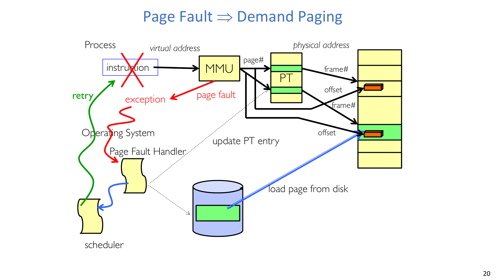

:::tip Key Question: What happens on a write to a paged system?
**Question (original intent): Is virtual memory write-through or write-back?**

Answer:
- Virtual memory is treated as write-back in practice.
- Modified pages are tracked with dirty state.
- Dirty pages are written to backing store when evicted or during background cleaning.
:::

## 3. Why Virtual Memory Still Matters Today

Historically, paging addressed memory scarcity for multi-user systems. Today, even powerful systems still rely on virtual memory because:

- Programs have large but sparse footprints.
- Accesses follow locality (90-10 style behavior remains common).
- A large fraction of memory usage is shared or intermittently active.

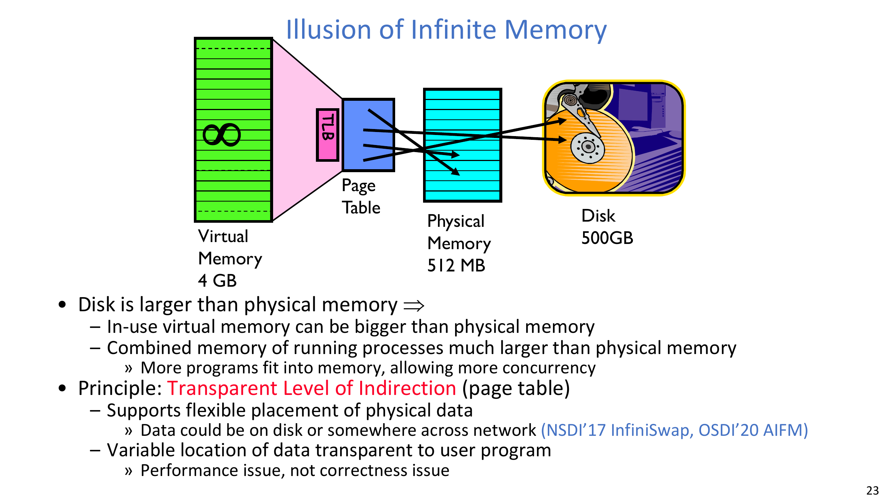

Modern virtual memory is not only about overcommit; it is also an abstraction for:

- stack growth,
- heap growth,
- `fork` with copy-on-write,
- lazy `exec` loading,
- and `mmap`-based sharing.

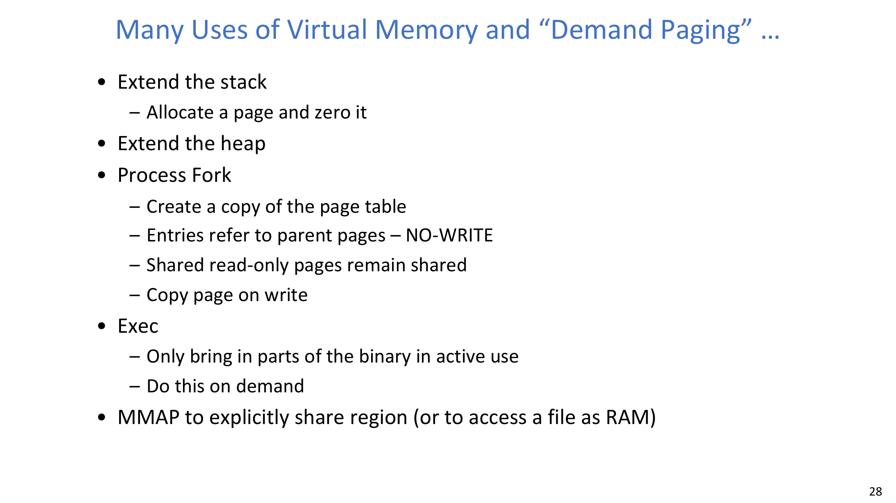

## 4. Building Process VAS and Backing Store

A process virtual address space (VAS) contains regions such as code, data, heap, and stack. Resident pages are mapped to physical frames; non-resident pages must be locatable on disk.

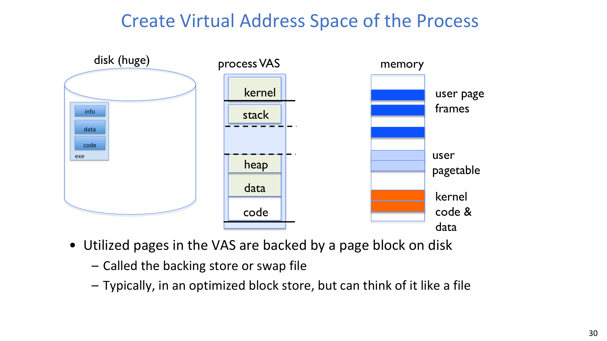

The OS therefore maintains both:

- hardware-consumed page-table state for resident mappings, and
- software metadata for locating non-resident pages in backing storage.

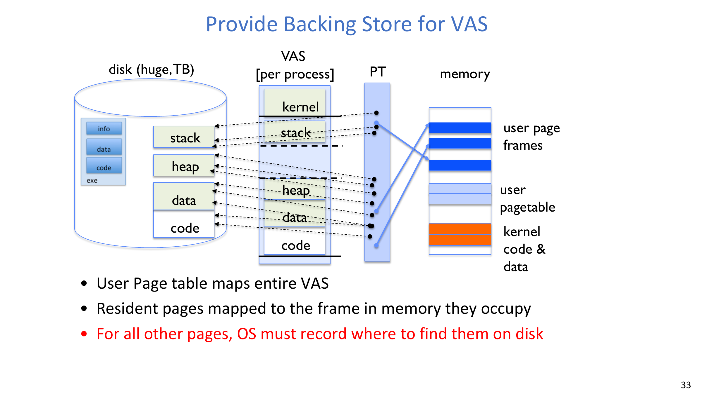

A conceptual API shown in lecture form is:

`FindBlock(PID, page#) -> disk_block`

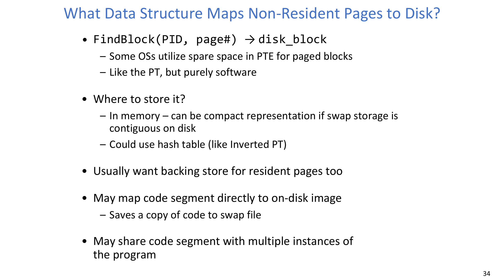

:::warn Key Question: Where should non-resident mapping metadata live?
**Question (original intent): Is this metadata in PTEs, external structures, or both?**

Answer:
- Different OSes use different mixtures.
- Some encode disk-location hints in spare PTE bits.
- Others keep compact software tables (e.g., arrays/hash-based structures).
- A common optimization is to map executable code pages directly to file-backed images.
:::

## 5. Page Fault Handling Pipeline

When a thread touches a non-resident page, the OS executes a standard fault pipeline:

1. Trap on invalid/non-resident translation.
2. Determine whether the access is legal and recoverable.
3. Find backing-store location for the target page.
4. Obtain a free frame (or evict a victim first).
5. If victim is dirty, schedule/write back to disk.
6. Read target page from disk into the frame.
7. Update PTE and invalidate/update relevant TLB state.
8. Reschedule and retry the original instruction.

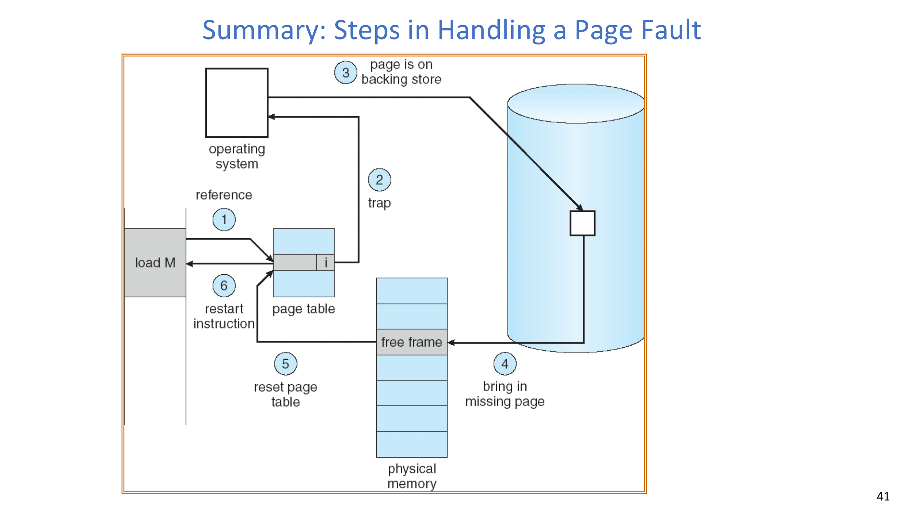

:::tip Key Question: Why can the faulting instruction be retried safely?
**Question (original intent): How do we avoid violating program semantics?**

Answer:
- Page fault is synchronous to the faulting instruction.
- The architectural state is preserved so the instruction can restart.
- After mapping is fixed, retry executes as if data had been resident all along.
:::

## 6. Free Frames, Background Cleaning, and Pressure Control

The lecture emphasizes practical frame management under memory pressure:

- Keep a free-frame list.
- Run background cleaners/reapers when free memory drops.
- Prefer pre-cleaning stale dirty pages to reduce stall during hard faults.
- As last resort, perform synchronous eviction first.

This is where memory management and scheduling intersect: the OS allocates both CPU time and memory residency quotas.

:::remark Key Question: How many frames should each process get?
**Question (original intent): Should allocation optimize utilization, fairness, or priority?**

Answer:
- There is no single static answer.
- The OS balances throughput, latency, fairness, and priority policy.
- Working-set behavior and replacement policy strongly influence this allocation.
:::

## 7. Working Set Model and Miss Taxonomy

Working set model: a program transitions through phases, each with a different active subset of pages.

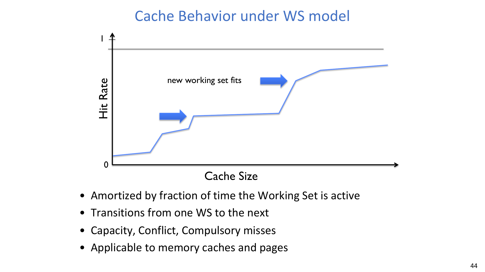

Consequences:

- Hit rate changes with cache size and phase boundaries.
- A system may look stable overall while suffering temporary bursts during phase shifts.

Miss categories discussed in this context:

- Compulsory miss: first touch, never loaded before.
- Capacity miss: active set exceeds available memory.
- Conflict miss: largely absent in fully-associative VM mapping.
- Policy miss: eviction choice was poor.

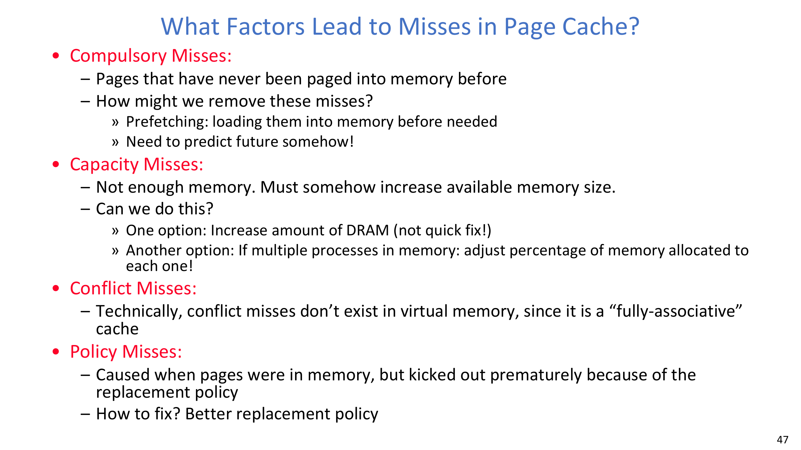

## 8. Demand Paging Cost Model (EAT)

The same cache math applies to paging.

$$
\text{EAT} = H\cdot T_h + M\cdot T_m,\quad H+M=1
$$

$$
\text{EAT} = T_h + M\cdot (T_m - T_h)
$$

In the lecture example:

$$
T_h = 200\,\text{ns},\quad T_m - T_h = 8\,\text{ms}
$$

$$
p = P(\text{miss}),\; 1-p=P(\text{hit})
$$

$$
\text{EAT} = 200\,\text{ns} + p\cdot 8\,\text{ms}
= 200\,\text{ns} + p\cdot 8{,}000{,}000\,\text{ns}
$$

If one access out of 1000 faults ($p=10^{-3}$), then:

$$
\text{EAT} = 8.2\,\mu s
$$

This is roughly a 40x slowdown versus a pure 200 ns access baseline.

If slowdown must be less than 10%:

$$
\text{EAT} < 200\,\text{ns}\times 1.1 \Rightarrow p < 2.5\times 10^{-6}
$$

Equivalent target fault rate is about one page fault per 400,000 accesses.

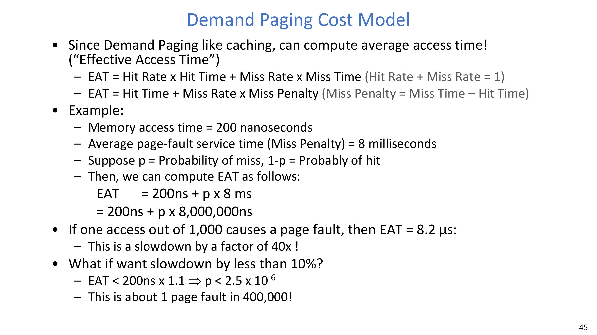

:::error Key Question: Why does such a tiny miss probability matter?
**Question (original intent): Why can page faults dominate performance even when they are rare?**

Answer:
- Fault service time is orders of magnitude larger than DRAM hit time.
- Even tiny miss rates inject large tail latency and inflate average time.
- Therefore OS design aggressively minimizes avoidable faults.
:::

## 9. Replacement Policies and Practical Tradeoffs

The lecture revisits classic replacement policies:

- FIFO: simple, but can evict heavily reused pages.
- RANDOM: cheap and robust, but unpredictable.
- MIN: theoretical optimum, requires future knowledge.
- LRU: practical heuristic that approximates MIN using recency.

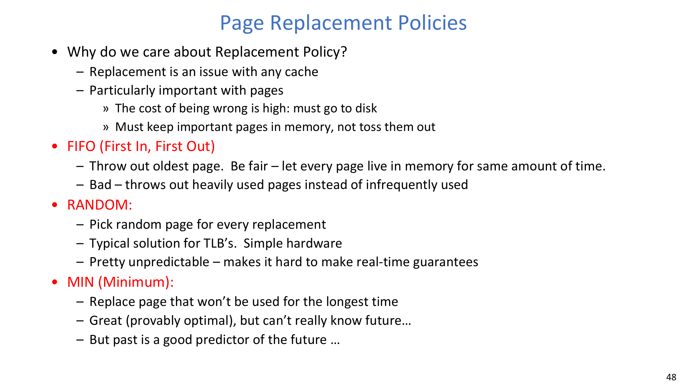

LRU intuition and list-based implementation:

- Move touched page to head.
- Evict from tail as least recently used.

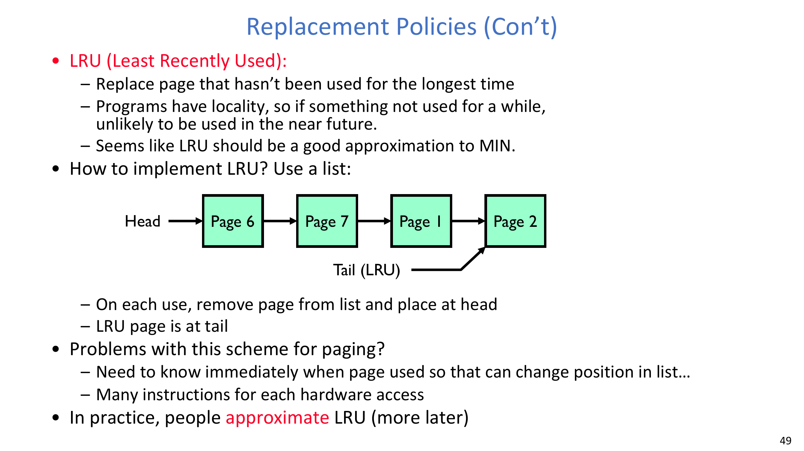

In real systems, exact LRU is expensive; kernels often use approximations with hardware reference bits and periodic aging.

## 10. End-to-End Mental Checklist

When analyzing paging behavior in a real system, always ask:

1. Is the fault compulsory, capacity, or policy-driven?
2. Is backing-store lookup path efficient?
3. Is frame supply stable (free list + cleaner health)?
4. Is the replacement policy aligned with workload locality?
5. Is measured fault rate low enough for required latency SLO?

## 11. Exam Review

### 11.1 Must-Know Definitions

- **Demand paging**: DRAM is managed as a cache for disk-backed virtual pages.
- **Page fault**: synchronous trap raised when translation/protection state requires OS intervention.
- **Backing store**: on-disk location used to recover non-resident virtual pages.
- **Working set**: currently active subset of pages during a program phase.
- **Policy miss**: miss caused by suboptimal replacement, not first-touch or pure capacity.
- **EAT**: effective average memory access time under hit/miss probabilities.

### 11.2 High-Value Short-Answer Templates

1. **Why is demand paging effective?**  
   It keeps hot pages in DRAM, leaves cold pages on disk, and preserves a large contiguous virtual address abstraction.
2. **What are the core page-fault handling steps?**  
   Trap -> validate -> locate on disk -> obtain frame/evict -> I/O in -> update mappings/TLB -> retry instruction.
3. **Why can a 0.1% page-fault rate still be expensive?**  
   Fault penalties are many orders larger than DRAM hit time, so rare misses can dominate EAT.
4. **Why is MIN not implementable directly?**  
   It needs future knowledge of accesses; practical systems approximate with recency/frequency heuristics.

### 11.3 Common Pitfalls

- Treating every invalid PTE as fatal instead of distinguishing legal demand-paging states.
- Ignoring dirty-page writeback cost when estimating miss penalty.
- Confusing capacity misses with policy misses.
- Assuming exact LRU is always feasible in production kernels.
- Forgetting that paging policy and CPU scheduling interact under pressure.

### 11.4 Self-Check

:::tip Self-check 1
Given $T_h=200\,\text{ns}$ and miss penalty $8\,\text{ms}$, estimate EAT at $p=10^{-4}$ and compare with $p=10^{-3}$.
:::

:::tip Self-check 2
A workload alternates between two large working sets that each almost fill memory. What miss pattern do you expect near phase boundaries, and why?
:::

:::tip Self-check 3
If free-frame pressure rises, what coordinated changes across cleaner, replacement, and scheduler reduce user-visible latency spikes?
:::
